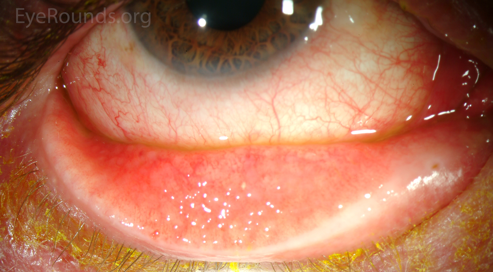
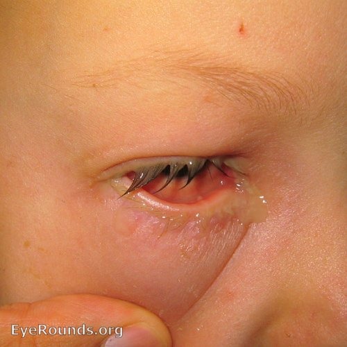
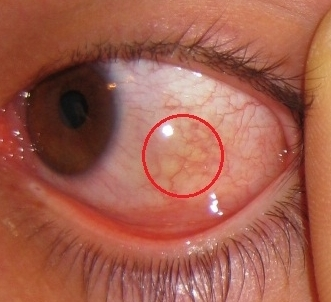
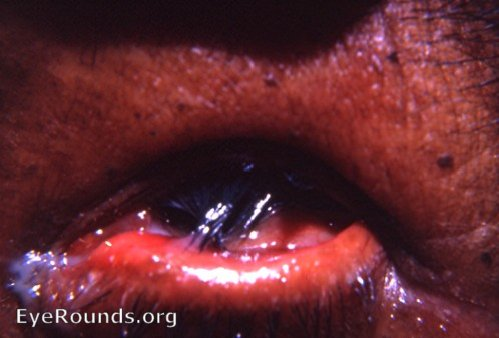
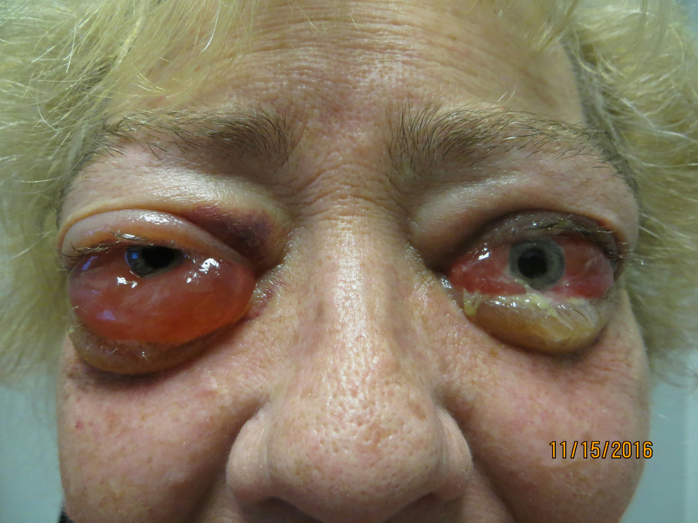
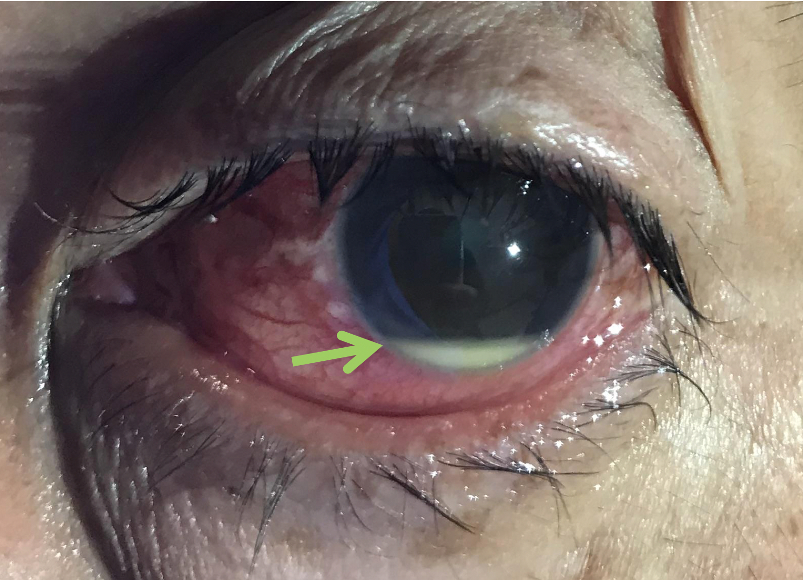

# OLHO VERMELHO E CONJUNTIVITES

Quando um paciente entra no seu consultório ou na emergência com um "olho vermelho", a primeira coisa que você deve fazer não é pegar o colírio. É pensar. O olho vermelho é um dos sinais mais inespecíficos da medicina, variando de uma simples noite mal dormida a uma emergência que pode levar à cegueira irreversível em poucas horas.

Como professor, vejo muitos alunos decorando nomes de colírios, mas falhando no básico: a triagem clínica. Para a sua prova de residência e para a sua vida prática, o raciocínio deve ser binário inicialmente: este olho vermelho "ameaça a visão" ou é apenas uma "irritação de superfície"?

Neste material, vamos dissecar as conjuntivites e os diagnósticos diferenciais do olho vermelho, focando no que as bancas realmente cobram e no que você não pode deixar passar.

## A Lógica do Diagnóstico Diferencial

Antes de falarmos das conjuntivites propriamente ditas, precisamos separar o "joio do trigo". O erro clássico que o Dr. Will sempre aponta nas discussões de caso é tratar toda hiperemia conjuntival como conjuntivite infecciosa.

Para não errar, use três perguntas de ouro:

- **Há dor ocular verdadeira?** (Cuidado: ardor e sensação de areia não são dor profunda).

- **Houve queda da acuidade visual?** (Se o paciente não enxerga bem, o problema não é apenas na conjuntiva).

- **Existe fotofobia importante?**

Se a resposta for "sim" para qualquer uma dessas, pare tudo. Você provavelmente está diante de uma Uveíte, um Glaucoma Agudo ou uma Ceratite. Se as respostas forem "não", entramos no campo das conjuntivites e alterações da superfície ocular.

### O Sinal do "Pulo do Gato": Hiperemia Perilimbar

Observe onde o olho está mais vermelho. Se a vermelhidão for difusa e aumentar conforme se afasta da íris (em direção aos fórnices), pensamos em conjuntivite. Se a vermelhidão for mais intensa ao redor da córnea (hiperemia perilimbar ou injeção ciliar), isso é um sinal de alerta gravíssimo para doenças intraoculares ou corneanas. As bancas adoram colocar "hiperemia perilimbar" no enunciado para ver se você vai marcar conjuntivite por impulso. Não caia nessa.

## Conjuntivites: O Trio Principal

A conjuntivite é a inflamação da conjuntiva, aquela membrana transparente que recobre a esclera (a parte branca). Didaticamente, dividimos nas três causas que despencam em provas: Viral, Bacteriana e Alérgica.

### 1. Conjuntivite Viral

É a causa mais comum de olho vermelho no mundo. O agente principal é o **Adenovírus**.

**Fisiopatologia e Porquê:**
O vírus infecta as células epiteliais da conjuntiva, gerando uma resposta inflamatória aguda. Frequentemente, o paciente teve uma Infecção das Vias Aéreas Superiores (IVAS) recente. Por que isso importa? Porque o vírus viaja pelo ducto nasolacrimal ou por autoinoculação.

**Quadro Clínico:**

- Início unilateral que progride para o outro olho em 24-48h.

- Secreção **aquosa** (serosa).

- Sensação de corpo estranho.

- **Linfonodo pré-auricular palpável e doloroso** (Dica de ouro: se a questão mencionar linfonodo, pense em viral!).

- Presença de folículos no tarso inferior (pequenas elevações translúcidas).

*Figura 1: Folículos conjuntivais em conjuntivite viral por Adenovírus. Observe as elevações translúcidas ("grãos de arroz") na conjuntiva tarsal inferior, acompanhadas de hiperemia.*

**Tratamento:**
Aqui o erro comum é prescrever antibiótico "por precaução". Segundo as diretrizes do Conselho Brasileiro de Oftalmologia (CBO), o tratamento é **sintomático**:

- Compressas frias (ajudam na vasoconstrição e conforto).

- Higiene ocular com soro fisiológico 0,9%.

- Colírios lubrificantes (sem conservantes, se possível).

- Afastamento das atividades (altamente contagioso por até 14 dias).

### 2. Conjuntivite Bacteriana

Menos comum que a viral em adultos, mas muito frequente em crianças.

**Etiologia:**

- *Staphylococcus aureus* (mais comum em adultos).

- *Streptococcus pneumoniae* e *Haemophilus influenzae* (comuns em crianças).

**Quadro Clínico:**

- Secreção **mucopurulenta** abundante (o paciente acorda com o olho "colado").

- Hiperemia difusa.

- Ausência de linfonodo pré-auricular (geralmente).

*Figura 2: Conjuntivite bacteriana com secreção mucopurulenta abundante. O olho "colado" pela manhã é a queixa clássica do paciente.*

**Tratamento:**
Diferente da viral, aqui usamos antibióticos tópicos para reduzir o tempo de doença e a transmissão.

- Colírios de amplo espectro: Tobramicina 0,3% ou Ciprofloxacino 0,3%, 1 gota de 4/4h ou 6/6h por 7 a 10 dias.

- Higiene das pálpebras para remover as crostas.

### 3. Conjuntivite Alérgica

O segredo aqui é uma única palavra: **PRURIDO** (coceira). Se não coça, dificilmente é alérgica.

**Fisiopatologia:**
Reação de hipersensibilidade tipo I mediada por IgE. A exposição ao alérgeno (pólen, ácaro, pelos de animais) causa a desgranulação de mastócitos na conjuntiva, liberando histamina.

**Quadro Clínico:**

- Prurido intenso.

- Lacrimejamento.

- Edema conjuntival (Quemose) – o olho parece uma "gelatina".

*Figura 3: Quemose (edema conjuntival) em conjuntivite alérgica grave. A conjuntiva fica edemaciada e transparente, formando uma "bolha de gelatina" sobre a esclera.*

- Papilas no tarso superior (diferente dos folículos da viral).

**Tratamento:**

- **Não farmacológico:** Compressas frias (aliviam o prurido) e evitar o alérgeno.

- **Farmacológico:**

- Estabilizadores de mastócitos (ex: **Cromoglicato Dissódico**). Por que usá-los? Eles impedem a desgranulação futura, sendo ótimos para manutenção.

- Anti-histamínicos tópicos (ex: Olopatadina) para a fase aguda.

- **Cuidado:** Nunca prescreva corticoides tópicos sem experiência. Eles podem causar catarata e glaucoma se usados inadvertidamente. As bancas testam se você sabe desse perigo.

### Tabela 1: Diagnóstico Diferencial das Conjuntivites

| Característica | Viral | Bacteriana | Alérgica |
| --- | --- | --- | --- |
| **Secreção** | Aquosa/Serosa | Mucopurulenta | Serosa/Mucoide |
| **Prurido** | Leve/Ausente | Ausente | **Intenso** |
| **Linfonodo** | Comum (Pré-auricular) | Raro | Ausente |
| **Lateralidade** | Bilateral (sequencial) | Unilateral ou Bilateral | Sempre Bilateral |
| **Achado Tarsal** | Folículos | Reação inespecífica | Papilas |
| **História Prévia** | IVAS recente | Contato com infectados | Atopia (Rinite/Asma) |

## Tracoma: A Doença da Cegueira Evitável

O Tracoma é um tema "queridinho" de provas de Saúde Pública e Oftalmologia. É causado pela *Chlamydia trachomatis* (sorotipos A, B, Ba e C). É a principal causa de cegueira infecciosa no mundo.

**Por que o Tracoma cega?**
Não é a infecção aguda que cega, mas as cicatrizes. Infecções repetidas causam cicatrização da conjuntiva tarsal, o que leva ao entrópio (a pálpebra vira para dentro) e triquíase (os cílios raspam na córnea). Essa raspagem crônica causa opacificação corneana.

**Tratamento (Pérola de Prova):**

*Figura 4: Triquíase tracomatosa. As infecções repetidas pela Chlamydia causam cicatrizes na conjuntiva tarsal → entrópio → os cílios raspam a córnea → opacificação e cegueira.*

O Ministério da Saúde e a OMS preconizam o tratamento sistêmico para interromper a cadeia de transmissão na comunidade.

- **Primeira escolha:** **Azitromicina 20 mg/kg** em dose única (máximo de 1g).

- **Por que dose única?** Para garantir a adesão em áreas endêmicas.

- **Exceções (Cuidado!):** Gestantes no 1º trimestre e crianças menores de 6 meses **não** devem receber Azitromicina. Nestes casos, usa-se Eritromicina por 14 a 21 dias.

No MedEvo, sempre reforçamos a estratégia **SAFE** da OMS para o controle do Tracoma:

- **S**urgery (Cirurgia para triquíase).

- **A**ntibiotics (Antibióticos para tratar a infecção).

- **F**acial cleanliness (Limpeza facial).

- **E**nvironmental improvement (Melhoria do saneamento).

## Chlamydia Trachomatis no Adulto (Conjuntivite de Inclusão)

Diferente do Tracoma, a conjuntivite de inclusão do adulto é causada pelos sorotipos D a K (os mesmos da DST).

- **Suspeita:** Conjuntivite que dura mais de 3 semanas (crônica) e não responde a antibióticos comuns.

- **Quadro:** Folículos grandes, secreção mucopurulenta leve.

- **Tratamento:** Azitromicina 1g VO dose única + tratamento do parceiro sexual.

## Blefarite: A Inflamação da Borda Palpebral

Muitas vezes o paciente chega com "olho vermelho", mas o problema está na "moldura" do olho: as pálpebras.

**Fisiopatologia:**
A blefarite pode ser estafilocócica ou seborreica. Na estafilocócica (*Staphylococcus aureus*), as toxinas bacterianas irritam a superfície ocular. Na seborreica, há disfunção das glândulas de Meibomius (que produzem a parte lipídica da lágrima).

**Quadro Clínico:**

- Pálpebras edemaciadas e hiperemiadas.

- Bordas ulceradas e com crostas (colaretes ao redor dos cílios).

- Sensação de queimação e corpo estranho.

**Tratamento:**

- **Higiene palpebral:** É o pilar principal. Limpeza com shampoo infantil (que não arde) diluído ou produtos específicos para remover as crostas.

- Pomadas de antibiótico (ex: Terramicina) na borda palpebral em casos graves.

## Síndrome do Olho Seco (Disfunção do Filme Lacrimal)

Este é um diagnóstico que você fará todos os dias. Com o aumento do uso de telas, a prevalência explodiu.

**O Raciocínio Clínico:**
O paciente queixa-se de ardor, sensação de areia e, curiosamente, **embaçamento visual que melhora ao piscar**. Por que melhora ao piscar? Porque a lágrima é a primeira lente do olho. Se o filme lacrimal está instável ou "buraco", a imagem fica turva. Ao piscar, o paciente redistribui a lágrima e a visão clareia momentaneamente.

**Diagnóstico:**

- Teste de Schirmer (mede a produção de lágrima com uma fita de papel filtro). Valores < 10mm em 5 min sugerem deficiência.

- Tempo de Ruptura do Filme Lacrimal (BUT): < 10 segundos é patológico.

**Tratamento:**

- Colírios lubrificantes (lágrimas artificiais).

- Higiene ambiental (evitar ar-condicionado direto no rosto).

- Pausas no uso de telas.

## Oftalmopatia de Graves: O Olho no Hipertireoidismo

A Doença de Graves é uma patologia autoimune onde anticorpos (TRAb) atacam não só a tireoide, mas também os tecidos orbitários.

**Por que o olho "pula para fora"?**
Os fibroblastos orbitários possuem receptores de TSH. O ataque autoimune causa inflamação, acúmulo de glicosaminoglicanos e edema dos músculos extraoculares. Como a órbita é uma cavidade óssea rígida, o conteúdo expandido empurra o globo ocular para frente (**Proptose** ou Exoftalmia).

**Fatores de Risco e Sinais:**

- **Tabagismo:** É o principal fator de risco modificável. O cigarro aumenta drasticamente a chance de progressão da doença ocular.

- **Sinais:** Retração palpebral (sinal de Dalrymple), diplopia (visão dupla por aprisionamento dos músculos), lacrimejamento e hiperemia conjuntival sobre as inserções musculares.

*Figura 6: Oftalmopatia de Graves. Proptose bilateral marcante com exposição escleral superior ("sinal de Dalrymple"), edema periorbitário e quemose. O tabagismo é o principal fator de risco para progressão.*

**Tratamento:**

- Controle rigoroso da função tireoidiana.

- **Cessação do tabagismo** (obrigatório!).

- Selênio (em casos leves).

- Corticoterapia sistêmica ou radioterapia orbitária em casos moderados/graves.

- Cirurgia de descompressão em casos de ameaça ao nervo óptico.

### Tabela 2: Diagnóstico Diferencial do Olho Vermelho Grave

| Doença | Dor | Acuidade Visual | Pupila | Outros Sinais |
| --- | --- | --- | --- | --- |
| **Conjuntivite** | Desconforto | Normal | Normal | Secreção abundante |
| **Uveíte Anterior** | Moderada | Diminuída | **Miose** (pupila pequena) | Fotofobia, Fenômeno de Tyndall |
| **Glaucoma Agudo** | **Intensa** | Muito Baixa | **Midríase média** | Olho "pétreo", náuseas, halos |
| **Ceratite** | Moderada/Forte | Diminuída | Normal/Miose | Opacidade na córnea, teste da fluoresceína + |

## Emergências que você não pode ignorar

Se um paciente chegar com olho vermelho e você notar qualquer um dos itens abaixo, o diagnóstico de "conjuntivite" está descartado até que se prove o contrário:

- **Hiperemia Perilimbar:** Já falamos, é sinal de inflamação profunda.

- **Alteração Pupilar:** Se a pupila está em miose (pequena), pense em Uveíte. Se está em midríase média e fixa (parada), pense em Glaucoma Agudo de Ângulo Fechado.

- **Edema de Córnea:** A córnea perde o brilho e fica com aspecto "embaçado" ou leitoso.

- **Hipópio:** Nível de pus na câmara anterior (espaço entre a íris e a córnea). Isso é uma emergência oftalmológica absoluta!

*Figura 5: Hipópio. Note o nível branco de células inflamatórias (pus) depositado na porção inferior da câmara anterior. É uma EMERGÊNCIA que exige encaminhamento imediato.*

### Exemplo Clínico 1:

Paciente, 65 anos, chega à UPA com dor intensa em olho direito, iniciada há 2 horas após sair do cinema. Relata visão de "halos coloridos" ao redor das luzes e náuseas. Ao exame: olho muito vermelho, pupila em midríase média e não reagente, córnea opaca.
**O que é?** Glaucoma Agudo. O ambiente escuro (cinema) causou midríase, que em um paciente predisposto, fechou o ângulo de drenagem do humor aquoso. A pressão subiu rápido, causando a dor e o edema de córnea (halos).

### Exemplo Clínico 2:

Paciente, 24 anos, com história de espondilite anquilosante, apresenta olho vermelho unilateral, dor moderada e fotofobia intensa. Não há secreção. Pupila do olho afetado está menor que a do olho sadio.
**O que é?** Uveíte Anterior Aguda. A associação com doenças autoimunes (HLA-B27) é clássica. A miose ocorre por espasmo do esfíncter pupilar devido à inflamação.

## Tratamento Farmacológico: Doses e Escolhas

Vamos consolidar as condutas para você não titubear na hora da prova.

### Antibióticos Tópicos (Conjuntivite Bacteriana)

- **Tobramicina 0,3%:** 1 gota de 4/4h ou 6/6h por 7 dias. É a droga de escolha inicial em muitos protocolos por ser barata e eficaz.

- **Ciprofloxacino ou Ofloxacino 0,3%:** Reservados para casos mais graves ou suspeita de resistência.

- **Cloranfenicol:** Muito usado no passado, mas evitado hoje pelo risco (embora raro) de anemia aplástica idiossincrática.

### Antialérgicos e Estabilizadores

- **Cromoglicato Dissódico 2% ou 4%:** 1 gota 4x ao dia. Lembrar que ele demora alguns dias para fazer efeito pleno (profilático).

- **Olopatadina 0,1% ou 0,2%:** Ação dupla (anti-histamínico + estabilizador). É o padrão-ouro atual para conjuntivite alérgica sazonal.

### Tracoma (Protocolo Ministério da Saúde)

- **Azitromicina:** 20 mg/kg em dose única (máximo 1g).

- **Contatos domiciliares:** Devem ser examinados e, se houver sinais de tracoma inflamatório, tratados também. Em áreas de alta prevalência (>10% de tracoma inflamatório em crianças), trata-se toda a comunidade (tratamento em massa).

### Tabela 3: Resumo de Condutas Terapêuticas

| Condição | Conduta de Primeira Escolha | Observação Importante |
| --- | --- | --- |
| **Conjuntivite Viral** | Compressas frias + Lubrificantes | Altamente contagiosa (lavar mãos!) |
| **Conjuntivite Bacteriana** | Tobramicina 0,3% tópica | Higiene das pálpebras é essencial |
| **Conjuntivite Alérgica** | Olopatadina ou Cromoglicato | Nunca usar corticoide sem fenda |
| **Tracoma** | Azitromicina 20mg/kg VO (Dose Única) | Evitar Azitromicina no 1º tri gestação |
| **Blefarite** | Higiene palpebral (Shampoo neutro) | Tratamento é crônico e recorrente |
| **Olho Seco** | Lágrimas artificiais (sem conservante) | Avaliar fatores ambientais e telas |

## O "Porquê" das Complicações

Muitas vezes a prova pergunta sobre a complicação de uma conjuntivite mal tratada.

**Pseudomembranas e Membranas:**
Na conjuntivite viral grave (Adenovírus), pode haver formação de membranas de fibrina no tarso. Se não removidas, podem causar cicatrizes conjuntivais.

**Infiltrados Subepiteliais:**
Sabe aquele paciente que teve conjuntivite viral, o olho desinflamou, mas a visão continuou um pouco turva? São os infiltrados subepiteliais. É uma reação imunológica aos antígenos virais na córnea. Aqui, o oftalmologista pode usar corticoide tópico com cautela.

**Perfuração Corneana:**
Em conjuntivites bacterianas hiperagudas (especialmente por *Neisseria gonorrhoeae*), a bactéria consegue invadir o epitélio íntegro da córnea e causar perfuração em menos de 24 horas. É uma emergência que exige internação e antibiótico sistêmico (Ceftriaxona).

## Raciocínio Clínico e Erros Comuns

Como professor, vejo três erros que reprovam candidatos:

- **Achar que todo olho vermelho com secreção é bacteriano.** Lembre-se: a viral também pode ter um pouco de secreção esbranquiçada pela manhã. O que define a bacteriana é a secreção purulenta (amarela/verde) que se refaz rapidamente após a limpeza.

- **Ignorar o tabagismo na Doença de Graves.** As bancas amam perguntar qual a medida mais importante para evitar a progressão da oftalmopatia. A resposta é parar de fumar, antes mesmo de tratar a tireoide.

- **Confundir folículo com papila.**

- **Folículos:** Acúmulos de tecido linfoide (parecem grãos de arroz translúcidos). Causas: Viral, Chlamydia, Tóxica.

- **Papilas:** Vasos centrais com edema ao redor (parecem "pedras de calçamento"). Causa: Alérgica, Uso de lentes de contato, Próteses.

## Pontos-Chave para Prova

- **Tracoma:** Tratamento padrão é Azitromicina 20 mg/kg (máx 1g) VO em dose única. Contraindicado em < 6 meses e gestantes do 1º trimestre (usar Eritromicina).

- **Conjuntivite Alérgica:** O sintoma cardeal é o prurido. O tratamento envolve compressas frias e estabilizadores de mastócitos (Cromoglicato).

- **Oftalmopatia de Graves:** Tabagismo é o principal fator de risco para gravidade. Sinais incluem proptose, retração palpebral e diplopia.

- **Olho Seco:** Embaçamento visual que melhora ao piscar é a dica clássica de prova. Tratamento com lubrificantes e higiene ambiental.

- **Blefarite:** Inflamação da borda palpebral, frequentemente por *S. aureus*. Caracteriza-se por crostas/colaretes nos cílios. Tratamento baseia-se em higiene palpebral.

- **Conjuntivite Viral:** Causa mais comum é o Adenovírus. Presença de linfonodo pré-auricular doloroso é patognomônico em questões de prova.

- **Sinais de Alerta (Red Flags):** Dor ocular real, queda de acuidade visual, fotofobia e hiperemia perilimbar.

- **Uveíte Anterior:** Cursa com miose e fotofobia. Frequentemente associada a doenças sistêmicas (Espondilite, Artrite Reumatoide Juvenil).

- **Glaucoma Agudo:** Midríase média paralítica, dor intensa ("olho pétreo") e visão de halos.

- **Conjuntivite por Chlamydia (Adulto):** Suspeitar em quadros crônicos (>3 semanas) que não respondem a colírios comuns. Tratar parceiro.

- **Cromoglicato Dissódico:** É um estabilizador de mastócitos, usado na manutenção da conjuntivite alérgica.

- **Higiene Ocular:** Em qualquer conjuntivite infecciosa, a limpeza com soro fisiológico e a lavagem das mãos são fundamentais para o controle.

- **Dose de Azitromicina no Tracoma:** Memorize o valor de 20 mg/kg em dose única. Bancas trocam por doses fracionadas para confundir.

- **O que NÃO fazer:** Nunca prescrever corticoide tópico para olho vermelho sem diagnóstico definitivo por um oftalmologista (risco de perfuração em ceratite por Herpes ou Glaucoma/Catarata iatrogênica). ⚠️

Este guia cobre a vasta maioria das questões de residência sobre o tema. Lembre-se sempre de procurar a "palavra-chave" no enunciado: se diz "coceira", vá para alérgica; se diz "linfonodo", vá para viral; se diz "fuma 2 maços/dia e tem bócio", vá para Graves. O sucesso na prova de Oftalmologia depende mais do seu raciocínio clínico do que da decoreba de nomes comerciais de colírios.

 Cópia offline para consulta pessoal.
 Fonte original:
 [https://www.medevo.com.br/material-apoio/ler/b9fdd1d5-4e68-4c59-a408-2a845b56129a](https://www.medevo.com.br/material-apoio/ler/b9fdd1d5-4e68-4c59-a408-2a845b56129a)
