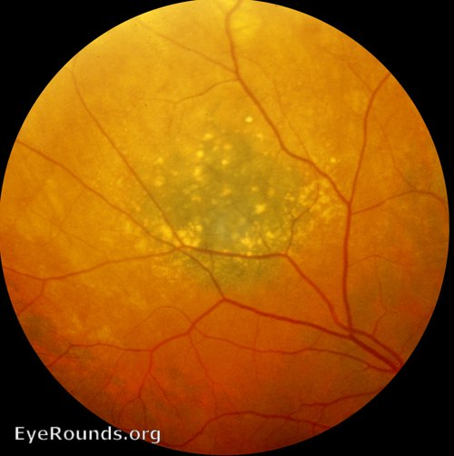
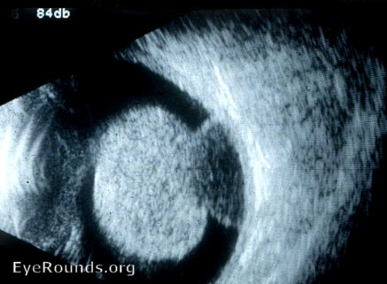
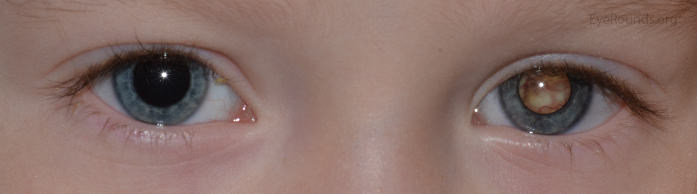
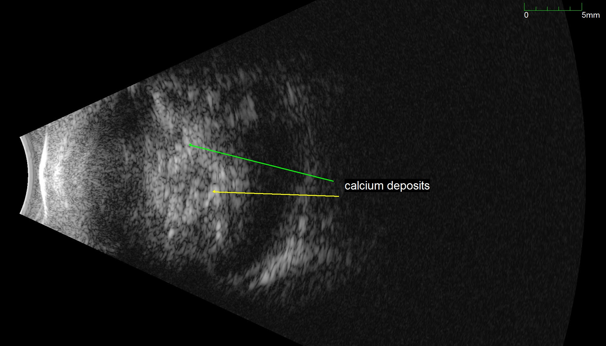
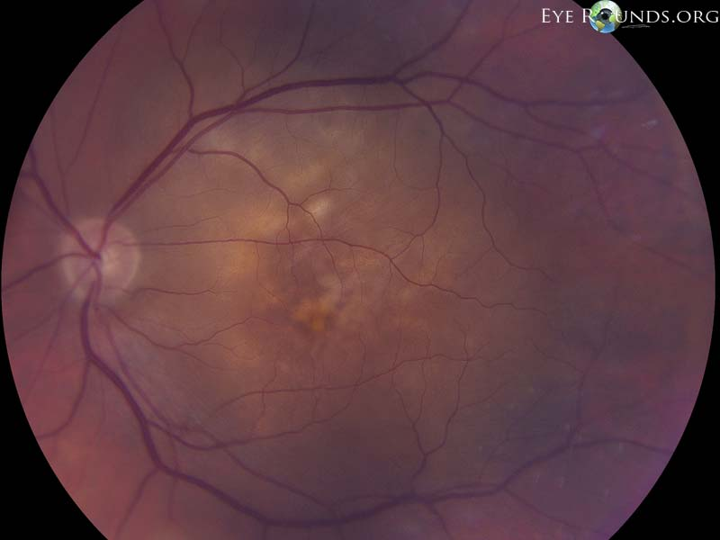
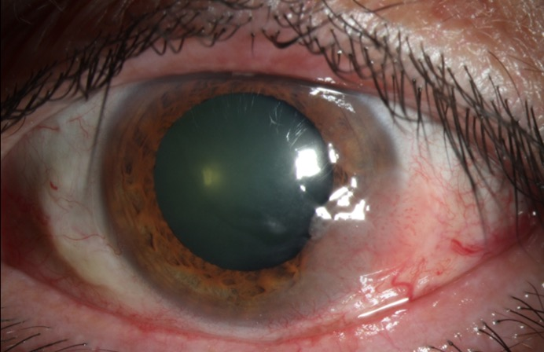

# ONCOLOGIA OCULAR

A oncologia ocular é uma das áreas mais desafiadoras da oftalmologia porque, aqui, o nosso maior objetivo não é apenas preservar a visão, mas sim salvar a vida do paciente. Nas provas de residência e título de especialista (CBO), os examinadores focam intensamente em três pilares: diagnóstico diferencial entre lesões benignas e malignas, critérios de tratamento baseados em grandes estudos (como o COMS) e o manejo do retinoblastoma na infância.

Vamos começar pelo tumor que você mais verá em consultório e em questões de prova: o nevo de coroide e sua diferenciação para o melanoma.

## Nevo de Coroide e o Risco de Malignização

O nevo de coroide é a lesão pigmentada intraocular mais comum, presente em cerca de 5% a 10% da população branca. Na maioria das vezes, é um achado incidental. No entanto, o desafio clínico é identificar qual nevo tem potencial de se transformar em um melanoma de coroide.

Por que um nevo se torna perigoso? A fisiopatologia envolve o acúmulo de mutações genéticas que levam à proliferação descontrolada de melanócitos. Quando essa lesão começa a crescer, ela causa estresse no epitélio pigmentado da retina (EPR) sobrejacente, o que gera sinais clínicos que conseguimos ver no exame de fundo de olho.

Para facilitar a memorização dos sinais de risco, utilizamos o mnemônico clássico "TFSOM-DIM" (To Find Small Ocular Melanoma Doing Imaging). Se você decorar isso, você acerta 80% das questões sobre diagnóstico diferencial de lesões melanocíticas.

### Critérios de Risco (TFSOM-DIM)

- T (Thickness): Espessura maior que 2,0 mm no ultrassom.

- F (Fluid): Presença de fluido sub-retiniano (descolamento de retina seroso).

- S (Symptoms): Sintomas visuais como flashes (fotopsias) ou baixa visual.

- O (Orange pigment): Presença de pigmento alaranjado (lipofuscina) sobre a lesão.

- M (Margin): Margem da lesão encostando ou a menos de 3,0 mm do disco óptico.

- D (Drusen): Ausência de drusas (drusas indicam que a lesão é antiga e crônica, logo, mais provável de ser um nevo benigno).

- IM (Imaging): Imagem com "hollow" (vazio) acústico no ultrassom.

*Figura 1: Nevo de coroide com drusas em sua superfície. A presença de drusas é um sinal tranquilizador (fator D negativo no TFSOM-DIM), pois indica que a lesão está ali há muito tempo sem crescer.*

Cuidado: Muitos alunos acham que a presença de drusas é um sinal ruim. É o contrário. As drusas levam anos para se formar sobre um nevo. Se elas estão lá, a lesão é estável. O melanoma cresce rápido demais para permitir a formação de drusas.

## Melanoma de Coroide

O melanoma de coroide é o tumor primário intraocular maligno mais comum em adultos. Ele se origina dos melanócitos da úvea (coroide, corpo ciliar ou íris). É uma doença de adultos, com pico de incidência por volta dos 60 anos, e é raríssimo em negros.

### Quadro Clínico e Diagnóstico

O paciente pode ser assintomático ou apresentar perda de campo visual, fotopsias ou moscas volantes. No exame de fundo de olho, vemos uma massa elevada, geralmente pigmentada (melanótica), mas que pode ser amelanótica em 15% dos casos.

O diagnóstico é essencialmente clínico e ultrassonográfico. Não fazemos biópsia de rotina em tumores intraoculares suspeitos de melanoma pelo risco de disseminação extraocular e porque os exames de imagem são muito precisos.

No ultrassom (Ecografia), que é o padrão-ouro para diagnóstico e acompanhamento, buscamos a tríade clássica:

- Formato em cogumelo ou "botão de colarinho" (quando o tumor rompe a membrana de Bruch).

- Baixa a média refletividade interna no modo A (devido à homogeneidade celular do tumor).

- Escavação coroidiana e sombreamento orbital no modo B.

*Figura 2: Ecografia Modo B de um Melanoma de Coroide. Note o formato clássico em "cogumelo", que ocorre quando o tumor cresce e rompe a membrana de Bruch.*

Erro clássico de prova: Achar que o melanoma tem alta refletividade. Quem tem alta refletividade é o hemangioma de coroide, por causa das múltiplas interfaces vasculares. O melanoma é "denso" e homogêneo, por isso a refletividade é baixa.

### Classificação e o Estudo COMS

O Collaborative Ocular Melanoma Study (COMS) é a bíblia para o tratamento do melanoma de coroide. Ele dividiu os tumores pelo tamanho e definiu a conduta para cada grupo.

| Categoria | Definição (Diâmetro e Altura) | Conduta Recomendada |
| --- | --- | --- |
| Pequeno | Altura 1,0 a 3,0 mm; Diâmetro < 16 mm | Observação ou Braquiterapia |
| Médio | Altura 2,5 a 10,0 mm; Diâmetro < 16 mm | Braquiterapia ou Enucleação (resultados iguais) |
| Grande | Altura > 10,0 mm; Diâmetro > 16 mm | Enucleação (geralmente) |

Por que o COMS é tão importante? Porque ele provou que, para tumores médios, a braquiterapia (placa radioativa) tem a mesma sobrevida em 5 e 10 anos que a enucleação (retirada do olho). Isso mudou a história da oncologia ocular, permitindo salvar o globo ocular de milhares de pacientes.

No MedEvo, sempre reforçamos que a braquiterapia de Iodo-125 é a mais utilizada. Ela emite radiação gama que destrói o DNA das células tumorais.

### Prognóstico e Metástase

O melanoma de coroide tem uma característica peculiar: ele não se dissemina por via linfática (o olho não tem linfáticos). A disseminação é puramente hematogênica. O principal sítio de metástase é o fígado (mais de 90% dos casos).

Fatores de pior prognóstico:

- Tamanho do tumor (o fator isolado mais importante).

- Envolvimento do corpo ciliar (mais vascularizado, facilita escape celular).

- Citogenética: Monossomia do cromossomo 3 é o pior marcador genético.

- Mutação no gene BAP1.

## Retinoblastoma

Agora mudamos o foco para a oncologia pediátrica. O retinoblastoma é o tumor intraocular maligno mais comum da infância. Aqui, o tempo é o nosso maior inimigo. Um diagnóstico tardio significa não apenas a perda do olho, mas a morte da criança por invasão do sistema nervoso central via nervo óptico.

### Fisiopatologia e Genética

O retinoblastoma ocorre devido a uma mutação no gene RB1 (um gene supressor de tumor), localizado no cromossomo 13q14. Lembra da hipótese de Knudson (Two-hit hypothesis)?

- Forma Hereditária (40%): A criança já nasce com uma mutação em todas as células do corpo (primeiro "hit"). Uma mutação somática ocorre na retina (segundo "hit"). Geralmente é bilateral e multifocal.

- Forma Esporádica (60%): Ambas as mutações ocorrem em uma única célula da retina. Geralmente é unilateral e unifocal.

Dica de prova: Todo paciente com retinoblastoma bilateral tem a forma hereditária e pode transmitir para os filhos (autossômica dominante com alta penetrância). Além disso, esses pacientes têm risco aumentado de tumores secundários, como o osteossarcoma e o pinealoblastoma (o chamado retinoblastoma trilateral).

### Quadro Clínico

*Figura 3: Leucocoria clássica. Qualquer criança com reflexo pupilar alterado ("olho de gato") na fotografia com flash deve ser investigada com urgência para retinoblastoma.*

O sinal mais comum é a leucocoria (reflexo pupilar branco), presente em 60% dos casos. O segundo sinal mais comum é o estrabismo.

Por que o estrabismo ocorre? Porque o tumor geralmente acomete a mácula, impedindo a fixação central. Em uma criança com estrabismo de início recente, o exame de fundo de olho sob midríase é obrigatório.

Ao examinar, podemos ver dois padrões de crescimento:

- Endofítico: O tumor cresce para dentro do vítreo. Vemos massas esbranquiçadas "flutuando" (seeds vítreos).

- Exofítico: O tumor cresce para o espaço sub-retiniano, causando descolamento de retina exsudativo.

### Diagnóstico Diferencial da Leucocoria

Este é um tema quente em provas. Você precisa saber diferenciar o retinoblastoma de outras causas de "pupila branca".

| Doença | Características Diferenciais |
| --- | --- |
| Doença de Coats | Telangiectasias retinianas, exsudação maciça, sem calcificações. |
| PHPV (Persistência do Vítreo Primário) | Unilateral, olho microftálmico, processo ciliar alongado. |
| Retinopatia da Prematuridade | História de prematuridade e uso de oxigênio, bilateral. |
| Toxocaríase | Granuloma posterior ou periférico, tração vítrea, história de contato com cães. |

O ultrassom no retinoblastoma mostra uma massa com alta refletividade interna devido a calcificações. A presença de cálcio dentro de um tumor intraocular em uma criança menor de 3 anos é retinoblastoma até que se prove o contrário.

*Figura 4: USG de Retinoblastoma. A seta mostra os "spikes" hiper-refletivos da calcificação dentro do tumor, confirmando o diagnóstico de RB.*

### Classificação e Tratamento

Atualmente, utilizamos a Classificação Internacional do Retinoblastoma (ICRB), que vai de A a E.

- Grupo A: Pequenos tumores (< 3 mm), longe da fóvea e do disco. Tratamento: Laser (fotocoagulação) ou crioterapia.

- Grupo B: Tumores maiores ou com fluido sub-retiniano. Tratamento: Quimioterapia sistêmica (VEC: Vincristina, Etoposídeo e Carboplatina) para reduzir o tumor (quimioredução) seguida de tratamento local.

- Grupo C e D: Presença de sementes (seeds) vítreos ou sub-retinianos. Tratamento: Quimioterapia intra-arterial (via artéria oftálmica) tem sido a primeira escolha em centros de excelência, com ótimos resultados.

- Grupo E: Olho sem potencial visual, glaucoma neovascular, invasão de câmara anterior. Tratamento: Enucleação.

Contraindicação absoluta: Nunca, em hipótese alguma, faça uma biópsia por agulha fina (FNAB) em um caso suspeito de retinoblastoma. Isso rompe a barreira ocular e causa disseminação extraocular do tumor. O diagnóstico é clínico e por imagem.

## Metástases Intraoculares

Embora o melanoma seja o tumor primário mais comum, a metástase é, na verdade, o tumor maligno intraocular mais frequente no total. O olho é um destino comum para células cancerígenas devido à sua alta vascularização (especialmente a coroide).

### Sítios Primários

- Mulheres: O câncer de mama é a causa número um.

- Homens: O câncer de pulmão lidera.

Diferente do melanoma, que costuma ser uma massa única e pigmentada, a metástase geralmente se apresenta como múltiplas lesões, bilaterais, de cor amarelada (cremosas) e com formato mais "achatado" ou placóide.

*Figura 5: Metástase de coroide (neste caso, primário de pulmão). Note o aspecto multilobulado, cor amarelada/cremosa e associado a descolamento seroso. Mama e pulmão são os primários mais comuns.* Elas causam muito descolamento de retina seroso proporcional ao tamanho da lesão.

O tratamento foca na doença sistêmica (quimioterapia) e, localmente, podemos usar radioterapia externa ou braquiterapia se houver ameaça à visão.

## Hemangioma de Coroide

O hemangioma de coroide é um tumor vascular benigno, mas que pode causar perda visual grave por exsudação. Ele se apresenta de duas formas:

- Circunscrito: Uma massa vermelho-alaranjada, geralmente no polo posterior. Não tem associação sistêmica. O diagnóstico diferencial com melanoma amelanótico é feito pelo ultrassom: o hemangioma tem alta refletividade interna (lembra que eu disse que o melanoma tem baixa?).

- Difuso: Associado à Síndrome de Sturge-Weber (mancha vinho do porto na face, glaucoma). O fundo de olho tem um aspecto de "fundo em ketchup" devido ao espessamento difuso da coroide.

O tratamento do hemangioma circunscrito é indicado apenas se houver ameaça à visão (fluido sub-retiniano). A Terapia Fotodinâmica (PDT) com verteporfina é a primeira escolha, pois fecha os vasos do tumor preservando a retina sobrejacente.

## Linfoma Intraocular Primário

Este é conhecido como o "grande mimetizador". O linfoma intraocular primário (LIOP) é, na maioria das vezes, um linfoma de grandes células B não-Hodgkin.

O quadro clínico clássico é uma uveíte posterior que não melhora com corticoide em um paciente idoso. Se você vir "células no vítreo" em um paciente de 70 anos que não responde ao tratamento padrão, pense em linfoma.

Um detalhe fundamental para provas: O LIOP tem uma associação fortíssima com o Linfoma do Sistema Nervoso Central (SNC). Cerca de 80% dos pacientes com LIOP desenvolverão linfoma cerebral. Por isso, o estadiamento obrigatório inclui Ressonância Magnética de crânio e punção lombar.

Diferente do melanoma e do retinoblastoma, aqui a biópsia de vítreo (vitrectomia posterior) é necessária para o diagnóstico citológico.

## Tumores da Íris e Corpo Ciliar

Os tumores podem ocorrer na parte anterior da úvea também.

### Melanoma de Íris

Geralmente tem melhor prognóstico que o de coroide porque é diagnosticado mais cedo (é visível a olho nu). A maioria é de crescimento lento. Tratamos com ressecção cirúrgica (iridectomia) ou braquiterapia se houver crescimento documentado.

### Cistos de Íris e Corpo Ciliar

Muitas vezes confundidos com tumores sólidos. A Ultrassonografia Biomicroscópica (UBM) é o exame de escolha aqui, pois consegue "enxergar" atrás da íris e mostrar que a lesão é cística (anecoica).

## Tumores da Superfície Ocular

Não podemos falar de oncologia ocular sem mencionar o que acontece "por fora" do olho.

### Neoplasia Escamosa da Superfície Ocular (OSSN)

Inclui desde a displasia leve até o carcinoma espinocelular. O fator de risco principal é a exposição solar (UVB) e infecção por HPV.
Aparece como uma lesão elevada, gelatinosa, com vasos "em saca-rolhas" no limbo.

*Figura 6: OSSN. Massa límbica de aspecto gelatinoso ou leucoplásico invadindo a córnea. Os vasos tortuosos ("saca-rolhas") nutrindo a lesão são muito suspeitos para malignidade.*
Tratamento: Excisão cirúrgica com margens amplas (técnica "no touch") associada à crioterapia nas margens. Atualmente, o uso de colírios quimioterápicos (Mitomicina C, 5-Fluorouracil ou Interferon alfa-2b) tem ganhado muito espaço, às vezes substituindo a cirurgia.

### Melanoma de Conjuntiva

Pode surgir de um nevo pré-existente, de uma Melanose Adquirida Primária (PAM) com atipia ou de novo. É uma lesão pigmentada, vascularizada e que pode se fixar ao globo. O prognóstico é pior que o do melanoma de íris, com risco de metástase linfonodal (pré-auricular e submandibular).

## Situações Especiais e Complicações

### O Paciente Idoso

No idoso, a principal preocupação é a metástase e o linfoma. Sempre pergunte sobre histórico de tabagismo ou nódulos mamários. O Dr. Will costuma dizer que "o olho é a janela para o corpo", e na oncologia isso é literal. Muitas vezes o oftalmologista é quem dá o primeiro diagnóstico de um câncer sistêmico.

### Complicações do Tratamento

A radioterapia (braquiterapia ou externa) não é isenta de riscos. A complicação mais temida é a Retinopatia por Radiação. Ela ocorre por dano endotelial aos vasos da retina, levando a isquemia, exsudação e neovascularização (muito parecido com a retinopatia diabética). O tratamento envolve anti-VEGF intravítreo e fotocoagulação a laser.

## Resumo de Condutas por Patologia

Para facilitar sua revisão rápida antes da prova, vamos estruturar as decisões terapêuticas principais.

-

Suspeita de Melanoma de Coroide:

- Exame clínico + Ultrassom.

- Se tumor médio: Braquiterapia de Iodo-125 (padrão COMS).

- Se tumor grande ou invasão de nervo óptico: Enucleação.

- Estadiamento: Enzimas hepáticas e Ultrassom/Tomografia de abdome.

-

Suspeita de Retinoblastoma:

- Fundo de olho sob narcose + Ultrassom.

- NUNCA biopsiar.

- Se unilateral e avançado (Grupo E): Enucleação.

- Se bilateral ou potencial visual: Quimioredução (VEC) ou Quimioterapia Intra-arterial.

- Aconselhamento genético obrigatório.

-

Suspeita de Metástase:

- Busca pelo sítio primário (Mama/Pulmão).

- Tratamento sistêmico é a prioridade.

-

Suspeita de Linfoma:

- Vitrectomia para citologia.

- RM de crânio para avaliar SNC.

## Pontos-Chave para Prova 🎓

- O melanoma de coroide apresenta baixa refletividade interna no ultrassom modo A.

- O hemangioma de coroide apresenta alta refletividade interna no ultrassom modo A.

- O sinal patognomônico do melanoma no modo B é o formato em cogumelo (ruptura da membrana de Bruch).

- O principal sítio de metástase do melanoma uveal é o fígado (via hematogênica).

- O estudo COMS provou que a sobrevida é igual entre braquiterapia e enucleação para tumores de tamanho médio.

- A leucocoria é o sinal mais comum do retinoblastoma; o estrabismo é o segundo.

- Calcificações intraoculares em crianças menores de 3 anos sugerem fortemente retinoblastoma.

- O gene do retinoblastoma (RB1) está no cromossomo 13q14.

- O retinoblastoma trilateral é a associação de retinoblastoma bilateral com um tumor na linha média (geralmente pinealoblastoma).

- Biópsia por agulha fina é contraindicação absoluta no retinoblastoma pelo risco de semeadura extraocular.

- A Doença de Coats é o principal diagnóstico diferencial de retinoblastoma e se caracteriza por telangiectasias e exsudação sub-retiniana (sem cálcio).

- O linfoma intraocular primário é um "mimetizador" de uveíte posterior em idosos e está associado ao linfoma de SNC.

- A monossomia do cromossomo 3 é o fator citogenético de pior prognóstico no melanoma de coroide.

- Na braquiterapia, o Iodo-125 é o isótopo mais utilizado para melanomas uveais.

- O tratamento de escolha para hemangioma de coroide circunscrito com fluido sub-retiniano é a Terapia Fotodinâmica (PDT).

- O carcinoma espinocelular da conjuntiva (OSSN) deve ser tratado com a técnica "no touch" para evitar disseminação de células malignas durante a cirurgia.

- Metástases de coroide são tipicamente amareladas, multifocais e bilaterais.

- O osteossarcoma é o tumor secundário mais comum em sobreviventes de retinoblastoma hereditário.

Este material cobre os pontos de maior incidência em provas de residência e título. Lembre-se: em oncologia, a descrição da imagem (ultrassom) e a genética costumam ser as chaves para a resposta correta. Ao revisar questões da MedEvo, aplique esses conceitos de refletividade e os critérios do COMS, que são os favoritos das bancas.

 Cópia offline para consulta pessoal.
 Fonte original:
 [https://www.medevo.com.br/material-apoio/ler/285eced8-fd8c-4479-8965-29c33b3b18d4](https://www.medevo.com.br/material-apoio/ler/285eced8-fd8c-4479-8965-29c33b3b18d4)
