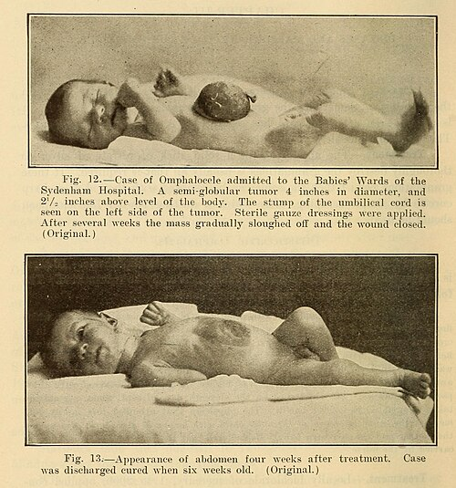
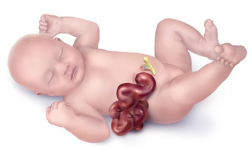

# ONFALOCELE

Para entender a onfalocele, você precisa primeiro esquecer a ideia de que ela é apenas "um buraco na barriga". Se você pensar assim, vai errar a questão de prova que compara onfalocele com gastrosquise. A onfalocele é um erro de **fechamento e rotação**, um evento embriológico complexo que acontece muito cedo na gestação.

Diferente da gastrosquise, onde o intestino "escapa" por uma fenda, na onfalocele o conteúdo abdominal **nunca chegou a entrar totalmente** ou não foi devidamente contido pelas pregas laterais. E é por isso que ele vem ensacado. Guarde esta frase: na onfalocele, o erro é estrutural e central.

*Figura 1 - Caso histórico de onfalocele (1914), mostrando o saco membranoso característico contendo vísceras abdominais com inserção do cordão umbilical. Fonte: Internet Archive Book Images | Wikimedia Commons*

## Embriologia: O "Porquê" do Defeito

Muitos alunos tentam decorar a embriologia e falham. Vamos entender a lógica. Entre a 6ª e a 10ª semana de vida intrauterina, o intestino do bebê cresce muito mais rápido que a cavidade abdominal. O que a natureza faz? Ela "estaciona" o intestino temporariamente dentro do cordão umbilical. Isso é a **herniação fisiológica**.

Por volta da 10ª a 12ª semana, o abdome cresceu o suficiente e o intestino deve retornar, rotacionar e se fixar. A onfalocele ocorre quando esse retorno falha ou quando as pregas laterais do disco embrionário não se fundem adequadamente na linha média.

Por que isso importa para a sua prova? Porque se o defeito ocorre nessa fase tão precoce da formação do bebê, as chances de outras coisas terem dado errado são altíssimas. É aqui que o Dr. Will sempre reforça: **onfalocele raramente vem sozinha**. Enquanto na gastrosquise o problema costuma ser "apenas" o defeito na parede, na onfalocele temos que procurar malformações cardíacas, cromossomopatias e síndromes genéticas.

## Definição e Critérios Diagnósticos

A onfalocele é definida como um defeito da parede abdominal anterior, localizado na linha média (no anel umbilical), de tamanho variável, onde as vísceras herniadas são recobertas por um saco membranoso composto por:

- Peritônio (camada interna)

- Geleia de Wharton (camada média)

- Âmnio (camada externa)

**O detalhe de ouro:** O cordão umbilical se insere diretamente no ápice ou na lateral desse saco. Se a questão disser que o cordão está inserido na pele, ao lado do defeito, ela está descrevendo uma gastrosquise.

### Classificação por Tamanho

Não existe um consenso universal rígido, mas para fins práticos e de conduta cirúrgica, dividimos em:

- **Pequena/Média:** Defeito < 4-5 cm. Geralmente contém apenas alças intestinais.

- **Gigante:** Defeito > 5 cm (ou > 6 cm em algumas literaturas) ou quando contém a maior parte do fígado.

Essa distinção é fundamental. Uma onfalocele pequena pode permitir o fechamento primário (em um só tempo). Uma gigante, se você tentar "empurrar" tudo para dentro à força, vai causar uma síndrome compartimental abdominal, o bebê vai parar de ventilar e os rins vão parar de filtrar.

## Epidemiologia e Fatores de Risco

A incidência é de aproximadamente 1 para cada 4.000 a 5.000 nascidos vivos. Diferente da gastrosquise, que está associada a mães muito jovens e uso de substâncias vasoativas (como tabaco e cocaína), a onfalocele está mais relacionada à **idade materna avançada**.

Aqui está uma pegadinha de prova: a onfalocele é mais comum em meninos, mas a associação com síndromes é igual para ambos os sexos.

## Malformações Associadas: O Ponto Crítico

Se você decorar apenas uma coisa hoje, que seja esta: **50% a 80% dos bebês com onfalocele possuem outras malformações**. Isso é o que define o prognóstico, muito mais do que o tamanho do defeito na parede.

### 1. Alterações Cariotípicas

Cerca de 30% dos casos apresentam trissomias. As mais comuns são:

- Trissomia do 18 (Síndrome de Edwards) - Frequentemente associada a onfaloceles pequenas.

- Trissomia do 13 (Síndrome de Patau).

- Trissomia do 21 (Síndrome de Down).

### 2. Síndrome de Beckwith-Wiedemann

Esta cai muito em provas de Pediatria e Cirurgia Pediátrica. É uma síndrome de hipercrescimento. O examinador vai descrever um bebê com:

- Onfalocele.

- Macroglossia (língua grande).

- Gigantismo/Visceromegalia.

- **Hipoglicemia neonatal grave** (devido ao hiperinsulinismo por hiperplasia das ilhotas pancreáticas).

- Sulcos no lobo da orelha.

**Dica MedEvo:** Se o caso clínico mencionar onfalocele e o bebê começar a ter convulsão ou letargia nas primeiras horas, verifique a glicemia! Pode ser Beckwith-Wiedemann.

### 3. Pentalogia de Cantrell

Ocorre quando o defeito é mais superior (onfalocele epigástrica). Envolve:

- Onfalocele.

- Defeito do diafragma anterior.

- Defeito do esterno inferior.

- Defeito do pericárdio diafragmático.

- Malformação intracardíaca (geralmente comunicação interventricular ou divertículo ventricular).

### 4. Complexo OEIS

Ocorre quando o defeito é mais inferior (onfalocele hipogástrica).

- **O**nfalocele.

- **E**xtrofia de cloaca.

- **I**mperfuração anal.

- **S**pine (defeitos espinhais/sacrais).

## Diagnóstico Diferencial: A Tabela de Ouro

*Figura 2 - Representação de gastrosquise, onde as alças intestinais herniadas estão expostas diretamente ao líquido amniótico, sem membrana protetora. Fonte: CDC, Domínio Público | Wikimedia Commons*

As bancas amam colocar onfalocele e gastrosquise na mesma questão. Você precisa saber diferenciar no automático.

| Característica | Onfalocele | Gastrosquise |
| --- | --- | --- |
| **Localização** | Central (Anel Umbilical) | À direita do cordão umbilical |
| **Saco Protetor** | Presente (Âmnio/Peritônio) | Ausente (Vísceras expostas) |
| **Cordão Umbilical** | Insere-se no saco | Insere-se na pele (íntegro) |
| **Conteúdo** | Intestino, Fígado, Baço | Apenas Intestino (raro fígado) |
| **Aspecto das Alças** | Normal (protegidas pelo saco) | Edemaciadas, com fibrina ("casca") |
| **Malformações** | Muito frequentes (50-80%) | Raras (exceto atresia intestinal) |
| **Idade Materna** | Avançada | Jovem (< 20 anos) |
| **Diagnóstico Pré-natal** | USG e AFP elevada | USG e AFP muito elevada |

**Cuidado com a Hérnia Umbilical Infantil:** Muitos alunos confundem onfalocele pequena com hérnia umbilical. A diferença é que na hérnia umbilical o defeito é recoberto por **pele íntegra** e tecido subcutâneo, e ela raramente está presente ao nascimento de forma tão dramática. A onfalocele é um defeito de fechamento da parede, a hérnia é uma falha no fechamento do anel após o nascimento.

## Diagnóstico Pré-natal e Manejo no Parto

O diagnóstico é feito rotineiramente por ultrassonografia morfológica no segundo trimestre. A Alfafetoproteína (AFP) materna estará elevada, mas não tanto quanto na gastrosquise (onde as alças estão em contato direto com o líquido amniótico).

**Onde o bebê deve nascer?**
Em um centro de nível terciário com UTI Neonatal e equipe de Cirurgia Pediátrica. Não se faz parto de onfalocele em hospital sem suporte cirúrgico.

**Via de parto:**
A diretriz não obriga a cesariana para todos os casos. Onfaloceles pequenas podem ter parto vaginal. A cesariana é indicada em onfaloceles gigantes (risco de rotura do saco e distocia) ou por indicações obstétricas habituais.

## Conduta Imediata na Sala de Parto

O bebê nasceu. E agora? O tratamento começa antes do cirurgião lavar as mãos.

- **Proteção do Saco:** Esta é a prioridade. Se o saco romper, a onfalocele vira uma "gastrosquise funcional", mas com um prognóstico muito pior. Devemos envolver o saco com compressas umedecidas em soro fisiológico morno e cobrir com um saco plástico estéril (técnica do "saco de isolamento") para evitar perda de calor e evaporação.

- **Sonda Nasogástrica (SNG):** Aberta e em descompressão. Precisamos tirar o ar do estômago e intestino para evitar que as alças se distendam e dificultem o fechamento cirúrgico futuro.

- **Acesso Venoso e Hidratação:** Embora a perda de líquidos na onfalocele seja menor que na gastrosquise (devido ao saco), ainda assim é necessária hidratação venosa e correção de distúrbios eletrolíticos.

- **Estabilização Respiratória:** Muitos bebês com onfalocele gigante têm hipoplasia pulmonar. Pode ser necessária intubação precoce.

- **Rastreio de Malformações:** ECG, Ecocardiograma e USG de rins e vias urinárias devem ser feitos o quanto antes. O coração manda na urgência da cirurgia.

## Tratamento Cirúrgico: O "Como" e o "Porquê"

O objetivo final é colocar as vísceras para dentro e fechar a fáscia e a pele. Mas nem sempre isso é possível de imediato.

### 1. Fechamento Primário

Indicado para onfaloceles pequenas e médias, onde o conteúdo cabe na cavidade abdominal sem aumentar excessivamente a pressão intra-abdominal.

- **Por que não fazer sempre?** Se a pressão subir demais, ocorre compressão da veia cava inferior (diminui pré-carga), compressão renal (oligúria) e elevação do diafragma (insuficiência respiratória).

### 2. Fechamento Estagiado (Técnica de Schuster / Silo)

Se o conteúdo é grande demais, usamos um "silo" de material sintético (Silastic). O cirurgião coloca o silo sobre o defeito e, diariamente, vai apertando o topo do saco, empurrando o conteúdo para dentro aos poucos, conforme a cavidade abdominal se expande. O fechamento final ocorre após alguns dias ou semanas.

### 3. Tratamento Conservador (Epitelização)

Este é o "pulo do gato" para onfaloceles gigantes com contraindicação cirúrgica imediata (ex: cardiopatia grave instável ou hipoplasia pulmonar severa).

- **Como funciona:** Aplicamos substâncias escaróticas no saco (como Sulfadiazina de Prata a 1%). Isso promove a formação de uma crosta (escarificação) e estimula a pele das bordas a crescer por cima do saco.

- **Resultado:** O bebê fica com uma grande hérnia ventral, que será corrigida cirurgicamente meses ou anos depois, quando ele estiver maior e mais estável.

**Tabela de Decisão Terapêutica**

| Tipo de Onfalocele | Condição do Bebê | Conduta Preferencial |
| --- | --- | --- |
| Pequena / Média | Estável | Fechamento Primário |
| Gigante | Estável | Fechamento Estagiado (Silo) |
| Qualquer tamanho | Instabilidade Cardíaca Grave | Tratamento Conservador (Escarificação) |
| Gigante | Hipoplasia Pulmonar Grave | Tratamento Conservador (Escarificação) |

## Complicações e Prognóstico

O prognóstico da onfalocele não é ditado pelo tamanho do buraco, mas pelas **malformações associadas**. Um bebê com uma onfalocele pequena e uma Trissomia do 18 tem um prognóstico muito pior que um bebê com onfalocele gigante isolada.

### Complicações Comuns:

- **Refluxo Gastroesofágico (DRGE):** Quase todos os bebês com grandes defeitos de parede terão refluxo importante.

- **Insuficiência Respiratória:** Especialmente nas gigantes, devido à hipoplasia pulmonar e à mecânica diafragmática alterada.

- **Infecção:** Ruptura do saco leva à sepse rapidamente.

- **Síndrome Compartimental Abdominal:** Se o cirurgião for "otimista" demais no fechamento primário. Sinais: pernas cianóticas, queda do débito urinário, aumento da pressão de pico no ventilador.

## Situações Especiais e Pegadinhas de Prova

### O Saco Rompeu: E agora?

Se o saco da onfalocele rompe no parto, a conduta muda. Agora você tem vísceras expostas que não foram "preparadas" pelo líquido amniótico (como na gastrosquise). O risco de infecção é altíssimo. A cirurgia torna-se uma emergência absoluta para cobertura dessas alças.

### Onfalocele e Rotação Intestinal

Lembre-se: como o intestino não voltou corretamente para o abdome na fase embrionária, **todo paciente com onfalocele tem algum grau de má-rotação intestinal**. Isso significa que eles têm um risco eterno de volvo de intestino médio. Se um paciente operado de onfalocele há 2 anos chega com vômitos biliosos, pense em volvo!

### O Uso de Telas

Em cirurgia pediátrica, evitamos telas permanentes no período neonatal porque o bebê vai crescer e a tela não. Preferimos materiais biológicos ou técnicas de expansão de tecidos, mas isso é conduta de especialista. Para a prova, foque em Silo ou Fechamento Primário.

## Pontos-Chave para Prova 🧠

- **Definição:** Defeito central na base do cordão umbilical, coberto por membrana (âmnio e peritônio).

- **Embriologia:** Falha no retorno das alças intestinais para a cavidade abdominal (10ª-12ª semana).

- **Diferencial Crucial:** Na onfalocele, o cordão se insere no saco. Na gastrosquise, o cordão está à esquerda do defeito.

- **Associações:** Presentes em até 80% dos casos. Cardiopatias são as mais comuns.

- **Cromossomopatias:** Trissomias 13, 18 e 21. Onfaloceles pequenas têm maior associação com trissomias que as gigantes.

- **Beckwith-Wiedemann:** Onfalocele + Macroglossia + Hipoglicemia + Visceromegalia.

- **Pentalogia de Cantrell:** Onfalocele superior + defeitos de esterno, diafragma, pericárdio e coração.

- **Manejo Inicial:** SNG para descompressão, proteção do saco com compressas mornas e plástico, estabilização hemodinâmica.

- **Via de Parto:** Cesariana não é obrigatória, exceto em onfaloceles gigantes ou indicações obstétricas.

- **Tratamento Conservador:** Sulfadiazina de prata para epitelização em casos de alto risco cirúrgico ou onfaloceles gigantes.

- **Síndrome Compartimental:** Risco principal do fechamento primário sob tensão. Causa oligúria e falência respiratória.

- **Prognóstico:** Depende fundamentalmente das anomalias associadas (especialmente cardíacas e cromossômicas).

- **Má-rotação:** Sempre presente. Risco de volvo de intestino médio para o resto da vida.

- **Erro Clássico:** Achar que onfalocele é mais urgente que gastrosquise. Na verdade, a onfalocele é mais "estável" por causa do saco protetor, permitindo exames diagnósticos antes da cirurgia.

- **O que NÃO fazer:** Nunca tente reduzir a onfalocele à força na sala de parto. Isso pode romper o saco ou causar parada respiratória por compressão.

Ao estudar pelo material do MedEvo, você percebe que a onfalocele é um tema onde a clínica e a embriologia andam juntas. Se você entender que o defeito é precoce, você entende por que o coração e os cromossomos também podem estar afetados. Esse é o raciocínio que te coloca dentro da residência.

 Cópia offline para consulta pessoal.
 Fonte original:
 [https://www.medevo.com.br/material-apoio/ler/91466007-ba51-445e-91df-5b43bad13cd2](https://www.medevo.com.br/material-apoio/ler/91466007-ba51-445e-91df-5b43bad13cd2)
