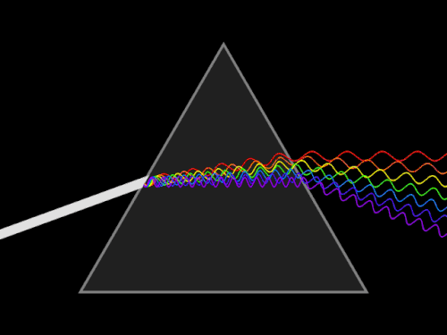
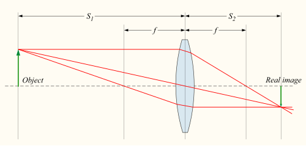

# ÓPTICA FÍSICA E GEOMÉTRICA

Para começar nosso estudo, você precisa desconstruir a ideia de que a óptica é apenas um conjunto de fórmulas matemáticas áridas. Na prova de residência e no Título de Especialista em Oftalmologia (CBO), a óptica é cobrada sob a ótica da funcionalidade. O examinador quer saber se você entende como a luz se comporta ao atravessar a córnea, o cristalino ou uma lente de óculos. Se você entender o comportamento do raio luminoso, a fórmula se torna apenas uma ferramenta lógica, e não um peso para sua memória.

*Figura 1 - Animação esquemática da dispersão da luz branca através de um prisma, demonstrando a separação em comprimentos de onda do espectro visível. Fonte: Lucas Vieira, Public Domain | Wikimedia Commons*

## Natureza da Luz e Óptica Física

A óptica física estuda a luz como uma onda eletromagnética. Diferente da óptica geométrica, que se preocupa com trajetórias retilíneas, aqui focamos em fenômenos que ocorrem devido à natureza ondulatória da luz.

*Figura 2 - Diagrama de formação de imagem por lente convergente, princípio fundamental da óptica geométrica. Fonte: DrBob, CC BY-SA 3.0 | Wikimedia Commons*

## Dualidade Onda-Partícula

A luz possui um comportamento dual. Em certos momentos, ela se comporta como partícula (fóton), como no efeito fotoelétrico. Em outros, como onda, apresentando frequência, comprimento de onda e velocidade. Para a prova de oftalmologia, o foco quase sempre recai sobre o comportamento ondulatório.

A velocidade da luz no vácuo é uma constante (aproximadamente 300.000 km/s). No entanto, ao entrar em meios mais densos, como o humor aquoso ou a córnea, essa velocidade diminui. É essa mudança de velocidade que fundamenta o conceito de Índice de Refração (n), definido pela razão entre a velocidade da luz no vácuo (c) e a velocidade no meio (v): n = c/v.

### Fenômenos Ondulatórios: Interferência e Difração

A interferência ocorre quando duas ou mais ondas se sobrepõem. Se as cristas se encontram, temos interferência construtiva (luz mais brilhante). Se uma crista encontra um vale, temos interferência destrutiva (escuridão).

Na prática clínica, utilizamos a interferência destrutiva nos revestimentos antirreflexo das lentes. As camadas são calculadas para que a luz refletida sofra interferência destrutiva, eliminando reflexos indesejados e aumentando a transmissão de luz para o olho do paciente.

A difração é a capacidade da luz de contornar obstáculos ou passar por fendas estreitas. Quanto menor a abertura, maior a difração. É aqui que entra o conceito de Disco de Airy. Mesmo em um sistema óptico perfeito, a imagem de um ponto nunca será um ponto perfeito, mas sim um disco central cercado por anéis concêntricos devido à difração na pupila.

Cuidado: as bancas adoram perguntar sobre o limite de resolução. O critério de Rayleigh define que dois pontos são distinguíveis quando o centro do disco de Airy de um coincide com o primeiro anel escuro do outro. Se a pupila estiver muito pequena (miose extrema, menor que 2mm), a difração aumenta tanto que a acuidade visual piora. Por outro lado, se a pupila estiver muito grande, as aberrações esféricas dominam. O equilíbrio ideal costuma ocorrer em torno de 3mm a 4mm.

### Polarização

A luz natural vibra em todos os planos perpendiculares à sua direção de propagação. Um polarizador é como uma grade que só permite a passagem de luz que vibra em um único plano.

Por que isso cai na prova? Primeiro, pelas lentes polarizadas, que bloqueiam o brilho refletido em superfícies horizontais (como o asfalto ou a água), pois a luz refletida nessas superfícies é parcialmente polarizada horizontalmente. Segundo, pelo teste de Titmus (estereopsia), que utiliza óculos polarizados para separar as imagens que chegam a cada olho.

Um detalhe técnico que o MedEvo sempre destaca: o fenômeno dos Pincéis de Haidinger. Devido à organização das moléculas de pigmento macular (luteína e zeaxantina), o olho humano consegue perceber a luz polarizada como um padrão em forma de hélice ou gravata borboleta. Isso é usado clinicamente para avaliar a fixação macular.

## Óptica Geométrica: Reflexão e Espelhos

A óptica geométrica baseia-se no princípio de que a luz se propaga em linha reta em meios homogêneos. Aqui, o conceito fundamental é o Raio de Luz.

### Leis da Reflexão

A reflexão ocorre quando a luz incide em uma superfície e retorna ao meio de origem. As duas leis são simples, mas fundamentais:

- O raio incidente, a normal e o raio refletido estão no mesmo plano.

- O ângulo de incidência (i) é sempre igual ao ângulo de reflexão (r).

Muitos alunos erram questões básicas por não lembrarem que esses ângulos são medidos em relação à **normal** da superfície, e não em relação à superfície em si. Se a luz incide a 30 graus da superfície, o ângulo de incidência é 60 graus.

### Espelhos Esféricos

Os espelhos podem ser côncavos (convergentes) ou convexos (divergentes). Na oftalmologia, o exemplo clássico de espelho convexo é a face anterior da córnea, utilizada na ceratometria.

Para espelhos esféricos, lembre-se das propriedades dos raios principais:

- Raio que incide paralelo ao eixo principal reflete passando pelo foco.

- Raio que incide pelo foco reflete paralelo ao eixo.

- Raio que incide pelo centro de curvatura reflete sobre si mesmo.

A distância focal (f) de um espelho esférico é metade do seu raio de curvatura (R): f = R/2.

No espelho convexo (como a córnea), a imagem é sempre virtual, direita e menor. É por isso que a imagem refletida na córnea (primeira imagem de Purkinje) parece estar "atrás" da superfície e é bem pequena. Já no espelho côncavo, a natureza da imagem depende da posição do objeto em relação ao foco e ao centro de curvatura.

| Tipo de Espelho | Posição do Objeto | Natureza da Imagem | Aplicação Clínica |
| --- | --- | --- | --- |
| Convexo | Qualquer posição | Virtual, Direita, Menor | Ceratometria (Córnea) |
| Côncavo | Além do Centro (C) | Real, Invertida, Menor | Oftalmoscópio Indireto |
| Côncavo | Entre C e Foco (F) | Real, Invertida, Maior | Projetores |
| Côncavo | Entre F e Vértice | Virtual, Direita, Maior | Espelho de maquiagem/barbear |

## Refração e Lentes Esféricas

A refração é a mudança de direção da luz ao passar de um meio para outro com índice de refração diferente. Este é o coração da oftalmologia.

### Lei de Snell e Ângulo Crítico

A Lei de Snell-Descartes é expressa por: n₁ · \sin(θ₁) = n₂ · \sin(θ₂).

Quando a luz passa de um meio menos denso para um mais denso (ex: ar para córnea), ela se aproxima da normal. Quando passa do mais denso para o menos denso (ex: cristalino para humor aquoso, ou humor aquoso para o ar), ela se afasta da normal.

O ângulo crítico ocorre quando a luz tenta passar de um meio mais denso para um menos denso e o ângulo de refração atinge 90 graus. Se o ângulo de incidência for maior que o ângulo crítico, ocorre a Reflexão Total Interna.

Exemplo clínico fundamental: Por que não conseguimos ver o ângulo da câmara anterior sem uma lente de gonioscopia? Porque a luz que sai do ângulo sofre reflexão total interna na interface filme lacrimal/ar. A lente de gonio substitui o ar por um material com índice de refração maior, eliminando a reflexão total e permitindo a visualização.

### Poder Dióptrico e Vergença

Esqueça a distância focal por um momento e pense em Vergença. Vergença é a medida da convergência ou divergência dos raios de luz.

- Raios paralelos têm vergença zero (objeto no infinito).

- Raios que convergem têm vergença positiva.

- Raios que divergem têm vergença negativa.

A unidade de medida é a Dioptria (D), definida como o inverso da distância em metros: D = 1/f.

Como o Dr. Will sempre reforça em suas discussões de casos, o erro mais comum em provas é esquecer de converter centímetros para metros. Se uma lente tem foco de 20 cm, seu poder é 1/0,2 = 5 Dioptrias.

### Lentes Delgadas e a Equação de Gauss

A fórmula de Gauss relaciona a distância do objeto (u), a distância da imagem (v) e a distância focal (f):
1/f = 1/v - 1/u (usando a convenção de sinais onde a luz viaja da esquerda para a direita).

No entanto, para a prova de oftalmologia, é muito mais prático usar a fórmula da Vergença:
V = U + P
Onde:

- V é a vergença de saída (imagem).

- U é a vergença de entrada (objeto).

- P é o poder da lente.

Imagine um paciente com uma lente de +3,00 D. Se um objeto está a 50 cm (0,5 m) da lente, qual a posição da imagem?

- Vergença de entrada (U): 1/(-0,5) = -2,00 D (raios divergem do objeto).

- Vergença de saída (V): U + P = -2,00 + 3,00 = +1,00 D.

- Distância da imagem: 1/V = 1/+1,00 = 1 metro à direita da lente.

### Lentes Esferocilíndricas e Transposição

As lentes cilíndricas têm poder em apenas um meridiano. Elas são usadas para corrigir o astigmatismo. Uma lente esferocilíndrica tem dois meridianos principais com poderes diferentes.

A transposição é a mudança da forma de escrever a receita (de cilindro positivo para negativo ou vice-versa) sem alterar o poder óptico.
Passos para transposição:

- O novo esférico é a soma algébrica do esférico e do cilindro originais.

- O novo cilindro tem o mesmo valor numérico, mas sinal trocado.

- O novo eixo é rotacionado em 90 graus.

Exemplo: +2,00 -1,50 × 180^\circ

- Novo esférico: +2,00 + (-1,50) = +0,50.

- Novo cilindro: +1,50.

- Novo eixo: 180 - 90 = 90^\circ.
Resultado: +0,50 +1,50 × 90^\circ.

Cuidado: O equivalente esférico é a soma do esférico com metade do cilindro. No exemplo acima: +2,00 + (-0,75) = +1,25 D. As bancas pedem isso com frequência para prescrição de lentes de contato ou cirurgia refrativa.

## Prismas

Um prisma é um meio transparente limitado por duas superfícies planas não paralelas. Ele não foca a luz, apenas desvia sua trajetória.

### Propriedades dos Prismas

- A luz é desviada em direção à **base** do prisma.

- A imagem é deslocada em direção ao **ápice** (vértice) do prisma.

A unidade de medida é a Dioptria Prismática (\Delta). Um prisma de 1 \Delta desvia a luz em 1 cm a uma distância de 1 metro.

### Lei de Prentice

Esta é a fórmula mais cobrada em questões de prismas: P = h · D.
Onde:

- P é o poder prismático em dioptrias prismáticas (\Delta).

- h é o descentramento da lente em centímetros (Cuidado! Aqui é cm, não metros).

- D é o poder da lente em Dioptrias.

Exemplo Clínico: Um paciente usa óculos de +5,00 DE em ambos os olhos. Se a distância interpupilar (DIP) dos óculos estiver 4 mm (0,4 cm) maior que a DIP real do paciente, qual o efeito prismático induzido em cada olho?
P = 0,4 cm × 5,00 D = 2 \Delta.
Como a lente é positiva e foi descentrada para fora, a base do prisma resultante está voltada para dentro (Base Interna).

| Tipo de Lente | Deslocamento | Efeito Prismático |
| --- | --- | --- |
| Positiva (Convergente) | Para fora | Base Interna (BI) |
| Positiva (Convergente) | Para dentro | Base Externa (BE) |
| Negativa (Divergente) | Para fora | Base Externa (BE) |
| Negativa (Divergente) | Para dentro | Base Interna (BI) |

## Óptica do Olho Humano

Para entender a refração ocular, utilizamos modelos simplificados chamados Olhos Esquemáticos. O mais famoso é o de Gullstrand.

### O Olho Esquemático de Gullstrand

- Poder total do olho: aproximadamente +58 a +60 D.

- Poder da córnea: aproximadamente +43 D (cerca de 75% do poder total).

- Poder do cristalino: aproximadamente +19 a +20 D em repouso.

- Índice de refração da córnea: 1,376.

- Índice de refração do humor aquoso e vítreo: 1,336.

Por que a córnea tem mais poder que o cristalino se o índice de refração do cristalino (1,41 no núcleo) é maior? Porque o que importa é a **diferença** de índice de refração entre os meios. A interface ar (n=1,00) / córnea (n=1,37) tem um salto muito maior do que a interface humor aquoso (n=1,33) / cristalino (n=1,41). É por isso que enxergamos embaçado debaixo d'água: a água tem índice de refração próximo ao da córnea, anulando o poder refrativo desta.

### Ametropias

- **Miopia:** O olho é muito longo ou o poder refrativo é muito grande. A imagem foca antes da retina. Corrigida com lentes divergentes (negativas).

- **Hipermetropia:** O olho é curto ou o poder refrativo é insuficiente. A imagem focaria "atrás" da retina. Corrigida com lentes convergentes (positivas).

- **Astigmatismo:** A curvatura da córnea ou do cristalino não é uniforme, gerando dois pontos focais (ou duas linhas focais de Sturm).

Um conceito que sempre cai: O Intervalo de Sturm. É a distância entre as duas linhas focais no astigmatismo. O Círculo de Menor Confusão é o ponto médio (em termos de dioptrias) entre essas duas linhas, onde a imagem é menos borrada. O equivalente esférico coloca esse círculo exatamente sobre a retina.

## Aberrações Ópticas

Nenhum sistema óptico é perfeito. As aberrações são distorções que degradam a qualidade da imagem.

### Aberrações Cromáticas

Ocorrem porque o índice de refração varia com o comprimento de onda. A luz azul (menor comprimento de onda) sofre mais refração e foca antes da luz vermelha.
O teste do "Verde-Vermelho" (Duocromo) baseia-se nisso. Se o paciente vê melhor as letras no fundo verde, ele está "hipermetropizado" pelo exame (o foco do verde está na retina, mas o do vermelho está atrás), precisando de mais "menos" ou menos "mais". Se vê melhor no vermelho, está "miopizado".

### Aberrações Monocromáticas (Polinômios de Zernike)

São divididas em ordens:

- **Baixa Ordem (2ª ordem):** Desfoco (miopia/hipermetropia) e Astigmatismo. Representam 90% das aberrações do olho.

- **Alta Ordem (3ª ordem ou superior):** Coma, Aberração Esférica, Trefoil.

- **Coma:** Comum em ceratocone. A imagem parece ter uma cauda de cometa.

- **Aberração Esférica:** Raios periféricos focam em pontos diferentes dos raios centrais. Aumenta com a midríase.

## Visão Subnormal e Magnificação

A visão subnormal lida com pacientes cuja acuidade visual não pode ser corrigida plenamente com óculos convencionais, cirurgia ou medicação. A estratégia principal é a magnificação.

Existem quatro tipos principais de magnificação:

- **Magnificação por Tamanho Relativo:** Aumentar o tamanho do objeto (ex: livros com letras grandes).

- **Magnificação por Distância Relativa:** Aproximar o objeto do olho. Se você reduz a distância pela metade, dobra o tamanho da imagem na retina. É a forma mais simples e barata.

- **Magnificação Angular:** Uso de sistemas de lentes que aumentam o ângulo subtendido pelo objeto no olho (ex: lupas, telescópios).

- **Magnificação por Projeção:** Uso de sistemas eletrônicos (CCTV).

### Cálculo de Lupas

Para um paciente ler confortavelmente, ele precisa de uma reserva de acomodação ou de poder dióptrico. A regra prática de Kestenbaum estima o poder necessário para leitura: divida o denominador da fração de Snellen pela visão de perto desejada.
Exemplo: Paciente com AV de 20/200. Para ler J1 (equivalente a 20/50), ele precisaria de aproximadamente 200/50 = 4 vezes de magnificação. Em dioptrias, uma estimativa comum é o inverso da acuidade visual: 200/20 = 10 D.

| Tipo de Auxílio | Vantagens | Desvantagens |
| --- | --- | --- |
| Lupas de Mão | Portáteis, baratas | Exigem coordenação motora |
| Lupas de Apoio | Distância focal fixa | Volumosas, precisam de iluminação |
| Óculos Hiperoculares | Campo visual maior | Distância de leitura muito curta |
| Telescópios | Únicos para visão de longe | Campo visual restrito, difícil locomoção |

## Instrumentos Ópticos na Prática

### Lâmpada de Fenda (Biomicroscopia)

Utiliza um sistema de prismas de Porro ou Abbe-Konig para inverter a imagem (que originalmente seria invertida) e permitir a visão estereoscópica. O sistema de iluminação e observação são acoplados em um braço mecânico que mantém o foco comum (sistema focal).

### Oftalmoscópio Indireto (BIO)

O BIO utiliza uma lente convergente de alto poder (ex: +20 D) colocada entre o examinador e o paciente.

- A imagem formada é **real, invertida e magnificada**.

- A magnificação do BIO é dada pela razão entre o poder do olho do paciente (cerca de 60D) e o poder da lente: M = 60/P_{lente}.

- Para uma lente de +20 D, a magnificação é de 3×. Para uma de +30 D, é de 2×. Note que quanto maior o poder da lente, menor a magnificação, mas maior o campo de visão.

### Ceratômetro

Mede o raio de curvatura da face anterior da córnea utilizando-a como um espelho convexo. O aparelho mede o tamanho da imagem refletida (mira) e, conhecendo o tamanho do objeto e a distância, calcula o raio de curvatura (R). A conversão para dioptrias usa o índice de refração ceratométrico padrão (1,3375): D = (1,3375 - 1) / R.

## Pontos-Chave para Prova 💡

- **Índice de Refração:** Ar = 1,00; Água = 1,33; Córnea = 1,37; Cristalino = 1,41; Cristal de óculos = 1,52.

- **Lei de Snell:** n₁ \sin θ₁ = n₂ \sin θ₂. Luz para meio mais denso = aproxima da normal.

- **Ângulo Crítico:** Só ocorre do meio mais denso para o menos denso. Base da gonioscopia.

- **Poder Dióptrico:** D = 1/f (f em metros). Não esqueça de converter cm para m.

- **Fórmula de Vergença:** V = U + P. Essencial para problemas de lentes e posição de imagem.

- **Transposição:** Soma esférico + cilindro; inverte sinal do cilindro; gira eixo 90 graus.

- **Equivalente Esférico:** Esférico + (Cilindro / 2).

- **Lei de Prentice:** \Delta = h(cm) · D. Cuidado com a unidade de h (centímetros).

- **Prismas:** Desviam a luz para a base e a imagem para o ápice.

- **Lentes Positivas:** Descentramento temporal induz prisma base interna.

- **Lentes Negativas:** Descentramento temporal induz prisma base externa.

- **Olho de Gullstrand:** Poder total +58 a +60 D. Córnea +43 D.

- **Disco de Airy:** Limite de resolução por difração. Pupila ideal = 3-4 mm.

- **Duocromo:** Verde foca antes (paciente míope ou hipercorrigido), Vermelho foca depois (paciente hipermétrope ou hipocorrigido).

- **Magnificação BIO:** M = 60 / Poder da Lente. Lente de +20 D magnifica 3×.

- **Regra de Kestenbaum:** Inverso da AV para estimar adição inicial em visão subnormal (ex: 20/200 precisa de +10 D).

- **Aberrações:** Esférica e Coma são de alta ordem. Astigmatismo e Desfoco são de baixa ordem.

- **Pincéis de Haidinger:** Fenômeno entóptico macular relacionado à luz polarizada.

Ao revisar este material, tente desenhar os esquemas de raios. A óptica geométrica é visual. Se você conseguir visualizar o raio de luz batendo em um prisma ou atravessando uma lente de +2,00 D, você não precisará decorar fórmulas, pois elas se tornarão intuitivas. O MedEvo foca nessa compreensão lógica para que, na hora da prova, o estresse não apague sua memória, pois o raciocínio permanecerá lá.

 Cópia offline para consulta pessoal.
 Fonte original:
 [https://www.medevo.com.br/material-apoio/ler/1043e321-5e5e-4950-9a0f-e4cc9fded3a7](https://www.medevo.com.br/material-apoio/ler/1043e321-5e5e-4950-9a0f-e4cc9fded3a7)
