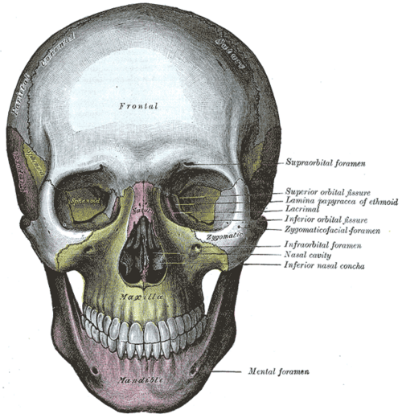
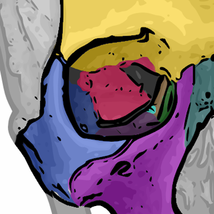

# ÓRBITA

Para entender a órbita, você não deve visualizá-la apenas como um "buraco" onde o olho se encaixa. Pense nela como um condomínio de luxo extremamente apertado. Qualquer novo morador, seja um tumor, um processo inflamatório ou um edema muscular, vai causar briga por espaço. E quem sofre primeiro? Geralmente o nervo óptico e a mobilidade ocular.

Nesta aula, vamos dissecar a anatomia, as patologias inflamatórias, infecciosas e tumorais. O foco aqui é o que cai na prova do CBO (Conselho Brasileiro de Oftalmologia) e nas principais residências, mas com a visão clínica de quem lida com isso no dia a dia.

## Anatomia Cirúrgica e Radiológica

A órbita é uma pirâmide de quatro lados, cujo ápice aponta para trás e para dentro. O volume orbitário no adulto é de aproximadamente 30 ml, mas o globo ocular ocupa apenas 7 ml. O restante? Gordura, músculos, nervos e vasos.

### As Paredes da Órbita

Muitos alunos decoram os 7 ossos da órbita, mas esquecem de entender a fragilidade de cada um. Isso é o que a banca cobra.

- **Teto:** Formado principalmente pelo osso frontal e pela asa menor do esfenoide. Cuidado aqui: a glândula lacrimal está na fossa lacrimal, na porção anterolateral do teto.

- **Assoalho:** É a parede mais frágil. Formado pelos ossos maxilar, zigomático e palatino. O nervo infraorbitário passa por aqui. Por que isso importa? Nas fraturas de assoalho (blow-out), o paciente frequentemente apresenta hipoestesia na bochecha e na gengiva superior.

- **Parede Medial:** Formada pelo etmoide, lacrimal, maxilar e esfenoide. A lâmina papirácea do etmoide é fina como um papel. É por aqui que as sinusites etmoidais invadem a órbita, causando celulite orbital.

- **Parede Lateral:** A mais forte de todas. Formada pelo zigomático e pela asa maior do esfenoide.

**Dica de Prova:** Se a questão fala de uma fratura que causou enfisema subcutâneo após o paciente assoar o nariz, o diagnóstico é fratura da parede medial (comunicação com os seios etmoidais).

### Ápice e Fissuras

Aqui é onde a maioria dos alunos se confunde. Vamos organizar o que passa em cada "porta" da órbita:

- **Canal Óptico:** Nervo óptico (NC II) e artéria oftálmica.

- **Fissura Orbitária Superior (FOS):**

- *Acima do Anel de Zinn:* Nervos lacrimal, frontal (ramos do V1) e troclear (NC IV), além da veia oftálmica superior.

- *Dentro do Anel de Zinn:* Ramos superior e inferior do oculomotor (NC III), nervo abducente (NC VI) e nervo nasociliar (ramo do V1).

**Exemplo Clínico:** Se um paciente chega com ptose, oftalmoplegia completa e anestesia da testa, mas a visão está preservada, a lesão está na Fissura Orbitária Superior (Síndrome da Fissura Orbitária Superior). Se a visão também estiver baixa, a lesão atingiu o ápice (Síndrome do Ápice Orbitário), pois comprometeu o canal óptico.

## Semiologia Orbitária

O exame físico da órbita exige precisão. Não basta dizer que o olho está "para fora".

### Proptose e Exoftalmia

Embora usados como sinônimos, "exoftalmia" é mais associada à doença de Graves. Usamos o exoftalmômetro de Hertel para medir.

- **Valores de referência:** No Brasil, consideramos normal até 20 mm em brancos e 22 mm em negros.

- **Assimetria:** Uma diferença maior que 2 mm entre os dois olhos é sempre patológica, mesmo que ambos estejam dentro da faixa de normalidade.

### Dystopia e Enoftalmia

Dystopia é o deslocamento vertical ou horizontal do globo, geralmente por massas extraconais. Já a enoftalmia (olho "fundo") ocorre em fraturas de assoalho ou na Síndrome de Silent Sinus.

**Cuidado:** Não confunda pseudoproptose (causada por alta miopia ou retração palpebral) com proptose real. Na MedEvo, sempre reforçamos: palpe o rebordo orbitário. Se houver resistência à retropulsão, há algo ocupando espaço atrás do globo.

## Orbitopatia Associada à Tireoide (OAT)

Esta é, sem dúvida, a doença orbitária mais comum no adulto e a que mais cai em provas. É uma doença autoimune onde os anticorpos (principalmente o TRAB) atacam os receptores de TSH nos fibroblastos orbitários.

*Figura 1 - Vista frontal do crânio humano ilustrando a anatomia das cavidades orbitárias. Fonte: Henry Vandyke Carter, Domínio Público | Wikimedia Commons*

## Fisiopatologia: O "Porquê" dos Sintomas

Por que os músculos aumentam? Os fibroblastos produzem glicosaminoglicanos (GAGs), que retêm água (edema). Isso gera hipertrofia dos músculos extraoculares e aumento da gordura orbitária.
A ordem de acometimento muscular clássica é o mnemônico **IMSLO**:

- Reto Inferior (mais comum)

- Reto Medial

- Reto Superior

- Reto Lateral

- Oblíquos

**Pegadinha de Prova:** Na OAT, o aumento muscular **poupa o tendão**. Se o tendão estiver inflamado na imagem (TC ou RM), pense em Miosite Orbitária Idiopática, não em Graves.

*Figura 2 - Ossos que compõem a órbita ocular: frontal (amarelo), maxila (roxo), zigomático (azul), lacrimal (verde), nasal (cinza-verde), esfenoide (rosa), etmoide (marrom) e palatino (azul claro). Fonte: Je at uwo, CC BY 2.5 | Wikimedia Commons*

## Classificação e Atividade

Usamos o CAS (Clinical Activity Score) para definir se a doença está ativa. Se o CAS for maior ou igual a 3/7 na primeira consulta, a doença é considerada ativa.

| Critério CAS (Fase Ativa) | Descrição |
| --- | --- |
| Dor retrobulbar | Dor ao repouso |
| Dor à movimentação | Dor ao olhar para cima/lados |
| Eritema palpebral | Vermelhidão nas pálpebras |
| Edema palpebral | Inchaço palpebral |
| Hiperemia conjuntival | Vermelhidão ocular |
| Quemose | Edema da conjuntiva |
| Inflamação da carúncula | Edema ou vermelhidão na carúncula |

### Tratamento da OAT

O tratamento depende da fase (Rundle's Curve). Na fase ativa (inflamatória), tratamos a inflamação. Na fase sequelar (fibrótica), tratamos as deformidades.

- **Medidas Gerais:** Cessar tabagismo (fator de risco número 1 para progressão), selênio (100 mcg 2x ao dia por 6 meses em casos leves) e controle rigoroso da tireoide.

- **Casos Moderados a Graves (Ativos):** Pulsoterapia com Metilprednisolone endovenosa. O protocolo EUGOGO recomenda 500 mg por semana por 6 semanas, seguidos de 250 mg por semana por mais 6 semanas (Dose total máxima de 4,5g para evitar hepatotoxicidade grave).

- **Neuropatia Óptica Distireoidiana (Urgência):** Se houver perda visual por compressão no ápice, fazemos pulsoterapia de resgate (1g por 3 dias). Se não responder, descompressão orbitária cirúrgica imediata.

**Dica do Dr. Will:** A cirurgia na OAT segue uma ordem rígida: 1º Descompressão, 2º Estrabismo, 3º Pálpebra. Se você operar a pálpebra antes da descompressão, a posição vai mudar e o resultado será desastroso.

## Inflamações Orbitárias Idiopáticas

Antigamente chamadas de "Pseudotumor Orbitário", são diagnósticos de exclusão. Ao contrário da OAT, a dor é um sintoma cardinal e o início é súbito.

### Miosite Orbitária

É uma forma de inflamação idiopática que atinge o músculo. Diferente do Graves:

- Acomete o tendão.

- Geralmente unilateral.

- Dor intensa à movimentação.

- Resposta dramática a corticoides orais (Prednisona 1mg/kg/dia).

### Doença Relacionada ao IgG4

Uma entidade "da moda" em provas recentes. Suspeite quando houver aumento bilateral das glândulas lacrimais, espessamento do nervo infraorbitário e asma associada. O diagnóstico é histopatológico com contagem de plasmócitos IgG4+.

## Infecções Orbitárias

Aqui separamos o "joio do trigo". A classificação de Chandler é o guia para sua conduta.

### Celulite Pré-septal vs. Orbital

Esta distinção salva vidas e visões. O septo orbitário é uma barreira fibrosa que impede a progressão da infecção da pálpebra para a órbita.

| Característica | Celulite Pré-septal | Celulite Orbital |
| --- | --- | --- |
| Proptose | Ausente | Presente |
| Motilidade Ocular | Preservada | Limitada (Oftalmoplegia) |
| Dor à movimentação | Ausente | Presente |
| Reflexo Pupilar | Normal | Pode haver Defeito Pupilar Aferente (DPAR) |
| Visão | Normal | Pode estar reduzida |

**Conduta:**

- **Pré-septal:** Antibiótico oral (Amoxicilina + Clavulanato) e acompanhamento ambulatorial (se paciente estável).

- **Orbital:** Internação compulsória, TC de crânio e órbitas com contraste, e antibioticoterapia endovenosa de amplo espectro (Ceftriaxone + Oxacilina ou Vancomicina).

**Por que internar?** O risco é a progressão para abscesso subperiosteal, abscesso orbitário ou, o pior de todos, Trombose do Seio Cavernoso. Se o paciente apresentar paralisia de pares cranianos do outro olho, suspeite imediatamente de trombose do seio cavernoso.

## Tumores Orbitários

Para a prova, divida os tumores por faixa etária e por origem (vascular, neural, linfoide).

### Tumores Vasculares

- **Hemangioma Capilar:** O tumor orbitário benigno mais comum da infância. É o "morango". Geralmente aparece nas primeiras semanas de vida, cresce até 1 ano e involui. Tratamos com Betabloqueadores (Propranolol 2-3 mg/kg/dia) se houver risco de ambliopia por ptose ou astigmatismo.

- **Hemangioma Cavernoso:** O tumor orbitário benigno mais comum do adulto. É uma massa bem delimitada, intraconal, que causa proptose axial progressiva e indolor. Na imagem, apresenta realce progressivo pelo contraste ("filling").

### Tumores Malignos na Infância

- **Rabdomiossarcoma:** É a neoplasia primária maligna mais comum da órbita na criança. A palavra-chave aqui é **rapidez**. Proptose que evolui em dias ou semanas. É uma emergência oncológica. O tratamento é biópsia imediata seguida de rádio e quimioterapia.

- **Neuroblastoma Metastático:** Frequentemente bilateral, causa equimose palpebral ("olhos de guaxinim") sem história de trauma. O tumor primário geralmente é na suprarrenal.

### Tumores Linfoides

O linfoma de órbita (geralmente Linfoma MALT) costuma aparecer em idosos como uma massa de consistência "emborrachada" no quadrante superior temporal, moldando-se ao globo ocular sem invadir o osso.

## Trauma Orbitário: Fratura Blow-out

Ocorre quando um objeto rombo (bola de tênis, punho) maior que a abertura orbitária atinge o olho. A pressão aumenta e o assoalho (osso maxilar) "explode" para baixo, para dentro do seio maxilar.

### Quadro Clínico e Indicações Cirúrgicas

O paciente apresenta diplopia (especialmente ao olhar para cima por aprisionamento do músculo reto inferior) e enoftalmia.

**Quando operar?** Segundo as diretrizes de plástica ocular, não operamos todo mundo de imediato. Esperamos 7 a 14 dias para o edema diminuir, exceto em dois casos:

- **White-eyed Blow-out (em crianças):** O osso é elástico, abre e fecha como uma "armadilha de urso", aprisionando o músculo e causando reflexo oculocardíaco (bradicardia, náuseas). É uma urgência cirúrgica em 24-48h.

- **Diplopia persistente em posição primária** ou enoftalmia > 2 mm que seja esteticamente inaceitável.

## Diagnóstico Diferencial de Proptose (Tabela Comparativa)

| Início | Suspeita Principal | Característica Marcante |
| --- | --- | --- |
| Súbito (minutos/horas) | Hemorragia retrobulbar | Trauma ou pós-operatório, dor intensa, DPAR |
| Agudo (dias) | Celulite ou Rabdomiossarcoma | Sinais inflamatórios ou evolução galopante |
| Crônico (meses/anos) | OAT ou Hemangioma Cavernoso | Retração palpebral (OAT) ou proptose axial (Cavernoso) |
| Pulsátil | Fístula Carótido-Cavernosa | Sopro audível, cabeça de medusa (vasos em saca-rolhas) |

## Pontos-Chave para Prova 💡

- **OAT:** Causa mais comum de proptose uni e bilateral no adulto. Tabagismo é o principal fator de risco modificável.

- **Músculos na OAT:** O reto inferior é o primeiro; o tendão é poupado na imagem.

- **CAS:** Score ≥ 3 indica atividade inflamatória e necessidade de imunossupressão.

- **Metilprednisolone:** Dose máxima acumulada de 4,5g para evitar falência hepática.

- **Celulite Orbital:** Sempre interna, sempre TC, sempre ATB venoso.

- **Rabdomiossarcoma:** Tumor maligno mais comum da infância; evolução em "dias".

- **Hemangioma Capilar:** Tratamento de escolha é Propranolol oral.

- **Hemangioma Cavernoso:** Tumor benigno mais comum do adulto; intraconal e bem delimitado.

- **Fratura de Assoalho:** O nervo infraorbitário é frequentemente lesado (hipoestesia malar).

- **White-eyed Blow-out:** Urgência pediátrica por risco de isquemia muscular e reflexo vagal.

- **Sinal de Dalrymple:** Retração palpebral na posição primária do olhar (típico de Graves).

- **Sinal de Kocher:** Olhar fixo e assustado.

- **Fissura Orbitária Superior:** Nervos III, IV, V1 e VI passam por ela. O II passa pelo canal óptico.

- **Lâmina Papirácea:** Parede medial, via de entrada para sinusites causarem celulite.

- **Diferença de Hertel:** > 2 mm entre olhos é patológico.

- **Contraindicação Absoluta:** Não realizar biópsia de adenoma pleomórfico da glândula lacrimal (risco de disseminação e transformação maligna); deve-se retirar a peça inteira.

- **Tratamento de Fístula Carótido-Cavernosa:** Padrão-ouro é a embolização por angiografia.

- **Linfoma Orbitário:** Massa que "molda" o globo, aspecto de "carne de peixe" na histologia.

Lembre-se do que sempre discutimos na MedEvo: a anatomia explica a clínica. Se você sabe quem passa em cada canal e qual osso é mais fino, você não decora a doença, você a deduz. A órbita é pequena, mas as questões sobre ela são grandes e frequentes. Domine esses conceitos e a vaga na residência estará mais próxima.

 Cópia offline para consulta pessoal.
 Fonte original:
 [https://www.medevo.com.br/material-apoio/ler/15ca9801-7005-4b11-910d-4644e162f64a](https://www.medevo.com.br/material-apoio/ler/15ca9801-7005-4b11-910d-4644e162f64a)
