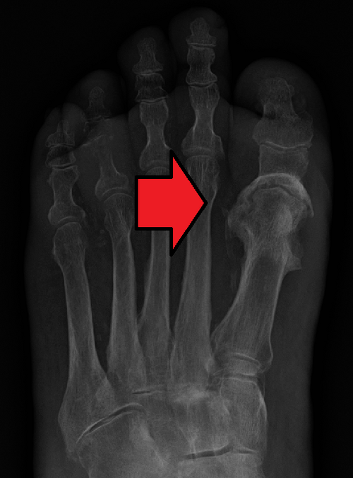
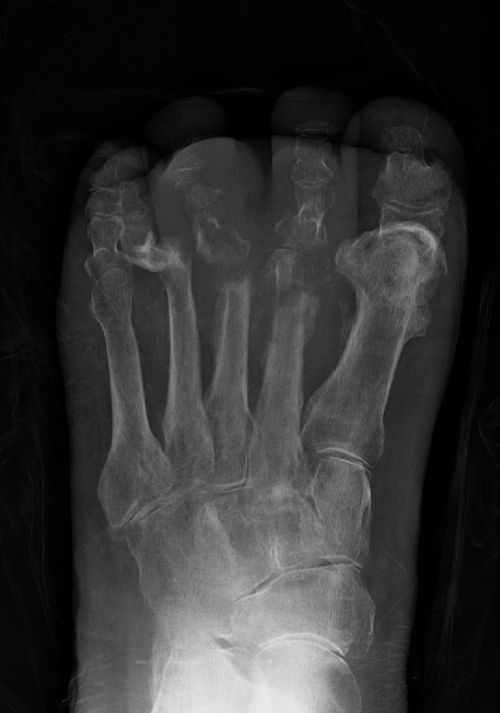

# OSTEOMIELITE

Seja bem-vindo a esta aula. Se você está aqui, é porque sabe que a Ortopedia nas provas de residência não é apenas sobre "quebrou, gessou". Existe um submundo de infecções e tumores que as bancas adoram explorar, e a **Osteomielite** é a rainha desse território.

Como seu professor, meu papel não é despejar uma lista de nomes de bactérias. Meu objetivo é que você entenda a "guerra" que acontece dentro do osso. Quando você entende a fisiopatologia, o tratamento deixa de ser uma decoreba e passa a ser lógico. Vamos juntos?

## O Campo de Batalha: Fisiopatologia e Patogênese

Para entender a osteomielite, você precisa visualizar o osso não como uma estrutura inerte, mas como um compartimento rígido e pouco complacente. Quando uma bactéria entra ali, ela não encontra apenas um "alimento"; ela desencadeia uma resposta inflamatória que, ironicamente, é o que mais destrói o osso.

### A Pressão e a Isquemia

Imagine o seguinte: a bactéria chega ao osso (seja por via hematogênica, contiguidade ou trauma). O corpo responde enviando polimorfonucleares (PMN). O problema? O osso é rígido. O acúmulo de pus aumenta a **pressão intraóssea**.

Essa pressão comprime os pequenos vasos sanguíneos (canais de Havers e Volkmann), gerando isquemia. Sem sangue, o osso morre. Esse osso morto, isolado do suprimento sanguíneo e servindo de "fortaleza" para as bactérias, é o que chamamos de **Sequestro Ósseo**.

> **Dica de Prova:** O sequestro é a marca registrada da osteomielite crônica. Por que o antibiótico sozinho não cura a osteomielite crônica? Porque o antibiótico viaja pelo sangue, e o sequestro é, por definição, um tecido avascular. Sem sangue, sem remédio. Por isso, o desbridamento cirúrgico é mandatório.

### O Involucro: A Reação do Corpo

Enquanto o osso infectado morre por dentro, o periósteo (a "capa" do osso) tenta reagir. Ele é estimulado pela inflamação e começa a produzir osso novo ao redor da infecção. Esse osso novo, que tenta "embrulhar" a sujeira, é o **Involucro**.

Muitas vezes, o pus consegue "furar" esse involucro para sair para as partes moles, criando fístulas. Na prova, se falarem em "trajeto fistuloso com saída de secreção purulenta", o diagnóstico de osteomielite crônica está praticamente dado.

### Vias de Infecção

Existem três formas clássicas de a bactéria chegar ao osso:

- **Hematogênica:** Mais comum em crianças. A bactéria viaja pelo sangue e se aloja na metáfise dos ossos longos (onde o fluxo sanguíneo é lento e propício para o "desembarque" bacteriano).

- **Contiguidade:** A infecção vem de "perto", como uma celulite grave ou uma úlcera de pé diabético que aprofunda.

- **Inoculação Direta:** Trauma, fraturas expostas ou cirurgias ortopédicas. Aqui, o Dr. Will sempre lembra: "Onde o cirurgião coloca o metal, a bactéria quer morar".

## Classificações que Caem (e como não confundir)

Existem duas classificações principais que você precisa dominar para não cair em pegadinhas.

### 1. Classificação de Waldvogel

É a classificação "clássica", baseada na etiologia e no tempo:

- **Hematogênica aguda:** Disseminação pelo sangue.

- **Secundária a foco contíguo:** Com ou sem insuficiência vascular (ex: pé diabético).

- **Crônica:** Infecção persistente com presença de sequestro.

### 2. Classificação de Cierny-Mader

Esta é a favorita das bancas mais modernas porque ela foca no **hospedeiro** e na **anatomia da lesão**, o que define o prognóstico.

| Estágio Anatômico | Descrição |
| --- | --- |
| **Tipo I** | Medular (infecção restrita ao canal) |
| **Tipo II** | Superficial (infecção na superfície cortical) |
| **Tipo III** | Localizada (sequestro bem definido, mas o osso ainda é estável) |
| **Tipo IV** | Difusa (infecção circunferencial, osso instável mecanicamente) |

Além do estágio anatômico, avaliamos o **Hospedeiro (Host)**:

- **Classe A:** Saudável (boa resposta imune e vascular).

- **Classe B:** Comprometido (localmente, como isquemia; ou sistemicamente, como diabetes/desnutrição).

- **Classe C:** O tratamento é pior que a doença (paciente tão grave que a cirurgia não vale o risco).

*Figura 1 - Radiografia evidenciando osteomielite do primeiro pododáctilo com áreas de lise óssea. Fonte: James Heilman, MD, CC BY-SA 4.0 | Wikimedia Commons*

## Etiologia: Quem é o Culpado?

Se você tiver que chutar uma bactéria em qualquer prova de ortopedia, chute **Staphylococcus aureus**. Ele é o agente mais comum em quase todas as faixas etárias e situações.

No entanto, as bancas amam as exceções:

- **Anemia Falciforme:** *Salmonella* sp. (Cuidado: *S. aureus* ainda é comum, mas a *Salmonella* é a "queridinha" das questões sobre falcêmicos).

- **Recém-nascidos:** *Streptococcus agalactiae* (Grupo B) e Gram-negativos.

- **Feridas penetrantes no pé (através do tênis):** *Pseudomonas aeruginosa*.

- **Usuários de drogas IV:** *Pseudomonas* e *S. aureus*.

*Figura 2 - Radiografia demonstrando osteomielite extensa do antepé com destruição óssea significativa. Fonte: James Heilman, MD, CC BY-SA 4.0 | Wikimedia Commons*

## Quadro Clínico: O que o Paciente Sente?

### Osteomielite Aguda

O paciente típico é uma criança com febre alta, calafrios e dor intensa em um osso longo (fêmur ou tíbia). Ela para de usar o membro (**pseudoparalisia**).

- **Erro comum:** Achar que o RX vai mostrar algo no primeiro dia. **Não vai!** As alterações radiológicas demoram de 10 a 14 dias para aparecer. Se a clínica é soberana e o RX está normal, você não descarta; você avança na investigação.

### Osteomielite Crônica

Aqui o quadro é mais "arrastado". Dor persistente, edema local e, o sinal patognomônico: **fístula ativa**. O paciente pode estar sem febre, mas o osso continua sendo destruído silenciosamente.

## O Arsenal Diagnóstico

Aqui é onde o estudante de medicina se perde. Vamos organizar a fila de exames:

- **Laboratório:**

- **Hemograma:** Leucocitose com desvio (comum na aguda, raro na crônica).

- **VHS e PCR:** São excelentes para **acompanhamento**. A PCR sobe rápido e desce rápido com o tratamento. O VHS demora mais para normalizar.

- **Radiografia Simples (RX):**

- Primeiros 10 dias: Apenas aumento de partes moles.

- Após 2 semanas: Reação periosteal, áreas de lise (buracos no osso), sequestro e involucro.

- **Ressonância Magnética (RM):**

- **Padrão-ouro para diagnóstico precoce.** Consegue ver o edema ósseo em menos de 48 horas. Tem alta sensibilidade e especificidade.

- **Cintilografia:**

- Útil quando a RM é contraindicada ou para localizar focos multifocais. A cintilografia com leucócitos marcados é mais específica para infecção do que a com Tecnécio-99.

- **Biópsia e Cultura (O "Veredito"):**

- Segundo as diretrizes da SBOT e consensos internacionais, o diagnóstico definitivo é dado pela **cultura de fragmento ósseo** ou biópsia. Cultura de swab de fístula **não serve**, pois só mostra a flora da pele, não o que está dentro do osso.

## Diagnóstico Diferencial: Onde a Banca te Pega

Este é o ponto alto da nossa aula. A osteomielite não anda sozinha nas provas. Ela tem "primos" que confundem muito.

### 1. Artrite Séptica

Muitas vezes ocorrem juntas, mas a artrite séptica é uma **emergência ortopédica** ainda mais grave.

- **Clínica:** Dor à movimentação **passiva** da articulação, derrame articular importante.

- **Líquido Sinovial:** A artrocentese é obrigatória.

| Parâmetro | Artrite Séptica (Padrão) |
| --- | --- |
| **Aspecto** | Purulento / Turvo |
| **Leucócitos** | > 50.000/mm³ (frequentemente > 100.000) |
| **Polimorfonucleares (PMN)** | > 75% (muitas vezes > 90%) |
| **Glicose** | Muito baixa (< 50% da glicemia sérica) |
| **Gram / Cultura** | Frequentemente positivos |

> **Pérola MedEvo:** Na artrite séptica, a conduta inicial é **Artrocentese + Drenagem Articular (Cirúrgica ou Artroscópica) + Antibiótico IV**. Não espere a cultura para drenar!

### 2. Osteossarcoma

O grande vilão dos tumores ósseos.

- **Perfil:** Adolescente com dor óssea progressiva, massa palpável e perda de peso.

- **RX:** Reação periosteal em **"Raios de Sol"** ou **Triângulo de Codman**.

- **Tratamento:** Quimioterapia Neoadjuvante -> Cirurgia -> Quimioterapia Adjuvante. A resposta é avaliada pelos **Critérios de Huvos** (grau de necrose tumoral).

### 3. Síndrome de Gardner

Uma variante da Polipose Adenomatosa Familiar (FAP). A banca vai te dar um paciente com pólipos intestinais e perguntar das manifestações extracolônicas.

- **Tríade:** Pólipos + **Osteomas** (tumores ósseos benignos, comum na mandíbula) + Tumores Desmoides/Cistos Epidermoides.

### 4. Abscesso de Brodie

É uma forma de osteomielite subaguda/crônica. É um abscesso localizado, geralmente na metáfise, cercado por osso esclerótico. No RX, parece um "buraco" bem delimitado.

## Tratamento: Como Vencer a Guerra

O tratamento da osteomielite é um casamento entre o cirurgião e o infectologista.

### 1. Antibioticoterapia

- **Empírico:** Deve cobrir *S. aureus*. Geralmente iniciamos com Vancomicina (se risco de MRSA) ou Oxacilina/Cefazolina.

- **Direcionado:** Assim que sair a cultura da biópsia óssea, ajustamos o alvo.

- **Duração:** Longa! Geralmente **4 a 6 semanas**. Em casos crônicos, pode chegar a meses. A transição para via oral (VO) só deve ser feita após melhora clínica e queda da PCR.

### 2. Cirurgia (O Pilar da Osteomielite Crônica)

Se há sequestro, há necessidade de faca.

- **Desbridamento:** Remover todo o osso morto até encontrar o "sinal do orvalho" (osso sangrando, vivo).

- **Espaço Morto:** Após tirar o osso podre, sobra um buraco. Esse espaço deve ser preenchido com cimento ortopédico com antibiótico, retalhos musculares ou técnicas de transporte ósseo (Ilizarov).

### 3. Casos Especiais

- **Pé Diabético:** Frequentemente polimicrobiano (Gram-positivos, Gram-negativos e anaeróbios). O tratamento muitas vezes exige revascularização associada ao desbridamento.

- **Dedo em Gatilho (Tenossinovite Estenosante):** Não é osteomielite, mas cai no mesmo bloco. É a inflamação na **polia A1**. O tratamento inicial é conservador (fisioterapia/corticoide), mas o cirúrgico é a liberação da polia.

## Tabelas Comparativas para Revisão Rápida

### Tabela 1: Agentes Etiológicos por Contexto

| Contexto | Agente Principal |
| --- | --- |
| Geral (todas as idades) | *Staphylococcus aureus* |
| Anemia Falciforme | *Salmonella* sp. / *S. aureus* |
| Mordedura de Cão/Gato | *Pasteurella multocida* |
| Ferida penetrante no pé | *Pseudomonas aeruginosa* |
| Próteses Ortopédicas | *Staphylococcus epidermidis* |

### Tabela 2: Diagnóstico Diferencial de Dor Óssea/Articular

| Doença | Característica Chave | Imagem Típica |
| --- | --- | --- |
| **Osteomielite Aguda** | Febre + Dor metafisária | Edema na RM |
| **Artrite Séptica** | Dor ao movimento passivo | Derrame articular |
| **Osteossarcoma** | Dor noturna + Massa | Raios de sol / Codman |
| **Sarcoma de Ewing** | Criança + Febre + Dor | Casca de cebola |

## ## Pontos-Chave para Prova 🎯

- **O que é Sequestro?** Osso necrótico, avascular, que serve de nicho para bactérias. Exige remoção cirúrgica.

- **O que é Involucro?** Osso novo formado pelo periósteo ao redor do foco infeccioso.

- **Padrão-ouro de imagem:** Ressonância Magnética (RM) para diagnóstico precoce.

- **Diagnóstico definitivo:** Cultura de fragmento de **biópsia óssea**. Swab de fístula é erro de prova!

- **Artrite Séptica:** É uma emergência. Líquido sinovial com **> 50.000 leucócitos** e **> 75-90% de PMN**.

- **Conduta na Artrite Séptica:** Artrocentese imediata + Drenagem cirúrgica + Antibiótico IV.

- **Salmonella:** Lembre-se dela apenas se a questão citar **Anemia Falciforme**.

- **Síndrome de Gardner:** FAP + Osteomas + Tumores Desmoides.

- **Osteossarcoma:** Tumor maligno mais comum na infância; RX com triângulo de Codman e imagem em raios de sol.

- **Tratamento da Osteomielite Crônica:** Não adianta só antibiótico. Precisa de desbridamento cirúrgico do sequestro.

- **Dedo em Gatilho:** Ocorre na **polia A1**.

- **Tempo de RX:** As alterações ósseas da osteomielite demoram **10 a 14 dias** para aparecer no raio-x simples.

- **Cintilografia:** O Tecnécio-99 é sensível, mas pouco específico. A cintilografia com leucócitos marcados é melhor para diferenciar infecção de inflamação.

- **Antibiótico Empírico:** Deve sempre cobrir *S. aureus*. Vancomicina ou Oxacilina são as escolhas frequentes.

- **O que NÃO fazer:** Não tratar osteomielite crônica apenas com antibióticos VO de curto prazo. Isso garante a recidiva e a resistência bacteriana.

 Cópia offline para consulta pessoal.
 Fonte original:
 [https://www.medevo.com.br/material-apoio/ler/bc161503-5bc4-4314-ad7c-c6d530d332f7](https://www.medevo.com.br/material-apoio/ler/bc161503-5bc4-4314-ad7c-c6d530d332f7)
