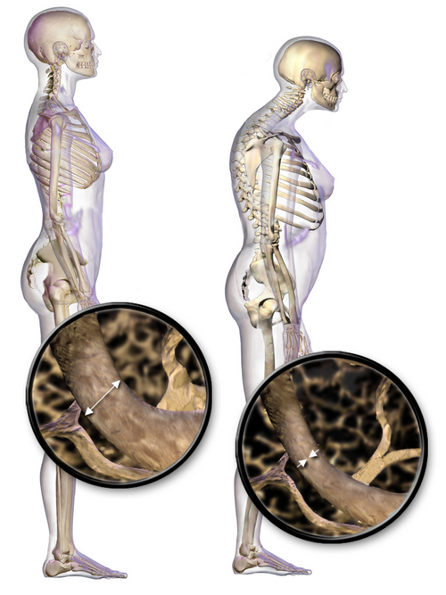

# OSTEOPOROSE PÓS-MENOPAUSA

A osteoporose não é apenas uma doença de "osso fraco". Se você entender que ela é o desfecho final de um desequilíbrio metabólico causado, principalmente, pela queda hormonal, você nunca mais vai errar uma questão de conduta. Como professor, vejo muitos alunos decorarem valores de T-score sem entender por que o osso da mulher na pós-menopausa se comporta de forma tão diferente do osso de um homem da mesma idade.

Neste material, vamos dissecar desde a fisiopatologia molecular até as diretrizes mais recentes da FEBRASGO e da ABRASSO (Associação Brasileira de Avaliação Óssea e Osteometabolismo). O objetivo aqui no MedEvo é que você saia com a segurança de um especialista para responder qualquer prova de residência.

*Figura 1 - Ilustração comparativa entre a estrutura do osso normal (esquerda) e do osso osteoporótico (direita), evidenciando a perda de massa óssea trabecular. Fonte: BruceBlaus, CC BY 3.0 | Wikimedia Commons*

## O Porquê da Perda Óssea: Fisiopatologia

O osso é um tecido vivo, em constante renovação. Esse processo se chama remodelamento ósseo e depende de um equilíbrio fino entre duas células: o osteoclasto (que "come" o osso) e o osteoblasto (que "constrói" o osso).

Na mulher jovem, o estrogênio é o grande maestro desse equilíbrio. Ele atua como um freio natural para os osteoclastos. O estrogênio estimula a produção de uma proteína chamada Osteoprotegerina (OPG), que se liga ao RANKL (um ativador de osteoclastos), impedindo que ele se conecte ao seu receptor RANK.

Quando chega a menopausa, esse freio desaparece. Sem estrogênio, os níveis de OPG caem e o RANKL fica livre para ativar os osteoclastos de forma desenfreada. O resultado? A reabsorção óssea passa a ser muito maior do que a formação. É por isso que a osteoporose pós-menopausa é classificada como uma doença de alto remodelamento.

### O Papel da Estrona (E1)

Um conceito que as bancas adoram: na pós-menopausa, o ovário para de produzir estradiol (E2). O principal estrogênio circulante passa a ser a estrona (E1). Mas de onde ela vem? Ela vem da aromatização periférica dos androgênios (principalmente a androstenediona da adrenal) no tecido adiposo.

Aqui entra uma pegadinha clássica: a obesidade. Mulheres obesas costumam ter níveis mais altos de estrona, o que pode, teoricamente, oferecer uma leve proteção óssea e reduzir fogachos. No entanto, a obesidade traz outros riscos inflamatórios que também prejudicam o osso. O que você precisa levar para a prova é que a magreza (IMC < 19 kg/m²) é um dos fatores de risco mais fortes para fraturas.

## Fatores de Risco e Quem Rastrear

Não saímos pedindo densitometria para todo mundo. O rastreamento deve ser inteligente. Segundo a FEBRASGO e as diretrizes brasileiras, a indicação formal de Densitometria Óssea (DXA) ocorre em:

- Todas as mulheres com 65 anos ou mais.

- Mulheres na pós-menopausa com menos de 65 anos que apresentem pelo menos um fator de risco clínico para fratura.

- Mulheres na transição menopáusica se houver fatores de risco específicos (como uso de corticoides).

- Adultos com fratura por fragilidade prévia.

- Adultos com condições ou uso de medicamentos associados à baixa massa óssea (ex: Artrite Reumatoide, uso crônico de prednisona ≥ 5mg/dia por mais de 3 meses).

### Fatores de Risco que "Despencam" a Massa Óssea

- Idade avançada (o principal fator não modificável).

- Sexo feminino e etnia branca ou asiática.

- História familiar de fratura de quadril (pai ou mãe).

- Tabagismo atual (o fumo é tóxico direto para o osteoblasto).

- Consumo excessivo de álcool (≥ 3 doses/dia).

- Baixo peso (IMC < 19 kg/m²) e baixa estatura.

- Sedentarismo (o osso precisa de carga para se fortalecer).

- Uso de medicamentos: corticoides, anticonvulsivantes, inibidores da aromatase e o uso prolongado de acetato de medroxiprogesterona de depósito (Depo-Provera).

**Dica do Dr. Will:** Cuidado com a dieta hiperproteica. Muitas questões tentam te convencer de que comer muita proteína causa osteoporose. Isso é mito. Na verdade, a ingestão adequada de proteínas é necessária para a formação da matriz colágena do osso. O que acelera a perda é a deficiência estrogênica e o baixo aporte de cálcio.

*Figura 2 - Representação dos locais mais frequentes de fraturas osteoporóticas: vértebras, quadril e punho. Fonte: BruceBlaus, CC BY-SA 4.0 | Wikimedia Commons*

## Diagnóstico: Interpretando a Densitometria

A Densitometria Óssea (DXA) de coluna lombar e fêmur proximal é o padrão-ouro. Mas cuidado com os termos. Para mulheres na pós-menopausa, usamos o T-score. O Z-score é reservado para crianças, adolescentes e mulheres no menacme (pré-menopausa).

O T-score compara a densidade da paciente com a de uma população jovem e saudável. Os critérios da OMS, adotados no Brasil, são claros:

| Classificação | T-score (Desvios Padrão) |
| --- | --- |
| Normal | ≥ -1,0 DP |
| Osteopenia | Entre -1,1 e -2,4 DP |
| Osteoporose | ≤ -2,5 DP |
| Osteoporose Estabelecida | ≤ -2,5 DP + Presença de fratura por fragilidade |

**Exemplo Clínico:** Paciente de 58 anos, menopausa há 3 anos, sem sintomas vasomotores, traz DXA com T-score de -1,2 no colo do fêmur e -0,8 na coluna lombar. Diagnóstico? Osteopenia. Conduta? Mudança de estilo de vida, cálcio e vitamina D. Não precisa de bisfosfonato ainda, a menos que o risco pelo FRAX seja alto.

### O Algoritmo FRAX Brasil

O FRAX é uma ferramenta que calcula a probabilidade de uma fratura osteoporótica maior (clínica vertebral, antebraço, quadril ou úmero) e de fratura de quadril nos próximos 10 anos. Ele é fundamental para decidir o tratamento naquelas pacientes com osteopenia. Se o risco for alto pelo FRAX, tratamos a osteopenia como se fosse osteoporose.

*Figura 2 - Representação dos locais mais frequentes de fraturas osteoporóticas: vértebras, quadril e punho. Fonte: BruceBlaus, CC BY-SA 4.0 | Wikimedia Commons*

## Diagnóstico Diferencial: Não é só Menopausa

Antes de carimbar o diagnóstico de osteoporose pós-menopausa, você deve excluir causas secundárias. O "kit básico" de exames laboratoriais que o professor sempre pede inclui:

- Hemograma completo (excluir mieloma múltiplo e anemias).

- Cálcio sérico, fósforo e fosfatase alcalina.

- Creatinina (para avaliar função renal antes de prescrever bisfosfonatos).

- 25-hidroxivitamina D (25-OH Vit D).

- Calciúria de 24 horas (ajuda a ver se a paciente absorve bem o cálcio ou se perde demais pela urina).

Se o cálcio estiver alto e o fósforo baixo, pense em Hiperparatireoidismo Primário. Se a paciente tiver perda de peso e dor óssea difusa, investigue malignidade.

## Tratamento Não Farmacológico: A Base de Tudo

Não adianta dar o remédio mais caro se a base não estiver feita. Aqui os números caem em prova:

- **Cálcio:** A meta para mulheres na pós-menopausa é de 1.000 a 1.200 mg/dia (preferencialmente via dieta). Se não atingir, suplementamos.

- **Vitamina D:** O nível ideal para pacientes com osteoporose é acima de 30 ng/mL. A dose de manutenção costuma variar entre 800 e 2.000 UI/dia.

- **Exercícios:** Devem ser de impacto (caminhada, corrida) e resistência (musculação). O osso responde ao estresse mecânico. Exercícios sem impacto, como natação, são ótimos para o coração, mas pouco eficazes para a densidade óssea.

- **Cessação do Tabagismo e Álcool:** Essencial.

### Carbonato vs. Citrato de Cálcio

Erro comum de aluno: prescrever carbonato de cálcio para todo mundo.

- **Carbonato de Cálcio:** Mais barato, tem mais cálcio elementar (40%), mas precisa de meio ácido para ser absorvido. Deve ser tomado com as refeições.

- **Citrato de Cálcio:** Tem menos cálcio elementar (21%), mas a absorção independe do pH gástrico. É a escolha para pacientes que usam protetores gástricos (omeprazol) ou que fizeram cirurgia bariátrica.

## Tratamento Farmacológico: O Arsenal Terapêutico

Quando o T-score é ≤ -2,5 ou já houve fratura por fragilidade, o tratamento medicamentoso é mandatório.

### 1. Bisfosfonatos (Primeira Linha)

São os antirreabsortivos mais usados. Eles "grudam" no osso e inibem a ação dos osteoclastos.

- **Alendronato de Sódio:** 70 mg, uma vez por semana, via oral.

- **Risedronato:** 35 mg/semana ou 150 mg/mês, via oral.

- **Ácido Zoledrônico:** 5 mg, uma vez por ano, intravenoso (excelente para adesão).

**Como orientar a tomada (Cai muito!):** O bisfosfonato oral deve ser tomado em jejum, apenas com água, e a paciente deve permanecer em pé ou sentada (ereta) por pelo menos 30 a 60 minutos. Por que? Para evitar a esofagite química, o principal efeito adverso.

### 2. Terapia Hormonal da Menopausa (THM)

A THM é excelente para prevenir a perda óssea. Ela é a primeira escolha para mulheres que estão na "janela de oportunidade" (menos de 60 anos ou menos de 10 anos de menopausa) e que possuem sintomas vasomotores (fogachos).

- Se a mulher tem útero: Estrogênio + Progesterona (para proteger o endométrio).

- Se a mulher é histerectomizada: Estrogênio isolado.

### 3. Moduladores Seletivos do Receptor de Estrogênio (SERMs)

O principal é o **Raloxifeno**. Ele age como agonista do estrogênio no osso (protege contra fraturas vertebrais), mas como antagonista na mama (reduz risco de câncer de mama) e no endométrio.

- **Ponto negativo:** Não melhora fogachos (pode até piorar) e aumenta o risco de tromboembolismo.

### 4. Denosumabe

Um anticorpo monoclonal que inibe o RANKL. É aplicado via subcutânea a cada 6 meses. É uma ótima opção para quem tem intolerância aos bisfosfonatos ou disfunção renal leve a moderada.

### 5. Agentes Anabólicos (Formadores de Osso)

Reservados para casos graves (T-score < -3,0 ou múltiplas fraturas).

- **Teriparatida:** Análogo do PTH. Uso subcutâneo diário por no máximo 2 anos.

- **Romosozumabe:** Inibidor da esclerostina. Duplo efeito (aumenta formação e reduz reabsorção).

## Comparativo de Terapias

| Medicamento | Mecanismo | Via/Frequência | Principal Benefício |
| --- | --- | --- | --- |
| Alendronato | Antirreabsortivo | VO / Semanal | Custo-benefício, reduz fratura de quadril |
| Ácido Zoledrônico | Antirreabsortivo | IV / Anual | Adesão garantida |
| Raloxifeno | SERM | VO / Diário | Proteção adicional contra CA de mama |
| THM | Hormonal | VO ou Transdérmico | Trata fogachos + previne perda óssea |
| Teriparatida | Anabólico | SC / Diário | Osteoporose grave, ganho rápido de massa |

## Situações Especiais e Pegadinhas

**O "Drug Holiday" (Pausa Terapêutica):** Após 5 anos de bisfosfonato oral ou 3 anos de intravenoso, se a paciente estiver estável e com baixo risco, podemos considerar uma pausa. Isso serve para evitar complicações raras do uso prolongado, como a osteonecrose de mandíbula e a fratura atípica de fêmur.

**Câncer de Mama:** Se a paciente tem histórico pessoal de câncer de mama, a THM é contraindicada de forma absoluta. Nesses casos, se ela tiver osteoporose, usamos bisfosfonatos ou raloxifeno.

**Atrofia Endometrial:** Mulheres na pós-menopausa sem THM devem ter um endométrio fino ao ultrassom (≤ 5 mm, ou ≤ 4 mm segundo algumas diretrizes mais rígidas). Se houver espessamento ou sangramento, a investigação com biópsia é necessária, independentemente da saúde óssea.

## Pontos-Chave para Prova 🎯

- **Critério Diagnóstico:** T-score ≤ -2,5 DP na coluna lombar, colo do fêmur ou fêmur total.

- **Osteopenia:** T-score entre -1,1 e -2,4 DP. Trata-se se o FRAX for de alto risco ou se houver fratura prévia.

- **Primeira Linha:** Bisfosfonatos (Alendronato, Risedronato ou Ácido Zoledrônico).

- **Janela de Oportunidade:** THM é ideal para sintomáticas com < 60 anos ou < 10 anos de menopausa.

- **Principal Estrogênio:** Estrona (E1), produzida pela aromatização periférica no tecido adiposo.

- **Suplementação de Cálcio:** Meta de 1.000 a 1.200 mg/dia. Citrato de cálcio para bariátricos ou usuários de IBP.

- **Vitamina D:** Alvo > 30 ng/mL em pacientes de alto risco.

- **Contraindicação Bisfosfonatos:** Insuficiência renal grave (ClCr < 30-35 mL/min) ou doenças esofágicas ativas (para os orais).

- **Efeito Colateral Raro:** Osteonecrose de mandíbula e fratura atípica de fêmur (associados ao uso muito prolongado de bisfosfonatos).

- **Monitoramento:** Repetir DXA a cada 1 ou 2 anos após início do tratamento.

- **Fator de Risco Esquecido:** Tabagismo e baixo peso (IMC < 19) são preditores fortíssimos de fratura.

- **O que NÃO fazer:** Não usar fluoretos (aumentam DMO mas o osso fica frágil) e não pedir PET Scan para rastreio de osteoporose.

- **Histerectomizada:** Pode usar estrogênio isolado na THM. Se tem útero, TEM que usar progesterona junto para evitar câncer de endométrio.

- **Atividade Física:** O foco é carga e impacto. Natação não previne osteoporose.

- **Marcadores de Remodelação (CTx, P1NP):** Úteis para monitorar adesão ao tratamento, mas NÃO servem para diagnóstico.

Lembre-se: na prova, a banca vai tentar te confundir entre osteopenia e osteoporose. Olhe sempre o T-score e procure por fraturas prévias. Se tiver fratura de quadril ou vértebra por baixo impacto, o diagnóstico é osteoporose, não importa o valor da densitometria. Bons estudos!

 Cópia offline para consulta pessoal.
 Fonte original:
 [https://www.medevo.com.br/material-apoio/ler/c3afe809-9f6b-43f3-8c01-34b87d7f8417](https://www.medevo.com.br/material-apoio/ler/c3afe809-9f6b-43f3-8c01-34b87d7f8417)
