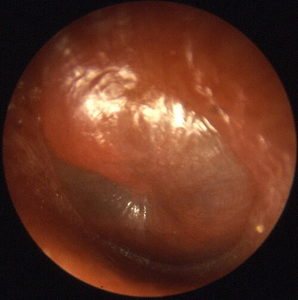
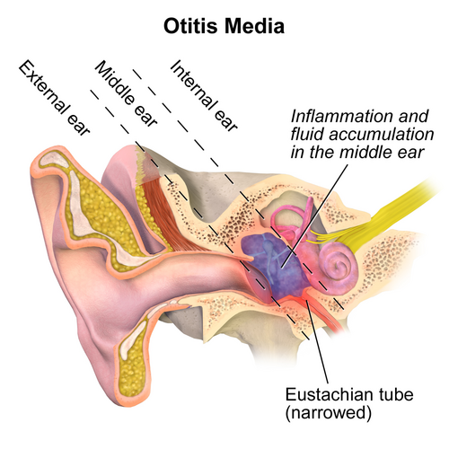

# OTITES E INFECÇÕES DO OUVIDO

Para entender as patologias do ouvido, você precisa primeiro visualizar a anatomia de forma funcional. O ouvido não é apenas um "buraco" que capta som. Ele é dividido em três compartimentos, e as provas de residência exploram exatamente as fronteiras entre eles. A orelha externa vai do pavilhão até a membrana timpânica. A orelha média é uma cavidade aerada que depende fundamentalmente da tuba auditiva. A orelha interna é onde a mágica da transdução ocorre, transformando ondas mecânicas em impulsos elétricos.

Muitos alunos erram questões básicas por não diferenciarem se a perda auditiva é de condução (problema no "caminho" do som) ou neurossensorial (problema no "receptor" ou no nervo). Vamos começar dominando essa base semiológica, pois ela é o alicerce para todo o resto.

## Semiologia Armada: Testes de Weber e Rinne

Se você quer passar em uma residência médica no Brasil, você precisa dominar os testes de diapasão. As bancas amam cobrar isso porque é um exame de beira de leito que define conduta.

### Teste de Rinne

O Rinne compara a condução aérea (CA) com a condução óssea (CO). Você bate o diapasão e o coloca no mastoide do paciente. Quando ele parar de ouvir, você coloca o diapasão próximo ao conduto auditivo.

- **Rinne Positivo (Normal):** O paciente continua ouvindo o som pela via aérea. Isso significa que CA > CO. É o esperado para pessoas normais ou com perda neurossensorial.

- **Rinne Negativo (Alterado):** O paciente não ouve pela via aérea ou ouve melhor pelo osso. Isso significa que CO ≥ CA. Isso é patognomônico de **perda auditiva de condução** (ex: cerume, otite média, perfuração timpânica).

### Teste de Weber

Aqui, você coloca o diapasão no topo da cabeça ou na testa (linha média).

- **Normal:** O som é ouvido igualmente nos dois ouvidos (Weber centralizado).

- **Perda de Condução:** O som lateraliza para o **ouvido doente**. Por que? Porque o ouvido com problema de condução não sofre a interferência do ruído ambiental externo, focando apenas na vibração óssea.

- **Perda Neurossensorial:** O som lateraliza para o **ouvido sadio**. O nervo do ouvido doente simplesmente não consegue captar o sinal.

**Tabela 1: Resumo dos Testes de Diapasão**

| Tipo de Perda | Teste de Rinne | Teste de Weber |
| --- | --- | --- |
| **Normal** | Positivo (CA > CO) | Centralizado |
| **Condução** | Negativo (CO > CA) | Lateraliza para o ouvido doente |
| **Neurossensorial** | Positivo (CA > CO) | Lateraliza para o ouvido sadio |

**Dica de Prova:** Se a questão trouxer um paciente com Rinne negativo à direita e Weber lateralizado para a direita, o diagnóstico é perda de condução à direita. Se o Rinne for positivo bilateralmente, mas o Weber lateralizar para a esquerda, a perda é neurossensorial à direita.

## Otite Externa Aguda (OEA)

A otite externa é a famosa "otite do nadador". O segredo aqui está na fisiopatologia da barreira cutânea. O conduto auditivo externo (CAE) possui um pH naturalmente ácido, que funciona como um mecanismo de defesa contra a proliferação bacteriana.

Quando o paciente se expõe excessivamente à água ou usa hastes flexíveis (cotonetes), ele remove o cerume protetor e altera esse pH. Sem a acidez e a barreira física do cerume, as bactérias fazem a festa.

*Figura 1 - Imagem otoscópica de membrana timpânica com sinais de otite média aguda: hiperemia e abaulamento. Fonte: B. Welleschik, CC BY-SA 3.0 | Wikimedia Commons*

## Etiologia e Quadro Clínico

Os agentes mais comuns são a *Pseudomonas aeruginosa* e o *Staphylococcus aureus*.
O sintoma cardinal é a **otalgia intensa**, que piora muito com a manipulação do pavilhão auricular ou com a pressão no trago (Sinal do Trago positivo). Ao exame físico, você verá um conduto edemaciado, hiperemiado e, muitas vezes, com detritos esbranquiçados ou otorreia.

**Cuidado:** Na otite externa, a membrana timpânica (MT) costuma estar normal ou apenas levemente hiperemiada por contiguidade. Se a MT estiver abaulada e com nível hidroaéreo, o problema é na orelha média.

*Figura 2 - Representação anatômica da otite média, mostrando o acúmulo de fluido inflamatório na cavidade do ouvido médio. Fonte: BruceBlaus, CC BY-SA 4.0 | Wikimedia Commons*

## Tratamento da OEA

O tratamento é prioritariamente **tópico**. Não há necessidade de antibiótico oral para casos não complicados em pacientes imunocompetentes.

- Limpeza do conduto (se houver muito detrito).

- Gotas otológicas contendo Ciprofloxacino ou Polimixina B + Neomicina, associadas a corticoides (para reduzir o edema).

- Analgesia sistêmica potente, pois a dor da OEA é desproporcional ao tamanho da lesão.

### Otite Externa Necrotizante (Maligna)

Esta é a "pegadinha" para pacientes diabéticos ou imunossuprimidos. Não é uma neoplasia, apesar do nome. É uma infecção invasiva por *Pseudomonas* que atinge a base do crânio.

- **Suspeita:** Idoso, diabético, com otalgia refratária ao tratamento tópico e presença de tecido de granulação no assoalho do conduto.

- **Conduta:** Internação, Tomografia de ossos temporais (para ver erosão óssea) e Antibioticoterapia venosa prolongada (Ciprofloxacino IV).

## Otite Média Aguda (OMA)

A OMA é a rainha das questões de pediatria e otorrinolaringologia. Para entender a OMA, você precisa lembrar da Tuba Auditiva. Nas crianças, ela é mais curta, larga e horizontalizada, o que facilita a ascensão de secreções da rinofaringe para a orelha média após um quadro de IVAS (Infecção de Vias Aéreas Superiores).

### Diagnóstico: O que realmente importa?

Segundo as diretrizes da Sociedade Brasileira de Pediatria (SBP), o diagnóstico de OMA requer:

- Início súbito de sinais e sintomas (dor, febre, irritabilidade).

- Presença de efusão na orelha média (abaulamento da MT, mobilidade reduzida na otoscopia pneumática ou otorreia).

- Sinais de inflamação da MT (hiperemia intensa).

**Erro Comum:** Achar que toda membrana vermelha é OMA. Se a criança está chorando muito, a MT pode ficar hiperemiada por congestão vascular. O sinal mais fidedigno de OMA é o **abaulamento**.

*Figura 1 - Imagem otoscópica de membrana timpânica com sinais de otite média aguda: hiperemia e abaulamento. Fonte: B. Welleschik, CC BY-SA 3.0 | Wikimedia Commons*

## Etiologia

Os três mosqueteiros da OMA são:

- *Streptococcus pneumoniae* (Pneumococo) - O mais comum.

- *Haemophilus influenzae* não tipável.

- *Moraxella catarrhalis*.

*Figura 2 - Representação anatômica da otite média, mostrando o acúmulo de fluido inflamatório na cavidade do ouvido médio. Fonte: BruceBlaus, CC BY-SA 4.0 | Wikimedia Commons*

## Tratamento: Tratar ou Observar?

Nem toda OMA precisa de antibiótico imediato. Existe a estratégia de "Observação Vigilante" por 48-72 horas para crianças acima de 2 anos, com sintomas leves e quadro unilateral.

No entanto, você **DEVE** prescrever antibiótico imediatamente se:

- Idade < 6 meses (sempre).

- Crianças entre 6 meses e 2 anos com diagnóstico confirmado.

- Quadro grave (dor moderada a grave, febre > 39°C).

- Otorreia (indica perfuração timpânica).

**Escolha do Antibiótico:**

- **1ª Linha:** Amoxicilina (80-90 mg/kg/dia). Usamos doses altas para vencer a resistência do Pneumococo.

- **Quando usar Amoxicilina + Clavulanato?** Se a criança usou antibiótico nos últimos 30 dias, se houver conjuntivite purulenta associada (sugere *H. influenzae*) ou se houver falha terapêutica após 48-72h de amoxicilina simples.

### Complicações da OMA

A complicação extracraniana mais comum é a **Mastoidite Aguda**.
Imagine o cenário: a criança estava tratando OMA, mas a dor piorou, surgiu febre persistente e, ao exame, o pavilhão auricular está deslocado para frente e para baixo, com edema e flutuação na região retroauricular.

- **Conduta:** Internação, Antibiótico IV e avaliação do especialista para possível miringotomia ou mastoidectomia.

## Otite Média Crônica Supurativa (OMCS)

Diferente da OMA, a OMCS se caracteriza por uma perfuração persistente da membrana timpânica com otorreia crônica (mais de 6-12 semanas), geralmente sem dor.

Aqui, o Dr. Will sempre lembra seus alunos: se o paciente tem otorreia fétida e persistente, pense em **Colesteatoma**. O colesteatoma é um crescimento de epitélio escamoso queratinizado dentro da orelha média. Ele é "localmente invasivo", podendo destruir os ossículos e causar complicações graves como meningite ou abscesso cerebral. O tratamento do colesteatoma é invariavelmente cirúrgico.

## Perda Auditiva Induzida por Ruído (PAIR)

Este é um tema quente em Saúde do Trabalhador e Medicina Preventiva. A PAIR é uma perda auditiva neurossensorial causada pela exposição prolongada a níveis elevados de ruído.

### Características Clássicas (Memorize isso!)

A PAIR tem um perfil muito específico que as bancas adoram explorar:

- **Neurossensorial:** Afeta as células ciliadas externas da cóclea (Órgão de Corti).

- **Irreversível:** Uma vez morta, a célula ciliada não se regenera.

- **Bilateral e Simétrica:** O ruído geralmente atinge os dois ouvidos por igual.

- **Não progressiva após cessar a exposição:** Se o trabalhador sai do ambiente ruidoso, a perda para de piorar. Se continuar piorando, investigue outra causa.

- **Entalhe Audiométrico:** A queda na audiometria ocorre tipicamente nas frequências de **3.000, 4.000 ou 6.000 Hz**, com recuperação em 8.000 Hz.

**Nexo Causal e Conduta:**
Para caracterizar como doença ocupacional, é necessário o nexo entre a exposição e o exame. O empregador deve emitir a CAT (Comunicação de Acidente de Trabalho) e notificar no SINAN. Lembre-se: o uso de EPI (protetor auricular) reduz o risco, mas se a perda já ocorreu, ela é permanente.

**Tabela 2: Diferencial de Perdas Auditivas**

| Condição | Tipo de Perda | Lateralidade | Característica Principal |
| --- | --- | --- | --- |
| **PAIR** | Neurossensorial | Bilateral Simétrica | Entalhe em 4.000 Hz; irreversível |
| **Presbiacusia** | Neurossensorial | Bilateral Simétrica | Idoso; queda em frequências agudas |
| **Cerume** | Condução | Uni ou Bilateral | Melhora após lavagem; Rinne negativo |
| **Surdez Súbita** | Neurossensorial | Unilateral | Emergência médica; uso de corticoide |
| **Otoesclerose** | Condução | Frequentemente Bilateral | Fixação do estribo; herança familiar |

## Afecções Específicas e "Pérolas" de Consultório

### Síndrome de Ramsay Hunt (Herpes Zoster Oticus)

É a reativação do vírus Varicela-Zoster no gânglio geniculado do nervo facial (VII par).

- **Tríade:** Otalgia intensa + Vesículas no pavilhão auricular/conduto + Paralisia facial periférica.

- **Tratamento:** Antivirais (Valaciclovir ou Aciclovir) + Corticoides sistêmicos (Prednisona). O tratamento precoce é fundamental para tentar recuperar a função do nervo facial.

### Cerume Impactado e Lavagem Otológica

O cerume não é sujeira, é proteção. Mas quando impacta, causa hipoacusia de condução e zumbido (comum após banho de mar, pois o cerume hidrata e expande).

- **Técnica de Lavagem:** Use soro fisiológico ou água morna (37°C). Por que morna? Se for fria ou quente demais, você induz uma corrente de convecção na endolinfa (reflexo calórico), causando vertigem súbita e vômitos no paciente.

- **Contraindicações Absolutas:** Suspeita de perfuração da membrana timpânica ou história de cirurgia otológica prévia. Na dúvida, não lave; encaminhe para remoção sob visão direta.

### Tumores de Parótida

Embora não sejam "do ouvido", as patologias da parótida aparecem aqui pelo diagnóstico diferencial de nódulos pré-auriculares.

- **Adenoma Pleomórfico:** É o tumor benigno mais comum da parótida. Tem crescimento lento, é indolor, móvel e fibroelástico. Apesar de benigno, deve ser ressecado pelo risco de malignização tardia (Carcinoma ex-adenoma pleomórfico).

### Hanseníase no Ouvido

A Hanseníase pode causar infiltração do pavilhão auricular (hanseniomas) e perda de sensibilidade térmica e dolorosa na orelha. Se vir uma orelha espessada, com "nódulos" e o paciente não sente a picada de uma agulha no local, pense em Hanseníase.

## Manejo de Mordeduras em Orelha

A orelha é composta basicamente por pele e cartilagem, com pouca vascularização. Mordeduras de cão são frequentes.

- **Conduta:** Limpeza exaustiva, debridamento de tecidos desvitalizados e antibioticoterapia (Amoxicilina + Clavulanato para cobrir *Pasteurella multocida* e anaeróbios). A sutura deve ser feita com cuidado para não deixar cartilagem exposta, o que levaria à condrite.

## Fisiopatologia e Proteção do Conduto

O conduto auditivo externo se defende através de:

- **Cerume:** Rico em lipídios, repele a água e contém lisozimas.

- **pH Ácido:** Inibe o crescimento de *Pseudomonas*.

- **Migração Epitelial:** A pele do conduto "caminha" de dentro para fora, levando a sujeira. Por isso, você nunca deve usar cotonetes; você está empurrando o lixo contra a correnteza.

Como professor, vejo muitos alunos confundindo a conduta na **Surdez Súbita**. Se um paciente chega dizendo que parou de ouvir de um lado "do nada" nas últimas horas, e a otoscopia está normal (sem cerume, sem otite), isso é uma **emergência otorrinolaringológica**. O diagnóstico é Surdez Súbita Idiopática e o tratamento é corticoterapia em altas doses (Prednisona 1mg/kg/dia) o mais rápido possível. Não espere a audiometria para começar o corticoide se a suspeita for alta.

No MedEvo, sempre enfatizamos que a clínica soberana deve guiar o pedido de exames. Se a otoscopia mostra uma membrana íntegra, mas o paciente tem perda auditiva, o problema é "lá dentro" (orelha média ou interna).

## Pontos-Chave para Prova

- **Weber e Rinne:** Rinne negativo = Condução. Weber para o lado doente = Condução. Weber para o lado são = Neurossensorial.

- **OMA:** Amoxicilina 80-90 mg/kg/dia é a primeira escolha. O sinal mais importante é o abaulamento da membrana timpânica.

- **Otite Externa:** Dor à manipulação do trago. Tratamento é tópico (gotas).

- **Otite Externa Necrotizante:** *Pseudomonas* em diabéticos. Atinge base do crânio. Requer Ciprofloxacino IV.

- **Mastoidite:** Complicação da OMA com deslocamento do pavilhão auricular. Requer internação e ATB venoso.

- **PAIR:** Neurossensorial, bilateral, simétrica, irreversível, com entalhe em 4.000 Hz. Não progride sem ruído.

- **Ramsay Hunt:** Paralisia facial + vesículas na orelha. Tratar com Valaciclovir + Prednisona.

- **Lavagem de Ouvido:** Sempre com água morna (37°C) para evitar vertigem. Contraindicada se houver perfuração timpânica.

- **Cerume:** Causa perda de condução. O uso de emolientes (cerumolíticos) facilita a remoção.

- **Adenoma Pleomórfico:** Tumor de parótida mais comum; benigno, crescimento lento e móvel.

- **Presbiacusia:** Perda auditiva do idoso, neurossensorial, bilateral, para frequências agudas.

- **Pérola de Ouro:** Se a questão fala em "otorreia fétida" e "massa esbranquiçada" na otoscopia, marque **Colesteatoma**.

- **Notificação:** PAIR ocupacional é agravo de notificação compulsória (SINAN) e exige emissão de CAT.

- **Hipoacusia Súbita:** Unilateral, neurossensorial, sem causa óbvia = Corticoide sistêmico imediato.

- **Fator Protetor:** O pH ácido do conduto auditivo externo é a principal defesa contra otite externa bacteriana. 🩺

 Cópia offline para consulta pessoal.
 Fonte original:
 [https://www.medevo.com.br/material-apoio/ler/a4c5b2cd-9d22-4b7a-884e-fa1160c21c4f](https://www.medevo.com.br/material-apoio/ler/a4c5b2cd-9d22-4b7a-884e-fa1160c21c4f)
