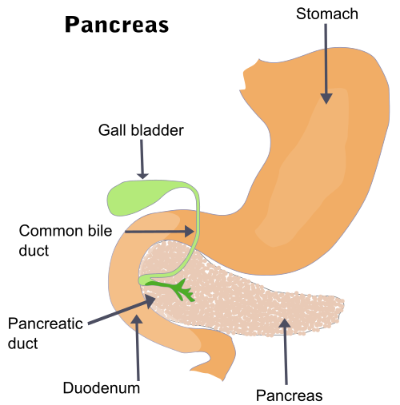
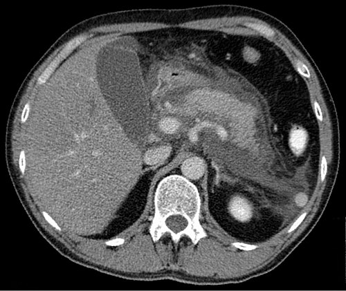

# PANCREATITE AGUDA

Para entender a pancreatite aguda, você precisa visualizar o pâncreas não apenas como uma glândula, mas como uma "bomba biológica" cheia de enzimas digestivas potentes. Na pancreatite, essa bomba explode para dentro. É a autodigestão.

O diagnóstico não é um "acho que é". Ele é objetivo. Segundo a Classificação de Atlanta (revisada em 2012), que é a bíblia das provas, o diagnóstico exige **2 dos 3 critérios** abaixo:

- Dor abdominal característica (epigástrica, em barra, irradiando para o dorso, início súbito).

- Amilase ou Lipase ≥ 3 vezes o limite superior da normalidade.

- Achados característicos em exames de imagem (TC, RM ou USG).

**Cuidado:** Se o paciente tem dor típica e enzimas triplicadas, você **não** precisa de Tomografia para fechar o diagnóstico. Muitos alunos erram querendo pedir TC para todo mundo na admissão. Guarde isso: a TC na admissão só serve se houver dúvida diagnóstica.

## Anatomia e Embriologia: O que o cirurgião precisa saber

As bancas de cirurgia adoram cobrar a irrigação pancreática porque ela é o "nó" do retroperitônio. O pâncreas é irrigado por dois sistemas principais que se anastomosam:

- **Arcadas Pancreaticoduodenais Superiores:** Ramos da artéria gastroduodenal (que vem da hepática comum, do tronco celíaco).

- **Arcadas Pancreaticoduodenais Inferiores:** Ramos da artéria mesentérica superior (AMS).

**Dica de Prova:** A artéria gástrica esquerda **não** irriga o pâncreas. Se aparecer em alternativa de irrigação, pode riscar. Outro ponto: a veia esplênica corre atrás do pâncreas. Se houver pancreatite crônica, ela pode trombosar, gerando varizes gástricas isoladas (hipertensão portal segmentar).

Embriologicamente, o pâncreas nasce de dois brotos (ventral e dorsal). O broto ventral gira e se funde ao dorsal. Se isso falha, temos o **Pâncreas Divisum** (maior risco de pancreatite obstrutiva) ou o **Pâncreas Anular** (estrangula o duodeno).

*Figura 1 - Ilustração anatômica do pâncreas mostrando sua relação com o duodeno, ducto pancreático e via biliar. Fonte: SEER/Cradel, Domínio Público | Wikimedia Commons*

## Etiologia: Por que o pâncreas inflamou?

No Brasil, você vai focar em duas causas que dominam 80% dos casos:

- **Biliar (30-60%):** Um cálculo sai da vesícula, entala na ampola de Vater e causa refluxo biliar ou hipertensão no ducto pancreático. É a causa mais comum em mulheres.

- **Alcoólica (15-30%):** O álcool tem efeito tóxico direto nos acinos e altera a secreção proteica, formando "plugs" que obstruem os ductos. Mais comum em homens.

**Outras causas importantes para prova:**

- **Hipertrigliceridemia:** Geralmente quando TG > 1.000 mg/dL. O soro do paciente fica leitoso (lipêmico).

- **Pós-CPER:** A manipulação da papila pode inflamar o pâncreas.

- **Drogas:** Azatioprina, tiazídicos, furosemida, ácido valproico.

- **Escorpião:** O gênero *Tityus* (comum no Brasil) pode causar pancreatite por superestimulação colinérgica.

*Figura 2 - TC axial de abdome demonstrando pancreatite aguda exsudativa com coleções líquidas peripancreáticas. Fonte: Hellerhoff, CC BY-SA 3.0 | Wikimedia Commons*

## Fisiopatologia: A cascata da destruição

Por que a amilase sobe? Porque o acino pancreático sofre uma lesão que ativa o tripsinogênio em tripsina precocemente, ainda dentro do pâncreas. A tripsina ativa todas as outras enzimas (elastase, fosfolipase).

Isso gera uma resposta inflamatória sistêmica (SIRS). O pâncreas "vaza" citocinas para o sangue, o que explica por que o paciente morre de insuficiência renal ou respiratória, e não apenas da "dor na barriga". Como diz o Dr. Will nas discussões do MedEvo, "a pancreatite é uma doença sistêmica com manifestação abdominal".

## Quadro Clínico e Exame Físico

A dor é clássica: epigástrica, de início súbito, "em barra" (irradia para os hipocôndrios) e para o dorso. O paciente costuma chegar com náuseas e vômitos intensos.

No exame físico, procure por:

- **Sinal de Cullen:** Equimose periumbilical.

- **Sinal de Grey-Turner:** Equimose nos flancos.

- **Sinal de Fox:** Equimose na base do ligamento inguinal.

**Pérola de Prova:** Esses sinais cutâneos indicam hemoperitônio e estão associados à **pancreatite necro-hemorrágica** (grave). Eles não aparecem na pancreatite leve.

## Diagnóstico Laboratorial e Diferencial

| Marcador | Sensibilidade/Especificidade | Comentário de Professor |
| --- | --- | --- |
| **Amilase** | Alta sensibilidade, baixa especificidade | Sobe rápido (2-12h) e desce rápido (3-5 dias). Pode estar normal na pancreatite alcoólica ou hipertrigliceridemia. |
| **Lipase** | Alta sensibilidade e especificidade | Permanece elevada por mais tempo (7-14 dias). É a preferida pelas diretrizes. |

**Cuidado com a pegadinha:** O valor absoluto da enzima (ex: amilase de 5.000 vs 1.000) **não** indica gravidade. Indica apenas diagnóstico. Um paciente com 5.000 pode ter uma pancreatite leve, e um com 400 (pouco acima do corte) pode estar em choque.

**Diagnóstico Diferencial:**
Sempre descarte Úlcera Peptica Perfurada (procure pneumoperitônio), Isquemia Mesentérica (dor desproporcional ao exame físico) e IAM de parede inferior.

## Estratificação de Gravidade: Onde o aluno se perde

Aqui é onde as bancas fazem a festa. Existem vários escores, mas você precisa focar em três:

### 1. Critérios de Atlanta (O mais usado na prática e em provas modernas)

- **Leve:** Sem falência orgânica e sem complicações locais.

- **Moderadamente Grave:** Falência orgânica **transitória** (resolve em < 48h) OU complicações locais (coleções).

- **Grave:** Falência orgânica **persistente** (> 48h).

**O que é falência orgânica?** Choque (PAS < 90), Insuficiência Respiratória (PaO2/FiO2 < 300) ou Insuficiência Renal (Creatinina > 1.9 mg/dL).

### 2. Critérios de Ranson

Avalia o prognóstico. São 11 parâmetros. Se ≥ 3, é pancreatite grave.

- **Na Admissão (LEGAL):** **L**eucocitose (>16k), **E**nzima TGO (>250), **G**licemia (>200), **A**ge (>55 anos), **L**DH (>350).

- **Nas 48h (FECHOU):** **F**luido (sequestro >6L), **E**xcesso de base (BE < -4), **C**álcio (<8), **H**ematócrito (queda >10%), **O**xigênio (PO2 <60), **U**reia (aumento >5).

**Atenção:** Para pancreatite **biliar**, os valores do Ranson mudam (ex: Leucócitos > 18.000). Fique atento ao enunciado!

### 3. Escore de Balthazar (Tomográfico)

Avalia a gravidade pela imagem (TC com contraste, idealmente após 72h do início da dor).

| Grau | Achado Tomográfico |
| --- | --- |
| **A** | Pâncreas normal |
| **B** | Aumento focal ou difuso do pâncreas |
| **C** | Inflamação da gordura peripancreática |
| **D** | Uma coleção líquida mal definida |
| **E** | Duas ou mais coleções ou presença de GÁS |

**Presença de GÁS = Necrose Infectada até que se prove o contrário.**

## Exames de Imagem: O "Timing" é tudo

- **USG Abdominal:** Deve ser feito em **todos** na admissão. Por quê? Para ver se tem cálculo na vesícula (etiologia biliar). O USG é ruim para ver o pâncreas (gás intestinal atrapalha), mas é ótimo para ver a causa.

- **TC de Abdome com Contraste:** **NÃO** faça nas primeiras 48-72h, a menos que haja dúvida diagnóstica. Por quê? Porque a necrose demora para aparecer. Se você fizer cedo demais, o pâncreas pode parecer normal e você subestima a gravidade.

## Tratamento da Pancreatite Aguda Leve

O tratamento é o tripé: **Dieta Zero + Hidratação Venosa + Analgesia.**

- **Hidratação:** Deve ser vigorosa (Ringer Lactato é preferível ao Soro Fisiológico para evitar acidose hiperclorêmica). Mas cuidado: hidratação excessiva em idosos ou cardiopatas pode causar edema pulmonar e Síndrome Compartimental Abdominal (PIA > 20 mmHg).

- **Analgesia:** Opioides podem ser usados (meperidina era clássica, mas hoje usamos morfina ou fentanil sem medo da "contração do esfíncter de Oddi" – isso é mais teórico que clínico).

- **Dieta:** Assim que o paciente tiver fome e a dor diminuir, reinicie a dieta oral (geralmente em 24-48h). Não precisa esperar a amilase normalizar!

**Conduta na Pancreatite Biliar Leve:** O paciente **deve** sair do hospital de vesícula retirada. A colecistectomia deve ser feita na mesma internação. Se você der alta para ele operar "daqui a 30 dias", ele tem 25% de chance de voltar com uma pancreatite pior na semana seguinte.

## Tratamento da Pancreatite Aguda Grave

Aqui o jogo muda. O paciente vai para a UTI.

- **Nutrição:** A preferência é **Enteral** (sonda nasoentérica). Por que não parenteral? Porque a nutrição enteral mantém a barreira intestinal íntegra, evitando a translocação bacteriana que infecta a necrose.

- **Antibióticos:** **NÃO se faz antibioticoprofilaxia.** Isso cai em toda prova. Mesmo na necrose estéril, não fazemos ATB. Só usamos se houver evidência de infecção (febre, leucocitose persistente, gás na TC ou punção positiva).

## Complicações Locais: O Calendário da Pancreatite

As complicações se dividem pelo tempo (corte de 4 semanas):

### 4 semanas (ganham parede):

- **Pseudocisto:** Coleção de suco pancreático envolta por parede de tecido de granulação (não tem epitélio, por isso "pseudo").

- *Quando tratar?* Apenas se for sintomático (dor, obstrução gástrica, icterícia) ou se complicar (infectar, romper).

- *Como?* Drenagem endoscópica (cistogastroanastomose) é o padrão-ouro.

- **Necrose Murada (WON - Walled-off Necrosis):** Necrose delimitada por parede.

- *Conduta:* Se infectada, precisa de necrosectomia (preferencialmente minimamente invasiva ou endoscópica).

## Indicações Cirúrgicas: Quando o cirurgião entra em cena?

A cirurgia na pancreatite aguda é, na maioria das vezes, para tratar complicações.

- **Necrose Infectada:** É a principal indicação. O ideal é esperar 4 semanas para a necrose "amadurecer" (ficar mais fácil de descolar do tecido vivo). Se operar na primeira semana, o sangramento é imenso e a mortalidade explode.

- **Abdomen Agudo Perfurativo ou Isquêmico:** Complicações raras da pancreatite.

- **Síndrome Compartimental Abdominal:** Se as medidas clínicas falharem.

**O que é a Necrosectomia?** É a retirada do tecido desvitalizado. Hoje preferimos o "Step-up approach": primeiro drenagem percutânea ou endoscópica; se não melhorar, aí sim fazemos a necrosectomia cirúrgica (vídeo ou aberta).

## Pancreatite Biliar e a CPER

Muitos alunos confundem quando pedir CPER (Colangiopancreatografia Retrógrada Endoscópica).

- **CPER Urgente (em 24h):** Se houver Pancreatite + Colangite (Febre, Icterícia, Dor).

- **CPER Precoce:** Se houver obstrução biliar persistente (Bilirrubinas subindo, colédoco dilatado e paciente não melhora).

- **Pancreatite biliar sem colangite ou obstrução:** Não precisa de CPER. Faz a colecistectomia depois.

## Tumores Pancreáticos: O que cai "de carona"

As bancas adoram misturar pancreatite com massas pancreáticas.

- **Tumor de Frantz (Sólido-Cístico Pseudopapilar):** Mulher jovem, massa grande na cauda do pâncreas, benigno mas com potencial de malignização. Tratamento: Ressecção.

- **Cistoadenoma Seroso:** Aspecto em "favo de mel" com cicatriz central. Benigno. Conduta: Observar.

- **Cistoadenoma Mucinoso:** Potencial maligno. Precisa de ressecção.

- **Insulinoma:** Tumor neuroendócrino mais comum. Tríade de Whipple (sintomas de hipoglicemia + glicemia baixa + melhora com glicose).

## Tabela Comparativa: Coleções na Pancreatite

| Coleção | Tempo | Conteúdo | Parede | Conduta Inicial |
| --- | --- | --- | --- | --- |
| **Aguda Fluida** | < 4 sem | Líquido | Não | Expectante |
| **Aguda Necrótica** | < 4 sem | Líquido + Sólido | Não | Expectante |
| **Pseudocisto** | > 4 sem | Líquido | Tec. Granulação | Expectante (se assintomático) |
| **WON (Murada)** | > 4 sem | Líquido + Sólido | Fibrosa/Granul. | Necrosectomia (se infectada) |

## Pontos-Chave para Prova

- **Diagnóstico:** 2 de 3 (Dor, Enzimas 3x, Imagem). Amilase/Lipase isoladas não dão diagnóstico.

- **Etiologia:** Biliar é a nº 1. Peça USG para todos.

- **TC de Abdome:** Não peça antes de 72h de dor, a menos que o diagnóstico seja incerto.

- **Antibióticos:** **NUNCA** faça profilático. Use apenas para necrose infectada comprovada.

- **Nutrição:** Enteral é melhor que Parenteral. Previne infecção da necrose.

- **Gravidade (Atlanta):** Grave = Falência orgânica > 48h. Moderada = Falência < 48h ou complicação local.

- **Ranson:** Memorize o "LEGAL" e "FECHOU". Sequestro de líquido > 6L é sinal de gravidade.

- **Necrose Infectada:** Suspeite se houver gás na TC ou piora clínica após 7-10 dias.

- **Timing Cirúrgico:** Adie a necrosectomia o máximo possível (ideal > 4 semanas).

- **Colecistectomia:** Na pancreatite biliar leve, deve ser feita na mesma internação.

- **CPER:** Obrigatória apenas se houver Colangite associada.

- **Tumor de Frantz:** Mulher jovem + lesão sólido-cística = Ressecção.

- **Insulinoma:** Tumor funcionante mais comum; causa hipoglicemia de jejum.

- **Fístula Pancreática:** Perda de bicarbonato leva à acidose metabólica hiperclorêmica.

- **Sinal de Chilaiditi:** É apenas o cólon na frente do fígado. Não tem nada a ver com pancreatite, é pegadinha de imagem. 💡

 Cópia offline para consulta pessoal.
 Fonte original:
 [https://www.medevo.com.br/material-apoio/ler/19612341-3054-4d52-a575-a83e46d1c60f](https://www.medevo.com.br/material-apoio/ler/19612341-3054-4d52-a575-a83e46d1c60f)
