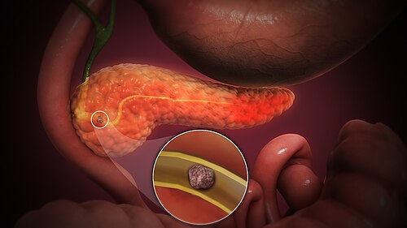

# PANCREATITE AGUDA: NECROSE, PSEUDOCISTO E INFECÇÃO

Para entender as complicações da pancreatite aguda, primeiro você precisa dominar a linha do tempo da doença. O grande erro de muitos alunos é tentar decorar nomes de coleções sem entender que elas são processos evolutivos. Na prova de residência, o examinador vai te dar o tempo de evolução e o aspecto da imagem; se você souber a cronologia, você mata a questão.

A base de tudo é a Classificação de Atlanta revisada. Ela divide a pancreatite em duas fases: a precoce (primeira semana), marcada pela resposta inflamatória sistêmica (SIRS) e falência orgânica, e a tardia (após a primeira semana), onde as complicações locais ganham protagonismo. É aqui, na fase tardia, que moram a necrose, o pseudocisto e a infecção.

*Figura 1 - Representação 3D do pâncreas inflamado na pancreatite aguda, evidenciando edema e alterações parenquimatosas. Fonte: Scientific Animations, CC BY-SA 4.0 | Wikimedia Commons*

## Diagnóstico e Definição: O Ponto de Partida

Antes de falarmos de necrose, lembre-se: para diagnosticar pancreatite aguda, você precisa de 2 de 3 critérios:

- Dor abdominal típica (epigástrica, em faixa, irradiando para o dorso).

- Amilase ou Lipase > 3x o limite superior da normalidade.

- Achados característicos em exames de imagem (TC, RM ou USG).

Cuidado: se o paciente tem dor típica e enzimas alteradas, a Tomografia Computadorizada (TC) na admissão é desnecessária e pode até ser prejudicial. A TC com contraste deve ser reservada para casos de dúvida diagnóstica ou para avaliar complicações após 72-96 horas do início dos sintomas. Por que esperar? Porque a necrose pancreática demora a se delimitar. Se você fizer o exame cedo demais, o pâncreas pode parecer normal, e você vai subestimar a gravidade.

## Manejo Inicial Atualizado: O que Não Pode Faltar

Mesmo em um material focado em necrose e pseudocisto, a prova costuma cobrar as primeiras 24-48 horas:

- **Reposição volêmica:** preferir Ringer lactato e hidratação moderada/guiada por metas, acompanhando PA, diurese, BUN, hematócrito e sinais de sobrecarga. Evite expansão agressiva para todo mundo, especialmente em idosos, cardiopatas e renais crônicos.

- **Analgesia e antiemético:** tratar dor e vômitos de forma ativa para permitir mobilização e alimentação.

- **Alimentação:** na pancreatite leve, dieta oral precoce conforme tolerância, inclusive dieta sólida pobre em gordura, é segura. Jejum prolongado não é tratamento. Na pancreatite grave/necrotizante, se não houver tolerância oral, prefira nutrição enteral; a parenteral fica para falha/intolerância da via enteral.

- **ERCP:** não é rotina. Indique precocemente se houver colangite ou obstrução biliar persistente.

*Figura 2 - Tomografia computadorizada axial demonstrando pancreatite aguda com extensas coleções líquidas peripancreáticas. Fonte: Hellerhoff, CC BY-SA 3.0 | Wikimedia Commons*

## Coleções Líquidas e Necróticas: Entendendo a Diferença

Este é o tópico que mais gera confusão. Para facilitar sua vida, divida as coleções em dois grupos: as que contêm apenas líquido e as que contêm necrose (tecido sólido/debris). Depois, divida pelo tempo: antes ou depois de 4 semanas.

### Coleções de Conteúdo Apenas Líquido (Pancreatite Intersticial)

Ocorre em cerca de 80-85% dos casos. O parênquima pancreático realça uniformemente pelo contraste na TC.

- **Coleção Líquida Peripancreática Aguda (CLPA):** Ocorre nas primeiras 4 semanas. Não tem parede definida. A conduta aqui, como o Dr. Will sempre enfatiza em suas discussões de caso no MedEvo, é **observação**. A imensa maioria regride espontaneamente. Não invente de drenar uma coleção fluida na primeira semana!

- **Pseudocisto Pancreático:** É a evolução da CLPA que não regrediu após 4 semanas. Ele ganha uma parede fibrosa (não epitelial, por isso "pseudo"). É preenchido por suco pancreático rico em enzimas.

### Coleções com Necrose (Pancreatite Necrotizante)

Ocorre em 15-20% dos casos. Na TC, você verá áreas que não realçam pelo contraste (pâncreas "preto" ou "sujo").

- **Coleção Necrótica Aguda (CNA):** Ocorre nas primeiras 4 semanas. Contém tanto líquido quanto tecido necrótico. É uma massa heterogênea e sem parede.

- **Necrose Delimitada (Walled-off Necrosis - WON):** É a CNA após 4 semanas. O organismo consegue criar uma parede ao redor daquela necrose.

**Tabela 1: Diferenciação das Coleções Pancreáticas (Classificação de Atlanta)**

| Tipo de Pancreatite | < 4 Semanas | > 4 Semanas |
| --- | --- | --- |
| **Intersticial (Líquido)** | Coleção Líquida Peripancreática Aguda (CLPA) | Pseudocisto |
| **Necrotizante (Sólido/Líquido)** | Coleção Necrótica Aguda (CNA) | Necrose Delimitada (WON) |

## O Pseudocisto Pancreático: Quando Intervir?

O pseudocisto é uma "queridinho" das bancas. Ele costuma aparecer no corpo ou cauda do pâncreas. A pegadinha clássica é: "Paciente com pseudocisto de 5cm, assintomático. Qual a conduta?". A resposta é **observação**.

A indicação de tratamento para o pseudocisto não é apenas o tamanho, mas sim a presença de sintomas ou complicações. Intervimos se houver:

- Sintomas: Dor persistente, saciedade precoce (compressão gástrica), náuseas e vômitos.

- Complicações: Infecção, hemorragia (pseudoaneurisma) ou obstrução biliar/duodenal.

- Evolução/risco: aumento progressivo, dúvida diagnóstica com neoplasia cística ou persistência associada a sintomas. **Tamanho isolado não indica drenagem**; a regra moderna é observar pseudocisto assintomático mesmo quando grande, desde que não haja complicação.

### Como drenar?

A preferência atual é pela **drenagem interna**. Podemos fazer isso por via endoscópica (cistogastroanastomose ou cistoduodenoanastomose) ou cirúrgica. A drenagem percutânea (externa) deve ser evitada no pseudocisto porque cria um caminho para o exterior, facilitando a formação de uma **fístula pancreática cutânea**.

Se a prova perguntar sobre o líquido do pseudocisto: ele é claro, tem amilase muito alta, CEA baixo e ausência de mucina. Se tiver mucina ou CEA alto, pense em neoplasia cística!

## Necrose Pancreática: O Desafio da Infecção

A necrose estéril não deve ser operada. Repito: necrose estéril é manejo clínico com suporte, nutrição (preferencialmente enteral) e hidratação. O problema começa quando a necrose infecta.

A infecção ocorre geralmente por **translocação bacteriana** do cólon. Como suspeitar? O paciente vinha melhorando e, de repente, volta a ter febre, leucocitose e piora da dor após a segunda semana de doença.

### O Sinal Praticamente Diagnóstico

Se você vir uma TC de abdome com **gás dentro da coleção necrótica**, trate como necrose infectada. Não precisa de punção. Se não houver gás, mas o paciente deteriora ou não melhora após 7-10 dias, a suspeita clínica já justifica antibiótico e discussão multidisciplinar; a PAAF para cultura não é mais rotina nas diretrizes atuais.

### Tratamento da Necrose Infectada: O "Step-up Approach"

Este é o conceito mais moderno e cobrado. Antigamente, necrose infectada era igual a laparotomia imediata. Hoje, isso é erro grave! O estudo PANTER provou que a abordagem escalonada (Step-up) é superior.

- **Antibioticoterapia:** Use antibióticos com penetração em necrose pancreática quando houver infecção suspeita/confirmada. Carbapenêmicos (imipenem/meropenem) são opções clássicas; quinolona + metronidazol ou piperacilina-tazobactam podem ser alternativas conforme perfil local, cultura e gravidade. Não use antibiótico profilático na necrose estéril.

- **Drenagem Percutânea ou Endoscópica:** Se o paciente não melhora com ATB, o primeiro passo invasivo é drenar o líquido infectado sob pressão, sem tentar tirar a necrose sólida ainda. Isso estabiliza o paciente em até 35-40% dos casos.

- **Necrosectomia Minimamente Invasiva:** Se a drenagem não bastar, partimos para a retirada do tecido morto, preferencialmente por via retroperitoneal (VARD) ou endoscópica.

- **Laparotomia:** Reservada apenas para casos de falha das medidas anteriores ou instabilidade hemodinâmica grave (necrose hemorrágica).

**Lembre-se do timing:** A cirurgia deve ser postergada o máximo possível (idealmente > 4 semanas). Por que? Porque antes disso a necrose é uma "sopa" pegajosa misturada com tecido vivo. Se você entrar com o bisturi cedo, vai causar sangramento e tirar pâncreas sadio. Após 4 semanas, a necrose está "delimitada" (WON), facilitando a remoção apenas do tecido morto.

## Fístulas Pancreáticas: A Complicação Pós-Operatória

Seja após uma necrosectomia ou uma cirurgia de Whipple (gastroduodenopancreatectomia), a fístula é o pesadelo do cirurgião.

O diagnóstico é feito dosando a **amilase no líquido do dreno**. Se o valor for > 3x o limite superior da amilase sérica, temos uma fístula.

- **Fatores que reduzem o risco de fístula (Pérola de Prova):** Pâncreas firme (fibroso, como na pancreatite crônica), ducto pancreático dilatado (> 3mm) e perda sanguínea mínima durante a cirurgia. Pâncreas "mole" e ducto fino são os que mais vazam.

O manejo inicial da fístula de baixo débito e paciente estável é conservador: dieta zero ou enteral distal, análogos da somatostatina (octreotide) para diminuir a secreção e manutenção do dreno.

## Pancreatite Biliar e o Momento da Colecistectomia

Se a causa da pancreatite foi um cálculo biliar, você PRECISA tirar a vesícula para evitar recidiva. Mas quando?

- **Pancreatite Leve:** Colecistectomia na mesma internação, assim que o paciente tolerar dieta e a dor melhorar. Se der alta sem operar, ele volta em semanas com nova pancreatite.

- **Pancreatite Grave/Necrotizante:** Esperar pelo menos 6 semanas. Por que? Para dar tempo da inflamação local ceder e as coleções se resolverem ou organizarem. Operar uma vesícula no meio de um pâncreas inflamado e necrótico é pedir para ter complicações.

## Diagnósticos Diferenciais Importantes

Nem tudo que é cisto no pâncreas é pseudocisto. Fique atento a estas dicas:

- **Neoplasia Cística Mucinosa (NCM):** Comum em mulheres, corpo/cauda do pâncreas. Na TC, apresenta **calcificação em "casca de ovo"** na parede do cisto. Isso é altamente sugestivo de neoplasia e não de pseudocisto.

- **“Abscesso pancreático”:** Termo antigo que saiu da nomenclatura da Atlanta revisada. Na prática atual, pense em **WON/necrose infectada** quando houver coleção tardia com conteúdo necrótico e infecção; a conduta é antibiótico + drenagem/necrosectomia conforme evolução.

**Tabela 2: Comparativo de Condutas nas Complicações**

| Complicação | Conduta Inicial | Por que? |
| --- | --- | --- |
| Necrose Estéril | Suporte + Nutrição Enteral | Evitar infecção e manter barreira intestinal. |
| Necrose Infectada (Estável) | Antibiótico (Imipenem) | Tentar postergar intervenção para delimitação. |
| Necrose Infectada (Piora) | Drenagem Percutânea (Step-up) | Menor morbidade que cirurgia aberta. |
| Pseudocisto Assintomático | Observação | Grande chance de resolução espontânea. |
| Pseudocisto Sintomático | Drenagem Interna (Endoscópica) | Evita fístulas cutâneas e resolve o sintoma. |

## Nutrição: Onde Muitos Alunos Erram

Antigamente dizia-se: "Pancreatite tem que deixar o pâncreas em repouso". **Isso caiu por terra.**

- **Pancreatite leve:** alimentação oral precoce em 24-48 horas conforme tolerância; pode iniciar com dieta sólida pobre em gordura, sem precisar passar obrigatoriamente por líquidos claros.

- **Pancreatite grave/necrotizante:** se o paciente não tolera via oral, use nutrição enteral. Sonda nasogástrica e nasojejunal têm eficácia semelhante; escolha a via viável.

- **Nutrição parenteral:** fica reservada para quando a via enteral é indisponível, não tolerada ou insuficiente para atingir metas calóricas.

## Exemplo Clínico para Fixação

Imagine um paciente de 52 anos, internado há 20 dias por pancreatite aguda grave de origem alcoólica. Ele estava em desmame de oxigênio e aceitando dieta enteral, mas hoje iniciou com febre de 38,8°C e aumento da dor abdominal. A TC mostra uma coleção heterogênea com focos de gás no interior.

**O que você faz?**
Primeiro, você reconhece que ele tem uma **Necrose Infectada** (pelo gás na TC e clínica de febre tardia). Como ele está estável, você inicia antibiótico com penetração em necrose pancreática e aciona gastro/endoscopia, cirurgia e radiologia intervencionista. Se não houver melhora ou houver piora, o próximo passo é **drenagem percutânea ou endoscópica guiada por imagem**. Você NÃO indica laparotomia imediata, pois ele está no 20º dia (a necrose ainda não está totalmente organizada) e o Step-up approach manda drenar antes de cortar.

## Pontos-Chave para Prova 💡

- **Critérios de Atlanta:** Essenciais para classificar gravidade e tipo de coleção.

- **Tempo de 4 semanas:** É o divisor de águas entre coleções agudas e coleções organizadas (Pseudocisto e WON).

- **Necrose Infectada:** Suspeite se houver febre após 2 semanas ou gás na TC.

- **Antibiótico Profilático:** NÃO é indicado na pancreatite aguda, mesmo na necrotizante estéril. Só use se houver suspeita/confirmação de infecção.

- **Antibióticos na necrose infectada:** escolha drogas com penetração em necrose pancreática; carbapenêmicos são clássicos, mas não são a única opção.

- **Step-up Approach:** Drenagem percutânea/endoscópica antes da necrosectomia cirúrgica.

- **Nutrição Enteral:** Sempre preferível à parenteral para evitar translocação bacteriana.

- **Pseudocisto:** Drenagem interna (endoscópica ou cirúrgica) apenas se sintomático, complicado, crescente ou com dúvida diagnóstica; tamanho isolado não basta.

- **Amilase no Dreno:** Valor > 3x o sérico confirma fístula pancreática.

- **Colecistectomia:** Na mesma internação se pancreatite leve; após 6 semanas se pancreatite grave.

- **Calcificação em Casca de Ovo:** Pense em Neoplasia Cística Mucinosa, não em pseudocisto.

- **Laparotomia Precoce:** É contraindicada na necrose infectada estável (aumenta mortalidade).

- **CPRE:** Serve para colangite/coledocolitíase com obstrução persistente; NÃO é rotina na pancreatite biliar leve e NÃO drena necrose ou pseudocisto.

- **Drenagem Externa de Pseudocisto:** Evitar ao máximo pelo risco de fístula pancreatocutânea.

- **Massa Epigástrica Palpável:** Após 4 semanas de pancreatite, a principal hipótese é pseudocisto.

- **Líquido do Pseudocisto:** Rico em amilase, pobre em CEA e sem mucina.

- **Fatores de Risco para Fístula Pós-Whipple:** Pâncreas mole, ducto fino (< 3mm) e grande perda sanguínea.

- **Tratamento Inicial da Pancreatite:** Ringer lactato com hidratação moderada guiada por metas, analgesia e alimentação oral precoce se tolerada; jejum só se vômitos, íleo ou intolerância.

Ao revisar este material, foque na compreensão do porquê de cada conduta. As bancas de residência, como as da USP, UNICAMP e o Enare, têm migrado de questões de decoreba para questões de raciocínio clínico baseado em diretrizes. Entender a fisiopatologia da necrose e a organização das coleções te coloca à frente da maioria dos candidatos.

 Cópia offline para consulta pessoal.
 Fonte original:
 [https://www.medevo.com.br/material-apoio/ler/4b9fe532-24d8-427d-9717-baefbb49311f](https://www.medevo.com.br/material-apoio/ler/4b9fe532-24d8-427d-9717-baefbb49311f)
