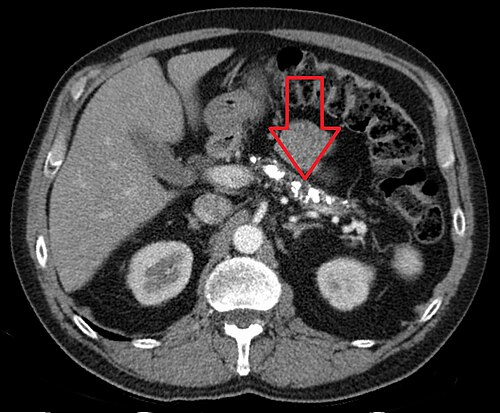

# PANCREATITE CRÔNICA

A pancreatite crônica não é apenas uma "pancreatite aguda que dura muito tempo". Se você levar esse conceito para a prova, vai errar. Entenda: a pancreatite aguda é um evento inflamatório súbito que, na maioria das vezes, permite a recuperação ad integrum do órgão. Já a **pancreatite crônica é uma doença fibroinflamatória progressiva e irreversível**.

Imagine o pâncreas como uma esponja funcional que produz enzimas e hormônios. Na pancreatite crônica, essa esponja vai sendo lentamente substituída por cicatrizes (fibrose). O resultado? O pâncreas perde sua função exócrina (digestão) e endócrina (controle glicêmico), além de gerar um quadro de dor que é, muitas vezes, o maior desafio do cirurgião.

*Figura 1 - Ilustração anatômica do pâncreas mostrando o ducto pancreático, vesícula biliar e duodeno. Fonte: BruceBlaus, CC BY 3.0 | Wikimedia Commons*

## Etiologia e a Classificação TIGAR-O

Por que o pâncreas decide se autodestruir e cicatrizar? No Brasil, a resposta curta é: **álcool**. Cerca de 70% a 90% dos casos em adultos estão relacionados ao consumo excessivo e prolongado de etanol. Mas as bancas adoram cobrar as outras causas para testar se você é um médico diferenciado.

Para organizar o raciocínio, usamos o mnemônico **TIGAR-O**:

- **T (Tóxico-metabólica):** Álcool (principal), tabagismo (fator de risco independente e acelerador da doença), hipercalcemia (hiperparatireoidismo — guarde isso, cai muito!), hiperlipidemia (menos comum que na aguda, mas citada) e insuficiência renal crônica.

- **I (Idiopática):** Quando não achamos a causa. Pode ser de início precoce (dor intensa) ou tardio (indolor, mas com insuficiência).

- **G (Genética):** Mutação no gene do tripsinogênio catiônico (PRSS1), SPINK1 ou CFTR (relacionado à fibrose cística).

- **A (Autoimune):** Tipo 1 (relacionada à IgG4, sistêmica) e Tipo 2 (limitada ao pâncreas).

- **R (Recorrente):** Pancreatites agudas graves e repetidas que evoluem com necrose e fibrose.

- **O (Obstrutiva):** Tumores, pâncreas divisum, estenoses ductais pós-traumáticas.

**Dica de Prova:** A hipercolesterolemia isolada **não** é causa direta de pancreatite crônica. As bancas tentam te confundir com a hipertrigliceridemia (que causa pancreatite aguda). Outro ponto: o hiperparatireoidismo causa pancreatite crônica via hipercalcemia, que estimula a ativação intraglandular de enzimas.

*Figura 2 - Tomografia computadorizada axial demonstrando pancreatite crônica com múltiplas calcificações no parênquima pancreático. Fonte: Hellerhoff, CC BY-SA 3.0 | Wikimedia Commons*

## Fisiopatologia: O Papel das Células Estreladas

Por que a inflamação vira fibrose? O conceito moderno gira em torno das **Células Estreladas Pancreáticas**. Em um pâncreas saudável, elas estão quietas, armazenando vitamina A. Quando há agressão persistente (álcool, citocinas inflamatórias), elas se "ativam" e se transformam em miofibroblastos, que começam a produzir colágeno freneticamente.

Essa fibrose não acontece de forma homogênea. Ela obstrui os pequenos ductos, aumenta a pressão intraductal e gera isquemia tecidual. É por isso que o paciente tem dor: é uma mistura de neuropatia inflamatória com "hipertensão" dentro do pâncreas.

## Quadro Clínico: A Tríade Clássica e a Realidade

Muitos livros falam na tríade: **Calcificações pancreáticas + Esteatorreia + Diabetes Mellitus**.
**Cuidado:** Se você esperar a tríade aparecer para dar o diagnóstico, chegará tarde demais. Ela só surge em estágios muito avançados da doença (quando >90% da função glandular já foi perdida).

### A Dor Pancreática

É o sintoma cardinal. Geralmente é uma dor epigástrica, em barra, que irradia para o dorso. Ela piora 15 a 30 minutos após a alimentação (o que leva ao medo de comer e emagrecimento).

No início, a dor é episódica. Com o tempo, torna-se contínua e intratável. Como dizemos no **MedEvo**, entender o perfil da dor é a chave para indicar a cirurgia.

### Insuficiência Exócrina

O paciente apresenta esteatorreia (fezes volumosas, gordurosas, que brilham e boiam no vaso sanitário). Isso ocorre porque não há lipase suficiente para digerir as gorduras. Diferente da diarreia inflamatória, aqui não há sangue ou pus.

### Insuficiência Endócrina

O diabetes da pancreatite crônica (Tipo 3c) é peculiar. Como o pâncreas também perde as células alfa (que produzem glucagon), o paciente não tem o "freio" para a hipoglicemia. É o chamado "diabetes lábil", muito difícil de controlar com insulina.

**Pérola Clínica:** A insuficiência endócrina é uma complicação da doença, **não** uma indicação cirúrgica. Se a questão disser que vai operar o paciente para "curar o diabetes da pancreatite", a alternativa está errada.

## Diagnóstico: Onde os Alunos Erram

Aqui está o maior "pega" de prova: **Amilase e Lipase**.
Na pancreatite aguda, elas estão lá no alto. Na pancreatite crônica, elas costumam estar **normais ou levemente aumentadas**. Por quê? Porque o pâncreas está tão fibrótico e "queimado" que não tem mais parênquima para produzir essas enzimas em excesso.

**Exemplo Clínico:** Paciente de 50 anos, etilista crônico, chega com dor epigástrica típica irradiada para as costas. Amilase e lipase normais. O examinador pergunta o diagnóstico provável. Resposta: Pancreatite Crônica. Não descarte o diagnóstico apenas pelas enzimas normais!

### Exames de Imagem

- **Radiografia de abdome:** Pode mostrar calcificações grosseiras na topografia do pâncreas. É muito específico, mas pouco sensível.

- **Tomografia Computadorizada (TC):** É o exame inicial de escolha. Procura por calcificações, dilatação do ducto pancreático principal (Wirsung) e atrofia do parênquima.

- **Colangiorressonância (CPRM):** Excelente para ver a anatomia ductal. Mostra o aspecto de "cadeia de lagos" (áreas de dilatação e estenose do ducto).

- **Ultrassonografia Endoscópica (EUS):** É o padrão-ouro para diagnóstico precoce, quando a TC ainda é normal. Utiliza os critérios de Rosemont para avaliar alterações parenquimatosas e ductais.

### Testes de Função Pancreática

O mais utilizado na prática e em provas é a **Elastase Fecal-1**.

- Valores > 200 µg/g: Normal.

- Valores < 100 µg/g: Insuficiência exócrina grave.
A vantagem? O paciente não precisa parar de tomar as enzimas pancreáticas para fazer o teste.

| Exame | Achado Típico | Utilidade |
| --- | --- | --- |
| **TC de Abdome** | Calcificações e atrofia | Avaliação inicial e complicações |
| **CPRM** | "Cadeia de lagos" | Planejamento cirúrgico (anatomia ductal) |
| **Ecoendoscopia** | Critérios de Rosemont | Casos iniciais / Suspeita de massa |
| **Elastase Fecal** | < 200 µg/g | Avaliar função exócrina |

## Tratamento Clínico: O Degrau Antes da Faca

Antes de pensar em cirurgia, precisamos otimizar o tratamento clínico. O Dr. Will sempre reforça: "Não se opera pâncreas sem antes tentar o máximo do tratamento clínico e garantir a abstinência".

- **Abstinência de Álcool e Tabaco:** É o passo mais importante. O tabaco é o principal fator de risco para a progressão da fibrose e para o câncer de pâncreas.

- **Manejo da Dor:** Seguimos a escada da OMS. Começamos com analgésicos simples, passamos para opioides fracos e, se necessário, opioides fortes. Adjuvantes como pregabalina ou amitriptilina ajudam na dor neuropática.

- **Substituição de Enzimas Pancreáticas:** Indicada se houver esteatorreia ou perda de peso.

- Dose: 40.000 a 50.000 unidades de lipase por refeição principal.

- Devem ser tomadas **durante** as refeições.

- Se não funcionar, adicionamos um Inibidor de Bomba de Prótons (IBP) para evitar que o ácido gástrico degrade a lipase.

- **Dieta:** Frações pequenas, evitar refeições gordurosas volumosas. Não se recomenda dieta "zero gordura", pois o paciente precisa de calorias e vitaminas lipossolúveis (A, D, E, K).

## Tratamento Cirúrgico: O Coração das Provas de Residência

Este é o tópico que define sua aprovação. As bancas amam as indicações e os nomes das cirurgias.

### Quando Operar? (Indicações)

A cirurgia não é para todos. Ela é indicada nas seguintes situações:

- **Dor Intratável:** É a principal indicação. O paciente que, apesar de toda a medicação e abstinência, continua com dor que incapacita a vida.

- **Complicações Locais:**

- Obstrução biliar (icterícia obstrutiva persistente).

- Obstrução duodenal (vômitos e impossibilidade de alimentação).

- Pseudocisto pancreático sintomático ou complicado.

- **Suspeita de Malignidade:** Quando há uma massa e não conseguimos excluir câncer de pâncreas.

### A Escolha da Técnica: O Tamanho do Ducto é Tudo!

Para escolher a cirurgia, você precisa olhar para o **Ducto de Wirsung** na imagem (TC ou CPRM).

#### 1. Doença de Grande Ducto (Ducto Dilatado > 6-7 mm)

Se o ducto está dilatado, o problema é pressão. A solução é **drenagem**.

- **Cirurgia de Puestow (ou Partington-Rochelle):** É uma **pancreatojejunostomia lateral (longitudinal)** em Y-de-Roux. Abrimos o ducto pancreático de ponta a ponta e costuramos uma alça de jejuno sobre ele.

- **Por que funciona?** Descomprime o sistema ductal e alivia a dor em cerca de 70-80% dos casos.

#### 2. Doença de Pequeno Ducto (Ducto

| Situação Clínica | Conduta Cirúrgica | Nome do Procedimento |
| --- | --- | --- |
| Dor + Ducto > 7mm | Drenagem Longitudinal | Puestow / Partington-Rochelle |
| Dor + Massa na Cabeça | Ressecção da Cabeça | Beger ou Frey |
| Suspeita de Câncer | Ressecção Radical | Whipple |
| Doença na Cauda | Pancreatectomia Distal | Pancreatectomia à esquerda |

**Atenção:** A cirurgia de Puestow original envolvia a esplenectomia e a invaginação da cauda do pâncreas no jejuno. A técnica usada hoje é a modificação de **Partington-Rochelle**, que é puramente lateral e preserva o baço. Nas provas, os nomes costumam aparecer como sinônimos de "pancreatojejunostomia lateral".

## Complicações da Pancreatite Crônica

Além da dor e do diabetes, o pâncreas doente pode causar problemas nos vizinhos:

### 1. Pseudocisto Pancreático

Diferente da pancreatite aguda, aqui o pseudocisto é crônico.

- **Clínica:** Massa abdominal palpável, dor, saciedade precoce.

- **Laboratório:** Amilase pode estar persistentemente elevada.

- **Tratamento:** Só operamos/drenamos se for sintomático ou se houver complicação (infecção, hemorragia). A drenagem pode ser endoscópica (cistogastrostomia) ou cirúrgica.

### 2. Obstrução Biliar e Duodenal

A cabeça do pâncreas fibrótica pode "estrangular" o colédoco ou o duodeno. Se o paciente apresentar icterícia obstrutiva (aumento de bilirrubina direta) ou vômitos pós-prandiais, a cirurgia (Whipple ou derivações) está indicada.

### 3. Trombose da Veia Esplênica

A inflamação crônica atrás do pâncreas pode causar trombose da veia esplênica. Isso gera uma **hipertensão portal segmentar**.

- **Achado clássico:** Varizes de fundo gástrico isoladas (sem varizes de esôfago e com função hepática normal).

- **Tratamento:** Esplenectomia (cura a hipertensão segmentar).

### 4. Adenocarcinoma de Pâncreas

O risco de câncer é muito maior em quem tem pancreatite crônica (especialmente na forma hereditária). O diagnóstico diferencial é difícil, pois a inflamação crônica forma massas que mimetizam o tumor. Na dúvida, trata-se como câncer (Whipple).

## Diagnóstico Diferencial: Pancreatite Crônica vs. Câncer

Esta é uma dúvida comum no consultório e na prova. Como diferenciar uma massa inflamatória de um câncer?

| Característica | Pancreatite Crônica | Câncer de Pâncreas |
| --- | --- | --- |
| **História** | Etilismo de longa data | Perda ponderal súbita e acentuada |
| **Dor** | Crônica, recorrente | Recente, constante, "dor profunda" |
| **Icterícia** | Flutuante ou lenta | Progressiva, indolor (Sinal de Courvoisier) |
| **Marcador (CA 19-9)** | Levemente aumentado | Muito elevado (> 100 U/mL) |
| **Imagem (TC)** | Calcificações no interior da massa | Massa hipovascular, sem calcificações |

## Situações Especiais e Pegadinhas

### Pancreatite Autoimune (PAI)

É uma causa que você deve suspeitar se o paciente não bebe e tem o pâncreas com aspecto de "salsicha" na TC (perda dos contornos lobulados).

- **Tipo 1:** Associada à IgG4 elevada. Responde espetacularmente a **Corticoides**.

- **Dica:** Se a questão mostrar um pâncreas em salsicha e perguntar a conduta: Corticoide (Prednisona 40mg/dia), não cirurgia!

### Derrames Cavitários

A pancreatite crônica pode cursar com ascite pancreática ou derrame pleural (geralmente à esquerda). Isso ocorre por ruptura de um ducto pancreático ou pseudocisto, formando uma fístula para o abdome ou tórax.

- **Líquido:** Amilase altíssima (frequentemente > 10.000 U/L).

## ## Pontos-Chave para Prova 💡

- **Principal causa:** Alcoolismo (70-90% dos casos em adultos).

- **Amilase e Lipase:** Geralmente **normais** ou pouco alteradas; não servem para diagnóstico de pancreatite crônica.

- **Tríade Clássica:** Calcificações + Esteatorreia + Diabetes (sinal de doença avançada).

- **Principal indicação cirúrgica:** Dor abdominal intratável/refratária ao tratamento clínico.

- **Cirurgia de Puestow (Partington-Rochelle):** Pancreatojejunostomia lateral. Indicada para **ducto dilatado (> 6-7 mm)**.

- **Cirurgia de Frey:** Ressecção da cabeça + drenagem lateral. Excelente para dor com massa na cabeça.

- **Insuficiência Endócrina:** É complicação, **não** indicação de cirurgia.

- **Trombose da Veia Esplênica:** Causa varizes gástricas isoladas; tratamento é esplenectomia.

- **Hipercalcemia (Hiperparatireoidismo):** É causa de pancreatite crônica; hipercolesterolemia isolada **não** é.

- **Tabagismo:** É o principal fator de risco modificável para progressão e câncer.

- **Diagnóstico de Insuficiência Exócrina:** Elastase fecal-1 < 200 µg/g.

- **Tratamento da Esteatorreia:** Enzimas pancreáticas (lipase) durante as refeições + IBP se necessário.

- **Câncer de Pâncreas:** É o principal diagnóstico diferencial; na dúvida, a conduta é ressecção (Whipple).

- **Pâncreas em Salsicha:** Pense em Pancreatite Autoimune; tratamento inicial é Corticoide.

- **Ducto de Wirsung > 7mm + Dor:** A resposta da prova será quase sempre "Cirurgia de Puestow" ou "Pancreatojejunostomia lateral".

- **O que NÃO fazer:** Não indicar cirurgia apenas por exames de imagem alterados se o paciente estiver assintomático.

- **Erro clássico:** Achar que a pancreatite crônica melhora com o tempo. Ela é progressiva e irreversível.

- **Dica MedEvo:** Se a questão citar "cadeia de lagos" na CPRM, ela está gritando que o diagnóstico é pancreatite crônica e o tratamento cirúrgico provável é drenagem.

 Cópia offline para consulta pessoal.
 Fonte original:
 [https://www.medevo.com.br/material-apoio/ler/f2a317c1-5ddf-4143-af88-3bc1282341b1](https://www.medevo.com.br/material-apoio/ler/f2a317c1-5ddf-4143-af88-3bc1282341b1)
