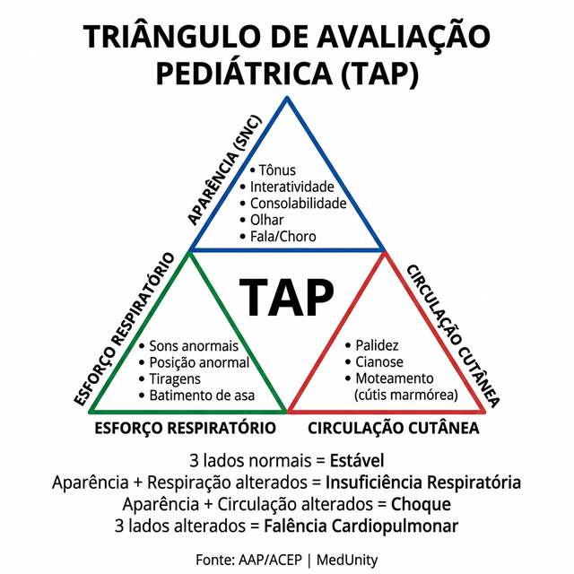
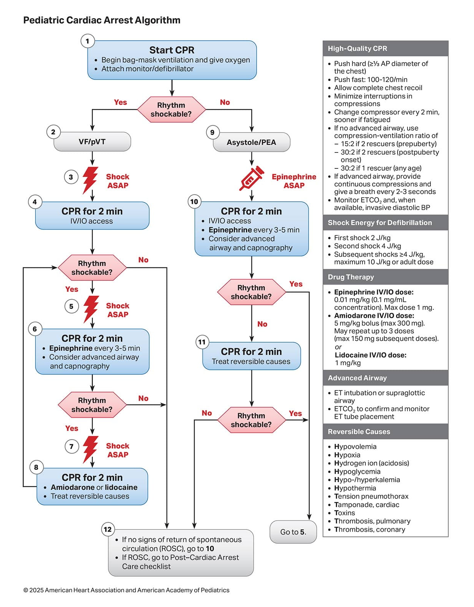

# PARADA CARDIORRESPIRATÓRIA PEDIÁTRICA

Para entender a Parada Cardiorrespiratória (PCR) na pediatria, você precisa esquecer, por um momento, o modelo do adulto. No adulto, o coração geralmente para por um evento súbito, como um infarto ou uma arritmia primária. Na criança, a história é outra. A PCR pediátrica é, na esmagadora maioria das vezes, o desfecho final de uma deterioração progressiva. É o estágio terminal da insuficiência respiratória ou do choque.

Por que isso importa para a sua prova? Porque as bancas vão cobrar se você sabe identificar os sinais que precedem a parada e se você entende que a ventilação é o ponto central da reanimação na criança. Se você focar apenas no coração, você vai errar a questão e, pior, vai perder o paciente na vida real.

## Fisiopatologia e Etiologia: O Caminho para a Parada

Diferente dos adultos, onde os ritmos chocáveis (Fibrilação Ventricular e Taquicardia Ventricular sem pulso) são comuns, na pediatria eles representam menos de 15% dos casos iniciais. O que predomina é a Assistolia e a Atividade Elétrica Sem Pulso (AESP), resultantes de hipóxia e acidose.

As causas principais são respiratórias (obstrução de via aérea, pneumonia, afogamento) ou circulatórias (choque hipovolêmico por desidratação grave ou choque séptico). Quando o oxigênio para de chegar aos tecidos ou o sangue para de circular, o miocárdio sofre, torna-se bradicárdico e, finalmente, para.

### As Causas Reversíveis: 5 Hs e 5 Ts

Durante qualquer manobra de reanimação, você deve passar mentalmente por um "checklist". As bancas adoram perguntar qual a causa provável de uma PCR em determinado cenário clínico.

**Os 5 Hs:**

- Hipovolemia (causa muito comum em crianças com diarreia ou trauma).

- Hipóxia (a causa número 1 na pediatria).

- Hidrogênio (Acidose).

- Hipo/Hipercalemia (e outros distúrbios eletrolíticos).

- Hipotermia.
*Nota importante:* Na pediatria, adicionamos frequentemente a Hipoglicemia como um "H" extra, pois crianças têm reservas de glicogênio limitadas e consomem glicose rapidamente em situações de estresse.

**Os 5 Ts:**

- Tensão no tórax (Pneumotórax hipertensivo).

- Tamponamento cardíaco.

- Toxinas (Intoxicações exógenas).

- Trombose pulmonar (TEP - raro em crianças, mas possível).

- Trombose coronariana (raríssima em pediatria).

## Avaliação Inicial: O Triângulo de Avaliação Pediátrica (TAP)

Antes de tocar na criança, você faz a avaliação visual rápida, o TAP. Isso cai muito em provas de residência como a primeira conduta diante de uma criança grave. O TAP não serve para dar diagnóstico etiológico, mas para dizer o quão rápido você precisa correr.

- **Aparência:** Avalia o SNC. Como está o tônus? A criança interage? O olhar é fixo ou vago? É o componente mais importante para avaliar a perfusão cerebral.

- **Esforço Respiratório:** Há tiragens, batimento de asa de nariz, gemência ou ruídos adventícios audíveis sem estetoscópio?

- **Circulação cutânea:** Avalie a cor. Há palidez, cútis marmórea ou cianose?

Se os três lados estão alterados, a criança está em falência cardiopulmonar.

 Se apenas a aparência e a circulação estão alteradas, pense em choque. Se apenas o esforço respiratório e a aparência, pense em insuficiência respiratória.

## Suporte Básico de Vida (BLS) em Pediatria

A sequência de atendimento mudou há alguns anos para C-A-B (Compressões, Via Aérea, Ventilação), mas há uma exceção crítica que as bancas amam: o afogamento. No afogamento, a causa é puramente hipóxica, então começamos com 5 ventilações de resgate antes de iniciar as compressões.

### Passo a Passo do Atendimento

- **Segurança do local:** Certifique-se de que você e a vítima estão seguros.

- **Verificar responsividade:** Em lactentes (menores de 1 ano), bata na planta do pé. Em crianças maiores, chame e balance os ombros.

- **Chamar ajuda e DEA:** Se estiver sozinho e a parada não foi presenciada, você fará 2 minutos de RCP antes de sair para buscar ajuda. Se presenciou a parada (provável causa cardíaca), busque ajuda e o DEA primeiro.

- **Verificar pulso e respiração simultaneamente:** Isso deve levar no máximo 10 segundos.

- Lactentes: Pulso braquial ou femoral.

- Crianças (> 1 ano): Pulso carotídeo ou femoral.

- *Dica de prova:* Se você não tiver certeza se sentiu o pulso em 10 segundos, inicie as compressões. Não perca tempo.

### Técnica de Compressão e Ventilação

Aqui moram os números que você precisa decorar. As bancas trocam esses valores para te confundir.

| Parâmetro | Lactente (< 1 ano) | Criança (1 ano até Puberdade) |
| --- | --- | --- |
| **Local** | Abaixo da linha intermamilar | Metade inferior do esterno |
| **Técnica (1 socorrista)** | 2 dedos no tórax | 1 ou 2 mãos (depende do tamanho) |
| **Técnica (2 socorristas)** | 2 polegares envolvendo o tórax | 1 ou 2 mãos |
| **Profundidade** | 1/3 do diâmetro AP (~ 4 cm) | 1/3 do diâmetro AP (~ 5 cm) |
| **Frequência** | 100 a 120 por minuto | 100 a 120 por minuto |
| **Relação (1 socorrista)** | 30 compressões : 2 ventilações | 30 compressões : 2 ventilações |
| **Relação (2 socorristas)** | 15 compressões : 2 ventilações | 15 compressões : 2 ventilações |

**Por que a relação muda para 15:2 com dois socorristas?**
Porque, como discutimos com o Dr. Will nas discussões de caso do MedEvo, a causa da parada na criança costuma ser respiratória. Com dois socorristas, conseguimos priorizar um pouco mais a ventilação sem prejudicar tanto a perfusão gerada pelas compressões. No adulto, é sempre 30:2, independentemente do número de socorristas (até que haja via aérea avançada).

### Ventilação de Resgate

Se a criança tem pulso (acima de 60 bpm), mas não respira ou tem apenas gasping, você faz apenas ventilação de resgate: 1 ventilação a cada 2 a 3 segundos (20 a 30 ventilações por minuto).

**Atenção:** Se o pulso estiver abaixo de 60 bpm com sinais de má perfusão (palidez, cianose, alteração de consciência), mesmo com oxigenação e ventilação, você deve iniciar as compressões torácicas. Isso é uma pegadinha clássica. No adulto, esperamos o pulso sumir. Na criança, pulso < 60 com má perfusão = RCP.

## Suporte Avançado de Vida (PALS)

Uma vez que a equipe chega com o monitor e o material de via aérea, entramos no suporte avançado. O primeiro passo é identificar o ritmo.

### Ritmos Chocáveis (TV sem pulso e FV)

- Inicie RCP e aplique o choque o mais rápido possível.

- Carga inicial: 2 J/kg.

- Segundo choque: 4 J/kg.

- Choques subsequentes: ≥ 4 J/kg (máximo de 10 J/kg ou dose de adulto).

- Drogas: Epinefrina a cada 3-5 minutos (após o segundo choque). Amiodarona (5 mg/kg) ou Lidocaina (1 mg/kg) podem ser usadas para ritmos refratários.

### Ritmos Não Chocáveis (Assistolia e AESP)

- Epinefrina o mais rápido possível. Não espere o segundo ciclo.

- RCP de alta qualidade por 2 minutos.

- Procure as causas reversíveis (5 Hs e 5 Ts).

**Dose da Epinefrina:** 0,01 mg/kg.
Como isso vem na prova? Geralmente como a concentração 1:10.000. A dose é 0,1 ml/kg dessa solução. Se você usar a ampola pura (1:1.000), a dose seria 0,01 ml/kg, o que é impossível de aspirar com precisão. Por isso, diluímos 1 ml de adrenalina em 9 ml de soro fisiológico para fazer a 1:10.000.

### Via Aérea Avançada

Na pediatria, a intubação orotraqueal (IOT) não deve atrasar as compressões. Se você consegue ventilar bem com a bolsa-valva-máscara (Ambu), pode continuar assim.

- **Cânulas:** Atualmente, as diretrizes preferem cânulas com cuff (balonete), pois permitem melhor pressão de ventilação e menor risco de aspiração.

- **Cálculo do tamanho (com cuff):** (Idade / 4) + 3,5.

- **Cálculo do tamanho (sem cuff):** (Idade / 4) + 4.

- **Lactentes jovens (3-5 kg):** Geralmente usamos cânulas 3,0 a 3,5 mm, sem cuff, com lâmina de laringoscópio reta (Miller) 0 ou 1.

## Choque Pediátrico: O Prelúdio da Parada

O choque é definido como a incapacidade do sistema circulatório de suprir as demandas metabólicas dos tecidos. Não espere a hipotensão para diagnosticar choque em uma criança. A hipotensão é um sinal tardio e indica choque descompensado, muitas vezes pré-morte.

### Sinais de Má Perfusão

- Tempo de Enchimento Capilar (TEC) > 2 segundos.

- Pulsos periféricos finos ou ausentes.

- Extremidades frias e cútis marmórea.

- Alteração do nível de consciência (irritabilidade ou letargia).

- Oligúria (débito urinário < 1 ml/kg/h).

### Classificação do Choque

- **Hipovolêmico:** A causa mais comum (vômitos, diarreia, hemorragia).

- **Distributivo:** Inclui o choque séptico e o anafilático. Caracteriza-se por vasodilatação periférica. No início do choque séptico, a criança pode ter "choque quente" (extremidades quentes e TEC rápido), mas evolui rapidamente para o "choque frio".

- **Cardiogênico:** Falha na bomba (miocardite, cardiopatias congênitas). Cuidado: aqui a reposição de volume deve ser cautelosa (5 a 10 ml/kg).

- **Obstrutivo:** Tamponamento, pneumotórax, TEP.

### Manejo Inicial do Choque

A regra de ouro é: Acesso venoso ou intraósseo (IO) imediato. Se você não conseguir acesso periférico em 90 segundos ou 3 tentativas em uma criança grave, parta para a via intraóssea. Não hesite.

**Expansão Volêmica:**

- Use cristaloides isotônicos (Soro Fisiológico 0,9% ou Ringer Lactato).

- Dose: 20 ml/kg em bólus (correr em 5 a 10 minutos).

- Reavalie após cada bólus. Se não houver melhora, pode repetir até 40-60 ml/kg, monitorando sinais de sobrecarga hídrica (hepatomegalia e estertores crepitantes).

No choque séptico, além do volume, a antibioticoterapia deve ser iniciada na primeira hora ("The Golden Hour"). Se o choque persistir após o volume, iniciamos drogas vasoativas (Adrenalina ou Noradrenalina).

## Situações Especiais em Emergência Pediátrica

### Afogamento

O foco é a hipóxia. O edema pulmonar ocorre tanto em água doce quanto salgada devido à lesão da membrana alvéolo-capilar e perda de surfactante.

- Água salgada (hipertônica): Atrai líquido para o alvéolo, causa hemoconcentração e hipernatremia.

- Água doce (hipotônica): É absorvida para a circulação, causa hemodiluição e hiponatremia.
Na prática, o tratamento inicial é o mesmo: ventilação e oxigenação. Se a criança estiver em apneia, mas com pulso, IOT imediata pode ser necessária.

### Trauma Pediátrico

O erro mais comum é a falha no manejo da via aérea e na imobilização cervical. Lembre-se que a cabeça da criança é proporcionalmente maior, o que causa flexão do pescoço quando ela está em decúbito dorsal. Use um coxim sob os ombros para manter a via aérea alinhada.

### Crise Febril

Muito comum entre 6 meses e 5 anos.

- **Crise Simples:** Generalizada, dura menos de 15 minutos, não se repete em 24 horas. Conduta: Antitérmico e orientação familiar. Não precisa de exames de imagem ou EEG de rotina.

- **Crise Complexa:** Focal, dura mais de 15 minutos ou se repete em 24 horas. Exige investigação mais detalhada.

### Episódio Hipotônico-Hiporresponsivo (EHH)

É um evento adverso pós-vacinal, associado principalmente à vacina DTP (componente pertussis de células inteiras). A criança apresenta palidez, hipotonia e diminuição da responsividade nas primeiras 48 horas após a vacina. Apesar de assustador, o prognóstico é excelente e não deixa sequelas. A conduta para as próximas doses é substituir a DTP pela DTPa (acelular).

## Tabelas Comparativas para Memorização

### Tabela 1: Definição de Hipotensão por Idade (Percentil 5)

| Idade | Pressão Arterial Sistólica (PAS) |
| --- | --- |
| 0 a 28 dias | < 60 mmHg |
| 1 a 12 meses | < 70 mmHg |
| 1 a 10 anos | < 70 + (2 x idade em anos) mmHg |
| > 10 anos | < 90 mmHg |

### Tabela 2: Diferenças no BLS (AHA 2020)

| Situação | Conduta |
| --- | --- |
| **Colapso Presenciado** | Chamar ajuda/DEA primeiro, depois iniciar RCP |
| **Colapso NÃO Presenciado** | Iniciar 2 min de RCP, depois chamar ajuda/DEA |
| **Afogamento** | Iniciar com 5 ventilações de resgate, depois C-A-B |
| **Pulso < 60 com má perfusão** | Iniciar compressões torácicas |

### Tabela 3: Drogas na PCR Pediátrica

| Droga | Dose | Observação |
| --- | --- | --- |
| **Epinefrina** | 0,01 mg/kg (0,1 ml/kg de 1:10.000) | Repetir a cada 3-5 min |
| **Amiodarona** | 5 mg/kg | Máximo 3 doses para ritmos chocáveis |
| **Lidocaína** | 1 mg/kg (ataque) | Alternativa à amiodarona |
| **Glicose 10%** | 5 ml/kg (ou 0,5 g/kg) | Se houver hipoglicemia documentada |
| **Bicarbonato** | 1 mEq/kg | Apenas em acidose metabólica grave ou hipercalemia |

## Diagnóstico Diferencial e Erros Comuns

Um cenário que cai muito: recém-nascido que nasce asfíxico, você começa a ventilar com Ambu e ele melhora, mas de repente ele piora drasticamente (cianose, bradicardia, queda de murmúrio vesicular). O que aconteceu? **Pneumotórax iatrogênico**. A pressão excessiva na ventilação rompeu o alvéolo. A conduta é a descompressão imediata.

Outro erro clássico é a avaliação da dor. Em pediatria, usamos escalas de faces ou escalas numéricas (se a criança for maior). Nunca ignore a dor, mas saiba que opioides podem causar constipação (efeito colateral muito comum) e depressão respiratória. No entanto, o risco de dependência em uso agudo na emergência é mínimo.

## Pontos-Chave para Prova

- A causa principal de PCR na criança é a falência respiratória ou choque (hipóxia/acidose), não a arritmia primária.

- No BLS com 2 socorristas, a relação compressão-ventilação é 15:2. Com 1 socorrista, 30:2.

- A profundidade da compressão deve ser de pelo menos 1/3 do diâmetro anteroposterior do tórax (4 cm em lactentes, 5 cm em crianças).

- Pulso < 60 bpm com sinais de má perfusão, apesar de oxigenação e ventilação, é indicação de iniciar compressões torácicas.

- No afogamento, a sequência começa com 5 ventilações de resgate.

- A dose de Epinefrina é 0,01 mg/kg (0,1 ml/kg da solução 1:10.000).

- Hipotensão é sinal tardio de choque. O diagnóstico deve ser clínico (TEC, pulsos, consciência).

- Acesso intraósseo deve ser realizado se o acesso venoso periférico não for obtido rapidamente em crianças graves.

- A hipoglicemia é uma causa reversível de PCR que deve ser sempre checada na pediatria.

- Ritmos chocáveis (FV/TVSP) são tratados com choque (2 J/kg inicial) e epinefrina após o segundo choque.

- O Episódio Hipotônico-Hiporresponsivo (EHH) após vacina DTP não contraindica a vacinação futura, mas exige a troca para a vacina acelular (DTPa).

- Em trauma, a estabilização da coluna cervical é prioritária durante o manejo da via aérea.

- Contraindicação absoluta para IOT: Não há, se for necessária para salvar a vida, mas deve-se ter cautela extrema em casos de via aérea difícil prevista ou trauma laringeo grave.

- Primeira escolha para expansão volêmica: Cristaloide isotônico (SF 0,9%) 20 ml/kg.

- O que NÃO fazer: Não interrompa as compressões por mais de 10 segundos para checar pulso ou tentar intubar. 🚨

 Cópia offline para consulta pessoal.
 Fonte original:
 [https://www.medevo.com.br/material-apoio/ler/810ce4e6-3b2e-4508-a22b-301bf5334c3c](https://www.medevo.com.br/material-apoio/ler/810ce4e6-3b2e-4508-a22b-301bf5334c3c)
