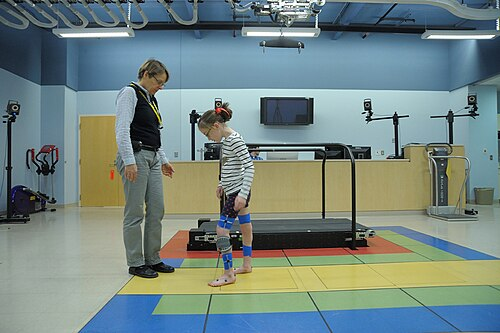
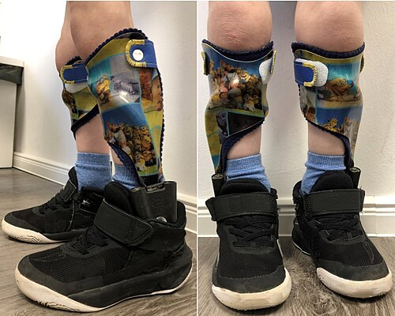

# PARALISIA CEREBRAL

Para começar nossa conversa, esqueça aquela ideia de que Paralisia Cerebral (PC) é uma "doença" única. Na verdade, estamos falando de um grupo heterogêneo de distúrbios permanentes do desenvolvimento do movimento e da postura. O ponto central que você precisa anotar no seu caderno é: a lesão é **não progressiva**.

O insulto aconteceu no cérebro em desenvolvimento (fetal ou infantil), mas a "cicatriz" não cresce. O que muda é a manifestação clínica conforme a criança cresce e o sistema nervoso amadurece. Se o quadro do seu paciente está piorando progressivamente, desconfie. Pode ser uma doença metabólica ou degenerativa, mas não é PC.

## Definição e Critérios Diagnósticos

A definição oficial, aceita pela Sociedade Brasileira de Pediatria (SBP), descreve a PC como um grupo de desordens permanentes atribuídas a distúrbios não progressivos que ocorreram no desenvolvimento do cérebro fetal ou infantil. Esses distúrbios causam limitações na atividade.

Muitas vezes, a PC vem acompanhada de distúrbios sensoriais, cognitivos, de comunicação, percepção, comportamento e, frequentemente, epilepsia.

### O "Porquê" do Diagnóstico ser Clínico

Não existe um exame de sangue que diga "isso é paralisia cerebral". O diagnóstico é puramente clínico, baseado na história (fatores de risco) e no exame físico (atraso nos marcos do desenvolvimento e persistência de reflexos primitivos).

A ressonância magnética (RM) é o padrão-ouro para identificar a lesão estrutural, mas lembre-se: a clínica manda. Existem crianças com RM muito alterada e boa funcionalidade, e vice-versa.

*Figura 1 - Criança com paralisia cerebral utilizando dispositivo de estimulação elétrica WalkAide durante reabilitação, projetado para melhorar a marcha. Fonte: National Institutes of Health, Domínio Público | Wikimedia Commons*

## Epidemiologia e Fatores de Risco

A prevalência mundial gira em torno de 2 a 3 por 1.000 nascidos vivos. No Brasil, os números são semelhantes, mas enfrentamos o desafio do diagnóstico tardio.

### Fatores de Risco: Onde a banca te pega

A prematuridade e o baixo peso ao nascer são os principais fatores de risco isolados. Quanto menor a idade gestacional, maior o risco de hemorragia peri-intraventricular e leucomalácia periventricular.

- **Pré-natais:** Infecções congênitas (TORCH), malformações cerebrais, exposição a toxinas.

- **Perinatais:** Asfixia neonatal (Injúria Hipóxico-Isquêmica), prematuridade extrema, hiperbilirrubinemia grave (Kernicterus).

- **Pós-natais:** Meningites, traumatismo cranioencefálico (TCE), afogamentos, AVC infantil.

**Dica de Prova:** O sulfato de magnésio administrado à gestante em risco de parto prematuro iminente (abaixo de 32 semanas) é uma estratégia de neuroproteção fetal comprovada que reduz o risco de paralisia cerebral. Guarde isso, pois as bancas adoram cobrar medidas preventivas.

*Figura 2 - Órteses tornozelo-pé (AFOs) utilizadas no tratamento da paralisia cerebral para auxiliar na marcha e posicionamento. Fonte: Orthokin, CC BY-SA 4.0 | Wikimedia Commons*

## Fisiopatologia: Entendendo a Lesão

Por que a lesão causa espasticidade? Quando o neurônio motor superior (no córtex cerebral) é lesado, perdemos o "freio" inibitório sobre o neurônio motor inferior (na medula). O resultado é um arco reflexo hiperativo: hipertonia, hiperreflexia e sinal de Babinski positivo.

Se a lesão for nos gânglios da base, teremos distúrbios do movimento (discinesia). Se for no cerebelo, teremos ataxia.

### Injúria Hipóxico-Isquêmica (EHH)

A Encefalopatia Hipóxico-Isquêmica não ocorre apenas no momento do parto. Ela é um processo. Existe a fase da agressão primária (falta de oxigênio e glicose) e a fase de reperfusão (estresse oxidativo). É por isso que o manejo do RN asfixiado na UTI neonatal é tão crítico para o prognóstico motor futuro.

## Quadro Clínico e Exame Físico

O sinal mais precoce de PC é o atraso no desenvolvimento neuropsicomotor (DNPM). Mas cuidado: nem todo atraso é PC.

### Marcos do Desenvolvimento (O que você PRECISA saber)

Se o aluno do MedEvo não souber os marcos, ele erra a questão de PC e a de puericultura.

- **Sustento cefálico:** 3 meses.

- **Sentar sem apoio:** 6 a 7 meses.

- **Engatinhar:** 9 meses.

- **Andar sem apoio:** 12 a 15 meses.

Se uma criança chega aos 18 meses sem andar sem apoio, isso é um sinal de alerta vermelho ("red flag").

### Reflexos Primitivos: A Chave do Diagnóstico Precoce

Os reflexos primitivos devem desaparecer para dar lugar aos movimentos voluntários. A persistência deles após os 6 a 9 meses é um forte indicador de risco para PC.

- **Reflexo de Moro:** Presente ao nascer, deve desaparecer até os 6 meses. Se persistir, indica atraso na maturação do SNC.

- **Reflexo Tônico Cervical Assimétrico (RTCA ou Magnus e Klein):** É a "posição de esgrimista". Quando você vira a cabeça do bebê para um lado, o braço do mesmo lado estende e o oposto flexiona. A integração do ATNR (entre 4 e 6 meses) é essencial para que a criança consiga levar as mãos à linha média e manipular objetos de forma bimanual.

- **Reflexo de Preensão Palmar:** Desaparece por volta dos 4 a 6 meses.

### Tipos de Tônus

- **Espasticidade:** É o tipo mais comum (80%). Caracteriza-se pelo sinal do "canivete" (resistência que cede subitamente).

- **Hipotonia:** Frequentemente a fase inicial da PC (fase de "bebe molinho"), que depois evolui para espasticidade ou discinesia.

- **Distonia:** Flutuações no tônus, muitas vezes desencadeadas por emoção ou esforço.

## Classificações da Paralisia Cerebral

As provas cobram PC de duas formas: pela topografia e pela função motora.

### 1. Classificação Topográfica (Distribuição no corpo)

| Tipo | Descrição | Correlação Clínica |
| --- | --- | --- |
| **Hemiplegia** | Um lado do corpo afetado (ex: braço e perna direitos). | Geralmente por AVC neonatal ou lesão focal. O braço costuma ser mais afetado que a perna. |
| **Diplegia** | Membros inferiores muito mais afetados que os superiores. | Clássica do prematuro (leucomalácia periventricular). Marcha em tesoura. |
| **Tetraplegia** | Os quatro membros afetados de forma grave. | Frequentemente associada a asfixia grave, malformações ou infecções congênitas. Alto risco de disfagia. |

### 2. Classificação Funcional (GMFCS)

O *Gross Motor Function Classification System* (GMFCS) é o sistema universal para graduar a gravidade. Dr. Will sempre lembra: o GMFCS foca no que a criança **faz**, não no que ela deveria fazer.

- **Nível I:** Anda sem restrições, sobe escadas sem apoio.

- **Nível II:** Anda com algumas limitações em superfícies irregulares ou longas distâncias.

- **Nível III:** Anda com auxílio de dispositivos manuais (andadores, bengalas).

- **Nível IV:** Auto-mobilidade limitada; pode usar cadeira de rodas motorizada ou ser transportado.

- **Nível V:** Transportado em cadeira de rodas manual; limitações graves no controle de tronco e cabeça.

## Diagnóstico Diferencial: As Armadilhas da Prova

Aqui é onde o professor médico vê o aluno errar. A banca coloca uma criança que não anda e você marca PC, mas a resposta era outra.

### 1. Transtorno do Espectro Autista (TEA)

Muitas pérolas clínicas focam aqui. O TEA pode cursar com atraso de fala e comportamentos motores repetitivos (estereotipias), mas a PC é primariamente um distúrbio motor.

- **Sinais de TEA:** Atraso na fala, socialização ruim, ausência de faz-de-conta, dificuldade de contato visual, interesses restritos e hipersensibilidade sensorial.

- **Atenção:** Se houver regressão da linguagem e perda de contato visual em um lactente que ia bem, pense em TEA, não em PC.

### 2. Atrofia Muscular Espinhal (AME) Tipo I

Diferente da PC (que tem hipertonia e hiperreflexia), a AME é uma doença do neurônio motor inferior.

- **Quadro:** Fraqueza muscular grave, hipotonia ("bebê frouxo"), arreflexia e fasciculações de língua. É uma paralisia flácida, não espástica.

### 3. Síndrome de Guillain-Barré (SGB)

É uma polineuropatia desmielinizante aguda.

- **Quadro:** Fraqueza ascendente, simétrica, pós-infecção (Campylobacter, CMV). O líquor mostra dissociação albumino-citológica (muita proteína, pouca célula).

### 4. Paralisias Braquiais Obstétricas

- **Paralisia de Erb-Duchenne (C5-C6):** O braço fica em rotação interna, estendido e pronado (posição de "garçom recebendo gorjeta"). A preensão palmar é **normal**, mas o reflexo de Moro é ausente no lado afetado. Isso é lesão de nervo periférico, não PC.

### 5. Marcha na Ponta dos Pés

Nem toda criança que anda na ponta dos pés tem PC diplegia espástica.

- **Marcha Idiopática:** Comum em menores de 5 anos, bilateral, sem dor e sem retração fixa do tendão de Aquiles. A criança consegue colocar o calcanhar no chão se solicitada. Na PC, a retração é fixa e há outros sinais piramidais.

## Comorbidades e Complicações

A PC raramente vem sozinha. O manejo integral é o que cai em provas de residência focadas em pediatria geral.

### Nutrição e Crescimento

Crianças com PC, especialmente tetraplégicas, têm alto risco de desnutrição.

- **Disfagia:** A incoordenação oromotora leva à aspiração crônica e pneumonia aspirativa.

- **Antropometria:** Medir o peso e a altura pode ser difícil devido às contraturas. Usamos medidas alternativas como a estimativa da altura pelo comprimento da ulna ou do fêmur.

- **Terapia Nutricional:** Frequentemente necessitam de espessantes alimentares ou, em casos graves (GMFCS IV e V), gastrostomia para garantir aporte calórico e segurança.

### Problemas Ortopédicos

A espasticidade constante "puxa" os ossos de forma errada.

- **Displasia de Quadril:** A adução excessiva dos membros inferiores pode levar à luxação progressiva do quadril. O acompanhamento radiológico é obrigatório.

- **Escoliose:** Muito comum em pacientes não deambulantes.

### Outras Comorbidades

- **Epilepsia:** Presente em até 50% dos casos, especialmente na forma tetraplégica.

- **Deficiência Intelectual:** Não é regra! Muitas crianças com PC grave têm inteligência preservada. Nunca subestime o potencial cognitivo de um paciente com PC.

- **Distúrbios do Sono:** Impacto neurocognitivo significativo. O sono fragmentado piora a espasticidade e o comportamento.

## Diagnóstico e Exames Complementares

Como já dito, o diagnóstico é clínico. Mas usamos exames para buscar a causa (etiologia) e documentar a lesão.

- **Neuroimagem (RM de Crânio):** Preferencial. Pode mostrar leucomalácia periventricular (comum na diplegia do prematuro), lesões em gânglios da base (comum na asfixia ou kernicterus) ou malformações corticais.

- **USG Transfontanelar:** Útil no período neonatal para detectar hemorragias e hidrocefalia.

- **Avaliação Auditiva e Visual:** Obrigatória. Estrabismo e erros de refração são onipresentes. Lembre-se da pérola: leucocoria (reflexo branco) em criança pequena é Retinoblastoma até que se prove o contrário. O glaucoma congênito causa buftalmia (olho grande) e fotofobia, não leucocoria.

- **Triagem Metabólica:** Se a história não for clara (sem intercorrências no parto) ou se houver consanguinidade.

## Tratamento e Manejo

O tratamento é multidisciplinar e foca na funcionalidade, não na "cura".

### Tratamento Não Farmacológico

- **Fisioterapia:** Essencial para prevenir contraturas e promover marcos motores.

- **Terapia Ocupacional:** Foco em Atividades de Vida Diária (AVDs) e adaptações.

- **Fonoaudiologia:** Manejo da disfagia e comunicação alternativa.

### Tratamento Farmacológico da Espasticidade

- **Baclofeno:** Agonista GABA-B. Pode ser oral ou via bomba intratecal.

- **Toxina Botulínica:** Padrão-ouro para espasticidade focal. Ela bloqueia a liberação de acetilcolina na placa motora. O efeito dura de 3 a 6 meses.

- **Benzodiazepínicos:** Podem ser usados para relaxamento muscular, mas causam muita sonolência.

### Situações Especiais: Síndrome de Down

Embora não seja PC, crianças com Down frequentemente têm hipotonia e atraso motor. Uma pérola importante de prova: a Instabilidade Atlantoaxial (IAA). Antes de qualquer procedimento cirúrgico ou atividade física de impacto, deve-se ter cuidado postural para evitar compressão medular por hiperextensão ou hiperflexão do pescoço.

## Diagnóstico Diferencial de Marcha e Fraqueza (Tabela Comparativa)

| Condição | Tônus | Reflexos | Características Marcantes |
| --- | --- | --- | --- |
| **PC Espástica** | Hipertonia | Hiperreflexia | História de asfixia/prematuridade; não progressiva. |
| **AME Tipo I** | Hipotonia | Arreflexia | Fasciculações de língua; fraqueza grave; progressiva. |
| **Guillain-Barré** | Hipotonia | Arreflexia | Fraqueza ascendente aguda; dissociação proteína-célula no líquor. |
| **Distrofia de Duchenne** | Pseudohipertrofia | Diminuídos | Sinal de Gowers (escalar a si mesmo); CK muito elevada. |
| **Coreia de Sydenham** | Hipotonia | Variáveis | Movimentos involuntários pós-estreptococo; labilidade emocional. |

## O AVC Infantil e Neonatal

Diferente do adulto, o AVC na criança tem causas muito específicas.

- **Etiologia:** Cardiopatias congênitas, anemia falciforme (fazer Doppler transcraniano para triagem!), trombofilias e vasculites.

- **AVC Neonatal:** Frequentemente se manifesta como convulsões focais nas primeiras 48-72 horas de vida. A artéria cerebral média é a mais acometida.

- **Prognóstico:** O cérebro infantil tem grande plasticidade, mas o AVC neonatal é uma causa importante de PC hemiplegica.

## Pontos-Chave para Prova 🧠

- **Definição:** Lesão cerebral permanente e **não progressiva** no cérebro imaturo. Se progredir, mude o diagnóstico.

- **Fator de Risco Principal:** Prematuridade e baixo peso.

- **Neuroproteção:** Sulfato de Magnésio pré-natal para gestantes < 32 semanas reduz risco de PC.

- **Diagnóstico:** Clínico. Baseado no atraso do DNPM e persistência de reflexos primitivos (Moro e RTCA após 6 meses).

- **GMFCS:** Nível I (anda bem) ao Nível V (dependente total de cadeira de rodas).

- **Reflexo de Moro:** Deve sumir até os 6 meses. Sua persistência é sinal de alerta.

- **RTCA (Magnus e Klein):** Sua integração (sumiço) aos 4-6 meses permite o uso bimanual das mãos.

- **Paralisia de Erb-Duchenne:** C5-C6. Braço em "gorjeta de garçom". Moro ausente unilateral, mas preensão palmar preservada.

- **TEA vs PC:** TEA foca em comunicação social e comportamentos repetitivos. PC foca em déficit motor. Regressão de linguagem = TEA ou doença metabólica, raramente PC.

- **Coreia de Sydenham:** Manifestação da Febre Reumática. Movimentos involuntários e hipotonia. Tratamento com Haloperidol.

- **Sinal de Gowers:** Típico de distrofias musculares (Duchenne), não de PC.

- **Leucocoria:** Reflexo branco no olho. Suspeitar de Retinoblastoma (urgência!). Glaucoma congênito causa buftalmia, não leucocoria.

- **Marcha na ponta dos pés:** Se for idiopática, a criança consegue encostar o calcanhar. Se for PC, a retração é fixa (espasticidade).

- **Pneumonia Aspirativa:** Principal causa de morbidade respiratória em PC grave (GMFCS IV e V) devido à disfagia.

- **O que NÃO fazer:** Não diagnosticar PC em uma criança que está perdendo marcos que já tinha (isso é regressão, pense em doenças neurodegenerativas).

- **Erro Clássico:** Achar que toda criança com PC tem deficiência intelectual. Muitas têm cognição normal, mas dificuldade de expressão motora/fala.

- **Líquor no Guillain-Barré:** Dissociação albumino-citológica (proteína alta com pouca célula).

- **Pseudoparalisia de Parrot:** Não é paralisia real. É dor óssea por sífilis congênita que impede o movimento.

Este material foi estruturado para que você, aluno do MedEvo, consiga navegar pelas questões de neurologia pediátrica com a segurança de quem entende a fisiopatologia e conhece as pegadinhas dos examinadores. Lembre-se: na dúvida, volte aos marcos do desenvolvimento. Eles são a bússola da pediatria.

 Cópia offline para consulta pessoal.
 Fonte original:
 [https://www.medevo.com.br/material-apoio/ler/236794e1-b3b0-4bb2-8873-b236726a739a](https://www.medevo.com.br/material-apoio/ler/236794e1-b3b0-4bb2-8873-b236726a739a)
