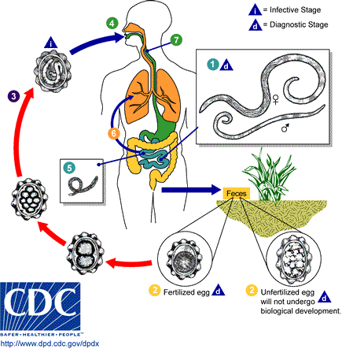

# PARASITOSES INTESTINAIS PEDIÁTRICAS

Para dominar as parasitoses intestinais em provas de residência, você precisa abandonar a ideia de que este é um tema de "decoreba" de nomes de vermes. O segredo está em entender a biologia do parasita: se você entende como ele entra, por onde ele caminha no corpo e como ele sai, o quadro clínico e o diagnóstico tornam-se óbvios.

Dividimos didaticamente o estudo em dois grandes grupos: os **Helmintos** (vermes propriamente ditos) e os **Protozoários** (seres unicelulares). Essa distinção não é apenas biológica; ela dita o tratamento. Enquanto usamos benzimidazóis (como o Albendazol) para a maioria dos helmintos, os protozoários costumam exigir derivados imidazólicos (como o Metronidazol).

*Figura 1 - Exemplar adulto de Ascaris lumbricoides (fêmea), medindo entre 15 e 35 cm, o helminto intestinal mais prevalente em pediatria. Fonte: CDC Division of Parasitic Diseases, Domínio Público | Wikimedia Commons*

## Helmintíases: Os Nematódeos (Vermes Cilíndricos)

Os nematódeos são os campeões de audiência nas provas. Aqui, o foco deve ser no ciclo de vida e nas complicações mecânicas ou espoliantes.

### Ascaridíase (*Ascaris lumbricoides*)

O *Ascaris* é o maior nematódeo que infecta o homem. A transmissão é clássica: ingestão de ovos embrionados em água ou alimentos contaminados.

**O Ciclo e a Síndrome de Loeffler:**
Após a ingestão, a larva eclode no intestino, atravessa a mucosa e cai na circulação. Ela passa pelo fígado e chega aos pulmões. Por que isso cai tanto em prova? Porque aqui ocorre a **Síndrome de Loeffler**. A larva rompe os capilares alveolares para subir pela árvore brônquica, ser deglutida e finalmente virar adulto no intestino.

Na prova, o cenário é: criança com tosse seca, febre baixa e infiltrados pulmonares migratórios no raio-X, associados a uma eosinofilia periférica importante. Se a questão mencionar "infiltrado que some em um lugar e aparece em outro", pense em Loeffler.

**Quadro Clínico e Complicações:**
No intestino, o verme adulto pode causar dor abdominal e desnutrição. Mas a "pérola" de prova é a **suboclusão intestinal por bolo de Ascaris**. Imagine uma criança com distensão, vômitos e parada de eliminação de gases/fezes. O tratamento aqui muda: não fazemos o vermífugo de imediato, pois matar o verme pode piorar a obstrução. Usamos óleo mineral e Piperazina (se disponível) para paralisar os vermes antes de tentar a eliminação.

### Ancilostomíase (*Ancylostoma duodenale* e *Necator americanus*)

Aqui a porta de entrada muda: a larva filarióide penetra ativamente na pele (geralmente nos pés).

**A Anemia Ferropriva:**
Diferente do Ascaris, que "come" o que a criança come, o Ancilostomídeo é um hematófago. Ele se fixa na mucosa do intestino delgado e suga sangue. Em provas, se houver uma criança com anemia ferropriva grave, hipoalbuminemia (edema) e história de andar descalça, a suspeita principal é Ancilostomíase.

### Estrongiloidíase (*Strongyloides stercoralis*)

Este é, talvez, o parasita mais perigoso em contextos específicos. Ele tem uma característica única: a **autoinfecção**. A larva pode se tornar infectante ainda dentro do lúmen intestinal e penetrar na mucosa retal ou pele perianal, reiniciando o ciclo sem precisar sair do hospedeiro.

**O Perigo dos Corticoides:**
Como o Dr. Will sempre enfatiza nas discussões de enfermaria, nunca prescreva corticoide em altas doses para um paciente de área endêmica sem antes tratar ou excluir Estrongiloidíase. O corticoide pode desencadear a **Síndrome de Hiperinfecção**, onde as larvas se disseminam para órgãos como o sistema nervoso central, levando a quadros de sepse por translocação de bactérias gram-negativas intestinais.

### Enterobíase ou Oxiuríase (*Enterobius vermicularis*)

Aqui está o favorito das bancas de pediatria. A transmissão é fecal-oral, mas com uma particularidade: a fêmea migra para a região perianal à noite para depositar os ovos.

**O Prurido Anal Noturno:**
O sintoma cardeal é o prurido anal intenso, predominantemente noturno, que causa irritabilidade e distúrbios do sono na criança.

- **Dica de Prova:** Em meninas, a proximidade anatômica faz com que o verme migre para a vulva, causando **vulvovaginite de repetição**. Se a questão trouxer uma menina com corrimento vaginal que não melhora com tratamentos habituais, procure por prurido anal na história.

**Diagnóstico:**
O Exame Parasitológico de Fezes (EPF) convencional é péssimo para Oxiuríase (sensibilidade < 5%), pois os ovos não costumam ser eliminados nas fezes, mas sim depositados na pele. O padrão-ouro é o **Método de Graham (fita gomada)**: aplica-se uma fita adesiva na região perianal logo cedo, antes do banho, para "colar" os ovos e visualizá-los no microscópio.

## Helmintíases: Os Cestódeos (Vermes Chatos)

Neste grupo, o destaque vai para a *Taenia* e o *Hymenolepis nana*.

### Teníase (*Taenia solium* e *Taenia saginata*)

A teníase ocorre pela ingestão de carne de porco (*T. solium*) ou boi (*T. saginata*) mal cozida contendo o **cisticerco**. No intestino humano, ele se desenvolve na "solitária".

**Cuidado com a confusão clássica:**

- **Teníase:** Homem come o cisticerco (na carne) → Desenvolve o verme adulto no intestino.

- **Cisticercose:** Homem come o OVO da *Taenia solium* (água/alimentos contaminados com fezes humanas) → A larva se aloja nos tecidos (cérebro, músculos).

- **Importante:** A *T. saginata* NÃO causa cisticercose humana.

### Himenolepíase (*Hymenolepis nana*)

É a teníase anã. É muito comum em crianças porque não precisa de hospedeiro intermediário; a transmissão é direta de pessoa para pessoa. O quadro clínico é de dor abdominal e diarreia. O tratamento exige doses mais altas de Praziquantel do que a teníase comum devido à carga parasitária e ao ciclo de autoinfecção.

## Protozooses: Giardíase e Amebíase

Saímos dos vermes e entramos no mundo microscópico. Aqui, a fisiopatologia da diarreia é o que diferencia os dois.

### Giardíase (*Giardia lamblia*)

A *Giardia* adora o duodeno e o jejuno proximal. Ela não invade a mucosa; ela "se prega" nela através de um disco suctorial, formando um tapete que impede a absorção de nutrientes.

**A Diarreia da Giardíase:**
É uma diarreia **absortiva (esteatorreia)**. As fezes são gordurosas, fétidas, que boiam no vaso, acompanhadas de muita distensão abdominal e flatulência. Em crianças, é uma causa importante de déficit de crescimento e anemia por má absorção.

### Amebíase (*Entamoeba histolytica*)

Diferente da Giardia, a ameba é invasiva. Ela penetra na mucosa do cólon, causando úlceras em "botão de camisa".

**A Diarreia da Amebíase:**
É uma **disenteria**. Espere encontrar muco, pus e sangue nas fezes, acompanhados de tenesmo (aquela vontade dolorosa de evacuar sem sucesso).

- **Complicação extraintestinal:** O abscesso hepático amebiano (geralmente único, no lobo direito, com pus em "pasta de anchova").

## Tabela 1: Diferenciação Clínica das Principais Parasitoses

| Parasita | Mecanismo Principal | Sintoma Chave | Diagnóstico Sugerido |
| --- | --- | --- | --- |
| *Ascaris* | Espoliação/Mecânico | Síndrome de Loeffler / Obstrução | EPF (Lutz/Hoffman) |
| *Ancylostoma* | Hematofagia | Anemia Ferropriva Grave | EPF |
| *Strongyloides* | Invasão/Autoinfecção | Lesões cutâneas / Sepse (se imunossuprimido) | Método de Baermann-Moraes |
| *Enterobius* | Irritação local | Prurido anal noturno / Vulvovaginite | Teste da Fita Gomada |
| *Giardia* | Má absorção | Esteatorreia / Distensão | EPF (3 amostras) ou Antígeno fecal |
| *E. histolytica* | Invasão tecidual | Disenteria (sangue/muco) | EPF / Sorologia (se abscesso) |

*Figura 2 - Ciclo de vida do Ascaris lumbricoides: ingestão de ovos, migração larvária pulmonar e maturação no intestino delgado. Fonte: CDC Division of Parasitic Diseases, Domínio Público | Wikimedia Commons*

## Diagnóstico Laboratorial: Onde os Alunos Erram

Muitos estudantes acham que o EPF (Exame Parasitológico de Fezes) resolve tudo. Na vida real e na prova, a sensibilidade de uma única amostra é baixa (cerca de 30-50%). Por isso, a recomendação atual da Sociedade Brasileira de Pediatria (SBP) é a coleta de **três amostras em dias alternados**.

**Métodos Específicos:**

- **Lutz ou Hoffman (Sedimentação espontânea):** O "pau para toda obra". Bom para ovos pesados de helmintos e cistos de protozoários.

- **Baermann-Moraes:** Específico para larvas. Se você suspeita de *Strongyloides*, o EPF comum pode vir negativo. Você PRECISA pedir Baermann-Moraes, que usa o termotropismo e hidrotropismo das larvas para concentrá-las.

- **Kato-Katz:** Usado para quantificação da carga parasitária (ovos por grama de fezes), muito comum em estudos epidemiológicos e para *Schistosoma mansoni*.

- **Graham (Fita adesiva):** Exclusivo para *Enterobius*.

## Tratamento Farmacológico: Doses e Escolhas

O tratamento evoluiu para esquemas mais simples, mas as doses exatas são cobradas. No MedEvo, sempre reforçamos que o tratamento deve ser individualizado, mas para a prova, siga as diretrizes da SBP e do Ministério da Saúde.

### Helmintos (Nematódeos)

- **Albendazol:** 400 mg, dose única (para crianças > 2 anos). Para crianças entre 1 e 2 anos, a dose recomendada é 200 mg.

- *Mecanismo:* Inibe a polimerização da tubulina (o verme não consegue manter sua estrutura celular).

- **Mebendazol:** 100 mg, 2x ao dia, por 3 dias.

- **Ivermectina:** 200 mcg/kg, dose única. É a **primeira escolha para Estrongiloidíase**.

### Oxiuríase (Atenção aqui!)

O tratamento da Enterobíase exige uma estratégia específica: **Tratar todos os contatos domiciliares e REPETIR a dose após 2 semanas**.

- **Por que repetir?** Os medicamentos (Albendazol, Mebendazol, Pirantel) matam os vermes adultos, mas não são ovicidas. A repetição após 14 dias serve para matar os vermes que eclodiram dos ovos que sobreviveram à primeira dose.

### Protozoários

- **Giardíase:**

- Metronidazol: 15-30 mg/kg/dia, dividido em 3 doses, por 5 a 7 dias.

- Tinidazol ou Secnidazol: Dose única (excelente para adesão).

- Nitazoxanida: 7,5 mg/kg/dose, 2x ao dia, por 3 dias.

- **Amebíase:**

- Formas intestinais invasivas/abscesso: Metronidazol (35-50 mg/kg/dia por 7-10 dias).

- **Erro comum:** O Metronidazol mata a ameba no tecido, mas é ruim para matar os cistos no lúmen intestinal. Por isso, as diretrizes sugerem associar um amebicida luminal (como o Teclozan ou Etofamida) após o tratamento com Metronidazol para evitar que o paciente continue sendo um portador assintomático.

### Cestódeos (Teníase e Himenolepíase)

- **Praziquantel:**

- Teníase: 5 a 10 mg/kg, dose única.

- Himenolepíase: 25 mg/kg, dose única.

- **Niclosamida:** 2g para adultos (ajustado por peso em crianças), mas é pouco disponível no Brasil atualmente.

## Tabela 2: Resumo Terapêutico Pediátrico

| Medicamento | Indicação Principal | Dose Pediátrica (Exemplo) | Observação |
| --- | --- | --- | --- |
| **Albendazol** | Ascaris, Ancilostoma | 400 mg dose única (>2 anos) | Evitar no 1º trimestre gestação |
| **Ivermectina** | Estrongiloidíase | 200 mcg/kg dose única | Peso mínimo 15kg (geralmente) |
| **Metronidazol** | Giardíase, Amebíase | 15-30 mg/kg/dia (Giardíase) | Efeito antabuse com álcool |
| **Praziquantel** | Teníase, Himenolepíase | 10-25 mg/kg dose única | Droga de escolha para Cestódeos |
| **Nitazoxanida** | "Amplo espectro" | 7,5 mg/kg/dose 2x/dia (3 dias) | Custo mais elevado |

## Manejo da Obstrução por Ascaris (Protocolo de Prova)

Criança chega com quadro de oclusão intestinal e história de eliminação de vermes.

- **Nada por via oral + Hidratação venosa + Sonda Nasogástrica** (descompressão).

- **Óleo Mineral:** 40 a 60 ml via SNG para "lubrificar" o bolo.

- **Piperazina:** 50-75 mg/kg/dia. Ela causa paralisia flácida no verme.

- *Cuidado:* Nunca use Albendazol na fase aguda da obstrução. O Albendazol causa paralisia espástica ou agitação do verme, o que pode levar à perfuração intestinal ou piora do nó.

- **Cirurgia:** Apenas se houver sinais de irritação peritoneal (perfuração) ou falha do tratamento clínico após 24-48h.

*Figura 2 - Ciclo de vida do Ascaris lumbricoides: ingestão de ovos, migração larvária pulmonar e maturação no intestino delgado. Fonte: CDC Division of Parasitic Diseases, Domínio Público | Wikimedia Commons*

## Diagnóstico Diferencial e Pérolas Clínicas

**Cenário 1:** Criança com prurido anal, vulvovaginite e a mãe relata que ela está muito agitada à noite.

- **Diagnóstico:** Enterobíase.

- **Conduta:** Teste de Graham. Tratamento com Albendazol (dose única + repetição em 2 semanas) para a criança E para a família.

**Cenário 2:** Criança de área rural com anemia grave (Hb 6.0), cansaço e edema de membros inferiores.

- **Diagnóstico:** Ancilostomíase.

- **Por que o edema?** A perda crônica de sangue leva à hipoalbuminemia (perda de proteínas).

**Cenário 3:** Paciente que vai iniciar quimioterapia ou uso de corticoide crônico.

- **Conduta:** Rastrear *Strongyloides* ou fazer tratamento profilático com Ivermectina. O risco de hiperinfecção é altíssimo e fatal.

## Tabela 3: Síndrome de Loeffler (Mnemônico NASA)

A Síndrome de Loeffler é causada por parasitas que fazem o ciclo pulmonar. Lembre-se do mnemônico **NASA**:

| Letra | Parasita |
| --- | --- |
| **N** | *Necator americanus* |
| **A** | *Ascaris lumbricoides* |
| **S** | *Strongyloides stercoralis* |
| **A** | *Ancylostoma duodenale* |

*Nota: Alguns autores incluem o Toxocara canis (Larva Migrans Visceral), mas o quarteto acima é o clássico das provas.*

## Prevenção e Controle (Tratamento Não-Farmacológico)

Não adianta dar o melhor remédio se a criança volta para o ambiente contaminado. As diretrizes de 2024/2025 reforçam o papel do saneamento.

- **Higiene das mãos:** Lavar com água e sabão por pelo menos 20 segundos antes das refeições e após usar o banheiro.

- **Alimentos:** Lavar verduras e frutas em água corrente e deixar de molho em solução de hipoclorito de sódio (1 colher de sopa por litro de água) por 15 minutos.

- **Água:** Beber apenas água filtrada ou fervida (fervura por pelo menos 1 minuto).

- **Unhas:** Manter as unhas das crianças curtas para evitar o acúmulo de ovos (especialmente na Enterobíase).

- **Calçados:** Uso obrigatório de calçados para evitar a penetração de larvas de Ancilostomídeos e *Strongyloides*.

## Pontos-Chave para Prova

- **Enterobíase (Oxiuríase):** Prurido anal noturno e vulvovaginite. Diagnóstico pelo Método de Graham (fita adesiva). Tratamento: Albendazol ou Mebendazol, **sempre repetir em 14 dias** e tratar a família. Metronidazol NÃO trata Enterobíase.

- **Síndrome de Loeffler:** Tosse, febre, eosinofilia e infiltrado pulmonar migratório. Causada por *Ascaris, Ancylostoma, Necator* e *Strongyloides*.

- **Ascaridíase:** Pode causar obstrução intestinal. Tratamento da obstrução: Óleo mineral + Piperazina. **Contraindicação absoluta:** Usar Albendazol/Mebendazol na fase aguda da obstrução.

- **Estrongiloidíase:** Único com potencial de autoinfecção e hiperinfecção em imunossuprimidos. Primeira escolha: **Ivermectina**. Diagnóstico: Método de Baermann-Moraes.

- **Ancilostomíase:** Principal causa parasitária de anemia ferropriva grave em crianças de áreas endêmicas.

- **Giardíase:** Diarreia esteatorreica (gordurosa), má absorção e distensão. Tratamento: Metronidazol (5-7 dias) ou Tinidazol/Secnidazol (dose única).

- **Amebíase:** Disenteria (sangue e muco). Metronidazol trata a forma invasiva, mas deve-se usar amebicida luminal (Teclozan) para erradicar cistos.

- **Teníase vs. Cisticercose:** Teníase é comer o cisticerco na carne. Cisticercose é comer o ovo da *T. solium*.

- **Himenolepíase:** *H. nana* é a tênia anã. Tratamento com Praziquantel em dose maior (25 mg/kg).

- **Tratamento Empírico:** A OMS e o Ministério da Saúde recomendam tratamento periódico (anual ou semestral) com Albendazol para crianças de 2 a 14 anos em áreas onde a prevalência de helmintíases é superior a 20%.

- **Dose de Albendazol:** 400 mg dose única para > 2 anos; 200 mg para 1-2 anos.

- **Praziquantel e Niclosamida:** São as drogas de escolha para Teníase na infância.

- **Efeito Antabuse:** O Metronidazol não deve ser ingerido com álcool (embora menos relevante em crianças pequenas, é uma pegadinha comum de prova sobre a droga).

- **O que NÃO fazer:** Não pedir EPF de rotina (amostra única) e achar que o resultado negativo exclui parasitose. Sempre orientar 3 amostras.

- **Vulvovaginite na infância:** Sempre pensar em *Enterobius vermicularis* como diagnóstico diferencial importante.

 Cópia offline para consulta pessoal.
 Fonte original:
 [https://www.medevo.com.br/material-apoio/ler/aebb1757-9e69-48d8-888a-dcaf584cbad5](https://www.medevo.com.br/material-apoio/ler/aebb1757-9e69-48d8-888a-dcaf584cbad5)
