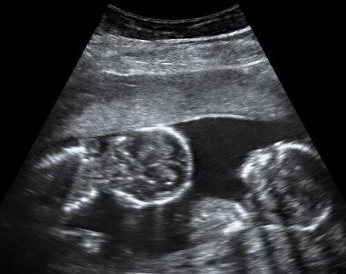

# PARTO EM GESTAÇÃO MÚLTIPLA

Para entender o parto em gestação múltipla, você precisa primeiro esquecer a ideia de que "são apenas dois bebês em vez de um". Na obstetrícia de alto nível, e principalmente nas provas de residência, o que manda não é a quantidade de bebês, mas sim a "arquitetura" dessa gestação.

Se você não souber se os bebês dividem a mesma placenta ou a mesma bolsa, você vai errar a conduta. Como sempre digo aos meus alunos no MedEvo, a corionicidade é o que dita o ritmo da música aqui.

*Figura 1 - Diagrama dos tipos de placentação em gestações gemelares: dicoriônica-diamniótica, monocoriônica-diamniótica e monocoriônica-monoamniótica. Fonte: Kevin Dufendach, CC BY 3.0 | Wikimedia Commons*

## A Base de Tudo: Corionicidade e Zigosidade

Antes de falarmos do parto em si, precisamos alinhar os conceitos que as bancas amam confundir. Zigosidade se refere à genética (origem do ovo). Corionicidade se refere à placenta. Amnionicidade se refere à bolsa.

Um erro clássico é achar que gêmeos de sexos diferentes podem ser monocoriônicos. Anote isso: se os sexos são diferentes, eles são obrigatoriamente dizigóticos (dois óvulos e dois espermatozoides). Se são dizigóticos, cada um fez sua "casa" completa. Portanto, sexos diferentes = Dicoriônicos e Diamnióticos (Didi).

Por que isso importa para o parto? Porque a gestação dicoriônica é a que mais se aproxima de uma gestação única em termos de riscos placentários, enquanto a monocoriônica (uma placenta para dois) traz o risco de transfusão entre os fetos, o que antecipa o parto.

### Diagnóstico de Corionicidade

O melhor momento para definir isso é no primeiro trimestre (entre 11 e 14 semanas).

- **Sinal do Lambda (ou sinal do Y):** Indica gestação dicoriônica. Existe uma projeção de tecido placentário entre as membranas.

- **Sinal do T:** Indica gestação monocoriônica. A membrana que separa os fetos é fina e "gruda" na placenta de forma perpendicular, sem tecido placentário entre elas.

Se a prova te der um ultrassom de segundo ou terceiro trimestre e perguntar a corionicidade, procure o sexo. Sexos diferentes? Dicoriônica. Placenta única e sexos iguais? Provavelmente monocoriônica, mas o padrão-ouro já passou.

## Paridade na Gestação Gemelar: Onde o Aluno se Banana

Este é o ponto onde o examinador pega o aluno cansado. Vamos revisar a regra que o Dr. Will sempre reforça:

- **Gesta:** Conta o número total de gestações, incluindo a atual e abortos.

- **Para:** Conta o número de eventos de parto (nascimentos acima de 20 semanas ou 500g).

Se uma mulher está parindo gêmeos agora e nunca engravidou antes, ela é Primigesta e, após o nascimento, será Primípara. Não importa se saíram dois, três ou dez bebês; o evento "parto" foi um só.

**Exemplo Clínico:** Paciente na 3ª gestação. Teve um parto vaginal de feto único há 3 anos e uma cesárea de gêmeos há 1 ano. Qual a paridade?
Ela é Tercigesta (3 gestações) e Tercípara (2 eventos de parto anteriores + o atual que está ocorrendo). Se a questão perguntar a paridade antes do parto atual, ela é Secundípara.

## O Momento do Parto: Quando Interromper?

Por que não deixamos todas as gestações gemelares chegarem a 40 semanas? Porque a placenta gemelar "envelhece" mais rápido e o risco de morte fetal intrauterina aumenta drasticamente após certo ponto. O "timing" depende da corionicidade.

| Tipo de Gestação | Momento Ideal do Parto | Justificativa |
| --- | --- | --- |
| Dicoriônica Diamniótica | 37 a 38 semanas | Risco de insuficiência placentária aumenta após 38s. |
| Monocoriônica Diamniótica | 36 a 37 semanas | Risco de Síndrome de Transfusão Feto-Fetal (STFF) e morte súbita. |
| Monocoriônica Monoamniótica | 32 a 34 semanas | Risco altíssimo de entrelaçamento de cordões. |

Atenção: A gestação Monocoriônica Monoamniótica (uma placenta, uma bolsa) é o cenário de maior medo. Como os dois cordões estão soltos na mesma cavidade, eles se enrolam conforme os bebês se mexem. Por isso, a recomendação da FEBRASGO e do Ministério da Saúde é a interrupção eletiva entre 32 e 34 semanas, invariavelmente por cesariana.

## Via de Parto: O Grande Dilema

Aqui é onde as questões de prova se concentram. A decisão da via de parto na gestação gemelar depende quase exclusivamente da apresentação do **primeiro feto** (o que está mais baixo, mais próximo ao colo).

### Regra de Ouro da Via de Parto

-

**Primeiro Feto Cefálico:** O parto vaginal é a primeira escolha.

- Se o segundo feto também for cefálico: Parto vaginal nos dois.

- Se o segundo feto NÃO for cefálico (pélvico ou transverso): Ainda assim, tentamos o parto vaginal. Por quê? Porque após a saída do primeiro, o canal de parto já está dilatado e há espaço para manobras no segundo feto.

-

**Primeiro Feto NÃO Cefálico (Pélvico ou Transverso):** Cesariana eletiva.

- Por que não tentamos o pélvico no primeiro? Porque existe o risco de "travamento de cabeças" (colisão fetal) se o segundo feto for cefálico. Além disso, a cabeça do primeiro feto (que é a maior parte) não serviu de "cunha" para dilatar o colo de forma ideal.

### A Colisão Fetal (Travamento de Queixos)

Este é um pesadelo obstétrico que cai muito em prova. Ocorre tipicamente quando:

- Feto 1 é Pélvico.

- Feto 2 é Cefálico.

Ao descer, o queixo do feto pélvico se engancha no queixo do feto cefálico. Eles se bloqueiam mutuamente no estreito superior da bacia. Resultado: nenhum dos dois passa. Por isso, feto 1 pélvico é indicação clássica de cesariana.

*Figura 2 - Ultrassonografia de gestação gemelar monoamniótica com 15 semanas de idade gestacional. Fonte: Mikael Häggström, CC0 | Wikimedia Commons*

## Manejo do Segundo Gemelar

Você acabou de assistir ao parto vaginal do primeiro feto. Ele nasceu bem, cefálico. E agora? O trabalho não acabou. O manejo do segundo gemelar é o que separa o obstetra experiente do iniciante.

Após a saída do primeiro feto, você deve:

- Avaliar imediatamente a apresentação do segundo feto (palpação abdominal ou toque).

- Monitorar a frequência cardíaca fetal do segundo feto.

- Se o feto estiver cefálico e a bolsa íntegra, aguardamos as contrações voltarem (podemos usar ocitocina se necessário).

- Se o feto estiver em situação transversa ou pélvica, temos duas opções principais:

### Versão Fetal Interna e Extração Pélvica

Se o segundo feto está transverso e você é um obstetra treinado, você pode realizar a versão interna. Você entra com a mão no útero, busca os pés do feto e o transforma em pélvico, realizando em seguida a extração pélvica.

**Cuidado com a pegadinha:** Algumas bancas dizem que se o segundo feto for transverso, a cesárea é obrigatória. Isso é falso se o feto tiver peso estimado > 1.500g e o obstetra tiver habilidade. No entanto, se o segundo feto for muito maior que o primeiro ou houver sofrimento fetal agudo sem descida imediata, a cesárea de emergência para o segundo gemelar (parto por via combinada) pode ser necessária.

## Complicações Específicas do Parto Gemelar

### Síndrome de Transfusão Feto-Fetal (STFF)

Ocorre apenas em monocoriônicas. Existem anastomoses vasculares na placenta que fazem um feto "doar" sangue para o outro.

- **Doador:** Fica anêmico, com restrição de crescimento e oligodramnia (pouco líquido).

- **Receptor:** Fica policitêmico, com sobrecarga cardíaca e polidramnia (muito líquido).

No parto, o risco é que, após o nascimento do primeiro, a placenta sofra um descolamento ou uma mudança súbita de pressão que prejudique gravemente o segundo feto, que ainda depende daquela placenta compartilhada.

### Entrelaçamento de Cordões

Exclusivo das monoamnióticas. É a razão pela qual não permitimos parto vaginal nessas pacientes. O risco de oclusão do fluxo sanguíneo durante as contrações do trabalho de parto é altíssimo.

### Prematuridade e Rotura Prematura de Membranas (RPMO)

Gestações múltiplas distendem demais o útero. O útero "acha" que já chegou ao termo por causa do volume e começa a contrair.

- Se a paciente chega em Trabalho de Parto Prematuro (TPP) com 30 semanas: Conduta padrão é Tocolítico (para ganhar tempo para o corticoide), Corticosteroide (maturação pulmonar) e Neuroproteção com Sulfato de Magnésio (se < 32 semanas).

- **Tocolítico de escolha:** Se a paciente tiver contraindicações a beta-agonistas (como taquicardia ou uso de metoprolol), o Atosibano (antagonista da ocitocina) ou a Nifedipina são as melhores escolhas.

## Profilaxia de Estreptococo do Grupo B (GBS)

As regras do GBS no parto gemelar seguem a lógica da gestação única, mas com um detalhe: o risco de prematuridade é maior.

- Se a paciente entrar em trabalho de parto prematuro (< 37 semanas) e o status de GBS for desconhecido: **Iniciamos profilaxia com Penicilina Cristalina.**

- Se houver RPMO acima de 18 horas: Profilaxia.

- Se a paciente teve um filho anterior com sepse por GBS ou tem urocultura positiva para GBS na gestação atual: Profilaxia garantida, independente de swab.

## Assistência ao Recém-Nascido

No MedEvo, sempre lembramos: parto gemelar exige logística.
Para cada feto, você precisa de uma equipe de reanimação dedicada. Se são gêmeos, precisamos de pelo menos dois pediatras/equipes de reanimação. Se forem prematuros (< 34 semanas), a equipe deve ser ainda mais robusta (2 a 3 profissionais por bebê).

**Clampeamento do Cordão:**

- Se o RN está bem (termo ou pré-termo tardio, respirando, bom tônus): Clampeamento tardio (1 a 5 minutos).

- Se o RN precisa de reanimação: Clampeamento imediato.

## Resumo de Condutas por Apresentação (Feto 1 - Feto 2)

| Apresentação | Conduta Recomendada |
| --- | --- |
| Cefálico - Cefálico | Parto Vaginal |
| Cefálico - Pélvico | Parto Vaginal (com manobras se necessário para o 2º) |
| Cefálico - Transverso | Parto Vaginal (Versão interna + Extração pélvica para o 2º) |
| Pélvico - Qualquer | Cesariana |
| Transverso - Qualquer | Cesariana |
| Monocoriônica Monoamniótica | Cesariana Eletiva (32-34 semanas) |

## Situações Especiais e Pegadinhas de Prova

- **Gêmeos Unidos (Siameses):** Sempre cesariana, preferencialmente em centro de referência.

- **Morte de um dos fetos:** Se ocorrer precocemente em gestação dicoriônica, o manejo costuma ser conservador para o feto vivo. Se for monocoriônica, o risco de dano neurológico para o sobrevivente é alto devido à queda de pressão súbita e passagem de sangue para o feto morto através das anastomoses.

- **Indução do Parto:** Pode ser feita em gemelar? Sim! Se a paciente for dicoriônica, estiver com 38 semanas, feto 1 cefálico e tiver uma indicação (como Diabetes Gestacional controlada), a indução com ocitocina ou métodos mecânicos é perfeitamente aceitável.

## Pontos-Chave para Prova

- **Gesta e Para:** Gesta conta tudo; Para conta o evento (parto > 20 sem). Gêmeos = Para 1.

- **Corionicidade:** Definida no 1º trimestre. Sinal do Lambda = Dicoriônica. Sinal do T = Monocoriônica.

- **Sexos diferentes:** Sempre Dicoriônicos e Diamnióticos.

- **Via de Parto:** Se o 1º feto é cefálico, a via preferencial é vaginal, independente da posição do 2º feto.

- **Indicação de Cesárea:** 1º feto não cefálico, gestação monoamniótica, gêmeos unidos ou complicações como STFF grave.

- **Momento do Parto:** Didi (37-38s), Monodi (34-37s), Monomono (32-34s).

- **Colisão Fetal:** Ocorre quando o 1º é pélvico e o 2º é cefálico.

- **Manejo do 2º feto transverso:** Versão interna seguida de extração pélvica é uma opção clássica em provas.

- **Profilaxia GBS:** Obrigatória em trabalho de parto prematuro se o status for desconhecido.

- **Equipe Neonatal:** Deve haver uma equipe completa para CADA feto.

- **Neuroproteção:** Sulfato de Magnésio se parto iminente abaixo de 32 semanas.

- **Corticoprofilaxia:** Indicada entre 24 e 34 semanas se risco de parto nos próximos 7 dias.

- **Tocolítico e Taquicardia:** Se a mãe é cardiopata ou usa metoprolol, evite beta-agonistas (salbutamol/terbutalina). Use Atosibano ou Nifedipina.

- **Clampeamento do Cordão:** Tardio se o bebê estiver bem; imediato se precisar de reanimação.

- **STFF:** Complicação exclusiva de placentas monocoriônicas. 💡

Lembre-se: a prova vai tentar te assustar com o segundo feto em posição "difícil". Se o primeiro for cefálico e a paciente tiver um bom canal de parto, a resposta correta na maioria das vezes será tentar o parto vaginal. O segredo é manter a calma e lembrar que o útero gemelar é complacente o suficiente para manobras após a saída do primeiro bebê.

 Cópia offline para consulta pessoal.
 Fonte original:
 [https://www.medevo.com.br/material-apoio/ler/5ff79af0-56df-46b0-8d6f-781b8ca26370](https://www.medevo.com.br/material-apoio/ler/5ff79af0-56df-46b0-8d6f-781b8ca26370)
