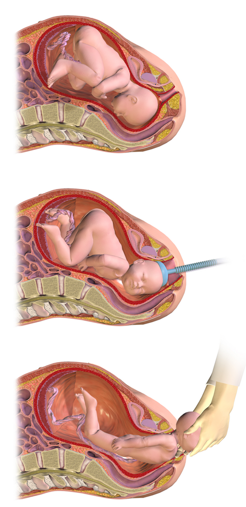
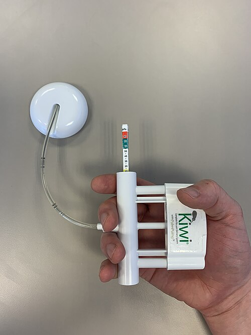

# PARTO OPERATÓRIO VAGINAL: FÓRCIPE E VÁCUO EXTRATOR

O parto operatório vaginal é a arte de abreviar o período expulsivo utilizando instrumentos que auxiliam a saída do feto. No Brasil, as provas de residência e a prática clínica baseiam-se fortemente nas diretrizes da FEBRASGO e do Ministério da Saúde. Para entender esse tema, você precisa visualizar a cena: o colo está todo dilatado, a paciente está exausta ou o bebê está dando sinais de que não aguenta mais esperar. É aqui que entramos.

*Figura 1 - Parto vaginal operatório assistido por vácuo-extrator: o dispositivo é aplicado ao polo cefálico fetal para auxiliar a extração. Fonte: BruceBlaus/Jmarchn, CC BY-SA 3.0 | Wikimedia Commons*

## Indicações: Por que intervir?

Muitos alunos erram ao achar que o fórcipe é uma "vontade" do médico. Na verdade, ele é uma necessidade clínica dividida em dois grandes grupos: indicações maternas e indicações fetais.

## Indicações Maternas

A causa mais comum em provas é a exaustão materna. Imagine uma primigesta que está empurrando há 3 horas; ela não tem mais força muscular efetiva. Outra indicação clássica é a necessidade de abreviar o esforço expulsivo por patologias maternas, como cardiopatias (onde o aumento da pressão intratorácica pela manobra de Valsalva é perigoso) ou aneurismas cerebrais. Nesses casos, usamos o chamado fórcipe de alívio.

*Figura 1 - Parto vaginal operatório assistido por vácuo-extrator: o dispositivo é aplicado ao polo cefálico fetal para auxiliar a extração. Fonte: BruceBlaus/Jmarchn, CC BY-SA 3.0 | Wikimedia Commons*

## Indicações Fetais

O "Estado Fetal Não Tranquilizador" (antigamente chamado de sofrimento fetal agudo) é a indicação fetal soberana. Se o BCF cai para 80 bpm no expulsivo e o feto está em plano baixo (+3 ou +4 de De Lee), não faz sentido correr para uma cesariana que levará 10-15 minutos para começar. O fórcipe resolve em 2 minutos. Outra indicação é a parada de progressão ou variedades de posição anômalas que impedem o desprendimento.

## Condições de Aplicabilidade: O Checklist Obrigatório

Este é o tópico que mais cai em provas. Se faltar UMA dessas condições, a aplicação do fórcipe é erro médico e erro de questão. Como dizemos no MedEvo, o fórcipe não é para "puxar o bebê para dentro da bacia", é para ajudar quem já está lá.

- **Dilatação Total:** O colo deve estar com 10 cm. Aplicar fórcipe com colo incompleto causa lacerações cervicais gravíssimas e hemorragia pós-parto.

- **Bolsa Rota:** As colheres devem tocar o couro cabeludo fetal, não as membranas.

- **Apresentação Cefálica:** Com exceção do fórcipe de Piper (usado na cabeça derradeira do parto pélvico), o feto deve estar de cabeça para baixo.

- **Proporcionalidade Cefalopélvica:** Se a cabeça é maior que a bacia (DCP), o fórcipe vai causar um trauma catastrófico.

- **Feto Insinuado (Engajado):** A apresentação deve estar, no mínimo, no plano 0 de De Lee (espinhas isquiáticas). Jamais aplique fórcipe em feto alto.

- **Variedade de Posição Conhecida:** Você precisa saber exatamente para onde o occipital está apontando para aplicar as colheres corretamente.

- **Bexiga Vazia:** Sempre esvazie a bexiga da paciente (sondagem de alívio) para evitar traumas vesicais e ganhar espaço.

- **Anestesia:** Embora não seja obrigatória em situações de extrema urgência, o ideal é o bloqueio de pudendo ou raquianestesia.

**Cuidado:** A banca vai tentar te convencer que "feto vivo" é condição obrigatória. Na verdade, se o feto estiver morto e houver indicação de abreviar o parto para salvar a mãe, o fórcipe pode ser usado, embora a embriotomia fosse a descrição clássica (hoje em desuso). Na prova, foque que o fórcipe de alívio pressupõe concepto vivo.

*Figura 2 - Extrator a vácuo Kiwi OmniCup, dispositivo utilizado para parto operatório vaginal assistido por vácuo. Fonte: MinkVerbaan, CC BY-SA 4.0 | Wikimedia Commons*

## Classificação da Aplicação (Critérios ACOG/FEBRASGO)

A classificação mudou ao longo dos anos, e as bancas adoram cobrar os critérios atuais. Esqueça "fórcipe alto" (acima do plano 0), ele é proscrito na obstetrícia moderna.

| Classificação | Critérios de Altura e Rotação |
| --- | --- |
| **Fórcipe de Saída** | Couro cabeludo visível no introito sem afastar os lábios; feto no assoalho pélvico; rotação ≤ 45°. |
| **Fórcipe Baixo** | Ponto de maior declive no plano +2 de De Lee ou abaixo. |
| **Fórcipe Médio** | Cabeça engajada, mas o ponto de maior declive está acima do plano +2 (entre 0 e +1). |

**Dica de Prova:** O fórcipe de saída é o mais seguro. O fórcipe médio é raramente indicado hoje em dia, sendo muitas vezes substituído pela cesariana devido ao alto risco de tocotraumatismo. Se a questão fala em plano +3, estamos diante de um fórcipe baixo.

## Os Tipos de Fórcipe e suas Funções

Não são todos iguais. Cada modelo foi desenhado para uma geometria específica da bacia e da cabeça fetal.

### 1. Simpson-Braun

É o "pau para toda obra". Possui curvatura cefálica (para encaixar na cabeça) e curvatura pélvica (para acompanhar o canal de parto).

- **Indicação:** Variedades de posição diretas (Occipito-Púbica ou Occipito-Sacra) ou oblíquas (OEA, ODA, OEP, ODP) com pouca rotação.

- **Articulação:** Fixa.

- **Pegadinha:** Ele é contraindicado em variedades transversas (OET, ODT) porque sua curvatura pélvica machucaria o canal de parto durante a rotação.

### 2. Kielland

O "especialista em rotação". Ele é quase reto, não possui curvatura pélvica acentuada.

- **Indicação:** Variedades transversas (OET, ODT) e assinclitismo.

- **Articulação:** Deslizante (móvel), o que permite corrigir o assinclitismo (quando a cabeça entra "torta" na bacia).

- **Técnica:** A primeira colher a ser colocada é a anterior.

### 3. Piper

O "salvador do pélvico". Possui cabos longos e uma curvatura que permite alcançar a cabeça que ficou retida após a saída do corpo.

- **Indicação Única:** Cabeça derradeira no parto pélvico.

## A Técnica de Aplicação: O "Beabá" do Professor

Imagine que você está segurando as colheres. A regra de ouro é: **"Colher esquerda na mão esquerda, no lado esquerdo da bacia materna"**.

- **Introdução:** Sempre proteja a vagina com a mão interna para evitar pinçar partes moles.

- **Pega Ideal (Biparietal-Bimalar):** As colheres devem estar simétricas, sobre as orelhas do bebê, indo do malar até o parietal.

- *Sinais de Pega Correta:* A sutura sagital está no meio das colheres, a fontanela posterior (lambda) está a um dedo acima do plano das hastes e você não sente a fontanela anterior (bregma).

- **Tração:** Deve ser feita durante a contração e acompanhando o eixo do canal de parto (curva de Carus). Primeiro para baixo, depois para cima conforme a cabeça coroa.

**Erro Comum:** Fazer a "pega frontomastoideia". Isso acontece quando o médico não identifica a variedade de posição e coloca uma colher na testa e outra na nuca. Resultado: fratura de crânio ou lesão de nervo facial.

## Vácuo Extrator (Ventosa)

O vácuo é uma alternativa ao fórcipe. Ele usa pressão negativa para fixar uma cúpula no couro cabeludo fetal.

- **Vantagem:** Ocupa menos espaço na vagina que as colheres do fórcipe. Exige menos anestesia.

- **Desvantagem:** Não serve para rotações complexas e não pode ser usado em prematuros (< 34 semanas) devido ao risco de hemorragia intracraniana.

- **Complicação Temida:** Hematoma subgaleal. Diferente do cefalohematoma (que respeita as suturas), o hematoma subgaleal pode acumular muito sangue e levar ao choque hipovolêmico neonatal.

**Regra dos 30 minutos:** O tempo total de aplicação do vácuo não deve exceder 30 minutos. Se houver três desprendimentos da cúpula ("pop-offs"), o procedimento deve ser abandonado e convertida a conduta para cesariana.

## Comparativo: Fórcipe vs. Vácuo Extrator

| Característica | Fórcipe | Vácuo Extrator |
| --- | --- | --- |
| **Espaço ocupado** | Maior (risco de laceração vaginal) | Menor |
| **Rotação** | Excelente (especialmente Kielland) | Pobre |
| **Prematuridade** | Pode ser usado | Contraindicado (< 34 sem) |
| **Trauma Fetal** | Marcas de colher, lesão de N. Facial | Bossa artificial, Hematoma subgaleal |
| **Sucesso** | Maior taxa de extração bem-sucedida | Maior taxa de falha |

## Complicações e Riscos

Como professor, preciso te alertar: o fórcipe não é perigoso, o uso *inadequado* do fórcipe é que é.

### Maternas

As lacerações de trajeto são as mais comuns (graus III e IV, atingindo o esfíncter anal e mucosa retal). A episiotomia não é obrigatória, mas em fórcipe de primigestas, muitas vezes é realizada para evitar lacerações irregulares. Outra complicação é a atonia uterina por manipulação excessiva ou parto rápido.

### Fetais

- **Marcas de pressão:** Comum e desaparece em dias.

- **Paralisia Facial:** Geralmente transitória, por compressão do nervo facial na saída do forame estilomastoideo.

- **Cefalohematoma:** Hemorragia subperióstea que NÃO cruza suturas. Conduta: Expectante (monitorar icterícia).

- **Hemorragia Intracraniana:** Rara, associada a excesso de força ou desproporção.

## Situações Especiais e Pegadinhas de Prova

### 1. Cardiopatas e a Manobra de Kristeller

Em cardiopatas, queremos evitar o esforço de puxo. O fórcipe de alívio é a conduta padrão. **Nunca** faça ou permita a Manobra de Kristeller (pressão no fundo uterino). Além de ser proscrita pela OMS, em cardiopatas ela aumenta subitamente o retorno venoso e a pressão intratorácica, podendo levar ao edema agudo de pulmão.

### 2. Distócia de Ombros

O fórcipe resolve a saída da cabeça, mas não resolve o ombro. Se após a saída da cabeça ocorrer o "Sinal da Tartaruga" (a cabeça retrai contra o períneo), você está diante de uma distócia de ombros.

- **Primeira Conduta:** Manobra de McRoberts (hiperflexão e abdução das coxas maternas) associada à pressão suprapúbica.

- **O que NÃO fazer:** Tração excessiva da cabeça ou Kristeller (isso impacta o ombro ainda mais).

### 3. Apresentação de Face

Pode-se usar fórcipe na apresentação de face? Sim, **desde que seja mento-púbica** (o queixo está para frente). Se for mento-sacra (queixo para trás), o parto vaginal é impossível, pois o pescoço do feto não tem como se estender mais para nascer. É indicação de cesariana imediata.

### 4. Rotura Uterina

Se durante a tentativa de fórcipe ou vácuo a paciente apresentar dor súbita, parada das contrações, subida da apresentação (sinal de Reasens) e sangramento, suspeite de rotura uterina. É uma emergência cirúrgica.

## O "Porquê" das Escolhas Clínicas

Por que o Dr. Will prefere o fórcipe em um feto com bradicardia grave no plano +3? Porque a velocidade de extração é maior. O vácuo depende da cooperação materna (puxos) para funcionar bem, enquanto o fórcipe permite uma tração puramente mecânica e controlada pelo obstetra.

Por que não fazemos fórcipe em feto não engajado? Porque o diâmetro que a cabeça apresenta quando está alta é o occipito-frontal (11 cm), que é maior que o suboccipito-bregmático (9,5 cm) que ela apresenta quando já está fletida e encaixada. Tentar puxar um feto alto é tentar passar um objeto grande por um buraco pequeno sem o mecanismo de flexão adequado.

## Pontos-Chave para Prova 🎯

- **Critérios de Aplicabilidade:** Dilatação total, bolsa rota, cabeça engajada (mínimo plano 0), variedade conhecida, bacia proporcional, bexiga vazia.

- **Fórcipe de Simpson:** Ideal para variedades diretas e oblíquas; possui curvatura pélvica e cefálica; articulação fixa.

- **Fórcipe de Kielland:** Ideal para variedades transversas e correção de assinclitismo; não tem curvatura pélvica; articulação deslizante.

- **Fórcipe de Piper:** Exclusivo para cabeça derradeira em parto pélvico.

- **Vácuo Extrator:** Contraindicado em prematuros < 34 semanas e apresentações de face.

- **Hematoma Subgaleal:** Complicação mais grave do vácuo; sangue entre a aponeurose epicraniana e o periósteo; cruza suturas.

- **Cefalohematoma:** Hemorragia subperióstea; NÃO cruza suturas; conduta expectante.

- **Plano de De Lee:** Fórcipe de saída (+4), Baixo (+2 ou mais), Médio (0 ou +1).

- **Manobra de McRoberts:** Primeira escolha na distócia de ombros (hiperflexão das coxas).

- **Mento-Posterior:** Contraindicação absoluta ao parto vaginal (e ao fórcipe).

- **Pega Ideal:** Biparietal-bimalar. A pega frontomastoideia é erro técnico e causa lesão de nervo facial.

- **Fórcipe de Alívio:** Indicado em cardiopatas para evitar o esforço expulsivo (Valsalva).

- **Sinal da Tartaruga:** Patognomônico de distócia de ombros.

- **Rotura Uterina:** Dor súbita, subida da apresentação, sinal de Reasens, choque.

- **Anestesia:** Raquianestesia ou bloqueio de pudendo são as escolhas ideais para o procedimento.

- **OET no plano +3:** Indicação clássica de Fórcipe de Kielland (rotação de 90°).

- **Pop-off:** Desprendimento da cúpula do vácuo; após 3 vezes, abandonar o procedimento.

- **Bossa Serossanguínea:** Edema de partes moles do couro cabeludo; presente antes do fórcipe (sinal de trabalho de parto prolongado).

Lembre-se: o fórcipe é uma ferramenta de auxílio, não de força bruta. Nas questões de prova, a banca sempre testará se você conhece os pré-requisitos de segurança. Se a questão disser que o colo está com 9 cm ou que o feto está no plano -1, a resposta NUNCA será fórcipe, será cesariana. Domine o checklist e você dominará o tema.

 Cópia offline para consulta pessoal.
 Fonte original:
 [https://www.medevo.com.br/material-apoio/ler/7218e71b-4509-4153-b433-66bf38fdd3d9](https://www.medevo.com.br/material-apoio/ler/7218e71b-4509-4153-b433-66bf38fdd3d9)
