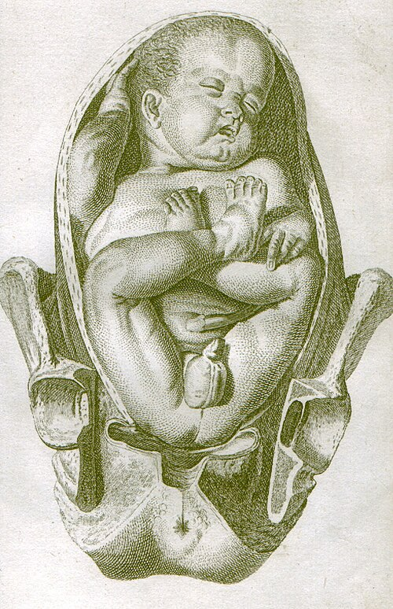
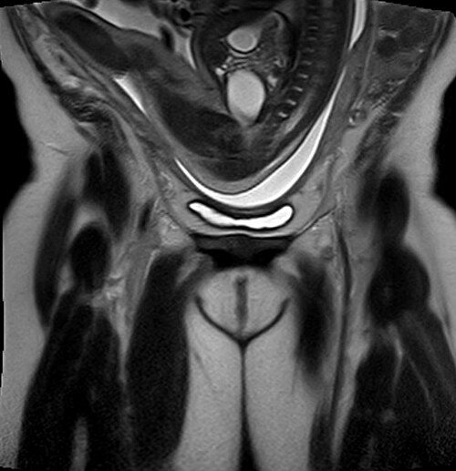

# PARTO PÉLVICO E MANOBRAS

A apresentação pélvica ocorre quando o polo caudal do feto está em relação direta com o estreito superior da pelve materna. Embora pareça um conceito simples, ele representa um dos maiores desafios da obstetrícia moderna e um dos temas favoritos das bancas de residência. Por que? Porque exige do médico não apenas conhecimento teórico, mas destreza manual e calma sob pressão.

Historicamente, o parto pélvico era comum, mas após o estudo *Term Breech Trial* em 2000, houve uma migração maciça para a cesariana. No entanto, as diretrizes atuais da FEBRASGO e do Ministério da Saúde reforçam que o parto vaginal é uma opção em casos selecionados e, mais importante, todo médico deve saber conduzi-lo, pois o "pélvico inadvertido" (aquele que chega em período expulsivo) é uma emergência que não espera o anestesista chegar.

*Figura 1 - Ilustração clássica de apresentação pélvica fetal, demonstrando o polo pélvico como apresentação. Fonte: William Smellie, Domínio Público | Wikimedia Commons*

## Classificação e Variedades de Apresentação

Para entender as manobras, você precisa primeiro saber o que está tocando. No parto cefálico, nossa referência é o occipital. No pélvico, a nossa referência é o **sacro**.

### Tipos de Apresentação Pélvica

- **Pélvica Completa (ou Agrupada):** O feto está "sentado de índio". As coxas estão fletidas sobre o abdome e as pernas fletidas sobre as coxas. Ao toque, você sente as nádegas e os pés próximos a elas.

- **Pélvica Incompleta, Modo de Nádegas (ou Agitante):** É a mais comum no termo. As coxas estão fletidas sobre o abdome, mas as pernas estão estendidas sobre o tronco (os pés estão lá perto do rosto). Ao toque, você sente apenas as nádegas.

- **Pélvica Incompleta, Modo de Pés ou Joelhos:** Um ou ambos os pés (ou joelhos) são a parte apresentada. Esta é a mais perigosa para o parto vaginal devido ao alto risco de prolapso de cordão, pois o polo pélvico não "preenche" bem o colo uterino.

**Tabela 1: Variedades de Apresentação Pélvica**

| Tipo | Descrição Clínica | Risco de Prolapso de Cordão |
| --- | --- | --- |
| **Completa** | Coxas e pernas fletidas ("sentado") | Moderado (4-5%) |
| **Incompleta (Nádegas)** | Pernas estendidas (pés no rosto) | Baixo (0,5% - similar ao cefálico) |
| **Incompleta (Pés)** | Pés abaixo das nádegas | Muito Alto (15-20%) |

**Dica de Prova:** A banca pode perguntar qual a variedade de posição. Se o sacro está voltado para o lado direito e para trás na pelve materna, chamamos de **Sacroilíaca Direita Posterior (SDP)**. Lembre-se: o ponto de referência é o sacro!

*Figura 2 - Ressonância magnética (RM) demonstrando feto em apresentação pélvica (apresentação de nádegas). Fonte: Hellerhoff, CC BY-SA 3.0 | Wikimedia Commons*

## Diagnóstico e Fatores de Risco

Por que um feto fica pélvico? Até as 32 semanas, cerca de 25% dos fetos estão pélvicos. Isso é um achado comum e irrelevante nessa idade gestacional, pois a maioria realizará a **versão cefálica espontânea** até as 36-37 semanas. No termo (37 semanas), apenas 3-4% permanecem pélvicos.

Os fatores que impedem essa rotação natural incluem:

- **Fatores Maternos:** Malformações uterinas (útero septado, bicorno), miomas submucosos, estreitamento pélvico.

- **Fatores Ovulares:** Placenta prévia (ocupa o espaço inferior), polidrâmnio (excesso de mobilidade) ou oligodrâmnio (falta de mobilidade), cordão curto.

- **Fatores Fetais:** Prematuridade (o feto ainda não virou), gestação gemelar, malformações fetais (hidrocefalia, anencefalia).

O diagnóstico é feito pelas **Manobras de Leopold**. Na primeira manobra (fundo uterino), você sente uma estrutura dura, redonda e que sofre balotamento (a cabeça). Na terceira e quarta manobras, você sente uma massa mole e irregular (as nádegas). Se houver dúvida, a ultrassonografia confirma.

## Versão Cefálica Externa (VCE)

Se você encontrar uma gestante com feto pélvico a termo (≥ 36-37 semanas), a primeira conduta recomendada pela FEBRASGO não é agendar a cesárea, mas sim oferecer a **Versão Cefálica Externa (VCE)**.

A VCE é um procedimento onde o obstetra, por meio de manobras externas no abdome materno, tenta girar o feto para a posição cefálica.

### Regras de Ouro da VCE para Prova:

- **Idade Gestacional:** Idealmente a partir de 36 semanas (primíparas) ou 37 semanas (multiparas). Antes disso, o feto pode voltar a ficar pélvico; depois disso, o espaço é reduzido.

- **Sucesso:** Cerca de 50%. Se tiver sucesso, as chances de parto vaginal aumentam drasticamente.

- **Monitoramento:** Deve ser feita em ambiente hospitalar, com jejum (caso precise de cesárea de emergência) e monitorização da frequência cardíaca fetal antes e depois.

- **Uso de Tocolíticos:** O uso de beta-agonistas (como a terbutalina) para relaxar o útero aumenta a taxa de sucesso.

**Tabela 2: Contraindicações à Versão Cefálica Externa**

| Absolutas | Relativas |
| --- | --- |
| Gestação múltipla | Oligodrâmnio |
| Placenta prévia | Obesidade materna |
| Descolamento Prematuro de Placenta (DPP) | Cicatriz uterina prévia (cesárea anterior) |
| Sofrimento fetal agudo | Crescimento Intrauterino Restrito (CIUR) |
| Ruptura prematura de membranas (Bolsa rota) | Malformações uterinas |

**Cuidado:** Muitos alunos acham que cesárea anterior proíbe a VCE. Na verdade, é uma contraindicação relativa. Já o início do trabalho de parto não impede a VCE, desde que a bolsa esteja íntegra e o feto não esteja encaixado.

## A Via de Parto: O Grande Dilema

Aqui o Dr. Will sempre alerta: a banca vai testar se você sabe quando o parto vaginal é seguro. Segundo a FEBRASGO, a cesariana eletiva é a via mais segura para o feto pélvico a termo, especialmente em primigestas. No entanto, o parto vaginal pode ser assistido se:

- Feto em apresentação pélvica completa ou incompleta modo de nádegas.

- Peso estimado entre 2.500g e 3.500g (nem muito pequeno, nem muito grande).

- Cabeça fetal fletida (se estiver defletida, o risco de encravamento é altíssimo).

- Bacia materna proporcional (pelve cirúrgica).

- Obstetra experiente na sala.

**Erro clássico de prova:** Achar que feto morto ou malformação incompatível com a vida exige cesárea se estiver pélvico. Pelo contrário! Nesses casos, prioriza-se o parto vaginal para evitar a morbidade materna de uma cirurgia. Outro ponto: em fetos pré-termo (especialmente < 32 semanas), a cesárea é quase sempre a regra, pois a cabeça é proporcionalmente muito maior que o corpo, aumentando o risco de retenção da cabeça derradeira.

## Assistência ao Parto Pélvico Vaginal

Se o parto vaginal vai acontecer, a regra número um é: **"Hands off the breech"** (Mãos fora das nádegas).

Por que não podemos puxar o feto assim que as nádegas aparecem? Porque a tração estimula o feto a respirar (risco de aspiração de mecônio) e, pior, faz com que os braços se elevem e a cabeça se deflexione. O parto pélvico deve ser **espontâneo até o umbigo**. Só colocamos a mão para realizar manobras de auxílio após o desprendimento do tronco.

### Tempos do Mecanismo de Parto

- **Insinuação:** Diâmetro bitrocantérico no diâmetro transverso da pelve.

- **Descida e Rotação Interna:** O bitrocantérico gira para o diâmetro anteroposterior (AP).

- **Desprendimento Pélvico:** Sai a nádega anterior, depois a posterior.

- **Desprendimento das Espáduas:** O diâmetro biacromial entra na pelve.

- **Desprendimento da Cabeça:** O momento crítico.

### Manobras de Assistência (O Coração do Tema)

As manobras são divididas conforme a parte do corpo que ajudam a desprender. No MedEvo, dividimos assim para facilitar a memorização:

#### 1. Para os Membros Inferiores

- **Manobra de Pinard:** Usada na apresentação pélvica incompleta (modo de nádegas) para trazer os pés para baixo. O obstetra pressiona a fossa poplítea para fletir a perna e abduzir a coxa, permitindo alcançar o pé.

#### 2. Para o Tronco e Cintura Escapular (Ombros)

Após o nascimento até o umbigo, fazemos a **alça do cordão** (puxar levemente o cordão para evitar tração e compressão). Se os braços não saírem espontaneamente, usamos:

- **Manobra de Deventer-Müller:** Tração do feto para baixo para desprender o ombro anterior sob a sínfise púbica, e depois para cima para desprender o ombro posterior.

- **Manobra de Rojas (ou de Lovset):** Rotação helicoidal do tronco fetal (180 graus) mantendo o dorso para cima. Isso faz com que o ombro posterior se torne anterior e se desprenda. É excelente para braços elevados.

- **Manobra de Pajot:** Introduz-se o dedo para buscar o braço fetal que está estendido, trazendo-o para frente do rosto (como se o feto estivesse se "lavando").

#### 3. Para a Cabeça Derradeira (O momento de maior tensão)

A cabeça derradeira é a complicação mais temida. Se ela não sai em 1-2 minutos, o feto sofre hipóxia grave por compressão do cordão entre a cabeça e a pelve.

- **Manobra de Bracht:** É a primeira a ser tentada. Consiste em segurar os pés e pernas do feto e elevar o seu dorso em direção ao abdome materno (movimento de "cambalhota"). Isso usa o próprio peso do feto para ajudar a cabeça a contornar a sínfise púbica.

- **Manobra de Mauriceau:** A clássica. O obstetra apoia o corpo do feto no seu antebraço, introduz o dedo médio e o indicador na **boca do feto** (ou sobre a mandíbula) para promover a **flexão da cabeça**. Com a outra mão sobre os ombros do feto, faz-se a tração. **Cuidado:** O objetivo é flexionar, não puxar o pescoço!

- **Fórcipe de Piper:** É um fórcipe de ramos longos e curvatura específica, desenhado exclusivamente para a cabeça derradeira. Se Mauriceau falhar, o Piper é a salvação.

**Tabela 3: Resumo das Manobras de Parto Pélvico**

| Objetivo | Manobra | Descrição Sucinta |
| --- | --- | --- |
| Desprender Pernas | **Pinard** | Pressão na fossa poplítea e apreensão do pé |
| Desprender Ombros | **Rojas** | Rotação de 180° do tronco (helicoidal) |
| Desprender Ombros | **Deventer-Müller** | Tração para baixo (ant) e para cima (post) |
| Desprender Ombros | **Pajot** | Desprendimento manual do braço (dedo na axila) |
| Cabeça Derradeira | **Bracht** | Elevação do dorso contra o abdome materno |
| Cabeça Derradeira | **Mauriceau** | Flexão da cabeça (dedo na boca) + tração |
| Cabeça Derradeira | **Piper** | Uso de fórcipe específico |

## Distocia de Ombros (Conexão Necessária)

Embora a distocia de ombros seja uma patologia típica do parto cefálico (quando a cabeça sai, mas o ombro impacta na sínfise púbica), as bancas costumam misturar esses temas.

O sinal clássico é o **Sinal da Tartaruga** (a cabeça sai e retrai). A conduta imediata é a **Manobra de McRoberts** (hiperflexão e abdução das coxas maternas) associada à **Pressão Suprapúbica**.

**Erro de Prova Fatal:** NUNCA faça a Manobra de Kristeller (pressão no fundo uterino) na distocia de ombros ou no parto pélvico. Isso aumenta o impacto do ombro e pode causar ruptura uterina.

## Situações Especiais

### Gestação Gemelar

Este é um "queridinho" das provas. A conduta depende da apresentação do **primeiro feto** (o que está mais baixo):

- **1º Cefálico / 2º Cefálico:** Parto vaginal.

- **1º Cefálico / 2º Pélvico:** Parto vaginal é seguro (≥ 32 semanas e peso > 1.500g). Após o nascimento do primeiro, o segundo pode ser conduzido via vaginal, às vezes necessitando de **versão interna** ou extração podálica.

- **1º Pélvico / 2º Qualquer:** Cesariana (risco de interatamento das cabeças).

### Prolapso de Cordão

É uma emergência obstétrica mais comum no parto pélvico (especialmente modo de pés). Se ocorrer:

- Elevar a apresentação (mão na vagina empurrando o feto para cima para descomprimir o cordão).

- Posição genitopeitoral ou de Trendelenburg na mãe.

- Cesariana de emergência imediata.

## Complicações e Prognóstico

A principal complicação do parto pélvico vaginal mal conduzido é a **asfixia perinatal** por retenção da cabeça derradeira. Outras complicações incluem:

- **Lesão do Plexo Braquial:** Por tração excessiva no pescoço ou manobras de ombro intempestivas.

- **Fraturas:** Clavícula e fêmur são as mais comuns.

- **Hemorragia Intracraniana:** Pela descompressão brusca da cabeça ao sair da pelve.

- **Hemorragia Pós-Parto (HPP):** Devido à manipulação uterina e lacerações de trajeto. Lembre-se: após o desprendimento do ombro anterior, a recomendação é 10 UI de Ocitocina IM para prevenir HPP.

## Pontos-Chave para Prova

- **VCE:** Oferecer a partir de 36-37 semanas como primeira opção para evitar cesárea. Sucesso de ~50%.

- **Amniotomia:** No parto pélvico, deve ser evitada até o período expulsivo (6-8cm é cedo demais) para prevenir prolapso de cordão.

- **Manobra de Bracht:** Primeira manobra para cabeça derradeira; consiste em "jogar" o dorso fetal sobre o abdome materno.

- **Manobra de Mauriceau:** Dedos na boca/mandíbula para **flexionar** a cabeça, não para tracionar o feto pelo pescoço.

- **Manobra de Rojas:** Rotação de 180 graus para liberar ombros (braços elevados).

- **Fórcipe de Piper:** Único fórcipe indicado para cabeça derradeira. Piper = Pélvico.

- **Gemelar:** Se o primeiro for cefálico e o segundo pélvico, o parto vaginal é uma opção segura se IG > 32 semanas.

- **Contraindicação Absoluta de VCE:** Placenta prévia, sofrimento fetal, bolsa rota, gestação múltipla.

- **Manobra de Kristeller:** Contraindicada em qualquer situação de distocia ou parto pélvico.

- **Sinal da Tartaruga:** Patognomônico de distocia de ombros (parto cefálico). Conduta: McRoberts + Pressão Suprapúbica.

- **Pélvico em 32 semanas:** Conduta expectante. A maioria vira sozinha até as 37 semanas.

- **Episiotomia:** Frequentemente realizada no parto pélvico para facilitar as manobras de Mauriceau e Bracht, embora não seja obrigatória em todos os casos.

- **Feto Morto:** Via vaginal é preferencial, mesmo se pélvico. Se precisar induzir e tiver cicatriz uterina, use Ocitocina, NUNCA Misoprostol.

- **Manobra de Hamilton:** NÃO é manobra de parto. É o descolamento digital das membranas para indução do parto. Não confunda! 💡

Este material resume as condutas baseadas nas diretrizes da FEBRASGO e do Ministério da Saúde. Ao ler uma questão sobre parto pélvico, identifique primeiro o momento do parto: é diagnóstico? É conduta pré-parto (VCE)? Ou é uma emergência de cabeça derradeira? Cada fase tem sua manobra "padrão-ouro". Boa revisão!

 Cópia offline para consulta pessoal.
 Fonte original:
 [https://www.medevo.com.br/material-apoio/ler/3233141e-a45c-4268-9dfb-405181a4a4b7](https://www.medevo.com.br/material-apoio/ler/3233141e-a45c-4268-9dfb-405181a4a4b7)
