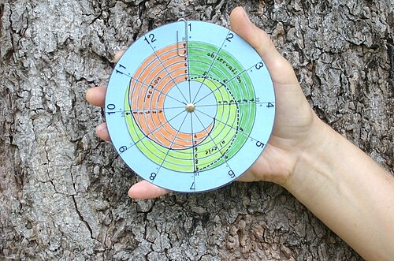

# PARTOGRAMA E INTERPRETAÇÃO

O partograma é, provavelmente, a ferramenta mais subestimada e, ao mesmo tempo, a mais cobrada na obstetrícia de prova. Muitos alunos enxergam apenas um emaranhado de linhas e triângulos, mas, para o examinador, ele é o "eletrocardiograma do parto". Se você souber ler o gráfico, você prevê o desfecho.

Como professor, vejo muitos alunos errando questões por não entenderem o momento exato de abrir o partograma. O erro começa antes mesmo do primeiro registro. O partograma não é um diário de bordo da internação, ele é o registro da fase ativa. Se você interna uma paciente em fase latente e começa a preencher o gráfico, você vai diagnosticar distocias inexistentes e acabar em uma cesariana desnecessária.

*Figura 1 - Modelo de partograma para registro gráfico da evolução do trabalho de parto, incluindo dilatação cervical e descida da apresentação fetal. Fonte: Wikimedia Commons, Copyrighted free use*

## O Diagnóstico do Trabalho de Parto

Antes de falarmos do gráfico, precisamos saber quando a caneta toca o papel. O trabalho de parto (TP) não é definido apenas por "dor". Para a prova e para a vida prática, o diagnóstico de TP exige a tríade: contrações rítmicas (pelo menos 2 a 3 em 10 minutos), apagamento cervical e dilatação progressiva.

Atualmente, as diretrizes do Ministério da Saúde e da FEBRASGO, alinhadas com a OMS, definem o início da fase ativa a partir de 5 a 6 cm de dilatação. No entanto, fique atento: muitas questões de prova ainda utilizam o critério clássico de 3 a 4 cm para iniciar o partograma. Se a questão mostrar um gráfico começando em 4 cm, siga a lógica do gráfico apresentado.

A fase latente é aquele período em que as contrações são irregulares ou a dilatação progride muito lentamente até atingir o limiar da fase ativa. No MedEvo, sempre reforçamos: fase latente prolongada não é indicação de cesárea. É indicação de paciência, deambulação e métodos não farmacológicos de alívio da dor.

*Figura 2 - Cardiotocografia (CTG): registro dos batimentos cardíacos fetais e contrações uterinas, instrumento fundamental para avaliação intraparto. Fonte: Eliran t, CC BY-SA 4.0 | Wikimedia Commons*

## A Estrutura do Partograma Clássico

O partograma é um plano cartesiano. No eixo horizontal (X), temos o tempo em horas. No eixo vertical (Y), temos dois dados fundamentais que se sobrepõem: a dilatação cervical (medida em centímetros, de 0 a 10) e a descida da apresentação fetal (medida pelos planos de DeLee, de -5 a +5).

A convenção mais comum nas provas brasileiras é:

- Dilatação cervical: representada por um triângulo ou um círculo.

- Altura da apresentação: representada por um "X".

Além disso, o gráfico contém espaços para registrar a dinâmica uterina (quantas contrações em 10 minutos e qual a duração), a frequência cardíaca fetal (BCF), a integridade das membranas (bolsa íntegra ou rota) e o aspecto do líquido amniótico (claro, meconial, sanguinolento).

### Linhas de Alerta e de Ação

Este é o ponto onde a maioria dos alunos se confunde. As linhas de alerta e ação são ferramentas de vigilância.

A Linha de Alerta é traçada assim que a paciente entra na fase ativa. Ela assume que a dilatação mínima esperada é de 1 cm por hora. Se a paciente está com 4 cm às 08:00, a linha de alerta passará pelos 5 cm às 09:00, 6 cm às 10:00, e assim por diante.

A Linha de Ação é traçada paralelamente à linha de alerta, geralmente 4 horas à direita desta. Por que 4 horas? Porque esse é o "tempo de segurança" que a evidência clínica nos deu para observar uma progressão lenta antes de decidir por uma intervenção maior, como uma cesariana.

Se a curva de dilatação cruza a linha de alerta, o Dr. Will sempre avisa: isso não é diagnóstico de distocia, é um sinal de "atenção". Você deve reavaliar a paciente, checar a dinâmica uterina e considerar a amniotomia. Se cruzar a linha de ação, aí sim, a intervenção é mandatória.

## Dinâmica Uterina e Estática Fetal

Não adianta olhar para a dilatação sem olhar para o "motor" do parto. A dinâmica uterina ideal na fase ativa é de 3 a 5 contrações de 30 a 60 segundos em 10 minutos. Se a dilatação parou e a dinâmica está fraca (hipossistolia), o problema é o motor. Se a dilatação parou e a dinâmica está excelente, o problema pode ser o "objeto" (feto) ou o "trajeto" (bacia).

A estática fetal também cai muito. Lembre-se da variedade de posição OEA (Occipito Anterior Esquerda). É a mais comum e favorável. Se o examinador descreve o dorso fetal à esquerda e a sutura sagital no diâmetro oblíquo esquerdo, ele está falando de OEA.

Cuidado com as variedades transversas (OTE/OTD) e posteriores (OP). Elas costumam cursar com partos mais lentos e maior dor lombar materna. A rotação manual do polo cefálico pode ser tentada em alguns casos de parada de progressão por variedade de posição viciosa.

## Distocias de Trabalho de Parto: O Coração da Prova

As bancas amam classificar as distocias baseadas no desenho do partograma. Vamos dissecar cada uma delas, pois aqui estão 80% das questões sobre o tema.

### 1. Fase Ativa Protraída (ou Prolongada)

Aqui, o parto está acontecendo, mas em "câmera lenta". A dilatação ocorre, mas em uma velocidade inferior a 1 cm/h. No partograma, você verá a curva de dilatação ultrapassar a linha de alerta, mas sem necessariamente cruzar a linha de ação de imediato.

Por que isso acontece? Geralmente por hipocontratilidade uterina (motor fraco) ou por uma leve desproporção entre o feto e a bacia.
Conduta: Primeiro, ofereça métodos não farmacológicos (verticalização, caminhada). Se não resolver, partimos para a amniotomia e, se necessário, ocitocina. O objetivo é otimizar as contrações.

### 2. Parada Secundária da Dilatação

Este é um diagnóstico de tempo. Para ser considerado parada secundária, a dilatação deve permanecer a mesma em dois toques sucessivos com intervalo de pelo menos 2 horas.

Atenção para a pegadinha: a paciente DEVE estar na fase ativa. Se ela está com 2 cm e continua com 2 cm após 4 horas, isso é fase latente prolongada, não parada secundária.

A principal causa da parada secundária é a Desproporção Céfalo-Pélvica (DCP). Mas cuidado! Antes de diagnosticar DCP e mandar para a cesárea, você precisa garantir que o motor está funcionando. Se a paciente tem 2 contrações fracas, a parada é por hipossistolia. Se ela tem 4 contrações fortes, a dilatação parou e o feto não desce, aí sim temos uma DCP.

### 3. Parada Secundária da Descida

Aqui, a dilatação chegou aos 10 cm (período expulsivo), mas o feto parou de descer. O diagnóstico é feito quando a altura da apresentação (o "X" no gráfico) permanece a mesma por pelo menos 1 hora após a dilatação total.

Causas comuns: Variedades de posição viciosas (como a variedade occipitotransversa persistente), exaustão materna ou analgesia peridural excessiva que retira o reflexo de puxo.
Conduta: Se houver suspeita de DCP, cesárea. Se o feto estiver em planos baixos (+2 ou +3 de DeLee) e houver sofrimento fetal ou exaustão, o parto vaginal operatório (fórceps ou vácuo-extrator) é a escolha.

### 4. Parto Taquitócico (ou Precipitado)

É o oposto da lentidão. É o parto que ocorre em menos de 4 horas (alguns autores dizem 3 horas) desde o início da fase ativa. No partograma, a curva de dilatação é quase vertical.

Parece o cenário ideal, mas não é. O parto taquitócico aumenta muito o risco de:

- Lacerações de trajeto (o períneo não tem tempo de dilatar).

- Hemorragia pós-parto por atonia uterina (o útero "cansa" de contrair tão forte).

- Sofrimento fetal agudo (as contrações intensas diminuem a perfusão placentária).

- Trauma fetal (hemorragia intracraniana por compressão rápida).

### 5. Período Pélvico Prolongado

Ocorre quando a descida é excessivamente lenta, embora não tenha parado completamente. É uma variante da fase ativa protraída, mas focada na descida no segundo estágio do parto. A conduta segue a lógica da otimização do motor ou assistência ao desprendimento.

| Distocia | Definição no Partograma | Causa Principal | Conduta Inicial |
| --- | --- | --- | --- |
| **Fase Ativa Protraída** | Dilatação < 1 cm/h | Hipossistolia | Amniotomia / Ocitocina |
| **Parada Secundária Dilatação** | Dilatação igual por ≥ 2h | DCP ou Motor | Reavaliar motor; se OK → Cesárea |
| **Parada Secundária Descida** | Descida igual por ≥ 1h (após 10cm) | DCP ou Posição | Fórceps (se baixo) ou Cesárea |
| **Parto Taquitócico** | Parto total em < 4h | Hipersistolia | Observar lacerações e atonia |
| **Parto Obstruído** | Parada com contração boa | DCP | Cesariana |

## Desproporção Céfalo-Pélvica (DCP): Como identificar?

A DCP é o "fantasma" do partograma. O examinador não vai te dizer "tem DCP". Ele vai descrever sinais clínicos. Fique atento a estes três sinais que, juntos, gritam DCP na prova:

- Parada da progressão (dilatação ou descida) com boa dinâmica uterina.

- Bossa serossanguinolenta (edema do couro cabeludo fetal por ficar batendo no osso da bacia).

- Acavalgamento de suturas (os ossos do crânio fetal se sobrepõem para tentar passar).

Se o partograma mostra a curva de dilatação à esquerda da linha de alerta (ou seja, evoluindo bem) e, de repente, ela cruza a linha de ação e para, enquanto o "X" da descida não sai do lugar, a resposta é Cesariana por DCP.

## O Período Expulsivo e a Assistência ao Parto

Quando a dilatação atinge 10 cm, entramos no segundo período do parto. Aqui, a vigilância do BCF deve ser mais rigorosa (a cada 5 ou 15 minutos, dependendo do risco).

Um conceito que cai muito é a manobra de proteção perineal (Manobra de Ritgen modificada). Ela consiste em controlar a deflexão da cabeça fetal com uma mão e apoiar o períneo com a outra, visando reduzir lacerações.

Sobre a episiotomia: a recomendação atual é que NÃO seja feita de rotina. Ela deve ser seletiva (ex: necessidade de parto instrumental ou sinais de iminência de laceração grave). Se a prova perguntar a conduta em um expulsivo fisiológico, a resposta é "proteção do períneo e aguardar evolução".

## O Terceiro e Quarto Períodos: O Pós-Parto Imediato

O parto não acaba quando o bebê sai. O terceiro período (secundamento) é a saída da placenta. O tempo limite é de 30 minutos.
A conduta ativa no terceiro período é obrigatória para prevenir hemorragia pós-parto:

- 10 UI de ocitocina IM logo após a saída do ombro fetal ou nascimento.

- Tração controlada do cordão.

- Massagem uterina após a saída da placenta.

O quarto período (período de Greenberg) dura 1 hora após o secundamento. É o momento de maior risco de hemorragia por atonia uterina. O útero deve formar o "Globo de Segurança de Pinard" (útero contraído e endurecido logo abaixo da cicatriz umbilical).

## Situações Especiais e Pegadinhas

### Ruptura Prematura de Membranas (RPMO)

Se a paciente chega com bolsa rota, a termo (≥ 37 semanas), mas sem contrações, ela não está em trabalho de parto. A conduta, segundo o Ministério da Saúde, é a indução do parto (geralmente com ocitocina se o colo for favorável). Não se abre partograma aqui até que ela entre na fase ativa.

### Mecônio no Partograma

Mecônio fluido não é sinal de sofrimento fetal isolado. Se o BCF está normal (categoria I), a conduta é apenas observação rigorosa. Se o mecônio for espesso ("purê de ervilha") e houver alteração de BCF, a interrupção do parto deve ser considerada.

### Analgesia e o Partograma

A analgesia peridural pode prolongar o trabalho de parto, especialmente o período expulsivo, pois diminui o desejo materno de puxar. Se o partograma mostrar uma parada de descida após a analgesia, a primeira conduta é diminuir a dose da medicação e estimular a verticalização, antes de pensar em fórceps.

## O Novo Partograma da OMS (2018) e o Labor Care Guide

Embora o modelo clássico de Friedman ainda domine as provas, você precisa conhecer a tendência moderna. A OMS agora sugere que a fase ativa só começa com 5 cm. Além disso, as linhas de alerta e ação fixas foram criticadas por promoverem intervenções precoces.

O novo "Labor Care Guide" foca em "limiares de tempo". Por exemplo, espera-se que de 5 a 6 cm a dilatação leve no máximo 12 horas em primíparas. No entanto, para a maioria das bancas de residência (como USP, UNICAMP, SURCE, ENARE), o gráfico de linhas de alerta e ação de 4 horas ainda é o padrão-ouro de cobrança.

## Exemplos Clínicos para Fixação

**Cenário 1:** Primigesta, 39 semanas, 6 cm de dilatação, 3 contrações de 40s em 10 min. Após 2 horas, mantém 6 cm e 3 contrações de 40s.
*Análise:* Temos uma parada secundária da dilatação. Mas a dinâmica está adequada? 3 contrações é o limite inferior.
*Conduta:* Amniotomia. Se após a amniotomia e melhora da dinâmica (4-5 contrações) ela não evoluir em mais 2 horas, aí pensamos em DCP e cesárea.

**Cenário 2:** Multípara, 40 semanas, dilatação total (10 cm), feto no plano +2 de DeLee, variedade OEA. Dinâmica de 5 contrações em 10 min. Está há 40 minutos sem descer.
*Análise:* Ainda não é parada secundária da descida (precisa de 1 hora). Como é multípara e o feto está baixo (+2), a evolução costuma ser rápida.
*Conduta:* Aguardar evolução fisiológica. Se chegar a 1 hora de parada, pode-se usar fórceps de alívio, já que o feto está baixo e a bacia já provou ser proporcional (ela é multípara).

## Pontos-Chave para Prova

- **Início da Fase Ativa:** Classicamente 3-4 cm, mas diretrizes atuais apontam 5-6 cm. O partograma começa aqui.

- **Linha de Alerta:** Traçada na fase ativa (1 cm/h). Cruzou? Reavaliar e considerar amniotomia.

- **Linha de Ação:** 4 horas após a de alerta. Cruzou? Intervenção necessária (ocitocina, fórceps ou cesárea).

- **Fase Ativa Protraída:** Dilatação lenta (< 1 cm/h). Causa: Motor. Conduta: Ocitocina/Amniotomia.

- **Parada Secundária da Dilatação:** 2 horas sem mudar a dilatação na fase ativa. Causa: DCP ou Motor.

- **Parada Secundária da Descida:** 1 hora sem descer após dilatação total (10 cm).

- **Parto Taquitócico:** < 4 horas de duração total. Risco de hemorragia e laceração.

- **DCP Real:** Parada de progressão + contração boa + bossa/acavalgamento = Cesariana.

- **Amniotomia:** É a primeira intervenção na maioria das distocias de progressão lenta.

- **Ocitocina no Pós-parto:** 10 UI IM é a regra de ouro para prevenir atonia uterina em todas as pacientes.

- **Variedade de Posição:** OEA é a "queridinha" das provas. OP (ocipitoposterior) causa parto lento e dor lombar.

- **Planos de DeLee:** 0 é a espinha isquiática. Valores positivos (+1, +2) indicam feto descendo no canal.

- **Mecônio:** Isolado não é sofrimento fetal. Exige monitorização rigorosa do BCF.

- **Cesariana no Partograma:** Indicada se houver falha nas medidas de correção (ocitocina/amniotomia) ou se houver diagnóstico claro de DCP ou sofrimento fetal agudo.

- **Fórceps:** Só pode ser usado com dilatação total, bolsa rota, feto em plano baixo (pelo menos 0, idealmente +2) e conhecimento da variedade de posição.

Lembre-se do que sempre discutimos no MedEvo: o partograma não toma decisões por você, ele te mostra o caminho. Se a curva "fugiu" para a direita, o útero está pedindo ajuda ou avisando que o bebê não passa. Interpretar isso com calma é o que separa o aprovado do reprovado.

 Cópia offline para consulta pessoal.
 Fonte original:
 [https://www.medevo.com.br/material-apoio/ler/bde8e269-330f-4527-9b0b-03086df79de9](https://www.medevo.com.br/material-apoio/ler/bde8e269-330f-4527-9b0b-03086df79de9)
