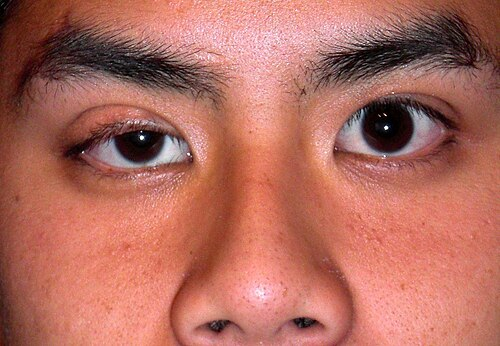
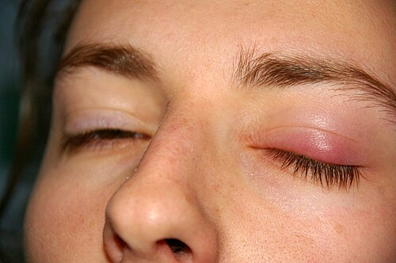

# PATOLOGIA E CIRURGIA PALPEBRAL

Para entender a pálpebra, você precisa parar de enxergá-la apenas como uma "cortina" de pele. Na prova de residência e na vida prática, a pálpebra deve ser visualizada como uma estrutura bilamelar complexa. Se você dominar essa divisão, entenderá por que certas cirurgias falham e por que certos tumores são tão perigosos.

A lamela anterior é composta por pele e músculo orbicular. A lamela posterior é composta por tarso e conjuntiva palpebral. O divisor de águas entre essas duas lamelas, anatomicamente falando, é a "linha cinzenta", que você observa na margem palpebral. Guarde isso: quase toda patologia palpebral ou envolve uma falha de sustentação dessas lamelas ou uma invasão tecidual que rompe essa arquitetura.

*Figura 1 - Ptose palpebral congênita unilateral: queda da pálpebra superior por disfunção do músculo levantador. Fonte: Andrewya, Domínio Público | Wikimedia Commons*

## Anatomia Aplicada e Fisiopatologia

Por que o idoso tem tanta patologia palpebral? A resposta curta é: frouxidão. Com o tempo, os tendões cantais (lateral e medial) se alongam, e os retratores da pálpebra inferior se desinserem. É como um elástico que perdeu a pressão.

O músculo elevador da pálpebra superior é o principal responsável pela abertura ocular, inervado pelo III par craniano. Já o músculo de Müller, simpático, dá aquele "tapa" final de 1 a 2 mm na abertura. Se o paciente está estressado ou usa colírio de brimonidina (que é alfa-agonista), a pálpebra sobe um pouco. Se ele tem uma Síndrome de Horner (perda da inervação simpática), temos uma ptose leve.

O septo orbitário é outra estrutura crítica. Ele é uma membrana fibrosa que nasce no periósteo da órbita e se funde ao elevador. Por que ele cai tanto em prova? Porque ele é a barreira anatômica que separa uma celulite pré-septal (geralmente benigna, tratada com antibiótico oral) de uma celulite orbitária ou pós-septal (emergência médica, risco de perda visual e abscesso cerebral).

*Figura 2 - Calázio: lesão granulomatosa crônica da pálpebra por obstrução de glândula de Meibomius. Fonte: jd, Domínio Público | Wikimedia Commons*

## Malposições Palpebrais: Ectrópio e Entrópio

Aqui o aluno costuma decorar nomes de cirurgias, mas o segredo é entender o vetor de força.

### Ectrópio

No ectrópio, a margem palpebral vira para fora. O principal tipo é o involucional (senil). O paciente chega reclamando de epífora (lacrimejamento). Por que ele lacrimeja se a pálpebra está aberta? Porque o ponto lacrimal não está mais em contato com o filme lacrimal e a bomba lacrimal (músculo orbicular) parou de funcionar direito.

O diagnóstico é clínico. No exame físico, você faz o "Snap Test": puxa a pálpebra inferior para baixo e solta. Se ela demorar a voltar ou precisar que o paciente pisque para retornar à posição, o teste é positivo para frouxidão horizontal.

A conduta cirúrgica padrão-ouro para o ectrópio involucional é o "Lateral Tarsal Strip" (tira tarsal lateral). Por que fazemos isso? Porque precisamos encurtar a pálpebra horizontalmente e ancorá-la novamente no periósteo do rebordo orbitário lateral. Se houver eversão do ponto lacrimal, associamos uma "Z-plastia" ou ressecção em losango da conjuntiva posterior.

### Entrópio

No entrópio, a margem vira para dentro, e os cílios raspam na córnea. Isso dói muito e causa úlceras. A causa involucional também domina aqui, mas há um componente a mais: a desinserção dos retratores da pálpebra inferior e a subida do músculo orbicular pré-tarsal sobre o tarso.

Cuidado: existe o entrópio cicatricial, comum em pacientes que tiveram tracoma ou Penfigoide Cicatricial Ocular. Nesses casos, a lamela posterior encurtou. Não adianta apenas esticar a pálpebra; você precisa de enxertos de mucosa.

**Tabela 1: Diferenciação Clínica das Malposições**

| Característica | Ectrópio Involucional | Entrópio Involucional |
| --- | --- | --- |
| Posição da Margem | Evertida (para fora) | Invertida (para dentro) |
| Sintoma Principal | Lacrimejamento e irritação | Dor intensa e sensação de corpo estranho |
| Causa Base | Frouxidão horizontal + frouxidão cantal | Frouxidão + desinserção de retratores |
| Risco Corneano | Ceratite de exposição (baixa) | Úlcera de córnea por triquíase (alto) |
| Cirurgia Clássica | Tarsal Strip Lateral | Tarsal Strip + Suturas de Quickert |

## Ptose Palpebral

A ptose é a queda da pálpebra superior. Para a prova, você deve classificar pelo mecanismo e pela função do músculo elevador.

### Avaliação Clínica (O que medir?)

- **MRD1 (Marginal Reflex Distance 1):** Distância entre o reflexo de luz na córnea e a margem da pálpebra superior. O normal é de 4 a 5 mm. Se for 2 mm, o paciente tem 2 mm de ptose.

- **Função do Músculo Elevador:** Você trava a testa do paciente (para ele não usar o músculo frontal) e pede para ele olhar do extremo inferior para o extremo superior.

- Excelente: > 12 mm.

- Boa: 8 a 11 mm.

- Pobre: < 4 mm.

### Tipos de Ptose

A **Ptose Aponeurótica** é a mais comum no idoso. O músculo elevador funciona bem, mas a "corda" (aponeurose) que o liga ao tarso esgarçou ou desinseriu. O sinal clássico é o sulco palpebral alto e o MRD1 diminuído com boa função do elevador.

A **Ptose Neurogênica** mais cobrada é a do III par. Lembre-se: se houver ptose total + olho "para fora e para baixo" + midríase (pupila dilatada), você deve correr para o neuroeixo. É um aneurisma de artéria comunicante posterior até que se prove o contrário. Se a pupila estiver normal, a causa costuma ser isquêmica (Diabetes).

A **Ptose Miogênica** clássica é a Miastenia Gravis. Dica do Dr. Will: se a ptose varia ao longo do dia (piora à noite) ou se o paciente tem o sinal de Cogan (a pálpebra dá um "pulo" ao retornar do olhar para baixo para a posição primária), pense em Miastenia. O teste do gelo (colocar gelo sobre a pálpebra por 2 minutos) melhora a ptose na Miastenia porque o frio inibe a acetilcolinesterase.

### Conduta Cirúrgica na Ptose

Por que escolhemos uma técnica e não outra?

- Se a função do elevador é boa (> 8 mm): Fazemos o avanço ou reinserção da aponeurose do elevador.

- Se a função do elevador é ruim (< 4 mm): Não adianta puxar um músculo que não contrai. Fazemos a **Suspensão Frontal**. Conectamos a pálpebra ao músculo da testa (frontal) usando um fio de silicone ou fáscia lata. Agora, quando o paciente levanta a sobrancelha, o olho abre.

## Alterações dos Cílios

Muitos alunos confundem triquíase com distiquíase. As bancas sabem disso e exploram a confusão.

- **Triquíase:** O cílio nasce no lugar certo (lamela anterior), mas cresce para o lado errado (em direção ao olho). Geralmente por inflamação crônica (blefarite).

- **Distiquíase:** É uma anomalia congênita ou metaplasia onde nasce uma segunda fileira de cílios saindo dos orifícios das glândulas de Meibomius (lamela posterior).

- **Pseudotriquíase:** É quando o cílio está na posição certa, mas a pálpebra inteira virou para dentro (entrópio).

O tratamento da triquíase isolada é a epilação (temporário), eletrólise ou crioterapia. Se forem muitos cílios, tratamos como se fosse um entrópio.

## Tumores Palpebrais

Aqui está o "filé mignon" das provas de residência. Você precisa saber diferenciar o benigno do maligno e, entre os malignos, qual mata e qual apenas destrói localmente.

### Tumores Benignos

O **Hordéolo** é a infecção aguda (estafilocócica) das glândulas. Se for na glândula de Meibomius, é hordéolo interno. Se for em Zeis ou Moll, é externo (o famoso "terçol"). Tratamento: compressas mornas (para fluidificar o lipídio e drenar) e antibiótico tópico.

O **Calázio** é uma inflamação granulomatosa crônica e estéril. Não é infecção! É um lipogranuloma por obstrução da glândula de Meibomius. Se não resolver com compressa em 1 a 2 meses, fazemos curetagem cirúrgica.

**Atenção:** Em pacientes idosos com "calázio recorrente" no mesmo local, você é obrigado a suspeitar de Carcinoma de Glândula Sebácea. Isso é uma pegadinha clássica de prova.

### Tumores Malignos

-

**Carcinoma Basocelular (CBC):** É o tumor maligno mais comum da pálpebra (90% dos casos).

- Localização preferencial: Pálpebra inferior (onde pega mais sol).

- Aparência: Nódulo perolado, com telangiectasias e centro ulcerado (úlcera de rodens).

- Comportamento: Malignidade local. Raramente dá metástase, mas se você bobear, ele invade a órbita e o seio cavernoso.

- Tratamento: Excisão cirúrgica com margens de 3 a 4 mm.

-

**Carcinoma Espinocelular (CEC):** Menos comum, mas mais agressivo que o CBC.

- Pode surgir de uma ceratose actínica.

- Gosta da pálpebra superior e do canto medial.

- Pode dar metástase linfonodal (pré-auricular e submandibular).

-

**Carcinoma de Glândula Sebácea:** O vilão silencioso.

- Altamente agressivo.

- Mimetiza calázio ou blefarite crônica (disseminação pagetoide).

- Se o examinador descrever uma "blefarite unilateral que não melhora", marque Carcinoma de Glândula Sebácea.

**Tabela 2: Comparativo de Tumores Malignos Palpebrais**

| Tumor | Frequência | Localização Comum | Características Chave | Metástase |
| --- | --- | --- | --- | --- |
| **Basocelular** | 90% | Pálpebra Inferior | Nódulo perolado, telangiectasias | Raríssima |
| **Espinocelular** | 5% | Pálpebra Superior | Placa descamativa, crescimento rápido | Possível (Linfonodos) |
| **Gl. Sebácea** | < 5% | Pálpebra Superior | Mimetiza calázio, perda de cílios | Alta (Linfonodos e Órgãos) |
| **Melanoma** | < 1% | Qualquer | Pigmentação irregular, bordas mal definidas | Alta |

## Princípios de Cirurgia e Reconstrução

Como professor, vejo muitos alunos desesperados com nomes de retalhos. Vamos simplificar a lógica da reconstrução palpebral pós-exérese de tumor.

A regra de ouro é a extensão do defeito na margem palpebral:

- **Até 33% (um terço) da pálpebra:** Fechamento primário. Você consegue "esticar" o que sobrou e costurar tarso com tarso.

- **33% a 50%:** Você precisa de uma "ajudinha" para deslizar o tecido. Usamos a Cantotomia e Cantólise Lateral (procedimento de Tenzel).

- **Mais de 50%:** Aqui precisamos de retalhos complexos.

- Pálpebra Superior: Retalho de Cutler-Beard (usa tecido da pálpebra inferior).

- Pálpebra Inferior: Procedimento de Hughes (usa tarso da pálpebra superior).

Lembre-se do conceito de MedEvo: na reconstrução, você precisa repor pelo menos uma lamela com suprimento sanguíneo próprio (retalho) e a outra pode ser um enxerto. Nunca coloque enxerto sobre enxerto, pois ele não "pega" (não vasculariza).

## Trauma Palpebral

No trauma, a primeira coisa não é a pálpebra, é o globo ocular. Nunca suture uma pálpebra sem antes garantir que o olho não está perfurado.

A grande pegadinha de prova no trauma é a laceração de canalículo lacrimal. Se a ferida for no canto medial (entre o ponto lacrimal e o nariz), você deve suspeitar de lesão da via lacrimal.

- Conduta: Intubação da via lacrimal com sonda de silicone (Crawford ou Mini-Monoka) e sutura do canalículo sob microscopia. Se você apenas suturar a pele, o paciente terá epífora crônica para o resto da vida.

Outro ponto: lacerações que envolvem a margem palpebral devem ser suturadas com a técnica de "plano a plano" para evitar o entalhe (coloboma traumático). O primeiro ponto é sempre na linha cinzenta para alinhar a margem perfeitamente.

## Blefaroplastia e Estética

A blefaroplastia é a cirurgia para remover o excesso de pele (dermatocálase) e bolsas de gordura.

- **Dermatocálase:** Excesso de pele por perda de elasticidade.

- **Herniação de bolsas de gordura:** O septo orbitário enfraquece e a gordura da órbita "pula" para fora. Na pálpebra superior temos 2 bolsas (medial e central). Na inferior temos 3 bolsas (medial, central e lateral).

Cuidado: Não confunda dermatocálase com blefarocálase. A blefarocálase é uma doença rara de jovens, com episódios recorrentes de edema palpebral que deixam a pele com aspecto de "papel de seda".

## Diagnóstico Diferencial de Edema Palpebral

Nem tudo que incha a pálpebra é cirúrgico.

- **Dermatite de Contato:** Muito comum por esmalte de unha ou cosméticos. Muita coceira e descamação.

- **Celulite Pré-septal:** Edema, calor e rubor, mas a motilidade ocular está preservada e não há proptose.

- **Celulite Orbitária:** Emergência! Tem proptose (olho para fora), dor à movimentação ocular e baixa de visão.

## Pontos-Chave para Prova

- **MRD1:** Valor normal é de 4 a 5 mm. Define o grau de ptose.

- **Função do Elevador:** > 12 mm é excelente; < 4 mm é pobre (indica suspensão frontal).

- **CBC:** Tumor maligno mais comum; pálpebra inferior; nódulo perolado; margem de 3-4 mm.

- **Carcinoma de Glândula Sebácea:** Mimetiza calázio recorrente ou blefarite unilateral; muito agressivo.

- **Sinal de Cogan:** Patognomônico de Miastenia Gravis (twitch palpebral).

- **Triquíase vs. Distiquíase:** Triquíase é cílio no lugar certo crescendo errado; Distiquíase é fileira extra de cílios.

- **Septo Orbitário:** Divisor entre celulite pré-septal e orbitária.

- **Ectrópio Involucional:** Causa é frouxidão horizontal; tratamento é Tarsal Strip Lateral.

- **Entrópio Involucional:** Envolve desinserção de retratores; risco de úlcera de córnea.

- **Regra dos 33%:** Defeitos até 1/3 da pálpebra fecham primariamente.

- **Trauma Medial:** Sempre checar integridade dos canalículos lacrimais.

- **Músculo de Müller:** Inervação simpática; sua paralisia causa a ptose leve da Síndrome de Horner.

- **Contraindicação Absoluta:** Nunca realizar cirurgia palpebral estética (blefaroplastia) em paciente com olho seco severo não controlado (risco de ceratite de exposição grave).

- **Erro Comum:** Achar que todo calázio precisa de antibiótico. Calázio é inflamação estéril; hordéolo é infecção.

- **Pegadinha de Prova:** A alternativa dirá que o CBC dá muita metástase. Falso. O CBC é invasivo localmente, mas raramente metastatiza. Quem metastatiza é o CEC e o Sebáceo. 💡

Ao revisar este material, foque na anatomia das lamelas. Se você visualizar a pálpebra em camadas, as patologias deixam de ser nomes decorados e passam a ser consequências lógicas de falhas estruturais. Como sempre enfatizamos no MedEvo, o raciocínio clínico-anatômico é o que diferencia o aprovado do candidato comum.

 Cópia offline para consulta pessoal.
 Fonte original:
 [https://www.medevo.com.br/material-apoio/ler/bb5efa45-fc16-4e15-92ce-231038ac28f1](https://www.medevo.com.br/material-apoio/ler/bb5efa45-fc16-4e15-92ce-231038ac28f1)
