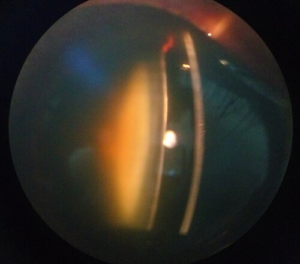

# PATOLOGIAS DO CRISTALINO

Para entender as patologias do cristalino, você precisa primeiro visualizar essa estrutura como ela realmente é: uma lente biconvexa, transparente, avascular e sem inervação. O cristalino é mantido em sua posição pelos ligamentos zonulares, que se inserem no corpo ciliar.

Por que ele é transparente? Porque suas células perdem as organelas durante a diferenciação e as proteínas, chamadas cristalinas, são organizadas de forma extremamente precisa. Qualquer fator que quebre essa organização ou altere a solubilidade dessas proteínas resultará em opacificação. É aqui que nasce a catarata.

## Anatomia e Fisiologia Aplicada

O cristalino cresce durante toda a vida. Novas fibras são formadas na periferia (córtex) e empurram as fibras mais velhas para o centro (núcleo). Isso explica por que, com o envelhecimento, o núcleo se torna mais denso e endurecido, processo que chamamos de esclerose nuclear.

A nutrição do cristalino depende inteiramente do humor aquoso. Como ele não tem vasos, qualquer alteração na composição do aquoso, como no Diabetes Mellitus ou em processos inflamatórios (uveítes), afeta diretamente sua transparência.

Um conceito fundamental para sua prova é a acomodação. Quando o músculo ciliar se contrai, as zônulas relaxam, o cristalino se torna mais globoso e seu poder dióptrico aumenta, permitindo a visão de perto. Com a idade, o cristalino perde essa elasticidade, resultando na presbiopia.

Cuidado: muitos alunos acham que a presbiopia é uma patologia do cristalino, mas na verdade é um processo fisiológico de perda de amplitude de acomodação.

## Catarata Congênita

Esta é, sem dúvida, uma das áreas preferidas das bancas de pediatria e oftalmologia. A catarata congênita é uma das principais causas de cegueira evitável na infância.

O diagnóstico precoce é feito através do Teste do Reflexo Vermelho (TRV), o famoso teste do olhinho. Segundo as diretrizes do Conselho Brasileiro de Oftalmologia (CBO) e da Sociedade Brasileira de Pediatria (SBP), o TRV deve ser realizado ainda na maternidade, antes da alta, e repetido pelo menos três vezes ao ano nos primeiros três anos de vida.

Se o reflexo estiver ausente, assimétrico ou apresentar manchas escuras (leucocoria), o encaminhamento para o oftalmologista deve ser imediato.

*Figura 1 - Catarata madura visível no olho humano: opacificação do cristalino que impede a passagem de luz. Fonte: Rakesh Ahuja, MD, CC BY-SA 3.0 | Wikimedia Commons*

## Etiologia e Investigação

Por que a catarata congênita ocorre? Em países em desenvolvimento, as causas infecciosas, especialmente a rubéola congênita, ainda são muito frequentes. No entanto, em casos bilaterais e idiopáticos, a causa genética autossômica dominante é a mais comum.

Sempre que você se deparar com uma catarata congênita bilateral, deve investigar causas metabólicas. A mais clássica em provas é a galactosemia. O erro metabólico leva ao acúmulo de dulcitol no cristalino, gerando uma catarata com aspecto de gota de óleo.

### Conduta e Tempo Cirúrgico

Aqui está o "pulo do gato" para sua prova: quando operar? O cristalino opaco na infância impede que a luz chegue à retina de forma nítida, o que interrompe o desenvolvimento do córtex visual, levando à ambliopia (o famoso olho preguiçoso).

Se a catarata for total ou central e maior que 3 mm, a cirurgia deve ser precoce. O período crítico para intervenção em cataratas congênitas unilaterais é até as 6 semanas de vida. Em bilaterais, pode-se esperar até as 10 semanas.

Por que não operar antes das 4 semanas? Porque o risco de glaucoma secundário no pós-operatório aumenta drasticamente se a cirurgia for realizada em olhos muito imaturos.

| Tipo de Catarata Congênita | Principal Associação/Característica | Conduta Sugerida |
| --- | --- | --- |
| Unilateral | Geralmente esporádica (ex: persistência do vítreo primário) | Cirurgia urgente (até 6 semanas) |
| Bilateral Simétrica | Frequentemente hereditária ou metabólica | Cirurgia até 10 semanas |
| Gota de óleo | Galactosemia | Dieta restritiva (pode reverter se inicial) |
| Membranosa | Rubéola congênita | Cirurgia e tratamento sistêmico |

## Catarata Adquirida (Senil)

A catarata senil é a principal causa de cegueira reversível no mundo. O envelhecimento causa estresse oxidativo, glicação de proteínas e falha nas bombas de transporte iônico (Na+/K+ ATPase), levando à opacificação.

Como professor, vejo muitos alunos confundirem os tipos de catarata senil. Vamos organizar isso de forma definitiva, pois as bancas adoram cobrar a correlação entre o tipo de opacidade e o sintoma visual.

### Catarata Nuclear

É a forma mais comum. Ocorre o endurecimento e o amarelecimento do núcleo (brunescência).
O sintoma clássico é a miopização. O paciente de 70 anos, que usava óculos para perto, subitamente diz que consegue ler sem óculos novamente. Ele chama isso de "segunda vista", mas na verdade é o índice de refração do núcleo que aumentou, tornando o olho mais míope.

### Catarata Cortical

Acomete o córtex do cristalino. Caracteriza-se por opacidades em formato de cunha ou raios de bicicleta.
O principal sintoma é o glare (ofuscamento). O paciente reclama muito de dirigir à noite, pois as luzes dos carros espalham na opacidade periférica e "cegam" momentaneamente a visão.

### Catarata Subcapsular Posterior (SCP)

Esta é a "queridinha" das provas por estar associada a fatores específicos. Ela se localiza logo à frente da cápsula posterior, bem no eixo visual.
Diferente das outras, a SCP afeta muito mais a visão de perto do que a de longe. Por que? Porque na visão de perto ocorre a miose pupilar (reflexo de proximidade), e a luz passa exatamente pela área central opaca.

Dica de prova: Se o enunciado mencionar um paciente jovem, usuário crônico de corticoides (tópicos ou sistêmicos), ou diabético, pense imediatamente em Catarata Subcapsular Posterior.

## Cataratas Secundárias e Traumáticas

Nem toda catarata é por idade. Existem situações específicas que você deve dominar para o MedEvo e para a vida prática.

### Causas Traumáticas

O trauma é a principal causa de catarata unilateral em pacientes jovens.

- Trauma Contuso: Pode gerar a clássica catarata em roseta ou em flor de lótus. Também pode causar a marca de Vossius (um anel de pigmento da íris na cápsula anterior do cristalino).

- Trauma Perfurante: Causa opacificação rápida devido à ruptura da cápsula e entrada de humor aquoso, que hidrata as fibras do cristalino.

### Causas Metabólicas e Tóxicas

O Diabetes Mellitus é o grande vilão aqui. O excesso de glicose no humor aquoso é convertido em sorbitol pela via da aldose redutase. O sorbitol é osmoticamente ativo, puxa água para dentro do cristalino e causa opacidades em flocos de neve.

Quanto aos medicamentos, os corticoides são os principais causadores. Não importa a via de administração (colírio, pomada nasal, inalação ou oral), o uso prolongado pode levar à catarata SCP. Outros fármacos incluem a clorpromazina (depósitos na cápsula anterior) e mióticos potentes.

## Ectopia Lentis (Subluxação do Cristalino)

Ectopia lentis é o deslocamento do cristalino de sua posição anatômica devido à fragilidade ou ruptura das zônulas. Se o cristalino sai parcialmente, chamamos de subluxação. Se sai totalmente da área pupilar, é luxação.

Este tema cai muito em provas de residência associado a síndromes sistêmicas. Você precisa decorar esta diferenciação:

-

Síndrome de Marfan: É a causa hereditária mais comum. A subluxação é tipicamente para cima e para fora (superior e temporal). O paciente tem hábito marfanoide, alterações cardíacas (aneurisma de aorta) e a zônula está íntegra, porém alongada.

-

Homocistinúria: É um erro inato do metabolismo. A subluxação é tipicamente para baixo e para dentro (inferior e nasal). Diferente do Marfan, aqui a zônula é friável e se rompe. O paciente tem deficiência intelectual e alto risco de fenômenos tromboembólicos.

Cuidado: Em provas, a alternativa vai trocar as direções. Lembre-se: Marfan é "para o alto e avante" (superior). Homocistinúria é "para baixo e para o fundo" (inferior).

| Característica | Síndrome de Marfan | Homocistinúria |
| --- | --- | --- |
| Direção do Deslocamento | Superior e Temporal | Inferior e Nasal |
| Estado da Zônula | Alongada, mas presente | Ausente ou muito friável |
| Intelecto | Normal | Frequentemente reduzido |
| Risco Sistêmico | Dissecção de Aorta | Tromboembolismo |

## Avaliação Pré-operatória e Indicações

Quando devemos indicar a cirurgia de catarata? Segundo a Diretriz Brasileira de Catarata, a indicação principal é a melhora da função visual para as atividades diárias do paciente. Não existe mais aquele conceito antigo de "esperar a catarata amadurecer". Se o paciente não consegue mais dirigir ou ler por causa da opacidade, a cirurgia está indicada.

Existem indicações médicas, onde a cirurgia é necessária mesmo que o paciente não reclame da visão:

- Glaucoma facolítico: A catarata "madura" extravasa proteínas que entopem a malha trabecular.

- Glaucoma facomórfico: O cristalino aumenta tanto de tamanho que empurra a íris para frente, fechando o ângulo.

- Necessidade de visualizar o fundo de olho: Pacientes com retinopatia diabética grave que precisam de fotocoagulação a laser, mas a catarata impede o procedimento.

### Exames Essenciais

Para o sucesso da cirurgia, precisamos calcular o poder da lente intraocular (LIO) que será implantada.

- Biometria: Mede o comprimento axial do olho. É o dado mais importante para o cálculo da LIO.

- Ceratometria: Mede a curvatura da córnea.

- Microscopia Especular: Avalia a densidade de células do endotélio corneano. Se o paciente tiver poucas células, a cirurgia pode levar à descompensação da córnea (ceratopatia bolhosa).

*Figura 2 - Catarata nuclear esclerótica em homem de 70 anos, visualizada em lâmpada de fenda. Fonte: Imrankabirhossain, CC BY-SA 4.0 | Wikimedia Commons*

## Tratamento Cirúrgico: Facoemulsificação

A técnica padrão-ouro atual é a facoemulsificação com implante de LIO dobrável. Vou descrever os passos, pois as complicações cirúrgicas são cobradas com base neles.

- Incisão: Geralmente em córnea clara, cerca de 2.4 a 2.75 mm.

- Capsulorrexis: Abertura circular na cápsula anterior. Se a capsulorrexis rasgar para a periferia, o suporte para a lente fica comprometido.

- Hidrodisseção: Injeção de líquido para separar o córtex da cápsula.

- Facoemulsificação: Uso de ultrassom para fragmentar e aspirar o núcleo.

- Aspiração do córtex: Limpeza das fibras periféricas.

- Implante da LIO: Colocada preferencialmente dentro do saco capsular.

Por que preferimos a facoemulsificação à técnica extracapsular antiga? Porque a incisão é menor, não precisa de pontos (geralmente), causa menos astigmatismo induzido e a recuperação visual é muito mais rápida.

## Complicações Pós-operatórias

Aqui é onde o Dr. Will sempre alerta seus alunos: as complicações podem ser divididas em precoces e tardias, e você precisa saber diferenciar a gravidade de cada uma.

### Endoftalmite Infecciosa Aguda

É a complicação mais temida. Ocorre geralmente nos primeiros 7 dias após a cirurgia.
Sinais de alerta: Dor ocular intensa, perda súbita de visão, hipópio (nível de pus na câmara anterior) e forte reação inflamatória.
O agente mais comum é o *Staphylococcus epidermidis*.
Conduta: Emergência oftalmológica. Coleta de material (humor vítreo) para cultura e injeção intravítrea de antibióticos (Vancomicina + Ceftazidima).

### Síndrome Tóxica do Segmento Anterior (TASS)

Muitas vezes confunde com endoftalmite, mas a TASS é uma inflamação estéril causada por substâncias tóxicas que entraram no olho durante a cirurgia (ex: resíduos de detergente no instrumental).
Diferença crucial: A TASS começa muito rápido (12 a 24 horas após a cirurgia), geralmente não causa dor intensa e responde dramaticamente a corticoides tópicos. Na endoftalmite, o quadro é mais tardio (3-7 dias) e a dor é marcante.

### Opacificação da Cápsula Posterior (OCP)

É a complicação tardia mais comum, ocorrendo em até 20-30% dos pacientes após alguns meses ou anos. Não é uma "nova catarata", mas sim a migração de células epiteliais remanescentes para a cápsula posterior, que fica atrás da lente.
O tratamento é simples: Capsulotomia com YAG Laser. É um procedimento ambulatorial que "limpa" o eixo visual.

| Complicação | Tempo de Início | Característica Principal | Conduta |
| --- | --- | --- | --- |
| Endoftalmite | 3 a 7 dias | Dor, hipópio, perda visual | Antibiótico Intravítreo |
| TASS | 12 a 24 horas | Inflamação estéril, edema de córnea | Corticoide Tópico |
| Ruptura de Cápsula | Intraoperatório | Perda de suporte para LIO | Vitrectomia anterior |
| Opacificação Capsular | Meses/Anos | Visão borrada progressiva | YAG Laser |

## Situações Especiais e Pegadinhas de Prova

### Catarata e Glaucoma

Lembre-se da relação anatômica. Um cristalino muito volumoso (catarata intumescente) pode causar fechamento angular agudo. Se o paciente chega com dor ocular, olho vermelho, pupila em médio-midríase e visão de halos coloridos, você deve pensar em glaucoma facomórfico. O tratamento definitivo é a remoção do cristalino após o controle da pressão intraocular.

### O Erro do "Cálculo da Lente"

Em pacientes que já fizeram cirurgia refrativa prévia (RK, LASIK ou PRK), as fórmulas convencionais de cálculo de LIO falham miseravelmente. Isso acontece porque a curvatura da córnea foi alterada. Se a banca colocar um paciente pós-LASIK para operar catarata, a resposta deve mencionar o uso de fórmulas especiais ou biometria de não-contato para evitar a surpresa refrativa pós-operatória.

### Pseudoesfoliação Capsular

É uma síndrome sistêmica onde um material fibrilar esbranquiçado se deposita no cristalino e nas zônulas.
Por que isso importa? Porque esse material fragiliza as zônulas. Durante a cirurgia, o cristalino pode "soltar" totalmente. Além disso, esses pacientes têm maior risco de glaucoma de difícil controle e a pupila geralmente não dilata bem.

## Pontos-Chave para Prova 👁️

- **Teste do Reflexo Vermelho (TRV):** Deve ser feito na maternidade e repetido pelo pediatra. Se alterado, encaminhamento imediato.

- **Catarata Congênita Unilateral:** Operar até as 6 semanas de vida para evitar amblyopia irreversível.

- **Catarata Congênita Bilateral:** Operar até as 10 semanas de vida.

- **Galactosemia:** Causa clássica de catarata em "gota de óleo". Pode ser reversível com dieta se diagnosticada precocemente.

- **Miopização (Second Sight):** Característica da catarata nuclear senil. O paciente volta a ler sem óculos.

- **Glare (Ofuscamento):** Sintoma predominante na catarata cortical.

- **Corticoides:** Principal causa farmacológica de catarata subcapsular posterior (SCP).

- **Diabetes Mellitus:** Associado a cataratas precoces e do tipo SCP ou em "flocos de neve".

- **Síndrome de Marfan:** Subluxação do cristalino para cima (superior) e temporal. Zônulas íntegras mas alongadas.

- **Homocistinúria:** Subluxação para baixo (inferior) e nasal. Zônulas rompidas e risco de trombose.

- **Endoftalmite Aguda:** Dor, hipópio, 3-7 dias pós-op. Agente principal: *S. epidermidis*. Emergência!

- **TASS:** Inflamação estéril, início precoce (até 24h), melhora com corticoide.

- **Opacificação de Cápsula Posterior:** Complicação tardia mais comum. Tratada com YAG Laser.

- **Biometria:** Exame padrão para medir o comprimento do olho e calcular o grau da lente (LIO).

- **Glaucoma Facomórfico:** Aumento do cristalino causando fechamento do ângulo.

- **Glaucoma Facolítico:** Extravasamento de proteínas de uma catarata madura obstruindo o trabeculado.

- **Contraindicação Absoluta de LIO Multifocal:** Pacientes com patologias maculares graves ou astigmatismo irregular importante, pois a lente divide a luz e piora a sensibilidade ao contraste.

- **O que NÃO fazer:** Não indicar cirurgia de catarata baseando-se apenas na idade do paciente. A indicação é funcional ou médica.

 Cópia offline para consulta pessoal.
 Fonte original:
 [https://www.medevo.com.br/material-apoio/ler/f3971668-2dd7-488e-9e1c-9b4ea72de74a](https://www.medevo.com.br/material-apoio/ler/f3971668-2dd7-488e-9e1c-9b4ea72de74a)
