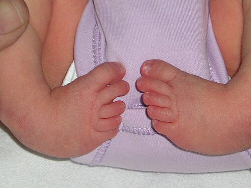
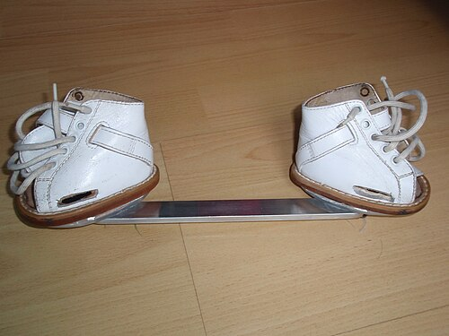

# PÉ TORTO CONGÊNITO

O Pé Torto Congênito, ou PTC, é uma das deformidades ortopédicas mais comuns ao nascimento e, sem dúvida, uma das preferidas pelas bancas de pediatria e ortopedia. Para entender o PTC, você não deve pensar nele apenas como um pé "virado". Ele é uma displasia de todas as estruturas musculoesqueléticas abaixo do joelho, envolvendo ossos, articulações, ligamentos, tendões e até vasos sanguíneos.

Muitos alunos erram questões por não saberem diferenciar o pé torto verdadeiro daquele pé que apenas ficou "apertado" dentro do útero. Aqui no MedEvo, focamos na clareza: o PTC verdadeiro é rígido. Se você consegue manipular o pé e levá-lo à posição normal com facilidade, você não está diante de um PTC, mas sim de um pé torto postural. Guarde essa diferença, pois ela é o primeiro filtro de qualquer questão de prova.

## Definição e Anatomia da Deformidade

O PTC é definido clinicamente por quatro deformidades fundamentais que ocorrem simultaneamente. Para memorizar, usamos o mnemônico **CAVE**. Entender a ordem dessas letras é crucial, pois, como veremos adiante, essa é a ordem exata da correção no tratamento.

- **Cavo:** O arco plantar é excessivamente alto. Isso acontece porque o antepé está fletido em relação ao retropé.

- **Aduto:** A parte da frente do pé (antepé) está apontada para a linha média do corpo.

- **Varo:** O calcanhar (retropé) está inclinado para dentro.

- **Equino:** O pé está apontado para baixo, como o pé de um cavalo, devido ao encurtamento severo do tendão de Aquiles.

Por que o pé assume essa forma? Não é apenas um "mau jeito". Existe uma subluxação da articulação talocalcaneonavicular. O osso tálus, que deveria ser o pivô do tornozelo, está deformado e sua cabeça está voltada para fora, enquanto o navicular e o calcâneo estão deslocados para dentro e para baixo.

## Epidemiologia e Fatores de Risco

A incidência do PTC é de aproximadamente 1 para cada 1.000 nascidos vivos. Se você estiver em um plantão de obstetrícia movimentado, certamente verá um caso em algum momento.

Existem alguns padrões epidemiológicos que as bancas adoram explorar:

- **Sexo:** É duas vezes mais comum em meninos do que em meninas (proporção 2:1).

- **Lateralidade:** Em cerca de 50% dos casos, o acometimento é bilateral. Quando é unilateral, o lado direito costuma ser um pouco mais afetado.

- **Histórico Familiar:** Existe uma carga genética importante. Se um dos pais teve PTC, o risco para o filho aumenta significativamente.

Cuidado com a pegadinha: o PTC isolado (idiopático) é a forma mais comum, mas ele pode estar associado a síndromes. Se você vir um bebê com PTC e outras malformações, como artrogripose ou mielomeningocele, o prognóstico e o tratamento mudam. O foco da nossa aula hoje é o PTC Idiopático, que é o que cai em 95% das provas.

*Figura 1 - Pé torto congênito bilateral (equinovaro), demonstrando a deformidade característica com adução, supinação e equinismo. Fonte: Brachet Youri, CC BY-SA 3.0 | Wikimedia Commons*

## Etiologia e Fisiopatologia: O Porquê da Deformidade

Por que o pé nasce assim? A teoria mais aceita atualmente, defendida por Ponseti e Ippolito, sugere que há um defeito no desenvolvimento do colágeno e das fibras musculares.

As estruturas mediais e posteriores do pé (tendões tibial posterior, flexor longo dos dedos e o próprio tendão de Aquiles) são extremamente curtas e fibróticas. Elas agem como "rédeas" que puxam o pé para a posição de CAVE. Além disso, os ligamentos da face interna do pé estão espessados.

Dica do Dr. Will: Imagine que o lado interno do pé é um elástico que perdeu a elasticidade e encolheu, enquanto o lado externo é um elástico frouxo e esticado. O tratamento consistirá em "esticar" esse lado interno de forma gradual e biológica.

## Quadro Clínico e Exame Físico

O diagnóstico do PTC é essencialmente clínico. Você não precisa de um raio-X para dizer que uma criança tem pé torto. Na verdade, pedir radiografia em um recém-nascido com PTC é um erro comum, pois os ossos do pé ainda são majoritariamente cartilaginosos e não aparecem bem no exame, o que pode confundir mais do que ajudar.

Ao examinar o bebê, você notará:

- O pé em equino, varo e aduto.

- Uma prega cutânea profunda na face medial do pé e outra acima do calcanhar (prega posterior).

- O calcanhar parece "vazio" ao toque, pois o osso calcâneo está subido (equino).

- Atrofia da panturrilha: Mesmo nos casos tratados precocemente, a panturrilha do lado afetado sempre será um pouco mais fina que a do lado normal. Isso é uma característica intrínseca da doença, não uma falha do tratamento.

### A Manobra de Diferenciação

Esta é a parte mais importante do exame físico para a sua prova. Como diferenciar o PTC do Pé Torto Postural?

- **Pé Torto Postural:** Você consegue levar o pé até a posição neutra ou até encostar o dorso do pé na frente da canela (tíbia) com uma pressão leve. Ele é flexível.

- **Pé Torto Congênito:** É rígido. Você tenta corrigir e sente uma resistência mecânica intransponível.

| Característica | Pé Torto Congênito (Verdadeiro) | Pé Torto Postural |
| --- | --- | --- |
| **Rigidez** | Rígido, não corrige manualmente | Flexível, corrige totalmente |
| **Pregas Cutâneas** | Pregas profundas (medial e posterior) | Ausentes ou superficiais |
| **Atrofia de Panturrilha** | Presente | Ausente |
| **Tratamento** | Gessos seriados (Ponseti) | Estimulação manual / Observação |

*Figura 2 - Órtese de Denis Browne (barra e botas) utilizada na fase de manutenção do tratamento do pé torto congênito pelo método de Ponseti. Fonte: Dolmanrg, CC BY-SA 4.0 | Wikimedia Commons*

## Diagnóstico Diferencial

Além do pé postural, você deve pensar em outras condições que "entortam" o pé do bebê:

- **Metatarso Aduto:** Apenas a frente do pé está virada para dentro. O calcanhar está normal (neutro ou em valgo). No PTC, o calcanhar obrigatoriamente está em varo.

- **Pé Talus Vertical:** É o oposto do PTC. O pé tem um formato de "mata-borrão" ou "balanço", com o meio do pé saltado para baixo. É uma deformidade em valgo e calcâneo, muito associada a síndromes neurológicas.

- **Pé Torto Teratológico:** É o PTC que vem "dentro" de uma síndrome (ex: Mielomeningocele). Ele é muito mais rígido e resistente ao tratamento convencional.

## Tratamento: O Método de Ponseti

Se existe um nome que você precisa levar para a prova, é **Ignacio Ponseti**. O método desenvolvido por ele na Universidade de Iowa é o padrão-ouro mundial. Antes dele, as crianças eram submetidas a cirurgias agressivas que deixavam pés rígidos e dolorosos na vida adulta. Com o método de Ponseti, conseguimos pés funcionais, flexíveis e indolores em mais de 90% dos casos.

O tratamento deve ser iniciado o mais cedo possível, idealmente na primeira ou segunda semana de vida. Mas atenção: não é uma emergência médica. Não se inicia gesso no berçário logo após o parto. Esperamos a pele do bebê ficar mais firme e o vínculo com a mãe se estabelecer.

### As Fases do Método de Ponseti

O método consiste em três fases principais: Gessos Seriados, Tenotomia e Órtese.

#### 1. Gessos Seriados (Fase de Correção)

São feitos gessos semanais (trocados a cada 7 dias). O objetivo é rodar o pé para fora, usando o osso tálus como ponto de apoio (fulcro).

Aqui entra a ordem de correção das deformidades (lembra do CAVE?):

- **1º Gesso:** Corrige o **Cavo**. Como? Alinhando o antepé com o retropé. Você supina o antepé para "abrir" o arco plantar. Erro comum de aluno: achar que para corrigir o pé torto tem que forçar para baixo. Não! O primeiro movimento é de supinação.

- **Gessos seguintes (2º ao 5º em média):** Corrigem o **Aduto** e o **Varo** simultaneamente. O médico abduz o pé (leva para fora) gradualmente.

**Regra de Ouro:** O Equino (o "pé para baixo") NUNCA deve ser corrigido forçando o pé para cima antes que o varo e o aduto estejam corrigidos. Se você tentar "puxar" o pé para cima antes da hora, vai causar uma deformidade em "pé em mata-borrão" (quebra do mediopé).

#### 2. Tenotomia do Tendão de Aquiles

Após 4 a 6 gessos, o pé já está bem abduzido (virado para fora), mas o calcanhar continua "subido" (equino). Por que isso acontece? Porque o tendão de Aquiles no PTC é extremamente fibrótico e não cede ao gesso.

Cerca de 85% a 90% das crianças com PTC precisam da **Tenotomia Percutânea do Aquiles**.

- É um procedimento simples, feito com anestesia local ou sedação leve.

- O médico corta o tendão com uma lâmina fina ou agulha grossa.

- Após o corte, o pé "ganha" o movimento de subida (dorsiflexão).

- Um último gesso é colocado e mantido por **3 semanas**. Nesse tempo, o tendão de Aquiles se regenera na posição alongada. Sim, o corpo humano é incrível e o tendão cicatriza sozinho no comprimento certo.

#### 3. Órtese de Abdução (Fase de Manutenção)

Esta é a fase onde a maioria dos tratamentos falha, e as bancas sabem disso. Após retirar o último gesso (pós-tenotomia), o pé está corrigido, mas a memória biológica dos tecidos tende a puxá-lo de volta para a deformidade.

Para evitar a recidiva, usamos a **Órtese de Denis Browne** (aquela botinha conectada por uma barra de ferro).

- **Protocolo de uso:** 23 horas por dia nos primeiros 3 meses. Depois disso, apenas para dormir (12 a 14 horas por dia) até os 4 ou 5 anos de idade.

- **Configuração da órtese:** O pé afetado fica rodado 60 a 70 graus para fora. Se for bilateral, ambos ficam assim. Se for unilateral, o pé normal fica rodado apenas 30 a 40 graus.

A principal causa de recidiva do PTC é a má adesão ao uso da órtese. Se a questão de prova mencionar um pé que estava bom e começou a entortar de novo aos 2 anos de idade, a primeira pergunta do médico deve ser: "Eles estão usando a botinha direito?".

| Fase do Tratamento | Ação Principal | Objetivo |
| --- | --- | --- |
| **Gessos Seriados** | Trocas semanais (4 a 6 gessos) | Corrigir Cavo, Aduto e Varo |
| **Tenotomia** | Corte percutâneo do Aquiles | Corrigir o Equino residual |
| **Órtese (Denis Browne)** | Uso prolongado (até 4-5 anos) | Prevenir a recidiva (manutenção) |

## Complicações e Erros Comuns

Mesmo com o método de Ponseti, as coisas podem dar errado. Vamos antecipar o que pode aparecer na sua prova:

- **Recidiva:** Como dito, é comum por falta de uso da órtese. O primeiro sinal de recidiva costuma ser a perda da dorsiflexão (o pé volta a ficar em equino) ou o pé começar a virar para dentro novamente (supinação dinâmica).

- **Pé em Mata-borrão (Rocker-bottom):** Ocorre quando o médico tenta corrigir o equino forçando o pé para cima antes de corrigir o varo. O pé "quebra" no meio. É uma falha técnica grave.

- **Escoriações e Úlceras de Pressão:** O gesso de Ponseti é bem modelado. Se não for bem acolchoado sobre as proeminências ósseas, pode causar feridas na pele sensível do bebê.

### Quando a cirurgia é necessária?

Antigamente, a "Liberação Posteromedial" (uma cirurgia grande que abria o pé todo) era a regra. Hoje, ela é a exceção. Reservamos a cirurgia para:

- Casos teratológicos (sindrômicos) que não respondem ao gesso.

- Recidivas graves onde o método de Ponseti (que pode ser repetido!) falhou novamente.

- Crianças mais velhas que nunca foram tratadas (pé torto negligenciado).

Uma cirurgia comum em crianças maiores (acima de 3-4 anos) com recidiva dinâmica é a **Transferência do Tendão Tibial Anterior**. O tendão é movido da parte interna para a parte externa do pé para ajudar a "puxar" o pé para fora durante a caminhada.

## Estratificação de Risco e Prognóstico

Para avaliar a gravidade do PTC e acompanhar a evolução, usamos a **Classificação de Pirani**. Ela é baseada em pontos (0 a 6). Quanto maior a pontuação, mais grave é a deformidade.

O Pirani avalia 6 sinais (3 no retropé e 3 no mediopé):

- **Retropé:** Prega posterior, Equino rígido, Calcanhar vazio.

- **Mediopé:** Prega medial, Curvatura da borda lateral, Posição da cabeça do tálus.

Se um bebê chega com Pirani 6, você já avisa aos pais que ele provavelmente precisará de mais gessos e que a tenotomia é quase certa. Se o Pirani é 2, o caso é mais leve.

## Exemplo Clínico para Fixação

Imagine o seguinte cenário:
*Recém-nascido, sexo masculino, 15 dias de vida. A mãe relata que o pé direito é "virado para dentro". Ao exame: pé em equino, varo e aduto. Ao tentar manipular, o pé não atinge a posição neutra. Há uma prega profunda na planta do pé e a panturrilha direita é visivelmente menor que a esquerda.*

**O que você deve pensar?**

- É PTC verdadeiro ou postural? É verdadeiro (rígido + prega profunda + atrofia).

- Qual o próximo passo? Iniciar gessos seriados pelo método de Ponseti.

- Precisa de Raio-X? Não, o diagnóstico é clínico.

- Qual a primeira deformidade a ser corrigida? O Cavo (através da supinação do antepé).

- E se a mãe perguntar sobre a panturrilha? Você explica que a atrofia é própria da doença e persistirá, mas não impedirá a criança de andar ou correr.

## Dicas de Ouro para a Prova

As bancas adoram confundir o tratamento do PTC com o da Displasia de Quadril. No quadril, usamos o Suspensório de Pavlik. No pé torto, usamos Gesso de Ponseti e Órtese de Denis Browne. Não troque as bolas!

Outro ponto: a tenotomia do Aquiles não é "opcional" na maioria dos casos. Se a questão disser que o pé está quase bom, mas ainda falta um pouco de movimento para cima, a resposta correta é a tenotomia.

Lembre-se do que sempre dizemos no MedEvo: em ortopedia pediátrica, o tempo é seu aliado se você souber o que fazer, mas seu inimigo se você negligenciar a rigidez de uma deformidade.

## Pontos-Chave para Prova

- **Tríade Clássica (mais o Cavo):** Equino, Cavo, Varo e Aduto (CAVE).

- **Diagnóstico Diferencial Principal:** Pé Torto Postural (é flexível e corrige manualmente).

- **Padrão-Ouro de Tratamento:** Método de Ponseti (Gessos seriados + Tenotomia + Órtese).

- **Ordem de Correção:** 1º Cavo, depois Aduto e Varo, por último o Equino.

- **Tenotomia do Aquiles:** Necessária em ~90% dos casos para corrigir o equino residual.

- **Órtese de Denis Browne:** Essencial para evitar recidiva; usada até os 4-5 anos de idade.

- **Principal Causa de Recidiva:** Má adesão ao uso da órtese de abdução.

- **Exames de Imagem:** Desnecessários para o diagnóstico inicial (que é puramente clínico).

- **Atrofia de Panturrilha:** Achado universal e persistente no PTC, mesmo após tratamento bem-sucedido.

- **Epidemiologia:** Mais comum em meninos (2:1) e 50% dos casos são bilaterais.

- **Classificação de Pirani:** Usada para graduar a gravidade (0 a 6 pontos).

- **Contraindicação:** Nunca tentar corrigir o equino (forçar para cima) antes de corrigir o varo e o aduto (risco de pé em mata-borrão).

- **Início do Tratamento:** Idealmente nas primeiras 2 semanas de vida, mas não é emergência de berçário.

- **Transferência de Tendão:** Pode ser indicada em recidivas dinâmicas em crianças acima de 3 anos (Tibial Anterior).

- **Pegadinha de Prova:** A alternativa dirá que o tratamento inicial é cirúrgico (falso) ou que o gesso deve ser trocado a cada 30 dias (falso, é semanal). 👣

 Cópia offline para consulta pessoal.
 Fonte original:
 [https://www.medevo.com.br/material-apoio/ler/dae6aeaf-f3ac-474f-9ba2-7f722b4debc1](https://www.medevo.com.br/material-apoio/ler/dae6aeaf-f3ac-474f-9ba2-7f722b4debc1)
