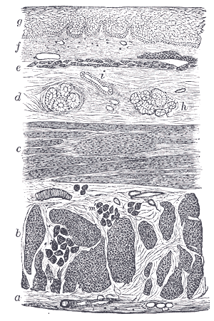
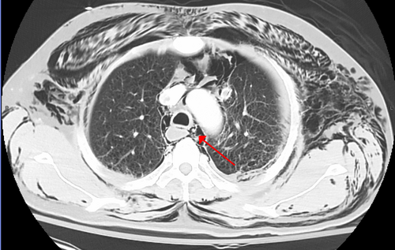

# PERFURAÇÃO ESOFÁGICA

Para entender a perfuração esofágica, você precisa primeiro entender por que o esôfago é o "patinho feio" do trato digestório quando falamos de cicatrização e resistência. Diferente do estômago ou do cólon, o esôfago **não possui camada serosa**. Ele é composto apenas por mucosa, submucosa e muscular.

Essa ausência de serosa é o que o Dr. Will sempre reforça: sem essa "capa" protetora e seladora, qualquer lesão ganha o mediastino com uma facilidade assustadora. É por isso que a perfuração esofágica não é apenas um "furo"; é o início de uma mediastinite química e bacteriana que pode matar o paciente em poucas horas se você não souber o que fazer.

## Anatomia Aplicada e Zonas de Fraqueza

Antes de falarmos do buraco, vamos falar de onde ele costuma acontecer. O esôfago tem três estreitamentos anatômicos naturais onde os corpos estranhos param e onde as pinças de endoscopia costumam causar problemas:

- Cricofaríngeo (esôfago superior).

- Brônquio principal esquerdo/Arco aórtico (esôfago médio).

- Diafragmático (esôfago distal).

Na porção cervical, a vascularização é um ponto que as bancas adoram. Lembre-se: o esôfago cervical recebe sangue principalmente da **artéria tireoideana inferior**, que é um ramo do **tronco tireocervical** (este, por sua vez, nasce da artéria subclávia). Se a prova perguntar sobre a irrigação do esôfago superior, procure pela tireoideana inferior.

### O Triângulo de Killian e o Divertículo de Zenker

Muitas questões de perfuração começam com um divertículo. O **Divertículo de Zenker** é um divertículo de **pulsão** (causado por aumento de pressão intracavitária) e é considerado um "falso" divertículo porque consiste apenas em herniação de mucosa e submucosa.

Ele ocorre exatamente no **Triângulo de Killian**, uma zona de fraqueza entre as fibras do músculo tireofaríngeo e o músculo cricofaríngeo (que é o componente principal do esfíncter esofágico superior).

**Erro clássico de prova:** Achar que o Zenker é um divertículo esofágico anatômico. Tecnicamente, ele é **faringoesofágico**. Ele nasce na faringe, logo acima do esôfago.

*Figura 1 - Corte transversal do esôfago humano demonstrando suas camadas: mucosa, submucosa, muscular e adventícia. A ausência de serosa torna o esôfago vulnerável à perfuração. Fonte: Henry Vandyke Carter, Domínio Público | Wikimedia Commons*

## Etiologia: Como o Esôfago Fura?

Existem três formas principais de um esôfago perfurar, e a prova vai te dar dicas claras sobre qual é qual.

### 1. Iatrogenia (A causa número 1)

Cerca de 60% das perfurações são causadas por nós, médicos. O procedimento campeão é a **Endoscopia Digestiva Alta (EDA)**, especialmente quando associada a intervenções como dilatação de estenoses, escleroterapia de varizes ou retirada de corpos estranhos.

### 2. Síndrome de Boerhaave (Ruptura Espontânea)

Aqui o cenário é clássico: um paciente (geralmente homem, meia-idade) que após uma libação alcoólica ou excesso alimentar, apresenta **vômitos vigorosos e repetidos**, seguidos de uma dor torácica lancinante.

Diferente da Síndrome de Mallory-Weiss (que é apenas uma laceração da mucosa que causa sangramento), na Boerhaave a ruptura é **transmural** (atravessa todas as camadas).

- **Localização típica:** Parede posterolateral esquerda do esôfago distal, cerca de 2 a 3 cm acima da junção gastroesofágica.

### 3. Trauma e Corpos Estranhos

Traumas penetrantes (FAB ou FAF) em zona 2 do pescoço frequentemente atingem o esôfago cervical. Já o trauma fechado é uma causa raríssima de perfuração esofágica; se a questão trouxer trauma fechado de tórax, pense primeiro em ruptura de aorta ou lesão brônquica.

*Figura 2 - Tomografia computadorizada demonstrando pneumomediastino: ar no mediastino, complicação frequente da perfuração esofágica. Fonte: James Heilman, MD, CC BY-SA 3.0 | Wikimedia Commons*

## Quadro Clínico: A Tríade de Mackler

Se você decorar a **Tríade de Mackler**, você mata metade das questões de Síndrome de Boerhaave:

- Vômitos vigorosos.

- Dor torácica súbita e intensa.

- Enfisema subcutâneo (palpável na base do pescoço ou fúrcula esternal).

O enfisema subcutâneo é o "pulo do gato". Se o paciente tem dor torácica após vomitar e você sente crepitação ao palpar o pescoço, o diagnóstico é perfuração esofágica até que se prove o contrário.

**Cuidado com o diagnóstico diferencial:** A dor pode simular um Infarto Agudo do Miocárdio (IAM), uma Dissecção de Aorta ou uma Pancreatite Aguda. Mas o enfisema subcutâneo e o pneumomediastino no raio-X direcionam para o esôfago.

### Complicações dos Divertículos

O paciente com Divertículo de Zenker queixa-se de disfagia, halitose (comida parada que apodrece no saco diverticular) e regurgitação. A complicação mais temida e comum em idosos é a **pneumonia aspirativa** ou abscesso pulmonar. O diagnóstico é feito com esofagograma baritado. **Nunca** peça EDA como primeiro exame para suspeita de Zenker, pois o aparelho pode entrar no divertículo e perfurá-lo!

## Diagnóstico por Imagem

Como confirmar a suspeita?

-

**Radiografia de Tórax e Cervical:** É o primeiro exame. O que buscamos?

- Pneumomediastino (ar ao redor do coração, sinal de Hamman).

- Enfisema subcutâneo.

- Derrame pleural (geralmente à esquerda na Boerhaave).

- Alargamento do mediastino.

-

**Esofagograma Contrastado:** É o padrão-ouro para localização.

- **Regra de Ouro:** Comece sempre com contraste **hidrossolúvel** (Gastrografin). Por quê? Porque o bário no mediastino causa uma reação inflamatória (mediastinite fibrosante) gravíssima. Se o hidrossolúvel for negativo, mas a suspeita persistir, aí sim você pode usar o bário, que tem maior sensibilidade para pequenas lesões.

-

**Tomografia de Tórax:** Excelente para ver coleções mediastinais e ar extraluminal que o raio-X comeu. É fundamental para o planejamento cirúrgico.

| Exame | Achado Sugestivo | Observação de Prova |
| --- | --- | --- |
| Raio-X | Pneumomediastino | Sinal mais precoce e comum |
| Esofagograma | Extravasamento de contraste | Usar hidrossolúvel primeiro |
| TC de Tórax | Coleções e ar no mediastino | Define a extensão da mediastinite |
| EDA | Visualização direta da lesão | Risco de piorar o pneumomediastino pelo insuflar de ar |

## Tratamento: O Tempo é Vida

O tratamento da perfuração esofágica depende de três pilares: **Tempo de evolução, Estabilidade do paciente e Localização da lesão.**

Na MedEvo, sempre enfatizamos a "Janela de Ouro" de 24 horas.

### Medidas Iniciais (O "ABC" da Perfuração)

Todo paciente com suspeita de perfuração deve:

- Ficar em NADA POR VIA ORAL (NPO).

- Receber reposição volêmica agressiva (choque obstrutivo/distributivo por mediastinite).

- Iniciar **Antibioticoterapia de amplo espectro** IMEDIATAMENTE. O foco é cobrir flora da boca (Gram positivos e anaeróbios) e Gram negativos. Ex: Ceftriaxone + Metronidazol ou Piperacilina/Tazobactam.

- Inibidores de Bomba de Prótons (IBP) venoso para diminuir a agressão ácida ao mediastino.

### Conduta Cirúrgica vs. Conservadora

#### Quando ser conservador? (Critérios de Altorjay)

Raramente cai, mas é bom saber: paciente estável, perfuração pequena, contida no mediastino (sem extravasamento para pleura ou peritônio) e diagnóstico muito precoce em esôfago cervical.

#### Quando operar? (A regra para a prova)

A maioria absoluta das perfurações torácicas e abdominais exige cirurgia.

-

**Diagnóstico Precoce (< 24 horas):**

- O tecido ainda é "suturável".

- Conduta: **Sutura primária (Rafia)** da lesão + Reforço com retalho de tecido vizinho (pleura, músculo intercostal ou gordura pericárdica) + **Drenagem ampla** do mediastino e tórax.

-

**Diagnóstico Tardio (> 24-48 horas) ou Paciente Instável:**

- Aqui o esôfago está "podre", edemaciado, as suturas não seguram (deiscência certa).

- Conduta: **Exclusão esofágica** ou Desvio do trânsito. Faz-se uma esofagostomia cervical (o esôfago sai no pescoço para a saliva não cair no peito), fecha-se a cárdia e faz-se uma gastrostomia ou jejunostomia para alimentação. O mediastino deve ser drenado exaustivamente.

- Em casos extremos de necrose extensa: Esofagectomia de emergência.

### Manejo do Divertículo de Zenker

Se o divertículo for sintomático e maior que 1 cm, ele deve ser tratado.

- **Padrão-ouro tradicional:** Miotomia do cricofaríngeo + Diverticulopexia (fixar o saco para baixo) ou Diverticulectomia (retirar o saco).

- **Tratamento Endoscópico (Procedimento de Dohlman):** Grampeamento do septo entre o esôfago e o divertículo. Muito usado em idosos por ser menos invasivo.

## Situações Especiais e Pegadinhas

### Fístula Traqueoesofágica Pós-Intubação

Ocorre geralmente por pressão excessiva do balonete (cuff) da sonda endotraqueal contra uma sonda nasogástrica, causando isquemia da parede comum entre traqueia e esôfago.

- **Dica de prova:** Paciente em ventilação mecânica prolongada que começa a ter distensão gástrica súbita ou saída de dieta pela secreção traqueal.

- **Tratamento:** Se o paciente ainda precisa de ventilação, o manejo é difícil. A cirurgia definitiva envolve o reparo da traqueia e do esôfago com interposição de músculo (geralmente o esternocleidomastoideo).

### Lesão Cervical por Arma Branca (FAB)

Se o paciente tem um ferimento penetrante no pescoço (Zona 2) e está estável, mas você suspeita de lesão esofágica:

- Conduta: Cervicotomia exploradora. Se achar a lesão, faz rafia primária em dois planos + drenagem cervical + Sonda Nasoenteral (SNE) para nutrição precoce.

### Tríade de Borchardt

Não confunda com Mackler! A Tríade de Borchardt indica **Volvo Gástrico Agudo** (emergência cirúrgica):

- Dor epigástrica súbita e intensa.

- Incapacidade de passar a sonda nasogástrica.

- Vômitos que não saem (ânsia ineficaz).
Isso pode acontecer em hérnias hiatais paraesofágicas gigantes onde o estômago "gira" dentro do tórax.

## Resumo do Fluxo de Decisão

Imagine um paciente de 55 anos, após jantar festivo, chega com dor retroesternal e enfisema cervical.

- **Primeiro passo:** Estabilizar (ABC), NPO, ATB venoso.

- **Segundo passo:** Raio-X de tórax (ver pneumomediastino).

- **Terceiro passo:** Esofagograma com contraste hidrossolúvel para localizar o furo.

- **Quarto passo (A decisão):**

- Furo no esôfago distal, < 12h de evolução? **Cirurgia: Rafia primária + Drenagem.**

- Furo no esôfago distal, 72h de evolução, sepse grave? **Cirurgia: Esofagostomia + Gastrostomia + Drenagem (Exclusão).**

## Pontos-Chave para Prova 🩺

- **Causa mais comum:** Iatrogênica (procedimentos endoscópicos).

- **Síndrome de Boerhaave:** Ruptura espontânea pós-vômitos; localiza-se no esôfago distal, parede posterolateral esquerda.

- **Tríade de Mackler:** Vômitos + Dor torácica + Enfisema subcutâneo.

- **Sinal de Hamman:** Crepitação audível à ausculta cardíaca sincronizada com os batimentos (indica pneumomediastino).

- **Vascularização cervical:** Artéria tireoideana inferior (ramo do tronco tireocervical).

- **Divertículo de Zenker:** É de pulsão, falso, ocorre no Triângulo de Killian (entre tireofaríngeo e cricofaríngeo).

- **Diagnóstico de Zenker:** Esofagograma baritado. EDA é perigosa!

- **Tratamento do Zenker:** Miotomia do cricofaríngeo é a chave do sucesso.

- **Contraste de escolha:** Hidrossolúvel (Gastrografin) primeiro; bário apenas se o primeiro for negativo e a suspeita persistir.

- **Janela de 24 horas:** < 24h tenta-se sutura primária; > 24-48h geralmente requer exclusão ou ressecção devido à friabilidade tecidual.

- **Antibioticoterapia:** Deve ser iniciada IMEDIATAMENTE. Não espere a cirurgia para começar o ATB.

- **Divertículo de Esôfago Médio:** Geralmente é de **tração** (causado por linfonodos inflamados, como na TB ou Histoplasmose) e é um divertículo **verdadeiro** (tem todas as camadas).

- **Complicação pós-esofagectomia:** Vazamento anastomótico cervical com infecção deve ser tratado com abertura da ferida e drenagem ampla.

- **O que NÃO fazer:** Não tente passar sonda nasogástrica às cegas se suspeitar de perfuração, pois a sonda pode sair pelo furo e piorar a lesão mediastinal.

- **Pegadinha de prova:** A alternativa dirá que o tratamento da Boerhaave é sempre conservador com ATB. **Falso.** É uma emergência cirúrgica na imensa maioria dos casos.

 Cópia offline para consulta pessoal.
 Fonte original:
 [https://www.medevo.com.br/material-apoio/ler/99f1b1d2-ff9e-4f2c-8819-c1b684ee505d](https://www.medevo.com.br/material-apoio/ler/99f1b1d2-ff9e-4f2c-8819-c1b684ee505d)
