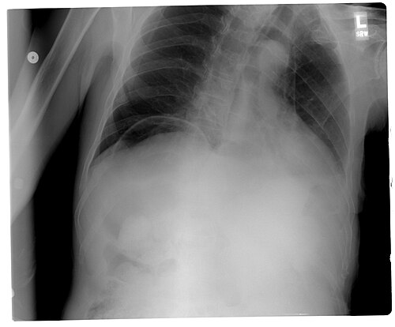
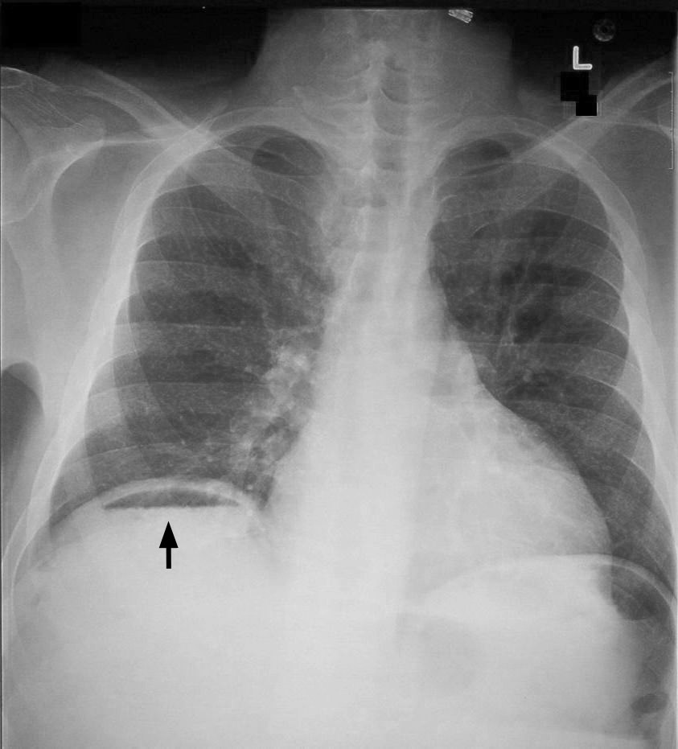

# PERFURAÇÃO GASTRODUODENAL

A perfuração gastroduodenal é o desfecho dramático da doença ulcerosa péptica (DUP) e uma das causas mais comuns de abdome agudo perfurativo nas emergências brasileiras. Para a sua prova de residência, você não deve encarar este tema como uma simples "ferida que abriu". Você precisa entender a transição da peritonite química para a bacteriana, a anatomia vascular que dita as complicações e, principalmente, por que escolhemos uma técnica cirúrgica em detrimento de outra.

Historicamente, operávamos muito mais úlceras eletivamente. Com o advento dos Inibidores de Bomba de Prótons (IBP) e a erradicação do *Helicobacter pylori*, a cirurgia de úlcera tornou-se, em sua maioria, uma cirurgia de urgência para tratar complicações: perfuração, hemorragia ou estenose.

*Figura 1 - Radiografia de tórax em ortostase demonstrando ar livre subdiafragmático bilateral (pneumoperitônio), sinal clássico de perfuração gastroduodenal. Fonte: Bill Rhodes, CC BY 2.0 | Wikimedia Commons*

## Fisiopatologia e Etiologia: O Porquê da Perfuração

A úlcera péptica perfura quando há um desequilíbrio crítico entre fatores agressores (ácido clorídrico, pepsina, AINEs, *H. pylori*) e fatores protetores da mucosa (muco, bicarbonato, fluxo sanguíneo, prostaglandinas).

### O Papel dos Agressores

- **Helicobacter pylori:** Presente em cerca de 70-90% das úlceras duodenais. Ele causa inflamação crônica e reduz a produção de somatostatina (que deveria frear a gastrina), levando à hipersecreção ácida.

- **AINEs (Anti-inflamatórios Não Esteroidais):** O grande vilão das provas. Eles inibem a COX-1, reduzindo as prostaglandinas que mantêm a barreira mucosa. Importante: a perfuração por AINE costuma ser aguda, muitas vezes sem sintomas prévios de dispepsia.

- **Tabagismo:** Retarda a cicatrização e aumenta o risco de perfuração.

### Localização e Anatomia Vascular

Aqui mora uma pegadinha clássica de prova que o **MedEvo** sempre destaca:

- **Parede Anterior do Duodeno:** É o local mais comum de **perfuração**. Por quê? Porque está voltada para a cavidade peritoneal livre.

- **Parede Posterior do Duodeno:** É o local mais comum de **sangramento**. Por quê? Porque ali passa a **Artéria Gastroduodenal**. Se a úlcera corrói a parede posterior, ela atinge o vaso. Se corrói a anterior, ela "vaza" para o abdome.

### A Evolução da Peritonite

Quando ocorre a perfuração, o conteúdo gástrico (ácido) cai na cavidade. Nas primeiras 6 a 12 horas, temos uma **peritonite química**. O paciente sente uma dor lancinante, mas o conteúdo ainda é relativamente estéril. Após esse período, ocorre a translocação bacteriana e a contaminação externa, evoluindo para **peritonite bacteriana** e sepse abdominal. Entender esse tempo é crucial para o prognóstico.

*Figura 2 - Radiografia abdominal com pneumoperitônio: ar livre na cavidade peritoneal indicando perfuração de víscera oca (setas). Fonte: Clinical Cases, CC BY-SA 2.5 | Wikimedia Commons*

## Quadro Clínico: A Dor em Punhalada

O cenário típico de prova é um paciente (muitas vezes homem, tabagista ou usuário crônico de AINE) que apresenta uma **dor epigástrica súbita, de fortíssima intensidade**, descrita como "em punhalada".

### Sinais de Exame Físico

- **Abdome em Tábua:** Contratura involuntária da musculatura abdominal devido à irritação peritoneal.

- **Sinal de Jobert:** É o desaparecimento da macicez hepática, substituída por timpanismo à percussão. Isso ocorre porque o ar que saiu do estômago se posiciona entre o fígado e o diafragma. **Cuidado:** Não confunda com o Sinal de Chilaiditi (interposição de cólon entre o fígado e o diafragma, que é um achado incidental e não indica urgência).

- **Sinal de Guéneau de Mussy:** Dor à descompressão brusca em qualquer ponto do abdome, indicando peritonite generalizada.

## Diagnóstico: O Valor da Imagem

O diagnóstico é eminentemente clínico-radiológico.

### Rotina de Abdome Agudo

O exame inicial de escolha é a **Radiografia de Tórax em ortostase** (em pé) e a **Radiografia de Abdome (AP e perfil)**.

- O achado clássico é o **Pneumoperitônio** (presença de ar livre abaixo das cúpulas diafragmáticas).

- **Dica de mestre:** O RX de tórax é melhor que o de abdome para ver pneumoperitônio, pois o raio incide tangencialmente à cúpula diafragmática.

### Tomografia Computadorizada (TC)

Se o RX for normal, mas a suspeita clínica for alta, a TC de abdome com contraste venoso é o padrão-ouro. Ela consegue detectar volumes mínimos de ar (até 1ml) e pode mostrar o local exato da perfuração (sinal do "bolha de ar" adjacente à parede gástrica).

| Exame | Sensibilidade para Perfuração | Observação |
| --- | --- | --- |
| RX de Tórax (Ortostase) | ~75-80% | Rápido, barato, mas pode ser falso-negativo se perfuração pequena. |
| TC de Abdome | >95% | Padrão-ouro. Identifica coleções e diagnósticos diferenciais. |
| Endoscopia Digestiva Alta | Contraindicada | **ERRO CLÁSSICO:** Nunca peça EDA na suspeita de perfuração aguda, pois a insuflação de ar vai piorar o pneumoperitônio e a dor. |

## Classificação de Johnson para Úlceras Gástricas

Isso cai muito! A conduta cirúrgica muda conforme o tipo de úlcera gástrica.

| Tipo | Localização | Fisiopatologia |
| --- | --- | --- |
| **Tipo I** | Pequena curvatura (baixa) | Hiposecreção/Normosecreção (mais comum) |
| **Tipo II** | Corpo gástrico + Úlcera duodenal | Hipersecreção ácida |
| **Tipo III** | Pré-pilórica | Hipersecreção ácida |
| **Tipo IV** | Pequena curvatura (alta, perto do cárdia) | Hiposecreção (risco de isquemia) |
| **Tipo V** | Qualquer local | Induzida por AINEs |

**Conexão Clínica:** As úlceras tipos II e III comportam-se como úlceras duodenais (hipersecretoras). Por isso, o tratamento cirúrgico delas geralmente exige algum procedimento para reduzir a acidez (como a vagotomia).

## Tratamento Inicial e Estabilização

Antes de levar o paciente para o bloco cirúrgico, você deve:

- **Jejum absoluto e Sonda Nasogástrica (SNG):** Para descompressão e retirada de resíduos gástricos que continuariam vazando para o abdome.

- **Hidratação Venosa Vigorosa:** O paciente perde muito líquido para o "terceiro espaço" devido à inflamação peritoneal.

- **Antibioticoterapia de Amplo Espectro:** Deve cobrir gram-negativos e anaeróbios (ex: Cefalosporina de 3ª geração + Metronidazol).

- **Inibidores de Bomba de Prótons (IBP) venoso.**

## Tratamento Cirúrgico: A Tomada de Decisão

Aqui é onde o aluno mais erra. A pergunta da prova será: "Qual a conduta cirúrgica?". A resposta depende da estabilidade do paciente e do tempo de evolução.

### 1. Úlcera Duodenal Perfurada

A conduta padrão na urgência, especialmente se houver peritonite, é a **Ulcerorrafia com Omentoplastia (Técnica de Graham)**.

- **Como é feita?** Sutura-se a perfuração e coloca-se um "tampão" de omento (epíplon) sobre a sutura para reforçar.

- **Por que não fazer algo mais definitivo (como vagotomia) na urgência?** Porque o paciente está inflamado, muitas vezes instável, e o objetivo principal é salvar a vida e selar a perfuração. O tratamento da acidez será feito depois com IBP e erradicação de *H. pylori*.

### 2. Úlcera Gástrica Perfurada

**Atenção:** Toda úlcera gástrica perfurada deve ser **biopsiada** ou ressecada. Por quê? Porque o câncer gástrico pode se manifestar como uma perfuração. Úlcera duodenal quase nunca é câncer, mas gástrica pode ser.

- Se o paciente estiver estável e a úlcera for pequena: Rafia + Biópsia + Omentoplastia.

- Se a úlcera for grande ou o paciente tiver histórico de úlceras refratárias: Gastrectomia distal com reconstrução (Billroth I ou II).

### 3. Úlcera Duodenal Gigante (> 2-3 cm)

Se a perfuração for muito grande, a simples rafia pode causar estenose do duodeno. Nesses casos, prefere-se a **Gastrectomia subtotal** com desvio de trânsito.

### 4. Tratamento Conservador (Método de Taylor)

Pode ser considerado em casos muito selecionados: paciente estável, sem sinais de peritonite generalizada, e com exames de imagem mostrando que a perfuração já foi "bloqueada" por órgãos adjacentes. Consiste em SNG, ATB e IBP. Na prova, se houver peritonite, a resposta é **CIRURGIA**.

## Técnicas de Vagotomia e Reconstrução

Se a prova cobrar uma cirurgia "definitiva" para doença ulcerosa (cada vez mais raro, mas ainda cai), você precisa conhecer as opções:

### Vagotomias (Para reduzir a secreção ácida)

- **Vagotomia Troncular (VT):** Corta-se os troncos principais do nervo vago.

- **Consequência:** O estômago para de produzir ácido, mas também para de se esvaziar (denervação do piloro).

- **Obrigatório:** Sempre que fizer VT, você deve fazer um **procedimento de drenagem** (Piloroplastia ou Gastrojejunostomia) para o alimento conseguir sair do estômago.

- **Efeito colateral:** Diarreia pós-vagotomia (pela denervação intestinal) e risco aumentado de colelitíase (estase da vesícula biliar).

- **Vagotomia Seletiva:** Preserva os ramos celíacos e hepáticos, mas ainda exige procedimento de drenagem.

- **Vagotomia Superseletiva (Gástrica Proximal):** Denerva apenas as células parietais (corpo e fundo). Preserva a inervação do antro e do piloro.

- **Vantagem:** Não precisa de procedimento de drenagem. É a mais fisiológica.

- **Desvantagem:** Maior taxa de recorrência da úlcera em comparação com a VT + Antrectomia.

### Reconstruções Pós-Gastrectomia

- **Billroth I:** Anastomose do coto gástrico direto no duodeno (gastroduodenostomia). É a mais fisiológica.

- **Billroth II:** O coto duodenal é fechado e o estômago é anastomosado em uma alça de jejuno (gastrojejunostomia). Deixa uma "alça aferente".

- **Y de Roux:** O estômago é anastomosado ao jejuno, e o duodeno é anastomosado mais abaixo no jejuno. Evita o refluxo biliar para o estômago.

## Complicações Pós-Operatórias: O Terror das Bancas

Você operou o paciente, mas agora ele apresenta novos sintomas. O que aconteceu?

### 1. Síndromes de Dumping

Ocorre pela perda da função esfincteriana do piloro, fazendo com que o alimento chegue rápido demais ao intestino delgado.

- **Dumping Precoce (15-30 min após comer):** Sintomas gastrointestinais (dor, distensão, diarreia) e vasomotores (taquicardia, sudorese). Causa: Distensão súbita do jejuno por conteúdo hiperosmolar.

- **Dumping Tardio (1-3 horas após comer):** Sintomas de hipoglicemia (tontura, sudorese). Causa: A chegada rápida de glicose ao intestino gera um pico de insulina exagerado, que causa hipoglicemia rebote.

- **Tratamento:** Dieta fracionada, evitar líquidos durante as refeições e reduzir carboidratos simples.

### 2. Gastrite por Refluxo Alcalino

Mais comum no **Billroth II**. O conteúdo biliar e pancreático reflui para o estômago remanescente, causando dor epigástrica que **não melhora com vômitos**.

- **Tratamento:** Conversão para Y de Roux (que desvia a bile para longe do estômago).

### 3. Síndrome da Alça Aferente

Exclusiva do **Billroth II**. A alça que traz a bile (aferente) sofre uma obstrução parcial. O paciente tem dor pós-prandial que **alivia subitamente com vômitos biliosos** (o vômito "limpa" a pressão na alça).

### 4. Deficiências Nutricionais

- **Anemia Ferropriva:** O ferro precisa do ácido gástrico e do duodeno para ser melhor absorvido.

- **Anemia Megaloblástica (Deficiência de B12):** A gastrectomia total retira as células parietais, acabando com o **Fator Intrínseco**. Sem ele, a B12 não é absorvida no íleo terminal. **Dica do Dr. Will:** A deficiência de B12 demora anos para aparecer devido aos estoques hepáticos, enquanto a de ferro pode ser mais precoce.

## Situações Especiais e Pegadinhas

### Linfoma MALT

O Linfoma MALT gástrico está fortemente associado ao *H. pylori*. O tratamento inicial é a erradicação da bactéria. Porém, se o linfoma perfurar, a conduta é a mesma de qualquer perfuração: cirurgia de urgência (rafia) e, posteriormente, o tratamento oncológico.

### Síndrome de Mendelson

É a pneumonite química causada pela aspiração de conteúdo gástrico ácido (pH < 2,5). Pode ocorrer durante a indução anestésica de um paciente com abdome agudo perfurativo que está com o estômago cheio de resíduos. Por isso a SNG é tão importante no pré-operatório.

### Fístula Duodenal

Uma das complicações mais temidas após uma gastrectomia com Billroth II é a deiscência do coto duodenal. Se o paciente no pós-operatório apresentar dor intensa, instabilidade e saída de conteúdo bilioso pelo dreno, suspeite de fístula. Se estiver estável e a coleção for pequena, o manejo pode ser conservador (ATB, nutrição parenteral/enteral distal). Se houver peritonite, reoperação urgente.

## Tabelas Comparativas para Revisão Rápida

### Tabela 1: Vagotomias

| Tipo | Procedimento de Drenagem? | Recorrência de Úlcera | Sequelas (Diarreia/Dumping) |
| --- | --- | --- | --- |
| Troncular + Antrectomia | Sim (Antrectomia) | Baixíssima (1%) | Alta |
| Troncular + Piloroplastia | Sim (Piloroplastia) | Moderada (10%) | Moderada |
| Superseletiva | Não | Alta (15%) | Mínima |

### Tabela 2: Diagnóstico Diferencial de Dor Epigástrica Súbita

| Diagnóstico | Diferencial Clínico | Achado de Imagem |
| --- | --- | --- |
| **Úlcera Perfurada** | Abdome em tábua, Jobert + | Pneumoperitônio |
| **Pancreatite Aguda** | Dor em faixa, vômitos intensos | Aumento de Amilase/Lipase, edema na TC |
| **Infarto Agudo (IAM)** | Fatores de risco CV, dor opressiva | Alterações no ECG e Troponina |
| **Aneurisma de Aorta** | Dor irradiada para dorso, choque | Flap de dissecção na TC |

## Pontos-Chave para Prova 🎯

- **Sinal de Jobert:** Perda da macicez hepática por pneumoperitônio. É o sinal clássico da perfuração de víscera oca.

- **Artéria Gastroduodenal:** É a fonte do sangramento em úlceras duodenais posteriores.

- **Técnica de Graham:** Ulcerorrafia + Patch de omento (epiplonplastia). É a conduta padrão para úlcera duodenal perfurada.

- **Biópsia Obrigatória:** Sempre biopsiar as bordas de uma úlcera gástrica perfurada para excluir câncer. Úlcera duodenal não precisa de biópsia de rotina.

- **H. pylori e AINEs:** As duas principais causas. Sempre investigar e tratar o *H. pylori* após a fase aguda para evitar recidiva.

- **Vagotomia Troncular:** Sempre exige um procedimento de drenagem (piloroplastia ou antrectomia) porque o piloro não abre mais sozinho.

- **Dumping Tardio:** É uma hipoglicemia mediada pela insulina. Tratamento é dietético.

- **Gastrite Alcalina:** Dor que NÃO melhora com o vômito. Comum no Billroth II. Tratamento é converter para Y de Roux.

- **Sinal de Mendelson:** Pneumonite química por aspiração de ácido gástrico.

- **Úlcera Gigante (>3cm):** Frequentemente exige gastrectomia em vez de simples rafia.

- **Pneumoperitônio no RX:** Melhor visualizado no RX de tórax em pé (ortostase).

- **Contraindicação Absoluta:** Não realizar Endoscopia Digestiva Alta (EDA) se houver suspeita clínica de perfuração aguda.

- **Deficiência de B12:** Ocorre após gastrectomia total por falta de Fator Intrínseco; manifesta-se como anemia megaloblástica e alterações neurológicas.

- **Nutrição Pós-Op:** Em pacientes estáveis com acesso enteral distal, iniciar nutrição precoce (fórmulas oligoméricas podem ser preferidas se houver má absorção).

 Cópia offline para consulta pessoal.
 Fonte original:
 [https://www.medevo.com.br/material-apoio/ler/adffbeaa-c6a7-4563-8eea-20e7df0b27f1](https://www.medevo.com.br/material-apoio/ler/adffbeaa-c6a7-4563-8eea-20e7df0b27f1)
