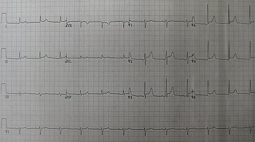
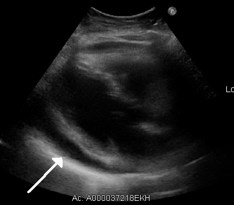

# PERICARDITE E DOENÇAS DO PERICÁRDIO

O pericárdio não é apenas um "saco" que envolve o coração. Ele é uma estrutura fibroserosa complexa que fixa o coração no mediastino, limita sua distensão súbita e serve como barreira contra infecções. Quando ele adoece, o estudante de medicina costuma se desesperar com a sopa de letrinhas: ST, PR, Beck, Kussmaul, Dressler.

Nesta aula, vamos organizar esse caos. Como seu professor, meu papel é mostrar que a lógica por trás de cada sinal clínico é o que vai fazer você acertar a questão, mesmo que esqueça o nome do epônimo.

*Figura 1 - Eletrocardiograma (ECG) de pericardite aguda: supradesnivelamento difuso do segmento ST com infradesnivelamento do intervalo PR. Fonte: James Heilman, MD, CC BY-SA 3.0 | Wikimedia Commons*

## Fisiopatologia: O Conceito da "Caixa Rígida"

Para entender as doenças do pericárdio, você precisa entender a **curva de pressão-volume**. O pericárdio parietal é composto majoritariamente por colágeno. Ele tem uma complacência limitada.

Se o líquido se acumula lentamente (como no hipotireoidismo), o pericárdio se expande e suporta até 2 litros sem grandes dramas. Mas, se o acúmulo é súbito (como num trauma ou ruptura cardíaca pós-IAM), meros 150-200 ml podem elevar a pressão intrapericárdica acima da pressão de enchimento das câmaras direitas.

**Por que isso importa?** Porque é aqui que nasce o **Tamponamento Cardíaco**. O coração é comprimido, o enchimento diastólico cai, o débito cardíaco despenca e o paciente entra em choque obstrutivo. Guarde isso: no tamponamento, o problema é a *velocidade* de acúmulo, não apenas o volume.

## Pericardite Aguda

A pericardite aguda é a inflamação dos folhetos pericárdicos. Na prática brasileira e nas provas, a causa mais comum é a **viral/idiopática**, frequentemente precedida por quadro respiratório ou gastrointestinal. A diretriz ESC 2025 passou a integrar miocardite e pericardite no conceito de **síndrome miopericárdica inflamatória (IMPS)**, porque essas entidades podem se sobrepor e exigem raciocínio por apresentação, gravidade e imagem.

### Critérios Diagnósticos: do “2 de 4” à visão ESC 2025

A regra clássica ainda é muito cobrada: pericardite aguda é provável quando há **pelo menos 2 dos 4 critérios tradicionais**:

- **Dor torácica típica:** pleurítica, piora em decúbito, melhora ao sentar/inclinar o tronco para frente.

- **Atrito pericárdico:** ruído superficial em “ranger de couro”, melhor com paciente inclinado para frente.

- **ECG típico:** supradesnivelamento difuso de ST e/ou infradesnivelamento de PR.

- **Derrame pericárdico:** novo ou piora de derrame prévio no ecocardiograma.

A atualização importante é que a ESC 2025 reforça uma abordagem mais multimodal. Em linguagem prática: o diagnóstico fica mais robusto quando há **quadro clínico compatível** associado a evidência objetiva de inflamação pericárdica, como:

- atrito pericárdico;

- ECG típico;

- **PCR/VHS elevados**;

- derrame pericárdico novo ou aumentado;

- **ressonância cardíaca (CMR)** com edema pericárdico e/ou realce tardio (LGE), útil quando o caso é duvidoso, recorrente, refratário ou com suspeita de miocardite associada.

> Para prova: se a questão for tradicional, use “2 de 4”. Se a questão mencionar ESC 2025, CMR, PCR ou sobreposição com miocardite, lembre do conceito de **IMPS** e da valorização da imagem multimodal.

### Quando pensar em miopericardite/miocardite associada?

Suspeite de envolvimento miocárdico quando houver:

- troponina elevada;

- disfunção ventricular ou alteração segmentar no eco;

- arritmias, síncope, bloqueios ou palpitações importantes;

- dor torácica com quadro viral recente e CMR compatível;

- insuficiência cardíaca, choque ou instabilidade elétrica.

A ESC 2025 dá papel central à **ressonância cardíaca**. Para miocardite, a CMR usa critérios de Lake Louise atualizados, combinando anormalidades baseadas em T1 e T2. A biópsia endomiocárdica fica reservada para apresentações de maior risco: choque, insuficiência cardíaca aguda, arritmias malignas, bloqueios avançados, FEVE muito reduzida, suspeita de etiologia específica ou ausência de resposta ao tratamento.

### O Eletrocardiograma: A Evolução em 4 Estágios

As bancas amam o ECG da pericardite porque ele é o principal diagnóstico diferencial do Infarto Agudo do Miocárdio (IAM). No MedEvo, sempre batemos na tecla: o ST da pericardite é “feliz” (côncavo), enquanto o do IAM é “triste” (convexo).

- **Estágio I (horas a dias):** supradesnivelamento de ST difuso (exceto aVR e V1) com concavidade superior. **O achado mais específico é o infradesnivelamento do PR**, refletindo inflamação atrial.

- **Estágio II (dias):** normalização do ST e do PR.

- **Estágio III (semanas):** inversão generalizada da onda T.

- **Estágio IV (meses):** normalização total do ECG.

| Característica | Pericardite Aguda | IAM com Supra de ST |
| --- | --- | --- |
| **Morfologia do ST** | Côncava (“feliz”) | Convexa (“triste”) |
| **Distribuição** | Difusa, não respeita território arterial | Localizada, respeita parede/território |
| **Segmento PR** | Infradesnivelado | Geralmente normal |
| **Imagem em espelho** | Ausente, exceto aVR/V1 | Frequente |
| **Ondas Q** | Ausentes | Podem surgir |
| **Troponina** | Normal na pericardite isolada; pode subir na miopericardite | Geralmente elevada |

*Figura 2 - Ecocardiograma demonstrando derrame pericárdico volumoso (espaço anecoico ao redor do coração). Fonte: James Heilman, MD, CC BY-SA 3.0 | Wikimedia Commons*

### Sinais de alto risco: quem interna/investiga mais?

Internação e investigação etiológica ampliada são indicadas se houver:

- febre > 38°C;

- início subagudo;

- derrame volumoso ou tamponamento;

- imunossupressão;

- trauma;

- anticoagulação;

- suspeita de etiologia bacteriana, tuberculosa, neoplásica ou autoimune;

- falha após cerca de 7 dias de AINE;

- sinais de miocardite complicada: FEVE < 50%, insuficiência cardíaca, arritmias ventriculares, bloqueios avançados ou choque.

## Tratamento Farmacológico

Aqui o erro comum é esquecer a **colchicina**. Ela não é apenas para gota: na pericardite, reduz sintomas e principalmente reduz recorrência.

### Primeira linha: AINE/AAS + colchicina

- **AINEs ou AAS:** primeira linha.

- Ibuprofeno: 600-800 mg a cada 8h por 1-2 semanas, com retirada gradual conforme sintomas e PCR.

- AAS: 750-1000 mg a cada 8h por 1-2 semanas; preferencial se o paciente teve IAM recente.

- **Colchicina:**

- 0,5 mg/dia se < 70 kg;

- 0,5 mg 12/12h se ≥ 70 kg;

- por **3 meses** na primeira crise;

- em pericardite recorrente, geralmente por **6 meses ou mais**, guiado por remissão clínica e inflamatória.

> Dica prática: idealmente, não suspenda tratamento só porque a dor melhorou. A PCR ajuda a guiar resolução inflamatória e retirada gradual.

### Corticoide: segunda linha, não atalho

- **Prednisona em baixa a moderada dose** pode ser usada se houver contraindicação/falha de AINE ou etiologia específica, como doença autoimune.

- Evite corticoide precoce e em dose alta em pericardite viral/idiopática simples: aumenta risco de recorrência e dependência.

- Se usado, retirar lentamente e sempre que possível manter colchicina.

### Atualização ESC 2025: anti-IL-1 na pericardite recorrente/refratária

A grande novidade terapêutica é a valorização dos **inibidores de interleucina-1 (anti-IL-1)** para pericardite **recorrente ou incessante** com evidência de inflamação, especialmente quando há:

- falha de AINE/AAS + colchicina;

- intolerância ou contraindicação ao tratamento convencional;

- dependência ou necessidade recorrente de corticoide;

- PCR elevada ou evidência objetiva de inflamação pericárdica.

Principais exemplos:

- **Anakinra**: antagonista do receptor de IL-1, uso diário subcutâneo.

- **Rilonacept**: bloqueador de IL-1α/IL-1β, uso semanal subcutâneo.

Esses fármacos reduzem recorrências e ajudam a retirar corticoide, mas são terapia especializada, geralmente para cardiologia/reumatologia e casos difíceis. Para prova, pense: **recorrente/refratária + inflamação persistente + corticodependência → considerar anti-IL-1**.

### Situações especiais

- **Pericardite urêmica/DRC avançada:** o tratamento de escolha é **iniciar ou intensificar hemodiálise**; AINEs podem ser perigosos.

- **Pós-IAM recente:** prefira **AAS** em vez de outros AINEs.

- **Suspeita bacteriana/tuberculosa/neoplásica:** não trate como idiopática simples; investigar etiologia e colher material quando indicado.

- **Miocardite associada:** evite exercício, estratifique risco, avalie CMR/troponina/eco e individualize retorno às atividades.

**Fontes de atualização:** ESC 2025 para miocardite/pericardite, editorial da Revista Española de Cardiología sobre a diretriz ESC 2025, consenso ACC 2025 de pericardite e diretriz SBC para miocardites/pericardites.

## Tamponamento Cardíaco

O tamponamento é uma emergência médica. O diagnóstico é **CLÍNICO**. Não espere o eco se o paciente está chocado.

### A Tríade de Beck

Clássica de prova, mas presente em apenas 1/3 dos casos reais:

- **Hipotensão Arterial** (baixo débito).

- **Bulhas Abafadas/Hipofonéticas** (o líquido isola o som).

- **Turgência Jugular** (o sangue não consegue entrar no átrio direito).

### Pulso Paradoxal

Este conceito cai muito. **O que é?** É uma queda exagerada (> 10 mmHg) da pressão arterial sistólica durante a inspiração.
**Por que acontece?** Na inspiração, o retorno venoso para o ventrículo direito (VD) aumenta. Como o pericárdio está "apertado" pelo líquido, o VD só consegue se expandir empurrando o septo interventricular para a esquerda. Isso reduz o volume do ventrículo esquerdo (VE), diminuindo o volume de ejeção e a pressão sistólica.

### Achados no ECG e Imagem

- **ECG:** Baixa voltagem do QRS (o líquido bloqueia a condução elétrica) e **Alternância Elétrica** (o coração "balança" dentro do líquido, mudando o eixo do QRS a cada batimento).

- **Raio-X:** Coração em "moringa" ou "cantil" (só aparece em derrames lentos e volumosos).

- **Ecocardiograma:** Colapso diastólico do VD (achado precoce) e do átrio direito. Veia cava inferior dilatada e sem variação respiratória.

**Conduta:** Pericardiocentese de alívio imediata. Se for hemopericárdio por trauma ou ruptura, a conduta é cirúrgica (janela pericárdica ou toracotomia).

## Pericardite Constritiva

Imagine que o pericárdio virou uma "carapaça" de gesso. Isso é a constrição. No Brasil, a causa histórica importante é a **Tuberculose**, embora a maioria hoje seja idiopática ou pós-cirúrgica.

### Quadro Clínico

O paciente se apresenta como uma **Insuficiência Cardíaca Direita isolada**:

- Edema de membros inferiores, ascite volumosa, hepatomegalia congestiva.

- **Sinal de Kussmaul:** Aumento da turgência jugular na inspiração (o oposto do normal). Por que? Porque o átrio direito não consegue acomodar o aumento do retorno venoso inspiratório devido à carapaça rígida.

- **Sinal de Broadbent:** Retração sistólica das costelas 11ª e 12ª (raro, mas cai).

- **Knock Pericárdico (Estalido):** Um som diastólico precoce logo após a B2, causado pela parada súbita do enchimento ventricular quando ele atinge o limite da carapaça.

### Diagnóstico Diferencial: Constritiva vs. Restritiva

Essa é a "questão difícil" da prova.

- Na **Constritiva**, o problema é o pericárdio (fora do músculo). O tratamento é cirúrgico (**Pericardiectomia**).

- Na **Restritiva** (ex: Amiloidose), o problema é o próprio músculo cardíaco.

- **O "pulo do gato":** No eco, a constrição apresenta **interdependência ventricular acentuada** (o septo se move conforme a respiração). Na restritiva, não.

## Etiologias Específicas e Pérolas Clínicas

### 1. Pericardite Tuberculosa

Comum em áreas endêmicas e pacientes HIV+. Evolui em 3 estágios:

- **Efusivo:** Derrame exsudativo, febre, suores noturnos.

- **Efusivo-Constritivo:** O líquido ainda está lá, mas a carapaça já começou a apertar.

- **Constritivo:** Fibrose e calcificação total.

**Diagnóstico:** Análise do líquido pericárdico. **ADA > 40 U/L** tem alta sensibilidade. O tratamento é o esquema RIPE + Corticoide (para reduzir o risco de constrição).

### 2. Síndrome de Dressler e Pós-Pericardiotomia

- **Pericardite Epistenocárdica:** Ocorre nos primeiros 2-3 dias pós-IAM por contiguidade. Tratamento: AAS em doses altas.

- **Síndrome de Dressler:** Ocorre 2-6 semanas pós-IAM. É autoimune. Febre, pleurite e pericardite. Tratamento: AAS + Colchicina.

- **Síndrome Pós-Pericardiotomia:** Mesma lógica do Dressler, mas após cirurgia cardíaca.

### 3. Febre Reumática

A pericardite faz parte da **Pancardite** reumática.

- **Critérios de Jones (Maiores):** Cardite, Artrite (poliartrite migratória), Coreia de Sydenham, Nódulos subcutâneos e **Eritema Marginado**.

- No ECG, o achado clássico da fase aguda é o **prolongamento do intervalo PR** (BAV de 1º grau).

### 4. Quilopericárdio

Acúmulo de quilo (linfa) no pericárdio. Causa: trauma do ducto torácico, cirurgia ou obstrução linfática por neoplasia.
**Diagnóstico:** Líquido leitoso com **triglicérides > 500 mg/dL** e presença de quilomícrons.

## Tabelas Comparativas para Revisão Rápida

### Tabela 1: Diagnóstico Diferencial de Dor Torácica

| Característica | Pericardite | IAM | Embolia Pulmonar |
| --- | --- | --- | --- |
| **Início** | Gradual | Súbito | Súbito |
| **Fator de Melhora** | Inclinar para frente | Nitrato (parcial) | Repouso (mínimo) |
| **ECG** | Supra ST difuso + Infra PR | Supra ST localizado | S1Q3T3 / Taquicardia |
| **Marcadores** | Troponina pode subir (Miopericardite) | Troponina sobe muito | Dímero-D / Troponina |

### Tabela 2: Pressões e Sinais Hemodinâmicos

| Condição | Pulso Paradoxal | Sinal de Kussmaul | Descenso 'y' no PVJ |
| --- | --- | --- | --- |
| **Tamponamento** | Presente (Marcante) | Ausente | Ausente/Reduzido |
| **Constrição** | Pode estar presente | Presente (Clássico) | Proeminente e Rápido |
| **Restrição** | Raro | Presente | Proeminente |

## Pontos-Chave para Prova

- **Critérios de Pericardite:** 2 de 4 (Dor pleurítica, Atrito, ECG com ST/PR, Derrame no Eco).

- **ECG da Pericardite:** Supradesnivelamento de ST **côncavo** e difuso + **Infradesnivelamento de PR** (achado mais específico).

- **Tratamento Padrão:** AINE (ou AAS) + Colchicina por 3 meses.

- **Contraindicação de AINE:** Evite em pacientes com DRC (use diálise ou corticoide) e em pós-IAM imediato (use apenas AAS).

- **Tríade de Beck:** Hipotensão + Bulhas abafadas + Estase jugular (Tamponamento).

- **Pulso Paradoxal:** Queda da PAS > 10 mmHg na inspiração. Típico de tamponamento, mas também ocorre em asma grave e DPOC.

- **Sinal de Kussmaul:** Turgência jugular que aumenta na inspiração. Típico de Pericardite Constritiva e Infarto de VD.

- **Pericardite Urêmica:** Indicação clássica de início ou intensificação de hemodiálise.

- **Tuberculose Pericárdica:** Suspeite em casos de derrame crônico e ADA > 40 no líquido.

- **Alternância Elétrica:** Patognomônico de grande derrame pericárdico/tamponamento.

- **Síndrome de Dressler:** Pericardite autoimune semanas após o IAM.

- **O que NÃO fazer:** Não use anticoagulantes em pacientes com pericardite aguda pelo risco de transformar um derrame seroso em hemopericárdio e tamponamento.

- **Internação:** Indicada se febre > 38°C, início subagudo, derrame grande (> 20mm), tamponamento ou falha de AINE após 7 dias. 💡

Como sempre reforçamos no MedEvo, o segredo das doenças pericárdicas é visualizar o que está acontecendo mecanicamente com o coração. Se você entende que o tamponamento é um problema de "espaço súbito" e a constrição é um problema de "carapaça rígida", os sinais clínicos deixam de ser decoreba e passam a ser óbvios.

 Cópia offline para consulta pessoal.
 Fonte original:
 [https://www.medevo.com.br/material-apoio/ler/c7db3a84-4975-40c6-99a8-ab84ce3dd2b2](https://www.medevo.com.br/material-apoio/ler/c7db3a84-4975-40c6-99a8-ab84ce3dd2b2)
