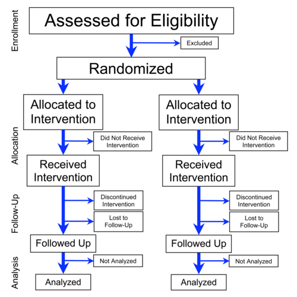
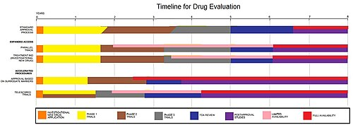

# PESQUISA CLÍNICA E FASES DE ESTUDOS

## Introdução à Pesquisa Clínica

- A pesquisa clínica marca a transição da **observação** para a **intervenção** na natureza, onde o pesquisador controla a exposição (ex: quem recebe o tratamento).

- Essa intervenção permite estabelecer **causalidade** com maior segurança, superando as limitações dos estudos observacionais que apenas identificam associações.

*Figura 1 - Fluxograma CONSORT mostrando as fases de um ensaio clínico randomizado paralelo: recrutamento, alocação, seguimento e análise. Fonte: PrevMedFellow, CC BY-SA 3.0 | Wikimedia Commons*

## Ensaio Clínico Randomizado (ECR): O Padrão-Ouro

- O **Ensaio Clínico Randomizado (ECR)** é o desenho de estudo de maior nível de evidência para testar a eficácia de intervenções (drogas, vacinas, procedimentos).

- É um estudo **longitudinal e prospectivo**, partindo da intervenção em direção ao desfecho, combatendo o acaso, o viés e o confundimento.

### A Randomização: O Coração do Estudo

- **Objetivo:** Garantir a **comparabilidade** entre os grupos (intervenção e controle) no início do estudo.

- **Mecanismo:** Distribui de forma equilibrada variáveis conhecidas (idade, sexo) e desconhecidas (genética, microbiota), minimizando o **viés de seleção**.

- **Princípio da Intercambialidade:** Se os grupos são comparáveis no início e diferem no final, a diferença é atribuída à intervenção.

> 💡 **Macete:** Em amostras pequenas, a randomização simples pode, por azar, gerar grupos desequilibrados. Em grandes ensaios, ela é a ferramenta definitiva para comparabilidade.

### O Cegamento (Mascaramento)

- **Objetivo:** Evitar o **viés de aferição (ou informação)**, que ocorre quando o conhecimento da alocação do grupo influencia a avaliação dos desfechos.

- **Tipos de Cegamento:**

- **Aberto:** Todos sabem a alocação (comum em cirurgias ou mudanças de estilo de vida).

- **Simples-cego:** O paciente não sabe, mas o pesquisador/equipe sabe.

- **Duplo-cego:** Nem o paciente nem o pesquisador/equipe sabem a alocação. É o padrão-ouro para desfechos subjetivos (dor, humor).

- **Triplo-cego:** Paciente, pesquisador e o estatístico que analisa os dados não sabem a alocação.

> 💡 **Dica do Dr. Will:** O cegamento é crucial para desfechos subjetivos. Para desfechos objetivos (morte, exames laboratoriais), é menos crítico, mas ainda desejável.

*Figura 2 - Processo de avaliação e aprovação de fármacos, mostrando as fases da pesquisa clínica desde a descoberta até a comercialização. Fonte: Kernsters, CC BY-SA 3.0 | Wikimedia Commons*

## Fases da Pesquisa Clínica: A Jornada do Fármaco

- A aprovação de um medicamento segue um funil rigoroso de fases, cada uma com objetivos específicos.

### Fase Pré-Clínica

- **População:** Estudos *in vitro* (células) e *in vivo* (modelos animais).

- **Objetivo:** Avaliar segurança básica, toxicidade aguda, potencial carcinogênico e teratogênico antes do contato com humanos.

### Fase I: Segurança e Farmacocinética

- **População:** Pequeno número de **voluntários saudáveis** (20-80 pessoas). Exceção: drogas oncológicas podem iniciar em pacientes com a doença.

- **Objetivo:** Avaliar **segurança**, tolerabilidade, farmacocinética (absorção, distribuição, metabolismo, excreção) e farmacodinâmica (efeitos no organismo). Determinar a dose máxima tolerada.

- **Foco em Eficácia?** Não. O sucesso é a ausência de efeitos colaterais graves.

### Fase II: Eficácia Preliminar e Dose-Resposta

- **População:** Número limitado de **pacientes com a doença** (100-300 pessoas).

- **Objetivo:** Obter um sinal de **eficácia preliminar**, definir a **dose ideal** para estudos maiores e continuar avaliando a segurança.

### Fase III: O Teste Definitivo (Eficácia em Larga Escala)

- **População:** Grande número de **pacientes com a doença** (1.000-5.000 ou mais), em estudos multicêntricos.

- **Objetivo:** **Confirmar a eficácia** e segurança em larga escala, comparando a nova intervenção com o tratamento padrão-ouro ou placebo.

- **Resultado:** Resultados positivos desta fase são a base para o **registro sanitário** (ANVISA, FDA).

### Fase IV: Farmacovigilância e Mundo Real

- **População:** **População geral** após a comercialização do medicamento.

- **Objetivo:** Monitorar **efeitos adversos raros** ou de longo prazo que não foram detectados nas fases anteriores devido ao tamanho da amostra ou tempo de seguimento. Avalia a **efetividade** no mundo real.

| Fase | População | Objetivo Principal | Foco em Eficácia? |
| --- | --- | --- | --- |
| **Pré-Clínica** | Células/Animais | Segurança básica, toxicidade | Não |
| **I** | Voluntários Sadios | Segurança, Farmacocinética | Não |
| **II** | Pacientes (poucos) | Eficácia Preliminar, Dose-Resposta | Preliminar |
| **III** | Pacientes (muitos) | Eficácia e Segurança (Comparativo) | Sim (Padrão-ouro) |
| **IV** | População Geral | Farmacovigilância, Efeitos raros | Sim (Efetividade) |

## Conceitos Metodológicos Essenciais

### Eficácia vs. Efetividade vs. Eficiência

- **Eficácia:** Resultado em **condições ideais** e controladas (medida na Fase III).

- **Efetividade:** Resultado em **condições do mundo real** (observada na Fase IV).

- **Eficiência:** Relação **custo-benefício** da intervenção para o sistema de saúde.

### Análise por Intenção de Tratar (ITT) vs. Por Protocolo

- **Análise por Intenção de Tratar (ITT):** Analisa todos os participantes no grupo em que foram randomizados, independentemente de terem completado o tratamento ou mudado de grupo.

- **Vantagem:** Preserva a randomização, minimiza viés e reflete melhor a efetividade no mundo real. É a forma mais correta de manter a validade interna.

- **Análise Por Protocolo:** Inclui apenas os participantes que completaram o estudo conforme o protocolo.

- **Desvantagem:** Pode superestimar o benefício da droga e introduzir viés de seleção.

### O Estudo Crossover (Cruzado)

- **Desenho:** O paciente serve como seu próprio controle, recebendo sequencialmente a intervenção e o controle (ou outra intervenção), com um período de *washout* entre elas.

- **Vantagem:** Reduz a variabilidade entre indivíduos, necessitando de menos participantes.

- **Desvantagem:** Apropriado apenas para doenças crônicas e estáveis, onde a condição não se altera significativamente e o efeito da primeira intervenção é reversível.

### Vieses: As Armadilhas da Pesquisa

- **Viés:** Erro sistemático que distorce os resultados de um estudo.

- **Tipos Principais:**

- **Viés de Seleção:** Grupos não são comparáveis no início. **Antídoto:** Randomização.

- **Viés de Aferição (ou Informação):** Desfecho medido de forma diferente entre os grupos. **Antídoto:** Cegamento.

- **Viés de Confundimento:** Uma terceira variável (fator de confusão) está associada tanto à exposição quanto ao desfecho. **Antídoto:** Randomização, estratificação, análise multivariada.

## Ética na Pesquisa Clínica

- No Brasil, a pesquisa com seres humanos é regida pela **Resolução CNS 466/12**.

- **Princípios Fundamentais:**

- **Autonomia:** Consentimento Livre e Esclarecido (TCLE) e direito de retirada a qualquer momento.

- **Beneficência e Não-Maleficência:** O benefício esperado deve justificar o risco mínimo.

- **Justiça e Equidade:** Benefícios da pesquisa devem ser acessíveis à população estudada.

- **Uso de Placebo:** Ético apenas se não houver tratamento eficaz comprovado para a condição. Caso contrário, deve-se comparar com o tratamento padrão-ouro (controle ativo).

## Análise de Desfechos: O que realmente importa?

- **Desfecho Substituto (Surrogate):** Medida laboratorial ou sinal físico que se *acredita* predizer um desfecho clínico importante (ex: baixar LDL, reduzir pressão arterial).

- **Desfecho Duro (Hard Outcome):** Evento clínico que realmente importa para o paciente (ex: morte, infarto, AVC, necessidade de hemodiálise).

- **Importância:** Estudos focados em desfechos duros fornecem o nível máximo de evidência para conduta clínica, pois desfechos substitutos podem não se traduzir em benefícios reais ao paciente.

## 📌 Pontos-Chave para Prova

- **ECR:** Padrão-ouro para testar eficácia de intervenções, longitudinal e prospectivo.

- **Randomização:** Garante comparabilidade dos grupos, minimiza viés de seleção, distribui confounders.

- **Cegamento:** Evita viés de aferição/informação, essencial para desfechos subjetivos. Duplo-cego é o ideal.

- **Fase I:** Segurança, farmacocinética, voluntários sadios (poucos). Não avalia eficácia.

- **Fase II:** Eficácia preliminar, dose-resposta, pacientes (número limitado).

- **Fase III:** Eficácia definitiva, segurança em larga escala, base para registro sanitário.

- **Fase IV:** Farmacovigilância, efeitos raros/longo prazo, efetividade no mundo real.

- **ITT:** Analisa todos os randomizados, preserva a randomização, mantém validade interna.

- **Eficácia vs. Efetividade:** Eficácia (ideal, Fase III); Efetividade (real, Fase IV).

- **Estudo Crossover:** Paciente é o próprio controle, para doenças crônicas estáveis, exige *washout*.

- **Vieses:** Seleção (randomização), Aferição (cegamento), Confundimento (randomização/estratificação).

- **Ética:** Resolução CNS 466/12; placebo só se não houver tratamento eficaz.

- **Desfechos:** Duros (morte, infarto) são superiores a substitutos (LDL, PA) para evidência clínica.

 Cópia offline para consulta pessoal.
 Fonte original:
 [https://www.medevo.com.br/material-apoio/ler/3dd3ab4a-0c13-4461-800e-afa3ff6c4913](https://www.medevo.com.br/material-apoio/ler/3dd3ab4a-0c13-4461-800e-afa3ff6c4913)
