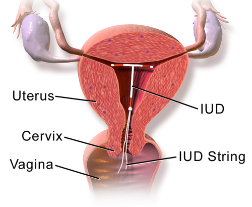
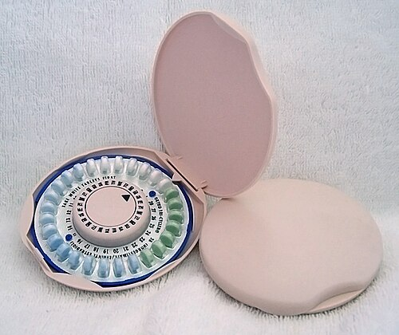

# PLANEJAMENTO FAMILIAR

O planejamento familiar não é apenas sobre evitar uma gravidez. Para a prova de residência e para a sua vida prática na Unidade Básica de Saúde (UBS), você precisa entender que ele é um conjunto de ações de regulação da fertilidade que garante direitos iguais de constituição, limitação ou aumento da prole. No Brasil, isso é regido pela Constituição Federal e pela Lei 9.263/1996.

Quando falamos em Planejamento Familiar no SUS, estamos falando de **Integralidade**. O Programa de Assistência Integral à Saúde da Mulher (PAISM) foi um marco porque parou de olhar apenas para o "ciclo gravídico puerperal" e passou a enxergar a mulher em todas as suas fases, da adolescência à senescência.

*Figura 1 - Ilustração de um dispositivo intrauterino (DIU) posicionado no útero, um dos métodos contraceptivos reversíveis de longa duração (LARC). Fonte: BruceBlaus, CC BY 3.0 | Wikimedia Commons*

## A Base Legal: Lei 9.263/1996 e as Atualizações Recentes

Este é o tópico que mais sofreu alterações e que as bancas estão "sedentas" para cobrar. Esqueça o que você aprendeu há três anos. A Lei 14.443/2022 trouxe mudanças fundamentais que entraram em vigor em março de 2023.

### Esterilização Voluntária (Laqueadura e Vasectomia)

Para que uma pessoa possa realizar a esterilização voluntária no Brasil, os critérios atuais são:

- **Capacidade civil plena e idade:** Ter, no mínimo, 21 anos de idade OU, pelo menos, dois filhos vivos (independentemente da idade).

- **Prazo de reflexão:** É obrigatório um prazo de 60 dias entre a manifestação da vontade e o ato cirúrgico. Esse tempo serve para aconselhamento e tentativa de uso de outros métodos.

- **Consentimento do cônjuge:** **NÃO É MAIS NECESSÁRIO**. Esta foi a maior mudança. A autonomia sobre o próprio corpo agora é plena, sem necessidade de assinatura de parceiro ou parceira.

- **Esterilização durante o parto:** A nova lei permite a laqueadura durante o período de parto, desde que observados o prazo de 60 dias de antecedência e as condições clínicas.

Cuidado com a pegadinha: a lei proíbe a esterilização cirúrgica em menores de 21 anos que não tenham dois filhos vivos, exceto em casos de risco à vida ou à saúde da mulher ou do futuro concepto, testemunhado em relatório escrito e assinado por dois médicos.

### O Papel do Médico e o Sigilo

Muitos alunos erram questões sobre a esterilização de pessoas "absolutamente incapazes". Nestes casos, a esterilização só pode ocorrer com **autorização judicial**, mediante processo específico. Não basta a vontade dos pais ou tutores.

No cotidiano da MedEvo, sempre reforçamos: o planejamento familiar é uma escolha informada. O médico não "dá" a laqueadura, ele oferece o método após garantir que a paciente compreendeu a irreversibilidade (potencial) e as alternativas.

## Eficácia dos Métodos: O Índice de Pearl

Como saber se um método é bom? Usamos o Índice de Pearl. Ele representa o número de gestações não planejadas que ocorreriam em um grupo de 100 mulheres utilizando o método durante um ano.

- **Quanto menor o Índice de Pearl, maior a eficácia do método.**

Aqui entra o conceito de **LARC (Long-Acting Reversible Contraception)**, ou métodos reversíveis de longa duração. São eles: DIU de cobre, DIU hormonal (Mirena/Kyleena) e o implante de etonogestrel.

Por que os LARCs são os "queridinhos" das diretrizes atuais, inclusive para adolescentes? Porque eles não dependem da memória da paciente. O implante de etonogestrel, por exemplo, tem um Índice de Pearl menor que o da própria laqueadura tubária (0,05% vs 0,5%). Isso cai muito em prova: "Qual o método mais eficaz disponível?". Resposta: Implante subdérmico.

| Método | Eficácia (Uso Perfeito) | Eficácia (Uso Típico) |
| --- | --- | --- |
| Implante de Etonogestrel | 0,05% | 0,05% |
| Vasectomia | 0,1% | 0,15% |
| DIU Hormonal (Mirena) | 0,2% | 0,2% |
| Laqueadura Tubária | 0,5% | 0,5% |
| DIU de Cobre | 0,6% | 0,8% |
| Injetável Trimestral | 0,2% | 6% |
| Pílula Combinada | 0,3% | 9% |
| Preservativo Masculino | 2% | 18% |

Observe a diferença abismal entre o uso perfeito e o uso típico da pílula. É por isso que, na saúde pública, priorizamos os LARCs para reduzir a taxa de gravidez indesejada.

## Critérios de Elegibilidade da OMS (MEC)

Este é o coração da parte clínica. A Organização Mundial da Saúde (OMS) classifica as condições médicas em quatro categorias para cada método contraceptivo. Você precisa decorar o significado das categorias, não apenas os números.

- **Categoria 1:** Sem restrição de uso. O método pode ser usado em qualquer circunstância.

- **Categoria 2:** As vantagens superam os riscos comprovados ou teóricos. Pode usar, mas requer um acompanhamento mais próximo.

- **Categoria 3:** Os riscos superam as vantagens. O método não é recomendado, a menos que outros métodos não estejam disponíveis ou sejam inaceitáveis. (É uma contraindicação relativa forte).

- **Categoria 4:** **Contraindicação absoluta**. O método representa um risco inaceitável à saúde.

### Contraindicações Absolutas (Categoria 4) para Anticoncepcionais Combinados (ACO)

As bancas amam testar se você sabe quando o estrogênio é o "vilão". O estrogênio aumenta a síntese de fatores de coagulação no fígado, elevando o risco trombótico.

- Amamentação < 6 semanas pós-parto.

- Fumantes com ≥ 35 anos e que fumam ≥ 15 cigarros/dia.

- Hipertensão grave (PAS ≥ 160 ou PAD ≥ 100).

- História atual ou pregressa de TVP/EP.

- Cirurgia de grande porte com imobilização prolongada.

- Enxaqueca **com aura** (em qualquer idade).

- Câncer de mama atual.

- Lúpus Eritematoso Sistêmico com anticorpos antifosfolípides positivos ou desconhecidos.

- Hepatite viral aguda ou cirrose descompensada.

**Exemplo Clínico:** Paciente de 28 anos, nulípara, com enxaqueca com aura visual. Ela quer começar a tomar pílula. Qual a conduta?
Você **jamais** prescreverá um método combinado (estrogênio + progesterona). Para ela, o estrogênio é Categoria 4 pelo risco aumentado de AVC isquêmico. As opções seriam métodos de progesterona isolada (pílula, injetável, implante) ou DIU.

*Figura 2 - Cartela de anticoncepcional oral combinado (pílula), um dos métodos hormonais mais utilizados no planejamento familiar. Fonte: Domínio Público | Wikimedia Commons*

## Métodos Hormonais: Entendendo o Funcionamento

Para explicar para sua paciente (e responder questões de fisiopatologia), você deve saber que o principal mecanismo dos métodos combinados é a **anovulação**.

O estrogênio inibe o FSH (bloqueando o recrutamento folicular) e a progesterona inibe o LH (bloqueando o pico que causa a ovulação). Além disso, a progesterona altera o muco cervical, tornando-o hostil ao espermatozoide, e atrofia o endométrio.

### Anticoncepcionais Orais Combinados (ACO)

Além da contracepção, eles oferecem benefícios não contraceptivos que as provas adoram:

- Redução do risco de câncer de ovário e de endométrio (efeito protetor que dura anos após a interrupção).

- Melhora da dismenorreia e do fluxo menstrual intenso.

- Controle da acne e do hirsutismo (especialmente os que contêm ciproterona ou drospirenona).

**Cuidado:** O ACO aumenta levemente o risco de câncer de colo uterino (provavelmente por maior exposição ao HPV e tempo de uso) e de câncer de mama enquanto em uso.

### Métodos de Progesterona Isolada

São a escolha para mulheres que estão amamentando ou que têm contraindicação ao estrogênio.

- **Minipílula:** Exige rigor de horário (janela de apenas 3 horas, exceto a de desogestrel que é de 12h).

- **Injetável Trimestral (Medroxiprogesterona):** Pode causar ganho de peso e demora no retorno à fertilidade (até 1 ano). É Categoria 2 para adolescentes pelo risco teórico de redução da densidade mineral óssea, mas na prática é muito utilizado.

## Dispositivos Intrauterinos (DIU)

O DIU é um dos métodos mais custo-efetivos do SUS.

### DIU de Cobre

- **Mecanismo:** Ação inflamatória estéril e citotóxica para espermatozoides e óvulo. Não é abortivo.

- **Duração:** 10 anos.

- **Efeitos colaterais:** Pode aumentar o fluxo menstrual e a dismenorreia.

- **Contraindicações:** Malformações uterinas que distorçam a cavidade, DIP atual, câncer de colo ou endométrio atual.

### DIU Hormonal (SIU-LNG / Mirena)

- **Mecanismo:** Liberação local de levonorgestrel, promovendo atrofia endometrial e espessamento do muco cervical.

- **Duração:** 5 anos (algumas diretrizes já falam em 7-8 anos, mas para prova siga a bula/MS: 5 anos).

- **Vantagem:** Frequentemente causa amenorreia ou redução drástica do fluxo, sendo excelente para quem tem menorragia.

**Pegadinha de Prova:** Nuliparidade NÃO é contraindicação para o uso de DIU. Adolescentes podem e devem usar se desejarem. O risco de DIP está relacionado ao comportamento sexual (ISTs) e não ao dispositivo em si, exceto nos primeiros 20 dias após a inserção por contaminação do procedimento.

## Contracepção de Emergência

A famosa "pílula do dia seguinte". O esquema preferencial é o **Levonorgestrel 1,5mg** em dose única.

- **Quando usar:** Relação sexual desprotegida, falha do método (camisinha estourou) ou violência sexual.

- **Prazo:** Até 5 dias (120 horas), mas a eficácia é muito maior se usada nas primeiras 72 horas.

- **Mecanismo:** Ela age retardando ou inibindo a ovulação. Se a ovulação já ocorreu, ela não tem efeito. **Não é abortiva**.

- **Efeito colateral mais comum:** Náuseas e vômitos. Se a paciente vomitar em até 2 horas após a ingestão, deve repetir a dose.

Lembre-se: o uso de indutores enzimáticos (como rifampicina, carbamazepina, fenitoína) diminui a eficácia da contracepção de emergência. Nesses casos, a dose de levonorgestrel deve ser dobrada (3,0mg).

## Planejamento Familiar na Adolescência

Este tema cai muito em Medicina Preventiva e Ética Médica. O adolescente tem direito ao sigilo e à autonomia.

Segundo o Código de Ética Médica e o ECA:

- O médico pode atender o adolescente desacompanhado.

- O médico **não deve** contar aos pais sobre a vida sexual ou prescrição de métodos anticoncepcionais, desde que o adolescente tenha capacidade de discernimento e compreensão de sua saúde.

- **Exceção ao sigilo:** Quando houver risco de morte, risco de dano a terceiros ou quando o adolescente for vítima de crime (violência sexual).

A estratégia mais eficaz para prevenir a gravidez na adolescência é a educação sexual abrangente combinada com o acesso facilitado a métodos de alta eficácia (LARCs).

## Manejo na Violência Sexual

Este é um protocolo rígido que você precisa ter na ponta da língua. O atendimento deve ser humanizado, em local privativo e sem julgamentos.

### Profilaxias de Urgência (Idealmente

| Perfil da Paciente | Método de Escolha / Recomendação |
| --- | --- |
| Adolescente | LARCs (Implante ou DIU) + Preservativo (Dupla Proteção) |
| Amamentando (< 6 meses) | Métodos de progesterona isolada ou DIU de cobre |
| Hipertensa Descompensada | DIU de cobre ou métodos de progesterona isolada (evitar injetável) |
| Diabética com Vasculopatia | DIU de cobre ou métodos de progesterona isolada |
| Desejo de Amenorreia | DIU Hormonal, Implante ou Injetável Trimestral |
| Esquecida / Rotina Caótica | LARCs (DIU ou Implante) |

## Pontos-Chave para Prova

- **Lei 14.443/2022:** Idade mínima para esterilização caiu para 21 anos (ou 2 filhos). **Não precisa mais de autorização do cônjuge**.

- **Laqueadura no Parto:** Permitida se solicitada com 60 dias de antecedência.

- **Índice de Pearl:** O implante de etonogestrel é o método mais eficaz (menor índice).

- **Enxaqueca com Aura:** Contraindicação ABSOLUTA (MEC 4) para qualquer método com estrogênio.

- **Tabagismo ≥ 35 anos:** Se fumar ≥ 15 cigarros/dia, estrogênio é MEC 4. Se fumar menos, MEC 3.

- **Câncer de Mama Atual:** Contraindicação absoluta para QUALQUER método hormonal (incluindo DIU Mirena). O único permitido é o DIU de cobre.

- **Proteção contra Câncer:** ACO combinado reduz risco de câncer de ovário e endométrio.

- **Violência Sexual:** Profilaxia para HIV deve ser iniciada em até 72h (esquema TDF+3TC+DTG).

- **Aborto Legal:** Não precisa de BO nem de autorização judicial em caso de estupro.

- **Sigilo Adolescente:** É a regra. Só quebra se houver risco de vida ou crime.

- **DIU e Nuliparidade:** Pode usar sem medo. Não aumenta risco de infertilidade.

- **Amamentação:** HIV e HTLV são contraindicações absolutas no Brasil.

- **Anticoncepção de Emergência:** Não é abortiva, age antes da fecundação.

- **MEC 4 para DIU de Cobre:** Gravidez, DIP atual, câncer de colo uterino atual, malformação uterina grave.

- **Efeito Colateral Injetável Trimestral:** Ganho de peso e amenorreia (ou sangramento irregular). 💡

Ao estudar para as provas, lembre-se que as questões de Planejamento Familiar costumam misturar a ética (autonomia do adolescente), a lei (regras da laqueadura) e a clínica (critérios da OMS). Se você dominar esses três pilares, não errará nenhuma questão.

 Cópia offline para consulta pessoal.
 Fonte original:
 [https://www.medevo.com.br/material-apoio/ler/49ee260e-0f27-4f6a-8b42-d86186f23e23](https://www.medevo.com.br/material-apoio/ler/49ee260e-0f27-4f6a-8b42-d86186f23e23)
