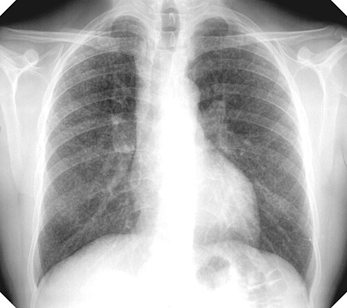
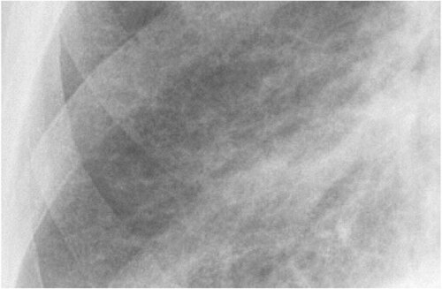

# PNEUMOCONIOSES OCUPACIONAIS

Para entender as pneumoconioses, você precisa primeiro tirar da cabeça a ideia de que elas são apenas "doenças do pulmão sujo". Como professor, vejo muitos alunos tentando decorar uma lista infinita de poeiras e indústrias, mas o segredo para acertar qualquer questão de residência é entender a interação entre a partícula inalada e a resposta imunológica do hospedeiro.

Pneumoconiose, por definição oficial, é o acúmulo de poeira nos pulmões e a reação tecidual à sua presença. Note que não é apenas "entrar poeira", é o que o corpo faz com ela. E aqui entra a primeira grande divisão que as bancas amam: as poeiras fibrogênicas (como sílica e asbesto) e as não fibrogênicas (como ferro e estanho).

*Figura 1 - Radiografia de tórax demonstrando silicose simples com opacidades nodulares difusas bilaterais, típicas da exposição ocupacional à sílica. Fonte: Gumersindorego, CC BY-SA 3.0 | Wikimedia Commons*

## Classificação e Nexo Causal

Antes de mergulharmos nas doenças específicas, precisamos falar sobre como o Ministério da Saúde e a Previdência Social enxergam essas patologias. Você certamente já ouviu falar da Classificação de Schilling. Nas pneumoconioses, lidamos majoritariamente com o Grupo I de Schilling.

O que isso significa na prática? Significa que o trabalho é causa necessária. Sem a exposição à sílica, não existe silicose. Sem o asbesto, não existe asbestose. É uma relação direta e inequívoca. Diferente, por exemplo, de uma hipertensão, onde o trabalho pode ser apenas um fator contributivo (Schilling III).

Outro ponto que o Dr. Will sempre reforça nas discussões clínicas: a diferença entre incidência e prevalência no contexto ocupacional. Em provas de Medicina Preventiva, se a questão te pede para avaliar o impacto de uma doença crônica e irreversível como a silicose em um determinado momento, ela está falando de prevalência (casos novos + antigos). Se ela quer saber o risco de novos casos surgirem após uma mudança no processo industrial, ela foca na incidência.

## Silicose: A Rainha das Provas

Se você tiver pouco tempo para estudar, foque em silicose. É a pneumoconiose mais comum no Brasil e a que mais gera "pegadinhas" em provas.

*Figura 2 - Radiografia de tórax de paciente com asbestose, classificação ILO 2/2 s/s, demonstrando opacidades intersticiais bilaterais. Fonte: DrSHaber, CC0 | Wikimedia Commons*

## Fisiopatologia: O Porquê da Fibrose

Por que a sílica cristalina (dióxido de silício) é tão agressiva? Quando o trabalhador inala essas partículas minúsculas (menores que 10 micra), elas chegam aos alvéolos. Lá, os macrófagos alveolares tentam fagocitar a sílica. O problema é que a sílica é citotóxica para o macrófago.

A partícula de sílica rompe a membrana do lisossomo do macrófago, liberando enzimas digestivas que matam a própria célula de defesa. Antes de morrer, esse macrófago libera citocinas inflamatórias e fatores de crescimento de fibroblastos. O resultado? Um ciclo vicioso de morte celular e produção excessiva de colágeno. É por isso que a silicose é uma doença progressiva: mesmo que o trabalhador saia da mina hoje, os macrófagos continuam morrendo e a fibrose continua avançando.

### Exposições Clássicas

As bancas não vão apenas dizer "exposição à sílica". Elas vão descrever o cenário. Fique atento a:

- Mineração (ouro, ferro, carvão).

- Corte de pedras (granito, ardósia).

- Jateamento de areia (extremamente perigoso e proibido em muitas jurisdições, mas ainda cai em prova).

- Indústria cerâmica e de vidros.

- Construção civil (marteletes, perfuração de túneis).

- Cavadores de poços (muito comum em questões do Nordeste).

Cuidado: Caldeiras hospitalares ou limpeza de escritórios NÃO são fontes primárias de sílica. Não confunda poeira doméstica com poeira mineral.

### Quadro Clínico e Diagnóstico

O paciente típico é um homem, com história de 10 a 20 anos de exposição (forma crônica). Ele chega com dispneia de esforço e tosse seca. O exame físico costuma ser pobre no início, o que engana o aluno.

No diagnóstico por imagem (Radiografia de Tórax seguindo o padrão OIT/ILO), buscamos:

- Pequenas opacidades arredondadas (nódulos), predominantemente nos campos superiores e posteriores.

- Calcificação de linfonodos hilares em "casca de ovo" (egg-shell calcification). Isso é patognomônico em provas! Se ler "casca de ovo", marque silicose sem medo.

### A Temida Associação com Tuberculose

Este é o conceito mais cobrado: Silicose aumenta o risco de Tuberculose (TB) em cerca de 3 a 30 vezes. Por que? Lembra que eu disse que a sílica mata o macrófago? Pois bem, o macrófago é a principal célula de defesa contra o *Mycobacterium tuberculosis*. Sem macrófagos funcionais, o bacilo faz a festa.

Na prática do MedEvo, sempre que um paciente com silicose apresentar febre, perda de peso ou piora súbita da dispneia, você deve investigar TB. Além disso, o rastreamento de Infecção Latente por Tuberculose (ILTB) é obrigatório. Se o teste tuberculínico (PT) for maior ou igual a 5mm em um silicotico, tratamos como ILTB (geralmente com Isoniazida).

| Característica | Silicose Crônica |
| --- | --- |
| Tempo de Latência | > 10-15 anos |
| Padrão Radiológico | Nódulos em campos superiores |
| Complicação Principal | Tuberculose (TB) |
| Progressão | Continua mesmo após cessar exposição |
| Marcador Hilares | Calcificação em "casca de ovo" |

## Asbestose e Doenças Relacionadas ao Amianto

O asbesto (ou amianto) é uma fibra mineral que foi amplamente utilizada pela sua resistência ao calor e propriedades isolantes. Diferente da sílica, que é um "grãozinho", o asbesto é uma "agulha".

### A Diferença entre Asbestose e Placas Pleurais

Aqui é onde a maioria dos alunos erra. Preste muita atenção:

- **Asbestose:** É a fibrose do parênquima pulmonar. É uma doença intersticial, semelhante à Fibrose Pulmonar Idiopática, mas com nexo causal ocupacional. Ela é dose-dependente. Quanto mais fibra inalada, mais fibrose.

- **Placas Pleurais:** São áreas de fibrose hialina na pleura parietal. Elas são o marcador de exposição mais comum ao amianto. Importante: Placas pleurais geralmente não causam sintomas e não são pré-malignas. Elas apenas dizem: "este pulmão foi exposto ao amianto".

### O Mesotelioma Maligno

Se a silicose "ama" a tuberculose, o amianto "ama" o mesotelioma. O mesotelioma de pleura (ou peritônio) é um câncer agressivo, com prognóstico sombrio e uma característica única: ele pode surgir mesmo com exposições baixas ou ambientais.

Dica de prova: O mesotelioma tem um longo período de latência (30 a 40 anos). A questão vai descrever um senhor aposentado que trabalhou em uma fábrica de telhas ou freios há décadas e agora apresenta derrame pleural hemorrágico e dor torácica.

### Outras Neoplasias

O amianto não causa apenas mesotelioma. Ele é um carcinógeno completo (Grupo 1 da IARC). Ele aumenta o risco de:

- Câncer de pulmão (carcinoma broncogênico).

- Câncer de laringe.

- Câncer de ovário.

- Câncer do trato gastrointestinal.

Lembre-se: O tabagismo potencializa de forma sinérgica (multiplicativa) o risco de câncer de pulmão no trabalhador exposto ao amianto, mas não interfere no risco de mesotelioma.

### Diagnóstico e Corpos de Asbesto

O diagnóstico é clínico-epidemiológico. Em casos duvidosos, o Lavado Broncoalveolar (LBA) pode mostrar os "Corpos de Asbesto" (fibras revestidas por hemossiderina, com aspecto de halteres). Cuidado: Encontrar corpos de asbesto no LBA confirma exposição, mas não necessariamente a doença asbestose. A doença exige fibrose no parênquima.

## Outras Doenças Ocupacionais que Caem

### Bissinose: A Doença da Segunda-Feira

Causada pela poeira de fibras têxteis (algodão, linho, cânhamo). O quadro é clássico: o trabalhador sente opressão torácica e dispneia no primeiro dia de retorno ao trabalho (segunda-feira). Ao longo da semana, os sintomas melhoram (fenômeno de tolerância), para retornar na segunda seguinte após o descanso do final de semana.

### Siderose

Causada pela inalação de partículas de ferro (soldadores). É considerada uma pneumoconiose não fibrogênica. O raio-X pode ser assustador, cheio de pontinhos brancos, mas o paciente geralmente é assintomático e não tem perda de função pulmonar. É o diagnóstico diferencial importante para não causar pânico desnecessário.

### Beriliose

Exposição em indústrias de alta tecnologia (aeroespacial, eletrônica). O diferencial aqui é que ela mimetiza a Sarcoidose, formando granulomas não caseificantes. Se a questão falar em "quadro semelhante à sarcoidose em trabalhador de eletrônica", pense em Berílio.

## Diagnóstico Diferencial e Exames Complementares

Ao avaliar um paciente com suspeita de pneumoconiose, você deve seguir uma hierarquia de investigação.

- **Anamnese Ocupacional:** É a ferramenta mais poderosa. Pergunte o que ele fazia, como fazia, se usava proteção e se outros colegas estão doentes.

- **Radiografia de Tórax (Padrão OIT):** Não é um raio-X comum. Ele deve ser lido por médicos treinados que comparam a imagem do paciente com chapas-padrão. Avaliamos a profusão de pequenas opacidades (de 0/- até 3/+).

- **Espirometria:** Fundamental para avaliar o distúrbio funcional. Na silicose e asbestose, o padrão típico é restritivo (redução da CPT e da CVF com índice de Tiffeneau normal). Na bissinose, pode haver um componente obstrutivo.

- **Tomografia de Alta Resolução (TCAR):** Muito mais sensível que o raio-X para detectar fibrose inicial ou massas de fibrose maciça progressiva.

## Tratamento e Manejo

Vou ser muito direto aqui, como sou com meus alunos: Não existe tratamento curativo para as pneumoconioses fibrogênicas. O foco é preventivo e de suporte.

### Medidas Não-Farmacológicas

- **Afastamento imediato da exposição:** É a primeira conduta. Se o ambiente está adoecendo o trabalhador, ele deve ser removido.

- **Cessação do tabagismo:** Crucial para não somar danos ao pulmão já comprometido.

- **Vacinação:** Influenza e Pneumococo para todos.

- **Reabilitação Pulmonar:** Para pacientes com perda funcional importante (exercícios aeróbicos 30 min, 5x/semana).

### Medidas Farmacológicas

- **Oxigenoterapia domiciliar:** Se houver hipoxemia (PaO2 < 55 mmHg ou SatO2 < 88%).

- **Broncodilatadores:** Se houver componente obstrutivo associado (comum em mineradores de carvão ou fumantes).

- **Tratamento da TB ou ILTB:** Como discutido anteriormente.

### Vigilância e Notificação

As pneumoconioses são doenças de notificação compulsória. No Brasil, utilizamos o SINAN (Sistema de Informação de Agravos de Notificação). Além disso, o médico deve emitir a CAT (Comunicação de Acidente de Trabalho), mesmo em casos de suspeita, para garantir os direitos previdenciários do trabalhador.

| Doença | Agente | Cenário Típico | Característica Radiológica |
| --- | --- | --- | --- |
| Silicose | Sílica Cristalina | Jateamento, Minas | Nódulos apicais, Casca de ovo |
| Asbestose | Amianto | Telhas, Freios | Fibrose basal, Placas pleurais |
| Bissinose | Algodão | Indústria Têxtil | "Aperto" na segunda-feira |
| Siderose | Ferro | Soldagem | Micropontos sem fibrose |

## Prevenção: A Hierarquia de Controle

As bancas de Preventiva amam cobrar como evitar essas doenças. Existe uma ordem de prioridade que você deve seguir:

- **Eliminação ou Substituição (Mais eficaz):** Substituir o amianto por fibras sintéticas ou a areia do jateamento por granalha de aço.

- **Controle de Engenharia:** Instalação de sistemas de exaustão, umidificação do processo (trabalho a úmido para a poeira não voar).

- **Controle Administrativo:** Redução da jornada de trabalho na área de risco.

- **Equipamento de Proteção Individual - EPI (Menos eficaz):** Máscaras e respiradores com filtros PFF2 ou PFF3. Cuidado: O EPI é a última linha de defesa. Nunca marque que o EPI é a medida mais eficaz se houver a opção de controle ambiental ou substituição.

## Situações Especiais e Pegadinhas de Prova

### O Efeito Booster na Tuberculose

Lembra da pérola clínica sobre o trabalhador prisional? Se você faz um teste tuberculínico (PT) e dá 4mm (negativo), mas o indivíduo tem história de BCG ou exposições antigas, o sistema imune pode estar "adormecido". Fazemos uma segunda PT após 1 a 3 semanas. Se esta segunda der >= 10mm (ou um aumento de 6mm em relação à primeira), houve o efeito booster, confirmando que ele já tinha a infecção latente. Isso é muito cobrado em conjunto com saúde do trabalhador.

### Granulomatose com Poliangiite (GPA)

Antigamente chamada de Wegener. A banca pode tentar te confundir colocando um trabalhador exposto a poeiras que abre um quadro de hemoptise e nódulos pulmonares. Lembre-se: GPA é uma vasculite autoimune, ANCA-positiva, com envolvimento de vias aéreas superiores e rins. Não tem relação causal direta com sílica ou asbesto.

### Fibrose Maciça Progressiva (FMP)

É o estágio final da silicose ou da pneumoconiose dos trabalhadores do carvão. Os pequenos nódulos se fundem formando grandes massas fibróticas (maiores que 1cm). Isso causa distorção da arquitetura pulmonar, enfisema peribronquial e grave restrição respiratória.

## Pontos-Chave para Prova

- **Silicose:** Causa necessária (Schilling I). Exposição em minas, cerâmicas e jateamento.

- **Radiografia na Silicose:** Nódulos em campos superiores e calcificação em "casca de ovo" nos linfonodos hilares.

- **Relação Silicose-TB:** Risco muito aumentado. PT >= 5mm em silicotico indica tratamento de ILTB (Isoniazida 270 doses ou Rifampicina 120 doses).

- **Amianto (Asbesto):** Causa asbestose (fibrose basal), placas pleurais (marcador de exposição) e mesotelioma.

- **Mesotelioma:** Câncer de pleura/peritônio, latência longa (30-40 anos), não tem relação com tabagismo.

- **Tabagismo + Amianto:** Efeito sinérgico para Carcinoma Broncogênico (câncer de pulmão comum).

- **Bissinose:** "Doença da segunda-feira", poeira de algodão, indústria têxtil.

- **Siderose:** Pneumoconiose não fibrogênica por ferro. Imagem feia, mas paciente bem.

- **Notificação:** Todas as pneumoconioses são de notificação compulsória (SINAN) e exigem emissão de CAT.

- **Prevenção:** A medida mais eficaz é a substituição do agente ou medidas de engenharia (exaustão/umidificação). EPI é a última escolha.

- **Diagnóstico OIT:** Baseado na comparação radiológica com padrões internacionais; avalia profusão e forma das opacidades.

- **Progressão:** A silicose progride mesmo após o afastamento do trabalhador da fonte de exposição.

- **LBA no Asbesto:** Presença de "Corpos de Asbesto" (halteres de ferro) indica exposição, mas não confirma asbestose isoladamente.

- **O que NÃO fazer:** Não usar corticoides de rotina para tratar a fibrose das pneumoconioses; eles não revertem o quadro e podem aumentar o risco de infecções.

 Cópia offline para consulta pessoal.
 Fonte original:
 [https://www.medevo.com.br/material-apoio/ler/872c751c-c716-4b18-bb17-281170d971ab](https://www.medevo.com.br/material-apoio/ler/872c751c-c716-4b18-bb17-281170d971ab)
