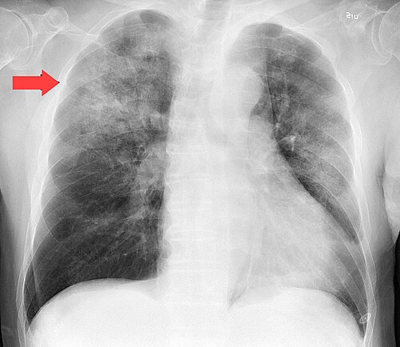
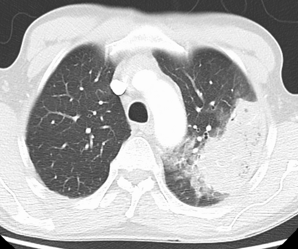

# PNEUMONIA ASSOCIADA À ASSISTÊNCIA À SAÚDE

Para começar nosso estudo, precisamos alinhar os conceitos. Quando falamos em pneumonia no ambiente hospitalar, muitos alunos se perdem em siglas: PAH, PAVM, PN, HCAP. Vamos simplificar. O ponto central aqui é o **tempo** e o **local**.

A Pneumonia Hospitalar (PAH) é aquela que ocorre **48 horas ou mais após a admissão**, e que não estava incubada no momento da internação. Se o paciente interna agora e em 12 horas apresenta febre e infiltrado, isso é Pneumonia Adquirida na Comunidade (PAC) que "deu as caras" no hospital. O relógio das 48 horas é o divisor de águas para as bancas de residência.

Já a Pneumonia Associada à Ventilação Mecânica (PAVM) é um subtipo da PAH, surgindo **48 a 72 horas após a intubação orotraqueal**. Guarde isso: a prótese ventilatória muda completamente a flora e o mecanismo de defesa do paciente.

E a tal "Pneumonia Associada aos Cuidados de Saúde" (HCAP)? Esse termo caiu em desuso nas diretrizes mais recentes (como a da IDSA e as atualizações da SBPT), pois levava ao uso excessivo de antibióticos de amplo espectro. No entanto, as provas ainda cobram o conceito: pacientes em diálise crônica, quimioterapia recente ou que vivem em casas de repouso. Para a prova, esses pacientes têm maior risco de germes multirresistentes (MDR), como o MRSA, mas a tendência moderna é tratá-los conforme os fatores de risco individuais, e não apenas pelo rótulo de HCAP.

*Figura 1 - Radiografia de tórax posteroanterior demonstrando pneumonia multifocal bilateral, padrão frequentemente encontrado em pneumonias associadas à assistência à saúde. Fonte: Mikael Häggström, CC0 | Wikimedia Commons*

## Fisiopatologia: Por que o pulmão adoece no hospital?

Você já se perguntou por que um paciente que está "apenas" tratando uma fratura de fêmur acaba com uma pneumonia grave? A resposta curta é: **microaspiração**.

No hospital, a flora orofaríngea do paciente muda em questão de horas. O paciente crítico para de colonizar a boca com germes "bonzinhos" da comunidade e passa a ser colonizado por Gram-negativos entéricos (como *Klebsiella* e *Pseudomonas*) e *Staphylococcus aureus*.

A presença de uma sonda nasoenteral (SNE) facilita o refluxo gastroesofágico. O tubo orotraqueal, por sua vez, impede o fechamento da glote e a tosse eficaz, além de formar um biofilme de bactérias. Pequenas quantidades de secreção contaminada passam pelos espaços ao redor do balonete (cuff) e chegam aos alvéolos.

**Dica de prova:** As bancas adoram perguntar sobre o mecanismo principal. Lembre-se: a inalação de aerossóis é rara (ex: Legionella em sistemas de ar condicionado); o grande vilão é a **microaspiração de secreções da orofaringe**.

## Critérios Diagnósticos: O Desafio Clínico

Diagnosticar pneumonia no hospital é muito mais difícil do que na comunidade. Por quê? Porque o paciente hospitalizado já tem mil motivos para ter febre (acessos, infecção urinária, TVP) e mil motivos para ter alteração no raio-X (atelectasia, edema pulmonar, contusão).

Para fechar o diagnóstico, precisamos da tríade clássica:

- **Infiltrado radiológico novo ou progressivo:** É obrigatório. Sem alteração na imagem, você não pode chamar de pneumonia.

- **Sinais sistêmicos de infecção:** Febre (> 38°C) ou hipotermia (< 36°C), e leucocitose ou leucopenia.

- **Sinais de localização pulmonar:** Secreção traqueal purulenta, piora da oxigenação ou aumento da necessidade de suporte ventilatório.

### O Escore CPIS (Clinical Pulmonary Infection Score)

Muitas vezes citado, o CPIS tenta objetivar o diagnóstico usando seis critérios: temperatura, leucograma, secreção traqueal, oxigenação (relação PaO2/FiO2), radiografia de tórax e cultura do aspirado.

- Um CPIS > 6 sugere fortemente pneumonia.

- **Cuidado:** Na prática clínica, ele tem baixa especificidade, mas para a prova, é uma ferramenta de triagem importante.

### Biomarcadores: A Procalcitonina (PCT)

Aqui está uma das maiores "pérolas" das provas recentes. A Procalcitonina é o melhor biomarcador para guiar a antibioticoterapia na pneumonia hospitalar.
Diferente da PCR (Proteína C Reativa), que sobe por qualquer inflamação, a PCT é mais específica para infecções bacterianas.

**Como usar a PCT?** Ela não serve para fechar o diagnóstico sozinha, mas é excelente para **decidir quando parar o antibiótico**. Se os níveis de PCT caírem mais de 80% em relação ao valor inicial ou ficarem abaixo de 0,25 ou 0,5 ng/mL, você tem segurança para suspender o tratamento. Isso reduz o tempo de exposição ao fármaco e a pressão seletiva para resistência.

## Microbiologia e Fatores de Risco para Multirresistência

Se você tratar todo mundo com "carbapenêmico + vancomicina", você vai criar superbactérias no seu hospital. O segredo da aprovação (e da boa prática médica) é saber quem tem risco para germes multirresistentes (MDR).

Os principais agentes na PAH/PAVM são:

- **Gram-negativos:** *Pseudomonas aeruginosa*, *Acinetobacter baumannii*, *Klebsiella pneumoniae* (KPC).

- **Gram-positivos:** *Staphylococcus aureus* (especialmente o MRSA - resistente à meticilina).

### Tabela 1: Fatores de Risco para Germes MDR (Geral)

| Fator de Risco | Por que aumenta o risco? |
| --- | --- |
| Uso de antibiótico nos últimos 90 dias | Seleção de flora resistente prévia. |
| Choque séptico na apresentação | Indica gravidade e necessidade de cobertura ampla imediata. |
| SIRA (Síndrome do Desconforto Respiratório Agudo) | Pulmão muito inflamado, maior facilidade de colonização. |
| Internação hospitalar > 5 dias | Tempo suficiente para colonização por germes nosocomiais. |
| Terapia de substituição renal (diálise) | Exposição frequente ao ambiente hospitalar e imunossupressão relativa. |

**Exemplo Clínico:** Imagine um paciente de 70 anos, dialítico crônico, internado há 6 dias por uma fratura, que evolui com tosse purulenta e febre. Dr. Will sempre reforça: esse paciente é o "combo" do risco para MRSA. A diálise e o tempo de internação gritam por cobertura para Gram-positivos resistentes.

*Figura 2 - Tomografia computadorizada de tórax demonstrando pneumonia cavitária por MRSA (Staphylococcus aureus resistente à meticilina), complicação comum em pneumonias hospitalares. Fonte: James Heilman, MD, CC BY-SA 4.0 | Wikimedia Commons*

## Tratamento Farmacológico: A Escolha do Antibiótico

O tratamento da PAH/PAVM é inicialmente **empírico**. Você não espera a cultura sair para começar, pois o atraso na dose correta aumenta a mortalidade.

### Passo 1: Avaliar o risco de mortalidade e de Pseudomonas resistente

Se o paciente está estável e o hospital tem baixas taxas de resistência, você pode usar monoterapia (ex: Piperacilina/Tazobactam ou Cefepime).
Se o paciente está em choque séptico ou o hospital tem > 10% de resistência às penicilinas, você deve usar **dois agentes antipseudomonas** de classes diferentes (ex: um Beta-lactâmico + uma Fluoroquinolona ou Aminoglicosídeo).

### Passo 2: Avaliar o risco de MRSA

Se o paciente tem fatores de risco (uso de ATB prévio, diálise, internação em unidade com > 20% de MRSA), você deve adicionar Vancomicina ou Linezolida.

### O Erro Clássico: Daptomicina

Este é o erro que as bancas mais amam. A Daptomicina é um excelente antibiótico para Gram-positivos e MRSA, **mas ela NÃO funciona no pulmão**.
**Por quê?** Porque ela é inativada pelo surfactante pulmonar. Se a questão trouxer um paciente com pneumonia por MRSA ou VRE (Enterococo resistente à vancomicina) e oferecer Daptomicina, marque como ERRADO. Para VRE no pulmão, a escolha costuma ser Linezolida.

### Tabela 2: Opções de Antibioticoterapia Empírica

| Perfil do Paciente | Esquema Sugerido |
| --- | --- |
| Baixo risco de MDR e baixa mortalidade | Piperacilina/Tazobactam (4,5g 6/6h) OU Cefepime (2g 8/8h) |
| Risco de MRSA presente | Adicionar Vancomicina (dose de ataque 25-30mg/kg) OU Linezolida (600mg 12/12h) |
| Choque Séptico ou Risco de Gram-negativo MDR | Beta-lactâmico + (Amicacina OU Ciprofloxacino) + Cobertura MRSA |
| Suspeita de KPC (Klebsiella produtora de Carbapenemase) | Ceftazidima-Avibactam (2,5g 8/8h) |

**Duração do tratamento:** Antigamente fazíamos 14 a 21 dias. Hoje, a recomendação (Diretriz SBPT e IDSA) é de **7 dias** para a grande maioria dos pacientes, desde que haja melhora clínica e estabilidade hemodinâmica. Tratar por mais tempo só aumenta a resistência sem melhorar o desfecho.

## Diagnóstico Diferencial: Nem tudo que brilha é ouro

No MedEvo, sempre batemos na tecla de que o médico que só enxerga uma doença erra o diagnóstico. No paciente grave, considere:

- **Edema Agudo de Pulmão:** O paciente pode ter febre por outra causa e o infiltrado ser apenas congestão. Olhe o balanço hídrico e o BNP.

- **Tromboembolismo Pulmonar (TEP):** Pode causar infiltrado (infarto pulmonar) e febre.

- **Atelectasia:** Muito comum no pós-operatório. Melhora com fisioterapia, não com antibiótico.

- **Hemorragia Alveolar:** Especialmente em imunossuprimidos ou pacientes com vasculites.

## Prevenção: O "Bundle" da PAVM

Prevenir é muito mais barato e seguro do que tratar. As provas cobram exaustivamente as medidas de prevenção da PAVM, muitas vezes organizadas em "pacotes" (bundles).

- **Cabeceira elevada (30-45°):** A medida mais simples e eficaz para evitar a microaspiração.

- **Interrupção diária da sedação e avaliação de extubação:** Quanto menos tempo no tubo, menor o risco.

- *Pegadinha de prova:* A interrupção da sedação aumenta o risco de extubação acidental (o paciente acorda e puxa o tubo), mas **mesmo assim é recomendada** porque reduz drasticamente o tempo total de ventilação e a incidência de PAVM.

- **Higiene oral com Clorexidina:** Reduz a carga bacteriana da orofaringe.

- **Pressão do cuff (balonete):** Deve ser mantida entre 20-30 cmH2O. Se estiver muito baixa, vaza secreção; se muito alta, causa isquemia na traqueia.

- **Evitar a troca rotineira dos circuitos do ventilador:** Só troque se estiverem visivelmente sujos ou danificados. Trocar todo dia aumenta o risco de contaminação.

## Situações Especiais e Complicações

### Mucoviscidose (Fibrose Cística)

Se o paciente tem Fibrose Cística e interna com pneumonia, sua cabeça deve pensar imediatamente em **Pseudomonas aeruginosa**. Esses pacientes são frequentemente colonizados por cepas mucoides e resistentes. O tratamento deve ser sempre agressivo e, muitas vezes, duplo para Gram-negativos.

### Transfusão Sanguínea

Você sabia que a transfusão de hemocomponentes é um fator de risco independente para PAVM? Isso ocorre devido à **imunomodulação transfusional** (TRIM). O sangue doado causa uma "paralisia" temporária no sistema imune do receptor, facilitando a invasão bacteriana. Em provas de terapia intensiva, isso aparece como um fator a ser evitado (política de transfusão restritiva).

### Tabela 3: Diagnóstico Microbiológico - Métodos de Coleta

| Método | Vantagem | Ponto de Corte (UFC/mL) |
| --- | --- | --- |
| Aspirado Traqueal (Não invasivo) | Fácil, rápido, qualquer um faz. | ≥ 10⁶ |
| Lavado Broncoalveolar (LBA - Invasivo) | Coleta material mais profundo, menos contaminação. | ≥ 10⁴ |
| Escovado Protegido (Invasivo) | O mais específico de todos. | ≥ 10³ |

**Nota do Professor:** Se a cultura vier abaixo desses valores, considere que é apenas **colonização** e não infecção. Não trate o exame, trate o paciente!

## Estratificação de Risco e Metas Terapêuticas

O objetivo no tratamento da PAH não é apenas "limpar o raio-X" (que pode demorar semanas para normalizar), mas sim a **estabilidade clínica**.

**Metas em 48-72 horas:**

- Melhora da oxigenação (aumento da relação PaO2/FiO2).

- Queda da febre.

- Redução da leucocitose.

- Diminuição da purulência da secreção.

Se o paciente não melhora em 72 horas, você deve:

- Rever o diagnóstico (é pneumonia mesmo?).

- Rever a cobertura (o germe é resistente ao que estou usando?).

- Procurar complicações (abscesso pulmonar ou empiema pleural).

### Tabela 4: Diferenciação Clínica Rápida

| Característica | Pneumonia Adquirida na Comunidade (PAC) | Pneumonia Hospitalar (PAH) |
| --- | --- | --- |
| Tempo de início | < 48h de internação | ≥ 48h de internação |
| Germes principais | *S. pneumoniae*, *H. influenzae* | *Pseudomonas*, *S. aureus* (MRSA), *Acinetobacter* |
| Fisiopatologia | Inalação / Aspiração de flora da comunidade | Microaspiração de flora hospitalar / Biofilme no tubo |
| Mortalidade | Geralmente baixa (depende do CURB-65) | Alta (20-50%) |
| Tratamento base | Amoxicilina/Clavulanato, Macrolídeos, Quinolonas | Cefepime, Pip/Tazo, Carbapenêmicos, Vancomicina |

## Pontos-Chave para Prova 🩺

- **Definição de Ouro:** PAH surge ≥ 48h após admissão; PAVM surge ≥ 48h após intubação.

- **O Grande Vilão:** O principal mecanismo patogênico é a microaspiração de secreções da orofaringe.

- **Daptomicina:** NUNCA use para pneumonia. O surfactante pulmonar a inativa. Erro fatal em provas.

- **Procalcitonina:** É o melhor biomarcador para guiar a **suspensão** do antibiótico (reduz tempo de tratamento).

- **Duração do Tratamento:** A recomendação atual para a maioria das PAVM/PAH é de apenas **7 dias**.

- **Fator de Risco Inusitado:** Transfusão de sangue aumenta o risco de PAVM por imunomodulação.

- **Interrupção da Sedação:** Reduz tempo de VM e PAVM, apesar de aumentar o risco de extubação acidental. É recomendação forte.

- **Higiene Oral:** O uso de clorexidina faz parte do bundle de prevenção obrigatório.

- **Posicionamento:** Manter a cabeceira entre 30-45 graus é a medida preventiva mais cobrada.

- **Fibrose Cística:** Pensou em pneumonia nesses pacientes, pensou obrigatoriamente em *Pseudomonas aeruginosa*.

- **Diálise Crônica:** É um fator de risco clássico para colonização e infecção por MRSA.

- **Ceftazidima-Avibactam:** Droga de escolha quando há suspeita ou confirmação de enterobactérias produtoras de carbapenemase (KPC).

- **Troca de Circuitos:** NÃO deve ser feita rotineiramente; apenas se houver sujidade visível.

- **Diagnóstico Radiológico:** É indispensável. Não se diagnostica pneumonia hospitalar com raio-X limpo.

- **VRE no Pulmão:** Se o Enterococo for resistente à Vancomicina, a Linezolida é a opção (lembre-se que Daptomicina não serve aqui).

- **Choque Séptico:** Se presente na PAH, indica necessidade de cobertura dupla para *Pseudomonas* e cobertura para MRSA de imediato.

- **Pegadinha de Tempo:** Pneumonia que surge com 36 horas de internação é PAC, não PAH. O limite são 48 horas.

- **Sonda Nasoenteral:** É um fator de risco, pois facilita o refluxo e a microaspiração.

 Cópia offline para consulta pessoal.
 Fonte original:
 [https://www.medevo.com.br/material-apoio/ler/adf00ecb-5a5f-44b9-8281-b67070e4dc11](https://www.medevo.com.br/material-apoio/ler/adf00ecb-5a5f-44b9-8281-b67070e4dc11)
