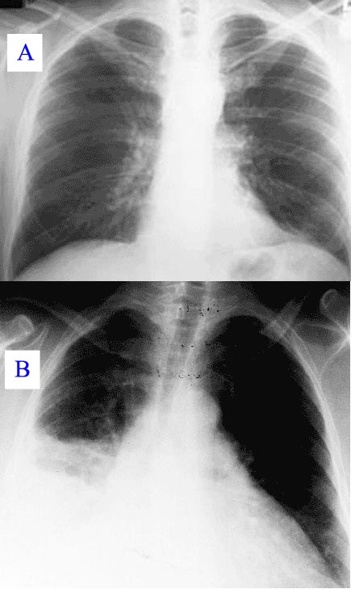
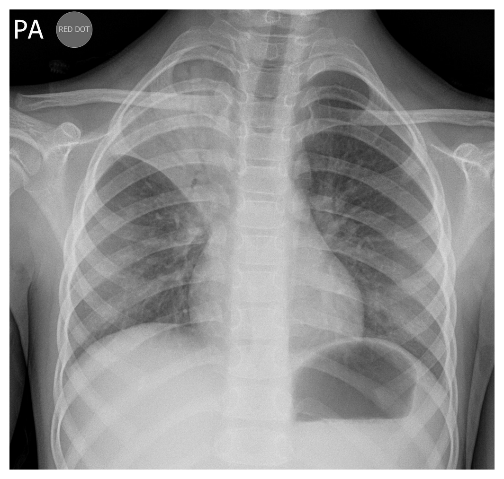
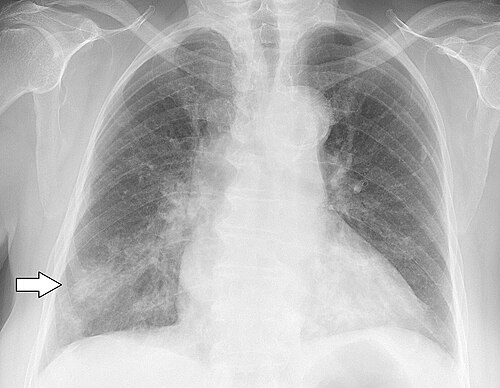
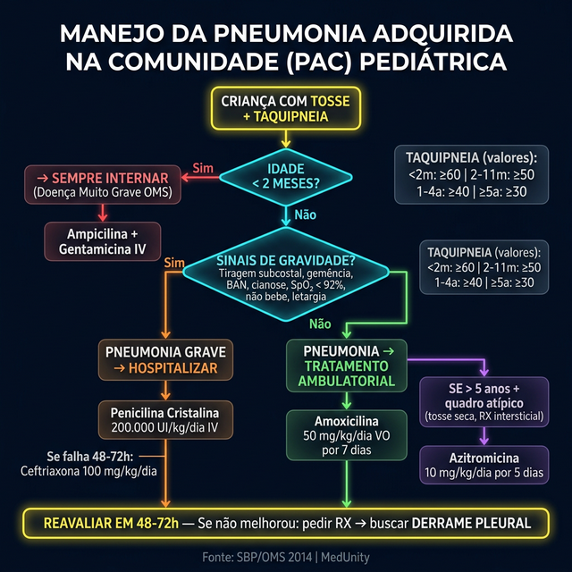
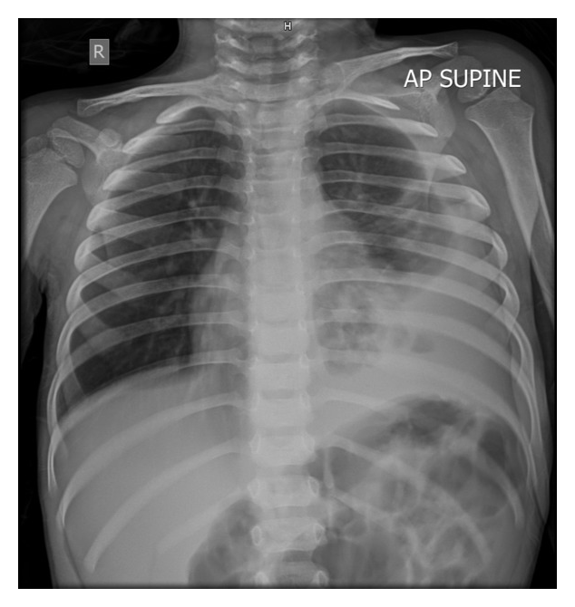
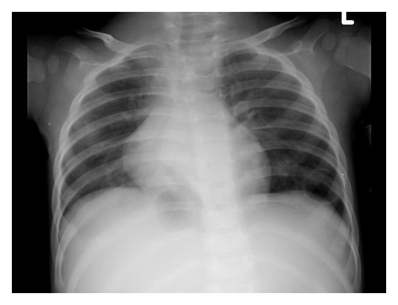

# PNEUMONIA PEDIÁTRICA

A pneumonia adquirida na comunidade (PAC) é, sem dúvida, um dos temas mais "quentes" em qualquer prova de residência médica no Brasil. Por que? Porque ela continua sendo a principal causa de morte por infecção em crianças menores de 5 anos no mundo. Como professor, eu vejo muitos alunos se perdendo em detalhes de antibióticos raros, enquanto as bancas estão cobrando o básico: você sabe identificar uma criança que precisa ser internada? Você sabe qual é o sinal clínico mais fidedigno?

Neste material, vamos dissecar a PAC sob a ótica das diretrizes da Sociedade Brasileira de Pediatria (SBP) e da Organização Mundial da Saúde (OMS), focando no que realmente cai e no que você vai usar no seu plantão.

## Definição e o "Pulo do Gato" Diagnóstico

Diferente do adulto, onde muitas vezes esperamos uma radiografia para "bater o martelo", na pediatria o diagnóstico de pneumonia é **eminentemente clínico**. Guarde isso: se você está em um posto de saúde sem RX e chega uma criança com tosse e taquipneia, você tem o diagnóstico de pneumonia e deve iniciar o tratamento.

A OMS define pneumonia na criança pela presença de:

- **Tosse ou dificuldade para respirar**;

- **Taquipneia** (aumento da frequência respiratória para a idade).

### Os Valores Mágicos da Taquipneia

Este é o conceito mais cobrado em provas. Você precisa decorar esses números como se fossem o seu número de telefone. A taquipneia é o sinal isolado com maior sensibilidade para o diagnóstico de pneumonia em crianças.

| Idade | Frequência Respiratória (irpm) |
| --- | --- |
| < 2 meses | ≥ 60 |
| 2 meses a 11 meses | ≥ 50 |
| 1 ano a 4 anos | ≥ 40 |
| ≥ 5 anos | ≥ 30 |

**Cuidado:** Muitos alunos erram ao não considerar a febre ou o choro no momento da contagem. O ideal é contar a frequência respiratória com a criança calma e, preferencialmente, sem febre, pois a hipertermia aumenta a frequência basal (cerca de 10 irpm para cada grau de febre).

## Etiologia: Onde as Bancas Moram

A causa da pneumonia muda drasticamente conforme a idade da criança. Se você souber a idade, você já sabe 80% do provável agente.

### 1. Período Neonatal ( 5 anos)

O pneumococo continua importante, mas ganham força os chamados **Agentes Atípicos**:

- *Mycoplasma pneumoniae*;

- *Chlamydia pneumoniae*.

O *Mycoplasma* costuma causar um quadro mais arrastado, com dor de garganta, cefaleia e uma radiografia que parece "muito pior" do que o exame físico da criança. É a famosa "pneumonia que caminha" (walking pneumonia).

## Fisiopatologia: Por que a criança faz "gemência"?

Entender o porquê dos sinais clínicos ajuda a não esquecer. A pneumonia causa uma inflamação nos alvéolos, que ficam cheios de exsudato. Isso gera um *shunt* intrapulmonar: o sangue passa pelo alvéolo, mas não é oxigenado.

- **Taquipneia:** É a tentativa do corpo de compensar a hipoxemia e a redução da complacência pulmonar.

- **Tiragem Subcostal:** Indica que a criança está usando a musculatura acessória porque o pulmão está "duro" (baixa complacência). Para a OMS, a tiragem subcostal é sinal de **Pneumonia Grave**.

- **Gemência:** É um mecanismo de defesa fantástico. A criança fecha a glote no final da expiração para criar uma pressão positiva (uma espécie de PEEP natural) e manter os alvéolos abertos por mais tempo. Se você ouvir gemência, essa criança está em insuficiência respiratória iminente.

## Quadro Clínico e Exame Físico

O quadro clássico bacteriano é: febre alta de início súbito, tosse, prostração e taquipneia.

No exame físico, você pode encontrar:

- **Estertores crepitantes:** Som de "velcro" abrindo, indicando líquido no alvéolo.

- **Sopro tubário:** Indica consolidação (o som da traqueia é transmitido fielmente através do parênquima consolidado).

- **Broncofonia e Pectoriloquia:** A voz chega mais nítida na ausculta sobre a área de consolidação.

- **Macicez à percussão:** Sugere consolidação ou, muito importante, **Derrame Pleural**.

**Pegadinha de Prova:** Se a criança tem pneumonia e começa com dor abdominal, o que você pensa? Apendicite? Cuidado! Pneumonias de lobos inferiores podem irritar o diafragma e causar dor referida no abdome. Sempre ausculte o pulmão de uma criança com "dor na barriga".

## Diagnóstico Complementar: Quando pedir exames?

Como disse o Dr. Will em suas discussões de caso, "o excesso de exames na PAC ambulatorial só serve para confundir".

## Radiografia de Tórax

Segundo a SBP, o RX **NÃO** é rotina para crianças com quadro leve que serão tratadas em casa.
**Indicações de RX:**

- Dúvida diagnóstica;

- Criança que precisa de internação;

- Falha terapêutica (não melhorou após 48-72h de ATB);

- Suspeita de complicações (derrame, abscesso).

**Achados clássicos:**

- **Bacteriana:** Consolidação lobar ou segmentar, broncogramas aéreos (ar dentro dos brônquios cercado por alvéolos consolidados).

- **Viral/Atípica:** Infiltrado intersticial difuso, hiperinsuflação.

### Exames de Sangue

Hemograma e PCR não confirmam pneumonia. Eles podem ajudar a sugerir etiologia (leucocitose com desvio à esquerda sugere bactéria), mas não são obrigatórios. A hemocultura tem baixa sensibilidade (positiva em menos de 10% dos casos), mas deve ser colhida em pacientes internados graves.

## Estratificação de Risco: Quem eu interno?

Esta é a decisão mais importante da sua vida no pronto-socorro. Errar aqui pode ser fatal.

### Critérios de Internação (SBP/OMS)

- **Idade < 2 meses** (Sempre interna! A OMS classifica como "Doença Muito Grave" nesta faixa);

> **📌 ATUALIZAÇÃO - Classificação OMS Simplificada (desde 2014):** Para crianças de **2-59 meses**, a OMS reduziu de 3 para 2 categorias:

| Classificação | Critério | Conduta |
| --- | --- | --- |
| **Pneumonia** | Taquipneia **SEM** tiragem subcostal | Amoxicilina oral (ambulatorial) |
| **Pneumonia Grave** | Tiragem subcostal **OU** sinais de perigo | Hospitalização + ATB IV |
| *A antiga categoria "Pneumonia Muito Grave" foi incorporada em "Pneumonia Grave"* | | |

- **Sinais de perigo:** Incapacidade de beber líquidos, vômitos incoercíveis, convulsões, letargia ou inconsciência;

- **Sinais de gravidade respiratória:** Tiragem subcostal, batimento de asa de nariz, gemência, cianose;

- **Hipoxemia:** Saturação de O2 < 92% em ar ambiente;

- **Comprometimento do estado geral:** Criança "toxemiada";

- **Doenças de base:** Cardiopatias, imunodeficiências, anemia falciforme;

- **Complicações radiológicas:** Derrame pleural ou abscesso;

- **Falha do tratamento ambulatorial:** Piora ou ausência de melhora após 48-72h;

- **Fatores sociais:** Pais que não conseguem observar a criança ou comprar a medicação.

## Tratamento Farmacológico: A Dose Certa

O tratamento inicial é sempre **empírico**, focado no Pneumococo.

### 1. Tratamento Ambulatorial (Pneumonia Leve)

A droga de escolha é a **Amoxicilina**.

- **Dose:** 50 mg/kg/dia (dividida em 2 ou 3 doses).

- **Por que não 80-90 mg/kg/dia?** Algumas diretrizes internacionais sugerem doses maiores para vencer a resistência intermediária do pneumococo. No Brasil, a SBP ainda aceita 50 mg/kg/dia como dose inicial para casos não complicados, mas em áreas de alta resistência ou falha inicial, subimos para 80-90 mg/kg/dia.

- **Duração:** Geralmente 7 dias (pode variar de 5 a 10 dias conforme a resposta).

### 2. Tratamento Hospitalar (Pneumonia Grave)

A droga de escolha é a **Penicilina Cristalina** ou **Ampicilina** IV.

- **Penicilina Cristalina:** 200.000 UI/kg/dia (dividida de 4/4h ou 6/6h).

- **Ampicilina:** 200 mg/kg/dia.

- **Por que não Ceftriaxona para todos?** Precisamos praticar o uso racional de antibióticos. A Penicilina Cristalina é excelente para o Pneumococo sensível. Deixamos a Ceftriaxona para casos de falha, crianças não vacinadas (cobertura para *Haemophilus*) ou quadros muito graves/sépticos.

### 3. Suspeita de Atípicos (Escolares/Adolescentes)

Se o quadro sugere *Mycoplasma* (tosse seca persistente, sintomas extrapulmonares como mialgia, RX intersticial), usamos **Macrolídeos**:

- **Azitromicina:** 10 mg/kg/dia (1x ao dia) por 5 dias.

- **Claritromicina:** 15 mg/kg/dia (dividida 12/12h) por 7-10 dias.

### Tabela de Antibioticoterapia Resumida

| Cenário | Droga de Escolha | Dose |
| --- | --- | --- |
| Ambulatorial | Amoxicilina | 50 mg/kg/dia (até 90 mg/kg/dia) |
| Hospitalar (Grave) | Penicilina Cristalina | 200.000 UI/kg/dia IV |
| Hospitalar (Muito Grave/Sepse) | Ceftriaxona + Oxacilina | Ceftri: 100 mg/kg/dia |
| Atípica Suspeita | Azitromicina | 10 mg/kg/dia |
| Pneumonia Afebril (< 3 meses) | Azitromicina | 10 mg/kg/dia |

## Complicações: O Pesadelo do Plantonista

A criança estava tratando pneumonia há 48h e a febre não cede. O que fazer? **Repetir o RX**. A complicação mais comum é o **Derrame Pleural Parapneumônico**.

### 1. Derrame Pleural

O agente que mais causa derrame é o **Pneumococo**. O *Staphylococcus aureus* também é um grande vilão aqui, causando derrames volumosos e pneumatoceles (bolhas de ar no parênquima).

**As 3 Fases do Derrame:**

- **Exsudativa:** Líquido fluido, estéril. Tratamento: Antibiótico (muitas vezes resolve sozinho se pequeno).

- **Fibrinopurulenta:** Presença de septações, fibrina e pus. É o **Empiema**. Tratamento: Drenagem de tórax + Antibiótico.

- **Organizada:** Fibrose, "pulmão encarcerado". Tratamento: VATS (videotoracoscopia) ou decorticação cirúrgica.

**Análise do Líquido Pleural (Critérios de Empiema):**
Você puncionou e veio um líquido turvo. É empiema se:

- Aspecto purulento;

- pH < 7,2;

- Glicose < 40 mg/dL;

- LDH > 1000 UI/L;

- Gram ou Cultura positivos.

**Manejo:** Se o derrame é pequeno (< 1 cm na incidência de Laurell) e a criança está bem, pode-se observar. Se for grande, houver desconforto ou critérios de empiema: **Drenagem Tubular Fechada**.

### 2. Abscesso Pulmonar

Área de necrose com cavidade preenchida por pus. O tratamento é clínico (antibiótico prolongado por 3-4 semanas). A cirurgia é raríssima, apenas se houver falha clínica grave ou hemoptise maciça.

### 3. Pneumatocele

Muito comum na pneumonia estafilocócica. São "bolhas" de ar. **Cuidado:** A conduta é **CONSERVADORA**. Não se drena pneumatocele, a menos que ela cause um pneumotórax hipertensivo. Elas costumam regredir sozinhas em semanas ou meses.

## Diagnósticos Diferenciais: Não coma bola!

Nem tudo que tosse e tem taquipneia é pneumonia.

- **Bronquiolite Viral Aguda:** Ocorre em lactentes < 2 anos. O quadro é de sibilância (chiado), pródromos virais e o RX mostra hiperinsuflação (pulmão preto, retificado), não consolidação.

- **Aspiração de Corpo Estranho:** História de início súbito de sufocação. Se a criança tem uma "pneumonia" que não melhora ou que sempre volta no mesmo lugar (pneumonia de repetição no mesmo lobo), suspeite fortemente de corpo estranho!

- **Insuficiência Cardíaca:** Criança com taquipneia, hepatomegalia e cardiomegalia no RX.

- **Tuberculose:** Febre vespertina, perda de peso, contato com adulto bacilífero. O quadro é mais arrastado.

## Situações Especiais

### Anemia Falciforme

Criança falcêmica com febre, dor torácica e infiltrado novo no RX tem **Síndrome Torácica Aguda (STA)**. É uma emergência médica! O tratamento envolve antibiótico de amplo espectro (Ceftriaxona + Macrolídeo), oxigenoterapia, hidratação cuidadosa e, muitas vezes, transfusão de sangue.

### Toxocaríase (Síndrome de Loeffler)

Criança com tosse, sibilância e infiltrados pulmonares "migratórios" (que mudam de lugar no RX em poucos dias) associados a uma **eosinofilia absurda** no sangue. É o ciclo pulmonar de parasitas como *Ascaris* ou *Toxocara*.

## Pontos-Chave para Prova

- **Sinal mais sensível:** Taquipneia. Aprenda os valores por idade (60-50-40-30).

- **Diagnóstico:** Clínico. RX não é obrigatório para casos leves ambulatoriais.

- **Principal agente bacteriano:** *Streptococcus pneumoniae* em todas as faixas acima de 3 meses.

- **Pneumonia Afebril do Lactente:** *Chlamydia trachomatis*. Tosse em staccato + eosinofilia + história de conjuntivite. Trata com Macrolídeo.

- **Critério de Gravidade OMS:** Tiragem subcostal define Pneumonia Grave.

- **Critério de Muito Grave OMS:** Sinais de perigo (não bebe, vomita tudo, letargia) ou cianose/estridor em repouso.

- **Tratamento 1ª escolha (Ambulatorial):** Amoxicilina 50 mg/kg/dia.

- **Tratamento 1ª escolha (Hospitalar):** Penicilina Cristalina 200.000 UI/kg/dia.

- **Indicação de internação absoluta:** Idade < 2 meses.

- **Falha terapêutica:** Reavaliar em 48-72h. Se não houver melhora, pedir RX para buscar complicações (derrame).

- **Derrame Pleural:** O empiema (pH < 7,2, Glicose < 40) exige drenagem torácica.

- **Pneumatoceles:** Conduta é conservadora (observar), mesmo que pareçam assustadoras no RX.

- **Sibilância:** Se houver sibilância difusa, pense primeiro em vírus ou asma. Pneumonia bacteriana "pura" raramente sibilia.

- **O que NÃO fazer:** Não usar antitussígenos ou mucolíticos (não têm evidência e podem ser perigosos). Não pedir RX de controle para criança que melhorou clinicamente.

- **Pegadinha clássica:** A banca diz que a criança melhorou da febre, mas o RX de controle (feito desnecessariamente) está "pior". Conduta: Manter o tratamento. A melhora radiológica é muito mais lenta que a clínica.

 Cópia offline para consulta pessoal.
 Fonte original:
 [https://www.medevo.com.br/material-apoio/ler/38b4c85f-f47c-4e04-89f2-05644a384f8d](https://www.medevo.com.br/material-apoio/ler/38b4c85f-f47c-4e04-89f2-05644a384f8d)
