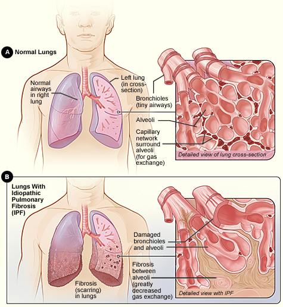
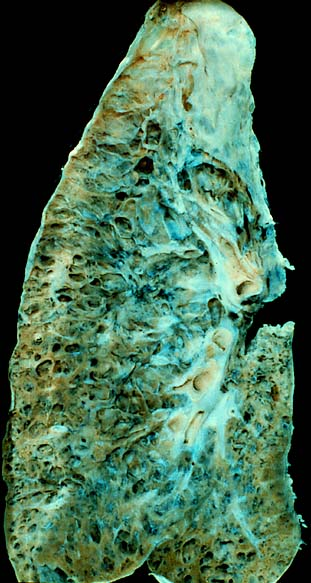
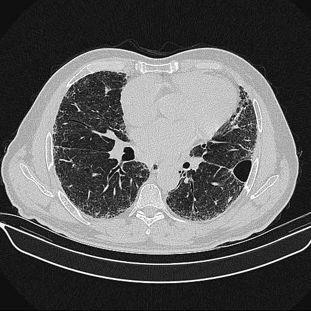
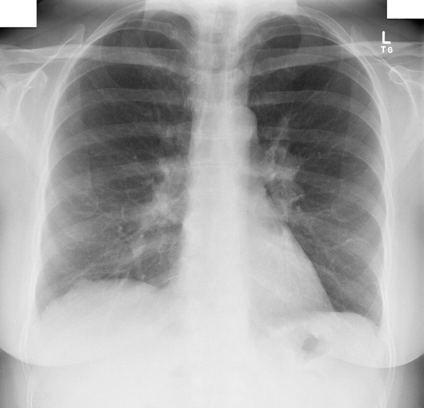
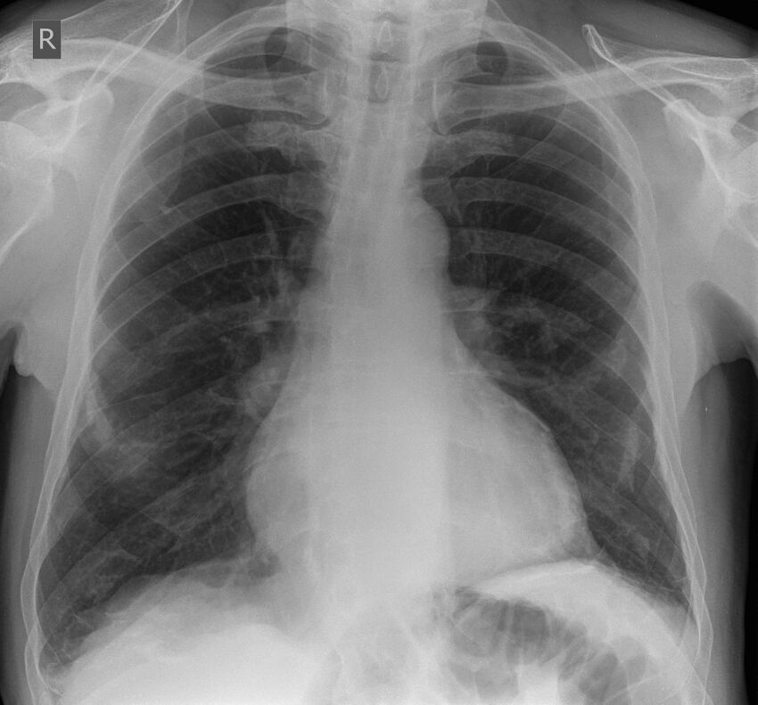

# PNEUMOPATIAS INTERSTICIAIS

As Doenças Pulmonares Intersticiais (DPIs) representam um dos temas mais desafiadores da Pneumologia, tanto na prática clínica quanto nas provas de residência. O motivo é simples: estamos falando de um grupo de mais de 200 entidades patológicas que compartilham manifestações clínicas e radiológicas semelhantes.

Para você não se perder nesse "mar de siglas", imagine o pulmão como uma esponja. Nas doenças de via aérea (como asma e DPOC), o problema está nos "tubos" que levam o ar. Nas DPIs, o problema está no "esqueleto" da esponja — o interstício. Quando esse esqueleto inflama ou cicatriza (fibrose), o pulmão perde complacência (fica rígido) e a troca gasosa é prejudicada.

*Figura 1 - Ilustração da fibrose pulmonar idiopática (FPI) mostrando alvéolos normais comparados com alvéolos fibrosados, demonstrando o espessamento intersticial característico das pneumopatias intersticiais. Fonte: NIH, Domínio Público | Wikimedia Commons*

## Classificação: O Mapa da Mina

Não tente decorar as 200 doenças. Para a prova, você precisa organizar as DPIs em quatro grandes grupos. Essa classificação, baseada nas diretrizes da Sociedade Brasileira de Pneumologia e Tisiologia (SBPT), é o que vai te orientar no diagnóstico diferencial.

- **DPIs de Causa Conhecida:** Aqui estão as doenças associadas a colagenoses (Esclerose Sistêmica, Artrite Reumatoide), exposições ocupacionais (Silicose, Asbestose) e drogas (Amiodarona, Metotrexato, Nitrofurantoína).

- **DPIs Idiopáticas:** Onde a Fibrose Pulmonar Idiopática (FPI) reina absoluta como a mais comum e mais grave.

- **DPIs Granulomatosas:** Onde o destaque é a Sarcoidose.

- **DPIs com Padrões Histológicos/Radiológicos Específicos:** Entidades raras como a Histiocitose X e a Linfangioleiomiomatose (LAM).

**Ponto-chave:** Se a questão descreve um paciente com sintomas de DPI e cita "mãos de mecânico", "fenômeno de Raynaud" ou "artrite", conecte a DPI a uma doença do tecido conjuntivo. Se cita "criação de pássaros" ou "mofo", pense em Pneumonite por Hipersensibilidade.

*Figura 2 - Espécime macroscópico de pulmão em estágio terminal de doença intersticial (faveolamento/honeycomb lung), demonstrando a destruição da arquitetura pulmonar com formação de cistos. Fonte: Ed Uthman, Domínio Público | Wikimedia Commons*

## Fisiopatologia: Por que o pulmão "endurece"?

O interstício pulmonar é o espaço entre a membrana basal do epitélio alveolar e o endotélio capilar. Nas DPIs, ocorre um insulto (seja ele uma toxina, um antígeno ou um gatilho desconhecido) que gera uma resposta inflamatória (alveolite) ou uma resposta fibroproliferativa direta.

O resultado final é o espessamento desse espaço. Por que isso importa?

- **Mecânica Ventilatória:** O pulmão fica "duro" (baixa complacência). O esforço para expandi-lo aumenta, gerando dispneia.

- **Troca Gasosa:** O oxigênio tem que atravessar uma barreira muito mais espessa para chegar ao sangue. Por isso, a queda da Difusão de Monóxido de Carbono (DLCO) é, muitas vezes, o primeiro sinal funcional de doença, antes mesmo da queda da CVF.

## O Quadro Clínico: O que buscar no exame físico?

O paciente clássico de DPI chega ao consultório com **dispneia progressiva aos esforços** e **tosse seca**. Se a tosse for produtiva, desvie seu pensamento para bronquiectasias ou insuficiência cardíaca.

No exame físico, dois sinais são "carimbos" de DPI em provas:

- **Estertores Crepitantes tipo "Velcro":** São finos, teleinspiratórios, e começam nas bases. Diferente dos estertores da pneumonia ou ICC, eles não mudam com a tosse e são muito sugestivos de fibrose.

- **Baqueteamento Digital (Hipocratismo):** Sinal de hipóxia crônica e remodelamento tecidual. É muito comum na FPI e na Asbestose, mas raro na Sarcoidose.

**Exemplo Clínico:** Paciente de 68 anos, ex-tabagista, com dispneia há 1 ano. Ao exame: estertores velcro em bases e baqueteamento. Qual o diagnóstico mais provável? FPI. Não perca tempo procurando outras causas antes de descartar essa.

## Investigação Diagnóstica: O Passo a Passo

Aqui é onde o aluno costuma errar. O diagnóstico de DPI é de exclusão e integração. Segundo a SBPT, seguimos esta ordem:

### 1. Espirometria e Função Pulmonar

O padrão clássico é o **Distúrbio Ventilatório Restritivo**:

- **CVF (Capacidade Vital Forçada):** Reduzida.

- **VEF1:** Reduzido (mas proporcionalmente menos que a CVF).

- **Relação VEF1/CVF:** Normal ou Aumentada (Cuidado: se estiver reduzida, pense em DPOC ou associação DPI + Enfisema).

- **CPT (Capacidade Pulmonar Total):** Reduzida (é o padrão-ouro para confirmar restrição).

- **DLCO:** Reduzida. A DLCO é o parâmetro mais sensível para detectar alteração funcional precoce.

### 2. Tomografia de Tórax de Alta Resolução (TCAR)

Esqueça o Raio-X simples para diagnóstico definitivo. A TCAR é fundamental. Você precisa dominar três termos:

- **Vidro Fosco:** Indica preenchimento parcial de alvéolos ou inflamação ativa. Pode ser reversível.

- **Reticulado/Espessamento Septal:** Indica alteração do interstício.

- **Faveolamento (Honeycombing):** São cistos subpleurais agrupados. Isso é sinônimo de fibrose irreversível e destruição da arquitetura pulmonar. É o marcador do padrão PIU (Pneumonia Intersticial Usual).

*Figura 3 - TCAR axial mostrando fibrose subpleural e basal com reticulações, bronquiectasias de tração e faveolamento, padrão visual típico de PIU. Fonte: Radiopaedia via NC Commons, CC BY-SA.*

### 3. Lavado Broncoalveolar (LBA)

O LBA raramente dá o diagnóstico final, mas ajuda a excluir infecções e a direcionar o tipo de inflamação:

- **Linfocitose (>25-30%):** Sugere Sarcoidose ou Pneumonite por Hipersensibilidade (PH). Se >50%, pense fortemente em PH.

- **Eosinofilia:** Sugere Pneumonias Eosinofílicas.

- **LBA Hemorrágico:** Sugere Síndromes de Hemorragia Alveolar (como Goodpasture ou Vasculites).

### 4. Biópsia Pulmonar

Reservada para casos onde a clínica e a TCAR não são conclusivas. A biópsia cirúrgica (VATS - videotoracoscopia) é preferível à transbrônquica, pois esta última traz amostras muito pequenas para avaliar a arquitetura do interstício (exceto na Sarcoidose, onde a biópsia transbrônquica é excelente porque a doença é peribronquiolar).

## Tabela 1: Padrões Tomográficos e Correlações Clínicas

| Padrão TCAR | Achados Principais | Diagnóstico Sugerido |
| --- | --- | --- |
| **PIU (Pneumonia Intersticial Usual)** | Faveolamento, bronquiectasias de tração, predomínio basal e subpleural. | Fibrose Pulmonar Idiopática (FPI). |
| **PINE (Pneumonia Intersticial Não Específica)** | Vidro fosco predominante, preservação do espaço subpleural imediato. | Colagenoses (ex: Esclerose Sistêmica). |
| **Granulomatoso** | Micronódulos de distribuição perilinfática, linfonodomegalia hilar bilateral. | Sarcoidose. |
| **Mosaico / Aprisionamento** | Áreas de diferentes atenuações (ar aprisionado na expiração). | Pneumonite por Hipersensibilidade (PH). |

## Fibrose Pulmonar Idiopática (FPI)

A FPI é a "estrela" das provas. É uma doença crônica, progressiva, de causa desconhecida, que ocorre geralmente em homens > 60 anos, tabagistas ou ex-tabagistas.

**O que você NÃO pode esquecer:**

- **Diagnóstico:** Exclusão de outras causas (drogas, colagenoses, exposição) + Padrão PIU na TCAR. Se a TCAR for típica de PIU, a biópsia é DISPENSÁVEL.

- **Tratamento:** Esqueça o corticoide! O estudo PANTHER-IPF mostrou que o "combo" Prednisona + Azatioprina + N-acetilcisteína AUMENTA a mortalidade na FPI.

- **Conduta Atual:** Antifibróticos (**Nintedanibe** ou **Pirfenidona**). Eles não curam, mas lentificam a queda da CVF. O transplante de pulmão é a única terapia definitiva.

**Erro Comum:** Achar que todo paciente com fibrose deve usar corticoide. Na FPI, o corticoide é proibido como terapia de manutenção.

## Sarcoidose: A Doença dos Mil Rostos

A sarcoidose é uma doença granulomatosa multissistêmica. O pulmão é afetado em >90% dos casos.

- **Perfil:** Mulheres jovens, negras.

- **Clínica:** Tosse seca, dispneia, mas também sintomas extrapulmonares: eritema nodoso, uveíte, aumento de parótidas, arritmias.

- **Laboratório:** Hipercalcemia e Hipercalciúria (pela produção de vitamina D ativa pelos macrófagos do granuloma) e aumento da Enzima Conversora de Angiotensina (ECA).

- **Radiologia (Estágios de Scadding):**

- Estágio I: Adenopatia hilar bilateral simétrica (prognóstico excelente).

- Estágio II: Adenopatia + Infiltrado parenquimatoso.

- Estágio III: Apenas infiltrado parenquimatoso.

- Estágio IV: Fibrose (predomínio em lobos superiores).

*Figura 4 - Radiografia de tórax com aumento hilar bilateral simétrico, achado clássico do estágio I da sarcoidose. Fonte: Radiopaedia via NC Commons, CC BY-SA.*

**Síndrome de Löfgren:** Uma apresentação aguda da sarcoidose com excelente prognóstico. Tríade: Adenopatia hilar bilateral + Eritema nodoso + Artralgia/Artrite (geralmente tornozelos). Quando esse padrão aparece, a conduta costuma ser tratamento sintomático com AINEs ou observação, pois a remissão espontânea é frequente.

## Pneumonite por Hipersensibilidade (PH)

Antigamente chamada de Alveolite Alérgica Extrínseca. É uma reação imunológica (Tipo III e IV) a antígenos inalados.

- **Exemplos:** Pulmão do fazendeiro (mofo/actinomicetos), Pulmão do criador de pássaros (proteínas aviárias).

- **Diferencial Crítico:** Diferente da asma, a PH NÃO tem relação com atopia, IgE elevada ou eosinofilia. O mecanismo é mediado por linfócitos T.

- **TCAR:** Nódulos centrolobulares em vidro fosco e áreas de aprisionamento aéreo (padrão em mosaico).

- **Tratamento:** O passo número 1 é **AFASTAR O ANTÍGENO**. Sem isso, nenhum remédio funciona. Corticoides são usados na fase aguda/subaguda.

## Doenças Ocupacionais (Pneumoconioses)

As bancas adoram as exposições. Foque nestas duas:

### Silicose

- **Exposição:** Jateamento de areia, mineração, marmorarias.

- **Imagem:** Pequenos nódulos endurecidos em lobos superiores. Podem coalescer formando a Fibrose Maciça Progressiva.

- **Linfonodos:** Calcificação em "casca de ovo" (eggshell).

- **Associação Obrigatória:** Silicose aumenta em até 30x o risco de **Tuberculose**. Todo paciente com silicose e piora clínica deve investigar TB (Silicotuberculose).

### Asbestose (Amianto)

- **Exposição:** Construção civil, caixas d'água, freios de carros.

- **Imagem:** Placas pleurais calcificadas (marcador de exposição). A fibrose (asbestose) ocorre em bases, muito parecida com a FPI.

- **Câncer:** O amianto causa Câncer de Pulmão (mais comum) e Mesotelioma de pleura (mais específico).

*Figura 5 - Radiografia de tórax com placas pleurais calcificadas, marcador radiológico de exposição prévia ao amianto. Fonte: Radiopaedia via NC Commons, CC BY-SA.*

## Tabela 2: Diagnóstico Diferencial das Principais DPIs

| Doença | Perfil Típico | Achado Chave | Conduta Inicial |
| --- | --- | --- | --- |
| **FPI** | Homem, >60 anos, tabagista. | Faveolamento basal (PIU). | Antifibróticos. |
| **Sarcoidose** | Mulher jovem, negra. | Adenopatia hilar bilateral. | Corticoide (se sintomático). |
| **Silicose** | Trabalhador de pedreira. | Nódulos superiores + Casca de ovo. | Afastar exposição + Rastrear TB. |
| **PH** | Criador de aves / Mofo. | Linfocitose >50% no LBA. | Afastar antígeno. |
| **Asbestose** | Construção civil / Telhas. | Placas pleurais. | Suporte + Cessação tabágica. |

## Pneumotoxicidade Medicamentosa

Muitas drogas "atacam" o pulmão. A prova vai te dar o uso da droga e pedir o diagnóstico.

- **Amiodarona:** Pode causar pneumonia intersticial crônica ou aguda. O achado de macrófagos espumosos no LBA indica exposição, não necessariamente toxicidade.

- **Metotrexato:** Causa uma pneumonite por hipersensibilidade.

- **Nitrofurantoína:** Causa DPI aguda (com eosinofilia periférica) ou crônica (fibrose).

- **Imunoterapia (Anti-PDL1):** Tem sido muito cobrada. Causa pneumonite imunomediada. O tratamento é a suspensão da droga e corticoterapia em doses altas (1-2 mg/kg de prednisona).

## Situações Especiais e Complicações

### Cor Pulmonale

Qualquer DPI avançada leva à destruição do leito capilar e hipóxia alveolar crônica. Isso gera vasoconstrição pulmonar, hipertensão pulmonar e, por fim, insuficiência ventricular direita (Cor Pulmonale). Se o paciente com DPI começar a apresentar edema de membros inferiores e turgência jugular, a doença já está em estágio terminal.

### Exacerbação Aguda

A FPI pode ter episódios de piora súbita (dias a semanas) com novos infiltrados em vidro fosco na TCAR. A mortalidade é altíssima (>80%). O tratamento é pulsoterapia com Metilprednisolona, embora a evidência seja fraca.

## Tabela 3: Resumo da Função Pulmonar nas DPIs

| Parâmetro | Tendência | Justificativa |
| --- | --- | --- |
| **CVF** | ↓ Reduzida | Pulmão rígido, expande menos. |
| **VEF1/CVF** | Normal ou ↑ | Não há obstrução; o recuo elástico está aumentado. |
| **CPT** | ↓ Reduzida | Define o distúrbio restritivo. |
| **DLCO** | ↓ Reduzida | Espessamento da membrana alvéolo-capilar. |
| **Gradiente Alvéolo-Arterial** | ↑ Aumentado | Dificuldade de passagem do O2 para o sangue. |

## Pontos-Chave para Prova

- **FPI:** Idoso + Estertores Velcro + Faveolamento na TCAR. Tratamento: Nintedanibe ou Pirfenidona. **NUNCA** use corticoide isolado.

- **Sarcoidose:** Adenopatia hilar bilateral simétrica. Se tiver Eritema Nodoso + Artralgia + Adenopatia = Síndrome de Löfgren (bom prognóstico).

- **Linfocitose no LBA:** Se > 50%, pense em Pneumonite por Hipersensibilidade. Se associada a CD4/CD8 > 3,5, pense em Sarcoidose.

- **Silicose e TB:** É a associação ocupacional mais clássica. Viu silicose? Peça BAAR e PPD/IGRA.

- **Asbestose:** Placas pleurais são marcadores de exposição, não de doença restritiva. O câncer mais comum associado é o de pulmão, mas o mais específico é o mesotelioma.

- **DLCO:** É o exame mais sensível para acompanhar progressão e detectar doença precoce.

- **Histiocitose X (Células de Langerhans):** DPI associada ao tabagismo em jovens. TCAR com cistos e nódulos em lobos superiores. Tratamento: Parar de fumar.

- **Deficiência de Alfa-1 Antitripsina:** Causa enfisema panacinar em bases em pacientes jovens. Não é primariamente uma DPI, mas entra no diferencial de dispneia precoce.

- **Padrão PIU:** Faveolamento + Bronquiectasias de tração + Predomínio subpleural/basal. Se presente na TCAR em contexto clínico correto, dispensa biópsia.

- **Pneumonite por Imunoterapia:** Suspeitar em pacientes oncológicos em uso de anti-PD1/PDL1. Tratamento: Corticoide.

- **Baqueteamento Digital:** Comum na FPI e Asbestose; raro na Sarcoidose e PH.

- **Contraindicação Absoluta:** Não se faz biópsia pulmonar em pacientes com instabilidade hemodinâmica ou reserva funcional ínfima (CVF < 30%).

- **Vacinação:** Pacientes com DPI (especialmente bronquiectasias associadas) devem receber vacina para Influenza e Pneumococo anualmente/conforme calendário.

- **Tratamento de PH:** 1º Afastar antígeno; 2º Corticoide se grave/aguda.

- **Mecanismo da Hipoxemia:** Nas DPIs, o principal mecanismo é o distúrbio V/Q e a limitação da difusão (especialmente no exercício). 💡

Lembre-se: nas provas de residência, as questões de DPI costumam ser "diretas ao ponto". Elas te dão uma profissão, um hobby ou um sinal físico específico e esperam que você reconheça o padrão. Domine a Tabela 2 e você garantirá a maioria das questões. O ponto central é integrar a imagem com a história ocupacional.

 Cópia offline para consulta pessoal.
 Fonte original:
 [https://www.medevo.com.br/material-apoio/ler/237c2363-3ed4-4362-bec5-6247b95aab3f](https://www.medevo.com.br/material-apoio/ler/237c2363-3ed4-4362-bec5-6247b95aab3f)
