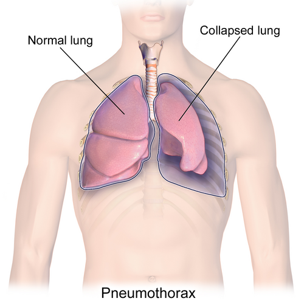
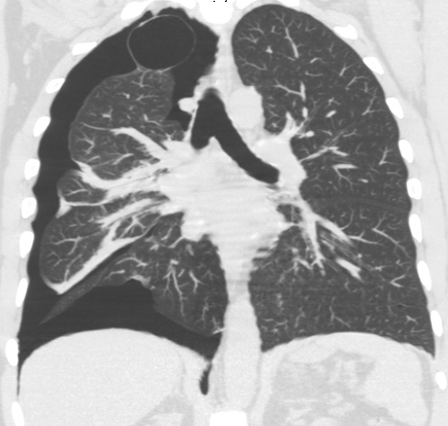

# PNEUMOTÓRAX

Para entender o pneumotórax, você não precisa decorar uma lista de causas. Você precisa entender uma única coisa: a **fisiologia do espaço pleural**.

O pulmão é um órgão elástico que quer, a todo custo, colapsar em direção ao hilo. O que o mantém aberto é a pressão negativa no espaço pleural (entre a pleura visceral e a parietal). Quando o ar entra nesse espaço, essa pressão negativa se perde. O pulmão, livre para seguir sua tendência natural, murcha.

Nesta aula, vamos dissecar desde o jovem longilíneo que chega com dor súbita até o paciente politraumatizado chocado. Se você entender o "porquê" de cada conduta, as questões de residência se tornarão intuitivas.

*Figura 1 - Ilustração anatômica do pneumotórax, demonstrando o acúmulo de ar no espaço pleural com colapso pulmonar resultante. Fonte: BruceBlaus, CC BY 3.0 | Wikimedia Commons*

## Fisiopatologia e Classificação

O ar pode chegar ao espaço pleural por três vias: através da pleura visceral (ruptura do parênquima), através da parede torácica (trauma penetrante) ou, raramente, por microrganismos produtores de gás.

### Pneumotórax Espontâneo Primário (PEP)

Ocorre em indivíduos sem doença pulmonar prévia conhecida. O perfil clássico de prova é o homem, jovem (20-30 anos), alto e magro (longilíneo).
**O porquê:** Nesses pacientes, o crescimento rápido do tórax na adolescência cria uma pressão negativa mais intensa nos ápices pulmonares, favorecendo a formação de *blebs* (pequenas bolhas subpleurais de < 1-2 cm). Quando um *bleb* rompe, o ar escapa. O tabagismo aumenta o risco em até 20 vezes.

### Pneumotórax Espontâneo Secundário (PES)

Aqui, o pulmão já é doente. A causa número 1 disparada é o **DPOC** (ruptura de bolhas enfisematosas). Outras causas importantes incluem Fibrose Cística, Pneumocistose (comum no HIV) e Tuberculose.
**Dica de Prova:** O PES é muito mais grave que o PEP. Por quê? Porque o paciente com DPOC não tem reserva funcional. Um pneumotórax de 15% que um jovem tolera bem pode levar um idoso enfisematoso à insuficiência respiratória aguda.

### Pneumotórax Traumático e Iatrogênico

O traumático pode ser aberto (ferimento por arma branca/fogo) ou fechado (contusão torácica com fratura de costela que perfura o pulmão).
O iatrogênico é aquele que nós, médicos, causamos. As bancas amam cobrar o pneumotórax após **acesso venoso central** (subclávia ou jugular interna), biópsia pleural ou ventilação mecânica com altas pressões (barotrauma).

*Figura 2 - Tomografia computadorizada de tórax demonstrando pneumotórax espontâneo com colapso parcial do pulmão e ar livre no espaço pleural. Fonte: Robertolyra, CC BY-SA 4.0 | Wikimedia Commons*

## Quadro Clínico e Exame Físico

O sintoma cardinal é a **dor torácica súbita e pleurítica** (piora com a inspiração), acompanhada de dispneia.

No exame físico, você encontrará a tríade clássica:

- **Murmúrio Vesicular (MV) diminuído ou abolido** no lado afetado.

- **Percussão com hipertimpanismo** (tem ar onde deveria ter parênquima).

- **Frêmito Toraco-Vocal (FTV) diminuído ou abolido**.

**Cuidado com o Diagnóstico Diferencial:**
Muitos alunos confundem pneumotórax com derrame pleural no exame físico. Veja a diferença fundamental na tabela abaixo:

| Sinal | Pneumotórax | Derrame Pleural | Atelectasia |
| --- | --- | --- | --- |
| **Percussão** | Hipertimpanismo | Macicez | Macicez |
| **FTV** | Diminuído | Diminuído | Aumentado (se brônquio pérvio) |
| **Traqueia** | Desviada para o lado oposto (se hipertensivo) | Desviada para o lado oposto (se volumoso) | Desviada para o mesmo lado |

**Exemplo Clínico:** Imagine um paciente de 22 anos, jogador de basquete, que sente uma "pontada" no peito enquanto descansava. Ele chega estável, mas você não ouve o pulmão direito. Se a questão disser que a percussão é timpânica, o diagnóstico está dado. Se disser que é maciça, pense em hemotórax ou derrame.

## Diagnóstico por Imagem

### Radiografia de Tórax (RX)

É o exame inicial padrão. O sinal clássico é a **linha da pleura visceral** separada da parede torácica, com ausência de trama vascular além dessa linha.
**Erro comum:** Pedir RX em expiração. Antigamente dizia-se que ajudava a ver pequenos pneumotórax, mas as diretrizes atuais (SBCT e BTS) recomendam RX em inspiração profunda. Se o pneumotórax for pequeno, ele aparecerá de qualquer forma.

### Ultrassonografia (USG) à Beira do Leito (e-FAST)

No trauma, o USG é superior ao RX deitado. O que procurar?

- **Ausência de deslizamento pleural (lung sliding):** As pleuras não "escorregam" uma na outra.

- **Sinal do Código de Barras (ou Estratosfera):** No modo M, você perde o aspecto de "beira de mar" e vê apenas linhas horizontais.

- **Ponto Pulmonar (Lung Point):** É o local exato onde o pulmão descolado encontra o pulmão encostado na parede. É **100% específico** para pneumotórax.

### Tomografia de Tórax (TC)

É o padrão-ouro. Não é necessária para o diagnóstico inicial, mas é fundamental para avaliar doenças subjacentes (como DPOC) e planejar cirurgia (verificar *blebs* no pulmão contralateral).

## O Pesadelo da Prova: Pneumotórax Hipertensivo

Este é o diagnóstico que você não pode errar, nem na prova, nem no plantão. Ocorre quando se forma um mecanismo de **válvula unidirecional**: o ar entra no espaço pleural na inspiração, mas não sai na expiração.

A pressão intrapleural sobe tanto que empurra o mediastino para o lado oposto. Isso comprime a veia cava superior e inferior, reduzindo o retorno venoso. O resultado? **Choque obstrutivo**.

**Sinais de Alerta (Diagnóstico Clínico):**

- Instabilidade hemodinâmica (Hipotensão, Taquicardia).

- Desvio da traqueia para o lado contralateral (sinal tardio).

- Turgência jugular (pelo impedimento do retorno venoso).

- Ausência de MV + Hipertimpanismo.

**A regra de ouro do Dr. Will:** Se você suspeita de pneumotórax hipertensivo, **NÃO peça RX**. O diagnóstico é clínico e o tratamento é imediato. Fazer o paciente esperar pelo RX é assinar o óbito dele.

### Manejo do Pneumotórax Hipertensivo

- **Descompressão Imediata (Toracocentese de Alívio):**

- Tradicionalmente: Agulha calibrosa no 2º espaço intercostal (EIC), linha hemiclavicular.

- **Atualização ATLS (10ª/11ª ed):** Em adultos, prefere-se o **5º EIC, anterior à linha axilar média** (mesmo local do dreno), devido à espessura da parede torácica. Em crianças, mantém-se o 2º EIC.

- **Tratamento Definitivo:** Drenagem torácica em selo d'água (sempre após a descompressão por agulha).

## Manejo do Pneumotórax Espontâneo

Aqui as condutas variam conforme o tamanho e os sintomas. Segundo a Sociedade Brasileira de Cirurgia Torácica (SBCT) e diretrizes internacionais:

### 1. Pequeno e Assintomático ( 2 cm) ou Sintomático (Dispneia/Dor)

- **Conduta:** Drenagem pleural ou aspiração simples com cateter.

- Em provas de residência, a resposta padrão para "pneumotórax volumoso" ainda é a **drenagem em selo d'água**.

### 3. Onde drenar?

O local clássico é o **"Triângulo de Segurança"**:

- Borda lateral do músculo peitoral maior.

- Borda anterior do músculo latíssimo do dorso (grande dorsal).

- Linha superior ao 5º espaço intercostal (para evitar lesão de fígado/baço).

- **Técnica:** O dreno deve passar **sobre a borda superior da costela inferior** para evitar o feixe vasculonervoso intercostal (VAN: Veia, Artéria, Nervo).

## Indicações de Tratamento Cirúrgico (VATS)

Muitas questões focam em quando parar de apenas drenar e chamar o cirurgião torácico para realizar a **Videotoracoscopia (VATS)** com bulectomia (retirada dos *blebs*) e pleurodese (colar as pleuras).

As indicações formais são:

- **Segundo episódio ipsilateral** (Recorrência).

- **Primeiro episódio contralateral** (Pneumotórax bilateral).

- **Fístula aérea persistente** (O dreno continua borbulhando por mais de 5 a 7 dias).

- **Falha de reexpansão pulmonar** após drenagem adequada.

- **Profissões de risco** (Pilotos, mergulhadores - onde um pneumotórax isolado seria fatal).

- **Pneumotórax hipertensivo no primeiro episódio** (algumas diretrizes consideram).

**Dica MedEvo:** Se o dreno está borbulhando intensamente e o pulmão não expande, pense em lesão de grande brônquio ou fístula broncopleural de alto débito. O manejo inicial pode exigir um segundo dreno, mas a cirurgia será necessária.

## Situações Especiais no Trauma

### Pneumotórax Aberto

É a "ferida soprante". O ar entra preferencialmente pelo buraco na parede do que pela traqueia (porque o buraco é maior e oferece menos resistência).

- **Tratamento Imediato:** Curativo de três pontas. Ele funciona como uma válvula: fecha na inspiração (impede o ar de entrar) e abre na expiração (deixa o ar sair).

- **Erro Crítico:** Fazer curativo de quatro pontas. Isso transforma um pneumotórax aberto em hipertensivo!

### Hemopneumotórax

Comum em traumas penetrantes. Se houver sangue e ar, o dreno deve ser calibroso (32-36 French) para evitar que coágulos obstruam o sistema. Se o débito inicial for > 1.500 ml ou > 200 ml/h nas primeiras 2-4 horas, a conduta é **Toracotomia de Urgência**.

## Complicações e Cuidados com o Dreno

O dreno de tórax deve estar sempre em **selo d'água**. O frasco deve ficar abaixo do nível do paciente.

- **Oscilação:** É normal. O líquido sobe na inspiração e desce na expiração (em ventilação espontânea). Se parar de oscilar, ou o pulmão expandiu totalmente, ou o dreno está obstruído/dobrado.

- **Borbulhamento:** Indica que ainda há ar saindo do pulmão (fístula ativa). Se o dreno borbulha continuamente, o pulmão não vai "colar".

- **Enfisema Subcutâneo:** Ar que disseca para debaixo da pele. Se for progressivo após a drenagem, o dreno pode estar mal posicionado ou ser insuficiente para o escape aéreo.

**Quando retirar o dreno?**

- Pulmão totalmente expandido no RX.

- Ausência de escape aéreo (parou de borbulhar) por 24h.

- Débito de líquido seroso baixo (< 100-200 ml em 24h).

## Tabelas Comparativas para Fixação

### Tabela 1: Classificação do Pneumotórax Espontâneo

| Tipo | Perfil do Paciente | Causa Base | Conduta Inicial |
| --- | --- | --- | --- |
| **Primário (PEP)** | Jovem, magro, fumante | Ruptura de *Blebs* apicais | Observação (se pequeno) ou Dreno |
| **Secundário (PES)** | Idoso, DPOC, Tabagista | Ruptura de bolhas de enfisema | Drenagem (quase sempre) |
| **Catamenial** | Mulher em idade fértil | Endometriose pleural (período menstrual) | Hormonioterapia + Cirurgia |

### Tabela 2: Manejo Inicial no Trauma (ATLS)

| Condição | Diagnóstico | Conduta Imediata |
| --- | --- | --- |
| **Pneumotórax Simples** | Clínico + RX | Drenagem em selo d'água (5º EIC) |
| **Pneumotórax Hipertensivo** | Clínico (Choque + MV abolido) | Descompressão por agulha (5º EIC) |
| **Pneumotórax Aberto** | Ferida torácica > 2/3 diâmetro traqueia | Curativo de 3 pontas |

### Tabela 3: Diagnóstico Diferencial de Dor Torácica Súbita e Dispneia

| Patologia | Exame Físico Chave | RX de Tórax |
| --- | --- | --- |
| **Pneumotórax** | Hipertimpanismo + MV abolido | Linha pleural visceral |
| **TEP** | Exame físico frequentemente normal | Frequentemente normal (ou sinais raros) |
| **Infarto (IAM)** | Sudorese, B3, sem alterações de percussão | Congestão pulmonar (se IC) |
| **Dissecção de Aorta** | Assimetria de pulsos/PA | Alargamento de mediastino |

## Pontos-Chave para Prova 🎯

- **Pneumotórax Hipertensivo:** O diagnóstico é **CLÍNICO**. Não espere RX. A tríade é hipotensão, turgência jugular e ausência de MV.

- **Local de Descompressão por Agulha (Adulto):** 5º espaço intercostal, entre a linha axilar anterior e média. O 2º EIC ainda é aceito em muitas provas baseadas em diretrizes antigas, mas o ATLS atualizou para o 5º.

- **Local de Drenagem Definitiva:** 5º EIC, anterior à linha axilar média (Triângulo de Segurança).

- **Pneumotórax Pequeno (< 2cm):** No paciente estável e sem doença pulmonar, a conduta é observação + O2 suplementar (que acelera a reabsorção).

- **Indicação de Cirurgia (VATS):** Recorrência ipsilateral, primeiro episódio contralateral, fístula aérea > 5-7 dias ou profissão de risco.

- **USG no Pneumotórax:** O achado mais específico é o **Ponto Pulmonar**. A ausência de *lung sliding* sugere, mas não confirma sozinha.

- **Curativo de 3 Pontas:** É a conduta imediata no pneumotórax aberto. Nunca feche os quatro lados.

- **DPOC e Pneumotórax:** É a causa mais comum de pneumotórax secundário. Esses pacientes toleram muito mal pequenos volumes de ar.

- **Pneumotórax Iatrogênico:** Sempre suspeitar após acesso venoso central em subclávia que evolui com dispneia súbita.

- **Sinal do Código de Barras:** No modo M do ultrassom, confirma a ausência de deslizamento pleural.

- **Fístula Aérea Persistente:** Borbulhamento contínuo no frasco de drenagem por mais de uma semana é indicação clássica de cirurgia.

- **Contraindicação Absoluta:** Nunca realize ventilação por pressão positiva (VPP) em um paciente com pneumotórax não drenado, pois isso pode transformá-lo em hipertensivo instantaneamente.

- **Atelectasia vs. Pneumotórax no RX:** Na atelectasia, o mediastino é puxado para o lado da lesão (ipsilateral). No pneumotórax hipertensivo, ele é empurrado para o lado oposto (contralateral).

- **Trígono da Ausculta:** Espaço anatômico delimitado pela borda medial da escápula, grande dorsal e trapézio; importante para acesso cirúrgico.

- **Drenagem em Selo d'Água:** O dreno deve estar submerso cerca de 2 cm na água para permitir a saída de ar e impedir o seu retorno.

 Cópia offline para consulta pessoal.
 Fonte original:
 [https://www.medevo.com.br/material-apoio/ler/609d628d-b361-4387-b64d-772e070a33e1](https://www.medevo.com.br/material-apoio/ler/609d628d-b361-4387-b64d-772e070a33e1)
