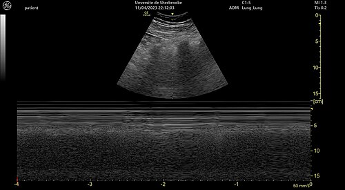

# POCUS: POINT-OF-CARE ULTRASOUND NA EMERGÊNCIA

O POCUS não é um "mini-exame radiológico". Se você começar sua prova pensando que o ultrassom à beira-leito serve para fazer laudos complexos, você já errou a questão. O POCUS é uma extensão do exame físico. É o "estetoscópio do século XXI". Ele responde a perguntas binárias: Tem líquido livre? Sim ou não. O ventrículo contrai? Sim ou não. A veia cava está colapsando? Sim ou não.

Diferente do ultrassom convencional realizado pelo radiologista, que busca um diagnóstico anatômico detalhado, o POCUS é focado, direcionado ao problema e realizado pelo próprio médico que assiste o paciente. Nas provas de residência e no dia a dia da MedEvo, o foco recai sobre protocolos estruturados que salvam vidas em minutos.

## Fundamentos e Física: O que você precisa saber para não ser enganado

Antes de colocar o transdutor no paciente, você precisa escolher a "arma" certa. As bancas adoram cobrar a indicação de cada transdutor, e o erro comum é confundir frequência com profundidade.

- **Transdutor Linear (Alta Frequência: 7-15 MHz):** Tem excelente resolução, mas pouca penetração. É a escolha para estruturas superficiais. Pense nele para: acesso venoso central, avaliação de pleura (pneumotórax) e pesquisa de TVP.

- **Transdutor Convexo/Curvilíneo (Baixa Frequência: 2-5 MHz):** Tem grande penetração, mas resolução menor. É o padrão-ouro para o abdome (eFAST) e para a aorta.

- **Transdutor Setorial/Phased Array (Baixa Frequência: 2-5 MHz):** Também tem grande penetração, mas sua "pegada" (footprint) é pequena, permitindo que o feixe passe entre as costelas. É o transdutor da ecocardiografia.

**Dica de Prova:** Se a questão mostrar uma imagem de pleura com alta definição, o transdutor usado foi o linear. Se mostrar o fígado e o rim, foi o convexo.

### Artefatos: Onde o aluno se perde

No POCUS, o artefato é seu amigo. No pulmão, por exemplo, quase tudo o que vemos são artefatos, pois o ultrassom não atravessa o ar.

- **Sombra Acústica Posterior:** Ocorre quando o feixe encontra uma estrutura muito densa (cálculo, osso). O feixe é refletido e fica tudo preto atrás.

- **Reforço Acústico Posterior:** O feixe atravessa um líquido (bexiga, cisto) com facilidade e chega com "mais força" no tecido logo atrás, que fica mais brilhante (branco). Isso ajuda a diferenciar um cisto de um tumor sólido.

- **Artefato em Espelho:** Clássico acima do diafragma. O ultrassom reflete no diafragma e projeta a imagem do fígado acima dele. Se você vir "fígado" acima do diafragma, não há derrame pleural. Se houver líquido (derrame), o espelho desaparece.

*Figura 2 - Sinal da praia (seashore sign) na ultrassonografia pulmonar em modo M, indicando deslizamento pleural normal e descartando pneumotórax. Fonte: Tinss, CC BY-SA 4.0 | Wikimedia Commons*

## POCUS no Trauma: O Protocolo eFAST

O eFAST (Extended Focused Assessment with Sonography for Trauma) é, sem dúvida, o tema de POCUS mais cobrado em provas. O objetivo aqui é identificar líquido livre (sangue) nas cavidades serosas e pneumotórax.

### As Janelas do eFAST

O exame clássico tinha 4 janelas. O "e" (extended) adicionou a avaliação pulmonar bilateral.

- **Subxifoide (Pericárdio):** Avalia tamponamento cardíaco. O líquido (sangue) aparece como uma faixa preta (anecoica) entre o miocárdio e o pericárdio fibroso.

- **Quadrante Superior Direito (Espaço de Morison):** Entre o fígado e o rim direito. É o local mais sensível para detectar líquido livre intraperitoneal no paciente em decúbito dorsal. O líquido tende a se acumular ali devido à gravidade e à anatomia das goteiras paracólicas.

- **Quadrante Superior Esquerdo (Espaço Esplenorrenal):** Entre o baço e o rim esquerdo. Cuidado: o líquido aqui costuma se acumular *acima* do baço (espaço periesplênico) e não apenas entre o baço e o rim.

- **Suprapúbica (Pelve):** Avalia o fundo de saco de Douglas (em mulheres) ou o espaço retovesical (em homens). A bexiga deve estar cheia para servir de janela acústica.

- **Pulmonar (Bilateral):** Pesquisa de pneumotórax e hemotórax.

### Quando o eFAST define a conduta?

Aqui está a maior pegadinha de prova. O eFAST não é para todo mundo.

- **Paciente Instável + eFAST Positivo:** Bloco cirúrgico (Laparotomia). Você não perde tempo com Tomografia (TC).

- **Paciente Estável + eFAST Positivo:** Segue para TC para graduar a lesão e decidir se o tratamento pode ser conservador.

- **Paciente Instável + eFAST Negativo:** Procure outra causa para o choque (pelve, retroperitônio, perdas externas).

**Erro Clássico:** Achar que o eFAST negativo exclui lesão de víscera maciça ou oca. O eFAST detecta **líquido**, não a lesão em si. Um trauma esplênico grau I ou uma perfuração intestinal precoce podem ter eFAST negativo.

| Achado no eFAST | Significado Clínico | Conduta no Instável |
| --- | --- | --- |
| Faixa anecoica no Morison | Hemoperitônio | Laparotomia |
| Espaço pericárdico com líquido | Tamponamento | Janela pericárdica/Toracotomia |
| Ausência de deslizamento pleural | Sugestivo de Pneumotórax | Descompressão/Dreno |
| Sinal da Sinusoide (M-mode) | Derrame Pleural | Drenagem se volumoso |

## POCUS Pulmonar: O Protocolo BLUE

O Dr. Daniel Lichtenstein revolucionou a emergência com o Protocolo BLUE (Bedside Lung Ultrasound in Emergency). Ele permite diagnosticar a causa da insuficiência respiratória aguda com precisão superior ao raio-X de tórax.

### Os Sinais Fundamentais

Para entender o pulmão, você precisa dominar três conceitos:

- **Deslizamento Pleural (Lung Sliding):** É o movimento da pleura visceral contra a parietal. Se tem deslizamento, as pleuras estão encostadas. Se não tem, ou há ar entre elas (pneumotórax) ou o pulmão não está ventilando (apneia, intubação seletiva).

- **Linhas A:** São linhas horizontais, paralelas à pleura. São artefatos de repetição. Significam "pulmão seco" (ar). Presentes no pulmão normal, na asma, no DPOC e no pneumotórax.

- **Linhas B:** São linhas verticais, que nascem na pleura e vão até o fim da tela, apagando as linhas A. Parecem "caudas de cometa" ou "raios laser". Significam "pulmão úmido" (edema intersticial). Para ser patológico, precisamos de > 3 linhas B por campo intercostal.

### O Raciocínio do Protocolo BLUE

Imagine um paciente com dispneia súbita. Você coloca o transdutor:

- **Perfil A (Sliding presente + Linhas A):** Pulmão "seco". Pense em DPOC ou Asma. Se houver sinais de TVP no POCUS de perna, pense em TEP.

- **Perfil B (Sliding presente + Linhas B difusas):** Pulmão "úmido". Diagnóstico: Edema Agudo de Pulmão (EAP) cardiogênico.

- **Perfil B' (Sliding ausente + Linhas B):** Sugere pneumonia ou SDRA.

- **Perfil A' (Sliding ausente + Linhas A):** Aqui mora o perigo. Se não desliza e só tem ar, pode ser Pneumotórax. Para confirmar, você deve buscar o **Ponto de Pulmão (Lung Point)** — o local exato onde o pneumotórax começa e o pulmão volta a encostar na parede. O Lung Point é 100% específico para pneumotórax.

**Dica do Dr. Will:** Em prova, se falarem em "Sinal do Código de Barras" ou "Sinal da Estratosfera" no Modo M, marque Pneumotórax sem medo. O sinal normal (com deslizamento) é o "Sinal da Praia".

## POCUS no Choque: O Protocolo RUSH

O protocolo RUSH (Rapid Ultrasound in Shock) é a abordagem sistemática do paciente com hipotensão de causa indiferenciada. Ele avalia três componentes: A Bomba, o Tanque e os Tubos.

### 1. A Bomba (Coração)

Você avalia três coisas rapidamente:

- **Derrame Pericárdico:** Causa de choque obstrutivo.

- **Contratilidade do VE:** Se o ventrículo "bate" bem, o choque provavelmente não é cardiogênico. Se ele mal se mexe, temos a causa.

- **Relação VD/VE:** Se o ventrículo direito está muito dilatado (maior que o esquerdo), pense em TEP maciço (choque obstrutivo).

### 2. O Tanque (Volume)

- **Veia Cava Inferior (VCI):** Avaliamos o diâmetro e a colapsabilidade com a respiração.

- VCI fina (< 1,5 cm) e que colapsa totalmente: Choque hipovolêmico ou distributivo (sepse).

- VCI larga (> 2,5 cm) e que não colapsa (pletórica): Choque cardiogênico ou obstrutivo (tamponamento/TEP).

- **eFAST:** Procure por perdas de volume (sangue) ou "vazamentos" (ascite na sepse).

- **Pulmão:** Procure por linhas B (hipervolemia).

### 3. Os Tubos (Grandes Vasos)

- **Aorta Abdominal:** Procure por Aneurisma de Aorta Abdominal (AAA) roto. Um diâmetro > 3 cm define aneurisma. Se o paciente está chocado e tem AAA, a conduta é cirurgia.

- **TVP:** Pesquisa de trombose em veias femorais e poplíteas para corroborar a suspeita de TEP.

| Componente RUSH | Achado | Tipo de Choque Provável |
| --- | --- | --- |
| Bomba | Hipercontratilidade ("Kissing papillary muscles") | Hipovolêmico / Distributivo |
| Bomba | Hipocontratilidade global | Cardiogênico |
| Tanque | VCI colapsável + Pulmão seco | Hipovolêmico |
| Tanque | VCI pletórica + Linhas B | Cardiogênico |
| Tubos | Aorta > 3 cm | Ruptura de AAA (Hipovolêmico) |

## POCUS na Parada Cardiorrespiratória (PCR)

O uso do ultrassom durante a ressuscitação cardiopulmonar (RCP) deve ser extremamente criterioso. O maior erro é prolongar o tempo de interrupção das compressões para "olhar o monitor".

A diretriz da AHA e os consensos brasileiros de medicina de emergência recomendam o uso do POCUS apenas durante a checagem de ritmo (máximo 10 segundos). O foco é identificar causas reversíveis (os H's e T's):

- **Tamponamento cardíaco:** Pericardiocentese imediata.

- **Pneumotórax hipertensivo:** Descompressão torácica.

- **Hipovolemia severa:** Ventrículo esquerdo "vazio" e hiperdinâmico.

- **TEP maciço:** Ventrículo direito dilatado.

Além disso, o POCUS ajuda a diferenciar a **Atividade Elétrica Sem Pulso (AESP) verdadeira** da **Pseudo-AESP**. Na Pseudo-AESP, existe atividade mecânica cardíaca, mas ela é insuficiente para gerar pulso palpável. Esses pacientes têm melhor prognóstico e podem se beneficiar de suporte inotrópico e volume agressivo.

## Procedimentos Guiados por POCUS: Segurança em Primeiro Lugar

Se você ainda faz acesso venoso central "no escuro" (por referência anatômica), você está praticando uma medicina do passado. As diretrizes atuais (incluindo as de segurança do paciente) colocam o ultrassom como padrão-ouro para acessos centrais, especialmente na veia jugular interna.

### Vantagens do Acesso Guiado

- Redução drástica de complicações (pneumotórax, punção arterial acidental).

- Maior taxa de sucesso na primeira tentativa.

- Identificação de variações anatômicas ou tromboses prévias.

**Técnica:**

- **Eixo Curto (Transversal):** Você vê a veia como um círculo. É mais fácil para manter a agulha centralizada, mas você não vê a ponta da agulha o tempo todo.

- **Eixo Longo (Longitudinal):** Você vê a veia em toda a sua extensão. Permite visualizar a agulha entrando no vaso, mas é mais difícil manter o feixe alinhado.

**Dica de Ouro:** Para diferenciar a veia da artéria no pescoço, use a compressibilidade. A veia jugular colapsa com uma leve pressão do transdutor; a artéria carótida é pulsátil e resistente à compressão. Não confie apenas na cor do Doppler (que pode ser ajustada) ou na pulsação (em estados de choque, a artéria pulsa pouco e a veia pode pulsar por insuficiência tricúspide).

## Avaliação da Aorta e TVP

### Aneurisma de Aorta Abdominal (AAA)

Na emergência, o paciente com dor abdominal ou lombar e hipotensão deve ser submetido ao POCUS de aorta.

- **Onde medir:** Da parede externa até a parede externa.

- **Valores:** Aorta normal < 2 cm. Ectasia 2-3 cm. **Aneurisma > 3 cm**.

- Risco de ruptura aumenta exponencialmente acima de 5-5,5 cm.

- **Atenção:** O POCUS é ótimo para ver o aneurisma, mas ruim para ver a ruptura (o sangue retroperitoneal é difícil de visualizar). Se tem aneurisma + hipotensão, presuma ruptura.

### Trombose Venosa Profunda (TVP)

O protocolo de 2 pontos (ou 3 pontos) é altamente eficaz. Você comprime a veia femoral comum (na virilha) e a veia poplítea (atrás do joelho).

- **Critério Diagnóstico:** Ausência de colapsabilidade completa da veia sob compressão direta.

- Se a veia não "fecha" totalmente quando você aperta com o transdutor, há um trombo ali.

## Situações Especiais e Limitações

### O Paciente Obeso

O excesso de tecido adiposo atenua o feixe de ultrassom. Nesses casos, você deve:

- Usar transdutores de frequência mais baixa.

- Aumentar o "Gain" (ganho) do aparelho.

- Aplicar mais pressão (se tolerado) para diminuir a distância entre o transdutor e o órgão.

### Enfisema Subcutâneo

Este é o "criptonita" do POCUS pulmonar. O ar no tecido subcutâneo impede que o feixe chegue à pleura. Se o paciente tem enfisema subcutâneo extenso, o POCUS pulmonar é tecnicamente impossível (inconclusivo).

### Gestantes

O eFAST é seguro e indicado no trauma em gestantes. A principal mudança é o deslocamento cefálico das vísceras abdominais pelo útero gravídico, o que pode exigir um posicionamento um pouco mais alto do transdutor para acessar o espaço de Morison.

## Pontos-Chave para Prova

- **Transdutor Linear:** Alta frequência, estruturas superficiais (acesso venoso, pleura, TVP).

- **Transdutor Convexo:** Baixa frequência, estruturas profundas (abdome, aorta).

- **eFAST Positivo no Instável:** Indicação de Laparotomia exploradora imediata.

- **eFAST Negativo:** NÃO exclui lesão de víscera oca ou sangramento retroperitoneal.

- **Sinal do Deslizamento Pleural (Lung Sliding):** Presente no pulmão normal; ausente no pneumotórax.

- **Ponto de Pulmão (Lung Point):** Achado 100% específico para pneumotórax no POCUS.

- **Linhas B:** Patológicas se > 3 por campo; indicam síndrome intersticial (ex: Edema Agudo de Pulmão).

- **Protocolo RUSH:** Avalia Bomba (Coração), Tanque (VCI/Líquido livre) e Tubos (Aorta/TVP).

- **VCI Pletórica (> 2,5 cm e sem colapso):** Sugere choque cardiogênico ou obstrutivo.

- **VCI Colapsável:** Sugere choque hipovolêmico ou distributivo.

- **Aneurisma de Aorta Abdominal:** Diâmetro > 3 cm (medido de parede externa a parede externa).

- **Diagnóstico de TVP:** Ausência de compressibilidade da veia.

- **Pseudo-AESP:** Presença de atividade mecânica cardíaca no POCUS sem pulso palpável; melhor prognóstico que AESP verdadeira.

- **Sinal da Estratosfera/Código de Barras:** Representação do pneumotórax no Modo M.

- **Sinal da Praia:** Representação do pulmão normal (com deslizamento) no Modo M.

- **Erro a evitar:** Nunca interromper as compressões torácicas por mais de 10 segundos para realizar o POCUS na PCR.

- **Contraindicação Absoluta:** Não existe contraindicação biológica ao ultrassom, mas a contraindicação clínica é retardar uma terapia definitiva (ex: cirurgia no paciente com ferimento por arma branca e choque óbvio) para fazer o exame. 🩺

 Cópia offline para consulta pessoal.
 Fonte original:
 [https://www.medevo.com.br/material-apoio/ler/b1c51d6e-f893-4c3b-835c-0c2be7b2dd09](https://www.medevo.com.br/material-apoio/ler/b1c51d6e-f893-4c3b-835c-0c2be7b2dd09)
