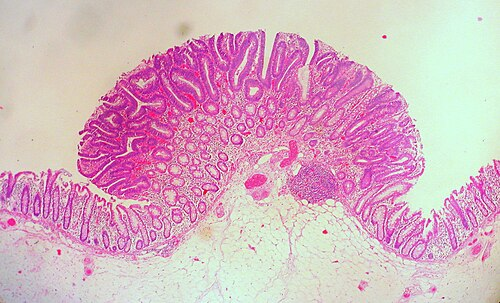
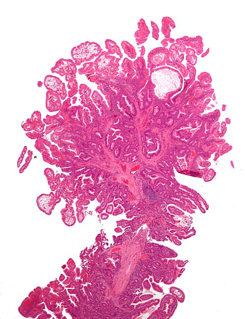

# PÓLIPOS E SÍNDROMES POLIPOIDES

Para entender pólipos, você precisa parar de vê-los apenas como "bolinhas na mucosa". Como cirurgião, você deve olhar para um pólipo e enxergar um cronômetro: alguns correm rápido para a malignidade, outros estão parados e outros nem são corredores de verdade. Nas provas de residência, o examinador quer saber se você sabe quando operar, quando apenas observar e quando o pólipo é apenas a "ponta do iceberg" de uma síndrome genética complexa.

## Pólipos Colorretais: O Campo de Batalha Principal

A imensa maioria das questões de prova foca no cólon. Por quê? Porque é aqui que o rastreamento salva vidas através da interrupção da sequência adenoma-carcinoma.

*Figura 1 - Adenoma tubular do cólon, o tipo mais comum de pólipo neoplásico colorretal, identificado como achado incidental em espécime de colectomia. Fonte: Ed Uthman, CC BY 2.0 | Wikimedia Commons*

## Classificação e Potencial de Malignidade

Nem todo pólipo vai virar câncer. Dividimos didaticamente em:

- **Não neoplásicos:** Hiperplásicos (os mais comuns, geralmente pequenos e no reto/sigmoide), inflamatórios (pseudopólipos da DII) e hamartomatosos.

- **Neoplásicos:** Adenomas (Tubular, Tubuloviloso e Viloso) e as Lesões Serrilhadas.

Aqui entra o primeiro "porquê" fundamental: **Por que o adenoma viloso é mais perigoso que o tubular?**
Não é apenas um nome bonito. O componente viloso tem projeções digitiformes que aumentam drasticamente a área de superfície da mucosa. Mais células se dividindo em uma área maior significam mais chances de mutações aleatórias.

**Dica de Prova:** A tríade de risco para um adenoma malignizar é: **Tamanho (> 2cm), Histologia (Viloso) e Grau de Displasia (Alto grau).** Se a questão citar um adenoma viloso de 3 cm, o examinador está gritando "Câncer!" no seu ouvido.

### O Pólipo com Câncer: Quando a Ressecção Endoscópica Basta?

Este é um erro clássico de alunos: achar que, se tem adenocarcinoma no pólipo, a colectomia é obrigatória. **Mentira.**

Segundo a Sociedade Brasileira de Coloproctologia, se o pólipo for **pediculado** e o adenocarcinoma estiver restrito à cabeça do pólipo (nível 1, 2 ou 3 de Haggitt), sem invasão angiolinfática e com margem livre (> 2mm), a colonoscopia foi curativa.

**Por que a mucosa do cólon é "segura"?** Diferente do estômago, a mucosa do cólon não possui vasos linfáticos ou sanguíneos na camada acima da muscular da mucosa. Portanto, se a displasia ou o carcinoma *in situ* está restrito à mucosa, o risco de metástase é **zero**. Guarde isso: carcinoma *in situ* no cólon não metastatiza.

### Seguimento Pós-Polipectomia

As bancas adoram cobrar prazos. Vamos simplificar a regra atual (baseada nas diretrizes de 2020/2024):

- **1-2 adenomas tubulares pequenos (< 10mm) com displasia de baixo grau:** Colonoscopia em 7 a 10 anos (algumas bancas ainda usam 5 anos, mas a tendência é o aumento do intervalo).

- **3-4 adenomas pequenos:** 3 a 5 anos.

- **5-10 adenomas, OU adenoma > 10mm, OU componente viloso, OU displasia de alto grau:** Colonoscopia em 3 anos.

- **Mais de 10 adenomas em uma única sessão:** 1 ano (e pense em síndromes hereditárias!).

- **Pólipo ressecado em pedaços (piecemeal):** 6 meses para garantir que não sobrou nada.

| Achado na Colonoscopia Inicial | Intervalo para Seguimento |
| --- | --- |
| 1-2 adenomas tubulares < 10mm | 7-10 anos |
| 3-10 adenomas OU > 10mm OU Viloso | 3 anos |
| > 10 adenomas | 1 ano |
| Ressecção incompleta ou Piecemeal | 6 meses |

*Figura 2 - Micrografia de pólipo hamartomatoso da síndrome de Peutz-Jeghers, mostrando a arquitetura arborescente característica com músculo liso. Coloração H&E. Fonte: Nephron, CC BY-SA 3.0 | Wikimedia Commons*

## Síndromes Polipoides Hereditárias: A Ponta do Iceberg

Aqui o Dr. Will sempre lembra: se o paciente é jovem e tem "pólipos demais", a genética está gritando.

### Polipose Adenomatosa Familiar (PAF)

É o protótipo da síndrome hereditária (autossômica dominante, mutação no gene APC).

- **O diagnóstico:** > 100 pólipos adenomatosos no cólon.

- **O destino:** 100% de chance de câncer colorretal até os 40-50 anos se não operado.

- **A conduta:** Proctocolectomia total com bolsa ileal (IPAA) é o padrão-ouro.

**Cuidado com a pegadinha:** A colectomia trata o risco de câncer de cólon, mas o paciente com PAF continua tendo risco de outras coisas! A principal causa de morte pós-colectomia em pacientes com PAF são os **Tumores Desmóides** (neoplasias de tecidos moles que não metastatizam, mas destroem localmente) e o **Câncer Duodenal/Periampular**. Por isso, o seguimento com EDA é obrigatório.

### Variantes da PAF que caem em prova:

- **Síndrome de Gardner:** PAF + Manifestações extraintestinais (Osteomas de mandíbula, cistos sebáceos, dentes supranumerários e tumores desmóides).

- **Síndrome de Turcot:** PAF + Tumores do SNC (Meduloblastoma é o mais clássico na PAF).

### Síndrome de Peutz-Jeghers

Aqui os pólipos são **hamartomatosos** (crescimento excessivo de tecidos nativos, com aquela árvore de músculo liso na histologia).

- **Clínica clássica:** Manchas melanóticas (hiperpigmentação) em lábios e mucosa bucal + Pólipos em todo o TGI (principalmente intestino delgado).

- **Complicação comum:** Intussuscepção intestinal (o pólipo serve de "cabeça" para o intestino entrar dentro de si mesmo).

### Síndrome de Lynch (HNPCC)

Embora o nome seja "Câncer Colorretal Hereditário Não Polipoide", ela entra aqui para o diagnóstico diferencial. Não há centenas de pólipos, mas sim uma progressão adenoma-carcinoma acelerada (o pólipo vira câncer em 1-2 anos, enquanto na população geral leva 10 anos).

- **Critérios de Amsterdã II (3-2-1):** 3 familiares com câncer do espectro Lynch (cólon, endométrio, ureter, delgado), 2 gerações, 1 diagnosticado antes dos 50 anos.

## Pólipos de Vesícula Biliar: Operar ou Não?

Este é um tema quente em cirurgia geral. O medo é o Adenocarcinoma de Vesícula, um dos tumores mais agressivos que existem.

**A regra de ouro (Diretriz Europeia/Brasileira):**

- **Pólipo > 10 mm:** Colecistectomia (risco de malignidade é alto).

- **Pólipo sintomático (dor tipo biliar):** Colecistectomia (independente do tamanho).

- **Pólipo entre 6 e 9 mm + Fatores de Risco:** Colecistectomia.

- *Fatores de risco:* Idade > 50 anos, etnia indiana, pólipo séssil (base larga), espessamento da parede da vesícula > 4mm.

- **Pólipo < 5 mm e assintomático:** Apenas acompanhamento com USG (6 meses, depois anual). Se crescer > 2mm em um ano, opere.

**Diferencial importante:** A maioria dos "pólipos" na vesícula são, na verdade, **pólipos de colesterol** (colesterolose). Eles são múltiplos, pequenos e não têm potencial maligno. O problema é que o USG não consegue diferenciar com 100% de certeza de um adenoma real. Por isso usamos o tamanho como *proxy*.

## Pólipos Gástricos: O Efeito dos IBPs

Com o uso em massa de Omeprazol e similares, os **Pólipos de Glândulas Fúndicas** tornaram-se extremamente comuns.

- **Pólipos de Glândulas Fúndicas:** Geralmente benignos, associados ao uso crônico de IBP. Se forem esporádicos e pequenos, não precisam de biópsia ou retirada (a menos que > 1cm).

- **Pólipos Hiperplásicos Gástricos:** Associados à inflamação crônica (H. pylori, gastrite atrófica). Têm um pequeno risco de malignização. **Conduta:** Erradicar H. pylori e retirar se > 0,5 cm.

- **Adenomas Gástricos:** São lesões pré-malignas reais. Devem ser sempre ressecados.

## Tumores do Intestino Delgado e Apêndice

O intestino delgado é a "terra de ninguém". É difícil de acessar e os tumores são raros, o que atrasa o diagnóstico.

### Neoplasias do Delgado

- **Benigna mais comum:** Adenoma (frequentemente no duodeno/periampular).

- **Maligna mais comum:** Adenocarcinoma (principalmente no duodeno e jejuno proximal).

- **Tumor Neuroendócrino (Carcinóide):** Mais comum no íleo distal. Produzem serotonina. Se houver metástase hepática, surge a **Síndrome Carcinóide** (fogachos, diarreia, lesão valvar direita).

### Neoplasias do Apêndice (Cai muito!)

Imagine que você está fazendo uma apendicectomia por apendicite e o patologista manda o laudo: "Tumor". E agora?

- **Tumor Neuroendócrino (Carcinóide):** É o tumor mais comum do apêndice.

- Se < 1 cm e na ponta do apêndice: Apendicectomia simples basta.

- Se > 2 cm, ou invasão do mesoapêndice, ou na base do apêndice: **Hemicolectomia direita.**

- **Adenocarcinoma de Apêndice:** Não importa o tamanho. O tratamento é **Hemicolectomia Direita**. O apêndice é estreito, o tumor invade a parede e os linfonodos precocemente.

- **Mucocele e Pseudomixoma Peritoneal:** Se o apêndice estiver distendido por muco, cuidado! Se romper durante a cirurgia e as células forem neoplásicas (Neoplasia Mucinosa de Baixo Grau - LAMN), o paciente pode desenvolver Pseudomixoma Peritoneal ("barriga de gelatina"). O tratamento envolve cirurgia citorredutora e quimioterapia intraperitoneal hipertérmica (HIPEC).

## GIST: O Tumor Estromal

O GIST (Gastrointestinal Stromal Tumor) não nasce da mucosa, mas das **Células Intersticiais de Cajal** (o marcapasso do intestino) na parede do órgão.

- **Localização:** Estômago (60-70%) é o local mais comum.

- **Marcador imuno-histoquímico:** **CD117 (c-KIT)** positivo em 95% dos casos.

- **Tratamento:** Ressecção cirúrgica com margens (não precisa de linfadenectomia radical, pois raramente dá metástase linfonodal).

- **Terapia Alvo:** **Imatinibe** (Gleevec). Usado como adjuvante se o risco de recorrência for alto (baseado no tamanho do tumor e índice mitótico).

No MedEvo, sempre reforçamos: o GIST é um tumor "submucoso". Na endoscopia, você verá uma abaulamento com mucosa íntegra por cima. Se houver uma umbilicação central, suspeite de sangramento.

## Tabelas Comparativas para Fixação

### Tabela 1: Pólipos Colorretais e Risco de Câncer

| Tipo de Pólipo | Potencial Maligno | Conduta |
| --- | --- | --- |
| Hiperplásico (Reto) | Nulo | Observar ou ressecar se > 10mm |
| Adenoma Tubular | Baixo/Médio | Ressecção endoscópica completa |
| Adenoma Viloso | Alto | Ressecção endoscópica ou cirúrgica |
| Lesão Serrilhada | Médio/Alto | Ressecção (via de instabilidade de microssatélites) |

### Tabela 2: Síndromes Hereditárias

| Síndrome | Gene | Principal Achado | Risco de Câncer Colorretal |
| --- | --- | --- | --- |
| PAF | APC | > 100 adenomas | 100% |
| Peutz-Jeghers | STK11 | Hamartomas + Manchas | Aumentado (30-40%) |
| Lynch | MMR (MLH1, MSH2) | Poucos pólipos, evolução rápida | 80% |
| Cowden | PTEN | Hamartomas múltiplos | Baixo (em relação às outras) |

### Tabela 3: Conduta no Tumor Carcinóide de Apêndice

| Tamanho | Localização | Conduta |
| --- | --- | --- |
| < 1 cm | Ponta/Corpo | Apendicectomia |
| 1 - 2 cm | Ponta/Corpo | Apendicectomia (individualizar se invasão de meso) |
| > 2 cm | Qualquer local | Hemicolectomia Direita |
| Qualquer tamanho | Base (ceco) | Hemicolectomia Direita |

## Pontos-Chave para Prova

- **Displasia de alto grau restrita à mucosa (cólon):** Não metastatiza. Ressecção endoscópica com margem livre é curativa.

- **Pólipo de Vesícula:** Operar se > 10mm OU sintomático OU séssil OU > 50 anos.

- **PAF:** O tratamento é Proctocolectomia Total. A colectomia simples (preservando o reto) exige vigilância semestral do reto remanescente.

- **Síndrome de Gardner:** Lembre de "Dentes e Ossos" (Osteomas e dentes supranumerários).

- **Câncer de Cólon Direito:** O quadro clínico clássico é anemia ferropriva e massa palpável. Cólon esquerdo obstrui; reto sangra (hematoquezia).

- **Adenocarcinoma de Apêndice:** Sempre Hemicolectomia Direita, independente do tamanho.

- **GIST:** CD117 positivo. Tratamento com Imatinibe se alto risco (mitoses > 5/50 HPF).

- **Pólipos de Glândulas Fúndicas:** Associados ao uso de IBP; geralmente benignos.

- **Pseudomixoma Peritoneal:** Origem mais comum é o apêndice cecal (neoplasia mucinosa).

- **Seguimento Pós-Polipectomia:** Se o pólipo era viloso ou > 1cm, próxima colonoscopia em 3 anos.

- **Síndrome de Peutz-Jeghers:** Pólipos hamartomatosos. Risco de intussuscepção é a complicação aguda clássica.

- **Linite Plástica (Borrmann 4):** Câncer gástrico infiltrativo difuso. Estômago "em bota de vinho" ou rígido.

- **Hemangioma:** Tumor benigno hepático ou intestinal com aspecto de "novelo de lã" vascular.

- **Cisto de Gardner:** Não confunda com a síndrome! É um remanescente do ducto de Gartner na parede vaginal.

- **O que NÃO fazer:** Não indicar colectomia para carcinoma *in situ* em pólipo de cólon completamente ressecado. Não ignorar pólipo de vesícula de 7mm em paciente de 60 anos (tem fator de risco, deve operar).

 Cópia offline para consulta pessoal.
 Fonte original:
 [https://www.medevo.com.br/material-apoio/ler/cecc1b6c-19db-4287-ae7b-8d44b04a8517](https://www.medevo.com.br/material-apoio/ler/cecc1b6c-19db-4287-ae7b-8d44b04a8517)
