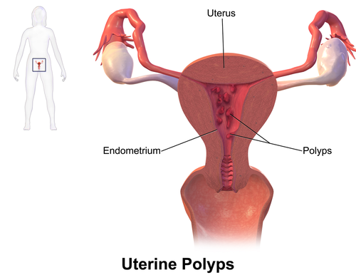
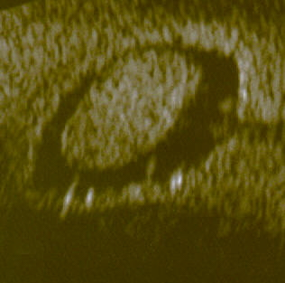

# PÓLIPOS ENDOMETRIAIS

Para entender pólipos endometriais, você precisa parar de pensar neles apenas como "bolinhas no útero". Como professor, vejo muitos alunos decorando condutas sem entender a base biológica, e é aí que as bancas de residência pegam você. O pólipo é, essencialmente, uma projeção exofítica do endométrio, composta por glândulas, estroma e vasos sanguíneos, recoberta por epitélio.

O que diferencia um pólipo de uma hiperplasia global? A focalidade. O pólipo é uma resposta proliferativa focal. Se você entender que o motor dessa proliferação quase sempre é o estrogênio, você já matou metade das questões de fatores de risco.

*Figura 1 - Ilustração anatômica de pólipos endometriais no interior da cavidade uterina, demonstrando sua morfologia pediculada característica. Fonte: BruceBlaus, CC BY-SA 4.0 | Wikimedia Commons*

## Epidemiologia e Fatores de Risco

A prevalência dos pólipos é variável, mas o que importa para a sua prova é o perfil da paciente. Eles são mais comuns entre a quarta e a quinta décadas de vida, mas o "pico" de preocupação clínica ocorre na pós-menopausa.

Por que algumas mulheres desenvolvem e outras não? Aqui entra o conceito de hiperestrogenismo, seja ele absoluto ou relativo.

- **Idade:** O risco aumenta progressivamente até a menopausa.

- **Obesidade:** O tecido adiposo converte androstenediona em estrona (via aromatase). Mais estrogênio circulante, mais estímulo endometrial.

- **Hipertensão Arterial (HAS) e Diabetes:** Frequentemente citados em provas como fatores associados. Embora o mecanismo exato da HAS não seja totalmente claro, a associação epidemiológica é robusta o suficiente para ser cobrada.

- **Tamoxifeno:** Este é o "queridinho" das bancas. O tamoxifeno é um Modulador Seletivo do Receptor de Estrogênio (SERM). Ele é antagonista na mama (por isso trata o câncer), mas é AGONISTA no endométrio. Pacientes em uso de tamoxifeno têm um risco significativamente maior de pólipos, hiperplasias e carcinoma.

- **Terapia de Reposição Hormonal (TRH):** Especialmente se for estrogênio sem oposição de progesterona.

**Dica de Prova:** Se a questão trouxer uma paciente obesa, hipertensa e em uso de tamoxifeno com sangramento, o examinador está gritando "Pólipo ou Câncer de Endométrio" no seu ouvido.

## Fisiopatologia: O "Porquê" da Lesão

Diferente do mioma, que nasce do miométrio (músculo), o pólipo nasce da camada basal do endométrio. Ele possui um eixo vascular central, o que é fundamental para o diagnóstico no Doppler.

Por que ele sangra? O tecido polipoide é estruturalmente frágil. Os vasos são congestos e o tecido glandular pode sofrer alterações degenerativas, levando ao sangramento uterino anormal (SUA). Além disso, o pólipo pode interferir na contratilidade uterina e na fibrinólise local.

No contexto da infertilidade, o pólipo atua como um "corpo estranho" ou gera um ambiente inflamatório (aumento de citocinas e glóbulos brancos) que dificulta a implantação embrionária. É por isso que, na MedEvo, sempre reforçamos: pólipo em paciente infértil tem indicação cirúrgica, independentemente do tamanho.

*Figura 2 - Ultrassonografia transvaginal demonstrando pólipo endometrial, achado frequente na investigação de sangramento uterino anormal. Fonte: Ekem, Domínio Público | Wikimedia Commons*

## Quadro Clínico: Do Assintomático ao Sangramento "Sentinela"

A maioria dos pólipos é assintomática e descoberta em exames de rotina. No entanto, quando há sintomas, o mais comum é o Sangramento Uterino Anormal (SUA).

### Sangramento na Pré-menopausa

Geralmente se manifesta como spotting intermenstrual (sangramento entre as regras) ou menorragia (aumento do fluxo). Se o pólipo for grande ou estiver saindo pelo colo (pólipo pediculado prolapsado), pode haver sinusorragia (sangramento pós-coito).

### Sangramento na Pós-menopausa

Este é o cenário de maior alerta. Qualquer sangramento na pós-menopausa deve ser considerado câncer de endométrio até que se prove o contrário. O pólipo é a causa benigna mais comum, mas ele pode esconder ou sofrer transformação maligna.

### Infertilidade

Muitas vezes o único sinal é a dificuldade de engravidar. O pólipo ocupa espaço e altera o microambiente endometrial.

**Exemplo Clínico:** Paciente de 32 anos, nuligesta, queixa-se de sangramento escuro em pequena quantidade três dias antes da menstruação descer e dois dias após o término. Ultrassom mostra imagem hiperecogênica de 0,8 cm na cavidade. Diagnóstico: Pólipo endometrial.

## Diagnóstico: A Jornada da Imagem à Patologia

Aqui é onde os alunos mais erram por não saberem o "timing" dos exames.

### Ultrassonografia Transvaginal (USTV)

É o exame de triagem inicial. O pólipo aparece como uma formação hiperecogênica dentro da cavidade uterina, interrompendo a linearidade do eco endometrial.

**O Pulo do Gato:** Em pacientes na pré-menopausa, o USTV deve ser feito preferencialmente na **fase folicular precoce** (logo após a menstruação, entre o 5º e o 10º dia do ciclo). Por que? Porque nessa fase o endométrio está bem fino. Se você fizer na fase secretora, o endométrio estará espesso e hiperecogênico, podendo "esconder" o pólipo ou gerar um falso-positivo (o famoso endométrio heterogêneo).

### Histerossonografia

Consiste na infusão de soro fisiológico na cavidade uterina durante o ultrassom. O líquido "abre" a cavidade e destaca o pólipo como uma falha de enchimento. É excelente para diferenciar pólipos de miomas submucosos.

### Histeroscopia (Padrão-Ouro)

A videohisteroscopia é o padrão-ouro tanto para o diagnóstico quanto para o tratamento. Ela permite a visualização direta da lesão, avaliação da sua vascularização e, o mais importante, a realização de biópsia dirigida.

**Cuidado:** A curetagem uterina semestral ou a biópsia de consultório (tipo Pipelle) são métodos "cegos". Elas podem passar por cima do pólipo e vir com resultado normal, dando uma falsa segurança. Em provas, se houver suspeita de lesão focal, a resposta correta para diagnóstico definitivo é Histeroscopia com Biópsia Dirigida.

### Diagnóstico Diferencial

Não confunda pólipo com mioma submucoso. Veja a tabela abaixo para nunca mais errar:

| Característica | Pólipo Endometrial | Mioma Submucoso |
| --- | --- | --- |
| Origem | Endométrio (Estroma/Glândulas) | Miométrio (Músculo liso) |
| Ecogenicidade (USG) | Hiperecogênico (Branco) | Hipocogênico (Cinza/Escuro) |
| Vascularização | Vaso único central (Pedículo) | Vascularização periférica (Circunferencial) |
| Consistência | Macia/Friável | Firme/Endurecida |
| Risco de Malignidade | Baixo (0,5 a 3%) | Raríssimo (Sarcoma < 1%) |

## Classificação Histológica

Embora a conduta seja baseada na clínica, saber o que o patologista pode encontrar ajuda a entender o risco:

- **Pólipo Funcional:** Responde aos estímulos hormonais como o restante do endométrio.

- **Pólipo Hiperplásico:** Mostra alterações semelhantes à hiperplasia endometrial.

- **Pólipo Atrófico:** Comum na pós-menopausa, com glândulas dilatadas e estroma fibroso.

- **Pólipo Maligno:** Quando há adenocarcinoma in situ ou invasor dentro do pólipo.

## Tratamento: Quando Operar?

Esta é a parte mais cobrada. Nem todo pólipo precisa de cirurgia, mas a maioria dos que caem em prova, sim. Como o Dr. Will costuma dizer, a prova quer saber se você sabe identificar o risco.

### Conduta Expectante (Observação)

Pode ser considerada em:

- Pacientes pré-menopausadas.

- Assintomáticas.

- Pólipos pequenos (< 1,5 cm ou < 10 mm, dependendo da diretriz, mas 10 mm é o corte mais seguro para provas).

- Sem fatores de risco para câncer de endométrio.

Estudos mostram que pólipos pequenos em mulheres jovens podem regredir espontaneamente em até 25% dos casos.

### Tratamento Cirúrgico (Polipectomia Histeroscópica)

É a conduta de escolha para:

- **Todas as pacientes pós-menopausadas** (mesmo assintomáticas, devido ao risco de malignidade).

- **Pacientes sintomáticas** (sangramento uterino anormal).

- **Pólipos > 1,5 cm.**

- **Pacientes inférteis** (desejo de gestação).

- **Usuárias de Tamoxifeno.**

**Por que polipectomia e não histerectomia?** Porque o pólipo é uma lesão focal. A histerectomia é um procedimento de porte muito maior e desnecessário para uma patologia que pode ser resolvida de forma ambulatorial ou em hospital-dia com baixíssima morbidade.

## Detalhes Técnicos da Histeroscopia Cirúrgica

Se você vai operar, precisa conhecer o equipamento. Isso cai muito em provas de ginecologia e técnica operatória.

### Meios de Distensão

Para ver a cavidade, precisamos distendê-la com gás (CO2 - apenas diagnóstico) ou líquido.

- **Sistemas Monopolares:** Exigem meios de distensão **não eletrolíticos** e não condutores (Glicina a 1,5%, Sorbitol ou Manitol). Cuidado: o uso excessivo de glicina pode causar hiponatremia dilucional e intoxicação hídrica.

- **Sistemas Bipolares:** Permitem o uso de **Soro Fisiológico (NaCl 0,9%)** ou Ringer Lactato. É muito mais seguro para a paciente, pois reduz o risco de desequilíbrio eletrolítico grave.

### Complicações da Histeroscopia

A complicação mais comum é a **perfuração uterina**.

- **Conduta na Perfuração:** Se ocorrer durante a dilatação ou com instrumento "frio" (sem energia) em paciente estável: Interromper o procedimento e observação clínica por 2 a 24 horas.

- Se ocorrer com instrumento "quente" (com energia/alça de ressecção): Há risco de lesão de alça intestinal ou bexiga. A conduta é a **Laparoscopia exploradora** para revisar a cavidade abdominal.

Outra complicação tardia é a **Síndrome de Asherman** (sinéquias uterinas), que pode ocorrer após curetagens ou ressecções extensas, levando a amenorreia e infertilidade.

## Pólipos em Outros Locais (O que a banca mistura)

As bancas adoram testar sua capacidade de diferenciação entre órgãos.

- **Pólipo Endocervical:** É uma lesão no colo do útero. Se for sintomático (sinusorragia), a conduta é a exérese por torção (polipectomia ambulatorial) e envio para histopatológico.

- **Pólipo de Vesícula Biliar:** Se < 1 cm e assintomático, apenas observa. Se > 1 cm ou associado a cálculos/sintomas, indica-se colecistectomia.

- **Síndromes Polipoides:**

- **Síndrome de Peutz-Jeghers:** Pólipos hamartomatosos no trato gastrointestinal + manchas melanóticas em mucosas. É autossômica dominante.

- **Síndrome de Turcot:** Polipose adenomatosa colorretal associada a tumores do Sistema Nervoso Central (Meduloblastoma/Glioblastoma). **Não é hamartomatosa**, é adenomatosa.

## Risco de Malignização

Embora a maioria dos pólipos seja benigna, o risco de câncer dentro de um pólipo gira em torno de 3% na população geral, mas sobe consideravelmente na pós-menopausa.

**Fatores que aumentam o risco de malignidade no pólipo:**

- Idade > 60 anos.

- Presença de sangramento (sintomáticas).

- Obesidade e Diabetes.

- Uso de Tamoxifeno.

- Tamanho do pólipo > 1,5 cm.

Lembre-se: se a biópsia do pólipo vier com **Hiperplasia Atípica**, a conduta em pacientes que já completaram a prole é a **Histerectomia**, dado o alto risco de haver um adenocarcinoma coexistente em algum outro ponto do endométrio.

## Situações Especiais e Pegadinhas

### A Paciente com Tamoxifeno

Muitas bancas colocam uma paciente assintomática usando tamoxifeno com um ultrassom mostrando "endométrio espessado". Qual a conduta?
Se ela estiver **assintomática**, a diretriz da FEBRASGO e do ACOG sugere apenas acompanhamento clínico. O tamoxifeno causa uma alteração no estroma subendometrial que faz o ultrassom parecer espessado sem que haja doença de fato (falso espessamento). No entanto, se houver **qualquer sangramento**, a investigação com histeroscopia e biópsia é obrigatória.

### Hematometra e Hematocolpos

Se a questão descreve uma adolescente com dor cíclica e amenorreia primária, ou uma idosa com estenose cervical e dor, pense em obstrução. O sangue acumulado no útero (hematometra) pode refluir pelas trompas, causando hematossalpinge e até endometriose iatrogênica. O tratamento é a desobstrução do canal cervical.

### BIRADS 3 no meio da questão

Às vezes a banca joga um achado de mamografia (BIRADS 3) para te distrair do pólipo. Lembre-se: BIRADS 3 é acompanhamento semestral. Não mude sua conduta ginecológica por causa disso, a menos que a paciente tenha indicação de biópsia de mama.

## Pontos-Chave para Prova

- **Padrão-Ouro Diagnóstico:** Videohisteroscopia com biópsia dirigida. USTV é triagem.

- **Melhor época para USTV:** Fase folicular precoce (endométrio fino facilita a visão da lesão focal).

- **Fatores de Risco Clássicos:** Obesidade, HAS, Tamoxifeno, Idade avançada.

- **Pós-menopausa + Sangramento:** Investigação obrigatória para Câncer de Endométrio. O corte de normalidade do eco endometrial é **4 a 5 mm** (se > 4-5 mm, investigar).

- **Indicação de Polipectomia:** Sempre na pós-menopausa; sempre se houver sintomas (SUA); se > 1,5 cm; se houver infertilidade.

- **Tamoxifeno:** Agonista endometrial, antagonista mamário. Causa pólipos e aumenta risco de câncer.

- **Meio de distensão Monopolar:** Glicina, Sorbitol ou Manitol (Risco de hiponatremia).

- **Meio de distensão Bipolar:** Soro Fisiológico ou Ringer (Mais seguro).

- **Perfuração Uterina com pinça fria:** Conduta conservadora (observação).

- **Perfuração Uterina com pinça quente/energia:** Laparoscopia obrigatória para descartar lesão térmica de alças.

- **Síndrome de Asherman:** Sinéquias uterinas pós-insulto (curetagem/cirurgia), causando amenorreia e infertilidade.

- **Pólipo vs. Mioma no USG:** Pólipo é hiperecogênico (branco) com vaso central. Mioma submucoso é hipocogênico (cinza) com vasos periféricos.

- **Pólipo Cervical:** Se sintomático, polipectomia por torção no próprio consultório.

- **Hiperplasia Atípica no Pólipo:** Conduta preferencial é Histerectomia (alto risco de câncer oculto).

- **Erro Comum:** Achar que curetagem é o melhor método diagnóstico. Não é, pois é um método cego e pode falhar em lesões focais. 🎯

Este material cobre o que há de mais essencial e o que as bancas mais utilizam para tentar confundir o candidato. Ao revisar pólipos, sempre conecte o achado de imagem com o status hormonal da paciente (pré vs. pós-menopausa). Isso define sua conduta em 90% das questões.

 Cópia offline para consulta pessoal.
 Fonte original:
 [https://www.medevo.com.br/material-apoio/ler/701a67ed-47eb-46be-a839-fd721d487244](https://www.medevo.com.br/material-apoio/ler/701a67ed-47eb-46be-a839-fd721d487244)
