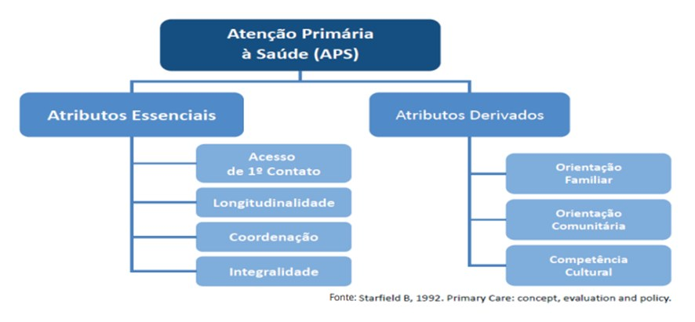

# POLÍTICA NACIONAL DE ATENÇÃO BÁSICA

A Política Nacional de Atenção Básica, a famosa PNAB, é o esqueleto que sustenta o Sistema Único de Saúde (SUS). Se você quer entender como o sistema funciona na prática, precisa dominar a Portaria 2.436 de 21 de setembro de 2017. Ela é a versão vigente e a que despenca nas provas de residência.

Muitos alunos cometem o erro de achar que a PNAB é apenas um conjunto de regras burocráticas. Não é. Ela define desde quem deve estar dentro de uma Unidade Básica de Saúde (UBS) até como o dinheiro chega ao município. Um ponto fundamental que as bancas adoram: para a PNAB, os termos Atenção Básica (AB) e Atenção Primária à Saúde (APS) são equivalentes, ou seja, são sinônimos.

## Os Pilares da Atenção Básica: Princípios e Diretrizes

Para não errar na prova, você precisa separar o que é do SUS como um todo e o que é específico da Atenção Básica. A PNAB 2017 reafirma os princípios do SUS e estabelece diretrizes próprias para a AB.

Os princípios do SUS, que você já deve conhecer, são a Universalidade, a Equidade e a Integralidade. A PNAB pega esses conceitos e os operacionaliza através de diretrizes específicas.

### Diretrizes da PNAB

As diretrizes são o "como fazer". Entre as principais, destacamos:

- **Regionalização e Hierarquização:** A AB é o ponto de contato preferencial e a porta de entrada da Rede de Atenção à Saúde (RAS). Ela não está isolada, ela faz parte de um desenho regional.

- **Territorialização:** É o processo de mapear e entender o território. Cuidado aqui: a territorialização é uma responsabilidade de TODA a equipe, não apenas do Agente Comunitário de Saúde (ACS). É através dela que criamos vínculo e contextualizamos as ações.

- **População Adscrita:** É o "público-alvo" daquela equipe. São as pessoas que moram ou trabalham no território da UBS.

- **Cuidado Centrado na Pessoa:** O foco não é a doença, é o sujeito em sua singularidade e contexto sociocultural.

- **Resolutividade:** A AB deve ser capaz de resolver a grande maioria dos problemas de saúde da população (cerca de 80 a 85%).

- **Longitudinalidade:** É o acompanhamento do paciente ao longo do tempo, por um mesmo profissional ou equipe, independentemente da presença ou ausência de doença.

- **Coordenação do Cuidado:** A equipe de AB deve gerenciar o fluxo do paciente na rede. Se ele vai ao especialista, a AB precisa saber o que aconteceu e continuar o cuidado.

- **Ordenação da Rede:** A AB é quem diz para onde o sistema deve crescer e como os fluxos devem ser organizados.

**Dica de Prova:** A banca vai tentar te convencer de que a Atenção Básica é a porta de entrada *exclusiva* do SUS. Errado. Ela é a porta de entrada *preferencial*. O paciente pode entrar pelo SAMU ou pela UPA em urgências, mas a AB deve ser sempre comunicada para manter a coordenação do cuidado.

## Atributos da Atenção Primária (Modelo de Starfield)

Este é, sem dúvida, um dos temas mais cobrados. Barbara Starfield definiu atributos que tornam a APS robusta. Eles se dividem em Essenciais e Derivados.

### Atributos Essenciais

- **Acesso de Primeiro Contato:** A facilidade com que o usuário chega ao serviço. Envolve localização, horário de funcionamento e acolhimento.

- **Longitudinalidade:** O vínculo temporal. É o "médico de família" que conhece o histórico do paciente há 10 anos. Isso reduz internações desnecessárias e custos.

- **Integralidade:** Oferecer tudo o que o paciente precisa, desde a promoção e prevenção até a reabilitação, ou garantir que ele receba isso em outros pontos da rede.

- **Coordenação:** A capacidade de integrar o cuidado. A AB funciona como o "maestro" da orquestra da saúde.

### Atributos Derivados

- **Orientação Familiar:** Considerar a família como unidade de cuidado.

- **Orientação Comunitária:** Reconhecer as necessidades de saúde da comunidade através de dados epidemiológicos e contato direto.

- **Competência Cultural:** Adaptar o cuidado aos costumes e crenças daquela população.

| Atributo | O que a banca cobra? |
| --- | --- |
| **Longitudinalidade** | Vínculo ao longo do tempo, fonte regular de atenção. |
| **Integralidade** | Abordagem biopsicossocial, não apenas biológica. |
| **Coordenação** | Sincronia entre os níveis de atenção (Referência/Contrarreferência). |
| **Acesso** | Acessibilidade geográfica e organizacional (acolhimento). |

*Figura 1: Representação teórica dos atributos essenciais e derivados da Atenção Primária à Saúde preconizados por Starfield.*

## A Estratégia Saúde da Família (eSF)

A PNAB 2017 deixa claro: a Estratégia Saúde da Família é o modelo **prioritário** de organização da Atenção Básica. No entanto, a nova portaria trouxe uma polêmica que cai muito em prova: ela passou a reconhecer e financiar outros modelos de equipes, como a Equipe de Atenção Básica (eAB), que não exige a presença obrigatória do ACS para receber recursos federais.

### Composição da Equipe de Saúde da Família (eSF)

A composição mínima obrigatória é:

- Médico (preferencialmente especialista em Medicina de Família e Comunidade).

- Enfermeiro (preferencialmente especialista em Saúde da Família).

- Auxiliar ou Técnico de Enfermagem.

- Agente Comunitário de Saúde (ACS).

Podem ser incluídos: Agente de Combate às Endemias (ACE) e profissionais de saúde bucal (Cirurgião-dentista e Auxiliar/Técnico em Saúde Bucal).

*Figura 2: Logotipo Oficial da Estratégia Saúde da Família.*

### Carga Horária e População

A carga horária padrão é de **40 horas semanais** para todos os profissionais. No entanto, a PNAB 2017 permitiu que médicos e enfermeiros tivessem cargas horárias menores (mínimo de 20h), desde que a soma das horas desses profissionais na equipe totalize 40h.

Quanto à população, a recomendação é de uma média de **3.000 pessoas por equipe**, podendo variar de 2.000 a 3.500, dependendo da vulnerabilidade da região.

**Exemplo Clínico:** Imagine que você é o médico de uma eSF em uma área rural. O Sr. Benedito, 70 anos, precisa de uma cirurgia de catarata. Você o encaminha para o oftalmologista (Referência). Após a cirurgia, ele volta para você com as orientações do especialista (Contrarreferência). Esse fluxo exemplifica a **Coordenação do Cuidado**. Se você continuar acompanhando o diabetes dele após a cirurgia, está exercendo a **Longitudinalidade**.

## O Papel do Médico na Atenção Básica

Segundo a PNAB 2017, o médico da AB tem atribuições específicas que vão além da consulta clínica. Ele deve:

- Realizar assistência integral (promoção, prevenção, diagnóstico, tratamento e reabilitação).

- Indicar a necessidade de internação hospitalar ou domiciliar, mantendo a corresponsabilidade pelo acompanhamento do paciente.

- Realizar estratificação de risco e elaborar o Plano Terapêutico Singular (PTS) para casos complexos.

- Executar pequenos procedimentos cirúrgicos na UBS (como suturas, retirada de pequenos cistos, biópsias de pele).

**Erro Comum:** Achar que o médico da AB apenas "encaminha". Na verdade, ele deve ser resolutivo. Como dizemos no MedEvo, o médico da APS é o especialista em gente e em complexidade, não apenas um triador.

## Financiamento: Do PAB ao Previne Brasil e o Novo Cofinanciamento da APS

Este é o ponto onde muitos alunos travam. Até 2019, o financiamento era baseado no PAB Fixo (valor por habitante) e PAB Variável (incentivos para programas como Saúde da Família, NASF, etc.).

O Programa **Previne Brasil** mudou essa lógica. Agora, o repasse financeiro federal aos municípios baseia-se em três pilares fundamentais:

- **Captação Ponderada:** O dinheiro segue o cadastro. Quanto mais pessoas cadastradas e vinculadas à equipe, mais recurso o município recebe. Há um peso maior para populações vulneráveis (beneficiários do Bolsa Família, idosos, crianças).

- **Pagamento por Desempenho:** O município recebe conforme atinge metas em indicadores de saúde.

- **Incentivo para Ações Estratégicas:** Dinheiro para programas específicos, como o Saúde na Hora (UBS com horário estendido), Informatização, Residência Médica, entre outros.

### Indicadores de Desempenho (Chaves de Prova)

As bancas amam cobrar quais são os indicadores do Previne Brasil. Atualmente, os principais focam em:

- **Saúde da Mulher:** Proporção de gestantes com pelo menos 6 consultas de pré-natal (sendo a 1ª até a 12ª semana); Proporção de gestantes com exames de Sífilis e HIV; Proporção de gestantes com atendimento odontológico realizado; Cobertura de exame citopatológico.

- **Saúde da Criança:** Proporção de crianças de 1 ano vacinadas com a Pentavalente e contra a Poliomielite.

- **Doenças Crônicas:** Proporção de pessoas com hipertensão com pressão arterial aferida em cada semestre; Proporção de pessoas com diabetes com solicitação de hemoglobina glicada (HbA1c) em cada semestre.

**Atenção:** Internações por Condições Sensíveis à Atenção Primária (ICSAP) são ótimos indicadores de qualidade da AB, mas **não** fazem parte do rol de indicadores de pagamento por desempenho do Previne Brasil. Não confunda!

Atualmente, o Previne Brasil foi revogado no dia 11 de abril de 2024 pela portaria GM/MS 3.493, instituindo aquilo que vem sendo chamado de Novo Cofinanciamento Federal da Atenção Primária à Saúde. É um modelo mais complexo que o Previne, e já vem sendo cobrado nas provas mais recentes. Porém, calma, possui componentes semelhantes ao antigo Previne Brasil. O novo cofinanciamento (que destaca a responsabilidade também dos municípios) possui 6 componentes:

- componente fixo para manutenção das equipes de Saúde da Família - eSF e das equipes de Atenção Primária - eAP e recurso de implantação para eSF, eAP, equipes de Saúde Bucal - eSB e equipes Multiprofissionais - eMulti;

- componente de vínculo e acompanhamento territorial para as eSF e eAP;

- componente de qualidade para as eSF, eAP, eSB e eMulti;

- componente para implantação e manutenção de programas, serviços, profissionais e outras composições de equipes que atuam na APS;

- componente para Atenção à Saúde Bucal; e

- componente per capita de base populacional para ações no âmbito da APS.

Vamos analisar um por um:

-

COMPONENTE FIXO PARA MANUTENÇÃO DAS EQUIPES E RECURSO DE IMPLANTAÇÃO
Temos duas partes: componente fixo E recurso de implantação, logo temos dois valores que serão repassados aos municípios. O componente fixo por equipe nada mais é do que um valor fixo que será repassado mensalmente ao município para que ele mantenha as equipes de Saúde da Família (eSF) e as equipes de Atenção Primária (eAP) já existentes na localidade. Somente esses dois tipos de equipe nessa parte! Além disso, os valores repassados dependerão da vulnerabilidade do município. Para isso, os municípios foram classificados em estratos (1,2,3 e 4), levando em consideração diferentes parâmetros, como o Índice de Equidade e Desenvolvimento (IED) e o Índice de Vulnerabilidade Social (IVS). Quanto menor o estrato, maior a vulnerabilidade e maior o repasse.
Já o recurso de implantação é um valor único que será repassado sempre que ele criar uma equipe nova (valor será pago uma única vez, no ato da criação da equipe), seja equipe de Saúde da Família (eSF), equipe de Atenção Primária (eAP), equipe de Saúde Bucal (eSB) ou equipe multiprofissional (eMULTI). Se as equipes forem uma eSF ou uma eAP, passarão a receber posteriormente o componente fixo (as eSB e eMulti não recebem componente fixo, apenas implantação).

-

COMPONENTE DE VÍNCULO E ACOMPANHAMENTO TERRITORIAL
Semelhante à antiga capacitação ponderada do Previne Brasil. As equipes terão um número médio de cadastros e um número máximo de cadastros permitidos. A diferença é que as equipes perderão dinheiro caso ultrapassem o número máximo de cadastros (o Ministério da Saúde pretende forçar os gestores a dividirem o território novamente, criando mais equipes e diminuindo o número de cadastros por equipe). Além disso, o Ministério da Saúde avaliará se cada equipe está de fato acompanhando os usuários cadastrados e a satisfação deles com o atendimento prestado. A partir disso, cada equipe receberá uma nota (ótimo, bom, suficiente ou regular). Quanto melhor a nota, maior o valor repassado aos município por aquela equipe.

-

Componente de Qualidade para as eSF, eAP, eSB e eMulti
Semelhante ao pagamento por desempenho do Previne Brasil e também avalia as equipes quanto ao cumprimento das metas dos indicadores. Equipes de Saúde Bucal e eMultis também serão avaliadas quanto a seus desempenhos, algo que não existia no Previne Brasil.

-

Componente para implantação e manutenção de programas, serviços, profissionais e outras composições de equipes que atuam na APS:
Semelhante ao componente 3 do Previne Brasil (ações estratégicas), com algumas pequenas diferenças. Lembrando que os gestores não são obrigados a aderir às ações e programas, mas,
se fizerem a adesão, receberão mais financiamento.

| Ações e Programas Previne Brasil (componente: ações estratégicas) | Ações e Programas do Novo Cofinanciamento Federal (componente: implantação e manutenção de programas, serviços, profissionais e outras composições de equipes da APS) |
| --- | --- |
| Equipe de Consultório na Rua (eCR) | Equipe de Consultório na Rua (eCR) |
| Equipe de Saúde da Família Ribeirinha (eSFR) | Equipe de Saúde da Família Ribeirinha (eSFR) |
| Equipe de Atenção Primária Prisional (eAPP) | Equipe de Atenção Primária Prisional (eAPP) |
| Microscopista | Microscopista |
| Unidade Básica de Saúde Fluvial (UBSF) | Unidade Básica de Saúde Fluvial (UBSF) |
| Estratégia de Agentes Comunitários de Saúde (ACS) | Estratégia de Agentes Comunitários de Saúde (ACS) |
| Ações de atenção integral à saúde dos adolescentes em privação de liberdade | Ações de atenção integral à saúde dos adolescentes em privação de liberdade |
| Incentivo aos municípios com residência médica e multiprofissional | Incentivo aos municípios com residência médica e multiprofissional |
| Programa Saúde na Escola (PSE) | Programa Saúde na Escola (PSE) |
| Programa Academia da Saúde | Custeio para implementação de ações de atividade física (IAF) |
| Programa de Informatização da APS | eMULTIS |
| Programa Saúde na Hora | — |
| Equipe de Saúde Bucal (eSB) | — |
| Unidade Odontológica Móvel | — |
| Centro de Especialidades Odontológicas (CEO) | — |
| Laboratório Regional de Prótese Dentária (LRPD) | — |

(tabela ações e programas previne brasil x tabela do novo)
Aqui Saúde Bucal sai deste componente (antigo Previne Brasil) e ganha um componente próprio.

-

Componente para Atenção à Saúde Bucal:
O nome já diz. É daqui que sairão os financiamentos
para as equipes de Saúde Bucal (eSF), Unidades Odontológicas Móveis (UOM), Centros de Especialidades Odontológicas (CEO), Serviços de Especialidades de Saúde Bucal (SESB) e Laboratórios Regionais de Prótese Dentária - LRPD.

-

Componente per capita de base populacional para ações no âmbito da APS:
Semelhante ao incentivo financeiro com base em critério populacional e semelhante ao antigo PAB fixo. Trata-se de um
valor a ser repassado para os municípios de acordo com seu tamanho populacional, utilizando dados do IBGE ou Censo.\n\n

## O NASF e as eMulti

O Núcleo de Apoio à Saúde da Família (NASF), criado em 2008, tinha o objetivo de aumentar a resolubilidade da AB através do **Matriciamento**. O matriciamento é um suporte técnico-pedagógico: o especialista (psicólogo, fisioterapeuta, assistente social) não apenas atende o paciente, mas discute o caso com a equipe de referência para capacitá-la.

Com a PNAB 2017 e as mudanças no financiamento, o termo NASF perdeu força normativa, sendo substituído recentemente pelo conceito de **eMulti (Equipes Multiprofissionais na Atenção Primária)**. A lógica continua sendo o apoio matricial e a atuação interdisciplinar, mas com maior flexibilidade de composição.

## Políticas Transversais na Atenção Básica

A PNAB não anda sozinha. Ela se conecta com várias outras políticas nacionais que você precisa conhecer para não cair em pegadinhas.

### Política Nacional de Humanização (PNH)

A PNH, ou HumanizaSUS, foca na valorização dos sujeitos (usuários e trabalhadores). Seus pilares são:

- **Acolhimento:** Não é uma triagem! É uma escuta qualificada que reconhece o protagonismo do usuário. Deve ser feito com classificação de risco.

- **Gestão Compartilhada (Cogestão):** Inclusão de trabalhadores e usuários na tomada de decisão.

- **Clínica Ampliada:** Olhar para o sujeito além do diagnóstico biológico.

- **Valorização do Trabalho:** Melhores condições para quem faz o SUS acontecer.

### Política Nacional de Atenção Integral à Saúde do Homem (PNAISH)

O foco é a população masculina de 20 a 59 anos. Por que? Porque os homens morrem mais cedo e acessam menos a AB.

- **Mortalidade:** Homens jovens morrem principalmente por causas externas (violência, acidentes). Homens idosos morrem por doenças cardiovasculares e neoplasias.

- **Estratégia:** O "Pré-natal do Parceiro" é uma das principais portas de entrada para o homem na UBS.

### Política Nacional de Alimentação e Nutrição (PNAN)

Foca na vigilância alimentar e nutricional (SISVAN). Um ponto importante: a obesidade no Brasil é mais prevalente em **mulheres**. A PNAN combate o consumo de ultraprocessados e promove a amamentação. Lembre-se: o leite humano da própria mãe é sempre a primeira escolha para prematuros, pois garante melhor tolerância e reduz infecções.

### Programa Saúde na Escola (PSE)

É a articulação entre Saúde e Educação. O ACS tem papel fundamental aqui, ajudando a identificar vulnerabilidades e integrando as ações de prevenção (como vacinação e saúde bucal) no ambiente escolar.

## Territorialização e Planejamento Local

O planejamento no SUS deve ser **ascendente**. Isso significa que ele começa no nível local (UBS), passa pelo municipal, estadual e chega ao federal.

- **Território-processo:** O território não é apenas um pedaço de terra, é onde a vida acontece, com suas relações de poder, cultura e riscos.

- **Microárea:** É a unidade operacional do ACS. É nela que ocorre o cadastramento e o acompanhamento das famílias.

- **Diagnóstico Situacional:** É o primeiro passo do planejamento. Você analisa os dados epidemiológicos, sociais e demográficos para decidir onde investir os recursos.

**Dica do Dr. Will:** Em provas, se uma questão perguntar quem é responsável pela territorialização, a resposta correta é "toda a equipe". Se perguntar quem faz o cadastramento domiciliar sistemático, a resposta é "o ACS".

## Internações por Condições Sensíveis à Atenção Primária (ICSAP)

Este conceito é fundamental para avaliar se a sua UBS está funcionando bem. As ICSAP são doenças que, se bem tratadas na AB, não deveriam evoluir para internação hospitalar. Exemplos:

- Diabetes descompensado.

- Hipertensão arterial.

- Asma.

- Infecções urinárias.

- Gastroenterites.

Se o número de internações por essas causas está alto em um município, significa que a Atenção Básica está com baixa cobertura ou baixa resolutividade. A ampliação da ESF é a estratégia mais eficaz para reduzir as ICSAP no Brasil.

| Condição | Por que é sensível à AB? |
| --- | --- |
| **Pneumonia** | Pode ser tratada precocemente com antibióticos na UBS. |
| **Insuficiência Cardíaca** | O manejo de diuréticos e dieta na AB evita a descompensação. |
| **Anemia** | O diagnóstico e suplementação de ferro (PNAN) evitam complicações. |

## Práticas Integrativas e Complementares (PNPIC)

O SUS oferece diversas terapias complementares. Fique atento às origens:

- **Ayurveda:** Origem indiana.

- **Medicina Tradicional Chinesa:** Baseada no Yin-Yang e nos Cinco Elementos (Acupuntura).

- **Homeopatia:** Baseada na lei dos semelhantes.

As PNPIC valorizam tecnologias de baixa densidade e a integralidade do sujeito, sendo muito utilizadas na Atenção Básica para o manejo de dores crônicas e saúde mental leve.

## Gestão e Participação Social

A gestão do SUS é tripartite (União, Estados e Municípios). Na Atenção Básica, o papel do município é central, pois ele é o gestor direto das UBS.

A participação social ocorre através de:

- **Conselhos de Saúde:** Caráter permanente e deliberativo. Têm composição paritária (50% usuários, 25% profissionais, 25% gestores/prestadores).

- **Conferências de Saúde:** Ocorrem a cada 4 anos para avaliar a situação de saúde e propor diretrizes para as políticas.

O Plano Municipal de Saúde (PMS) deve ser aprovado pelo Conselho Municipal de Saúde e é a base para a execução das ações no território.

## Tabela Comparativa: PNAB 2011 vs. PNAB 2017

Muitas questões ainda tentam confundir o aluno com mudanças entre as versões.

| Característica | PNAB 2011 | PNAB 2017 |
| --- | --- | --- |
| **Modelo de Equipe** | Foco quase exclusivo na eSF. | Reconhece eAB (Equipe de Atenção Básica) sem ACS obrigatório. |
| **Carga Horária Médico** | 40 horas semanais. | Permite 20h ou 30h (desde que a soma na equipe seja 40h). |
| **Gerente de Atenção Básica** | Não enfatizado. | Introduz a figura do Gerente para qualificar a gestão da UBS. |
| **ACS** | Obrigatório em todas as eSF. | Número de ACS deve ser definido conforme necessidade local. |

## Situações Especiais e Vulnerabilidades

A PNAB 2017 reforça a necessidade de olhar para grupos específicos:

- **Consultório na Rua:** Equipes que atendem a população em situação de rua.

- **Saúde Indígena:** Gerenciada pela SESAI (Secretaria Especial de Saúde Indígena), respeitando as particularidades culturais.

- **População Ribeirinha:** Equipes de Saúde da Família Ribeirinhas (eSFR) e Unidades Básicas de Saúde Fluviais.

A equidade no SUS significa tratar desigualmente os desiguais. Por isso, investir mais recursos em áreas de maior vulnerabilidade social é uma aplicação direta desse princípio.

## Pontos-Chave para Prova

- **Sinônimos:** Atenção Básica (AB) e Atenção Primária à Saúde (APS) são termos equivalentes na PNAB 2017.

- **Porta de Entrada:** A AB é a porta de entrada **preferencial** e a ordenadora da Rede de Atenção à Saúde (RAS).

- **Atributos Essenciais:** Acesso, Longitudinalidade, Integralidade e Coordenação (Memorize: ALICe).

- **Equipe Mínima eSF:** Médico, Enfermeiro, Técnico de Enfermagem e ACS.

- **Carga Horária:** Regra geral de 40h, mas permite-se composição de carga horária médica (mínimo 20h).

- **População Adscrita:** Média de 3.000 pessoas por equipe (faixa de 2.000 a 3.500).

- **Previne Brasil:** O financiamento atual baseia-se em Captação Ponderada, Desempenho e Ações Estratégicas.

- **Indicadores de Desempenho:** Focam em Pré-natal, Vacinação Infantil, Citopatológico, Hipertensão e Diabetes.

- **ICSAP:** Internações por Condições Sensíveis à Atenção Primária são indicadores de qualidade da AB, mas não geram pagamento direto no Previne Brasil.

- **Territorialização:** É responsabilidade de **toda a equipe**, visando o estabelecimento de vínculo.

- **PNAISH:** Foca no homem de 20 a 59 anos; causas externas são a principal causa de morte no jovem.

- **PNAN:** Obesidade é mais prevalente em mulheres; o foco é a vigilância alimentar (SISVAN).

- **PNH:** Acolhimento não é triagem; envolve escuta qualificada e classificação de risco.

- **NASF/eMulti:** Atuam através do matriciamento (suporte técnico-pedagógico), não são porta de entrada.

- **Gerente de AB:** Figura introduzida na PNAB 2017 para organizar o processo de trabalho na UBS.

- **PMAQ:** Programa de Melhoria do Acesso e da Qualidade (antecessor da lógica de desempenho do Previne Brasil).

- **Saúde do Idoso:** Foco em DCNT (hipertensão/diabetes) e promoção do envelhecimento ativo.

- **Contraindicação Absoluta:** No SUS, nunca se nega atendimento por falta de comprovante de residência ou cartão SUS (Princípio da Universalidade). 🩺

 Cópia offline para consulta pessoal.
 Fonte original:
 [https://www.medevo.com.br/material-apoio/ler/0bf9c1f9-7512-45dc-b3b4-c93412ae669e](https://www.medevo.com.br/material-apoio/ler/0bf9c1f9-7512-45dc-b3b4-c93412ae669e)
