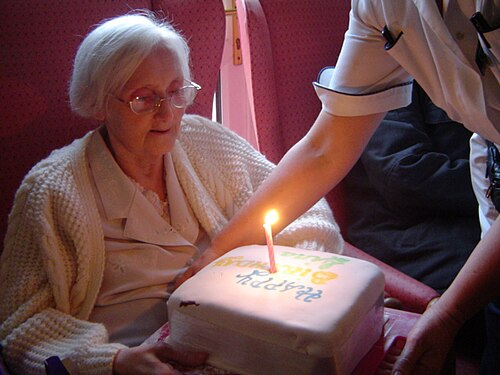
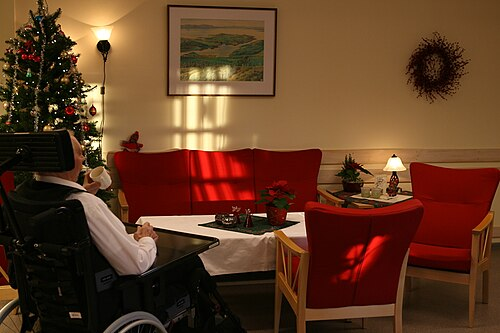

# POLÍTICA NACIONAL DO IDOSO

Para entender a Política Nacional do Idoso, você não deve pensar nela como um amontoado de leis chatas, mas como uma resposta do Estado a um fenômeno biológico e social inevitável: o Brasil está envelhecendo em uma velocidade recorde. Se a Europa levou um século para amadurecer sua pirâmide etária, o Brasil está fazendo isso em poucas décadas.

Nas provas de residência, o examinador não quer apenas que você saiba que o idoso tem prioridade. Ele quer que você entenda a transição demográfica, a diferença entre autonomia e independência, e, principalmente, como manejar situações de vulnerabilidade e violência.

*Figura 1 - Cuidado geriátrico em instituição de longa permanência, demonstrando a importância do acolhimento e assistência humanizada ao idoso. Fonte: I Craig, CC BY 2.0 | Wikimedia Commons*

## Transição Demográfica e Epidemiológica: O Cenário Brasileiro

Por que as bancas cobram tanto a pirâmide etária? Porque ela dita o gasto público e a organização do SUS. No Brasil, vivemos uma transição demográfica acelerada, caracterizada pela queda brusca da taxa de fecundidade (as pessoas têm menos filhos) e pela queda da taxa de mortalidade (as pessoas vivem mais).

O resultado é um aumento tanto absoluto quanto percentual da população idosa. Entre 1970 e 2010, a proporção de idosos com mais de 60 anos no Brasil simplesmente duplicou. Isso gera o que chamamos de "Tripla Carga de Doenças". O idoso brasileiro não sofre apenas de doenças crônicas (como DM e HAS), ele ainda convive com doenças infectocontagiosas e com causas externas (quedas e violência).

**Dica de Prova:** Muitas questões tentam confundir transição demográfica com transição epidemiológica. A demográfica foca nos números da população (natalidade, mortalidade, expectativa de vida). A epidemiológica foca na mudança do perfil de doenças (saímos de um perfil de doenças infectoparasitárias para um predomínio de doenças crônico-degenerativas).

### Indicadores que você precisa conhecer

- **Razão de Dependência:** É a soma da população "dependente" (menores de 15 anos + maiores de 65 anos) dividida pela população em idade ativa (15 a 64 anos). Com o envelhecimento, essa conta está ficando apertada, o que pressiona a seguridade social (saúde e previdência).

- **Taxa de Fecundidade:** No Brasil, ela está abaixo do nível de reposição (2,1 filhos por mulher). Isso acelera o estreitamento da base da pirâmide.

- **Mortalidade em Idosos:** As principais causas no Brasil seguem uma ordem clássica: 1º Doenças do Aparelho Circulatório, 2º Neoplasias, 3º Doenças do Aparelho Respiratório.

## Definição Legal de Idoso e o Estatuto do Idoso (Lei 10.741/2003)

No Brasil, por convenção legal e seguindo a Política Nacional do Idoso (Lei 8.842/1994) e o Estatuto do Idoso, **idoso é a pessoa com 60 anos ou mais**.

Cuidado com a pegadinha: em alguns países desenvolvidos, a idade de corte é 65 anos. Para a sua prova de residência no Brasil, marcou 60, acertou a questão.

O Estatuto do Idoso é uma ferramenta de proteção integral. Ele estabelece que a família tem a obrigação prioritária de cuidar do idoso, vindo antes das instituições (como as ILPIs). O Estado deve garantir que o idoso permaneça, preferencialmente, no seio familiar.

### Prioridade Especial e Critérios de Desempate

Recentemente, o Estatuto foi atualizado para criar uma "prioridade dentro da prioridade". Idosos com mais de 80 anos têm preferência sobre os demais idosos em atendimentos de saúde (exceto casos de emergência, onde o critério é clínico) e processos judiciais.

**Pérola de Prova:** Em concursos públicos, se dois candidatos empatarem na nota final, o primeiro critério de desempate é a idade, favorecendo o candidato mais idoso. Isso aparece com frequência em questões de legislação social.

## Política Nacional de Saúde da Pessoa Idosa (PNASPI - Portaria 2.528/2006)

Aqui entramos no coração da prática médica no SUS. A PNASPI não foca apenas na doença, mas na **Capacidade Funcional**. Para o Dr. Will e para qualquer geriatra experiente, um idoso com diabetes controlada que caminha e faz suas compras é "mais saudável" do que um idoso sem doenças crônicas, mas que está acamado e deprimido.

O objetivo principal da PNASPI é recuperar, manter e promover a autonomia e a independência.

### Autonomia vs. Independência

Este é o conceito que mais derruba alunos. Vamos diferenciar de uma vez por todas:

| Conceito | Definição | Exemplo Clínico |
| --- | --- | --- |
| **Autonomia** | Capacidade de DECIDIR, de autogoverno, de exercer o desejo. | Um idoso cadeirante que decide onde quer morar e como quer gastar seu dinheiro. |
| **Independência** | Capacidade de EXECUTAR, de realizar tarefas sem ajuda física de terceiros. | Um idoso com demência avançada que consegue caminhar e comer sozinho, mas não consegue mais decidir nada. |

**Por que isso importa?** Porque nossas intervenções no SUS devem visar a preservação desses dois pilares. Se um idoso perde a independência (não consegue mais tomar banho sozinho), nossa meta é adaptar o ambiente para que ele recupere essa função ou, ao menos, mantenha sua autonomia (o direito de decidir como quer ser cuidado).

*Figura 2 - Idoso em instituição de longa permanência (ILPI), ambiente de cuidado continuado que é foco importante das políticas de atenção ao idoso. Fonte: Thomas Bjørkan, CC BY-SA 3.0 | Wikimedia Commons*

## A Avaliação Multidimensional do Idoso (AGA)

Na Atenção Primária (APS), o médico não deve fazer apenas uma anamnese tradicional. A PNASPI recomenda a abordagem global e interdisciplinar. Isso inclui avaliar:

- Equilíbrio e mobilidade (risco de quedas).

- Cognição (rastreio de demências).

- Estado nutricional.

- Polifarmácia (uso de 5 ou mais medicamentos).

- Suporte social (quem cuida desse idoso?).

**Exemplo Clínico:** Imagine uma paciente de 72 anos, hipertensa e diabética, que vem à consulta com queixa de tontura. O médico desatento apenas ajusta o anti-hipertensivo. O médico que segue a PNASPI realiza o teste "Timed Up and Go" (TUG), percebe que ela leva 20 segundos para completar (alto risco de queda), nota que ela mora sozinha e que a iluminação da casa é precária. A intervenção aqui é intersetorial: envolve fisioterapia e assistência social, não apenas ajuste de dose.

## Violência contra o Idoso e Notificação Compulsória

Este é, sem dúvida, o tema mais cobrado em provas de Medicina Preventiva dentro deste tópico. Você precisa saber identificar os tipos de violência e a conduta legal imediata.

### Tipos de Violência

- **Violência Física:** Uso da força para compelir o idoso a fazer o que não deseja, ferindo-o ou causando dor.

- **Violência Psicológica:** É a mais comum e sutil. Inclui menosprezo, preconceito, humilhação, isolamento social e agressões verbais.

- **Negligência:** Omissão de cuidados básicos (higiene, alimentação, medicamentos, proteção contra o frio/calor). É a forma mais frequente de violência institucional em ILPIs.

- **Abandono:** Ausência ou deserção dos responsáveis governamentais, institucionais ou familiares.

- **Violência Financeira/Patrimonial:** Exploração imprópria ou uso não consentido dos recursos financeiros do idoso. Exemplo: o neto que usa a aposentadoria da avó para comprar um carro para si, deixando a idosa sem medicação.

### A Conduta do Médico

A regra é clara e não permite interpretações: **Suspeita ou confirmação de violência contra idoso exige NOTIFICAÇÃO COMPULSÓRIA IMEDIATA**.

Muitos alunos erram ao achar que precisam ter certeza absoluta para notificar. Não precisam. A suspeita fundamentada já obriga a notificação aos órgãos competentes (Conselho Municipal do Idoso, Ministério Público ou Delegacia de Polícia).

**Cuidado:** A notificação não é uma denúncia policial feita pelo médico, mas um instrumento de proteção à saúde e garantia de direitos. Em casos de violência grave ou risco iminente, o Ministério Público deve ser acionado imediatamente.

## O Cuidador de Idosos: O Paciente Invisível

A Política Nacional do Idoso reconhece que o cuidado muitas vezes recai sobre um familiar (cuidador informal). Existe um conceito fundamental para provas: a **Sobrecarga do Cuidador**.

Estudos mostram que cuidadores de idosos com demência ou alta dependência apresentam maior risco de depressão, isolamento social e, crucialmente, **maior risco de morbimortalidade**. Sim, o cuidador tem mais chance de adoecer e morrer do que uma pessoa da mesma idade que não exerce essa função.

O médico da APS deve, obrigatoriamente, avaliar a saúde do cuidador. Se o cuidador está exausto, o risco de negligência ou violência contra o idoso aumenta exponencialmente. Como dizemos na MedEvo, cuidar de quem cuida é parte da estratégia de saúde da família.

## Organização da Rede de Atenção à Saúde (RAS) do Idoso

O cuidado ao idoso no SUS é organizado em níveis de complexidade, mas a porta de entrada é sempre a Atenção Primária.

- **Atenção Básica (Unidade Básica de Saúde):** Responsável pelo acompanhamento longitudinal, prevenção de quedas, imunização (Gripe, Pneumococo, Tétano) e manejo de doenças crônicas. Deve ser resolutiva.

- **Atenção Secundária (Centros de Referência):** Para idosos frágeis ou com patologias complexas que exigem equipe multiprofissional especializada (geriatra, gerontólogo, fisioterapeuta).

- **Atenção Terciária (Hospitais):** Foco em intercorrências agudas. O Estatuto garante ao idoso internado o direito a um acompanhante em tempo integral, e a instituição deve prover condições para isso.

### O Pacto pela Vida e a Saúde do Idoso

O Pacto pela Vida (Portaria 399/2006) colocou a saúde do idoso como uma das prioridades nacionais. Ele foca em:

- Promoção do envelhecimento ativo e saudável.

- Atenção domiciliar (melhor em casa).

- Implementação da Caderneta de Saúde da Pessoa Idosa (instrumento fundamental para o fluxo de informações entre os níveis de atenção).

## Instituições de Longa Permanência para Idosos (ILPI)

Antigamente chamadas de "asilos", as ILPIs hoje têm regulação rígida pela ANVISA e pelo Estatuto do Idoso.

- **Responsabilidade:** A ILPI é responsável pela integridade física e psíquica do idoso.

- **Negligência Institucional:** A falta de higiene, a presença de lesões por pressão (escaras) não tratadas e a privação de convívio social configuram negligência e violência institucional.

- **Fiscalização:** É feita pela Vigilância Sanitária e pelo Ministério Público.

**Dica de Prova:** O Estatuto do Idoso diz que o atendimento domiciliar deve ser priorizado em relação à institucionalização. O asilo é a última opção, reservada para quando não há suporte familiar ou social mínimo.

## Desafios Clínicos e Saúde Pública

### Prevenção de Quedas

A queda é o "evento sentinela" na geriatria. Uma queda muitas vezes esconde uma infecção urinária subclínica, uma polifarmácia ou uma catarata não operada. A PNASPI enfatiza a modificação ambiental (retirar tapetes, melhorar iluminação, instalar barras no banheiro) como medida de saúde pública eficaz e de baixo custo.

### Diabetes e Risco Cardiovascular

Idosos com Doenças Cardiovasculares (DCV) têm uma prevalência altíssima de Diabetes Mellitus (DM). O manejo aqui deve ser cauteloso: metas de Hemoglobina Glicada muito rígidas (ex: < 6,5%) em idosos frágeis aumentam o risco de hipoglicemia, que por sua vez causa quedas e arritmias. A diretriz sugere individualizar as metas conforme a funcionalidade.

### Acolhimento e Comunicação

O acolhimento ao idoso exige que o médico desmistifique preconceitos (ageísmo). Não se deve falar com o idoso como se ele fosse uma criança ("infantilização"). A comunicação deve ser direta, respeitando sua autonomia e reconhecendo que o idoso é capaz de mudar hábitos de vida, sim, desde que bem orientado.

## Tabelas Comparativas para Fixação

### Tabela 1: Níveis de Atenção à Saúde do Idoso

| Nível | Local | Foco Principal |
| --- | --- | --- |
| **Primário** | UBS / ESF | Prevenção, rastreio, acompanhamento de doenças crônicas e vacinação. |
| **Secundário** | Centro de Referência | Avaliação Multidimensional por equipe especializada (Idoso Frágil). |
| **Terciário** | Hospital Geral | Urgências, emergências e reabilitação pós-aguda. |

### Tabela 2: Sinais de Alerta para Violência vs. Condições Clínicas

| Sinal Observado | Suspeita de Violência (Negligência/Física) | Condição Clínica Comum (Não Violência) |
| --- | --- | --- |
| **Hematomas** | Em locais protegidos (tronco, face interna de braços), em vários estágios de cura. | Púrpura senil (dorso das mãos e antebraços) por fragilidade capilar. |
| **Desidratação** | Associada a higiene precária e perda de peso rápida sem causa médica. | Uso excessivo de diuréticos ou redução fisiológica da sede. |
| **Fraturas** | Fraturas de ossos longos sem história de queda compatível. | Fratura de colo de fêmur ou rádio distal após queda da própria altura (Osteoporose). |
| **Higiene** | Odor fétido, unhas compridas e sujas, roupas inadequadas ao clima. | Incapacidade funcional por artrose grave (exige suporte, mas não é necessariamente violência se a família busca ajuda). |

### Tabela 3: Transição Demográfica no Brasil

| Indicador | Tendência Atual | Impacto na Saúde |
| --- | --- | --- |
| **Taxa de Natalidade** | Queda acentuada | Menos jovens para cuidar dos idosos no futuro. |
| **Expectativa de Vida** | Aumento constante | Maior prevalência de doenças degenerativas e demências. |
| **Mortalidade Infantil** | Queda | Contribui para o aumento da expectativa de vida ao nascer. |
| **Perfil de Morbidade** | Tripla Carga | Exige sistema de saúde versátil (agudos + crônicos). |

## Pontos-Chave para Prova

- **Definição de Idoso:** No Brasil, pessoa com idade igual ou superior a 60 anos.

- **Prioridade da Prioridade:** Idosos com mais de 80 anos têm preferência sobre os demais (exceto emergências).

- **Notificação Compulsória:** Obrigatória em qualquer caso de **suspeita** ou confirmação de violência. Deve ser imediata.

- **Negligência:** É a forma mais comum de violência, caracterizada pela omissão de cuidados básicos.

- **Autonomia vs. Independência:** Autonomia é decisão; Independência é execução. O foco da PNASPI é a Capacidade Funcional.

- **Transição Demográfica:** Queda da fecundidade + Queda da mortalidade = Envelhecimento populacional acelerado.

- **Transição Epidemiológica:** Substituição de doenças infectocontagiosas por doenças crônico-degenerativas.

- **Pacto pela Vida:** Define a saúde do idoso como prioridade e foca no envelhecimento ativo.

- **Sobrecarga do Cuidador:** É fator de risco para doenças e morte do próprio cuidador, além de aumentar risco de maus-tratos.

- **Critério de Desempate:** Em concursos, a idade avançada é o primeiro critério de desempate.

- **O que NÃO é prioridade:** O Estatuto NÃO diz que o atendimento hospitalar deve ser priorizado em detrimento do domiciliar; pelo contrário, o domiciliar é preferível.

- **Violência Psicológica:** Inclui isolamento social, desprezo e preconceito. É frequentemente cobrada em cenários de maus-tratos verbais.

- **Idoso Frágil:** Critérios incluem ILPI, acamados, hospitalização recente, incapacidade funcional ou doenças graves (AVE, demência).

- **Mortalidade:** A principal causa de óbito em idosos no Brasil são as doenças do aparelho circulatório.

- **Vacinação:** O idoso deve receber anualmente a vacina contra Influenza e seguir o esquema para Pneumococo e Tétano/Difteria.

- **Incontinência Urinária:** Cuidado! Não é sinal patognomônico de violência, mas sim uma síndrome geriátrica comum que precisa de investigação clínica.

- **Polifarmácia:** Uso de 5 ou mais medicamentos. É um dos principais alvos de revisão na consulta de APS para evitar iatrogenias.

- **Direito ao Acompanhante:** Garantido por lei em casos de internação, independentemente da vontade da instituição de saúde.

 Cópia offline para consulta pessoal.
 Fonte original:
 [https://www.medevo.com.br/material-apoio/ler/1c6418eb-a524-4231-b4d7-271efe7689ff](https://www.medevo.com.br/material-apoio/ler/1c6418eb-a524-4231-b4d7-271efe7689ff)
