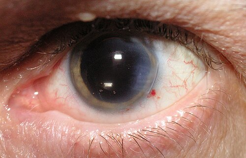
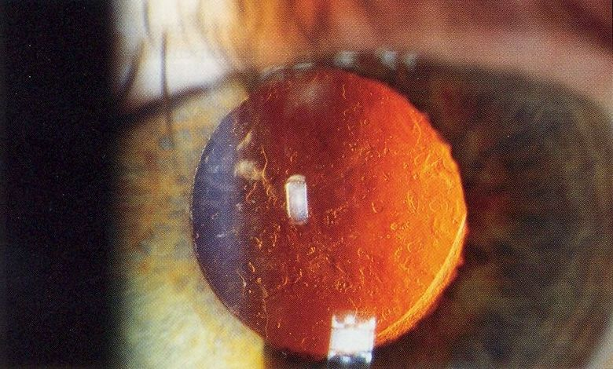

# PÓS-OPERATÓRIO DE CATARATA

O pós-operatório de catarata é, talvez, um dos momentos mais críticos da prática oftalmológica. Não porque a cirurgia seja falha, mas porque o sucesso da facoemulsificação, por mais brilhante que tenha sido a técnica do cirurgião, pode ser completamente anulado por uma condução pós-operatória inadequada. Para a prova de residência e para a sua vida no ambulatório, você precisa entender que o pós-operatório não é apenas "pingar colírio", é um exercício constante de vigilância e diagnóstico diferencial.

*Figura 1 - Olho após cirurgia de catarata por facoemulsificação com lente intraocular (LIO) implantada. Note a incisão corneana à direita da pupila dilatada. Fonte: Janke, CC BY-SA 2.5 | Wikimedia Commons*

## O Período Pós-Operatório Imediato (Primeiras 24 Horas)

Nas primeiras 24 horas, o nosso foco é a estabilidade da ferida cirúrgica e o controle da pressão intraocular (PIO). É comum o paciente apresentar uma leve hiperemia conjuntival e um desconforto tipo "areia nos olhos", o que é esperado devido à manipulação e às incisões corneanas.

### A Estabilidade da Incisão e o Teste de Seidel

Por que nos preocupamos tanto com a incisão? Porque uma incisão mal vedada é uma porta aberta para microrganismos. Se a pressão intraocular estiver muito baixa (hipotonia), a ferida pode permitir a entrada de fluido da superfície ocular para dentro do olho, o que chamamos de efeito de sucção. Isso aumenta drasticamente o risco de endoftalmite.

O Teste de Seidel é a ferramenta padrão ouro aqui. Aplicamos fluoresceína sobre a incisão e observamos na lâmpada de fenda com filtro de cobalto. Se houver vazamento de humor aquoso, veremos o corante sendo "lavado" ou diluído pelo líquido transparente que sai da câmara anterior.

Cuidado: se o Seidel for positivo, a conduta depende da intensidade. Vazamentos discretos podem ser manejados com lente de contato terapêutica e curativo compressivo, mas vazamentos francos exigem sutura imediata. As bancas adoram perguntar a conduta inicial no Seidel positivo, e a resposta quase sempre passa pela proteção da via de entrada bacteriana.

### Picos Hipertensivos Iniciais

É muito frequente encontrarmos a PIO elevada no primeiro dia pós-operatório. Por que isso acontece? O motivo principal é a retenção de material viscoelástico na câmara anterior. O viscoelástico, essencial para proteger o endotélio durante a cirurgia, tem uma estrutura molecular que pode obstruir a malha trabecular se não for completamente aspirado.

Outras causas incluem inflamação (trabeculite) ou, em casos mais raros, o bloqueio pupilar. Se o paciente já tem glaucoma prévio, esse pico pode ser ainda mais perigoso. Como o Dr. Will costuma enfatizar em nossas discussões, nunca ignore uma PIO acima de 30 mmHg no primeiro dia, mesmo que o paciente esteja assintomático. A conduta geralmente envolve hipotensores oculares tópicos (betabloqueadores ou alfa-agonistas) e, se necessário, inibidores da anidrase carbônica via oral (acetazolamida).

## Manejo Farmacológico Padrão

O regime de colírios no pós-operatório de catarata visa três pilares: prevenir infecção, controlar a inflamação e prevenir o edema macular. Segundo as diretrizes do Conselho Brasileiro de Oftalmologia (CBO), o esquema clássico envolve antibióticos, corticoides e, frequentemente, anti-inflamatórios não esteroidais (AINES).

### Antibioticoterapia Profilática

A escolha recai quase sempre sobre as quinolonas de quarta geração (moxifloxacino ou gatifloxacino). Por que a quarta geração? Porque elas possuem uma cobertura superior contra gram-positivos, que são os principais agentes da endoftalmite, e têm melhor penetração no humor aquoso.

O uso costuma ser por 7 a 10 dias. Um erro comum de alunos é achar que o antibiótico deve ser mantido por um mês. Não há evidência que suporte o uso prolongado de antibiótico tópico, e isso ainda favorece a resistência bacteriana.

### Corticosteroides Tópicos

O cortidóide é o "rei" do pós-operatório. A prednisolona a 1% (acetato) é o padrão ouro devido à sua excelente penetração intraocular. O objetivo é estabilizar a barreira hemato-aquosa, que foi quebrada pelo trauma cirúrgico e pelo ultrassom.

O esquema geralmente começa com uma gota a cada 3 ou 4 horas, com desmame gradual ao longo de 3 a 4 semanas. Por que o desmame? Para evitar o efeito rebote da inflamação e para monitorar os "respondedores a corticoide", pacientes que desenvolvem hipertensão ocular secundária ao uso do fármaco.

### Anti-inflamatórios Não Esteroidais (AINES)

O uso de AINES (como o nepafenaco ou cetorolaco) tem ganhado cada vez mais espaço. Eles não substituem o corticoide, mas agem de forma sinérgica. O principal motivo para prescrever AINES é a prevenção do Edema Macular Cistoide (Síndrome de Irvine-Gass), especialmente em pacientes de alto risco, como diabéticos ou pacientes com história de uveíte.

*Figura 2 - Opacificação de cápsula posterior (PCO) visualizada na retroiluminação, complicação tardia mais comum da facoemulsificação, tratada com capsulotomia posterior a YAG laser. Fonte: Rakesh Ahuja, MD, CC BY-SA 2.5 | Wikimedia Commons*

## Complicações Precoces: O Grande Diferencial de Prova

Aqui entramos no terreno onde as bancas de residência mais gostam de atuar. Você precisa saber diferenciar, com absoluta clareza, a TASS da Endoftalmite Infecciosa.

### TASS (Síndrome Tóxica do Segmento Anterior)

A TASS é uma inflamação estéril aguda causada por alguma substância tóxica que entrou no olho durante a cirurgia. Pode ser um detergente mal enxaguado do instrumental, um conservante de colírio intraocular ou até uma alteração no pH das soluções de irrigação.

O quadro clínico da TASS é clássico:

- Início muito rápido (geralmente nas primeiras 12 a 24 horas).

- Edema de córnea difuso (limbo a limbo).

- Reação de câmara anterior intensa, às vezes com hipópio.

- **Ausência de dor importante** (isso é fundamental!).

- A inflamação é restrita ao segmento anterior.

### Endoftalmite Infecciosa Aguda

Esta é a complicação mais temida. Diferente da TASS, a endoftalmite é uma infecção bacteriana (raramente fúngica no início) do conteúdo intraocular.

O quadro clínico da Endoftalmite:

- Início geralmente entre o 3º e o 7º dia pós-operatório (raramente nas primeiras 24h).

- **Dor ocular intensa e progressiva.**

- Queda acentuada da acuidade visual.

- Hipópio e fibrina na câmara anterior.

- Vitreíte (inflamação do vítreo), o que impede a visualização do fundo de olho.

| Característica | TASS | Endoftalmite Aguda |
| --- | --- | --- |
| Início dos sintomas | 12 - 24 horas | 3 - 7 dias |
| Dor | Ausente ou leve | Intensa e lancinante |
| Edema de córnea | Difuso (limbo a limbo) | Localizado ou ausente |
| Pressão Intraocular | Pode estar elevada | Geralmente baixa (hipotonia) |
| Envolvimento do Vítreo | Não | Sim (Vitreíte) |
| Resposta ao Corticoide | Melhora dramática e rápida | Melhora pouco ou piora |

No MedEvo, sempre ensinamos: se você vir um paciente com hipópio no 4º dia pós-operatório e ele estiver com dor, não perca tempo pensando em TASS. Trate como endoftalmite até que se prove o contrário. A conduta imediata é a coleta de humor aquoso e vítreo para cultura e a injeção intravítrea de antibióticos (Vancomicina + Ceftazidima). A vitrectomia via pars plana é indicada se a visão for apenas de Percepção Luminosa (PL), conforme os critérios do estudo EVS (Endophthalmitis Vitrectomy Study).

## Complicações Intermediárias e Tardias

Passada a primeira semana, os riscos mudam de perfil. Agora, nossa preocupação se volta para a retina e para a transparência dos meios.

### Edema Macular Cistoide (Síndrome de Irvine-Gass)

Esta é a causa mais comum de baixa visual indolor após uma cirurgia de catarata sem intercorrências. O pico de incidência ocorre entre a 4ª e a 6ª semana pós-operatória.

A fisiopatologia envolve a liberação de prostaglandinas que aumentam a permeabilidade dos capilares perifoveais. O diagnóstico é clínico, mas confirmado pelo OCT (Tomografia de Coerência Óptica), que mostra os espaços císticos na retina. O tratamento de primeira escolha é o uso de AINES tópicos associados a corticoides tópicos. Em casos recalcitrantes, pode-se usar injeções perioculares ou intravítreas de corticoide.

### Opacificação de Cápsula Posterior (OCP)

Muitos pacientes chegam ao consultório dizendo que "a catarata voltou". Você, como médico, sabe que isso é impossível, pois o cristalino foi removido. O que ocorre é a migração e proliferação de células epiteliais remanescentes do cristalino para a cápsula posterior, que serve de suporte para a lente intraocular (LIO).

A OCP é a complicação tardia mais comum. O tratamento é simples e eficaz: Capsulotomia com YAG Laser. O laser cria uma abertura central na cápsula opacificada, restaurando o eixo visual.

Cuidado com a pegadinha: não se faz YAG laser de rotina. Só fazemos se houver baixa de visão documentada ou queixa funcional do paciente. Além disso, o YAG laser aumenta discretamente o risco de descolamento de retina, então o mapeamento de retina pré e pós-procedimento é prudente.

### Descolamento de Retina (DR)

A cirurgia de catarata, especialmente se houver ruptura de cápsula posterior com perda vítrea, aumenta o risco de descolamento de retina regmatogênico. Mesmo em cirurgias perfeitas, o risco é ligeiramente superior ao da população geral, especialmente em pacientes míopes altos.

O paciente deve ser orientado sobre os sinais de alerta: fotopsias (flashes de luz) e moscas volantes (miodesopsias). Se esses sintomas aparecerem, o exame de mapeamento de retina com depressão escleral é obrigatório.

## Situações Especiais e Comorbidades

Nem todo pós-operatório é igual. Algumas condições prévias do paciente exigem que você mude sua estratégia.

### O Paciente Diabético

O diabetes é um fator de risco isolado para a quebra da barreira hemato-ocular. Pacientes diabéticos têm uma chance muito maior de desenvolver Edema Macular Cistoide no pós-operatório, mesmo que não tenham retinopatia diabética prévia.

A conduta aqui é profilática: o uso de AINES deve ser iniciado antes ou imediatamente após a cirurgia e mantido por um período mais longo (até 6 a 8 semanas). Além disso, a cirurgia de catarata pode acelerar a progressão de uma retinopatia diabética pré-existente.

### O Paciente com Glaucoma

Como já mencionamos, o risco de picos pressóricos é maior. Além disso, se o paciente usa análogos de prostaglandina (como a latanoprosta), há uma discussão clássica na literatura: deve-se suspender o colírio de glaucoma no perioperatório?

A preocupação é que as prostaglandinas tópicas possam favorecer o aparecimento de edema macular cistoide. Embora não seja um consenso absoluto, muitos cirurgiões optam por trocar o análogo de prostaglandina por outra classe (como betabloqueadores) nas semanas que cercam a cirurgia, especialmente se o paciente já tiver outros fatores de risco para edema macular.

### O Paciente com Uveíte

O segredo aqui é o controle da inflamação prévia. O olho deve estar "calmo" (sem células na câmara anterior) por pelo menos 3 meses antes da cirurgia. No pós-operatório, o regime de corticoides deve ser muito mais agressivo, muitas vezes associando corticoide via oral para evitar uma crise de uveíte induzida pelo trauma cirúrgico.

## Diagnóstico Diferencial do Olho Vermelho no Pós-Operatório

Esta tabela é fundamental para sua consulta rápida e para fixar conceitos de prova.

| Diagnóstico | Sinais Cardinais | Conduta |
| --- | --- | --- |
| Hemorragia Subconjuntival | Mancha vermelha viva, indolor, visão normal | Observação e reassegurar o paciente |
| Ceratite de Exposição | Pontuado corneano inferior, desconforto | Lubrificantes oculares |
| Uveíte Anterior Reacional | Células na câmara anterior, Tyndall positivo | Aumentar frequência do corticoide |
| Endoftalmite | Dor, hipópio, vitreíte, baixa visão grave | Antibiótico intravítreo + cultura |
| TASS | Edema de córnea difuso, início em 24h, sem dor | Corticoide tópico potente (1/1h) |

## Aspectos Refrativos e Prescrição de Óculos

Uma dúvida comum dos pacientes: "Doutor, quando vou fazer meus novos óculos?".

A estabilidade refrativa após a facoemulsificação geralmente é alcançada em torno de 30 dias. Antes disso, o edema corneano e a cicatrização das incisões podem causar astigmatismos transitórios. Portanto, a regra de ouro é aguardar 4 semanas para a prescrição definitiva.

Lembre-se que, com as lentes intraoculares modernas (monofocais), o paciente geralmente fica com boa visão para longe, mas precisará de óculos para perto devido à perda da acomodação (presbiopia). Se foram usadas lentes multifocais ou de profundidade de foco estendida (EDOF), a dependência de óculos é menor, mas o processo de neuroadaptação pode levar alguns meses.

## Complicações Mecânicas da Lente Intraocular (LIO)

Às vezes, o problema não é inflamatório nem infeccioso, mas mecânico.

### Descentralização e Luxação da LIO

Se o suporte capsular estiver íntegro, a LIO permanece centralizada. No entanto, em casos de pseudoesfoliação capsular, trauma prévio ou fragilidade zonular, a LIO pode se deslocar. O paciente queixa-se de visão "tremida" (iridodonese ou facodonese) ou de ver a borda da lente. Se a LIO cair no cavo vítreo, a conduta é cirúrgica (vitrectomia com reposicionamento ou troca da LIO).

### Síndrome de Captura Pupilar

Ocorre quando a íris fica "presa" atrás ou à frente de parte da LIO. Isso pode causar inflamação crônica e picos de PIO. O tratamento inicial pode ser a dilatação pupilar farmacológica para tentar "soltar" a íris, mas às vezes requer intervenção cirúrgica.

## Pontos-Chave para Prova 🎓

- **Endoftalmite Aguda:** Principal agente é o *Staphylococcus epidermidis* (mais comum), mas o *Staphylococcus aureus* é mais virulento. Ocorre tipicamente entre o 3º e 7º dia com dor e vitreíte.

- **TASS:** Inflamação estéril, início precoce (<24h), edema de córnea de limbo a limbo, indolor. Tratamento com corticoide intenso.

- **Teste de Seidel:** Positivo indica vazamento da incisão. Risco aumentado de hipotonia e endoftalmite.

- **Pico de PIO (24h):** Causa principal é a retenção de viscoelástico.

- **Síndrome de Irvine-Gass:** Edema macular cistoide, pico em 4-6 semanas. Diagnóstico por OCT. Tratamento: AINES + Corticoides.

- **Opacificação de Cápsula Posterior:** Complicação tardia mais comum. Tratada com Capsulotomia com YAG Laser.

- **EVS (Endophthalmitis Vitrectomy Study):** Vitrectomia imediata apenas se visão for Percepção Luminosa. Se melhor que isso (Mão em Movimento ou conta dedos), apenas biópsia e injeção intravítrea.

- **Antibiótico de escolha:** Quinolonas de 4ª geração (Moxifloxacino/Gatifloxacino) pela cobertura gram-positiva e penetração.

- **Descolamento de Retina:** Risco aumentado em míopes altos e se houver perda vítrea peroperatória.

- **Diabéticos:** Devem usar AINES por mais tempo para prevenir Irvine-Gass.

- **Contraindicação Absoluta ao YAG Laser:** Suspeita de endoftalmite ou inflamação intraocular ativa.

- **Primeira escolha para hipertensão ocular pós-op:** Betabloqueadores tópicos (evitar análogos de prostaglandina se houver risco de edema macular).

- **O que NÃO fazer:** Não prescrever óculos antes de 30 dias de pós-operatório.

- **O que NÃO fazer:** Não ignorar dor ocular no pós-operatório, por mais leve que pareça.

- **Pegadinha de prova:** A alternativa dirá que a TASS ocorre após uma semana. Falso! TASS é precoce (primeiras 24h).

- **Pegadinha de prova:** A alternativa dirá que todo Seidel positivo deve ir para o centro cirúrgico. Falso! Casos leves podem ser tratados com lente de contato terapêutica.

- **Valor de corte do EVS:** Visão de Percepção Luminosa (PL) define a necessidade de vitrectomia imediata na endoftalmite.

 Cópia offline para consulta pessoal.
 Fonte original:
 [https://www.medevo.com.br/material-apoio/ler/b5e42f86-5970-42b4-8e2c-ab5e5c219a7d](https://www.medevo.com.br/material-apoio/ler/b5e42f86-5970-42b4-8e2c-ab5e5c219a7d)
