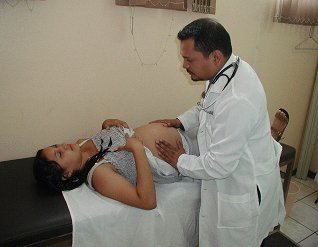

# PRÉ-NATAL NA ATENÇÃO PRIMÁRIA

O pré-natal na Atenção Primária à Saúde (APS) não é apenas uma sucessão de consultas e exames laboratoriais. Se você encarar assim, vai errar questões de prova e, pior, vai falhar com sua paciente. O pré-natal é o momento de maior capilaridade do sistema de saúde na vida de uma mulher. É onde aplicamos a integralidade, a humanização e a vigilância epidemiológica na veia.

Para a prova de residência, você precisa entender que o Ministério da Saúde e as bancas não querem apenas que você saiba a dose do Ferro. Eles querem saber se você entende o papel do Médico de Família e Comunidade (MFC) no acolhimento, na identificação de vulnerabilidades e na condução de situações de violência.

*Figura 1 - Consulta pré-natal com palpação abdominal para avaliação do crescimento fetal, parte fundamental do acompanhamento gestacional na Atenção Primária à Saúde. Fonte: USAID, Domínio Público | Wikimedia Commons*

## Organização e Acolhimento: O Primeiro Passo

O pré-natal deve ser precoce. O ideal é que a captação ocorra até a 12ª semana de gestação. Por que isso é tão batido nas provas? Porque o início precoce reduz drasticamente a mortalidade neonatal precoce e tardia, além da mortalidade perinatal. É nesse início que fazemos a avaliação pré-concepcional (quando possível) ou a primeira abordagem para reduzir riscos.

O acolhimento é multiprofissional. O médico não é o único protagonista; a equipe de enfermagem, os agentes comunitários e o NASF (quando disponível) compõem a rede. O papel do MFC é ativo em todas as etapas, garantindo que a gestante não seja apenas "mais um número" na agenda.

Lembre-se da Rede Cegonha: ela é a estratégia que organiza a atenção à saúde materna e infantil no Brasil, focando no planejamento reprodutivo, na confirmação da gravidez, no pré-natal, no parto e no puerpério. O objetivo central é o nascimento seguro e a redução da morbimortalidade.

## Calendário e Rotina de Consultas

A recomendação mínima do Ministério da Saúde é de 6 consultas, preferencialmente seguindo o cronograma:

- Até a 28ª semana: Mensais.

- Da 28ª à 36ª semana: Quinzenais.

- Da 36ª até o parto: Semanais.

Na prática da APS, o cuidado é compartilhado. Não existe "alta" do pré-natal; a gestante deve ser acompanhada até o momento do parto e retornar precocemente no puerpério.

### Ganho de Peso na Gestação

Este é um ponto que gera muitas questões de cálculo. O ganho de peso não é igual para todas. Ele depende do IMC pré-gestacional.

| IMC Pré-gestacional (kg/m²) | Classificação | Ganho de Peso Total Recomendado |
| --- | --- | --- |
| < 18,5 | Baixo Peso | 12,5 a 18,0 kg |
| 18,5 - 24,9 | Eutrofia | 11,5 a 16,0 kg |
| 25,0 - 29,9 | Sobrepeso | 7,0 a 11,5 kg |
| ≥ 30,0 | Obesidade | 5,0 a 9,0 kg |

Cuidado: A banca pode colocar uma gestante com sobrepeso e perguntar o ganho ideal. Se ela começar com IMC de 27, o limite é 11,5 kg. Passou disso, já estamos fora da meta.

## Exames de Rotina: O que pedir e quando pedir

Aqui está o "feijão com arroz" que você precisa dominar. O Ministério da Saúde divide os exames por trimestres.

**Primeiro Trimestre (ou na primeira consulta):**

- Hemograma completo.

- Glicemia de jejum (Cuidado: se ≥ 92 mg/dL, já é Diabetes Gestacional).

- Tipagem sanguínea e Fator Rh.

- Coombs Indireto (se a gestante for Rh negativo).

- Testes rápidos: HIV, Sífilis e Hepatite B.

- Sorologias: Toxoplasmose (IgM e IgG).

- Urina tipo 1 (EAS) e Urocultura (Padrão ouro para rastrear bacteriúria assintomática).

- Citopatológico de colo de útero (se indicado pela idade e periodicidade).

**Segundo Trimestre:**

- Teste de Tolerância Oral à Glicose (TOTG 75g) entre 24 e 28 semanas (para quem teve glicemia de jejum normal no 1º tri).

**Terceiro Trimestre:**

- Repetir: Hemograma, Glicemia de jejum, Testes rápidos (HIV, Sífilis, Hep B), Toxoplasmose (se IgG negativo), EAS e Urocultura.

- Rastreamento de Streptococcus do Grupo B (GBS): Coleta de swab vaginal e anal entre 35 e 37 semanas.

Erro clássico de prova: Achar que lipidograma ou creatinina fazem parte da rotina de baixo risco. Não fazem. O foco é em infecções e condições que alteram o desfecho obstétrico imediato.

*Figura 2 - Estrutura química do ácido fólico (vitamina B9), suplementação essencial no pré-natal para prevenção de defeitos do tubo neural, recomendada desde o período periconcepcional. Fonte: Mysid, Domínio Público | Wikimedia Commons*

## Suplementação e Prevenção

### Ácido Fólico e Ferro

**Ácido Fólico:** Deve ser iniciado idealmente 60 a 90 dias antes da concepção. A dose padrão para prevenção de Defeitos do Tubo Neural (DTN) é de 0,4 mg/dia. No entanto, em pacientes de alto risco (filho anterior com DTN, uso de anticonvulsivantes), a dose sobe para 5 mg/dia.

**Sulfato Ferroso:** Segundo as diretrizes do Ministério da Saúde (Programa Nacional de Suplementação de Ferro - PNSF), a suplementação deve seguir as seguintes recomendações:

| Situação | Dose de Fe Elementar | Período |
| --- | --- | --- |
| **Gestante com Hb ≥ 11 g/dL** | 40 mg/dia | Da confirmação da gestação até 3 meses pós-parto |
| **Gestante com anemia (Hb < 11 g/dL)** | 60-120 mg/dia | Até normalização + 3 meses |
| **Puerpério (Hb normal)** | 65 mg/dia de Fe elementar | Até 3 meses pós-parto |

**Atenção:** No pós-parto, reavaliar hemograma e ferritina sérica após 8 semanas de suplementação. O objetivo é manter estoques adequados de ferro durante a amamentação.

### Vacinação Gestacional

A vacinação é uma ferramenta de prevenção primária essencial.

- **Influenza:** Uma dose em qualquer período gestacional (campanha anual).

- **Hepatite B:** 3 doses, dependendo do histórico vacinal.

- **dTpa (Tríplice bacteriana acelular):** A partir da 20ª semana. O objetivo principal aqui é a transferência de anticorpos para o feto, protegendo o recém-nascido contra a coqueluche.

## Manejo de Infecções e Condições Comuns

### Sífilis na Gestação

Este é, talvez, o tema mais cobrado. O tratamento de escolha é a Penicilina Benzatina. A dose depende do estágio:

- Sífilis Primária, Secundária ou Latente Recente (< 1 ano): 2,4 milhões UI (dose única).

- Sífilis Latente Tardia (> 1 ano ou tempo ignorado) ou Terciária: 7,2 milhões UI (3 doses de 2,4 milhões, com intervalo semanal).

Lembre-se: O tratamento só é considerado adequado se feito com penicilina, finalizado pelo menos 30 dias antes do parto e se o parceiro também for tratado (embora a notificação do parceiro seja fundamental, a falta de tratamento dele não invalida mais o tratamento da mãe para fins de notificação de sífilis congênita, mas aumenta o risco de reinfecção).

### Toxoplasmose

Se a gestante tem IgG negativo e IgM positivo, ou ambos positivos com menos de 16 semanas, você deve solicitar o Teste de Avidez de IgG.

- Alta avidez (> 60%): Infecção ocorreu há mais de 4 meses (antes da gestação). Tranquilize a paciente.

- Baixa avidez (< 30%): Infecção recente. Iniciar tratamento e investigar o feto.

A prevenção é baseada em orientações de higiene: não comer carne crua/malpassada, lavar bem frutas e verduras, e evitar contato com fezes de gatos.

### Infecção do Trato Urinário (ITU)

Na gestante, tratamos inclusive a bacteriúria assintomática (presença de > 100.000 UFC/ml em paciente sem sintomas). Por que? Porque a gestante tem alterações anatômicas (dilatação ureteral) e hormonais (progesterona relaxa a musculatura lisa) que facilitam a progressão para pielonefrite, o que aumenta o risco de parto prematuro.

- Opções: Fosfomicina 3g (dose única), Nitrofurantoína 100mg (7 dias - evitar no termo pelo risco de anemia hemolítica no RN) ou Cefalexina.

### Escabiose

Prurido noturno e lesões em dobras? Pense em escabiose. O tratamento na gestante é com Permetrina 5%. Importante: trate todos os contatos domiciliares, mesmo os assintomáticos, para evitar o efeito "pingue-pongue". A permetrina é segura para lactentes acima de 2 meses.

## Saúde Mental e Aspectos Psicossociais

A gestação é uma crise do ciclo vital. É um momento de reorganização de papéis parentais e ajustes na díade conjugal. O médico deve estar atento ao estresse psicossocial e à saúde mental. O PNAISM (Política Nacional de Atenção Integral à Saúde da Mulher) foca na integralidade, mas cuidado: ele não prevê um modelo global de saúde mental específico, focando mais nos eixos reprodutivos e de violência.

A depressão pós-parto começa a ser prevenida no pré-natal, através da escuta ativa e do fortalecimento da rede de apoio. Famílias com filhos pequenos precisam de ajuda para aceitar novos membros e ajustar a rotina, incluindo o papel dos avós.

## Violência Doméstica e Sexual

Este tema é onipresente em provas de Medicina Preventiva. A violência é um ato intencional de abuso de poder e NUNCA deve ser naturalizada.

### Violência Doméstica

A Lei Maria da Penha (Lei nº 11.340/2006) modernizou o conceito de família e proteção à mulher. Na suspeita de violência doméstica, a conduta do médico é:

- Acolhimento e escuta ativa (sem julgamentos).

- Avaliação de risco imediato.

- Notificação compulsória (é obrigatória em casos de suspeita ou confirmação de violência contra a mulher).

- Orientação sobre direitos e rede de proteção (Casa da Mulher Brasileira, Delegacia da Mulher).

Muitas mulheres não abandonam o agressor imediatamente devido ao ciclo da violência (lua de mel, tensão, explosão) e à dependência financeira ou emocional. O papel da equipe é de suporte contínuo.

### Violência Sexual

O atendimento deve ser imediato e incondicional. Não é necessário boletim de ocorrência ou exame de corpo de delito para que a saúde realize os procedimentos de profilaxia.

**Conduta na Violência Sexual (Janela de 72 horas):**

- **Profilaxia Pós-Exposição (PEP) para HIV:** Esquema antirretroviral por 28 dias.

- **Profilaxia para ISTs bacterianas:** Azitromicina (sífilis/chlamydia), Ceftriaxona (gonorreia) e Metronidazol (tricomoníase).

- **Contracepção de Emergência:** Levonorgestrel 1,5 mg (o mais rápido possível).

- **Hepatite B:** Vacina (se não imunizada) + Imunoglobulina específica (IGHB) em até 14 dias (idealmente nas primeiras 48h).

Se a paciente já é vacinada para Hepatite B com esquema completo, a IGHB é dispensada. A coleta de material forense é opcional e depende do consentimento da vítima, mas é útil para a justiça.

**Aborto Legal:** No Brasil, é permitido em três situações: risco de vida para a mãe, anencefalia fetal e gravidez resultante de estupro. No caso de estupro, basta o relato da paciente e o consentimento informado. Não se exige autorização judicial ou BO.

## Saúde Bucal na Gestação

Existe um mito de que a gestante não pode ir ao dentista. Errado! O tratamento odontológico é seguro e necessário. A periodontite é um fator de risco para parto prematuro e baixo peso ao nascer devido à translocação de mediadores inflamatórios.

A cárie na gestação costuma aumentar não por "perda de cálcio para o bebê" (isso é mito!), mas pelo aumento da frequência alimentar e, muitas vezes, por uma higiene bucal inadequada devido a náuseas e vômitos. O médico deve encaminhar a gestante para o dentista da equipe precocemente.

## Situações Especiais na APS

### Gestação na Adolescência

Embora o percentual de nascidos vivos de mães adolescentes no Brasil tenha diminuído nos últimos anos, ainda é um desafio. O Estatuto da Criança e do Adolescente (ECA) garante o direito ao acompanhante e ao atendimento sigiloso (desde que não haja risco de vida ou crime). O foco deve ser na prevenção da recorrência e no suporte social.

### Tabagismo

A cessação do tabagismo é prioridade. O cigarro está ligado ao descolamento prematuro de placenta, restrição de crescimento intrauterino e morte súbita do lactente. A abordagem deve ser comportamental; o uso de fármacos (como bupropiona ou reposição de nicotina) deve ser criteriosamente avaliado, preferindo-se sempre a terapia não farmacológica primeiro.

### Emergência Hipertensiva na APS

Se você atender uma gestante com PA ≥ 160/110 mmHg, você está diante de uma emergência. A conduta é:

- Estabilização inicial.

- Nifedipino 10mg via oral (não sublingual!).

- Transferência imediata para unidade hospitalar de referência (maternidade).
Não tente manejar pré-eclâmpsia grave ou eclâmpsia apenas na UBS se houver sinais de gravidade.

## O Puerpério e a Vitamina A

O cuidado não acaba no parto. A consulta de puerpério deve ocorrer até o 7º dia (puerpério precoce). É o momento de avaliar a amamentação, o vínculo mãe-filho e a involução uterina.

Uma "pérola" de saúde pública: Em regiões de risco para hipovitaminose A, recomenda-se a administração de uma megadose de Vitamina A (200.000 UI) para a puérpera no pós-parto imediato. Isso garante níveis adequados de retinol no leite materno, protegendo o lactente.

## Tabelas Comparativas para Fixação

### Diagnóstico de Diabetes na Gestação

| Exame | Normal | Diabetes Gestacional | Diabetes Mellitus (Prévia) |
| --- | --- | --- | --- |
| Glicemia de Jejum (1º tri) | < 92 mg/dL | 92 a 125 mg/dL | ≥ 126 mg/dL |
| TOTG 75g (1h) | < 180 mg/dL | ≥ 180 mg/dL | - |
| TOTG 75g (2h) | < 153 mg/dL | 153 a 199 mg/dL | ≥ 200 mg/dL |

### Profilaxia Pós-Exposição Sexual (Resumo)

| Agente | Conduta | Observação |
| --- | --- | --- |
| HIV | Tenofovir + Lamivudina + Dolutegravir | Iniciar em até 72h; manter por 28 dias |
| Sífilis | Penicilina Benzatina 2,4 mi UI | Dose única IM |
| Gonorreia | Ceftriaxona 500mg | Dose única IM |
| Clamídia | Azitromicina 1g | Dose única VO |
| Gravidez | Levonorgestrel 1,5mg | Dose única VO; até 5 dias (ideal 72h) |

### Diferenciação de Conceitos em Saúde da Mulher

| Conceito | Definição | Foco Principal |
| --- | --- | --- |
| PNAISM | Política de Atenção Integral | Mulher em todas as fases da vida (além do reprodutivo) |
| Rede Cegonha | Estratégia de Rede | Parto, nascimento e desenvolvimento infantil (0-24 meses) |
| Humanização | Princípio Transversal | Autonomia da mulher, redução de intervenções desnecessárias |
| Integralidade | Diretriz do SUS | Ver a mulher como um todo, considerando contexto social e mental |

## Pontos-Chave para Prova

- **Mortalidade Materna:** Óbito durante a gestação ou até 42 dias após o parto, por causas ligadas à gravidez. A principal causa no Brasil são as doenças hipertensivas.

- **Ácido Fólico:** 5 mg/dia para prevenção de DTN se houver fator de risco (filho anterior com DTN ou uso de anticonvulsivantes).

- **Glicemia de Jejum:** Se no primeiro trimestre vier entre 92 e 125 mg/dL, o diagnóstico é Diabetes Gestacional. Não precisa de TOTG para confirmar.

- **Sífilis:** O tratamento do parceiro é obrigatório para evitar reinfecção, mas a falta dele não impede o tratamento adequado da mãe (mudança recente de protocolo para evitar subnotificação).

- **Violência Sexual:** A profilaxia (PEP) tem janela de 72 horas. Passou disso, a eficácia para HIV e ISTs é incerta e geralmente não indicada como rotina de urgência.

- **Aborto Legal:** Apenas o consentimento da mulher é necessário em caso de estupro. Exigir BO ou decisão judicial é conduta errada e passível de punição.

- **Ectopia Cervical:** É fisiológica na gestante devido à ação hormonal. Chamar de "ferida" e querer cauterizar é um erro crasso de conduta.

- **Dengue e Amamentação:** A dengue materna NÃO contraindica a amamentação. O risco de transmissão pelo leite é desprezível.

- **Acompanhante:** É um direito garantido por lei (Lei 11.108/2005) durante todo o trabalho de parto, parto e pós-parto imediato.

- **Vitamina A:** Megadose de 200.000 UI no pós-parto para prevenir cegueira noturna e infecções no lactente em áreas endêmicas.

- **GBS:** Swab vaginal e anal entre 35-37 semanas. Se positivo, a profilaxia intraparto com Penicilina Cristalina é indicada (não se trata no pré-natal, exceto se houver urocultura positiva para GBS).

- **Nifedipino:** Primeira escolha para controle de crise hipertensiva (PA ≥ 160/110) na Atenção Primária antes da transferência.

- **Escabiose:** Tratar gestante e contatos. Permetrina 5% é a droga de escolha.

- **Notificação de Violência:** É compulsória e imediata (em até 24h para serviços de saúde) em casos de violência sexual ou tentativa de suicídio.

- **Cárie e Periodontite:** Não são causadas pela gravidez, mas agravadas por ela. O tratamento odontológico é seguro em qualquer trimestre, preferencialmente no segundo.

- **O que NÃO pedir no pré-natal de baixo risco:** Lipidograma, creatinina, ureia, ácido úrico (exceto se suspeita de pré-eclâmpsia), exames de imagem de rotina além da ultrassonografia obstétrica.

 Cópia offline para consulta pessoal.
 Fonte original:
 [https://www.medevo.com.br/material-apoio/ler/dbb80b47-985f-4c88-b1c2-12803a823a9f](https://www.medevo.com.br/material-apoio/ler/dbb80b47-985f-4c88-b1c2-12803a823a9f)
