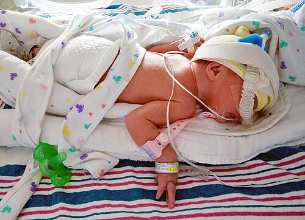

# PREMATURIDADE

Para entender a neonatologia, você precisa dominar a prematuridade. Não é apenas sobre um bebê menor, é sobre um organismo que foi "retirado do forno" antes do tempo e precisa lidar com um ambiente para o qual não estava preparado. Nas provas de residência, o examinador não quer apenas que você saiba que o prematuro é aquele com menos de 37 semanas, ele quer que você entenda as repercussões fisiológicas dessa imaturidade.

*Figura 1 - Recém-nascido prematuro extremo (26 semanas, 990g) intubado e em ventilação mecânica nas primeiras 24 horas de vida, demonstrando a gravidade e necessidade de suporte ventilatório. Fonte: ceejayoz, CC BY 2.0 | Wikimedia Commons*

## Definições e Classificações

A primeira coisa que você deve fixar é que a idade gestacional (IG) é o divisor de águas. Um erro comum é confundir prematuridade com baixo peso. Embora andem juntos com frequência, são conceitos distintos.

### Classificação pela Idade Gestacional

Segundo a Organização Mundial da Saúde (OMS) e a Sociedade Brasileira de Pediatria (SBP), classificamos o recém-nascido (RN) da seguinte forma:

- **Pré-termo (Prematuro):** < 37 semanas (até 36 semanas e 6 dias).

- **Pré-termo tardio:** 34 semanas a 36 semanas e 6 dias. Este grupo é o "queridinho" das bancas, pois muitas vezes parece um bebê a termo, mas tem riscos aumentados de hipoglicemia e distúrbios respiratórios.

- **Muito pré-termo:** 28 semanas a 31 semanas e 6 dias.

- **Pré-termo extremo:** < 28 semanas.

- **Termo:** 37 semanas a 41 semanas e 6 dias.

- **Pós-termo:** ≥ 42 semanas.

### Classificação pelo Peso ao Nascer

O peso é um indicador isolado de risco, mas precisa ser cruzado com a idade gestacional.

- **Baixo Peso (BP):** < 2.500g.

- **Muito Baixo Peso (MBP):** < 1.500g.

- **Extremo Baixo Peso (EBP):** < 1.000g.

### A Relação Peso x Idade Gestacional (Curvas de Crescimento)

Aqui entra o conceito de PIG, AIG e GIG. Usamos curvas de referência (como as de Fenton ou Intergrowth-21st) para plotar o peso e a IG.

- **PIG (Pequeno para a Idade Gestacional):** Peso abaixo do percentil 10 (p10).

- **AIG (Adequado para a Idade Gestacional):** Peso entre o p10 e o p90.

- **GIG (Grande para a Idade Gestacional):** Peso acima do percentil 90 (p90).

**Dica de Prova:** Um RN de 35 semanas com 2.400g é um pré-termo de baixo peso, mas ele pode ser AIG. Não assuma que todo baixo peso é PIG. Se o peso estiver adequado para aquela semana específica de gestação, ele é AIG. O PIG simétrico (peso, estatura e perímetro cefálico todos baixos) geralmente indica um insulto precoce na gestação, como infecções congênitas ou anomalias genéticas. O PIG assimétrico (apenas o peso baixo) sugere insuficiência placentária no final da gestação.

## Fatores de Risco e Prevenção

Por que um bebê nasce antes do tempo? As causas são multifatoriais, mas para a prova, foque em:

- **Antecedente de parto prematuro anterior:** É o principal fator de risco isolado.

- **Infecções:** Especialmente a Infecção do Trato Urinário (ITU) e a vaginose bacteriana. Lembre-se: bacteriúria assintomática na gestante DEVE ser tratada para prevenir prematuridade.

- **Fatores uterinos e cervicais:** Colo curto (medido pelo ultrassom transvaginal) ou incompetência istmocervical.

- **Causas iatrogênicas:** Interrupção da gravidez por pré-eclâmpsia ou sofrimento fetal.

**Prevenção:** A diretriz da FEBRASGO e do Ministério da Saúde recomenda o uso de progesterona natural micronizada para gestantes com antecedente de parto prematuro OU com colo curto (< 20-25 mm no segundo trimestre). Isso reduz significativamente o risco de um novo evento.

## Avaliação da Idade Gestacional no Exame Físico

Se a mãe não fez pré-natal ou não sabe a data da última menstruação (DUM), o pediatra precisa estimar a IG na sala de parto.

### Método de Capurro

Muito usado para bebês > 29 semanas. Avalia somatoscopia (formação da orelha, glândula mamária, mamilo, textura da pele e pregas plantares). O Capurro somático é o mais comum, mas o somato-neurológico é mais preciso em alguns contextos.

### Escala de Ballard (ou New Ballard)

É a escolha para o prematuro extremo. Ela combina critérios físicos e neuromusculares.

- **Critérios Físicos:** Pele (transparente no extremo), lanugo, superfície plantar (pregas), mama, olho/orelha e genitália.

- **Critérios Neuromusculares:** Postura, ângulo do punho (janela quadrada), recolhimento do braço, ângulo poplíteo, sinal do cachecol e calcanhar à orelha.

**O que cai na prova:** No prematuro, a pele é fina, gelatinosa e pode ter muita lanugo (hipertricose lanuginosa). As orelhas têm pouca cartilagem e não voltam rápido quando dobradas. O tecido mamário é escasso ou ausente. Nos meninos, os testículos estão altos (canal inguinal ou criptorquidia) e o escroto tem poucas rugosidades. Nas meninas, os pequenos lábios e o clitóris são proeminentes, pois os grandes lábios ainda não os recobrem.

*Figura 2 - Recém-nascido prematuro em incubadora na UTI Neonatal, demonstrando o ambiente de cuidados intensivos necessário para a assistência ao prematuro. Fonte: Peter K Burian, CC BY-SA 4.0 | Wikimedia Commons*

## Desafios Fisiológicos e Complicações

O prematuro é um ser de vidro. Cada sistema tem uma fragilidade específica que você precisa conhecer para não errar a conduta.

### Termorregulação

O prematuro perde calor muito fácil. Por quê?

- Grande superfície corporal em relação ao peso.

- Escassez de gordura marrom (responsável pela termogênese sem calafrios).

- Pele fina e permeável (perda de calor por evaporação).

**Conduta:** Ambiente térmico neutro. Para prematuros < 1.500g, usamos saco plástico de polietileno e touca na sala de parto, sem secar o bebê antes (para evitar perda por evaporação). O objetivo é evitar a hipotermia, que leva à acidose metabólica e maior consumo de oxigênio.

### Sistema Respiratório

A grande estrela aqui é a **Doença da Membrana Hialina (Síndrome do Desconforto Respiratório - SDR)**.

- **Fisiopatologia:** Deficiência de surfactante. O alvéolo colapsa na expiração (atelectasia), gerando shunt intrapulmonar e hipoxemia.

- **Fator de Risco Clássico:** Prematuridade e filhos de mães diabéticas. A hiperinsulinemia fetal do filho de mãe diabética inibe a síntese de surfactante pelas células alveolares tipo II, mesmo que o bebê seja a termo.

- **Raio-X:** Infiltrado reticulogranular difuso ("vidro fosco") com broncogramas aéreos e volume pulmonar reduzido.

**Tratamento:** CPAP precoce em sala de parto e, se necessário, surfactante exógeno.

Outra complicação é a **Displasia Broncopulmonar (DBP)**, definida como a necessidade de oxigênio suplementar por pelo menos 28 dias. É a doença pulmonar crônica do prematuro, causada por oxigênio em altas concentrações e ventilação mecânica (barotrauma/volutrauma).

### Sistema Cardiovascular

O **Persistência do Canal Arterial (PCA)** é onipresente no prematuro. No feto, o canal arterial desvia o sangue do pulmão para a aorta. Após o nascimento, ele deve fechar. No prematuro, a baixa sensibilidade ao oxigênio e os altos níveis de prostaglandinas mantêm o canal aberto.

- **Clínica:** Sopro sistólico (ou contínuo), pulsos amplos (pediosos visíveis) e precórdio hiperdinâmico.

- **Tratamento:** Se houver repercussão hemodinâmica, usamos inibidores da síntese de prostaglandinas, como Ibuprofeno ou Indometacina.

### Sistema Gastrointestinal e Nutrição

O prematuro tem coordenação de sucção e deglutição apenas após 32-34 semanas. Antes disso, precisa de sonda.
O leite materno é fundamental. O leite de mãe de prematuro é diferente: tem mais proteínas, eletrólitos (sódio/cloreto) e gorduras do que o leite de mãe de bebê a termo. Ele protege contra a **Enterocolite Necrosante (ECN)**, a maior emergência GI do período neonatal.

**Pérola do Dr. Will:** Se a questão mostrar um prematuro com distensão abdominal, resíduo gástrico bilioso e sangue nas fezes, pense em ECN. O sinal radiológico clássico é a **pneumatose intestinal** (ar na parede do intestino).

### Sistema Neurológico

A **Hemorragia Peri-intraventricular (HIPV)** ocorre na matriz germinativa, uma área ricamente vascularizada e frágil no cérebro do prematuro. Ocorre geralmente nos primeiros 3 dias de vida. Por isso, fazemos triagem com Ultrassom Transfontanela de rotina em prematuros < 32 semanas.

## Crescimento e Desenvolvimento: A Idade Corrigida

Este é um dos pontos que mais reprovam alunos. Você precisa diferenciar **Idade Cronológica** de **Idade Corrigida**.

- **Idade Cronológica:** Tempo decorrido desde o nascimento. Usada para **VACINAÇÃO**.

- **Idade Corrigida:** Idade que o bebê teria se tivesse nascido com 40 semanas. Usada para avaliar **CRESCIMENTO E DESENVOLVIMENTO** até os 2 anos de idade.

**Como calcular?**
Idade Corrigida = Idade Cronológica - (40 semanas - IG de nascimento).
Exemplo: Bebê nasceu com 32 semanas. Hoje ele tem 12 semanas de vida (3 meses).
40 - 32 = 8 semanas de "atraso".
Idade Corrigida = 12 semanas - 8 semanas = 4 semanas (1 mês).
Portanto, esse bebê de 3 meses deve ser avaliado nos marcos do desenvolvimento de um bebê de 1 mês.

## Imunização no Prematuro

A regra de ouro é: o prematuro segue o calendário da idade cronológica. Mas existem três exceções críticas que as bancas amam:

- **Vacina BCG:** Só pode ser aplicada se o RN tiver peso ≥ 2.000g. Se nasceu com 1.500g, espera chegar a 2kg. Se após 6 meses não houver cicatriz, a recomendação atual do Ministério da Saúde é NÃO revacinar (mudança recente, mas algumas bancas antigas ainda podem cobrar a revacinação).

- **Vacina Hepatite B:** Se o bebê tiver < 2.000g ou < 34 semanas, o esquema muda. Em vez de 3 doses, ele recebe 4 doses (0, 1, 2 e 6 meses). Isso porque a resposta imune é menor.

- **Vacina Rotavírus:** Deve ser feita na idade cronológica, mas se o bebê estiver internado na UTI Neonatal, ele NÃO recebe a vacina para não disseminar o vírus vivo no ambiente hospitalar. Ele só vacina se receber alta dentro da janela de oportunidade.

**Palivizumabe:** Não é vacina, é um anticorpo monoclonal (imunização passiva) contra o Vírus Sincicial Respiratório (VSR).

- **Quem recebe?**

- Prematuros < 29 semanas (até 1 ano de idade).

- Crianças < 2 anos com doença pulmonar crônica da prematuridade ou cardiopatia congênita com repercussão hemodinâmica.

- Prematuros entre 29 e 31 semanas e 6 dias (até os 6 meses de idade) - *Nota: Critério da SBP, o Ministério da Saúde é mais restrito.*

## Suplementação de Ferro e Vitaminas

O prematuro não teve tempo de receber o estoque de ferro da mãe no terceiro trimestre. Por isso, a suplementação é precoce e em doses maiores.

| Categoria de Peso ao Nascer | Dose de Ferro Elementar | Início |
| --- | --- | --- |
| RN a termo (> 2500g) | 10-12,5 mg/dia dose fixa (SBP 2026) | A partir dos 6 meses, em ciclos (6-9m e 12-15m) |
| Baixo Peso (1500g a 2500g) | 2 mg/kg/dia | A partir de 30 dias de vida |
| Muito Baixo Peso (1000g a 1500g) | 3 mg/kg/dia | A partir de 30 dias de vida |
| Extremo Baixo Peso (< 1000g) | 4 mg/kg/dia | A partir de 30 dias de vida |

**Vitamina D:** 400 UI/dia a partir da primeira semana de vida para todos os RNs, independente do peso.

## Malformações e Condições Cirúrgicas Neonatais

Muitas vezes a prematuridade vem acompanhada de malformações que exigem diagnóstico rápido.

### Atresia de Esôfago

Suspeite se houver polidrâmnio na gestação e o bebê apresentar salivação excessiva ("sialorreia") e engasgos na primeira mamada. A associação clássica é a **VACTERL** (Vertebral, Anal, Cardíaca, Traqueoesofágica, Renal, Limb/Membros). O diagnóstico é feito pela impossibilidade de passar a sonda orogástrica (ela enrola no coto esofágico).

### Defeitos da Parede Abdominal

Aqui a MedEvo quer que você não confunda:

| Característica | Gastrosquise | Onfalocele |
| --- | --- | --- |
| Localização | À direita do cordão umbilical | No centro (pelo cordão) |
| Membrana | Ausente (alças expostas) | Presente (saco herniário) |
| Malformações | Raras | Frequentes (Cardíacas, Trissomias) |
| Conduta | Proteção das alças e cirurgia | Proteção e cirurgia |

### Hérnia Diafragmática Congênita (Bochdalek)

A mais comum é a de Bochdalek (póstero-lateral esquerda).

- **Clínica:** Desconforto respiratório grave ao nascer, abdome escavado e ruídos hidroaéreos no tórax.

- **Cuidado:** NUNCA faça ventilação com bolsa-válvula-máscara (Ambu), pois você vai insuflar o estômago e o intestino que estão no tórax, comprimindo ainda mais o pulmão hipoplásico. A conduta é intubação imediata.

## O Exame Físico e Achados Fisiológicos

Ao examinar um prematuro ou um RN a termo, você encontrará achados que parecem patológicos, mas são normais:

- **Bossa Serossanguínea:** Edema do couro cabeludo que atravessa as suturas cranianas. Presente ao nascimento, resolve em dias.

- **Céfalo-hematoma:** Hemorragia subperiosteal que NÃO atravessa suturas. Aparece horas após o parto. Pode causar icterícia (pela reabsorção do sangue).

- **Mancha Melanocítica Dérmica (Mancha Mongólica):** Mancha azulada em região sacral, comum em negros e asiáticos.

- **Eritema Tóxico:** Erupção cutânea com base eritematosa e vesícula central (cheia de eosinófilos). É benigno.

- **Reflexo Tônico Cervical Assimétrico (Reflexo de Magnus-Kleijn):** Ao girar a cabeça do bebê, ele estende o braço do lado para onde olhou e flexiona o oposto ("posição de esgrimista"). É normal até os 4-6 meses.

## Pontos-Chave para Prova

- **Definição de Prematuro:** Todo RN com menos de 37 semanas de idade gestacional.

- **Idade Corrigida:** Essencial para avaliar desenvolvimento e crescimento até os 2 anos. Não use idade cronológica para marcos motores em prematuros.

- **Vacinação:** Use a idade cronológica. Exceção: BCG (mínimo 2.000g) e Hepatite B (esquema de 4 doses se < 2.000g ou < 34s).

- **SDR (Membrana Hialina):** Deficiência de surfactante. Típico de prematuros e filhos de mães diabéticas. Raio-X com padrão de vidro fosco.

- **Enterocolite Necrosante:** Principal proteção é o leite materno. Sinal radiológico: pneumatose intestinal.

- **Persistência do Canal Arterial:** Tratar com Ibuprofeno ou Indometacina se houver repercussão (sopro, pulsos amplos, congestão pulmonar).

- **Suplementação de Ferro:** Começa com 30 dias de vida para prematuros/baixo peso. A dose depende do peso de nascimento (2 a 4 mg/kg/dia).

- **Retinopatia da Prematuridade (ROP):** Causada pelo uso descontrolado de oxigênio. O alvo de saturação no prematuro deve ser rigoroso (geralmente 91-95%).

- **Hérnia Diafragmática:** Abdome escavado + desconforto respiratório. Contraindicação absoluta: ventilação com máscara (Ambu). Intubação é a regra.

- **Gastrosquise:** Alças para fora, sem saco, à direita do umbigo. Menos associada a síndromes que a onfalocele.

- **Atresia de Esôfago:** Sialorreia e engasgos. Sonda não passa. Pesquisar VACTERL (especialmente malformações cardíacas).

- **Perda de Peso Fisiológica:** O RN pode perder até 10% do peso nos primeiros dias. Deve recuperar em até 10-14 dias.

- **Pérola de Ouro:** O prematuro tardio (34-36s) é o que mais cai em pegadinhas. Ele parece bem, mas faz muita hipoglicemia e icterícia. Monitore de perto. 💡

 Cópia offline para consulta pessoal.
 Fonte original:
 [https://www.medevo.com.br/material-apoio/ler/9b7c1d4d-4ad4-40ed-96ca-15b287432794](https://www.medevo.com.br/material-apoio/ler/9b7c1d4d-4ad4-40ed-96ca-15b287432794)
