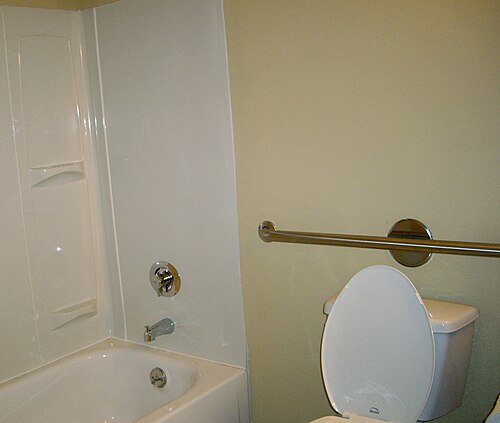

# PREVENÇÃO DE QUEDAS

Quando falamos em prevenção de quedas na residência médica, muitos alunos cometem o erro de achar que este é um tema puramente "de bom senso". Afinal, quem não sabe que tapetes soltos são perigosos? Mas as bancas não querem o seu bom senso, elas querem que você entenda a queda como uma **Síndrome Geriátrica** complexa, com raízes na fisiologia do envelhecimento, na farmacologia e na organização do sistema de saúde.

A queda não é um evento isolado, ela é o desfecho de uma falha em múltiplos sistemas. Para o Dr. Will e para a equipe da MedEvo, entender esse tema significa compreender como o corpo do idoso se comporta e como o ambiente interage com essa biologia.

## O Cenário Epidemiológico e a Heterogeneidade do Idoso

O primeiro conceito que você precisa levar para a prova é que a população idosa brasileira é profundamente **heterogênea**. Esqueça a ideia de que todo idoso de 70 anos é igual. Temos desde o idoso "atleta", com excelente reserva funcional, até o idoso frágil, com múltiplas comorbidades. Essa heterogeneidade é determinada por fatores genéticos, mas principalmente pelo perfil epidemiológico e social.

As quedas são um problema de saúde pública porque representam a principal causa de trauma em idosos. A queda da própria altura é o mecanismo mais comum e, ao contrário do que ocorre em jovens, no idoso ela carrega uma altíssima morbimortalidade. Quando um idoso cai e fratura o quadril, o risco de morte no primeiro ano após o evento chega a 20 ou 30%.

Por que isso acontece? Porque a queda gera um efeito cascata. O idoso que cai desenvolve a **Síndrome Pós-Queda** (ptofobia), que é o medo de cair novamente. Esse medo leva à restrição de atividades, que leva à imobilidade, que gera mais sarcopenia, que, por fim, aumenta ainda mais o risco de novas quedas. É um ciclo vicioso que a prova vai cobrar que você saiba interromper.

*Figura 1 - Barra de apoio (grab bar) instalada em banheiro, uma das principais adaptações ambientais para prevenção de quedas em idosos. Fonte: Gramody, CC BY-SA 2.0 | Wikimedia Commons*

## Fisiologia do Envelhecimento: Por que o Idoso Cai?

Para entender a prevenção, você deve entender por que o equilíbrio falha. O controle postural depende da integração de três sistemas: sensorial (visão, vestibular e propriocepção), processamento central e resposta motora.

No idoso, todos esses sistemas podem estar comprometidos. A diminuição da acuidade visual e da sensibilidade ao contraste dificulta a identificação de obstáculos. No sistema motor, ocorre a **sarcopenia**, que é a perda de massa e força muscular, especialmente das fibras do tipo II (de contração rápida), essenciais para "recuperar" o equilíbrio após um tropeço.

Outro ponto fisiológico fundamental, e que as bancas adoram, é a termorregulação. O idoso apresenta uma redução no fluxo sanguíneo cutâneo e uma diminuição da sudorese. Isso torna a resposta ao calor menos eficiente, aumentando o risco de hipertermia e desidratação, o que pode levar a episódios de síncope ou tontura, culminando em queda.

### Hipotensão Ortostática

A hipotensão postural ou ortostática é uma causa clássica de quedas. Ela é definida pela queda da pressão arterial sistólica em pelo menos 20 mmHg ou da diastólica em 10 mmHg após 3 minutos em ortostase.

Por que isso ocorre no idoso? Pela menor sensibilidade dos barorreceptores e pelo uso de medicações. O tratamento aqui é um "prato cheio" para questões:

- Medidas não farmacológicas: aumentar a ingestão de líquidos, usar meias elásticas e evitar levantar-se bruscamente.

- Ajuste medicamentoso: suspender a restrição de sódio (se possível) e revisar anti-hipertensivos.

- Tratamento farmacológico: em casos refratários, pode-se considerar o uso de **fludrocortisona**.

## Fatores de Risco: O que a Banca vai te perguntar

As questões costumam dividir os fatores de risco em intrínsecos (do próprio paciente) e extrínsecos (do ambiente).

### Fatores Intrínsecos

O principal fator de risco para uma nova queda é a **história de queda no último ano**. Se o paciente já caiu, a chance de cair de novo é altíssima. Outros fatores incluem:

- Idade avançada (especialmente acima de 80 anos).

- Sexo feminino (maior prevalência de osteoporose e sarcopenia).

- Déficit cognitivo: Atenção aqui! O déficit cognitivo aumenta o risco de quedas, não o contrário. Idosos com demência têm menor percepção de risco e marcha alterada.

- Polifarmácia: O uso de 5 ou mais medicamentos.

- Uso de Benzodiazepínicos: Estes são os grandes vilões. Eles causam sedação, lentificação de reflexos e ataxia. Em estudos de coorte, o uso de "benzos" está diretamente ligado ao aumento de fraturas de quadril.

### Fatores Extrínsecos

São os riscos ambientais. Cerca de 30 a 50% das quedas ocorrem dentro de casa.

- Iluminação inadequada.

- Tapetes soltos (o maior inimigo do fêmur do idoso).

- Ausência de corrimãos em escadas e barras de apoio em banheiros.

- Calçados inadequados (chinelos soltos ou sapatos com sola lisa).

| Fator de Risco | Tipo | Intervenção Prioritária |
| --- | --- | --- |
| História de queda prévia | Intrínseco | Avaliação Geriátrica Ampla (AGA) |
| Benzodiazepínicos | Intrínseco | Desmame e substituição por higiene do sono |
| Tapetes soltos | Extrínseco | Remoção imediata |
| Sarcopenia | Intrínseco | Exercício de resistência (fortalecimento) |
| Baixa iluminação | Extrínseco | Adaptação ambiental (luzes de vigília) |

## Avaliação do Risco de Queda: Ferramentas Práticas

Como médico, você não pode apenas dizer "cuidado para não cair". Você precisa estratificar o risco.

### Escala de Morse

Muito utilizada no ambiente hospitalar. Ela avalia seis itens: histórico de quedas, diagnóstico secundário, auxílio na deambulação, terapia intravenosa, tipo de marcha e estado mental. Uma pontuação elevada indica a necessidade de intervenções imediatas de segurança do paciente.

### Teste Get Up and Go (TUG)

O paciente deve levantar de uma cadeira, caminhar 3 metros, virar, voltar e sentar. Se ele levar mais de 12 a 14 segundos, o risco de queda é considerado elevado. É um teste simples que avalia equilíbrio dinâmico e força.

### FRAX (Fracture Risk Assessment Tool)

O FRAX é uma ferramenta essencial para a prova. Ele calcula a probabilidade de o paciente sofrer uma fratura osteoporótica maior (vértebra, antebraço, quadril ou úmero) ou uma fratura de quadril isolada nos próximos 10 anos.

O que você precisa saber sobre o FRAX:

- Ele pode ser calculado **com ou sem** o resultado da densitometria óssea.

- Leva em conta fatores como idade, sexo, IMC, uso de glicocorticoides (que prejudicam a qualidade óssea), tabagismo, álcool e artrite reumatoide.

- **Dica de prova:** O baixo peso (baixo IMC) é um fator de risco para fraturas. Já o alto IMC não é considerado fator de risco para fraturas no FRAX, embora a obesidade traga outros problemas. Na verdade, a perda de peso não intencional no idoso é um sinal de fragilidade.

*Figura 2 - Prótese de quadril, utilizada no tratamento cirúrgico de fraturas de fêmur proximal, uma das principais consequências das quedas em idosos. Fonte: Domínio Público | Wikimedia Commons*

## Prevenção Primária, Secundária e Proteção Específica

A prevenção de quedas é um exemplo clássico de níveis de prevenção em saúde coletiva.

- **Prevenção Primária:** Atuar antes da queda ocorrer. Aqui entram as orientações de segurança domiciliar e a promoção de atividade física.

- **Proteção Específica:** É uma subdivisão da prevenção primária. Exemplos: adaptação do ambiente (colocar barras no banheiro) e uso de calçados antiderrapantes.

- **Prevenção Secundária:** Atuar após a primeira queda para evitar a recorrência e as complicações. Aqui entra o tratamento da osteoporose e a reabilitação física.

### Adaptação Ambiental: O Check-list da Prova

Se a questão descreve um idoso com demência ou déficit de marcha, a intervenção inicial prioritária costuma ser a **fisioterapia aliada à adaptação ambiental**.

- Banheiros: Barras de apoio e tapetes de borracha dentro do box.

- Quartos: Interruptores de luz próximos à cama e retirada de móveis baixos (pufes).

- Escadas: Corrimãos bilaterais e faixas antiderrapantes nos degraus.

- Cozinha: Objetos de uso frequente devem estar na altura da cintura, evitando o uso de escadinhas ou bancos.

## O Papel do Exercício Físico

Não basta caminhar. Para prevenir quedas, o programa de exercícios deve ser multicomponente. O foco principal deve ser o **fortalecimento muscular** (resistência) e o **treinamento de equilíbrio**.

O fortalecimento dos membros inferiores é crucial para que o idoso consiga realizar tarefas básicas, como levantar da privada ou do sofá sem apoio. O treinamento de equilíbrio (como o Tai Chi Chuan, frequentemente citado em diretrizes) ajuda na resposta proprioceptiva.

## Manejo da Osteoporose e Vitamina D

A queda é o evento, mas a fratura é a complicação que mata. Por isso, tratar a saúde óssea é parte integrante da prevenção de danos.

A deficiência de vitamina D é comum em idosos devido à menor exposição solar e à menor capacidade de síntese cutânea. A vitamina D não serve apenas para o osso; ela tem receptores nos músculos. Sua deficiência causa fraqueza muscular proximal, aumentando o risco de quedas. Portanto, a reposição de vitamina D em idosos deficientes é uma medida de prevenção de quedas baseada em evidências.

Quanto à osteoporose, o diagnóstico é feito pela densitometria óssea (T-score ≤ -2,5) ou pela presença de fratura por fragilidade. O uso crônico de glicocorticoides (dose equivalente a ≥ 5mg de prednisona por mais de 3 meses) é um fator de risco importante que deve ser monitorado.

## Vacinação no Idoso: Por que cai na prova de quedas?

Você pode se perguntar: "O que vacina tem a ver com queda?". Tudo. Um idoso que contrai Influenza ou uma pneumonia pneumocócica pode apresentar um quadro de **Delirium** ou uma fraqueza muscular aguda (astenia grave), o que leva diretamente à queda.

Segundo o Calendário Nacional de Vacinação do Ministério da Saúde:

- **Influenza:** Dose anual.

- **Pneumocócica (VPP23):** Indicada para idosos a partir de 60 anos que vivem em instituições ou de forma rotineira aos 65 anos (o esquema geralmente inicia com a VPC13 seguida da VPP23 após 6 a 12 meses).

Manter a vacinação em dia é uma forma de vigilância em saúde e prevenção de causas agudas de queda.

## Situações Especiais e Pegadinhas de Prova

### O Idoso no Hospital

No hospital, a prevenção de quedas é um indicador de **Segurança do Paciente**. A medida mais eficaz e considerada "cuidado universal" é a **educação do paciente e de seus familiares**. Eles precisam entender que o ambiente hospitalar é estranho, o chão pode estar úmido e as medicações podem causar tontura.

### Polifarmácia e Desprescrição

Sempre que vir um idoso que cai, olhe a lista de remédios.

- Diuréticos: Podem causar hipovolemia e hipotensão ortostática.

- Neurolépticos e Antidepressivos: Alteram a marcha e o nível de consciência.

- Anti-hipertensivos: Se em excesso, causam síncope.

A otimização da polifarmácia é uma das intervenções mais custo-efetivas na geriatria.

### Exemplo Clínico 1

Paciente, 78 anos, sexo feminino, trazida pela filha por ter apresentado duas quedas da própria altura nos últimos 6 meses, sem perda de consciência. Faz uso de enalapril, hidroclorotiazida, amitriptilina para dor crônica e diazepam para dormir. Ao exame: TUG de 18 segundos, PA sentada 140/90 mmHg e PA em pé (após 3 min) 115/75 mmHg.

**O que está errado aqui?**

- Hipotensão Ortostática: A queda da sistólica foi de 25 mmHg (o critério é ≥ 20).

- Polifarmácia e Drogas Inadequadas: Amitriptilina (tricíclico) e Diazepam (benzo) estão no topo da lista de drogas a evitar em idosos (Critérios de Beers).

- Risco de Queda Confirmado: TUG > 14 segundos e história de quedas prévias.

**Conduta:** Desmame do diazepam, substituição da amitriptilina, ajuste dos anti-hipertensivos e encaminhamento para fisioterapia de fortalecimento e equilíbrio.

## Diagnóstico Diferencial: Queda ou Síncope?

Nem toda queda é "tropeço". Você deve investigar causas agudas:

- **Cardíacas:** Arritmias, estenose aórtica severa.

- **Neurológicas:** Crise convulsiva, AIT (Ataque Isquêmico Transitório).

- **Metabólicas:** Hipoglicemia (comum em diabéticos em uso de insulina ou sulfonilureias).

Se o idoso relata que "apagou" e acordou no chão, a investigação deve focar em síncope. Se ele diz que "tropeçou no tapete", o foco é biomecânico e ambiental.

## Tabelas Comparativas para Fixação

### Tabela 1: Escala de Morse (Simplificada)

| Item | Critério | Pontuação |
| --- | --- | --- |
| Histórico de quedas | Sim (nos últimos 3 meses) | 25 |
| Diagnóstico secundário | Sim (mais de um diagnóstico médico) | 15 |
| Auxílio na deambulação | Nenhum/Acamado/Cadeira de rodas | 0 |
| | Muletas/Bengala/Andador | 15 |
| | Apoio em móveis | 30 |
| Terapia Intravenosa | Sim | 20 |
| Marcha | Normal/Acamado/Cadeira de rodas | 0 |
| | Fraca | 10 |
| | Comprometida | 20 |
| Estado Mental | Orientado (capacidade própria) | 0 |
| | Superestima capacidade/Esquecido | 15 |

*Risco: 0-24 (Baixo), 25-44 (Médio), ≥ 45 (Alto).*

### Tabela 2: Intervenções Ambientais por Cômodo

| Local | Intervenção | Por que? |
| --- | --- | --- |
| Banheiro | Barras de apoio e assento elevado | Facilita a transferência e evita esforço excessivo |
| Corredores | Luzes de vigília noturna | Evita quedas ao ir ao banheiro à noite (nictúria) |
| Sala | Retirar tapetes e fios soltos | Elimina os principais obstáculos de tropeço |
| Cozinha | Armários baixos | Evita que o idoso suba em bancos ou escadas |

### Tabela 3: Diagnóstico Diferencial de Quedas

| Causa | Característica Clínica | Sugestão de Conduta |
| --- | --- | --- |
| Hipotensão Ortostática | Tontura ao levantar, melhora ao deitar | Hidratação, meias elásticas, revisão de diuréticos |
| Sarcopenia | Dificuldade de subir escadas, marcha lenta | Exercício de resistência e aporte proteico |
| Déficit Visual | Quedas em ambientes mal iluminados | Avaliação oftalmológica (catarata/glaucoma) |
| Arritmia | Queda súbita, sem aviso, com palpitação | ECG, Holter 24h |

## Vigilância em Saúde e o Papel do Estado

As quedas em idosos são consideradas um problema de saúde pública que exige investigação intersetorial. Quando um idoso cai recorrentemente em um local específico da cidade (uma calçada esburacada, por exemplo), isso deixa de ser apenas um problema médico e passa a ser um problema de gestão urbana e vigilância em saúde. A notificação e o acompanhamento desses eventos são fundamentais para o planejamento de políticas de envelhecimento ativo.

Lembre-se: a prevenção de quedas é um dos pilares da Avaliação Geriátrica Ampla (AGA). Ao atender um idoso, você deve sempre perguntar: "O senhor caiu no último ano?". Essa pergunta simples pode ser o início de uma intervenção que salvará a vida do paciente.

## Pontos-Chave para Prova

- **Principal fator de risco para novas quedas:** História de queda no último ano.

- **FRAX:** Avalia risco de fratura em 10 anos. Pode ser usado sem densitometria. Baixo IMC é fator de risco; alto IMC não é.

- **Hipotensão Ortostática:** Queda de ≥ 20 mmHg na sistólica ou ≥ 10 mmHg na diastólica após 3 minutos de pé. Tratar com medidas comportamentais e, se necessário, fludrocortisona.

- **Benzodiazepínicos:** São os medicamentos mais associados a quedas e fraturas de quadril em idosos. Devem ser evitados (Critérios de Beers).

- **Heterogeneidade:** O envelhecimento não é um processo homogêneo; idosos da mesma idade podem ter riscos de queda completamente diferentes.

- **Ambiente:** Tapetes soltos são o principal risco extrínseco. A adaptação ambiental é prevenção primária/proteção específica.

- **Exercício:** Deve ser multicomponente, focando em fortalecimento muscular e equilíbrio (ex: Tai Chi Chuan). Caminhada isolada não é suficiente para prevenir quedas.

- **Déficit Cognitivo:** Aumenta significativamente o risco de quedas devido à falta de julgamento de risco e alterações de marcha.

- **Escala de Morse:** Ferramenta de triagem de risco de queda no ambiente hospitalar.

- **Educação:** É a medida universal mais importante para prevenção de quedas em pacientes hospitalizados.

- **Vitamina D:** A deficiência causa fraqueza muscular (miopatia). A reposição ajuda a prevenir quedas em idosos deficientes.

- **Sexo:** O sexo feminino apresenta maior risco de quedas e fraturas osteoporóticas. O sexo masculino NÃO é fator de risco para quedas.

- **Termorregulação:** Idosos têm menor sudorese e menor fluxo cutâneo, o que aumenta o risco de hipertermia e síncope.

- **Vacinação:** Influenza (anual) e Pneumocócica são essenciais para evitar quadros infecciosos que levam à queda por fragilidade aguda.

- **O que NÃO fazer:** Não ignore uma queda única. Ela deve ser sempre investigada, pois é o maior preditor de eventos futuros. Não prescreva benzodiazepínicos para insônia em idosos sem antes tentar medidas de higiene do sono.

 Cópia offline para consulta pessoal.
 Fonte original:
 [https://www.medevo.com.br/material-apoio/ler/41d4a122-2b33-4b54-9d79-e02c751bbcc0](https://www.medevo.com.br/material-apoio/ler/41d4a122-2b33-4b54-9d79-e02c751bbcc0)
