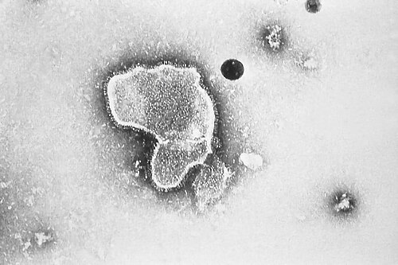
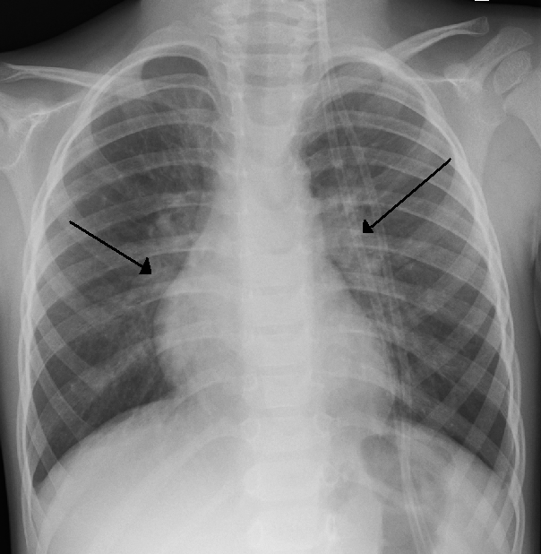

# PREVENÇÃO DO VSR: NIRSEVIMABE E PALIVIZUMABE

O Vírus Sincicial Respiratório (VSR) é, sem sombra de dúvida, o maior vilão da pediatria no que diz respeito a internações hospitalares no primeiro ano de vida. Se você for para um plantão de pronto-socorro infantil entre os meses de março e julho no Brasil, você verá o sistema de saúde quase colapsar por causa desse vírus. Ele é o principal agente etiológico da Bronquiolite Viral Aguda (BVA) e das pneumonias em lactentes.

Mas por que estamos falando de prevenção farmacológica e não de uma vacina comum? Aqui está o primeiro conceito que você precisa entender para não errar em prova: o sistema imunológico do recém-nascido e do lactente jovem é imaturo. Ele não consegue montar uma resposta de anticorpos rápida e robusta o suficiente após uma vacina convencional (imunização ativa) para se proteger contra o VSR logo nos primeiros meses de vida, que é justamente quando o vírus é mais letal.

Por isso, a estratégia que utilizamos é a imunização passiva. Nós entregamos o anticorpo pronto para a criança. É como se, em vez de ensinar o corpo a fabricar as armas (vacina), nós já entregássemos os soldados armados para a batalha (anticorpos monoclonais). Atualmente, temos dois grandes protagonistas nessa história: o veterano Palivizumabe e o recém-chegado Nirsevimabe.

## Fisiopatologia e o Alvo dos Anticorpos

Para entender como esses medicamentos funcionam, você precisa visualizar o vírus. O VSR possui proteínas em sua superfície, sendo a Proteína F (de fusão) a mais importante para nós. É essa proteína que permite que o vírus se funda à membrana da célula respiratória do hospedeiro e injete seu material genético.

Tanto o Palivizumabe quanto o Nirsevimabe são anticorpos monoclonais que se ligam especificamente a essa Proteína F. Ao "grudar" ali, eles impedem que o vírus entre na célula. Se o vírus não entra na célula, ele não se replica. Se não há replicação em massa, não há a cascata inflamatória devastadora que leva ao edema da mucosa, excesso de muco e necrose celular que caracteriza a bronquiolite.

Aqui entra uma dica do Dr. Will: lembre-se que esses anticorpos não tratam a doença instalada. Eles são profiláticos. Se a criança já está com sibilância e desconforto respiratório por VSR, dar Palivizumabe é como tentar trancar a porta depois que o ladrão já está dentro de casa fazendo a limpa. Não funciona.

*Figura 1 - Micrografia eletrônica de transmissão mostrando o Vírus Sincicial Respiratório (VSR/RSV), principal causa de bronquiolite e pneumonia em lactentes. Fonte: CDC, Domínio Público | Wikimedia Commons*

## Palivizumabe: O Clássico das Provas

O Palivizumabe é um anticorpo monoclonal humanizado (IgG1) que dominou o cenário de prevenção por décadas. Nas provas de residência, ele ainda é o tema mais cobrado, especialmente os critérios de indicação do Ministério da Saúde (MS) versus os da Sociedade Brasileira de Pediatria (SBP).

O grande "problema" do Palivizumabe é a sua meia-vida curta, de aproximadamente 20 dias. Isso obriga a criança a receber uma aplicação intramuscular mensal durante o período de circulação do vírus (sazonalidade). No Brasil, o protocolo padrão envolve até 5 doses mensais.

### Indicações do Palivizumabe (Protocolo Ministério da Saúde)

Este é o ponto onde a maioria dos alunos erra por não diferenciar o que o SUS oferece do que a SBP recomenda. Para a prova, foque no que o Ministério da Saúde (Portaria Conjunta nº 23/2018) estabelece, pois é o que define a política pública:

- Prematuros com idade gestacional (IG) menor ou igual a 28 semanas e 6 dias: Apenas no primeiro ano de vida (até 11 meses e 29 dias).

- Crianças com Doença Pulmonar Crônica da Prematuridade (Displasia Broncopulmonar): Até o segundo ano de vida (até 1 ano, 11 meses e 29 dias), desde que tenham necessitado de tratamento (oxigenoterapia, corticoides, diuréticos ou broncodilatadores) nos últimos 6 meses.

- Crianças com Cardiopatia Congênita com repercussão hemodinâmica demonstrada: Também até o segundo ano de vida.

### O que é "Repercussão Hemodinâmica" para a prova?

A banca vai tentar te confundir colocando uma Comunicação Interventricular (CIV) pequena ou um Forame Oval Patente. Isso NÃO indica Palivizumabe. Segundo as diretrizes que o MedEvo analisa, a repercussão hemodinâmica é caracterizada por:

- Insuficiência cardíaca em tratamento medicamentoso.

- Hipertensão pulmonar moderada a grave.

- Cardiopatias cianóticas (como Tetralogia de Fallot ou Transposição de Grandes Vasos).

Se o enunciado diz "CIV pequena sem repercussão", a resposta é: não tem indicação de Palivizumabe pelo critério de cardiopatia.

### Posologia e Administração

A dose é de 15 mg/kg, via intramuscular, preferencialmente no vasto lateral da coxa. Um detalhe prático que cai em prova: se a criança for submetida a cirurgia cardíaca com circulação extracorpórea (CEC) durante o período de profilaxia, os níveis séricos do anticorpo caem drasticamente. Nesses casos, deve-se administrar uma dose extra de Palivizumabe logo após a estabilização pós-operatória.

*Figura 2 - Radiografia de tórax de criança com bronquiolite por VSR, mostrando hiperinsuflação bilateral e espessamento peribrônquico. Fonte: James Heilman, MD, CC BY-SA 3.0 | Wikimedia Commons*

## Nirsevimabe: A Mudança de Paradigma

Se o Palivizumabe é o veterano, o Nirsevimabe é o "estado da arte". A grande diferença tecnológica aqui é a modificação na porção Fc do anticorpo, que aumenta sua meia-vida para cerca de 150 dias.

Pense comigo: se a sazonalidade do VSR dura cerca de 5 meses, e o Nirsevimabe dura 150 dias, basta UMA DOSE única para proteger a criança durante todo o período crítico. Isso resolve o maior problema do Palivizumabe: a adesão. É muito difícil para uma família vulnerável levar a criança ao centro de referência cinco meses seguidos.

### Incorporação no PNI (2024)

O Ministério da Saúde do Brasil incorporou o Nirsevimabe ao Programa Nacional de Imunizações (PNI) em 2024. Isso é uma mudança fresquinha e as bancas adoram novidades.

A recomendação atual para o uso do Nirsevimabe no SUS foca em:

- Crianças nascidas de mães que não foram vacinadas contra o VSR durante a gestação (sim, agora existe vacina para gestante, mas o foco aqui é o anticorpo no bebê).

- Lactentes menores de 1 ano que nasceram durante a sazonalidade ou que estão entrando em sua primeira estação de VSR.

- Grupos de risco (prematuros, cardiopatas e pneumopatas) que antes recebiam Palivizumabe, agora tendem a migrar para o Nirsevimabe pela conveniência da dose única.

### Tabela 1: Comparativo Palivizumabe vs. Nirsevimabe

| Característica | Palivizumabe | Nirsevimabe |
| --- | --- | --- |
| **Tipo** | Anticorpo Monoclonal (IgG1) | Anticorpo Monoclonal (Meia-vida estendida) |
| **Esquema** | Mensal (até 5 doses) | Dose Única |
| **Meia-vida** | ~20 dias | ~150 dias |
| **Via de regra** | IM (15 mg/kg) | IM (Dose fixa por peso) |
| **Indicação Principal** | Grupos de risco específicos | Todos os lactentes (conforme disponibilidade/PNI) |
| **Interferência com Vacinas** | Nenhuma | Nenhuma |

## Sazonalidade: O Calendário é a Chave

Não adianta dar o anticorpo em dezembro se o vírus circula em abril. O vírus sincicial respiratório é sazonal, mas o Brasil, por sua dimensão continental, tem calendários diferentes.

As bancas costumam cobrar o calendário do Ministério da Saúde. Geralmente, a distribuição começa:

- **Região Norte:** Fevereiro a Junho.

- **Regiões Nordeste, Centro-Oeste, Sudeste e Sul:** Março a Julho.

Erro comum de aluno: achar que a profilaxia deve ser feita o ano todo. Não! Ela é restrita ao período de maior circulação viral. Se um prematuro de 26 semanas nasce em setembro (fora da sazonalidade), ele só começará a receber as doses quando a sazonalidade do ano seguinte iniciar, se ele ainda estiver dentro do critério de idade (menor de 1 ano).

## Critérios de Elegibilidade: SBP vs. Ministério da Saúde

Aqui é onde o "filho chora e a mãe não vê". As bancas de instituições privadas ou ligadas a universidades costumam seguir a SBP. As bancas de concursos públicos e seleções estaduais seguem o Ministério da Saúde.

### Tabela 2: Diferenças de Critérios para Prematuros (Palivizumabe)

| Grupo de Risco | Ministério da Saúde (SUS) | Sociedade Brasileira de Pediatria (SBP) |
| --- | --- | --- |
| **Prematuros Extremos** | IG ≤ 28 semanas e 6 dias | IG ≤ 28 semanas e 6 dias |
| **Prematuros Moderados** | Não contempla (apenas se tiver DBP) | IG entre 29 e 31 semanas e 6 dias (até 6 meses de vida) |
| **Idade Limite (Extremos)** | Até 11 meses e 29 dias | Até 11 meses e 29 dias |
| **Displasia Broncopulmonar** | Até 2 anos (se tratado nos últimos 6m) | Até 2 anos |
| **Cardiopatia Congênita** | Até 2 anos (com repercussão) | Até 2 anos (com repercussão) |

Note que a SBP é mais "generosa", recomendando a profilaxia para prematuros de até 31 semanas e 6 dias que tenham menos de 6 meses no início da sazonalidade. O Ministério da Saúde, por questões de custo-efetividade, corta o acesso no SUS para quem tem IG ≥ 29 semanas, a menos que haja comorbidade pulmonar ou cardíaca.

## Situações Especiais e Pegadinhas de Prova

### 1. O paciente internado

Imagine que um lactente do grupo de risco está internado por qualquer outro motivo (ex: cirurgia de hérnia). Chegou o dia da dose do Palivizumabe. O que fazer?
**Resposta:** Aplica-se normalmente. A internação não é contraindicação. Pelo contrário, o ambiente hospitalar é um local de alto risco para transmissão de VSR.

### 2. O paciente que já teve Bronquiolite por VSR

Se a criança é do grupo de risco, recebeu duas doses de Palivizumabe, mas mesmo assim pegou VSR e internou. Você deve continuar as doses restantes?
**Resposta:** Sim. A infecção natural não garante imunidade duradoura e existem diferentes cepas do vírus (A e B). A recomendação é completar o esquema de 5 doses para garantir proteção contra reinfecções ou outras cepas durante o restante da estação.

### 3. Vacinação de rotina

Esta é a pérola número 4 da nossa lista inicial. O Palivizumabe e o Nirsevimabe NÃO são vacinas e NÃO interferem na resposta imunológica das vacinas do calendário oficial (sejam elas de vírus vivo atenuado ou inativadas).
**Dica de prova:** Se a questão disser que deve-se adiar a vacina da paralisia infantil ou a tríplice viral por causa do Palivizumabe, a alternativa está INCORRETA. Pode vacinar no mesmo dia, em membros diferentes.

### 4. Fibrose Cística e Síndrome de Down

A SBP recomenda o uso de Palivizumabe para crianças com Fibrose Cística (até 2 anos de idade com manifestações respiratórias ou desnutrição) e para crianças com Síndrome de Down (devido à hipotonia de vias aéreas e maior risco de complicações). No entanto, o Ministério da Saúde NÃO inclui esses grupos em seu protocolo de dispensação automática. Em provas, fique atento se o enunciado pede "segundo o Ministério da Saúde".

## Medidas de Controle de Infecção Hospitalar

Nenhum anticorpo monoclonal substitui o básico. Em questões sobre controle de surtos de VSR em enfermarias pediátricas ou UTIs Neonatais, a resposta correta quase sempre envolve:

- Higienização das mãos (medida isolada mais eficaz).

- Isolamento de contato (o VSR sobrevive horas em superfícies e fômites).

- Triagem de visitantes e profissionais com sintomas respiratórios.

O VSR é altamente contagioso. Um profissional de saúde resfriado pode levar o vírus no estetoscópio ou nas mãos de um berço para outro, causando uma tragédia na unidade neonatal.

## Exemplo Clínico Comentado

**Cenário:** Lactente de 4 meses, nascido com 27 semanas de idade gestacional. Atualmente em casa, sem uso de oxigênio suplementar. Reside em São Paulo. É mês de abril.

**Pergunta:** Qual a conduta em relação à prevenção do VSR?

**Análise do Professor:**

- **Idade Gestacional:** 27 semanas. Ele é um prematuro extremo (IG < 28s6d).

- **Idade Cronológica:** 4 meses. Ele está no primeiro ano de vida.

- **Sazonalidade:** Abril em São Paulo. Estamos no pico da circulação do VSR.

- **Conduta:** Ele preenche critérios tanto do MS quanto da SBP. Deve receber a imunoprofilaxia.

- **Qual droga?** Se estivermos seguindo o protocolo clássico do Palivizumabe, ele receberá 15 mg/kg mensalmente até completar o período de sazonalidade (geralmente até julho). Se estivermos seguindo a atualização do PNI 2024, ele é um candidato ideal para o Nirsevimabe em dose única, o que simplificaria muito o cuidado.

**Pegadinha:** Se esse mesmo bebê tivesse nascido com 30 semanas e não tivesse doença pulmonar, pelo SUS ele NÃO ganharia o Palivizumabe. Pela SBP, ele ganharia porque tem menos de 6 meses no início da sazonalidade. Percebe a diferença?

## Tabela 3: Doses do Nirsevimabe (Dose Única)

Diferente do Palivizumabe, onde calculamos 15 mg/kg em cada dose, o Nirsevimabe tem doses fixas baseadas em faixas de peso para facilitar a logística:

| Peso da Criança | Dose de Nirsevimabe |
| --- | --- |
| < 5 kg | 50 mg (0,5 ml) |
| ≥ 5 kg | 100 mg (1,0 ml) |

*Nota: Para crianças que entram no segundo ano de vida com indicação de profilaxia (DBP ou Cardiopatas), a dose recomendada de Nirsevimabe é de 200 mg (duas injeções de 100 mg).*

## Por que o Nirsevimabe é superior na prática?

Imagine a logística do MedEvo: para o Palivizumabe, o estado precisa comprar milhares de frascos, garantir que a criança vá ao hospital 5 vezes, treinar a equipe para o cálculo de mg/kg e lidar com o desperdício de frascos (já que o frasco é de 50mg ou 100mg e muitas vezes sobra medicação após o cálculo por peso).

Com o Nirsevimabe, a criança recebe uma "canetinha" ou seringa preenchida uma única vez. A proteção é imediata e duradoura. Os estudos (como o ensaio clínico MELODY) mostraram uma redução de cerca de 70-80% nas hospitalizações por VSR em comparação ao placebo, um desempenho superior ao que víamos com o Palivizumabe na vida real (onde a falta de uma das doses mensais abria janelas de vulnerabilidade).

## Pontos-Chave para Prova

- **Natureza do fármaco:** São anticorpos monoclonais (imunização passiva), não são vacinas.

- **Alvo:** Proteína F de fusão do Vírus Sincicial Respiratório.

- **Palivizumabe (SUS):** < 28 sem 6 dias (até 1 ano); Displasia Broncopulmonar ou Cardiopatia com repercussão (até 2 anos).

- **Palivizumabe (SBP):** Inclui prematuros até 31 sem 6 dias (até 6 meses de vida).

- **Nirsevimabe (PNI 2024):** Dose única para lactentes menores de 1 ano nascidos na sazonalidade ou na primeira estação.

- **Dose Palivizumabe:** 15 mg/kg, mensal, máximo 5 doses.

- **Dose Nirsevimabe:** 50 mg se < 5kg; 100 mg se ≥ 5kg.

- **Interferência vacinal:** ZERO. Não precisa adiar nenhuma vacina do calendário.

- **Cirurgia Cardíaca com CEC:** Indicação de dose extra de Palivizumabe no pós-operatório imediato.

- **Prevenção em Enfermarias:** Lavagem das mãos é a medida número 1.

- **Sazonalidade:** No Brasil, geralmente de março a julho (exceto região Norte, que começa em fevereiro).

- **O que NÃO fazer:** Não suspender a profilaxia se a criança contrair VSR; não indicar para cardiopatias sem repercussão hemodinâmica.

- **Contraindicação Absoluta:** Reação de hipersensibilidade grave (anafilaxia) a doses anteriores ou a qualquer componente da fórmula.

- **Fibrose Cística e Down:** Recomendados pela SBP, mas não cobertos rotineiramente pelo protocolo do Ministério da Saúde.

- **Adesão:** O Nirsevimabe resolve o problema da baixa adesão ao esquema mensal do Palivizumabe.

- **Integralidade:** O cuidado não termina na injeção; orientar a família sobre sinais de esforço respiratório e evitar tabagismo passivo é fundamental.

Lembre-se: o VSR não gera imunidade permanente. Por isso, mesmo que a criança já tenha tido bronquiolite, se ela pertence ao grupo de risco, a profilaxia deve ser mantida ou iniciada. O objetivo não é impedir que a criança tenha o vírus no nariz, mas sim impedir que esse vírus cause uma doença grave que necessite de ventilação mecânica e UTI.

 Cópia offline para consulta pessoal.
 Fonte original:
 [https://www.medevo.com.br/material-apoio/ler/16252537-6499-42a9-8cac-50cf008fdbba](https://www.medevo.com.br/material-apoio/ler/16252537-6499-42a9-8cac-50cf008fdbba)
