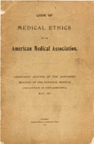

# PRINCÍPIOS DE BIOÉTICA

## Introdução à Bioética

- A **Bioética** é uma ferramenta prática para decisões clínicas complexas, indo além da teoria filosófica.

- **Moral:** Conjunto de normas e valores de um grupo (o que é "certo" ou "errado" culturalmente).

- **Ética:** Reflexão filosófica sobre a moral.

- **Bioética:** Ética aplicada à vida e à saúde, surgindo para abordar os avanços biotecnológicos que a moral tradicional não conseguia mais responder.

*Figura 1 - Manuscrito bizantino do século XII do Juramento de Hipócrates, fundamento histórico da bioética médica. Fonte: Biblioteca Vaticana, Domínio Público | Wikimedia Commons*

## Principialismo de Beauchamp e Childress

- Modelo de **Tom Beauchamp e James Childress** (1979) com quatro pilares da prática médica moderna.

### Autonomia

- **Respeito à autodeterminação** do paciente, reconhecendo seu direito a opiniões, escolhas e ações baseadas em seus valores.

- **Requisitos:** **Liberdade** (ausência de coação) e **Agência** (capacidade de agir).

- Associado ao **Termo de Consentimento Livre e Esclarecido (TCLE)**. O médico respeita, não "dá" autonomia.

- **Não é absoluta:** Limitada por risco a terceiros (ex: doenças de notificação compulsória) ou incapacidade de discernimento (ex: emergências com risco iminente de morte e paciente inconsciente).

### Beneficência

- **Dever de agir em benefício do outro**, maximizando o bem e promovendo o bem-estar do paciente.

- Historicamente paternalista, hoje deve coexistir com a autonomia.

### Não Maleficência

- Do latim *"primum non nocere"* (primeiro, não causar dano). Obrigação de **não infligir dano intencional**.

- Intervenções com riscos são justificadas pelo objetivo final e balanço risco-benefício.

- Pilar da **Prevenção Quaternária**, evitando medicalização desnecessária.

### Justiça

- Entendida como **equidade**: tratar as pessoas de forma justa e apropriada, distribuindo ônus e benefícios equitativamente.

- Na saúde pública, significa **oferecer mais para quem mais precisa** (equidade, não igualdade formal).

> 💡 **Macete:** Justiça em Bioética é **equidade**, não igualdade. Tratar desigualmente os desiguais na medida de suas desigualdades.

## Relatório Belmont e Ética em Pesquisa

- Surgiu após o escândalo de Tuskegee (1979), focado na ética em pesquisa com seres humanos.

- Estabelece três princípios:

- **Respeito pelas Pessoas** (engloba autonomia).

- **Beneficência**.

- **Justiça**.

> 💡 **Macete:** A **Não Maleficência NÃO** é um princípio explícito do Relatório Belmont, embora esteja implícita na Beneficência. Cuidado com essa pegadinha em prova!

## Método Clínico Centrado na Pessoa (MCCP)

- Aplicação prática da bioética na consulta, focando na experiência da pessoa (Ian McWhinney, Stewart).

### Disease, Illness, Sickness

- **Disease (Doença):** Processo patológico, alteração biológica ou funcional (o que o médico vê).

- **Illness (Experiência da doença):** Como o paciente sente a doença; subjetivo (medos, expectativas, impacto na vida).

- **Sickness (Disfunção social):** Papel social atribuído ao doente (afastamento, estigma).

- O MCCP foca na *Illness*.

### Componentes do MCCP

- **Explorando a saúde, a doença e a experiência da doença:** Utiliza o mnemônico **SIFE** (Sentimentos, Ideias, Função e Expectativas).

- **Entendendo a pessoa como um todo:** Contexto familiar, social e espiritual.

- **Elaborando um plano conjunto de manejo:** Negociação entre médico e paciente, fortalecendo a autonomia.

- **Intensificando a relação médico-pessoa:** Construção de confiança e compaixão.

*Figura 2 - Código de Ética Médica da AMA (1847), documento fundador da ética médica organizada. Fonte: American Medical Association, Domínio Público | Wikimedia Commons*

## Bioética no Fim da Vida

### Eutanásia, Distanásia, Ortotanásia e Mistanásia

- **Eutanásia:** Ação deliberada para abreviar a vida de paciente terminal a seu pedido ou por compaixão. **É crime no Brasil.**

- **Distanásia:** Prolongamento artificial e sofrido do processo de morte ("obstinação terapêutica"). Considerada antiética, fere a não maleficência e a dignidade humana.

- **Ortotanásia:** Morte no tempo certo. Suspensão de tratamentos fúteis que prolongam a agonia, mantendo cuidados paliativos. **Ética e legalmente permitida no Brasil (Resolução CFM 1.805/2006).**

- **Mistanásia:** "Morte social" por negligência, falta de acesso ou condições precárias de vida.

### Cuidados Paliativos

- Abordagem que melhora a qualidade de vida de pacientes e famílias que enfrentam doenças que ameaçam a continuidade da vida (OMS).

- Devem ser iniciados precocemente, junto com o tratamento modificador da doença, focando no alívio do sofrimento (físico, psíquico, social, espiritual).

### Sedação Paliativa vs. Eutanásia

- **Sedação Paliativa:** Uso de medicamentos para reduzir a consciência em sofrimento refratário. **Objetivo: alívio do sintoma**, não a morte. Ética e recomendada.

- **Eutanásia:** Objetivo primário é a morte. Ilegal no Brasil.

### Diretivas Antecipadas de Vontade (DAV)

- Regulamentadas pela **Resolução CFM 1.995/2012**. Conjunto de desejos do paciente sobre tratamentos que quer ou não receber caso fique incapacitado.

- O **Testamento Vital** é um tipo de DAV. O paciente pode nomear um Procurador de Saúde.

- **Regras para prova:**

- Médico deve registrar as DAVs no prontuário.

- DAVs prevalecem sobre qualquer parecer não médico, incluindo familiares.

- Médico pode recusar seguir DAV se for contrária ao Código de Ética Médica (ex: pedido de eutanásia).

## Prevenção Quaternária e Iatrogenia

- **Prevenção Quaternária (P4):** Identificar pacientes em risco de sobremedicalização e protegê-los de intervenções desnecessárias (Marc Jamoulle).

- **Iatrogenia:** Dano causado pela intervenção médica. P4 visa evitar a iatrogenia por excesso de exames e tratamentos.

### Níveis de Prevenção

- **Primária:** Evitar a doença (vacina).

- **Secundária:** Diagnóstico precoce (rastreamento).

- **Terciária:** Reduzir incapacidades (reabilitação).

- **Quaternária:** Evitar o excesso de intervenção e a iatrogenia.

## Sigilo Médico e Autonomia do Menor

- O sigilo é dever do médico e direito do paciente.

- **Menores de idade:** Se o menor tiver **capacidade de discernimento**, o médico deve respeitar seu sigilo, mesmo contra a vontade dos pais.

- **Exceções (sigilo DEVE ser quebrado):**

- Risco de morte ou dano grave ao paciente ou a terceiros.

- Suspeita de maus-tratos ou abuso (notificação obrigatória).

- Quando o menor não possui discernimento para compreender os riscos.

## Bioética e Espiritualidade

- Espiritualidade: busca de sentido e propósito na vida e no sofrimento, não sinônimo de religião.

- Abordar a espiritualidade integra o cuidado holístico, auxiliando na adesão e enfrentamento de doenças graves.

## Ética em Pesquisa Clínica

- Regida pela **Resolução CNS 466/2012** no Brasil.

- **TCLE (Termo de Consentimento Livre e Esclarecido):** Linguagem acessível, riscos, benefícios, sigilo, direito de desistir a qualquer momento sem prejuízo.

- **TALE (Termo de Assentimento Livre e Esclarecido):** Para menores ou legalmente incapazes, além do consentimento dos responsáveis.

- **Sistema CEP/CONEP:** Toda pesquisa deve ser aprovada por um Comitê de Ética em Pesquisa (CEP).

- **Uso de Placebo:** Permitido apenas se não houver tratamento padrão eficaz disponível. Caso contrário, o novo fármaco deve ser testado contra o tratamento padrão.

## Situações Especiais e Conflitos Éticos

### Testemunhas de Jeová e Transfusão de Sangue

- **Paciente adulto, capaz e consciente:** Se recusa por motivos religiosos e **NÃO há risco iminente de morte**, sua autonomia deve ser respeitada. Buscar alternativas terapêuticas.

- **Risco iminente de morte:** O médico **DEVE transfundir**, independentemente da vontade do paciente ou familiares. A vida é o bem maior tutelado.

- **Menores de idade:** Mesmo com recusa dos pais, se houver necessidade clínica e risco, o médico deve realizar o procedimento. A autonomia dos pais não lhes dá o direito de colocar a vida dos filhos em risco.

### Saúde Indígena

- Autonomia ganha camada extra: respeito à cultura e práticas tradicionais.

- Buscar diálogo entre medicina ocidental e saberes locais, negociando um "projeto comum de manejo".

## Comunicação de Más Notícias: Protocolo SPIKES

- Padrão-ouro para comunicação de más notícias:

- **S (Setting):** Preparar o ambiente (privacidade, sentar-se).

- **P (Perception):** Perceber o que o paciente já sabe ("O que o senhor entende sobre sua doença?").

- **I (Invitation):** Convidar a saber quanto quer saber ("Prefere detalhes ou plano geral?").

- **K (Knowledge):** Conhecimento. Dar informação em doses pequenas, sem jargões, com "tiro de alerta".

- **E (Emotions):** Emoções. Acolher a reação do paciente com empatia.

- **S (Strategy/Summary):** Estratégia e Resumo. Definir próximos passos e verificar entendimento.

- Responsabilidade do médico assistente, nunca delegar sem supervisão.

## Bioética e Judicialização da Saúde

- Paciente recorre à justiça para obter medicamentos/procedimentos não oferecidos pelo SUS/planos.

- **Conflito de Justiça:**

- **Justiça Individual:** Direito do paciente ao melhor tratamento.

- **Justiça Distributiva:** Impacto do custo individual no orçamento coletivo (Reserva do Possível vs. Mínimo Existencial).

## Resoluções CFM Essenciais

- **Resolução CFM 2.217/2018 (Código de Ética Médica):** Base da ética médica, deveres do médico, sigilo, autonomia.

- **Resolução CFM 1.805/2006 (Terminalidade):** Permite limitar/suspender tratamentos que prolonguem a vida de doente terminal, respeitando a vontade do paciente ou representante legal (Ortotanásia).

- **Resolução CFM 1.995/2012 (DAV):** Diretivas Antecipadas de Vontade prevalecem sobre pareceres não médicos e desejos familiares.

- **Resolução CFM 2.232/2019 (Recusa Terapêutica):** Direito do paciente de recusar tratamentos, mas não aceitável em risco iminente de morte.

## 📌 Pontos-Chave para Prova

- **Autonomia não é absoluta:** Limitada por risco a terceiros e risco iminente de morte em pacientes incapazes.

- **Beneficência vs. Paternalismo:** Beneficência respeita a vontade; paternalismo impõe.

- **Não Maleficência:** Base da Prevenção Quaternária (evitar iatrogenia por excesso de medicina).

- **Justiça em Bioética:** Equidade (tratar desigualmente os desiguais).

- **Relatório Belmont:** Respeito, Beneficência e Justiça. **NÃO inclui Não Maleficência.**

- **MCCP e SIFE:** Sentimentos, Ideias, Função e Expectativas para explorar a *Illness*.

- **Ortotanásia:** Permitida e ética no Brasil (Res. CFM 1.805/2006); suspender tratamentos fúteis em terminais.

- **Eutanásia:** Crime no Brasil.

- **Testemunha de Jeová (risco de morte):** Transfusão DEVE ser feita, mesmo contra a vontade.

- **Sigilo do menor:** Manter se houver discernimento, exceto risco de vida, dano grave ou abuso.

- **DAV (Diretivas Antecipadas):** Prevalecem sobre a família, registradas no prontuário.

- **Protocolo SPIKES:** Ferramenta para comunicação de más notícias.

- **Prevenção Quaternária:** Proteger o paciente de intervenções desnecessárias e medicalização.

- **Placebo em pesquisa:** Proibido se já houver tratamento padrão eficaz.

 Cópia offline para consulta pessoal.
 Fonte original:
 [https://www.medevo.com.br/material-apoio/ler/0ccf0a95-5a9a-43cb-91d2-0e8de775eee2](https://www.medevo.com.br/material-apoio/ler/0ccf0a95-5a9a-43cb-91d2-0e8de775eee2)
