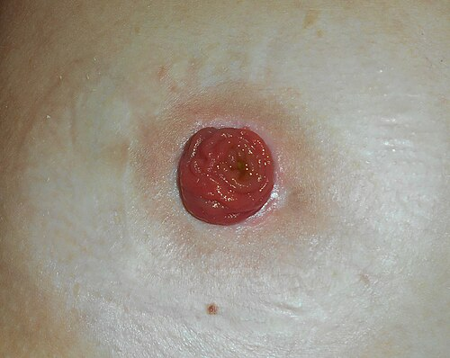

# PRINCÍPIOS E TIPOS DE OSTOMIAS

Para começar nossa conversa, você precisa tirar da cabeça a ideia de que uma ostomia é apenas "um buraquinho na pele por onde sai fezes". Se você encarar assim, vai errar questões de técnica e de complicações. Uma ostomia (ou estoma) é a exteriorização de uma víscera oca através da parede abdominal, criando um novo trajeto para a eliminação de efluentes ou para nutrição.

O grande segredo que eu sempre digo aos meus alunos no MedEvo é: o estoma deve ser tratado como um "órgão cirúrgico". Ele tem técnica de confecção, posicionamento ideal e complicações específicas. Se você entender a lógica por trás da construção, as questões de prova sobre "qual a melhor conduta" ou "o que foi feito de errado" tornam-se óbvias.

*Figura 1 - Tipos de colostomia: ascendente, transversa, descendente e sigmoidea. A localização determina a consistência das fezes e os cuidados necessários. Fonte: BruceBlaus, CC BY 3.0 | Wikimedia Commons*

## Princípios Fundamentais da Confecção de Estomas

Por que alguns estomas funcionam perfeitamente e outros retraem, necrosam ou causam hérnias gigantescas? A resposta está nos princípios técnicos.

### Localização e Marcação Pré-operatória

Este é o passo mais negligenciado na urgência e o mais cobrado em provas de residência. A marcação deve ser feita, preferencialmente, com o paciente em três posições: sentado, em pé e deitado.

O objetivo é evitar dobras cutâneas, cicatrizes prévias, a linha da cintura (onde passa o cinto da calça) e a proeminência óssea da crista ilíaca. Se você coloca um estoma em uma dobra de gordura, a placa da bolsa não vai aderir, o conteúdo vai vazar e o paciente terá uma dermatite severa.

### O Papel do Músculo Reto Abdominal

Aqui está uma regra de ouro: o estoma **deve** passar através do corpo do músculo reto abdominal.

Por que fazemos isso e não passamos lateralmente a ele? O músculo atua como um "esfíncter passivo" e, mais importante, oferece um suporte estrutural que reduz drasticamente a incidência de hérnias paraestomais. Se você passa o intestino pela linha semilunar ou lateralmente ao reto, a parede é mais fraca e a hérnia é quase certa.

### Abertura da Fáscia e Diâmetro

A abertura na aponeurose deve ser "justa". As bancas costumam descrever que a abertura deve permitir a passagem do intestino sem isquemia, mas sem folgas excessivas. Um parâmetro prático citado em questões é que a abertura deve acomodar a passagem de dois dedos do cirurgião (ou cerca de 2 a 3 cm), dependendo do calibre da alça. Se passar um dedo com muita folga, o risco de hérnia aumenta; se ficar apertado demais, o estoma sofre isquemia.

### Suprimento Sanguíneo e Mobilização

Para que um estoma sobreviva, ele precisa de sangue. Um erro clássico é "desnudar" a serosa do intestino por mais de 5 cm para facilitar a passagem. Isso acaba com os vasos retos e leva à necrose.

Além disso, a alça deve chegar à pele **sem tensão**. Se você precisa puxar o intestino para ele alcançar a parede, ele vai retrair no pós-operatório. A mobilização adequada do cólon (soltando a goteira parietocólica, por exemplo) é fundamental.

*Figura 2 - Ileostomia funcional com bolsa coletora, demonstrando o estoma e o dispositivo de coleta. Fonte: Salicyna, CC BY-SA 4.0 | Wikimedia Commons*

## Tipos de Ostomias Intestinais

Dividimos as ostomias principalmente pelo segmento exteriorizado e pela configuração da alça.

### Ileostomia

A ileostomia é a exteriorização do íleo terminal, geralmente no quadrante inferior direito.

**Características Fisiológicas:** O efluente é líquido, rico em enzimas pancreáticas e altamente alcalino. Isso é um veneno para a pele. Por isso, a ileostomia **precisa ser protuberante** (técnica de Brooke).

**Técnica de Brooke:** Consiste na eversão da alça intestinal sobre si mesma, criando um "mamilo" de 2 a 3 cm acima do nível da pele. Isso garante que o conteúdo líquido caia direto dentro da bolsa, sem encostar na pele periestomal. Se a ileostomia for plana ou rasa, o paciente terá dermatite química em menos de 24 horas.

### Colostomia

A colostomia é a exteriorização de qualquer parte do cólon.

**Características Fisiológicas:** O efluente é mais pastoso ou formado, com menos enzimas agressivas. Por isso, a colostomia não precisa ser tão protuberante quanto a ileostomia. Uma projeção de 0,5 a 1,0 cm acima da pele já é suficiente para um bom acoplamento da bolsa.

### Tabela 1: Comparação Ileostomia vs. Colostomia

| Característica | Ileostomia | Colostomia |
| --- | --- | --- |
| **Localização Comum** | Quadrante Inferior Direito (QID) | Quadrante Inferior Esquerdo (QIE) |
| **Conteúdo** | Líquido, contínuo, alcalino | Pastoso/Formado, intermitente |
| **Projeção (Altura)** | 2,0 a 3,0 cm (Protuberante) | 0,5 a 1,0 cm (Discreta) |
| **Risco de Dermatite** | Muito Alto (Química) | Moderado (Mecânica/Umidade) |
| **Indicação Comum** | Proteção de anastomose, Proctocolectomia | Obstrução distal, Hartmann, Trauma |

## Configurações de Construção

Aqui é onde as bancas de residência fazem a festa. Você precisa saber a diferença visual e funcional de cada uma.

### 1. Ostomia Terminal (ou em extremidade)

É quando o intestino é seccionado e apenas a extremidade proximal é trazida para a pele. O exemplo clássico é a **Cirurgia de Hartmann**.

- **Cenário Clínico:** Imagine um paciente de 70 anos com diverticulite aguda perfurada (Hinchey III ou IV). O cirurgião resseca o sigmoide inflamado, fecha o coto retal (que fica dentro da pelve) e exterioriza o cólon descendente como uma colostomia terminal no QIE.

- **Vantagem:** Evita uma anastomose em ambiente de sepse, que teria alto risco de deiscência.

### 2. Ostomia em Alça (Loop)

Neste caso, uma alça íntegra de intestino é trazida para a pele. É feita uma abertura na borda antimesentérica, mas a parede posterior da alça permanece intacta.

- **O uso do Bastão:** Frequentemente usamos um bastão de plástico ou vidro sob a alça por 5 a 7 dias para evitar que ela "escorregue" de volta para dentro do abdome antes de cicatrizar na pele.

- **Indicação de Ouro:** Proteção de anastomoses distais. Se você faz uma anastomose muito baixa no reto (Cirurgia de Dixon), o risco de deiscência é alto. Para "dar um descanso" àquela costura, você faz uma **ileostomia em alça de proteção**. O trânsito passa pelo estoma e não chega na anastomose.

- **Vantagem:** A reversão é muito mais simples, muitas vezes nem precisando de laparotomia formal, apenas uma incisão periestomal.

### 3. Ostomia em "Boca de Forno" ou Cano de Espingarda (Devine)

São dois estomas separados ou adjacentes: um proximal (funcional) e um distal (fístula mucosa). É pouco usada hoje, mas pode aparecer em casos de trauma ou grandes ressecções onde o coto distal não alcança a pele para ser uma fístula mucosa única.

## Procedimentos Específicos e Epônimos

Como professor, eu sei que nomes próprios assustam, mas vamos simplificar os que realmente caem.

### Cirurgia de Hartmann

É a "queridinha" das provas de cirurgia de emergência.

- **O que é:** Ressecção do cólon (geralmente sigmoide) + Colostomia terminal proximal + Fechamento do coto distal (reto).

- **Quando cai:** Diverticulite Hinchey III/IV ou Câncer de reto/sigmoide obstruído/perfurado em paciente instável.

### Ressecção Abdominoperineal (Cirurgia de Miles)

- **O que é:** Retirada completa do reto e do ânus.

- **Resultado:** O paciente fica com uma **colostomia terminal definitiva** no QIE, pois não há mais esfíncter anal.

### Jejunostomia de Wietzel

Aqui saímos da eliminação e entramos na nutrição.

- **Técnica:** É uma jejunostomia valvulada. O cirurgião insere uma sonda no jejuno e cria um túnel seromuscular (tunelização) com pontos de sutura ao redor da sonda antes de fixá-la na parede abdominal.

- **Por que o túnel?** Para evitar o refluxo de conteúdo entérico e prevenir peritonite química se a sonda sair acidentalmente. É a escolha para nutrição enteral prolongada quando o estômago não pode ser usado.

### Bolsa Ileal de Kock

É uma ileostomia continente. O cirurgião cria um reservatório com o próprio íleo e uma "válvula" interna. O paciente não usa bolsa; ele esvazia o reservatório introduzindo uma sonda várias vezes ao dia. Cai pouco, mas quando cai, é para diferenciar da ileostomia convencional de Brooke.

## Complicações: Onde o Aluno se Perde

As complicações são divididas em precoces (até 30 dias) e tardias.

### Complicações Precoces

- **Isquemia e Necrose:** É a complicação precoce mais grave. O estoma deve ser vermelho-brilhante. Se ficar escuro/preto, há isquemia.

- *Dica do Dr. Will:* Se a necrose for apenas acima da aponeurose, podemos observar. Se for abaixo da aponeurose, é reoperação imediata.

- **Retração:** O estoma "afunda" para dentro do abdome. Geralmente por tensão excessiva na alça ou isquemia. Causa vazamentos e dermatite imediata.

- **Dermatite Periestomal:** A causa número 1 de sofrimento do paciente. Na ileostomia, é química (enzimas). Na colostomia, pode ser por umidade ou alergia ao material da bolsa.

### Complicações Tardias

- **Hérnia Paraestomal:** É a complicação tardia mais comum. Ocorre uma falha na aponeurose ao lado do estoma.

- *Prevenção:* Passar pelo músculo reto abdominal e não fazer uma abertura excessiva na fáscia.

- **Prolapso:** O intestino "sai para fora" pelo estoma, como uma luneta. É mais comum em colostomias em alça transversas.

- **Estenose:** O orifício da pele ou da fáscia cicatriza de forma contrátil, dificultando a saída das fezes.

### Tabela 2: Complicações de Estomas e Condutas

| Complicação | Tempo | Causa Principal | Conduta Inicial |
| --- | --- | --- | --- |
| **Necrose** | Precoce | Isquemia (lesão de vasos retos) | Avaliar profundidade; Reoperar se subaponeurótica |
| **Retração** | Precoce | Tensão na alça | Uso de bolsas convexas ou reoperação |
| **Dermatite** | Qualquer | Vazamento de efluente | Ajuste da placa, pó de barreira, proteção cutânea |
| **Hérnia Paraestomal** | Tardio | Fraqueza da parede / Abertura larga | Conservador (cinta) ou Cirurgia (tela) |
| **Prolapso** | Tardio | Fixação inadequada / Alça redundante | Redução manual; Cirurgia se isquemia |

## Situações Clínicas e Tomada de Decisão

Vamos aplicar o que aprendemos. Imagine um cenário de prova:

**Caso 1:** Paciente de 45 anos, com Doença de Crohn, submetido a proctocolectomia total. Qual o estoma esperado?

- **Resposta:** Ileostomia terminal definitiva (Brooke). Como o reto e o ânus foram retirados, o íleo terminal é trazido para o QID.

**Caso 2:** Paciente com câncer de reto médio (7 cm da margem anal) submetido a Ressecção Anterior do Reto (Dixon) com anastomose grampeada. O cirurgião decide proteger a anastomose. Qual a melhor opção?

- **Resposta:** Ileostomia em alça. Por que não colostomia em alça? Porque a ileostomia em alça é mais fácil de construir, tem menor morbidade na reversão e o fechamento é mais simples. Lembre-se da pérola clínica: anastomose de cólon esquerdo/reto → ileostomia em alça para proteção.

**Caso 3:** Obstrução intestinal baixa por tumor de sigmoide irressecável em paciente paliativo.

- **Resposta:** Colostomia em alça (geralmente no transverso ou sigmoide proximal). O objetivo é apenas descompressão. O uso do bastão é comum aqui para garantir a sustentação da alça.

## Cuidados e Manejo: O que o Médico deve saber

Muitas vezes, a questão de prova foca no cuidado pós-operatório.

- **Maturação:** A maturação é o ato de suturar a borda do intestino na pele. Antigamente esperava-se a maturação espontânea, mas hoje fazemos a **maturação imediata** (técnica de Brooke) para evitar estenose e serosite da alça exposta.

- **Adaptação da Bolsa:** A placa deve ser cortada exatamente no diâmetro do estoma (deixando apenas 1-2 mm de folga). Se o buraco for muito grande, a pele fica exposta às fezes.

- **Dieta:** Pacientes com ileostomia perdem muito líquido e eletrólitos (sódio e potássio). Devem ser orientados a aumentar a ingesta hídrica e de sal. No MedEvo, sempre reforçamos: ileostomia de alto débito (> 1500ml/dia) pode levar a insuficiência renal pré-renal aguda.

### Tabela 3: Tipos de Anastomoses Intestinais

| Tipo | Técnica | Vantagem |
| --- | --- | --- |
| **Término-terminal** | Boca com boca | Mais fisiológica |
| **Término-lateral** | Topo de uma alça no lado da outra | Útil quando há diferença de calibre |
| **Látero-lateral** | Lado com lado | **Maior boca anastomótica**, menor risco de estenose (comum em grampeadores) |

## O "Porquê" das Condutas (Raciocínio Clínico)

Por que a diretriz da Sociedade Brasileira de Coloproctologia enfatiza tanto a marcação pré-operatória? Porque um estoma mal posicionado é a principal causa de isolamento social do paciente. Se a bolsa vaza, o paciente não sai de casa, não trabalha e entra em depressão.

Por que preferimos a ileostomia em alça para proteção de anastomose em vez da colostomia? Embora a ileostomia tenha um efluente mais agressivo, a colostomia em alça no transverso (muito usada antigamente) é volumosa, difícil de cuidar e tem uma taxa de complicações na reversão (como fístulas e infecção de sítio cirúrgico) significativamente maior.

Cuidado com a pegadinha: a alternativa vai dizer que "toda diverticulite perfurada exige Hartmann". Isso não é mais verdade absoluta. Em pacientes selecionados e estáveis, alguns cirurgiões realizam a ressecção com anastomose primária e ileostomia de proteção. Mas, para a prova de residência, se o paciente estiver instável ou com peritonite fecal franca (Hinchey IV), **Hartmann é a resposta correta**.

## Pontos-Chave para Prova 🎯

- **Localização:** Sempre através do músculo reto abdominal para reduzir risco de hérnia paraestomal.

- **Ileostomia de Brooke:** Deve ser protuberante (2-3 cm) para evitar que o conteúdo líquido e alcalino toque a pele.

- **Colostomia:** Pode ser plana ou levemente elevada (0,5-1 cm), pois as fezes são sólidas/pastosas.

- **Cirurgia de Hartmann:** Ressecção + Colostomia terminal proximal + Coto distal fechado. Clássico para diverticulite Hinchey III/IV.

- **Cirurgia de Miles (RAP):** Resulta em colostomia terminal definitiva (ânus é retirado).

- **Proteção de Anastomose:** A preferência atual é pela ileostomia em alça (menor morbidade na reversão).

- **Jejunostomia de Wietzel:** Técnica valvulada (tunelização seromuscular) para evitar refluxo.

- **Complicação Precoce mais Grave:** Necrose (se for abaixo da aponeurose, exige reoperação).

- **Complicação Tardia mais Comum:** Hérnia paraestomal.

- **Dermatite na Ileostomia:** É química e agressiva; prevenção é a técnica de Brooke correta.

- **Abertura da Fáscia:** Deve ser justa (aprox. 2 dedos), nem apertada (isquemia) nem larga (hérnia).

- **Marcação Pré-operatória:** Deve ser feita com o paciente em várias posições (sentado, em pé, deitado).

- **Contraindicação Absoluta de Anastomose Primária:** Instabilidade hemodinâmica grave com peritonite fecal generalizada.

- **Ileostomia de Alto Débito:** Definição > 1.500 ml/24h; risco de desidratação e distúrbio hidroeletrolítico.

- **O que NÃO fazer:** Jamais desnudar mais de 5 cm de serosa do intestino (risco de isquemia por lesão de vasos retos).

- **O que NÃO fazer:** Não colocar o estoma sobre cicatrizes, dobras cutâneas ou proeminências ósseas.

 Cópia offline para consulta pessoal.
 Fonte original:
 [https://www.medevo.com.br/material-apoio/ler/96f4a2d7-d773-4cd7-9f7d-c8b50a68e652](https://www.medevo.com.br/material-apoio/ler/96f4a2d7-d773-4cd7-9f7d-c8b50a68e652)
