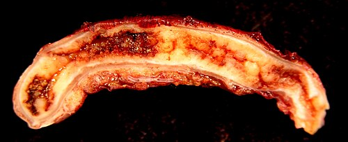
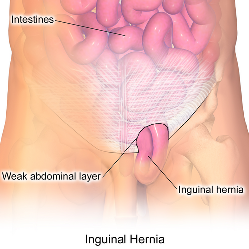

# PROCEDIMENTOS CIRÚRGICOS PEDIÁTRICOS

Para entender a cirurgia pediátrica, você precisa primeiro desaprender a cirurgia do adulto. No adulto, muitas vezes operamos "defeitos de parede" por fraqueza tecidual ou desgaste. Na pediatria, quase tudo o que operamos é fruto de uma falha no desenvolvimento embriológico. Se você entender o que deveria ter fechado ou migrado e não o fez, você domina a matéria.

Aqui no MedEvo, sempre reforçamos: a anatomia da criança é dinâmica. O que é patológico hoje pode ser fisiológico daqui a seis meses. Por isso, o tempo da cirurgia é o conceito mais cobrado nas provas de residência.

## Hérnias da Região Inguinal e Patologias do Conduto Peritônio-Vaginal

Este é, sem dúvida, o tema que você mais encontrará no seu dia a dia e nas provas. Tudo gira em torno de uma estrutura: o conduto peritônio-vaginal.

*Figura 1 - Peça cirúrgica de apendicite aguda em criança de 10 anos, mostrando órgão aumentado com mucosa inflamada. A apendicite é a principal emergência cirúrgica pediátrica. Fonte: Ed Uthman, CC BY 2.0 | Wikimedia Commons*

## Fisiopatologia: O Porquê da Hérnia Inguinal Pediátrica

Diferente do adulto, onde a hérnia inguinal costuma ser direta (por fraqueza da parede posterior), na criança a hérnia é virtualmente sempre **indireta**.

Durante a vida fetal, o testículo desce do abdome para o escroto levando consigo um divertículo do peritônio, o conduto peritônio-vaginal. O normal é que esse conduto se oblitere após a descida testicular. Quando ele permanece aberto, temos o caminho livre para a passagem de conteúdo abdominal.

- Se o conduto é largo: passa alça intestinal ou ovário (Hérnia Inguinal).

- Se o conduto é estreito: passa apenas líquido peritoneal (Hidrocele Comunicante).

- Se o conduto fecha em cima e embaixo, mas deixa líquido preso no meio: Cisto de Cordão.

*Figura 2 - Hérnia inguinal, uma das condições cirúrgicas mais comuns em pediatria, especialmente em prematuros. Fonte: BruceBlaus, CC BY 3.0 | Wikimedia Commons*

## Diagnóstico e Conduta na Hérnia Inguinal

O diagnóstico é **clínico**. O pai ou a mãe relatam um abaulamento na região inguinal que aparece quando a criança chora ou faz esforço. No exame físico, você pode sentir o "sinal do luva de seda" (o deslizamento das paredes do saco herniário vazio ao palpar o cordão espermático).

**Atenção para a regra de ouro:** Hérnia inguinal em criança não se observa, **se opera ao diagnóstico**.

Por que não esperamos como na hérnia umbilical? Porque o risco de encarceramento é altíssimo, especialmente em lactentes jovens (menores de 6 meses). Se você encontrar uma hérnia redutível hoje, deve agendar a cirurgia para o mais breve possível. Se for uma menina com ovário na hérnia, o cuidado é redobrado, pois o ovário pode sofrer torção dentro do saco herniário.

A técnica cirúrgica padrão é a **ligadura alta do saco herniário**. Não precisamos de telas como no adulto, pois a parede inguinal da criança é forte; o problema é apenas o conduto que não fechou.

### Hidrocele: Quando Operar?

Diferente da hérnia, a hidrocele não tem risco de encarceramento de alça. Por isso, a conduta inicial na maioria das hidroceles não comunicantes (aquelas que não mudam de tamanho durante o dia) é a **observação até 12 a 24 meses de vida**. A maioria irá reabsorver espontaneamente.

Se após os 2 anos a hidrocele persistir ou se ela for claramente comunicante (aquela que acorda pequena e aumenta ao longo do dia conforme a criança se movimenta), a cirurgia está indicada pelo mesmo princípio da hérnia: o conduto peritônio-vaginal não fechou.

## Hérnia Umbilical: A Arte da Paciência

Se na inguinal operamos logo, na umbilical o segredo é esperar. A hérnia umbilical é causada por uma falha no fechamento do anel umbilical. É extremamente comum em prematuros e crianças negras.

### Critérios de Observação e Cirurgia

A imensa maioria das hérnias umbilicais fecha sozinha até os 4 ou 5 anos de idade. Por isso, a conduta inicial é **expectante**.

Muitos alunos erram em prova achando que qualquer hérnia umbilical dói. Na verdade, elas raramente doem ou encarceram. Se a banca colocar "mãe preocupada com estética", você mantém a conduta conservadora.

**Quando indicar a cirurgia (Herniorrafia Umbilical)?**

- Persistência após os 4 ou 5 anos de idade.

- Hérnias com anel herniário muito grande (geralmente > 2 cm) que dificilmente fecharão sozinhas.

- Presença de derivação ventrículo-peritoneal (DVP), pelo risco de o líquido cefalorraquidiano forçar a hérnia.

- Encarceramento ou dor (raros, mas são indicações absolutas).

**Tabela 1: Comparativo Hérnia Inguinal vs. Umbilical**

| Característica | Hérnia Inguinal | Hérnia Umbilical |
| --- | --- | --- |
| **Causa** | Persistência do conduto peritônio-vaginal | Falha no fechamento do anel umbilical |
| **Risco de Encarceramento** | Alto (especialmente em lactentes) | Muito baixo |
| **Conduta Inicial** | Cirurgia ao diagnóstico | Observação até 4-5 anos |
| **Diagnóstico** | Clínico | Clínico |
| **Técnica** | Ligadura alta do saco | Fechamento do anel (técnica de Mayo) |

## Defeitos da Parede Abdominal Neonatal: Gastrosquise e Onfalocele

Aqui o Dr. Will sempre lembra: o diagnóstico diferencial entre essas duas é clássico de prova e você não pode errar.

### Gastrosquise

É um defeito pequeno (geralmente < 4 cm), quase sempre à **direita** da inserção do cordão umbilical. Não existe saco recobrindo as alças. As alças intestinais ficam expostas ao líquido amniótico, o que causa uma "peritonite química", deixando o intestino edemaciado, curto e com fibrina (aspecto de "casca de laranja").

- **Associações:** Geralmente é um defeito isolado, mas tem alta associação com atresias intestinais e má rotação.

- **Prognóstico:** Depende da saúde do intestino exposto. O fechamento pode ser primário ou em estágios (usando um silo).

### Onfalocele

O defeito ocorre **no centro** da parede abdominal, através do anel umbilical. O conteúdo (que pode incluir fígado) é **recoberto por um saco** composto por peritônio e membrana amniótica. O cordão umbilical insere-se diretamente no ápice do saco.

- **Associações:** Cuidado aqui! A onfalocele está frequentemente associada a malformações graves (cardíacas, geniturinárias) e síndromes genéticas (como a Síndrome de Beckwith-Wiedemann e Trissomia do 13 ou 18).

- **Conduta:** Se o saco estiver íntegro, não é uma emergência cirúrgica imediata. Podemos tratar de forma conservadora (epitelização do saco) se a criança tiver malformações cardíacas graves que impeçam a anestesia.

**Tabela 2: Diferenciação Gastrosquise vs. Onfalocele**

| Característica | Gastrosquise | Onfalocele |
| --- | --- | --- |
| **Localização** | À direita do cordão | No centro (pelo cordão) |
| **Presença de Saco** | Não (alças expostas) | Sim (peritônio e amnio) |
| **Conteúdo** | Apenas alças intestinais | Alças e frequentemente fígado |
| **Malformações Associadas** | Raras (exceto atresias) | Frequentes e graves |
| **Estado do Intestino** | Edemaciado/Fibrina | Aspecto normal |

## Escroto Agudo: A Urgência Urológica

Quando um menino chega com dor testicular súbita, o relógio começa a correr. Você tem cerca de 6 horas para salvar esse testículo.

### Torção Testicular

É a torção do cordão espermático sobre seu próprio eixo, interrompendo o fluxo sanguíneo. É mais comum em adolescentes, mas pode ocorrer em qualquer idade.

- **Quadro Clínico:** Dor súbita, intensa, que pode irradiar para o abdome. O testículo fica elevado e horizontalizado (Sinal de Angel).

- **O sinal de ouro:** **Ausência do reflexo cremastérico**. Se você estimular a face interna da coxa e o testículo não subir, a suspeita de torção é altíssima.

- **Sinal de Prehn:** A elevação do testículo não alivia a dor (ao contrário da orquiepididimite, onde pode aliviar).

- **Conduta:** Exploração cirúrgica imediata. Não perca tempo pedindo Doppler se a clínica for soberana. Na cirurgia, fazemos a distorção e a orquidopexia bilateral (fixamos o outro lado também, pois o defeito anatômico que permite a torção costuma ser bilateral).

*Figura 2 - Hérnia inguinal, uma das condições cirúrgicas mais comuns em pediatria, especialmente em prematuros. Fonte: BruceBlaus, CC BY 3.0 | Wikimedia Commons*

## Diagnóstico Diferencial do Escroto Agudo

- **Torção de Apêndice Testicular (Hidátide de Morgagni):** É a causa mais comum de dor escrotal. A dor é mais localizada no polo superior e, às vezes, você vê um ponto azulado através da pele (Sinal do Blue Dot). O tratamento é repouso e analgésico.

- **Orquiepididimite:** Rara em crianças pré-púberes sem malformações urinárias. Há sinais inflamatórios, febre e o reflexo cremastérico costuma estar presente.

## Criptorquidia e Testículo Não Descido

O testículo deve estar no escroto. Se não estiver, precisamos saber onde ele parou.

- **Testículo Retrátil:** É aquele que o reflexo cremastérico puxa para cima, mas você consegue trazê-lo manualmente para o fundo do escroto e ele **fica lá** sem tensão. Conduta: Acompanhamento clínico anual. Não precisa operar.

- **Criptorquidia (Testículo não descido):** O testículo parou em algum ponto do trajeto normal (canal inguinal ou abdome).

- **Ectopia Testicular:** O testículo saiu do trajeto normal (ex: está na região femoral ou perineal).

**Por que operar a criptorquidia?**
O testículo fora do escroto está em uma temperatura mais alta, o que leva à degeneração das células germinativas. Isso aumenta o risco de **infertilidade** e de **malignidade** (seminoma é o mais comum). Importante: a cirurgia (orquidopexia) facilita a palpação e o diagnóstico precoce do câncer, mas não elimina totalmente o risco aumentado inerente ao testículo que foi criptorquídico.

**Quando operar?**
Segundo a Sociedade Brasileira de Pediatria, a orquidopexia deve ser realizada preferencialmente entre **6 e 18 meses de vida**. Esperamos até os 6 meses porque o testículo ainda pode descer espontaneamente nesse período (especialmente em prematuros). Após os 6 meses, a descida espontânea é improvável.

## Patologias da Região Cervical: O Cisto do Ducto Tireoglosso

O cisto do ducto tireoglosso é a malformação cervical congênita mais comum. Ele se forma a partir de remanescentes do trajeto que a glândula tireoide faz da base da língua até o pescoço.

- **Clínica:** Massa indolor, na linha média, geralmente abaixo do osso hioide.

- **A "sacada" do exame físico:** O cisto se move para cima durante a **protrusão da língua** ou durante a deglutição, devido à sua conexão anatômica com a base da língua.

- **Tratamento:** Cirurgia de Sistrunk. Não basta tirar o cisto; é preciso retirar a parte central do osso hioide e o trajeto ductal até a base da língua para evitar a recidiva (que é alta se a técnica for incompleta).

## Estenose Hipertrófica de Piloro (EHP)

Imagine um lactente de 3 a 6 semanas de vida que começa com vômitos. Não é qualquer vômito; são **vômitos em jato**, não biliosos (já que a obstrução é antes da ampola de Vater), que ocorrem logo após as mamadas. A criança está sempre com fome ("fome voraz").

- **Fisiopatologia:** Hipertrofia da musculatura circular do piloro, impedindo o esvaziamento gástrico.

- **Distúrbio Metabólico:** O vômito persistente de conteúdo gástrico (ácido clorídrico) leva a uma **alcalose metabólica hipoclorêmica e hipocalêmica**. Isso cai muito em prova!

- **Exame Físico:** Em mãos experientes, é possível palpar a "oliva pilórica" no hipocôndrio direito.

- **Diagnóstico:** Ultrassonografia abdominal (mostra o aumento da espessura e do comprimento do canal pilórico).

- **Tratamento:** Primeiro, corrija o distúrbio hidroeletrolítico. A cirurgia (Piloromiotomia de Fredet-Ramstedt) não é uma emergência de meia-noite; a estabilização clínica vem antes.

## Doença de Hirschsprung (Megacólon Aganglionico)

Aqui o problema é a falta de "fiação elétrica" no intestino. Há uma ausência congênita de células ganglionares (plexos de Meissner e Auerbach) no reto e sigmoide (na maioria dos casos).

- **Clínica no RN:** Atraso na eliminação de mecônio (> 48 horas), distensão abdominal e vômitos biliosos.

- **Clínica no Lactente/Criança:** Constipação crônica grave, fezes em "fita" ou "pelotas". Ao toque retal, o reto está vazio, mas há uma saída explosiva de fezes e gases após a retirada do dedo (Sinal da Explosão).

- **Diagnóstico:** O padrão-ouro é a **biópsia retal por sucção** (mostra ausência de células ganglionares e aumento de fibras nervosas acetilcolinesterase positivas). O enema opaco mostra a "zona de transição" (o reto distal é estreito e o cólon proximal é dilatado).

- **Tratamento:** Ressecção do segmento aganglionico e abaixamento do cólon normal até o ânus.

## Apendicite Aguda na Criança

A apendicite é a causa mais comum de abdome agudo cirúrgico na infância. No entanto, quanto menor a criança, mais difícil é o diagnóstico.

Em crianças menores de 4 anos, o omento (o "policial do abdome") ainda é curto e não consegue bloquear o apêndice inflamado. Resultado: a perfuração ocorre mais rápido e evolui para peritonite generalizada com facilidade.

- **Quadro Clínico:** Dor periumbilical que migra para a fossa ilíaca direita, anorexia, náuseas e febre. Na criança pequena, a irritabilidade e a recusa alimentar podem ser os únicos sinais.

- **Diagnóstico:** É eminentemente clínico. Em caso de dúvida, a ultrassonografia é o primeiro exame de imagem. Se a USG for inconclusiva e a suspeita persistir, a Tomografia ou a observação clínica com reavaliação em 6-12 horas são condutas adequadas.

- **Dica de Prova:** Se a criança tem dor abdominal e diarreia, não descarte apendicite. O apêndice em posição pélvica pode irritar o reto e causar diarreia.

## Fimose e Parafimose

Muitos pais chegam ao consultório desesperados porque não conseguem retrair o prepúcio do bebê.

- **Fimose Fisiológica:** Presente na maioria dos recém-nascidos. O prepúcio é aderido à glande. A conduta é **expectante** e orientações de higiene sem exercícios forçados (que podem causar cicatrizes e fimose patológica).

- **Fimose Patológica:** Presença de um anel fibrótico/cicatricial que impede a retração. Geralmente após episódios de balanopostite (infecção da glande e prepúcio).

- **Indicações de Postectomia (Circuncisão):**

- Balanopostites de repetição.

- Infecções urinárias de repetição (em meninos com malformações urinárias).

- Fimose patológica persistente após os 3-5 anos.

- Parafimose.

**Parafimose:** É uma emergência. Ocorre quando o prepúcio estreito é retraído e não consegue voltar à posição original, garroteando a glande. Causa edema maciço e risco de necrose. O tratamento inicial é a redução manual; se falhar, incisão dorsal ou postectomia de urgência.

## Hérnia Diafragmática Congênita (HDC)

A HDC (mais comum à esquerda, chamada de Bochdalek) é uma falha no fechamento do diafragma que permite a subida de vísceras abdominais para o tórax.

- **O problema real:** Não é a hérnia em si, mas a **hipoplasia pulmonar** e a **hipertensão pulmonar** resultantes da compressão do pulmão durante a vida fetal.

- **Quadro Clínico:** Recém-nascido com desconforto respiratório imediato, abdome escavado e ruídos hidroaéreos audíveis no tórax. O murmúrio vesicular está diminuído do lado afetado e o ictus cardíaco pode estar desviado.

- **Conduta:** **NUNCA ventile com máscara e ambu** (isso joga ar no estômago e alças que estão no tórax, comprimindo ainda mais o pulmão). A conduta é intubação orotraqueal imediata e passagem de sonda nasogástrica. A cirurgia não é emergência; primeiro estabilizamos a parte ventilatória e hemodinâmica.

**Tabela 3: Diagnóstico Diferencial de Massas Escrotais**

| Patologia | Dor | Transiluminação | Reflexo Cremastérico | Conduta |
| --- | --- | --- | --- | --- |
| **Torção Testicular** | Súbita/Intensa | Negativa | Ausente | Cirurgia Imediata |
| **Torção de Apêndice** | Localizada (superior) | Negativa (Blue dot) | Presente | Analgesia |
| **Hidrocele** | Indolor | Positiva | Presente | Observar até 2 anos |
| **Hérnia Inguinal** | Desconforto/Intermitente | Negativa | Presente | Cirurgia Eletiva |

## Pontos-Chave para Prova 💡

- **Hérnia Inguinal:** Sempre cirúrgica ao diagnóstico. O risco de encarceramento é maior nos primeiros meses de vida.

- **Hérnia Umbilical:** Conduta conservadora até 4-5 anos. Operar antes apenas se > 2 cm, DVP associada ou complicações.

- **Criptorquidia:** Orquidopexia entre 6 e 18 meses. Reduz risco de infertilidade e facilita detecção de câncer.

- **Testículo Retrátil:** Não é cirúrgico. Acompanhamento clínico.

- **Torção Testicular:** Ausência de reflexo cremastérico é o sinal mais sensível. Janela de 6 horas para salvar o órgão.

- **Estenose de Piloro:** Vômitos não biliosos + Alcalose metabólica hipoclorêmica e hipocalêmica.

- **Doença de Hirschsprung:** Suspeitar em RN que não elimina mecônio em 48h. Biópsia retal é o padrão.

- **Cisto do Ducto Tireoglosso:** Massa na linha média que se eleva à protrusão da língua. Cirurgia de Sistrunk.

- **Gastrosquise:** Defeito à direita do cordão, sem saco protetor. Alta associação com atresia intestinal.

- **Onfalocele:** Defeito central, com saco protetor. Alta associação com malformações cardíacas e síndromes.

- **Hérnia Diafragmática:** Emergência médica (ventilatória), não cirúrgica imediata. Intubação imediata, evitar ambu.

- **Fimose:** Fisiológica na maioria dos bebês. Postectomia indicada em balanopostites de repetição ou após 3-5 anos se persistir anel fibrótico.

- **Cisto Pilonidal Infectado:** Adolescente com dor sacrococcígea e flutuação. Tratamento inicial é drenagem e antibiótico se houver celulite.

- **Material de Sutura:** Em mucosas (como laceração labial), use fios absorvíveis (Vicryl ou Monocryl 4-0 ou 5-0).

- **Cranioestenose:** Fusão prematura de suturas. A mais comum é a sagital (escafocefalia). O tratamento é cirúrgico para permitir crescimento cerebral.

 Cópia offline para consulta pessoal.
 Fonte original:
 [https://www.medevo.com.br/material-apoio/ler/4cf87337-34db-4a69-9086-2bd0c080fb47](https://www.medevo.com.br/material-apoio/ler/4cf87337-34db-4a69-9086-2bd0c080fb47)
