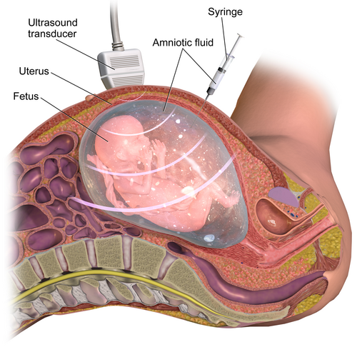
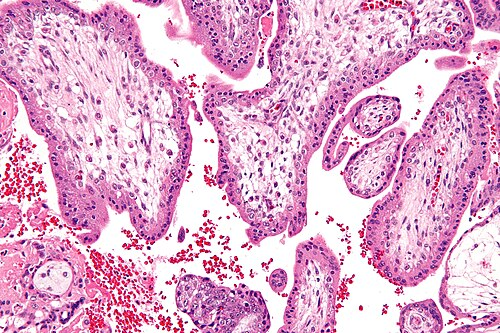

# PROCEDIMENTOS INVASIVOS EM MEDICINA FETAL

Para entender a Medicina Fetal moderna, você precisa primeiro mudar sua mentalidade sobre o que é "diagnóstico" e o que é "rastreamento". Muitos alunos chegam na prova de residência confundindo esses conceitos básicos. Em Medicina Fetal, os procedimentos invasivos são, em sua grande maioria, a ferramenta definitiva para transformar uma suspeita (vinda do ultrassom ou do NIPT) em uma certeza diagnóstica.

Historicamente, éramos muito mais agressivos. Hoje, com o advento do DNA fetal livre no sangue materno (NIPT), o número de procedimentos invasivos caiu, mas a importância de saber executá-los e, principalmente, saber indicá-los, aumentou. A banca examinadora não quer apenas que você saiba a técnica, ela quer saber se você sabe o momento exato de indicar cada um e quais os riscos que você está assumindo ao introduzir uma agulha no útero de uma gestante.

*Figura 1 - Amniocentese: punção transabdominal guiada por ultrassom para coleta de líquido amniótico, utilizada para diagnóstico genético e avaliação de maturidade fetal. Fonte: BruceBlaus, CC BY-SA 4.0 | Wikimedia Commons*

## Biópsia de Vilosidades Coriônicas (BVC)

A Biópsia de Vilosidades Coriônicas, também chamada de Coleta de Amostra de Vilosidades Coriônicas (CAVC), é o nosso procedimento de escolha para o primeiro trimestre. Se a questão de prova te der uma gestante com 11 ou 12 semanas e uma indicação de cariótipo (como uma translucência nucal aumentada), não pense em amniocentese. A resposta é BVC.

### Por que entre 10 e 13 semanas?

Este é o "pulo do gato". Por que não fazemos antes das 10 semanas? Porque estudos clássicos mostraram que procedimentos realizados muito precocemente (8 ou 9 semanas) estão associados a defeitos de redução de membros e micrognatia no feto. O desenvolvimento vascular da placenta ainda é muito rudimentar e qualquer trauma pode gerar fenômenos embólicos para o feto.

E por que não fazemos depois das 13 semanas e 6 dias? Tecnicamente, até poderíamos, mas a partir daí a placenta começa a se tornar mais densa e a amniocentese se torna tecnicamente mais fácil e com menor risco de perda gestacional. Portanto, memorize a janela: 10 a 13 semanas e 6 dias.

### Técnica e Tecidos

A BVC pode ser feita por via transabdominal (mais comum no Brasil) ou transcervical. A escolha depende da localização da placenta. Se a placenta é posterior, a via transcervical pode ser mais fácil, mas exige um cuidado redobrado com a assepsia, pois você está atravessando o canal vaginal.

Um detalhe técnico que o MedEvo sempre destaca para seus alunos: a amostra de vilo corial é composta por duas partes principais:

- **Citotrofoblasto (camada externa):** Usado para a "análise direta". As células estão em mitose ativa, então conseguimos um resultado preliminar em 24 a 48 horas.

- **Cerne Mesenquimal (interno):** Usado para a "cultura de longo prazo". É aqui que o resultado definitivo é obtido após cerca de 10 a 14 dias.

Cuidado com a pegadinha do **Mosaicismo Placentário**. Às vezes, o citotrofoblasto tem uma alteração cromossômica que o feto não tem. Isso acontece em cerca de 1% das BVCs. Se o resultado da BVC vier alterado, mas o ultrassom estiver normal, o médico pode precisar confirmar com uma amniocentese mais adiante para garantir que a alteração não é restrita à placenta.

## Amniocentesis: O Padrão-Ouro do Segundo Trimestre

A amniocentese é o procedimento invasivo mais realizado no mundo. Ela consiste na aspiração de líquido amniótico, que contém células de descamação do feto (os amniócitos).

### Indicações e Timing

A idade gestacional ideal é a partir de 15 semanas. Por que não antes? A "amniocentese precoce" (11 a 14 semanas) foi abandonada porque aumentava drasticamente o risco de perda gestacional, além de estar associada ao **tálipe equinovaro** (pé torto congênito) e à ruptura prematura de membranas. O motivo é que, antes das 15 semanas, a membrana amniótica ainda não se fundiu completamente ao córion, o que torna a punção tecnicamente difícil e perigosa.

As indicações clássicas que você verá na prova são:

- Estudo citogenético (cariótipo, FISH, Microarray).

- Pesquisa de infecções congênitas (como o PCR para Citomegalovírus ou Toxoplasmose). O Dr. Will sempre lembra: para infecções, o ideal é esperar pelo menos 6 semanas após a infecção materna e que a gestação tenha passado das 21 semanas para garantir a excreção viral/parasitária na urina fetal (que vira líquido amniótico).

- Avaliação de maturidade pulmonar fetal (hoje em desuso devido à precisão da idade gestacional pelo USG de primeiro trimestre).

- Amnioredução: Aqui o procedimento deixa de ser diagnóstico e passa a ser terapêutico, indicado em casos de polidrâmnio severo que causa desconforto materno ou risco de parto prematuro.

### Riscos e Complicações

A pergunta que toda paciente faz e que toda banca cobra: qual o risco de aborto?
A literatura mais recente aponta para um risco baixo, entre 0,1% e 0,5% (ou 1 em cada 200 a 1 em cada 1.000 procedimentos). É um risco pequeno, mas significativo.

Outras complicações incluem:

- Ruptura prematura de membranas (bolsa rota).

- Corioamnionite (infecção intra-amniótica).

- Trauma fetal (raríssimo com o uso de USG em tempo real).

- Aloimunização Rh (se a mãe for Rh negativo).

*Figura 2 - Micrografia de vilosidades coriônicas (coloração H&E), tecido coletado na biópsia de vilo corial (BVC) para análise cromossômica no primeiro trimestre. Fonte: Nephron, CC BY-SA 3.0 | Wikimedia Commons*

## Cordocentese

A cordocentese é a punção do cordão umbilical, geralmente na veia umbilical, preferencialmente no seu local de inserção na placenta (onde o cordão é mais fixo e não "foge" da agulha).

É o procedimento mais complexo e com maior taxa de perda gestacional (cerca de 1% a 2%). Por isso, suas indicações são muito restritas. Hoje, raramente fazemos cordocentese para cariótipo, pois o Microarray no líquido amniótico resolve quase tudo.

A grande indicação atual da cordocentese é a **Anemia Fetal**. Quando suspeitamos que o feto está anêmico (geralmente por isoimunização Rh), a cordocentese serve tanto para o diagnóstico (medir o hematócrito fetal) quanto para o tratamento (transfusão intrauterina).

| Procedimento | Idade Gestacional Ideal | Principal Indicação | Risco de Perda |
| --- | --- | --- | --- |
| **BVC** | 10 - 13 semanas | Cariótipo precoce | ~0,5 - 1% |
| **Amniocentesis** | > 15 semanas | Genética e Infecções | 0,1 - 0,5% |
| **Cordocentese** | > 18-20 semanas | Anemia Fetal / Transfusão | 1 - 2% |

## Isoimunização Rh e Anemia Fetal: O Coração da Prova

Este é, sem dúvida, o tópico que mais gera questões sobre procedimentos invasivos. Você precisa entender a sequência lógica para não errar.

### O Rastreamento Não Invasivo: Doppler de ACM

Antigamente, usávamos a amniocentese para medir a bilirrubina no líquido amniótico (Espectrofotometria). Esqueça isso para o rastreamento inicial. Hoje, o padrão-ouro para rastrear anemia fetal é o **Doppler da Artéria Cerebral Média (ACM)**, especificamente a **Velocidade de Pico Sistólico (VPS ou PVS)**.

Por que a velocidade aumenta na anemia?

- **Viscosidade:** O sangue anêmico é mais "fino" (menos hemácias), logo flui mais rápido.

- **Débito Cardíaco:** O feto tenta compensar a falta de oxigênio aumentando o débito cardíaco.

O valor mágico é **1,5 MoM (Múltiplos do Mediano)**. Se o Doppler da ACM for maior que 1,5 MoM para a idade gestacional, a suspeita de anemia fetal grave é altíssima.

### A Curva de Liley e a Curva de Queenan

Se a questão mencionar a análise do líquido amniótico (espectrofotometria para medir o ΔOD450), ela está falando da Curva de Liley ou de sua sucessora, a Curva de Queenan.

- **Zona 1 de Liley:** Feto não afetado ou com anemia leve. Conduta conservadora.

- **Zona 2:** Anemia moderada. Requer acompanhamento próximo.

- **Zona 3:** Anemia grave. Risco iminente de morte fetal ou hidropisia. Indicação de intervenção (transfusão ou parto, dependendo da idade gestacional).

**Exemplo Clínico:** Gestante, 34 semanas, isoimunizada, apresenta Doppler de ACM com PVS de 1,6 MoM. Qual a conduta?
Nesta idade gestacional, o risco de uma transfusão intrauterina pode ser maior que o risco da prematuridade. Portanto, a conduta costuma ser a interrupção da gestação com suporte neonatal. Se fosse um feto de 28 semanas, faríamos a cordocentese para transfusão.

### A Regra de Ouro da Imunoprofilaxia

Nunca, jamais esqueça: se a paciente é **Rh negativo não sensibilizada** (Coombs Indireto negativo) e vai passar por qualquer procedimento invasivo (BVC, amniocentese ou cordocentese), ela **DEVE** receber a Imunoglobulina Anti-D (300 mcg) logo após o procedimento.

Por que? Porque o risco de microtransfusão feto-materna durante a passagem da agulha é alto, e isso é o suficiente para sensibilizar a mãe e destruir as futuras gestações dela. Se ela já for sensibilizada (Coombs Indireto positivo), a imunoglobulina não adianta mais.

## Patologias do Cordão e Vasos Fetais

Algumas condições anatômicas tornam os procedimentos invasivos mais perigosos ou são, por si só, indicações de vigilância rigorosa.

### Inserção Velamentosa do Cordão

Normalmente, o cordão se insere no centro da placenta. Na inserção velamentosa, os vasos umbilicais se separam antes de chegar à placenta e viajam desprotegidos pelas membranas (apenas cobertos pelo amnio, sem a Geleia de Wharton).
O risco aqui é o **sofrimento fetal agudo**. Esses vasos podem ser comprimidos pelo feto ou romper durante a ruptura das membranas.

### Vasa Prévia

Esta é uma emergência obstétrica clássica em provas. Ocorre quando esses vasos fetais desprotegidos (da inserção velamentosa ou de um lobo placentário acessório/sucenturiado) passam por cima do orifício interno do colo uterino.

- **Quadro Clínico:** Sangramento vaginal indolor que ocorre IMEDIATAMENTE após a ruptura das membranas (amniorrexe), seguido de bradicardia fetal rápida.

- **Por que o feto morre rápido?** Porque o sangue que está saindo é do feto, não da mãe! É uma exsanguinação fetal.

## Diagnóstico Genético: O que pedir?

Quando você faz uma BVC ou amniocentese para genética, você precisa saber o que está procurando.

- **Cariótipo por Banda G:** É o tradicional. Vê o número de cromossomos e grandes alterações estruturais. Demora 2 semanas.

- **FISH (Hibridização in situ Fluorescente):** É um "vapt-vupt". Consegue ver as principais trissomias (13, 18, 21) e cromossomos sexuais (X, Y) em 24-48 horas. Não substitui o cariótipo, mas acalma a família.

- **Microarray (CMA):** É o "microscópio eletrônico" da genética. Consegue ver microdeleções e microduplicações que o cariótipo normal não vê. Hoje é indicado se o feto tem malformações estruturais ao ultrassom, mesmo com cariótipo normal.

### Sexagem Fetal

A sexagem fetal por DNA fetal livre no sangue materno pode ser feita precocemente (a partir de 8 semanas). É um método não invasivo. Antigamente se falava em pesquisa de cromatina de Barr em células do líquido amniótico, mas isso é obsoleto. Se a prova perguntar sobre sexagem precoce, a resposta é pesquisa de fragmentos do cromossomo Y no sangue materno.

## Fetoscopia e Cirurgia Fetal

A fetoscopia é a introdução de uma câmera (fetoscópio) na cavidade amniótica. Deixou de ser apenas diagnóstica para ser a via de acesso para cirurgias fetais.

As principais indicações que caem em prova são:

- **Síndrome de Transfusão Feto-Fetal (STFF):** Em gestações gemelares monocoriônicas. O tratamento é a ablação a laser das anastomoses vasculares placentárias via fetoscopia.

- **Mielomeningocele:** A correção intrauterina (pode ser por fetoscopia ou cirurgia aberta) melhora o prognóstico neurológico e reduz a necessidade de derivação ventrículo-peritoneal após o nascimento.

## Tabelas Comparativas para Fixação

### Tabela 1: Diagnóstico de Anemia Fetal

| Método | Tipo | Quando usar | Principal achado |
| --- | --- | --- | --- |
| **Doppler ACM** | Não invasivo | Rastreamento em isoimunização | PVS > 1,5 MoM |
| **Espectrofotometria** | Invasivo (Amnio) | Histórico (Curva de Liley) | ΔOD450 na Zona 3 |
| **Cordocentese** | Invasivo | Confirmação e Tratamento | Hematócrito fetal baixo |

### Tabela 2: Contraindicações e Riscos Específicos

| Procedimento | Contraindicação Relativa/Absoluta | Risco Específico de Prova |
| --- | --- | --- |
| **BVC** | Infecção vaginal ativa, < 10 semanas | Defeitos de membros (se < 10 sem) |
| **Amniocentesis** | < 15 semanas | Tálipe equinovaro (se precoce) |
| **Cordocentese** | Idade gestacional < 18 semanas | Bradicardia fetal, Sangramento |

## Erros Comuns e Pegadinhas de Banca

Um erro clássico é o aluno achar que o NIPT (DNA fetal livre) é diagnóstico. Se a questão diz: "NIPT positivo para Trissomia do 21, qual a conduta?", a resposta **NUNCA** é "interromper a gestação" ou "fazer o pré-natal como alto risco". A resposta é: "Confirmar com procedimento invasivo (BVC ou Amniocentesis)". O NIPT é rastreamento de alta performance, mas ainda tem falsos positivos.

Outra pegadinha: a via de acesso da BVC. A banca pode dizer que a BVC é apenas transabdominal. Mentira. Ela pode ser transcervical. Já a amniocentese é **exclusivamente** transabdominal.

Sobre a técnica da amniocentese: a agulha deve ser introduzida guiada por ultrassom, em tempo real, buscando um bolsão de líquido que esteja longe da face do feto, longe da inserção do cordão e, preferencialmente, sem atravessar a placenta (embora a punção transplacentária possa ser feita se necessário, ela aumenta o risco de sangramento).

## Manejo da Gestante Rh Negativo (Resumo de Conduta)

- **Coombs Indireto (CI) Negativo:** Repetir mensalmente (ou com 28, 32, 36 e 40 semanas, conforme o protocolo).

- **Procedimento Invasivo + CI Negativo:** Aplicar Imunoglobulina Anti-D imediatamente.

- **Coombs Indireto Positivo (Titulação < 1:16):** Acompanhar titulação quinzenalmente. Ainda não há anemia grave.

- **Titulação ≥ 1:16:** Iniciar seguimento com Doppler de Artéria Cerebral Média (ACM).

- **Doppler ACM > 1,5 MoM:** Indicação de procedimento invasivo (Cordocentese) para avaliar hematócrito e realizar transfusão, ou parto se viabilidade atingida.

Lembre-se do que o Dr. Will sempre diz: na Medicina Fetal, o ultrassom é os nossos olhos, mas a agulha, quando bem indicada, é a nossa ferramenta de precisão.

## Pontos-Chave para Prova

- **BVC (10-13 semanas):** Único procedimento invasivo diagnóstico do primeiro trimestre. Risco de defeitos de membros se feito antes de 10 semanas.

- **Amniocentesis (> 15 semanas):** Mais seguro, padrão-ouro para genética e infecções. Risco de perda gestacional de 0,1% a 0,5%.

- **Amniocentesis Precoce (11-14 sem):** NÃO fazer. Risco de pé torto congênito e perda fetal.

- **Cordocentese:** Principal indicação é o diagnóstico e tratamento (transfusão) da anemia fetal.

- **Doppler de ACM (PVS):** Melhor método NÃO invasivo para rastrear anemia fetal. Valor de corte: 1,5 MoM.

- **Profilaxia Anti-D:** Obrigatória em toda gestante Rh negativo não sensibilizada submetida a procedimento invasivo.

- **Vasa Prévia:** Sangramento após amniorrexe + sofrimento fetal agudo. Sangue é fetal!

- **Curva de Liley Zona 3:** Indica anemia fetal grave (necessidade de intervenção).

- **NIPT:** É rastreamento, não diagnóstico. Resultados alterados exigem confirmação invasiva.

- **Mosaicismo Placentário:** Pode ocorrer na BVC (1%). Se houver dúvida entre placenta e feto, faz-se amniocentesis.

- **FISH:** Resultado rápido (24-48h) para as principais trissomias, mas não substitui o cariótipo completo.

- **Amnioredução:** Procedimento invasivo terapêutico para polidrâmnio sintomático.

- **Contraindicação Absoluta BVC:** Infecção cervical/vaginal ativa (risco de levar bactéria para dentro do útero).

- **Inserção Velamentosa:** Vasos desprotegidos pela Geleia de Wharton; alto risco de compressão e ruptura.

- **Cerne Mesenquimal:** Parte do vilo corial usada para cultura de longo prazo (resultado definitivo). 🧬

 Cópia offline para consulta pessoal.
 Fonte original:
 [https://www.medevo.com.br/material-apoio/ler/9bc175f1-7565-405b-8868-93c48817b8fe](https://www.medevo.com.br/material-apoio/ler/9bc175f1-7565-405b-8868-93c48817b8fe)
