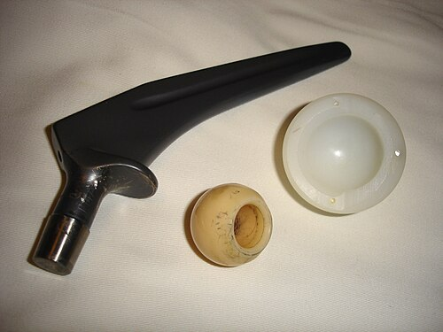

# PROFILAXIA TROMBOEMBÓLICA PERIOPERATÓRIA

O tromboembolismo venoso (TEV), que engloba a trombose venosa profunda (TVP) e a embolia pulmonar (TEP), é a principal causa de morte evitável em pacientes hospitalizados. No contexto cirúrgico, o risco é onipresente. Como professor, vejo muitos alunos decorando tabelas de doses, mas falhando na hora de estratificar o risco real do paciente. Entender a profilaxia não é apenas saber o nome da heparina, é entender quem realmente precisa dela e por quanto tempo.

*Figura 1 - Trombose venosa profunda (TVP) do membro inferior direito, com edema e hiperemia. A TVP é a principal complicação tromboembólica perioperatória. Fonte: James Heilman, MD, CC BY-SA 3.0 | Wikimedia Commons*

## Fisiopatologia: A Tríade de Virchow no Centro Cirúrgico

Por que a cirurgia é o cenário perfeito para a trombose? A resposta está na Tríade de Virchow. Se você entender isso, as condutas deixam de ser decoreba e passam a ser lógicas.

- **Estase Venosa:** O paciente cirúrgico fica imóvel na mesa de operação e, muitas vezes, no pós-operatório. Sem a "bomba muscular da panturrilha" funcionando, o sangue fica parado. Além disso, o pneumoperitônio na laparoscopia aumenta a pressão intra-abdominal, dificultando o retorno venoso.

- **Lesão Endotelial:** O ato cirúrgico em si, o manuseio de afastadores e o trauma vascular direto liberam fatores pró-coagulantes e expõem o colágeno subendotelial.

- **Hipercoagulabilidade:** O estresse cirúrgico gera uma resposta inflamatória sistêmica que aumenta os níveis de fibrinogênio e fatores da coagulação, enquanto reduz os anticoagulantes naturais como a Proteína C e S.

## Estratificação de Risco: O Escore de Caprini

Este é o ponto onde as bancas de residência mais "pegam" os candidatos. Não basta saber que o paciente é idoso; você precisa pontuar. O Escore de Caprini é o padrão-ouro para cirurgia geral e ginecológica.

### Categorias de Risco e Conduta

| Categoria de Risco | Pontuação Caprini | Incidência de TEV (sem profilaxia) | Conduta Recomendada |
| --- | --- | --- | --- |
| **Muito Baixo** | 0 a 1 | < 0,5% | Deambulação precoce apenas |
| **Baixo** | 2 | 1,5% | Métodos mecânicos (Meias ou CPI) |
| **Moderado** | 3 a 4 | 3,0% | Farmacológica (HBPM ou HNF) OU Mecânica |
| **Alto** | 5 ou mais | 6,0% | Farmacológica + Mecânica (Combinada) |

**Dica de Prova:** Se o paciente tem Caprini maior ou igual a 5, a resposta correta quase sempre envolverá a combinação de métodos (farmacológico + mecânico). Um erro comum é achar que a meia elástica substitui a heparina em pacientes de alto risco. Ela ajuda, mas não substitui.

### O que pontua no Caprini? (Exemplos Práticos)

- **1 ponto:** Idade 41 a 60 anos, cirurgia menor, IMC > 25, edema de membros inferiores, varizes.

- **2 pontos:** Idade 61 a 74 anos, cirurgia maior (> 45 min), cirurgia laparoscópica (> 45 min), câncer (mesmo que não seja o motivo da cirurgia atual), imobilização gessada.

- **3 pontos:** Idade > 75 anos, história pessoal de TEV, história familiar de TEV, Fator V de Leiden ou outras trombofilias.

- **5 pontos:** AVC recente (< 1 mês), fratura de quadril ou pelve, trauma raquimedular, politrauma.

**Exemplo Clínico:** Imagine um paciente de 65 anos (2 pts), com IMC de 30 (1 pt), submetido a uma gastrectomia por câncer (2 pts + 2 pts pela cirurgia maior). Só aqui ele já tem 7 pontos. Ele é **Muito Alto Risco**. A conduta é profilaxia farmacológica associada a métodos mecânicos.

## Métodos de Profilaxia

### Métodos Mecânicos

Os métodos mecânicos não aumentam o risco de sangramento, o que os torna ideais quando a heparina é contraindicada.

- **Deambulação Precoce:** É a base de tudo. Deve ser estimulada em todos os pacientes, independentemente do risco.

- **Meias de Compressão Graduada (MCG):** Úteis, mas sozinhas são insuficientes para alto risco.

- **Compressão Pneumática Intermitente (CPI):** É o método mecânico mais eficaz. Ela simula a bomba muscular da panturrilha e ainda estimula a liberação de substâncias fibrinolíticas endógenas.

### Métodos Farmacológicos

Aqui falamos das heparinas. A escolha entre Heparina Não Fracionada (HNF) e Heparina de Baixo Peso Molecular (HBPM) depende do perfil do paciente.

-

**Heparina de Baixo Peso Molecular (Enoxaparina):**

- **Dose padrão:** 40 mg SC, 1 vez ao dia.

- **Vantagens:** Dose única diária, menor risco de Plaquetopenia Induzida por Heparina (HIT), resposta mais previsível.

- **Cuidado:** Excreção renal. Se o ClCr < 30 mL/min, a dose deve ser reduzida (20 mg/dia) ou deve-se preferir a HNF.

-

**Heparina Não Fracionada (HNF):**

- **Dose padrão:** 5.000 UI SC, de 8/8h ou 12/12h.

- **Vantagens:** Pode ser usada em insuficiência renal grave, meia-vida curta, reversão rápida com protamina.

- **Desvantagem:** Necessita de múltiplas aplicações e tem maior risco de HIT.

**Pérola do Dr. Will:** O AAS (Aspirina) **não** é recomendado como método isolado de profilaxia de TEV na cirurgia geral. Se a questão colocar o AAS como opção de profilaxia para um paciente de risco moderado, desconfie, pois a diretriz brasileira prioriza as heparinas.

## Situações Especiais e Cirurgias de Alto Risco

### Cirurgia Ortopédica de Grande Porte

Artroplastias de quadril e joelho são o "terror" do TEV. O risco é altíssimo devido ao trauma ósseo e à manipulação vascular.

- **Duração:** O risco persiste por muito tempo após a alta. Para artroplastia de quadril, a profilaxia deve durar de **4 a 6 semanas (35 dias)**. Para joelho, pelo menos **10 a 14 dias**.

- **Drogas:** Além das heparinas, os DOACs (Rivaroxabana 10 mg/dia ou Apixabana 2,5 mg 12/12h) são excelentes opções e muito cobrados em prova por serem orais.

### Cirurgia Oncológica

O câncer é um estado pró-trombótico perene. Pacientes submetidos a cirurgias abdominais ou pélvicas por câncer devem receber **profilaxia estendida** por até 4 semanas após a alta. A banca vai tentar te convencer de que a profilaxia acaba quando o paciente sai do hospital. Não caia nessa.

### Insuficiência Renal Grave (ClCr

| Medicamento | Conduta Pré-Operatória | Quando Suspender |
| --- | --- | --- |
| **Varfarina** | Suspender e avaliar "Ponte" com Heparina | 5 dias antes (objetivo INR < 1,5) |
| **Rivaroxabana / Apixabana** | Suspender (geralmente sem ponte) | 24h a 48h antes (depende do risco de sangramento) |
| **Aspirina (AAS)** | Manter em cirurgia cardíaca; suspender em outras | 7 a 10 dias antes (se necessário suspender) |
| **Clopidogrel** | Suspender na maioria das cirurgias eletivas | 5 a 7 dias antes |

**O que é a "Ponte de Heparina"?**
Fazemos em pacientes com alto risco trombótico (ex: prótese valvar mecânica em posição mitral, FA com CHADS-VASc alto). Suspendemos a Varfarina 5 dias antes e, quando o INR cair abaixo de 2, iniciamos HBPM em dose **terapêutica** (1mg/kg 12/12h). Suspendemos a HBPM 24h antes da cirurgia.

*Figura 2 - Prótese de quadril. Cirurgias ortopédicas de grande porte (artroplastia de quadril/joelho) representam o maior risco de tromboembolismo venoso perioperatório. Fonte: Domínio Público | Wikimedia Commons*

## Diagnóstico de Complicações: Quando a Profilaxia Falha

Mesmo com tudo certo, o TEV pode ocorrer. No MedEvo, sempre reforçamos: o diagnóstico clínico de TVP e TEP é pouco confiável, mas os escores ajudam a decidir quem investigar.

### Trombose Venosa Profunda (TVP)

- **Quadro:** Edema assimétrico, dor à palpação do trajeto venoso, sinal de Homans (dor na panturrilha à dorsiflexão do pé, embora pouco sensível).

- **Diagnóstico:** O exame de escolha é o **Doppler Colorido de Membros Inferiores**.

- **D-dímero:** Tem alto **Valor Preditivo Negativo**. Se vier negativo em um paciente de baixo risco, você descarta TVP. Se vier positivo, não confirma nada (especialmente no pós-operatório, onde ele sempre sobe pela própria cirurgia).

### Tromboembolismo Pulmonar (TEP)

- **Quadro:** Taquipneia súbita, dispneia, dor torácica pleurítica e taquicardia.

- **Diagnóstico:** O padrão-ouro atual é a **Angiotomografia de Tórax**.

- **Escore de Wells:** Fundamental para estratificar a probabilidade clínica antes de pedir o exame.

## Contraindicações à Profilaxia Farmacológica

Você deve saber quando **NÃO** prescrever heparina.

- **Absolutas:** Sangramento ativo importante, plaquetopenia grave (< 50.000), história de HIT (Plaquetopenia Induzida por Heparina), hemorragia intracraniana recente.

- **Relativas:** Uso de antiagregantes, cirurgias com alto risco de sangramento (neurocirurgia, cirurgia de coluna), distúrbios de coagulação conhecidos.

**Atenção com a Anestesia de Eixo (Raqui/Peridural):**
Para evitar o temido hematoma extradural, existem regras de tempo:

- **Profilaxia antes da punção:** Aguardar 12h após a última dose de Enoxaparina profilática para puncionar ou retirar o cateter.

- **Profilaxia após a punção:** Aguardar pelo menos 6 a 12h após a punção ou retirada do cateter para reiniciar a heparina.

## Pontos-Chave para Prova

- **Caprini ≥ 5:** Risco muito alto. Exige profilaxia combinada (farmacológica + mecânica).

- **Cirurgia Oncológica Abdominal:** Profilaxia estendida por 4 semanas (28 dias).

- **Artroplastia de Quadril:** Profilaxia por 35 dias.

- **Insuficiência Renal (ClCr < 30):** Evitar HBPM; preferir HNF ou ajustar dose da Enoxaparina para 20 mg/dia.

- **Plaquetopenia Induzida por Heparina (HIT):** Contraindicação ABSOLUTA a qualquer tipo de heparina (incluindo Enoxaparina). Use métodos mecânicos ou fondaparinux/inibidores diretos se disponível.

- **Varfarina:** Suspender 5 dias antes da cirurgia. O INR alvo para operar com segurança é < 1,5.

- **D-dímero no Pós-Operatório:** Tem baixo valor preditivo positivo (sobe pela inflamação da cirurgia), mas mantém alto valor preditivo negativo para excluir TEV em pacientes de baixo risco.

- **AAS:** Não é considerado profilaxia padrão para TEV em cirurgia geral pelas diretrizes brasileiras.

- **Pneumoperitônio:** É fator de risco para TEV (aumenta estase venosa).

- **Trombos Proximais:** Veias ilíacas e femorais são as principais fontes de TEP grave. Trombos de panturrilha raramente causam TEP maciço.

- **Deambulação Precoce:** É a medida mais simples e deve ser feita em TODOS, mas isoladamente só basta para o risco "Muito Baixo" (Caprini 0-1).

- **Fator V de Leiden:** É a trombofilia hereditária mais comum associada ao risco cirúrgico.

- **Clorexidine:** Essencial na preparação da pele para reduzir infecção de cateter central, que por sua vez é fator de risco para trombose associada a cateter. 🩺

 Cópia offline para consulta pessoal.
 Fonte original:
 [https://www.medevo.com.br/material-apoio/ler/9ded88f1-0ed7-4f68-a5b4-beadb4077c1f](https://www.medevo.com.br/material-apoio/ler/9ded88f1-0ed7-4f68-a5b4-beadb4077c1f)
