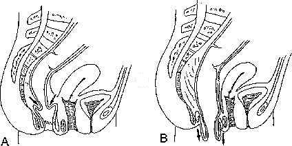
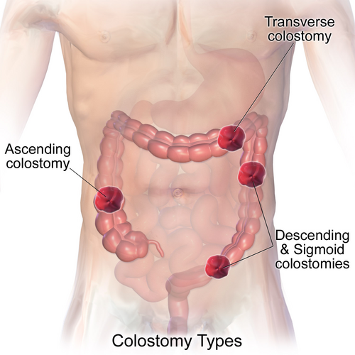

# PROLAPSO RETAL

Para começar nossa conversa, você precisa tirar uma imagem da cabeça: a de que prolapso retal é "tudo a mesma coisa". Se você for para a prova de residência achando que prolapso retal e hemorroida interna são sinônimos, você vai entregar pontos preciosos para a banca.

O prolapso retal, ou **procidência retal**, é a protrusão de todas as camadas da parede retal através do canal anal. Guarde bem essa palavra: **todas**. É isso que diferencia o prolapso retal completo do prolapso mucoso (que é o que acontece na doença hemorroidária).

Aqui no MedEvo, sempre batemos na tecla de que a anatomia dita a conduta. No prolapso completo, temos uma verdadeira hérnia por deslizamento. O reto "descola" de suas fixações e se invagina para fora. Entender isso é o primeiro passo para não errar as questões de tratamento cirúrgico.

*Figura 1 - A: Intussuscepção retal interna. B: Prolapso retal externo (completo), com protrusão de todas as camadas do reto pelo canal anal. Fonte: Domínio Público | Wikimedia Commons*

## Fisiopatologia e Anatomia: O Porquê do Prolapso

Por que o reto de alguns pacientes decide "sair para passear"? Não é um evento aleatório. Existem alterações anatômicas clássicas que as bancas adoram descrever no enunciado para ver se você reconhece o quadro.

No prolapso retal completo, observamos quatro alterações principais:

- **Fundo de saco de Douglas excessivamente profundo:** O peritônio desce muito baixo entre o reto e a bexiga (ou útero).

- **Frouxidão dos ligamentos laterais do reto:** O reto perde suas "âncoras" laterais.

- **Diástase dos músculos elevadores do ânus:** O assoalho pélvico se abre, facilitando a passagem.

- **Reto redundante e perda da fixação sacral:** O reto fica "solto" e comprido demais.

**Dica de Prova:** A banca pode descrever uma "invaginação circunferencial". Isso é o prolapso retal. Se a descrição falar em "pregas radiais", desconfie de prolapso mucoso ou hemorroidário. No prolapso completo, as pregas da mucosa são **circunferenciais** (como anéis concêntricos).

## Epidemiologia e Fatores de Risco

Quem é o paciente clássico? Imagine uma mulher, idosa (acima de 60-70 anos), multípara e com história de constipação crônica.

Embora o prolapso possa ocorrer em homens e jovens, a proporção chega a ser de 6:1 a 10:1 a favor das mulheres. Por que a multiparidade conta? Por causa do trauma repetido ao assoalho pélvico e ao nervo pudendo, que enfraquece a musculatura esfincteriana.

**Atenção:** Em crianças, o prolapso retal costuma ser apenas mucoso e está muito associado a quadros de desnutrição, parasitoses (tricuríase) e fibrose cística. Se cair uma questão de prolapso em criança, antes de pensar em cirurgia, pense em investigar causas sistêmicas.

## Diagnóstico Diferencial: O Grande Nó das Provas

Aqui é onde o examinador separa o aluno que decorou do aluno que entende. O principal diferencial é a **Doença Hemorroidária**.

Lembra das pérolas clínicas? Vamos revisar a classificação das hemorroidas internas, pois ela cai MUITO:

- **Grau I:** Sangra, mas não prolapsa.

- **Grau II:** Prolapsa com o esforço, mas reduz **espontaneamente**.

- **Grau III:** Prolapsa com o esforço e exige **redução manual**. (Aqui é a indicação clássica de Hemorroidectomia, como a técnica de Milligan-Morgan).

- **Grau IV:** Prolapsa e é **irredutível**.

**Como diferenciar na prova?**
O prolapso retal completo (procidência) geralmente apresenta uma massa maior (frequentemente > 3cm), com pregas mucosas circulares. O prolapso hemorroidário costuma ser segmentar (em "mamilos") e as pregas são radiais.

### Tabela 1: Diferenciação Clínica

| Característica | Prolapso Retal Completo | Prolapso Hemorroidário (Grau III/IV) |
| --- | --- | --- |
| **Camadas envolvidas** | Todas as camadas do reto | Apenas mucosa e submucosa |
| **Pregas mucosas** | Circunferenciais (anéis) | Radiais |
| **Tamanho da massa** | Geralmente > 3-5 cm | Geralmente menor, segmentada |
| **Tônus Esfincteriano** | Muito reduzido (incontinência comum) | Pode estar normal ou aumentado |
| **Dor** | Desconforto/Peso (dor aguda sugere estrangulamento) | Dor intensa se houver trombose |

## Quadro Clínico e Exame Físico

O paciente chega dizendo: "Doutor, sinto que algo sai pelo meu ânus quando vou ao banheiro".

Além da protrusão, dois sintomas dominam o quadro:

- **Incontinência Anal:** Presente em até 75% dos casos. O reto saindo dilata o esfíncter e o trauma crônico lesa o nervo pudendo.

- **Constipação:** Parece contraditório, mas muitos pacientes têm uma dificuldade de evacuação (obstrução de saída) devido à própria invaginação do reto.

**No exame físico:**
Peça para o paciente fazer a manobra de Valsalva (esforço evacuatório). Se não prolapsar na mesa de exame, peça para ele fazer o esforço em posição de cócoras (é muito mais sensível).

Ao toque retal, você notará um tônus esfincteriano muito reduzido. Se você conseguir pinçar a massa entre os dedos e sentir duas camadas de parede retal (o "sinal do dedo"), você está diante de um prolapso completo.

## Exames Complementares

O diagnóstico é eminentemente **clínico**. No entanto, para planejar a cirurgia ou em casos de dúvida (prolapso oculto/intussuscepção interna), usamos:

- **Cinedefecografia:** O padrão-ouro para avaliar a dinâmica da evacuação e diagnosticar intussuscepções que não saem pelo ânus.

- **Colonoscopia:** Obrigatória em adultos para excluir lesões polipoides ou neoplasias que possam estar servindo de "ponto de partida" (lead point) para o prolapso.

- **Manometria Anorretal:** Útil para avaliar o grau de lesão esfincteriana e predizer o sucesso da melhora da incontinência após a cirurgia.

*Figura 2 - Tipos de colostomia. Em casos de prolapso retal, a retossigmoidectomia perineal (Altemeier) ou a retopexia abdominal podem ser necessárias. Fonte: BruceBlaus, CC BY 3.0 | Wikimedia Commons*

## Tratamento Cirúrgico: Onde as Questões se Concentram

Não existe tratamento clínico eficaz para o prolapso retal completo. A conduta é **cirúrgica**.

A escolha da técnica depende de dois fatores: o risco cirúrgico do paciente e a presença de constipação. Como diz o Dr. Will, a cirurgia do prolapso é um equilíbrio entre "taxa de recorrência" e "morbidade".

Temos duas vias principais: **Abdominal** e **Perineal**.

### 1. Via Abdominal

É a preferida para pacientes jovens ou idosos com bom estado clínico (baixo risco cirúrgico).

- **Vantagens:** Menor taxa de recorrência e possibilidade de tratar a incontinência.

- **Técnicas:**

- **Retopexia (com ou sem tela):** Fixa-se o reto ao promontório sacral. Pode ser feita por laparoscopia (hoje é o padrão).

- **Operação de Frykman-Goldberg:** É a retopexia associada à **sigmoidectomia**. Quando fazemos? Quando o paciente tem prolapso E constipação crônica importante (devido ao sigmoide redundante).

### 2. Via Perineal

Reservada para pacientes idosos, com muitas comorbidades ou alto risco para anestesia geral/cirurgia abdominal.

- **Vantagens:** Menor morbidade, pode ser feita sob raquianestesia ou até anestesia local com sedação.

- **Desvantagem:** Maior taxa de recorrência.

- **Técnicas:**

- **Cirurgia de Altemeier (Proctosigmoidectomia Perineal):** Você "puxa" o reto para fora, corta o excesso e faz uma anastomose entre o reto/cólon e o canal anal. É a escolha para prolapsos grandes e pacientes frágeis.

- **Cirurgia de Delorme:** Você retira apenas a "casca" (mucosa) e faz uma plicatura da musculatura retal. Indicada para prolapsos pequenos (< 3-4 cm).

### Tabela 2: Escolha da Técnica Cirúrgica

| Perfil do Paciente | Técnica de Escolha | Via de Acesso |
| --- | --- | --- |
| Jovem/Adulto hígido | Retopexia (Laparoscópica) | Abdominal |
| Paciente com Constipação importante | Frykman-Goldberg (Retopexia + Sigmoidectomia) | Abdominal |
| Idoso frágil / Alto risco cirúrgico | Altemeier | Perineal |
| Prolapso pequeno / Risco cirúrgico extremo | Delorme | Perineal |
| Prolapso Irredutível/Estrangulado | Altemeier | Perineal (Urgência) |

**Cuidado com a pegadinha:** Se a questão trouxer uma idosa de 85 anos, cardiopata, com prolapso de 6 cm, a resposta NÃO é retopexia abdominal. É Altemeier. A banca quer testar se você sabe indicar a via de menor risco.

## Situações de Urgência: O Prolapso Encarcerado

Se o prolapso retal se tornar irredutível e o paciente apresentar dor aguda, estamos diante de um **estrangulamento**. O edema impede o retorno venoso, o que aumenta ainda mais o edema, gerando um ciclo vicioso que leva à isquemia e necrose.

**Conduta inicial:** Tentar redução manual com sedação e aplicação de substâncias osmóticas (açúcar granulado pode ajudar a reduzir o edema).
**Se falhar ou houver sinais de necrose:** Cirurgia de urgência. A técnica de Altemeier é excelente aqui, pois permite ressecar o segmento isquemiado por via perineal sem contaminar a cavidade abdominal.

## Megacólon e Prolapso: A Conexão Brasileira

No Brasil, não podemos falar de reto e sigmoide sem citar o **Megacólon Chagásico**. Embora o prolapso não seja a manifestação principal do Chagas (o principal é o fecaloma e o volvo), as técnicas cirúrgicas se cruzam nas provas.

O **Megacólon Adquirido** (Chagas) ou o **Congênito** (Doença de Hirschsprung) exigem cirurgias de abaixamento.

- **Cirurgia de Duhamel-Haddad:** Muito cobrada! Consiste na retocolectomia com abaixamento retrorretal. Deixa-se um "coto" retal e o cólon é abaixado por trás dele. É a técnica clássica para o megacólon chagásico no Brasil.

- **Indicações no Megacólon:** Volvo de sigmoide prévio (mesmo que resolvido clinicamente) e fecalomas de repetição são indicações formais de tratamento cirúrgico (como a hemicolectomia esquerda estendida ou a cirurgia de Duhamel).

## Doença de Hirschsprung (Megacólon Congênito)

Diferente do Chagas, onde os plexos de Auerbach e Meissner são destruídos ao longo da vida, no Hirschsprung eles **nunca existiram** no segmento distal (aganglionose).

O diagnóstico costuma ser na infância (atraso na eliminação de mecônio). O tratamento também envolve abaixamento (como a técnica de Duhamel, Soave ou Swenson). Lembre-se: no Hirschsprung, a biópsia retal mostrando ausência de células ganglionares e hipertrofia de fibras nervosas é o padrão-ouro.

## Hemorroidas: O "Primo" que mais cai em prova

Como o tema de prolapso retal nas provas está intrinsecamente ligado ao prolapso hemorroidário, precisamos dominar o manejo das hemorroidas internas.

**Tratamento Clínico (Grau I e II):**

- Dieta rica em fibras (25-35g/dia).

- Ingesta hídrica adequada (> 2L/dia).

- Evitar esforço evacuatório prolongado.

- Banhos de assento mornos (ajudam no relaxamento do esfíncter).

**Tratamento Ambulatorial (Grau I, II e alguns III):**

- **Ligadura Elástica:** É o procedimento de escolha. Causa isquemia e fibrose do mamilo hemorroidário. **Nunca** faça ligadura abaixo da linha pectínea (dor insuportável!).

**Tratamento Cirúrgico (Grau III e IV):**

- **Milligan-Morgan:** Técnica aberta (deixa a ferida cicatrizar por segunda intenção). É a mais utilizada no Brasil.

- **Ferguson:** Técnica fechada (sutura-se a mucosa).

- **PPH (Grampeamento):** Indicado para prolapsos circunferenciais. Dói menos no pós-operatório, mas tem maior taxa de recorrência que a cirurgia convencional.

### Tabela 3: Manejo da Doença Hemorroidária Interna

| Grau | Descrição | Conduta Inicial |
| --- | --- | --- |
| **I** | Sem prolapso | Dieta, fibras, bioflavonoides |
| **II** | Redução espontânea | Ligadura elástica |
| **III** | Redução manual | Ligadura elástica ou Hemorroidectomia |
| **IV** | Irredutível | Hemorroidectomia (Milligan-Morgan) |

## Complicações Pós-Operatórias

Nas cirurgias de prolapso retal e hemorroidectomia, o aluno deve estar atento a:

- **Retenção Urinária:** A complicação mais comum após cirurgias anorretais (devido à dor e reflexo inibitório).

- **Estenose Anal:** Complicação tardia se o cirurgião remover "pele demais" na hemorroidectomia (não deixar as pontes cutâneo-mucosas).

- **Incontinência:** Pode ocorrer se houver lesão inadvertida do esfíncter ou se a retopexia não for suficiente para recuperar a função nervosa.

## Casos Clínicos Rápidos para Fixação

**Cenário 1:** Mulher, 72 anos, apresenta massa de 6 cm exteriorizada pelo ânus após esforço. Ao exame, pregas circulares e tônus anal reduzido. Ela é hipertensa e diabética controlada.

- **Diagnóstico:** Procidência (Prolapso Retal Completo).

- **Conduta:** Cirurgia de Altemeier (Via perineal é mais segura para a idade e o tamanho do prolapso).

**Cenário 2:** Homem, 45 anos, queixa-se de "caroço" que sai ao evacuar e ele precisa empurrar de volta com o dedo. Sangramento vivo ocasional.

- **Diagnóstico:** Hemorroida Interna Grau III.

- **Conduta:** Hemorroidectomia (Milligan-Morgan) ou Ligadura Elástica (se o mamilo for único e pequeno).

**Cenário 3:** Paciente com diagnóstico de Megacólon Chagásico apresenta quadro de dor abdominal súbita, parada de eliminação de gases e fezes, e imagem de "U invertido" ou "grão de café" no Raio-X de abdome.

- **Diagnóstico:** Volvo de Sigmoide.

- **Conduta Inicial:** Descompressão por colonoscopia (se não houver peritonite).

- **Conduta Definitiva:** Sigmoidectomia (eletiva) ou Cirurgia de Duhamel-Haddad.

## Pontos-Chave para Prova 🎯

- **Procidência Retal:** Envolve TODAS as camadas da parede retal. Pregas são circunferenciais.

- **Prolapso Mucoso:** Envolve apenas a mucosa. Comum na doença hemorroidária. Pregas são radiais.

- **Hemorroida Grau III:** Prolapsa e exige redução manual. Indicação clássica de cirurgia.

- **Hemorroida Grau IV:** Prolapsa e é irredutível. Risco de trombose e necrose.

- **Técnica de Milligan-Morgan:** Hemorroidectomia aberta, a mais cobrada em provas brasileiras.

- **Cirurgia de Altemeier:** Proctosigmoidectomia por via perineal. Escolha para idosos e pacientes de alto risco.

- **Cirurgia de Frykman-Goldberg:** Retopexia + Sigmoidectomia por via abdominal. Escolha para jovens com constipação.

- **Sinal do Dedo:** No toque retal do prolapso completo, você sente duas camadas de parede retal ao pinçar a massa.

- **Incontinência Anal:** Presente na maioria dos casos de prolapso completo por lesão do nervo pudendo e dilatação do esfíncter.

- **Megacólon Chagásico:** Principal causa de megacólon adquirido no Brasil. Cirurgia de Duhamel-Haddad é a técnica de abaixamento retrorretal clássica.

- **Volvo de Sigmoide:** Imagem em "grão de café" ou "U invertido". É uma indicação de cirurgia definitiva após a resolução do quadro agudo.

- **Prolapso Irredutível e Doloroso:** Emergência cirúrgica. Tentar redução com açúcar/sedação, mas se houver isquemia, operar (Altemeier é uma ótima opção).

- **Fibrose Cística:** Sempre pensar como causa de prolapso retal em crianças.

- **Contraindicação Absoluta de Ligadura Elástica:** Hemorroidas externas ou abaixo da linha pectínea (causa dor insuportável).

- **PPH (Grampeamento):** Menos dor, mas maior recorrência que Milligan-Morgan.

- **Complicação mais comum pós-hemorroidectomia:** Retenção urinária aguda.

- **Diferença anatômica crucial:** O prolapso retal é uma hérnia por deslizamento do fundo de saco de Douglas.

- **Tratamento de escolha para Hirschsprung:** Cirurgias de abaixamento (Duhamel, Soave ou Swenson).

Lembre-se: a banca quer saber se você sabe diferenciar o prolapso "simples" (hemorroida) da procidência (completo) e se você sabe escolher a cirurgia certa para o paciente certo (Abdominal para o hígido, Perineal para o frágil). Se você dominar essas distinções, as questões de coloproctologia serão o seu diferencial na aprovação.

 Cópia offline para consulta pessoal.
 Fonte original:
 [https://www.medevo.com.br/material-apoio/ler/7a0295b3-2b33-4833-a7f0-a1c691d2d53c](https://www.medevo.com.br/material-apoio/ler/7a0295b3-2b33-4833-a7f0-a1c691d2d53c)
