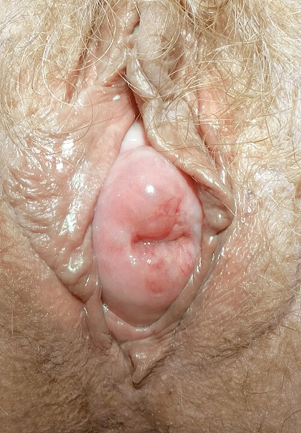

# PROLAPSOS GENITAIS

Seja bem-vinda e bem-vindo. Se você está aqui, é porque já percebeu que a Uroginecologia é uma das áreas mais "previsíveis" das provas de residência, mas também uma das que mais punem quem tenta apenas decorar nomes de cirurgias sem entender a lógica por trás delas.

Eu sou o seu professor e hoje vamos dissecar os **Prolapsos de Órgãos Pélvicos (POP)**. Esqueça aquela lista infinita de epônimos por um momento. Vamos focar no que faz a bexiga descer, por que o útero "sai" e, principalmente, como as bancas vão tentar te derrubar usando o sistema POP-Q. Como costumamos dizer aqui no **MedEvo**, o segredo não é saber tudo, é saber o que o examinador quer que você saiba.

*Figura 1 - Cistocele (prolapso do compartimento anterior) em mulher de 73 anos. A bexiga protunde através da parede vaginal anterior por deficiência do suporte fascial. Fonte: Mikael Häggström, CC0 | Wikimedia Commons*

## Anatomia e Fisiopatologia: O Equilíbrio de Forças

Para entender o prolapso, você precisa visualizar a pelve como uma ponte suspensa. De um lado, temos os músculos (o assoalho); do outro, os ligamentos e fáscias (a suspensão). O prolapso ocorre quando esse sistema de suporte falha.

### Os Níveis de Sustentação de DeLancey

Este é o conceito fundamental. Se você entender DeLancey, você entende 50% das indicações cirúrgicas. Segundo a teoria de Lancey, o suporte vaginal é dividido em três níveis:

- **Nível I (Suspensor):** É o topo. Aqui temos o **complexo de ligamentos uterossacros e cardinais (paramétrios)**. Eles suspendem o útero e o ápice da vagina ao sacro e à parede pélvica lateral.

- *Falha aqui:* Gera prolapso apical (uterino ou de cúpula vaginal).

- **Nível II (Ancoragem):** É o meio da vagina. A fáscia pubocervical (anterior) e a fáscia retovaginal (posterior) se ligam lateralmente ao **arco tendíneo da fáscia pélvica** (a "linha branca").

- *Falha aqui:* Gera cistocele (anterior) ou retocele (posterior).

- **Nível III (Fusão):** É a parte distal, próxima ao hímen. A vagina se funde ao corpo perineal e à membrana perineal.

- *Falha aqui:* Gera roturas perineais e prolapsos distais.

**Dica de Prova:** As bancas adoram perguntar qual ligamento é responsável pela suspensão do colo. Lembre-se: **Uterossacrais**. Se a questão fala em "nível I de DeLancey", ela está falando de ápice!

### Fatores de Risco: Por que o suporte falha?

O prolapso não acontece do dia para a noite. É um processo crônico de aumento de pressão e perda de resistência tecidual.

- **Paridade e Parto Vaginal:** É o principal fator de risco obstétrico. O estiramento e a lesão nervosa/muscular durante o expulsivo são cruciais.

- *Pegadinha:* **Cesariana eletiva NÃO é fator de risco.** Se a paciente nunca entrou em trabalho de parto, o risco é mínimo.

- **Envelhecimento e Hipoestrogenismo:** A menopausa reduz o colágeno e a elasticidade dos tecidos.

- **Aumento da Pressão Intra-abdominal:** Aqui entram as comorbidades. **DPOC (tosse crônica)**, obesidade e constipação intestinal crônica (esforço evacuatório) "empurram" os órgãos para baixo.

- **Genética:** Alterações no colágeno (Síndrome de Marfan ou Ehlers-Danlos).

## Quadro Clínico: A Queixa da Paciente

A queixa clássica é a sensação de **"bola na vagina"** ou peso pélvico. Mas cuidado, o prolapso raramente vem sozinho. Ele costuma estar associado a:

- **Sintomas Urinários:** Dificuldade miccional (o prolapso "dobra" a uretra, causando obstrução), polaciúria ou urgência.

- **Sintomas Intestinais:** Constipação e necessidade de **manobra digital** (a paciente precisa empurrar a parede vaginal posterior para conseguir evacuar — sinal clássico de retocele).

- **Disfunção Sexual:** Dispareunia ou vergonha da exposição genital.

**Exemplo Clínico:** Paciente de 68 anos, multípara, com DPOC, queixa-se de que precisa "empurrar a bola para dentro" para conseguir urinar. Isso indica um prolapso de parede anterior (cistocele) que está causando uma obstrução mecânica da uretra.

## O Sistema POP-Q (Pelvic Organ Prolapse Quantification)

Respire fundo. O POP-Q assusta, mas ele é apenas um mapa de 9 pontos. O ponto de referência é sempre o **hímen (valor 0)**.

- Para dentro do hímen: valores **negativos**.

- Para fora do hímen: valores **positivos**.

### Os Pontos Chave

- **Aa e Ba:** Parede Anterior (Bexiga). O Aa é fixo (3cm para dentro), o Ba é o ponto de maior prolapso.

- **Ap e Bp:** Parede Posterior (Reto).

- **C:** Colo uterino (ou cúpula se for histerectomizada).

- **D:** Fundo de saco de Douglas (só existe se houver útero). Serve para diferenciar prolapso uterino de hipertrofia de colo.

- **gh:** Hiato genital.

- **pb:** Corpo perineal.

- **tvl:** Comprimento vaginal total.

### Estadiamento (O que cai na prova!)

A classificação da ICS (International Continence Society) divide em estádios de 0 a IV:

| Estádio | Descrição |
| --- | --- |
| **Estádio 0** | Sem prolapso. Todos os pontos estão em seus locais de repouso. |
| **Estádio I** | O ponto de maior prolapso está a **mais de 1 cm ACIMA** do hímen (ex: -2, -3). |
| **Estádio II** | O ponto de maior prolapso está entre **1 cm acima e 1 cm abaixo** do hímen ([-1, +1]). |
| **Estádio III** | O ponto de maior prolapso está a **mais de 1 cm ABAIXO** do hímen, mas não é o prolapso total. |
| **Estádio IV** | Eversão completa. O ponto de maior prolapso está em **(TVL - 2)** ou mais. |

**Dica do Dr. Will:** Se o ponto Ba é +2 e o TVL é 10, o estádio é III. Se o Ba fosse +8, seria estádio IV. A regra do "1 cm" é o que define o Estádio II. Se estiver entre -1 e +1, é II. Ponto final.

## Diagnóstico Diferencial: Hipertrofia de Colo

Isso é uma pegadinha clássica. A paciente tem uma "bola na vagina", você olha o POP-Q e vê o ponto **C em +3** (fora do hímen), mas o ponto **D está em -8** (lá no alto).

- Se o fundo de saco (D) está no lugar, mas o colo (C) está fora, o útero não caiu; o colo é que cresceu!

- **Diagnóstico:** Alongamento hipertrófico do colo uterino.

- **Conduta:** Cirurgia de Manchester (amputação do colo com fixação dos ligamentos uterossacros).

## Tratamento Conservador

Nem toda paciente precisa de faca. O tratamento depende do desejo da paciente, dos sintomas e do risco cirúrgico.

### 1. Mudanças de Estilo de Vida (MEV)

Essencial para todas. Perda de peso (reduzir IMC < 30), tratar a tosse crônica (parar de fumar) e combater a constipação (dieta com 25-30g de fibras/dia).

### 2. Fisioterapia Pélvica (TMAP)

O Treinamento dos Músculos do Assoalho Pélvico é excelente para **estádios iniciais (I e II)** e para prevenir a progressão. Não "cura" um prolapso estágio IV, mas melhora muito a sintomatologia.

### 3. Pessários Vaginais

São dispositivos de silicone inseridos na vagina.

- **Indicação de Ouro:** Idosas com comorbidades graves (alto risco cirúrgico), pacientes que não desejam cirurgia ou como teste pré-operatório.

- **Vantagem:** Baixo custo, resolve o sintoma imediatamente.

- **Cuidados:** Precisa de estrogênio tópico para evitar úlceras vaginais e acompanhamento regular.

*Figura 2 - Prolapso uterino em mulher de 71 anos, com cérvice visível no introito vaginal (estágio avançado POP-Q). O tratamento pode ser conservador (pessário) ou cirúrgico. Fonte: Mikael Häggström, CC0 | Wikimedia Commons*

## Tratamento Cirúrgico: Escolhendo a Técnica

Aqui o examinador quer saber se você sabe qual compartimento corrigir.

### Compartimento Anterior (Cistocele)

- **Cirurgia:** Colporrafia anterior (ou colpoperineoplastia anterior).

- **Técnica:** Plicatura da fáscia pubocervical.

- *Uso de telas:* Atualmente a FEBRASGO recomenda cautela. O uso de telas por via vaginal deve ser individualizado devido ao risco de erosão e dor crônica.

### Compartimento Posterior (Retocele)

- **Cirurgia:** Colporrafia posterior.

- **Técnica:** Reparo da fáscia retovaginal. Se houver defeito de corpo perineal, faz-se a perineoplastia.

### Compartimento Apical (Prolapso Uterino ou de Cúpula)

Aqui o bicho pega. A escolha depende da atividade sexual e do desejo de preservar o útero.

- **Histerectomia Vaginal:** É a conduta padrão para prolapso uterino sintomático em mulheres que não desejam mais gestar. Sempre associada à fixação da cúpula (McCall ou sacroespinhoso) para evitar que a cúpula caia depois.

- **Cirurgia de Manchester:** Indicada para prolapso uterino com alongamento de colo em mulheres que **desejam preservar o útero** ou a fertilidade.

- **Sacrocolpopexia (Abdominal/Laparoscópica):** É o **padrão-ouro** para prolapso de cúpula vaginal em mulheres jovens e sexualmente ativas. Fixa-se a cúpula ao promontório sacral com uma tela.

- **Fixação ao Ligamento Sacroespinhoso (Vaginal):** Ótima opção para corrigir o ápice por via vaginal.

- *Risco:* Lesão dos vasos pudendos ou nervo ciático (dor glútea pós-op).

### Cirurgias Obliterativas (Colpocleise)

A famosa **Cirurgia de Le Fort**.

- **Indicação:** Idosas, com comorbidades graves, que **NÃO têm mais vida sexual ativa**.

- **O que é:** Fecha-se o canal vaginal. É rápida, tem baixa morbidade e altíssima taxa de cura. Mas atenção: é irreversível para a função sexual.

## Situações Especiais e Pegadinhas

### Incontinência Urinária de Esforço (IUE) Oculta

Imagine uma paciente com prolapso estágio IV. Ela não perde urina. Por quê? Porque o prolapso está "dobrando" a uretra (efeito kinking). Se você operar e "esticar" tudo, ela vai começar a perder urina no pós-operatório.

- **Conduta:** Em prolapsos avançados, deve-se **reduzir o prolapso** (com um pessário ou gaze) durante o estudo urodinâmico para pesquisar a IUE oculta. Se positiva, você já faz a cirurgia do prolapso + o Sling na mesma hora.

### Prolapso Retal e Hemorroidas

Embora sejam temas da proctologia, aparecem no contexto do assoalho pélvico.

- **Hemorroidas Internas Grau II:** Prolapsam ao esforço, mas reduzem sozinhas. Tratamento de escolha: **Ligadura elástica**.

- **Prolapso Retal:** Pode estar associado a parasitoses (tricuríase em crianças) ou fraqueza do assoalho pélvico em idosas.

## 💡 Pontos-Chave para Prova

- **Nível I de DeLancey:** Ligamentos uterossacros e cardinais (sustentação do ápice).

- **Fator de Risco Principal:** Parto vaginal e multiparidade. Cesárea eletiva protege.

- **DPOC e Constipação:** Fatores que aumentam a pressão intra-abdominal e pioram o prolapso.

- **POP-Q Estádio II:** Ponto de maior prolapso entre -1 cm e +1 cm em relação ao hímen.

- **POP-Q Estádio IV:** Eversão total, ponto distal ≥ (TVL - 2).

- **Hipertrofia de Colo:** Ponto C positivo (baixo), mas ponto D negativo (alto/normal).

- **Cirurgia de Manchester:** Preserva o útero; indicada para alongamento de colo.

- **Colpocleise (Le Fort):** Idosa, comorbidades, sem vida sexual. Baixa morbidade.

- **Pessário Vaginal:** Melhor opção conservadora para idosas com alto risco cirúrgico.

- **IUE Oculta:** Sempre reduzir o prolapso antes da urodinâmica em grandes distopias.

- **Sacrocolpopexia:** Padrão-ouro para prolapso apical em pacientes jovens/ativas (via abdominal).

- **Manobra Digital Vaginal:** Sinal clássico de retocele (defeito de parede posterior).

- **Contraindicação Absoluta ao Pessário:** Infecção vaginal ativa ou alergia ao material (raro).

- **Hemorroida Grau II:** Tratamento é ligadura elástica (não é cirurgia excisional de cara).

- **O que NÃO fazer:** Operar paciente assintomática apenas por achado de exame físico (estádio I ou II sem queixas). A conduta é expectante ou fisioterapia.

### Tabela Comparativa: Resumo de Condutas

| Compartimento | Defeito Principal | Cirurgia Sugerida |
| --- | --- | --- |
| **Anterior** | Cistocele (Fáscia pubocervical) | Colporrafia Anterior |
| **Posterior** | Retocele (Fáscia retovaginal) | Colporrafia Posterior |
| **Apical (Útero)** | Prolapso Uterino | Histerectomia Vaginal + Fixação de Cúpula |
| **Apical (Cúpula)** | Prolapso pós-histerectomia | Sacrocolpopexia ou Fixação Sacroespinhosa |
| **Apical (Colo)** | Alongamento Hipertrófico | Cirurgia de Manchester |
| **Global (Idosa)** | Prolapso total / Alto risco | Colpocleise (Le Fort) |

Com este guia, você cobriu todos os pontos fundamentais exigidos pelas principais bancas do país. Lembre-se: no POP-Q, o sinal de menos (-) é seu amigo (está dentro), o sinal de mais (+) é o problema (está fora). Boa revisão!

 Cópia offline para consulta pessoal.
 Fonte original:
 [https://www.medevo.com.br/material-apoio/ler/0a7c5550-477c-4afe-8bf7-7ad3e32ff970](https://www.medevo.com.br/material-apoio/ler/0a7c5550-477c-4afe-8bf7-7ad3e32ff970)
