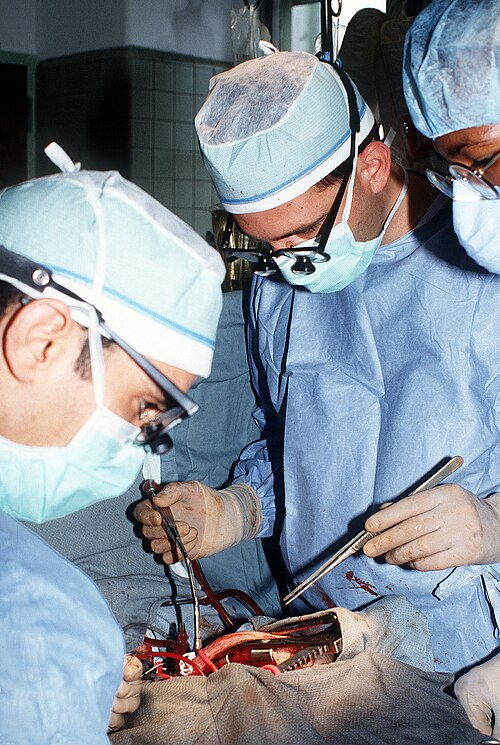

# PROPEDÊUTICA CIRÚRGICA

A propedêutica cirúrgica não é apenas o ato de examinar um paciente; é o processo de construção de uma decisão. Na cirurgia, o fluxo segue uma lógica rigorosa: Queixas → Diagnóstico → Decisão/Indicação → Pré-operatório → Ato Cirúrgico → Pós-operatório → Alta. Se você errar na propedêutica, o erro se propagará por todas as etapas seguintes.

Muitos alunos acreditam que a propedêutica termina quando o diagnóstico é feito. Errado. Ela continua no pré-operatório, avaliando se o paciente aguenta o procedimento, e no pós-operatório, detectando precocemente as complicações. Vamos entender como as bancas cobram essa visão dinâmica.

*Figura 1 - Cirurgião em ato operatório. A avaliação pré-operatória adequada e a estratificação de risco são fundamentais para reduzir complicações perioperatórias. Fonte: Domínio Público (US Military) | Wikimedia Commons*

## Avaliação Pré-Operatória e Estratificação de Risco

O objetivo aqui não é "liberar" o paciente para a cirurgia, mas sim estratificar o risco e otimizar as condições clínicas. Um erro clássico é solicitar exames de forma indiscriminada.

### Exames Pré-operatórios: O que realmente pedir?

A regra de ouro, baseada na eficiência e na segurança do paciente, é: paciente ASA I, jovem (geralmente < 45-50 anos) e saudável, para cirurgia de baixo risco (como uma hérnia inguinal), **não necessita de exames complementares de rotina**.

Por que não pedimos? Porque exames em pacientes assintomáticos geram falsos positivos, levam a investigações desnecessárias e atrasam o tratamento sem mudar o desfecho. Segundo as diretrizes brasileiras e internacionais, os exames devem ser direcionados pela anamnese e exame físico.

Se o paciente é obeso ou sedentário e vai para uma cirurgia eletiva, o rastreio de diabetes com glicemia de jejum ou HbA1c é fundamental para otimizar o controle glicêmico e reduzir o risco de infecção de sítio cirúrgico.

### Classificação ASA (American Society of Anesthesiologists)

Esta é a classificação de risco mais cobrada em provas. Ela avalia o estado físico do paciente, não o risco do procedimento em si.

| Classificação | Descrição | Exemplo Clínico |
| --- | --- | --- |
| **ASA I** | Paciente saudável, não fumante, sem álcool ou uso mínimo. | Jovem hígido para herniorrafia. |
| **ASA II** | Doença sistêmica leve, sem limitação funcional. | HAS controlada, DM controlado, tabagista, obeso (IMC < 40). |
| **ASA III** | Doença sistêmica grave, com limitação funcional. | DM ou HAS mal controlados, IAM prévio (> 3 meses), ICC estável. |
| **ASA IV** | Doença sistêmica grave que é ameaça constante à vida. | IAM recente (< 3 meses), sepse, disfunção orgânica grave. |
| **ASA V** | Paciente moribundo, expectativa de vida < 24h sem cirurgia. | Aneurisma de aorta roto, trauma craniano grave. |
| **ASA VI** | Morte encefálica declarada. | Doador de órgãos. |

*Dica de prova:* O sufixo "E" é adicionado para cirurgias de emergência (ex: ASA IIE). Isso indica que o risco é maior do que o previsto apenas pela comorbidade.

### Avaliação de Risco Cardiovascular e Funcional

Para cirurgias não cardíacas, usamos o Índice de Risco Cardíaco Revisado (Índice de Lee). Ele pontua:

- Cirurgia de alto risco (intraperitoneal, intratorácica ou suprainguinal).

- História de doença isquêmica do coração.

- História de insuficiência cardíaca.

- História de doença cerebrovascular.

- Diabetes mellitus em uso de insulina.

- Creatinina pré-operatória > 2,0 mg/dL.

A capacidade funcional é medida em Equivalentes Metabólicos (METs). Se o paciente consegue subir dois lances de escada ou correr um pouco (METs > 4), o risco perioperatório é menor. Se ele não consegue (METs < 4), a investigação deve ser mais profunda.

## Anatomia Cirúrgica e Fisiologia Aplicada

Para operar, você precisa conhecer os limites. A anatomia cirúrgica foca em planos, espaços e variações.

### O Peritônio e o Espaço Retroperitoneal

A fisiologia peritoneal é complexa. O peritônio é uma membrana semipermeável que permite a troca de fluidos e solutos. Em processos inflamatórios, ele responde com exsudação e formação de aderências.

Os órgãos retroperitoneais são alvos frequentes de trauma e cirurgias oncológicas. Lembrar quem está lá é vital: rins, glândulas adrenais, ureteres, pâncreas (exceto a cauda), duodeno (partes 2, 3 e 4), aorta e veia cava inferior.

*Exemplo Clínico:* Em uma cirurgia pélvica oncológica ou histerectomia com linfadenectomia, o ureter é a estrutura em maior risco. Se o paciente apresentar dor lombar e oligúria no pós-operatório, pense em lesão ureteral. Outra lesão comum nessas cirurgias é a do nervo obturatório, que causa perda da sensibilidade na face medial da coxa e dificuldade na adução.

### Anatomia do Fígado e Manobra de Pringle

O fígado é dividido em 8 segmentos baseados na distribuição da veia porta e artérias hepáticas (Classificação de Couinaud). Em traumas hepáticos com sangramento vultoso, realizamos a **Manobra de Pringle**: o clampeamento do ligamento hepatoduodenal.

O que passa no ligamento hepatoduodenal? A tríade portal: Veia Porta, Artéria Hepática Própria e Ducto Colédoco. Se o sangramento não parar após a manobra, a origem é provavelmente as veias hepáticas ou a veia cava inferior (retro-hepática).

### Drenagem Venosa e Variações Anatômicas

A drenagem da glândula adrenal esquerda é uma pegadinha clássica. Enquanto a adrenal direita drena diretamente para a veia cava inferior, a adrenal esquerda drena para a veia renal esquerda. Isso é importante em nefrectomias e adrenalectomias.

## Acessos Venosos e Monitorização Hemodinâmica

O Cateter Venoso Central (CVC) é essencial para monitorização da Pressão Venosa Central (PVC), administração de drogas vasoativas e nutrição parenteral.

### Escolha do Sítio de Punção

- **Veia Subclávia:** Menor risco de infecção, mas maior risco de pneumotórax. É a preferida para uso prolongado.

- **Veia Jugular Interna (VJI):** Mais fácil de puncionar guiada por ultrassom (USG). A VJI direita é preferida por ter um trajeto retilíneo até o átrio. O Triângulo de Sédillot (entre as cabeças do esternocleidomastóideo e a clavícula) é o marco anatômico.

- **Veia Femoral:** Maior risco de infecção e trombose. Usada em emergências ou quando outros sítios estão inacessíveis.

*Complicações:* A perfuração de veia central é a causa mais comum de morte relacionada ao procedimento. O pneumotórax hipertensivo é uma urgência que exige descompressão imediata. Lembre-se: no pneumotórax, o murmúrio vesicular está abolido e o timpanismo está presente.

### Monitorização Invasiva: PAI e PVC

A Pressão Arterial Invasiva (PAI) é obtida geralmente via artéria radial. Antes da punção, realizamos a **Prova de Allen** para avaliar a circulação colateral da mão (artéria ulnar). Se a mão não corar em 5-10 segundos, a circulação colateral é inadequada e a artéria radial não deve ser puncionada.

A PVC é aferida com a ponta do cateter no terço distal da veia cava superior. Ela reflete a pré-carga do ventrículo direito. Contudo, para avaliar a responsividade a fluidos, o **Delta PP (Variação da Pressão de Pulso)** é superior. Um Delta PP > 13% em pacientes em ventilação mecânica indica que o paciente é responsivo a volume (está hipovolêmico).

## Segurança do Paciente e Ética Médica

O Dr. Will sempre enfatiza que a segurança começa antes da incisão. O Checklist de Cirurgia Segura da OMS é dividido em três etapas:

- **Sign In (Antes da indução anestésica):** Confirmação da identidade, sítio cirúrgico, consentimento e risco de via aérea/sangramento.

- **Time Out (Antes da incisão):** Pausa crítica onde todos se apresentam e confirmam o paciente e o procedimento.

- **Sign Out (Antes do paciente sair da sala):** Contagem de compressas, identificação de amostras e registro de problemas com equipamentos.

### Termo de Consentimento Livre e Esclarecido (TCLE)

O TCLE é a materialização do respeito à autonomia do paciente. Ele deve ser claro, compreensível e incluir riscos e benefícios. Em cirurgias eletivas, a autonomia do paciente prevalece sobre a beneficência do médico. Se o paciente recusa o procedimento de forma informada, sua vontade deve ser respeitada, exceto em casos de iminente perigo de vida onde ele não possa decidir.

## Propedêutica do Abdome Agudo e Hérnias

O diagnóstico do abdome agudo é eminentemente clínico. Exames de imagem ajudam, mas não devem atrasar a cirurgia em casos de instabilidade ou peritonite franca.

### Hérnias da Parede Abdominal

A hérnia umbilical é comum e, no adulto, geralmente está associada a obesidade ou multiparidade. O grande risco das hérnias é o **encarceramento** (não reduz) e o **estrangulamento** (isquemia).

Se uma hérnia está encarcerada e o paciente apresenta sinais inflamatórios (dor intensa, vermelhidão, febre), o diagnóstico é estrangulamento. A conduta é cirurgia de urgência. Não tente reduzir uma hérnia com sinais de estrangulamento, pois você pode reintroduzir alça intestinal necrótica na cavidade abdominal.

### Síndrome de Compartimento Abdominal (SCA)

A SCA ocorre quando a Pressão Intra-abdominal (PIA) elevada causa disfunção de órgãos.

- **Definição:** PIA ≥ 20 mmHg + nova disfunção orgânica (ex: oligúria, hipoxemia, hipotensão).

- A aferição da PIA é feita de forma indireta através da pressão intravesical (cateter de Foley).

- O tratamento definitivo é a descompressão abdominal (laparostomia).

*Figura 2 - TVP do membro inferior direito, complicação pós-operatória comum. A profilaxia tromboembólica é parte essencial dos cuidados perioperatórios. Fonte: James Heilman, MD, CC BY-SA 3.0 | Wikimedia Commons*

## Pós-Operatório: O Desafio das Complicações

O pós-operatório exige vigilância constante. O balanço hídrico deve ser rigoroso para evitar sobrecarga ou desidratação.

### Diagnóstico Diferencial da Febre Pós-Cirúrgica

Esta é a "bíblia" do pós-operatório. A causa da febre depende do tempo decorrido desde a cirurgia.

| Tempo Pós-Op | Causa Provável | Conduta/Comentário |
| --- | --- | --- |
| **Imediata (< 24-48h)** | Atelectasia | Causa mais comum. Fisioterapia respiratória. |
| **Mediata (48h - 72h)** | Infecção Urinária (ITU) | Relacionada ao cateterismo vesical. |
| **Tardia (> 72h)** | Infecção de Sítio Cirúrgico (ISC) | Avaliar ferida operatória. |
| **Remota (> 5-7 dias)** | Abscesso ou TVP/TEP | Exames de imagem (TC ou Doppler). |

*Atenção:* A atelectasia causa febre, tosse não produtiva e, no exame físico, você encontrará murmúrio vesicular diminuído e submacicez à percussão. É a "pegadinha" favorita das bancas para as primeiras 48 horas.

### Manejo da Dor e Opioides

A dor pós-operatória deve ser tratada de forma multimodal (AINEs + Dipirona + Opioides se necessário).

- **Erro comum:** Associar dois opioides fracos (ex: Tramadol + Codeína). Isso não aumenta a analgesia, apenas os efeitos colaterais (náuseas, constipação).

- Opioides fortes (Morfina, Fentanil) são reservados para dor moderada a grave.

### Complicações da Ferida Operatória

- **Seroma:** Acúmulo de líquido linfático/seroso. Tratamento: observação ou aspiração se volumoso.

- **Hematoma:** Acúmulo de sangue. Se expansivo em região cervical, é uma emergência (risco de asfixia) e requer abertura imediata da ferida.

- **Deiscência de Aponeurose:** Saída de secreção "água de carne" (serossanguinolenta) em grande quantidade. É um sinal premonitório de que a aponeurose abriu.

## Situações Especiais e Manejo de Comorbidades

### O Paciente Idoso

O idoso não é um adulto que viveu mais. Ele tem ↓ reserva funcional em quase todos os órgãos. Na prática, além da idade cronológica, vale estimar fragilidade, capacidade funcional e risco de delirium, porque o idoso descompensa com mais facilidade diante de desidratação, opioides, infecção e imobilização.

- **Coração:** ↑ rigidez arterial, dependência da **pós-carga** (eles não toleram bem aumentos súbitos de pressão).

- **Pulmão:** ↓ complacência pulmonar e ↑ espaço morto.

- **Fígado/Rim:** ↓ metabolismo e excreção de drogas. Cuidado com as doses!

### Diabetes e Controle Glicêmico

No perioperatório, a meta prática é evitar tanto hiperglicemia sustentada quanto hipoglicemia. Em termos de prova e conduta, o alvo usual é manter a glicemia entre **100-180 mg/dL**, com individualização conforme gravidade, via de alimentação e uso de insulina. Em cirurgias eletivas, vale checar **HbA1c** previamente e, se houver descompensação importante (por exemplo, glicemia > 250 mg/dL ou suspeita de cetoacidose/estado hiperosmolar), o mais prudente é adiar o procedimento até estabilização.

- **Metformina:** costuma ser suspensa antes da cirurgia, sobretudo se houver risco de instabilidade hemodinâmica, hipoxemia ou disfunção renal.

- **Inibidores de SGLT2 (gliflozinas):** devem ser suspensos **3-4 dias antes** pelo risco de cetoacidose euglicêmica.

- **Insulina basal:** em geral não deve ser omitida no DM1; o erro grave é “zerar” a insulina e precipitar cetose.

### Cirrose e Risco Cirúrgico

O escore de **Child-Pugh** é o melhor preditor.

- Child A: Risco aceitável.

- Child B: Risco moderado.

- Child C: Altíssimo risco (mortalidade > 70-80%). Contraindica cirurgias eletivas.
O Tempo de Protrombina (TP/INR) é o melhor parâmetro para avaliar a síntese hepática aguda no pré-operatório.

### Anticoagulantes e Antiagregantes

Essa é uma situação especial clássica porque o raciocínio deve equilibrar **risco de sangramento** do procedimento com **risco tromboembólico** da suspensão. Em prova, a mensagem principal é: **ponte com heparina não é rotina**.

- **Varfarina:** em cirurgias eletivas, costuma ser interrompida previamente para permitir queda do INR, com reintrodução após hemostasia adequada.

- **DOACs (apixabana, rivaroxabana, dabigatrana, edoxabana):** a suspensão costuma ser mais curta do que a da varfarina e deve considerar risco de sangramento e função renal.

- **Ponte com heparina:** reservar para cenários de risco trombótico muito alto; para fibrilação atrial e para a maioria dos pacientes em DOAC, as diretrizes atuais desencorajam bridging de rotina.

- **AAS:** em cirurgia não cardíaca eletiva, muitas vezes pode ser mantido; já inibidores P2Y12, como o clopidogrel, costumam exigir suspensão programada conforme o procedimento.

## Emergências e Suporte de Vida

No trauma ou parada cardiorrespiratória (PCR) em ambiente cirúrgico, a rapidez é tudo.

- **RCP Moderna:** Segue a sequência **CAB** (Compressões > Vias Aéreas > Respiração). As compressões de alta qualidade (100-120/min, profundidade de 5-6 cm) são a prioridade.

- **Desfibrilação Precoce:** É o fator que mais aumenta a sobrevida em ritmos chocáveis (TV sem pulso e FV).

### Pneumotórax Hipertensivo

Diagnóstico clínico: Hipotensão + Desvio da traqueia + Ausência de MV + Timpanismo.

- **Tratamento imediato:** Toracocentese de alívio (no 5º espaço intercostal, entre a linha axilar anterior e média, segundo o ATLS 10).

- **Tratamento definitivo:** Toracostomia com drenagem em selo d'água.

## Pesquisa e Medicina Baseada em Evidências

Como o MedEvo sempre orienta, você deve saber onde buscar informação:

- Dúvida clínica rápida: **UpToDate**.

- Revisão sistemática (padrão-ouro para conduta): **Cochrane**.

- Relatos de caso ou busca primária: **PubMed**.

- Literatura latino-americana: **LILACS**.

Sobre desenhos de estudo:

- **Coorte Prospectiva:** Excelente para fatores de risco e prognóstico. Acompanha do fator para o desfecho. É caro e longo.

- **Ensaio Clínico Randomizado:** Melhor para avaliar intervenções (medicamentos/técnicas).

- **Caso-Controle:** Ideal para doenças raras. Parte do desfecho para o fator.

## Pontos-Chave para Prova

- **ASA I Jovem:** Não precisa de exames pré-operatórios para cirurgias de baixo risco.

- **Febre < 48h pós-op:** Pense primeiro em **Atelectasia**. Conduta: Fisioterapia.

- **Febre > 72h pós-op:** Pense em **Infecção de Sítio Cirúrgico**.

- **Manobra de Pringle:** Clampeamento do ligamento hepatoduodenal (veia porta, artéria hepática, colédoco).

- **SCA (Síndrome Compartimento Abdominal):** PIA ≥ 20 mmHg + Disfunção Orgânica.

- **Acesso Subclávio:** Menor taxa de infecção entre os acessos centrais.

- **Prova de Allen:** Avalia circulação colateral da mão antes de puncionar a artéria radial.

- **Delta PP > 13%:** Indica que o paciente vai responder a volume (está hipovolêmico).

- **Nervo Obturatório:** Lesão em cirurgias pélvicas causa perda de adução e sensibilidade na coxa medial.

- **Nervo Torácico Longo:** Lesão causa "Escápula Alada" (paralisia do serrátil anterior).

- **Child-Pugh C:** Contraindicação relativa/impeditiva para cirurgias eletivas devido à altíssima mortalidade.

- **Bacteriúria Assintomática:** Só tratar no pré-operatório se a cirurgia for urológica.

- **Diabetes no perioperatório:** Meta usual de glicemia entre **100-180 mg/dL**; em eletivas, idealmente avaliar **HbA1c** e adiar se houver descompensação importante.

- **SGLT2:** Suspender 3-4 dias antes da cirurgia pelo risco de cetoacidose euglicêmica.

- **Anticoagulantes:** Ponte com heparina não é rotina; a decisão depende do risco trombótico e do risco de sangramento do procedimento.

- **Metformina:** costuma ser suspensa no perioperatório, sobretudo se houver disfunção renal, hipoxemia ou risco de instabilidade.

- **Ponta do CVC:** Deve ficar no terço distal da veia cava superior, acima da junção atriocaval.

- **TCLE:** O paciente pode retirar o consentimento a qualquer momento antes da cirurgia.

- **Checklist OMS:** O "Sign Out" é feito antes de o paciente sair da sala de cirurgia.

- **Opioides:** Nunca associar dois opioides fracos na mesma prescrição.

- **Hérnia Estrangulada:** É uma contraindicação absoluta para tentativa de redução manual. Cirurgia imediata.

 Cópia offline para consulta pessoal.
 Fonte original:
 [https://www.medevo.com.br/material-apoio/ler/cde47c3a-8e1c-4174-9bea-6ba59da69a33](https://www.medevo.com.br/material-apoio/ler/cde47c3a-8e1c-4174-9bea-6ba59da69a33)
