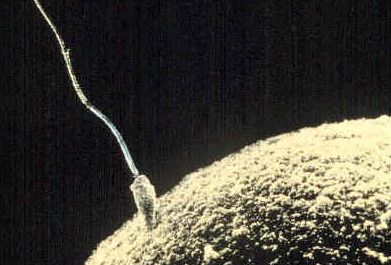
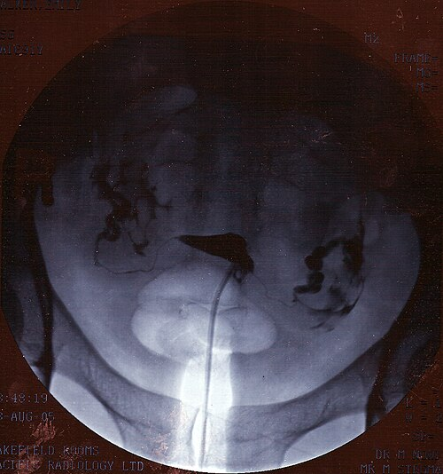

# PROPEDÊUTICA DO CASAL INFÉRTIL

Para começar nosso estudo, precisamos alinhar a mentalidade. Na prova de residência, e na vida prática, você não atende "uma mulher que não engravida", você atende um **casal**. A investigação é sempre simultânea. Se você pedir apenas exames para a mulher e esquecer o parceiro, você vai errar a questão e, pior, vai atrasar o diagnóstico do seu paciente.

*Figura 1 - Micrografia eletrônica de varredura mostrando espermatozoide fertilizando um óvulo. A investigação do casal infértil busca identificar fatores que impedem esse encontro. Fonte: Domínio Público | Wikimedia Commons*

## Definição e o "Timing" da Investigação

A primeira coisa que a banca vai testar é se você sabe quando começar a investigar. A definição clássica de infertilidade é a ausência de concepção após **12 meses** de relações sexuais regulares (2 a 3 vezes por semana) sem o uso de métodos contraceptivos.

Mas cuidado, aqui mora a primeira pegadinha. Esse prazo de um ano não é uma regra absoluta para todos. Como professor, já vi muitos alunos perderem pontos por não se atentarem à idade da paciente.

- **Mulheres com menos de 35 anos:** Aguardamos 12 meses.

- **Mulheres com 35 anos ou mais:** Iniciamos a investigação após **6 meses**. Por que? Porque a reserva ovariana cai vertiginosamente após os 35 anos. Não temos o luxo de esperar.

- **Investigação imediata:** Se houver um fator de risco óbvio, não se espera nada. Se a paciente tem história de Doença Inflamatória Pélvica (DIP) grave, amenorreia (não menstrua), cirurgias pélvicas prévias ou se o parceiro fez vasectomia ou teve orquite, a investigação começa no dia 1.

Lembre-se: Infertilidade **primária** é quando o casal nunca engravidou. Infertilidade **secundária** é quando já houve uma gestação prévia (mesmo que tenha sido aborto ou gestação ectópica), mas agora não conseguem mais. No MedEvo, sempre reforçamos que o fato de o homem já ter um filho de outro relacionamento não exclui a necessidade de um espermograma agora. A espermatogênese muda, o uso de substâncias muda, e o tempo passa para eles também.

## Epidemiologia e Causas: Onde está o problema?

As causas de infertilidade são distribuídas de forma quase equitativa, o que reforça a necessidade de olhar para os dois lados:

- **Fator Feminino (40 a 50%):** Aqui dividimos em causas ovulatórias (as mais comuns, cerca de 40% do fator feminino), tuboperitoneais, uterinas e cervicais.

- **Fator Masculino (30 a 40%):** Isolado ou associado ao fator feminino.

- **Infertilidade Sem Causa Aparente - ISCA (10 a 15%):** Quando a propedêutica básica é toda normal.

## A Propedêutica Básica (O "Feijão com Arroz")

Para a prova, você precisa decorar o que compõe a investigação inicial. Se a questão perguntar "qual o próximo passo" para um casal que tenta engravidar há 1 ano, você deve buscar os exames que avaliam os quatro pilares: ovariano, masculino, tubário e uterino.

### 1. Fator Masculino: O Espermograma

O espermograma é o exame inicial, mais simples e menos invasivo. Se o espermograma vier alterado, a conduta é **repetir o exame após 3 meses**. Por que 3 meses? Porque esse é o tempo aproximado de um ciclo de espermatogênese. Uma gripe forte ou estresse agudo pode alterar um exame pontual.

As bancas adoram os critérios de **Morfologia de Krueger**. Para ser considerado normal, o homem precisa ter pelo menos 4% de espermatozoides com morfologia estritamente normal.

| Parâmetro | Valor de Referência (OMS) | Termo para Alteração |
| --- | --- | --- |
| Volume | > 1,5 ml | Hipospermia |
| Concentração | > 15 milhões/ml | Oligozoospermia |
| Motilidade Total | > 40% | Astenozoospermia |
| Motilidade Progressiva | > 32% | Astenozoospermia |
| Morfologia (Krueger) | > 4% normais | Teratozoospermia |
| Vitalidade | > 58% vivos | Necrozoospermia |

**Pérola de prova:** O uso de cocaína, esteroides anabolizantes e o hábito de fumar maconha são causas frequentes de alteração na espermatogênese. Se a questão trouxer um homem jovem, "marombeiro", com espermograma alterado, pense em uso de testosterona exógena (que faz feedback negativo e zera a produção de esperma).

### 2. Fator Ovulatório: Ela está ovulando?

Se a mulher tem ciclos regulares (entre 25 e 35 dias), a chance de ela ser ovulatória é imensa. Se ela tem ciclos irregulares, obesidade e acne, pense em SOP.

Como confirmamos a ovulação?

- **Progesterona sérica:** Deve ser dosada na fase lútea média, idealmente no **21º dia** de um ciclo de 28 dias. Valores acima de 3 ng/ml sugerem ovulação, mas o ideal para uma gestação é que esteja acima de 10 ng/ml.

- **Ultrassonografia Transvaginal (USTV) Seriada:** É o melhor exame para acompanhar o crescimento folicular e ver o momento exato da rotura do folículo (ovulação).

- **Temperatura basal e teste de LH na urina:** São métodos menos precisos, mas podem ser citados. O pico de LH precede a ovulação em cerca de 24 a 36 horas.

### 3. Reserva Ovariana: Quantos óvulos restam?

Aqui é onde as bancas mais tentam te confundir. Avaliar se a mulher ovula é diferente de avaliar a reserva ovariana. A reserva nos diz a "quantidade" e o "tempo" que ela ainda tem.

- **FSH basal + Estradiol (3º ao 5º dia do ciclo):** É o marcador clássico. Um FSH > 10-15 mUI/ml sugere reserva baixa. **Atenção:** Sempre dosar o Estradiol junto. Se o Estradiol estiver muito alto (> 60-80 pg/ml), ele pode inibir o FSH por feedback negativo, mascarando uma reserva baixa (um FSH "falsamente normal").

- **Hormônio Antimülleriano (AMH):** É o melhor marcador bioquímico atual. Ele é produzido pelas células da granulosa de folículos pré-antrais e antrais pequenos. A grande vantagem? Pode ser dosado em **qualquer dia do ciclo**, pois não varia com as flutuações hormonais. Quanto mais baixo o AMH, menor a reserva.

- **Contagem de Folículos Antrais (CFA):** Realizada por USTV entre o 2º e 5º dia do ciclo. Contamos folículos entre 2 e 10 mm. Menos de 5 a 7 folículos no total (soma dos dois ovários) indica baixa reserva.

**Dica do Dr. Will:** Idade é o melhor preditor de **qualidade** oocitária. AMH e CFA são os melhores preditores de **quantidade** (resposta à estimulação ovariana).

### 4. Fator Tuboperitoneal: O caminho está livre?

A **Histerossalpingografia (HSG)** é o exame inicial para avaliar as tubas. É um exame radiológico com contraste iodado.

- **Prova de Cotte positiva:** Significa que o contraste extravasou para a cavidade peritoneal. Isso indica que ao menos uma tuba é pérvia (aberta).

- **Prova de Cotte negativa:** Sugere obstrução tubária.

**Cuidado:** A HSG tem alta sensibilidade para oclusão, mas pode dar falso-positivo por espasmo tubário na hora da dor do exame. Se a HSG mostrar obstrução ou se a paciente tiver suspeita de endometriose/aderências (ex: dor pélvica crônica, DIP prévia), o padrão-ouro é a **Videolaparoscopia**. No entanto, a laparoscopia NÃO é exame de rotina inicial por ser invasiva.

### 5. Fator Uterino: O "berço" está pronto?

A avaliação inicial é feita com a **Ultrassonografia Transvaginal**. Ela vê miomas, pólipos e malformações.

- **Mioma submucoso:** Sempre atrapalha a fertilidade (distorce a cavidade).

- **Mioma intramural:** Pode atrapalhar se for grande (> 4 cm) ou se distorcer a cavidade.

- **Mioma subseroso:** Geralmente **não** causa infertilidade. Se a questão disser que a paciente tem um mioma subseroso de 3 cm e o casal é infértil, procure outra causa!

Se a USTV sugerir algo dentro do útero, o padrão-ouro para avaliação da cavidade uterina é a **Histeroscopia**.

*Figura 2 - Histerossalpingografia (HSG): contraste preenchendo a cavidade uterina (triângulo central) e delineando as tubas uterinas. Exame fundamental na investigação do fator tuboperitoneal. Fonte: jemsweb, CC BY-SA 2.0 | Wikimedia Commons*

## Diagnóstico Diferencial e Situações Específicas

### Síndrome dos Ovários Policísticos (SOP)

É a causa mais comum de anovulação. O tratamento inicial para infertilidade na SOP envolve mudança de estilo de vida (perda de peso reduz o LH e a resistência insulínica, podendo restaurar a ovulação sozinha) e indução da ovulação, sendo o **Letrozol** atualmente a primeira escolha (superior ao Clomifeno em pacientes com IMC elevado).

### Endometriose

Suspeite sempre que houver tríade: Infertilidade + Dismenorreia intensa + Dispareunia. A HSG pode ser normal, mas a paciente não engravida por um ambiente inflamatório pélvico ou aderências que distorcem a anatomia. O diagnóstico definitivo e tratamento inicial da endometriose mínima/leve visando fertilidade é a laparoscopia.

### Hiperplasia Adrenal Congênita (Forma Não Clássica)

Pode mimetizar a SOP. O diagnóstico é feito pela dosagem da **17-OH-Progesterona**. Se vier alta, confirma o diagnóstico. É uma causa importante de fator ovulatório que as bancas amam cobrar como diagnóstico diferencial.

### Falência Ovariana Prematura (FOP)

Mulher < 40 anos com amenorreia, FSH > 25 UI/ml (em duas dosagens) e estradiol baixo. Aqui, a chance de gravidez com óvulos próprios é mínima. A conduta costuma ser Fertilização In Vitro (FIV) com **ovodoação**.

## Abortamento de Repetição

Diferente da infertilidade (dificuldade de engravidar), aqui o casal engravida, mas perde. Definimos como **2 ou mais perdas** gestacionais.

As principais causas que você deve investigar:

- **Causas Genéticas:** Cariótipo do casal. A alteração mais comum é a **translocação balanceada** (incluindo a Robertsoniana).

- **Causas Anatômicas:** Útero septado (malformação mulleriana com maior risco de aborto), sinéquias (Síndrome de Asherman), miomas submucosos.

- **Causas Imunológicas (SAF):** Síndrome do Anticorpo Antifosfolipídeo. Critérios: Trombose ou perdas gestacionais + Laboratório (Anticoagulante lúpico, Anticardiolipina ou Anti-beta2-glicoproteína I).

- **Causas Endócrinas:** TSH (hipotireoidismo) e Diabetes descompensada.

**Erro clássico de prova:** Achar que a mutação da MTHFR (metilenotetraidrofolato redutase) em heterozigose é causa de aborto de repetição. Não é! As diretrizes atuais não recomendam essa investigação de rotina para perdas gestacionais.

## Resumo de Condutas em Reprodução Assistida

Embora o foco seja a propedêutica, você precisa saber para onde encaminhar o casal após o diagnóstico:

- **Coito Programado:** Indicado para casos de anovulação (ex: SOP) onde as tubas são pérvias e o espermograma é normal.

- **Inseminação Intrauterina (IIU):** O sêmen é "lavado" e colocado dentro do útero. Exige que a mulher tenha pelo menos uma tuba pérvia e o sêmen tenha uma concentração mínima após o processamento (geralmente > 5 milhões de espermatozoides móveis).

- **Fertilização In Vitro (FIV) / ICSI:** Indicada para fator tubário bilateral (tubas obstruídas), fator masculino grave, endometriose severa ou falha nos tratamentos de baixa complexidade. A ICSI (Injeção Intracitoplasmática de Espermatozoides) é usada quando o sêmen é muito ruim (astenozoospermia severa), pois injetamos o espermatozoide direto no óvulo.

| Situação Clínica | Exame de Escolha / Conduta |
| --- | --- |
| Avaliação inicial da tuba | Histerossalpingografia |
| Avaliação padrão-ouro da cavidade uterina | Histeroscopia |
| Avaliação padrão-ouro do fator peritoneal | Videolaparoscopia |
| Confirmação de ovulação (bioquímica) | Progesterona no 21º dia |
| Melhor preditor de quantidade de óvulos | Hormônio Antimülleriano (AMH) |
| Primeiro exame no fator masculino | Espermograma |

## Pontos-Chave para Prova

- **Definição:** 12 meses se < 35 anos; 6 meses se ≥ 35 anos. Não espere se houver fator de risco conhecido.

- **Espermograma:** Sempre o primeiro exame. Se alterado, repetir em 3 meses antes de fechar diagnóstico.

- **Histerossalpingografia:** Essencial para avaliar perviedade tubária. Prova de Cotte positiva = contraste na cavidade = tubas pérvias.

- **Reserva Ovariana:** FSH basal (3º dia) > 10-15 ou AMH baixo ou CFA < 5-7 indicam mau prognóstico.

- **Idade:** É o fator isolado mais importante para o sucesso da gestação (qualidade dos óvulos).

- **SOP:** Causa frequente de infertilidade por anovulação. Investigar com dosagens hormonais e USTV.

- **Endometriose:** Suspeitar se infertilidade + dor pélvica. HSG pode ser normal.

- **Miomas:** Submucosos sempre interferem; subserosos raramente interferem.

- **SAF:** Investigar em abortos de repetição (≥ 2 ou 3 perdas). Exige critérios clínicos e laboratoriais.

- **MTHFR:** Mutação heterozigota 677C→T NÃO é fator de risco para aborto recorrente. Não marque isso como causa!

- **Laparoscopia:** Não é exame inicial de rotina. Reservada para casos de dúvida na HSG ou suspeita de patologia pélvica (endometriose/aderências).

- **Ressonância Magnética:** Raramente é necessária na investigação inicial de infertilidade. USTV e HSG resolvem a maioria dos casos.

- **FSH > 25 UI/ml:** Em mulheres com menos de 40 anos, sugere Insuficiência Ovariana Prematura.

- **Estilo de Vida:** Tabagismo, obesidade, álcool e drogas (cocaína/maconha) devem ser cessados imediatamente no casal tentante.

- **Ácido Fólico:** Deve ser iniciado pelo menos 30 dias antes da concepção para prevenir defeitos do tubo neural.

- **Varicocele:** É a causa tratável mais comum de infertilidade masculina. Diagnóstico é clínico (exame físico).

Ao seguir esse roteiro estruturado, você cobre mais de 95% das questões de prova sobre propedêutica do casal infértil. Lembre-se sempre: o casal é a unidade de tratamento. Investigação incompleta é o erro número um nas questões de residência.

 Cópia offline para consulta pessoal.
 Fonte original:
 [https://www.medevo.com.br/material-apoio/ler/fd2d4950-f7eb-485c-9192-20288b7f0bad](https://www.medevo.com.br/material-apoio/ler/fd2d4950-f7eb-485c-9192-20288b7f0bad)
